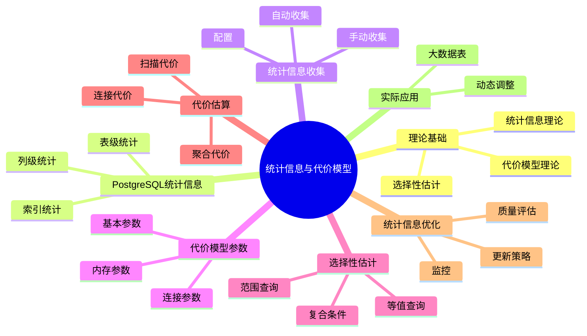

# PostgreSQL统计信息与代价模型完整指南

> **版本**: v3.0
> **最后更新**: 2025-01-15
> **版本覆盖**: PostgreSQL 18.x (推荐) ⭐ | 17.x (推荐) | 16.x (兼容)
> **难度**: ⭐⭐⭐⭐⭐
> **应用场景**: 查询优化、统计信息管理、代价模型调优、性能分析
> 🆕 **PostgreSQL 18统计改进**: 改进的多变量统计准确性、更精细的直方图、自适应统计信息更新、虚拟生成列统计优化

---

## 📑 目录

- [PostgreSQL统计信息与代价模型完整指南](#postgresql统计信息与代价模型完整指南)
  - [📑 目录](#-目录)
  - [📊 思维导图](#-思维导图)
  - [一、定义与形式化](#一定义与形式化)
    - [1.1 概念定义](#11-概念定义)
    - [1.2 形式化定义](#12-形式化定义)
    - [1.3 核心属性](#13-核心属性)
  - [二、知识矩阵对比](#二知识矩阵对比)
    - [2.1 统计信息类型对比](#21-统计信息类型对比)
    - [2.2 代价模型参数对比](#22-代价模型参数对比)
  - [三、理论基础](#三理论基础)
    - [3.1 统计信息理论](#31-统计信息理论)
    - [3.2 代价模型理论](#32-代价模型理论)
    - [3.3 选择性估计理论](#33-选择性估计理论)
  - [四、PostgreSQL统计信息](#四postgresql统计信息)
    - [4.1 表级统计信息](#41-表级统计信息)
    - [4.2 列级统计信息](#42-列级统计信息)
    - [4.3 索引统计信息](#43-索引统计信息)
  - [五、统计信息收集](#五统计信息收集)
    - [5.1 自动统计信息收集](#51-自动统计信息收集)
    - [5.2 手动统计信息收集](#52-手动统计信息收集)
    - [5.3 统计信息配置](#53-统计信息配置)
  - [六、代价模型参数](#六代价模型参数)
    - [6.1 基本代价参数](#61-基本代价参数)
    - [6.2 连接代价参数](#62-连接代价参数)
    - [6.3 内存代价参数](#63-内存代价参数)
  - [七、选择性估计](#七选择性估计)
    - [7.1 等值查询选择性](#71-等值查询选择性)
    - [7.2 范围查询选择性](#72-范围查询选择性)
    - [7.3 复合条件选择性](#73-复合条件选择性)
  - [八、代价估算分析](#八代价估算分析)
    - [8.1 扫描代价估算](#81-扫描代价估算)
    - [8.2 连接代价估算](#82-连接代价估算)
    - [8.3 聚合代价估算](#83-聚合代价估算)
  - [九、统计信息优化](#九统计信息优化)
    - [9.1 统计信息质量评估](#91-统计信息质量评估)
    - [9.2 统计信息更新策略](#92-统计信息更新策略)
    - [9.3 统计信息监控](#93-统计信息监控)
  - [十、实际应用案例](#十实际应用案例)
    - [10.1 大数据表统计信息管理](#101-大数据表统计信息管理)
    - [10.2 动态统计信息调整](#102-动态统计信息调整)
  - [十一、相关概念](#十一相关概念)
    - [11.1 上位概念](#111-上位概念)
    - [11.2 下位概念](#112-下位概念)
    - [11.3 平行概念](#113-平行概念)
  - [十二、参考资源](#十二参考资源)
    - [12.1 相关文档](#121-相关文档)
    - [12.2 参考文献](#122-参考文献)
    - [12.3 Wikidata对齐](#123-wikidata对齐)

---

## 📊 思维导图



---

## 一、定义与形式化

### 1.1 概念定义

**中文定义**: 统计信息是数据库系统中用于描述数据分布特征的信息，代价模型基于统计信息估算查询执行成本，为查询优化器提供决策依据。

**English Definition**: Statistics are information in database systems used to describe data distribution characteristics. Cost models estimate query execution costs based on statistics, providing decision-making basis for query optimizers.

### 1.2 形式化定义

```latex
% 数学符号定义
\newcommand{\stats}{\mathcal{S}}
\newcommand{\cost}{\mathcal{C}}
\newcommand{\query}{\mathcal{Q}}
\newcommand{\plan}{\mathcal{P}}

% 统计信息的形式化定义
\stats = \{n, \text{ndistinct}, \text{correlation}, \text{histogram}, \text{mcv}\}

其中：
n: 元组数量
\text{ndistinct}: 不同值数量
\text{correlation}: 列相关性
\text{histogram}: 直方图分布
\text{mcv}: 最常值

% 代价模型的形式化定义
\cost(\plan) = \cost_{IO}(\plan) + \cost_{CPU}(\plan) + \cost_{Memory}(\plan)
```

### 1.3 核心属性

- **准确性**: 统计信息反映真实数据分布
- **时效性**: 统计信息及时更新
- **完整性**: 覆盖所有相关数据特征
- **可扩展性**: 支持复杂查询代价估算

---

## 二、知识矩阵对比

### 2.1 统计信息类型对比

| 统计信息类型 | 描述 | 用途 | 更新频率 | 存储开销 |
|------------|------|------|---------|---------|
| 表级统计 | 行数、页数 | 基数估计 | 中 | 低 |
| 列级统计 | 不同值数、相关性 | 选择性估计 | 高 | 中 |
| 直方图 | 值分布 | 范围查询 | 高 | 中 |
| MCV | 最常值 | 等值查询 | 高 | 低 |
| 多变量统计 | 列相关性 | 复合条件 | 低 | 高 |
| 表达式统计 | 表达式分布 | 表达式索引 | 中 | 中 |

### 2.2 代价模型参数对比

| 代价参数 | 默认值 | 影响范围 | 调优建议 | PostgreSQL版本 |
|---------|--------|---------|---------|---------------|
| seq_page_cost | 1.0 | 顺序扫描 | 根据磁盘类型调整 | 所有版本 |
| random_page_cost | 4.0 | 随机I/O | SSD: 1.1-1.5 | 所有版本 |
| cpu_tuple_cost | 0.01 | CPU处理 | 通常不调整 | 所有版本 |
| cpu_index_tuple_cost | 0.005 | 索引扫描 | 通常不调整 | 所有版本 |
| cpu_operator_cost | 0.0025 | 操作符 | 通常不调整 | 所有版本 |
| parallel_tuple_cost | 0.1 | 并行查询 | 根据并行度调整 | 9.6+ |
| parallel_setup_cost | 1000.0 | 并行启动 | 根据并行度调整 | 9.6+ |

---

## 三、理论基础

### 3.1 统计信息理论

```latex
\begin{theorem}[统计信息完备性]
统计信息完备性要求：
1. 基数估计：|R| 的准确估计
2. 选择性估计：\frac{|\sigma_p(R)|}{|R|} 的准确估计
3. 相关性估计：列间相关性的准确估计
4. 分布估计：数据分布的准确估计
\end{theorem}
```

### 3.2 代价模型理论

```latex
\begin{theorem}[代价模型正确性]
代价模型满足以下性质：
1. 单调性：\cost(\plan_1) \leq \cost(\plan_2) \Rightarrow \text{性能}(\plan_1) \geq \text{性能}(\plan_2)
2. 可加性：\cost(\plan_1 \bowtie \plan_2) = \cost(\plan_1) + \cost(\plan_2) + \cost_{join}
3. 一致性：相同操作的代价估算一致
\end{theorem}
```

### 3.3 选择性估计理论

```latex
\begin{theorem}[选择性估计]
对于谓词 p，选择性估计为：
\text{sel}(p) = \frac{|\sigma_p(R)|}{|R|}

其中选择性估计的准确性直接影响查询优化效果。
\end{theorem}
```

---

## 四、PostgreSQL统计信息

### 4.1 表级统计信息

```sql
-- 查看表统计信息
SELECT
    schemaname,
    tablename,
    n_tup_ins,
    n_tup_upd,
    n_tup_del,
    n_live_tup,
    n_dead_tup,
    last_vacuum,
    last_autovacuum,
    last_analyze,
    last_autoanalyze
FROM pg_stat_user_tables
WHERE tablename = 'employees';

-- 查看表大小统计
SELECT
    schemaname,
    tablename,
    pg_size_pretty(pg_total_relation_size(schemaname||'.'||tablename)) as total_size,
    pg_size_pretty(pg_relation_size(schemaname||'.'||tablename)) as table_size,
    pg_size_pretty(pg_indexes_size(schemaname||'.'||tablename)) as indexes_size
FROM pg_tables
WHERE tablename = 'employees';
```

### 4.2 列级统计信息

```sql
-- 查看列统计信息
SELECT
    schemaname,
    tablename,
    attname,
    n_distinct,
    correlation,
    most_common_vals,
    most_common_freqs,
    histogram_bounds
FROM pg_stats
WHERE schemaname = 'public' AND tablename = 'employees';

-- 查看特定列统计
SELECT
    attname,
    n_distinct,
    correlation,
    array_length(most_common_vals, 1) as mcv_count,
    array_length(histogram_bounds, 1) as histogram_buckets
FROM pg_stats
WHERE schemaname = 'public'
AND tablename = 'employees'
AND attname = 'salary';
```

### 4.3 索引统计信息

```sql
-- 查看索引统计信息
SELECT
    schemaname,
    tablename,
    indexname,
    idx_scan,
    idx_tup_read,
    idx_tup_fetch,
    idx_blks_read,
    idx_blks_hit
FROM pg_statio_user_indexes
WHERE tablename = 'employees';

-- 索引使用效率
SELECT
    indexname,
    idx_scan,
    idx_tup_read,
    idx_tup_fetch,
    round(100.0 * idx_blks_hit / (idx_blks_hit + idx_blks_read), 2) as hit_ratio
FROM pg_statio_user_indexes
WHERE tablename = 'employees'
ORDER BY idx_scan DESC;
```

---

## 五、统计信息收集

### 5.1 自动统计信息收集

```sql
-- 查看自动统计信息配置
SHOW autovacuum;
SHOW autovacuum_analyze_threshold;
SHOW autovacuum_analyze_scale_factor;

-- 配置自动统计信息
ALTER TABLE employees SET (autovacuum_analyze_threshold = 50);
ALTER TABLE employees SET (autovacuum_analyze_scale_factor = 0.1);

-- 查看统计信息收集状态
SELECT
    schemaname,
    tablename,
    last_analyze,
    last_autoanalyze,
    analyze_count,
    autoanalyze_count
FROM pg_stat_user_tables
WHERE tablename = 'employees';
```

### 5.2 手动统计信息收集

```sql
-- 手动收集统计信息
ANALYZE employees;
ANALYZE employees (salary, dept_id);
ANALYZE VERBOSE employees;

-- 收集所有表统计信息
ANALYZE;

-- 查看统计信息收集进度
SELECT
    pid,
    datname,
    usename,
    application_name,
    state,
    query
FROM pg_stat_activity
WHERE query LIKE '%ANALYZE%';
```

### 5.3 统计信息配置

```sql
-- 统计信息配置参数
SHOW default_statistics_target;
SHOW n_distinct;
SHOW correlation;

-- 设置统计信息目标
ALTER TABLE employees ALTER COLUMN salary SET STATISTICS 1000;
ALTER TABLE employees ALTER COLUMN dept_id SET STATISTICS 100;

-- 查看列统计信息目标
SELECT
    attname,
    attstattarget
FROM pg_attribute
WHERE attrelid = 'employees'::regclass
AND attnum > 0
AND NOT attisdropped;
```

---

## 六、代价模型参数

### 6.1 基本代价参数

```sql
-- 查看基本代价参数
SHOW seq_page_cost;
SHOW random_page_cost;
SHOW cpu_tuple_cost;
SHOW cpu_index_tuple_cost;
SHOW cpu_operator_cost;

-- 设置代价参数
SET seq_page_cost = 1.0;
SET random_page_cost = 4.0;
SET cpu_tuple_cost = 0.01;
SET cpu_index_tuple_cost = 0.005;
SET cpu_operator_cost = 0.0025;
```

### 6.2 连接代价参数

```sql
-- 查看连接代价参数
SHOW join_collapse_limit;
SHOW from_collapse_limit;
SHOW geqo;
SHOW geqo_threshold;

-- 设置连接代价
SET join_collapse_limit = 8;
SET from_collapse_limit = 8;
SET geqo = on;
SET geqo_threshold = 12;
```

### 6.3 内存代价参数

```sql
-- 查看内存代价参数
SHOW work_mem;
SHOW maintenance_work_mem;
SHOW effective_cache_size;

-- 设置内存参数
SET work_mem = '256MB';
SET maintenance_work_mem = '1GB';
SET effective_cache_size = '8GB';
```

---

## 七、选择性估计

### 7.1 等值查询选择性

```sql
-- 等值查询选择性估计
EXPLAIN (ANALYZE, BUFFERS, VERBOSE)
SELECT * FROM employees WHERE emp_id = 1001;

-- 查看选择性估计
SELECT
    attname,
    n_distinct,
    most_common_vals,
    most_common_freqs
FROM pg_stats
WHERE schemaname = 'public'
AND tablename = 'employees'
AND attname = 'emp_id';
```

### 7.2 范围查询选择性

```sql
-- 范围查询选择性估计
EXPLAIN (ANALYZE, BUFFERS, VERBOSE)
SELECT * FROM employees WHERE salary BETWEEN 40000 AND 60000;

-- 查看直方图信息
SELECT
    attname,
    histogram_bounds
FROM pg_stats
WHERE schemaname = 'public'
AND tablename = 'employees'
AND attname = 'salary';
```

### 7.3 复合条件选择性

```sql
-- 复合条件选择性估计
EXPLAIN (ANALYZE, BUFFERS, VERBOSE)
SELECT * FROM employees
WHERE dept_id = 1 AND salary > 50000;

-- 查看列相关性
SELECT
    attname,
    correlation
FROM pg_stats
WHERE schemaname = 'public'
AND tablename = 'employees'
AND attname IN ('dept_id', 'salary');
```

---

## 八、代价估算分析

### 8.1 扫描代价估算

```sql
-- 顺序扫描代价
EXPLAIN (ANALYZE, BUFFERS, VERBOSE)
SELECT * FROM employees;

-- 索引扫描代价
EXPLAIN (ANALYZE, BUFFERS, VERBOSE)
SELECT * FROM employees WHERE emp_id = 1001;

-- 位图扫描代价
EXPLAIN (ANALYZE, BUFFERS, VERBOSE)
SELECT * FROM employees WHERE dept_id = 1 AND salary > 50000;
```

### 8.2 连接代价估算

```sql
-- 嵌套循环连接代价
EXPLAIN (ANALYZE, BUFFERS, VERBOSE)
SELECT e.name, d.dept_name
FROM employees e, departments d
WHERE e.dept_id = d.dept_id;

-- 哈希连接代价
EXPLAIN (ANALYZE, BUFFERS, VERBOSE)
SELECT e.name, d.dept_name
FROM employees e
JOIN departments d ON e.dept_id = d.dept_id;

-- 合并连接代价
EXPLAIN (ANALYZE, BUFFERS, VERBOSE)
SELECT e.name, d.dept_name
FROM employees e
JOIN departments d ON e.dept_id = d.dept_id
ORDER BY e.dept_id;
```

### 8.3 聚合代价估算

```sql
-- 哈希聚合代价
EXPLAIN (ANALYZE, BUFFERS, VERBOSE)
SELECT dept_id, COUNT(*), AVG(salary)
FROM employees
GROUP BY dept_id;

-- 排序聚合代价
EXPLAIN (ANALYZE, BUFFERS, VERBOSE)
SELECT dept_id, COUNT(*), AVG(salary)
FROM employees
GROUP BY dept_id
ORDER BY dept_id;
```

---

## 九、统计信息优化

### 9.1 统计信息质量评估

```sql
-- 统计信息质量评估
SELECT
    schemaname,
    tablename,
    attname,
    n_distinct,
    correlation,
    CASE
        WHEN n_distinct = -1 THEN 'ALL_DISTINCT'
        WHEN n_distinct = 0 THEN 'NO_DISTINCT'
        ELSE 'PARTIAL_DISTINCT'
    END as distinct_status,
    CASE
        WHEN correlation IS NULL THEN 'NO_CORRELATION'
        WHEN abs(correlation) > 0.8 THEN 'HIGH_CORRELATION'
        WHEN abs(correlation) > 0.5 THEN 'MEDIUM_CORRELATION'
        ELSE 'LOW_CORRELATION'
    END as correlation_status
FROM pg_stats
WHERE schemaname = 'public'
ORDER BY tablename, attname;
```

### 9.2 统计信息更新策略

```sql
-- 创建统计信息更新函数
CREATE OR REPLACE FUNCTION update_table_stats(table_name text)
RETURNS void AS $$
BEGIN
    EXECUTE format('ANALYZE %I', table_name);
    RAISE NOTICE 'Updated statistics for table: %', table_name;
END;
$$ LANGUAGE plpgsql;

-- 批量更新统计信息
DO $$
DECLARE
    r RECORD;
BEGIN
    FOR r IN
        SELECT tablename
        FROM pg_tables
        WHERE schemaname = 'public'
    LOOP
        PERFORM update_table_stats(r.tablename);
    END LOOP;
END $$;
```

### 9.3 统计信息监控

```sql
-- 统计信息监控
CREATE OR REPLACE FUNCTION monitor_stats()
RETURNS TABLE(
    table_name text,
    last_analyze timestamp,
    analyze_count bigint,
    autoanalyze_count bigint,
    days_since_analyze numeric
) AS $$
BEGIN
    RETURN QUERY
    SELECT
        t.tablename::text,
        s.last_analyze,
        s.analyze_count,
        s.autoanalyze_count,
        EXTRACT(EPOCH FROM (NOW() - s.last_analyze)) / 86400 as days_since_analyze
    FROM pg_tables t
    LEFT JOIN pg_stat_user_tables s ON t.tablename = s.tablename
    WHERE t.schemaname = 'public'
    ORDER BY days_since_analyze DESC NULLS LAST;
END;
$$ LANGUAGE plpgsql;

-- 使用监控函数
SELECT * FROM monitor_stats();
```

---

## 十、实际应用案例

### 10.1 大数据表统计信息管理

```sql
-- 大表统计信息管理
CREATE TABLE large_table (
    id BIGSERIAL PRIMARY KEY,
    category_id INTEGER,
    value DECIMAL(10,2),
    created_at TIMESTAMP DEFAULT NOW()
);

-- 分区表统计信息
CREATE TABLE log_entries (
    id BIGSERIAL,
    log_time TIMESTAMP,
    level VARCHAR(10),
    message TEXT
) PARTITION BY RANGE (log_time);

-- 为分区表收集统计信息
DO $$
DECLARE
    r RECORD;
BEGIN
    FOR r IN
        SELECT schemaname, tablename
        FROM pg_tables
        WHERE tablename LIKE 'log_entries_%'
    LOOP
        EXECUTE format('ANALYZE %I.%I', r.schemaname, r.tablename);
    END LOOP;
END $$;
```

### 10.2 动态统计信息调整

```sql
-- 动态调整统计信息目标
CREATE OR REPLACE FUNCTION adjust_stats_target(table_name text, column_name text, target integer)
RETURNS void AS $$
BEGIN
    EXECUTE format('ALTER TABLE %I ALTER COLUMN %I SET STATISTICS %s',
                   table_name, column_name, target);
    EXECUTE format('ANALYZE %I', table_name);
    RAISE NOTICE 'Adjusted statistics target for %.% to %', table_name, column_name, target;
END;
$$ LANGUAGE plpgsql;

-- 使用动态调整
SELECT adjust_stats_target('employees', 'salary', 1000);
SELECT adjust_stats_target('employees', 'dept_id', 100);
```

---

## 十一、相关概念

### 11.1 上位概念

- **查询优化**: 更广泛的查询优化机制
- **数据库统计**: 数据库统计信息管理
- **性能分析**: 性能分析和优化

### 11.2 下位概念

- **直方图**: 数据分布表示
- **相关性**: 列间关系度量
- **选择性**: 查询条件选择性
- **基数估计**: 结果集大小估计

### 11.3 平行概念

- **采样**: 数据采样技术
- **近似算法**: 近似统计算法
- **机器学习**: 基于ML的统计估计

---

## 十二、参考资源

### 12.1 相关文档

- [查询优化器原理](./02.01-查询优化器原理.md) - 查询优化理论基础
- [索引结构与优化](./02.02-索引结构与优化.md) - 索引统计信息
- [执行计划与性能调优](./02.04-执行计划与性能调优.md) - 执行计划分析
- [性能调优实践](../04-部署运维/04.06-性能调优实践.md) - 性能优化实践

### 12.2 参考文献

1. Ioannidis, Y. E. (1996). Query optimization. ACM Computing Surveys, 28(1), 121-123.
2. PostgreSQL Global Development Group. (2025). PostgreSQL 18 Documentation. <https://www.postgresql.org/docs/18/>
3. Selinger, P. G., et al. (1979). Access path selection in a relational database management system. ACM SIGMOD Record, 8(2), 23-34.
4. Chaudhuri, S. (1998). An overview of query optimization in relational systems. ACM PODS, 34-43.
5. PostgreSQL Global Development Group. (2024). PostgreSQL 17 Documentation. <https://www.postgresql.org/docs/17/>

### 12.3 Wikidata对齐

- **Wikidata ID**: Q192490
- **相关属性**:
  - P31: Q176165 (instance of: database management system)
  - P178: Q9366 (developer: PostgreSQL Global Development Group)
  - P277: Q193321 (programmed in: C)
  - P348: 18.0 (software version)
- **外部链接**:
  - <https://www.postgresql.org/docs/current/planner-stats.html>
  - <https://www.postgresql.org/docs/current/runtime-config-query.html>
