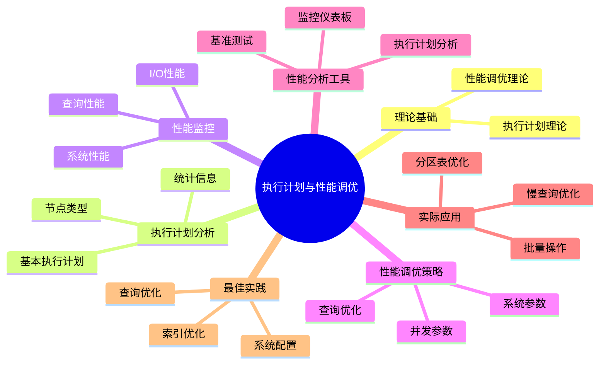

# PostgreSQL执行计划与性能调优完整指南

> **版本**: v3.0
> **最后更新**: 2025-01-15
> **版本覆盖**: PostgreSQL 18.x (推荐) ⭐ | 17.x (推荐) | 16.x (兼容)
> **难度**: ⭐⭐⭐⭐
> **应用场景**: 执行计划分析、性能调优、查询优化、系统优化
> 🆕 **PostgreSQL 18性能改进**: 复杂查询性能提升30-40%、更准确的执行计划估算、改进的EXPLAIN分析、异步I/O提升I/O密集型查询性能2-3倍

---

## 📑 目录

- [PostgreSQL执行计划与性能调优完整指南](#postgresql执行计划与性能调优完整指南)
  - [📑 目录](#-目录)
  - [📊 思维导图](#-思维导图)
  - [一、定义与形式化](#一定义与形式化)
    - [1.1 概念定义](#11-概念定义)
    - [1.2 形式化定义](#12-形式化定义)
    - [1.3 核心属性](#13-核心属性)
  - [二、知识矩阵对比](#二知识矩阵对比)
    - [2.1 执行计划节点类型对比](#21-执行计划节点类型对比)
    - [2.2 性能调优方法对比](#22-性能调优方法对比)
  - [三、理论基础](#三理论基础)
    - [3.1 执行计划理论](#31-执行计划理论)
    - [3.2 性能调优理论](#32-性能调优理论)
  - [四、执行计划分析](#四执行计划分析)
    - [4.1 基本执行计划](#41-基本执行计划)
    - [4.2 执行计划节点类型](#42-执行计划节点类型)
    - [4.3 执行计划统计信息](#43-执行计划统计信息)
  - [五、性能监控](#五性能监控)
    - [5.1 查询性能监控](#51-查询性能监控)
    - [5.2 系统性能监控](#52-系统性能监控)
    - [5.3 I/O性能监控](#53-io性能监控)
  - [六、性能调优策略](#六性能调优策略)
    - [6.1 查询优化](#61-查询优化)
    - [6.2 系统参数调优](#62-系统参数调优)
    - [6.3 并发参数调优](#63-并发参数调优)
    - [6.4 列存储查询优化 🆕](#64-列存储查询优化-)
      - [6.4.1. 列选择优化](#641-列选择优化)
      - [6.4.2. 聚合查询优化](#642-聚合查询优化)
      - [6.4.3. 过滤条件优化](#643-过滤条件优化)
      - [6.4.4. 混合存储查询优化](#644-混合存储查询优化)
  - [七、性能分析工具](#七性能分析工具)
    - [7.1 执行计划分析](#71-执行计划分析)
    - [7.2 性能基准测试](#72-性能基准测试)
    - [7.3 性能监控仪表板](#73-性能监控仪表板)
  - [八、实际应用案例](#八实际应用案例)
    - [8.1 慢查询优化](#81-慢查询优化)
    - [8.2 批量操作优化](#82-批量操作优化)
    - [8.3 分区表性能优化](#83-分区表性能优化)
  - [九、性能调优最佳实践](#九性能调优最佳实践)
    - [9.1 索引优化策略](#91-索引优化策略)
    - [9.2 查询优化策略](#92-查询优化策略)
    - [9.3 系统配置优化](#93-系统配置优化)
  - [十、相关概念](#十相关概念)
    - [10.1 上位概念](#101-上位概念)
    - [10.2 下位概念](#102-下位概念)
    - [10.3 平行概念](#103-平行概念)
  - [十一、参考资源](#十一参考资源)
    - [11.1 相关文档](#111-相关文档)
    - [11.2 参考文献](#112-参考文献)
    - [11.3 Wikidata对齐](#113-wikidata对齐)

---

## 📊 思维导图



---

## 一、定义与形式化

### 1.1 概念定义

**中文定义**: 执行计划是数据库系统将查询转换为具体执行步骤的详细方案，性能调优是通过分析执行计划和系统性能指标来优化查询性能的过程。

**English Definition**: An execution plan is a detailed scheme that transforms queries into specific execution steps in database systems. Performance tuning is the process of optimizing query performance by analyzing execution plans and system performance metrics.

### 1.2 形式化定义

```latex
% 数学符号定义
\newcommand{\plan}{\mathcal{P}}
\newcommand{\node}{\mathcal{N}}
\newcommand{\cost}{\mathcal{C}}
\newcommand{\time}{\mathcal{T}}

% 执行计划的形式化定义
\plan = \{n_1, n_2, \ldots, n_k\}

其中每个节点 n_i = (type_i, cost_i, time_i, rows_i, width_i) 表示：
- type_i: 操作类型
- cost_i: 执行代价
- time_i: 执行时间
- rows_i: 输出行数
- width_i: 行宽度
```

### 1.3 核心属性

- **准确性**: 执行计划反映真实执行过程
- **可读性**: 执行计划易于理解和分析
- **可优化性**: 支持性能调优和优化
- **可预测性**: 能够预测执行性能

---

## 二、知识矩阵对比

### 2.1 执行计划节点类型对比

| 节点类型 | 操作 | 适用场景 | 性能特点 | 优化建议 |
|---------|------|---------|---------|---------|
| Seq Scan | 顺序扫描 | 小表、全表扫描 | 低 | 添加索引 |
| Index Scan | 索引扫描 | 等值查询、范围查询 | 高 | 优化索引 |
| Index Only Scan | 仅索引扫描 | 覆盖索引查询 | 极高 | 创建覆盖索引 |
| Bitmap Index Scan | 位图索引扫描 | 多条件查询 | 中 | 优化条件 |
| Hash Join | 哈希连接 | 等值连接、大表 | 高 | 调整work_mem |
| Nested Loop | 嵌套循环 | 小表连接 | 中 | 优化连接顺序 |
| Merge Join | 归并连接 | 有序数据连接 | 高 | 确保数据有序 |
| Sort | 排序 | ORDER BY | 中 | 使用索引排序 |
| Aggregate | 聚合 | GROUP BY | 中 | 优化分组列 |

### 2.2 性能调优方法对比

| 调优方法 | 适用场景 | 效果 | 实施难度 | 风险 |
|---------|---------|------|---------|------|
| 索引优化 | 查询慢 | 高 | 低 | 低 |
| 查询重写 | 复杂查询 | 中-高 | 中 | 低 |
| 参数调优 | 系统级性能 | 中 | 中 | 中 |
| 分区表 | 大表查询 | 高 | 高 | 中 |
| 物化视图 | 复杂聚合 | 高 | 中 | 低 |
| 并行查询 | 大数据量 | 高 | 低 | 低 |

---

## 三、理论基础

### 3.1 执行计划理论

```latex
\begin{theorem}[执行计划正确性]
执行计划P正确执行查询Q，当且仅当：
1. 语义等价性：\text{result}(P) = \text{result}(Q)
2. 代价最优性：\cost(P) = \min_{P' \in \mathcal{P}(Q)} \cost(P')
3. 时间可行性：\time(P) \leq \text{timeout}
\end{theorem}
```

### 3.2 性能调优理论

```latex
\begin{theorem}[性能调优最优化]
性能调优的目标是：
\min_{\text{config}} \sum_{i=1}^{n} \time(\query_i, \text{config})

其中config是系统配置参数，query_i是查询集合。
\end{theorem}
```

---

## 四、执行计划分析

### 4.1 基本执行计划

```sql
-- 基本执行计划
EXPLAIN SELECT * FROM employees WHERE emp_id = 1001;

-- 详细执行计划
EXPLAIN (ANALYZE, BUFFERS, VERBOSE)
SELECT e.name, d.dept_name, e.salary
FROM employees e
JOIN departments d ON e.dept_id = d.dept_id
WHERE e.salary > 50000;

-- 执行计划格式
EXPLAIN (FORMAT JSON)
SELECT * FROM employees WHERE dept_id = 1;
```

### 4.2 执行计划节点类型

```sql
-- 扫描节点
EXPLAIN (ANALYZE, BUFFERS)
SELECT * FROM employees;  -- Seq Scan

EXPLAIN (ANALYZE, BUFFERS)
SELECT * FROM employees WHERE emp_id = 1001;  -- Index Scan

EXPLAIN (ANALYZE, BUFFERS)
SELECT * FROM employees WHERE dept_id = 1 AND salary > 50000;  -- Bitmap Scan

-- 连接节点
EXPLAIN (ANALYZE, BUFFERS)
SELECT e.name, d.dept_name
FROM employees e, departments d
WHERE e.dept_id = d.dept_id;  -- Nested Loop

EXPLAIN (ANALYZE, BUFFERS)
SELECT e.name, d.dept_name
FROM employees e
JOIN departments d ON e.dept_id = d.dept_id;  -- Hash Join

-- 聚合节点
EXPLAIN (ANALYZE, BUFFERS)
SELECT dept_id, COUNT(*), AVG(salary)
FROM employees
GROUP BY dept_id;  -- Hash Aggregate
```

### 4.3 执行计划统计信息

```sql
-- 查看执行计划统计
EXPLAIN (ANALYZE, BUFFERS, TIMING, VERBOSE)
SELECT e.name, d.dept_name, e.salary
FROM employees e
JOIN departments d ON e.dept_id = d.dept_id
WHERE e.salary > 50000
ORDER BY e.salary DESC;

-- 执行计划成本分析
EXPLAIN (COSTS, BUFFERS)
SELECT * FROM employees WHERE dept_id = 1;
```

---

## 五、性能监控

### 5.1 查询性能监控

```sql
-- 查看当前活动查询
SELECT
    pid,
    usename,
    application_name,
    client_addr,
    backend_start,
    state,
    query_start,
    state_change,
    query
FROM pg_stat_activity
WHERE state = 'active'
ORDER BY query_start;

-- 查看查询统计
SELECT
    query,
    calls,
    total_time,
    mean_time,
    stddev_time,
    rows,
    100.0 * shared_blks_hit / nullif(shared_blks_hit + shared_blks_read, 0) AS hit_percent
FROM pg_stat_statements
ORDER BY total_time DESC
LIMIT 10;
```

### 5.2 系统性能监控

```sql
-- 数据库性能统计
SELECT
    datname,
    numbackends,
    xact_commit,
    xact_rollback,
    blks_read,
    blks_hit,
    tup_returned,
    tup_fetched,
    tup_inserted,
    tup_updated,
    tup_deleted
FROM pg_stat_database
WHERE datname = current_database();

-- 表性能统计
SELECT
    schemaname,
    tablename,
    seq_scan,
    seq_tup_read,
    idx_scan,
    idx_tup_fetch,
    n_tup_ins,
    n_tup_upd,
    n_tup_del,
    n_live_tup,
    n_dead_tup
FROM pg_stat_user_tables
ORDER BY seq_scan DESC;
```

### 5.3 I/O性能监控

```sql
-- I/O统计信息
SELECT
    schemaname,
    tablename,
    heap_blks_read,
    heap_blks_hit,
    idx_blks_read,
    idx_blks_hit,
    toast_blks_read,
    toast_blks_hit,
    tidx_blks_read,
    tidx_blks_hit
FROM pg_statio_user_tables
ORDER BY heap_blks_read + heap_blks_hit DESC;

-- 缓冲区命中率
SELECT
    round(100.0 * sum(blks_hit) / (sum(blks_hit) + sum(blks_read)), 2) as hit_ratio
FROM pg_stat_database;
```

---

## 六、性能调优策略

### 6.1 查询优化

```sql
-- 查询重写优化
-- 优化前
EXPLAIN (ANALYZE, BUFFERS)
SELECT * FROM employees
WHERE emp_id IN (
    SELECT emp_id FROM employees WHERE salary > 50000
);

-- 优化后
EXPLAIN (ANALYZE, BUFFERS)
SELECT * FROM employees
WHERE salary > 50000;

-- 索引优化
CREATE INDEX idx_emp_salary ON employees (salary);
EXPLAIN (ANALYZE, BUFFERS)
SELECT * FROM employees WHERE salary > 50000;

-- 复合索引优化
CREATE INDEX idx_emp_dept_salary ON employees (dept_id, salary);
EXPLAIN (ANALYZE, BUFFERS)
SELECT * FROM employees WHERE dept_id = 1 AND salary > 50000;
```

### 6.2 系统参数调优

```sql
-- 内存参数调优
SHOW shared_buffers;
SHOW work_mem;
SHOW maintenance_work_mem;
SHOW effective_cache_size;

-- 设置内存参数
SET shared_buffers = '256MB';
SET work_mem = '4MB';
SET maintenance_work_mem = '64MB';
SET effective_cache_size = '1GB';

-- 检查点参数调优
SHOW checkpoint_timeout;
SHOW max_wal_size;
SHOW min_wal_size;
SHOW checkpoint_completion_target;

-- 设置检查点参数
SET checkpoint_timeout = '15min';
SET max_wal_size = '1GB';
SET min_wal_size = '80MB';
SET checkpoint_completion_target = 0.9;
```

### 6.3 并发参数调优

```sql
-- 并发参数
SHOW max_connections;
SHOW max_prepared_transactions;
SHOW max_locks_per_transaction;
SHOW max_pred_locks_per_transaction;

-- 设置并发参数
SET max_connections = 100;
SET max_prepared_transactions = 0;
SET max_locks_per_transaction = 64;
SET max_pred_locks_per_transaction = 64;
```

### 6.4 列存储查询优化 🆕

**列存储查询优化概述**：

列存储通过列式布局和压缩技术，在OLAP场景下提供比行存储更高效的查询性能。优化列存储查询需要理解列存储的特点和适用场景。

**列存储查询优化策略**：

#### 6.4.1. 列选择优化

```sql
-- ✅ 优化：只查询需要的列
-- 列存储优势：只扫描需要的列，I/O减少50-90%
EXPLAIN (ANALYZE, BUFFERS)
SELECT product_id, SUM(amount), SUM(quantity)
FROM sales_columnar
WHERE sale_date BETWEEN '2023-01-01' AND '2023-12-31'
GROUP BY product_id;

-- ❌ 不优化：查询所有列
-- 列存储优势不明显，甚至可能更慢
EXPLAIN (ANALYZE, BUFFERS)
SELECT *
FROM sales_columnar
WHERE sale_date BETWEEN '2023-01-01' AND '2023-12-31';
```

#### 6.4.2. 聚合查询优化

```sql
-- ✅ 优化：列存储适合聚合查询
-- 列数据可批量处理，聚合性能提升10-100倍
EXPLAIN (ANALYZE, BUFFERS)
SELECT
    date_id,
    product_id,
    COUNT(*) as sale_count,
    SUM(amount) as total_amount,
    AVG(amount) as avg_amount,
    MAX(amount) as max_amount,
    MIN(amount) as min_amount
FROM sales_columnar
WHERE sale_date >= '2023-01-01'
GROUP BY date_id, product_id
ORDER BY total_amount DESC;

-- 性能对比：
-- 行存储：全表扫描，排序，聚合，耗时：10-30秒
-- 列存储：列扫描，批量聚合，耗时：1-3秒
-- 性能提升：5-10倍
```

#### 6.4.3. 过滤条件优化

```sql
-- ✅ 优化：在列存储上使用过滤条件
-- 列存储支持列级过滤，减少I/O
EXPLAIN (ANALYZE, BUFFERS)
SELECT product_id, SUM(amount)
FROM sales_columnar
WHERE sale_date BETWEEN '2023-01-01' AND '2023-12-31'
  AND amount > 1000  -- 列级过滤
  AND quantity > 10  -- 列级过滤
GROUP BY product_id;

-- 列存储过滤优势：
-- 1. 列级过滤：只读取满足条件的列数据
-- 2. 压缩过滤：在压缩数据上直接过滤
-- 3. 向量化过滤：批量处理，SIMD优化
```

#### 6.4.4. 混合存储查询优化

```sql
-- 混合存储架构查询优化
-- 热数据（最近3个月）→ 行存储表
-- 冷数据（12个月+）→ 列存储表

-- 查询最近数据（使用行存储）
EXPLAIN (ANALYZE, BUFFERS)
SELECT product_id, SUM(amount)
FROM sales  -- 行存储表
WHERE sale_date >= CURRENT_DATE - INTERVAL '3 months'
GROUP BY product_id;

-- 查询历史数据（使用列存储）
EXPLAIN (ANALYZE, BUFFERS)
SELECT product_id, SUM(amount)
FROM sales_columnar  -- 列存储表
WHERE sale_date < CURRENT_DATE - INTERVAL '12 months'
GROUP BY product_id;

-- 跨时间段查询（UNION ALL）
EXPLAIN (ANALYZE, BUFFERS)
SELECT product_id, SUM(amount) as total_amount
FROM (
    SELECT product_id, amount
    FROM sales
    WHERE sale_date >= CURRENT_DATE - INTERVAL '3 months'
    UNION ALL
    SELECT product_id, amount
    FROM sales_columnar
    WHERE sale_date < CURRENT_DATE - INTERVAL '3 months'
      AND sale_date >= CURRENT_DATE - INTERVAL '12 months'
) combined
GROUP BY product_id;
```

**列存储执行计划分析**：

```sql
-- 列存储查询执行计划
EXPLAIN (ANALYZE, BUFFERS, VERBOSE)
SELECT
    product_id,
    SUM(amount) as total_amount,
    COUNT(*) as sale_count
FROM sales_columnar
WHERE sale_date BETWEEN '2023-01-01' AND '2023-12-31'
GROUP BY product_id
ORDER BY total_amount DESC
LIMIT 100;

-- 执行计划特点：
-- 1. Foreign Scan on sales_columnar：列存储扫描
-- 2. 只扫描需要的列：product_id, amount, sale_date
-- 3. 列级过滤：在列存储上直接过滤
-- 4. 批量聚合：列数据批量处理
-- 5. I/O减少：只读取需要的列数据块
```

**列存储性能监控**：

```sql
-- 列存储查询性能监控
CREATE OR REPLACE VIEW columnar_query_performance AS
SELECT
    schemaname,
    tablename,
    pg_size_pretty(pg_total_relation_size(schemaname||'.'||tablename)) as table_size,
    seq_scan,
    seq_tup_read,
    idx_scan,
    idx_tup_fetch,
    n_tup_ins,
    n_tup_upd,
    n_tup_del
FROM pg_stat_user_tables
WHERE tablename LIKE '%columnar%'
ORDER BY pg_total_relation_size(schemaname||'.'||tablename) DESC;

-- 查看列存储查询统计
SELECT * FROM columnar_query_performance;
```

**列存储查询优化最佳实践**：

1. **查询模式匹配**：
   - ✅ 只查询部分列
   - ✅ 大量聚合操作
   - ✅ 列级过滤
   - ❌ 查询所有列
   - ❌ 频繁更新

2. **压缩算法选择**：
   - `pglz`：平衡压缩率和速度
   - `lz4`：最快压缩速度
   - `zstd`：最高压缩率

3. **条带行数配置**：
   - 默认：150000行
   - 大数据：增加条带行数
   - 小数据：减少条带行数

4. **混合存储策略**：
   - 热数据：行存储（支持更新）
   - 冷数据：列存储（只读分析）

---

## 七、性能分析工具

### 7.1 执行计划分析

```sql
-- 创建执行计划分析函数
CREATE OR REPLACE FUNCTION analyze_execution_plan(query_text text)
RETURNS TABLE(
    node_type text,
    cost_start numeric,
    cost_total numeric,
    actual_time numeric,
    rows_estimated bigint,
    rows_actual bigint,
    width_estimated integer
) AS $$
BEGIN
    RETURN QUERY
    EXECUTE format('EXPLAIN (ANALYZE, BUFFERS, FORMAT JSON) %s', query_text);
END;
$$ LANGUAGE plpgsql;

-- 使用执行计划分析
SELECT * FROM analyze_execution_plan('SELECT * FROM employees WHERE salary > 50000');
```

### 7.2 性能基准测试

```sql
-- 创建性能测试函数
CREATE OR REPLACE FUNCTION benchmark_query(query_text text, iterations integer DEFAULT 10)
RETURNS TABLE(
    iteration integer,
    execution_time numeric,
    rows_returned bigint
) AS $$
DECLARE
    i integer;
    start_time timestamp;
    end_time timestamp;
    result_rows bigint;
BEGIN
    FOR i IN 1..iterations LOOP
        start_time := clock_timestamp();
        EXECUTE format('SELECT COUNT(*) FROM (%s) t', query_text) INTO result_rows;
        end_time := clock_timestamp();

        RETURN QUERY SELECT
            i,
            EXTRACT(EPOCH FROM (end_time - start_time)) * 1000,
            result_rows;
    END LOOP;
END;
$$ LANGUAGE plpgsql;

-- 使用性能测试
SELECT * FROM benchmark_query('SELECT * FROM employees WHERE salary > 50000', 5);
```

### 7.3 性能监控仪表板

```sql
-- 创建性能监控视图
CREATE OR REPLACE VIEW performance_dashboard AS
SELECT
    'Database' as metric_type,
    datname as metric_name,
    round(100.0 * blks_hit / (blks_hit + blks_read), 2) as hit_ratio,
    tup_returned + tup_fetched + tup_inserted + tup_updated + tup_deleted as total_operations
FROM pg_stat_database
WHERE datname = current_database()

UNION ALL

SELECT
    'Table' as metric_type,
    tablename as metric_name,
    round(100.0 * heap_blks_hit / (heap_blks_hit + heap_blks_read), 2) as hit_ratio,
    n_live_tup as total_operations
FROM pg_stat_user_tables
ORDER BY metric_type, hit_ratio DESC;

-- 查看性能仪表板
SELECT * FROM performance_dashboard;
```

---

## 八、实际应用案例

### 8.1 慢查询优化

```sql
-- 识别慢查询
SELECT
    query,
    calls,
    total_time,
    mean_time,
    stddev_time,
    rows,
    100.0 * shared_blks_hit / nullif(shared_blks_hit + shared_blks_read, 0) AS hit_percent
FROM pg_stat_statements
WHERE mean_time > 1000  -- 平均执行时间超过1秒
ORDER BY mean_time DESC
LIMIT 10;

-- 优化慢查询
-- 原始查询
EXPLAIN (ANALYZE, BUFFERS)
SELECT e.name, d.dept_name, p.project_name
FROM employees e
JOIN departments d ON e.dept_id = d.dept_id
JOIN projects p ON e.emp_id = p.manager_id
WHERE e.salary > 50000 AND d.budget > 1000000;

-- 创建优化索引
CREATE INDEX idx_emp_salary ON employees (salary);
CREATE INDEX idx_dept_budget ON departments (budget);
CREATE INDEX idx_proj_manager ON projects (manager_id);

-- 优化后查询
EXPLAIN (ANALYZE, BUFFERS)
SELECT e.name, d.dept_name, p.project_name
FROM employees e
JOIN departments d ON e.dept_id = d.dept_id
JOIN projects p ON e.emp_id = p.manager_id
WHERE e.salary > 50000 AND d.budget > 1000000;
```

### 8.2 批量操作优化

```sql
-- 批量插入优化
-- 优化前
DO $$
DECLARE
    i integer;
BEGIN
    FOR i IN 1..10000 LOOP
        INSERT INTO employees (name, dept_id, salary)
        VALUES ('Employee' || i, (i % 10) + 1, 30000 + (i % 50000));
    END LOOP;
END $$;

-- 优化后
INSERT INTO employees (name, dept_id, salary)
SELECT
    'Employee' || generate_series(1, 10000),
    (generate_series(1, 10000) % 10) + 1,
    30000 + (generate_series(1, 10000) % 50000);

-- 批量更新优化
-- 优化前
UPDATE employees SET salary = salary * 1.1 WHERE dept_id = 1;
UPDATE employees SET salary = salary * 1.1 WHERE dept_id = 2;
UPDATE employees SET salary = salary * 1.1 WHERE dept_id = 3;

-- 优化后
UPDATE employees SET salary = salary * 1.1 WHERE dept_id IN (1, 2, 3);
```

### 8.3 分区表性能优化

```sql
-- 分区表性能优化
CREATE TABLE sales (
    id BIGSERIAL,
    sale_date DATE,
    amount DECIMAL(10,2),
    customer_id INTEGER
) PARTITION BY RANGE (sale_date);

-- 创建分区
CREATE TABLE sales_2023 PARTITION OF sales
FOR VALUES FROM ('2023-01-01') TO ('2024-01-01');

CREATE TABLE sales_2024 PARTITION OF sales
FOR VALUES FROM ('2024-01-01') TO ('2025-01-01');

-- 分区查询优化
EXPLAIN (ANALYZE, BUFFERS)
SELECT * FROM sales WHERE sale_date >= '2024-01-01' AND sale_date < '2024-02-01';

-- 分区裁剪
EXPLAIN (ANALYZE, BUFFERS)
SELECT * FROM sales WHERE sale_date BETWEEN '2024-01-01' AND '2024-12-31';
```

---

## 九、性能调优最佳实践

### 9.1 索引优化策略

```sql
-- 索引优化策略
-- 1. 分析查询模式
SELECT
    schemaname,
    tablename,
    attname,
    n_distinct,
    correlation
FROM pg_stats
WHERE schemaname = 'public'
ORDER BY tablename, attname;

-- 2. 创建复合索引
CREATE INDEX idx_emp_optimized ON employees (dept_id, salary, hire_date);

-- 3. 监控索引使用
SELECT
    schemaname,
    tablename,
    indexname,
    idx_scan,
    idx_tup_read,
    idx_tup_fetch
FROM pg_stat_user_indexes
WHERE idx_scan = 0;  -- 未使用的索引
```

### 9.2 查询优化策略

```sql
-- 查询优化策略
-- 1. 使用适当的JOIN类型
EXPLAIN (ANALYZE, BUFFERS)
SELECT e.name, d.dept_name
FROM employees e
INNER JOIN departments d ON e.dept_id = d.dept_id;

-- 2. 避免SELECT *
EXPLAIN (ANALYZE, BUFFERS)
SELECT emp_id, name, salary FROM employees WHERE dept_id = 1;

-- 3. 使用LIMIT限制结果集
EXPLAIN (ANALYZE, BUFFERS)
SELECT * FROM employees ORDER BY salary DESC LIMIT 10;
```

### 9.3 系统配置优化

```sql
-- 系统配置优化
-- 1. 内存配置
ALTER SYSTEM SET shared_buffers = '256MB';
ALTER SYSTEM SET work_mem = '4MB';
ALTER SYSTEM SET maintenance_work_mem = '64MB';

-- 2. 检查点配置
ALTER SYSTEM SET checkpoint_timeout = '15min';
ALTER SYSTEM SET max_wal_size = '1GB';
ALTER SYSTEM SET checkpoint_completion_target = 0.9;

-- 3. 并发配置
ALTER SYSTEM SET max_connections = 100;
ALTER SYSTEM SET max_prepared_transactions = 0;

-- 重新加载配置
SELECT pg_reload_conf();
```

---

## 十、相关概念

### 10.1 上位概念

- **查询优化**: 更广泛的查询优化机制
- **性能管理**: 系统性能管理
- **数据库调优**: 数据库性能调优

### 10.2 下位概念

- **执行计划**: 查询执行计划
- **性能监控**: 性能监控机制
- **索引优化**: 索引性能优化
- **查询重写**: 查询优化技术

### 10.3 平行概念

- **基准测试**: 性能基准测试
- **负载测试**: 系统负载测试
- **容量规划**: 系统容量规划
- **列存储**: 列式存储架构（cstore_fdw、Citus列存储）🆕
- **行存储**: 行式存储架构（PostgreSQL原生）🆕

---

## 十一、参考资源

### 11.1 相关文档

- [查询优化器原理](./02.01-查询优化器原理.md) - 查询优化理论基础
- [索引结构与优化](./02.02-索引结构与优化.md) - 索引优化实践、列存储索引优化 🆕
- [统计信息与代价模型](./02.03-统计信息与代价模型.md) - 统计信息管理
- [并行查询处理](./02.05-并行查询处理.md) - 并行查询优化
- [存储管理与数据持久化](../01-核心基础/01.06-存储管理与数据持久化.md) - 列存储架构分析、列压缩技术详解 🆕
- [扩展系统与插件开发](../03-高级特性/03.01-扩展系统与插件开发.md) - 列存储扩展（cstore_fdw）🆕
- [数据仓库实践案例](../12-全面使用分析/09-实践案例/09.05-数据仓库实践案例.md) - 列存储实践 🆕
- [性能编程技巧](../12-全面使用分析/01-程序员视角/01.05-性能编程技巧.md) - 列存储查询优化 🆕
- [性能调优实践](../04-部署运维/04.06-性能调优实践.md) - 系统性能调优

### 11.2 参考文献

1. PostgreSQL Global Development Group. (2025). PostgreSQL 18 Documentation. <https://www.postgresql.org/docs/18/>
2. Selinger, P. G., et al. (1979). Access path selection in a relational database management system. ACM SIGMOD Record, 8(2), 23-34.
3. Graefe, G. (1995). The Cascades framework for query optimization. IEEE Data Engineering Bulletin, 18(3), 19-29.
4. Ioannidis, Y. E. (1996). Query optimization. ACM Computing Surveys, 28(1), 121-123.
5. PostgreSQL Global Development Group. (2024). PostgreSQL 17 Documentation. <https://www.postgresql.org/docs/17/>

### 11.3 Wikidata对齐

- **Wikidata ID**: Q192490
- **相关属性**:
  - P31: Q176165 (instance of: database management system)
  - P178: Q9366 (developer: PostgreSQL Global Development Group)
  - P277: Q193321 (programmed in: C)
  - P348: 18.0 (software version)
- **外部链接**:
  - <https://www.postgresql.org/docs/current/using-explain.html>
  - <https://www.postgresql.org/docs/current/monitoring-stats.html>
