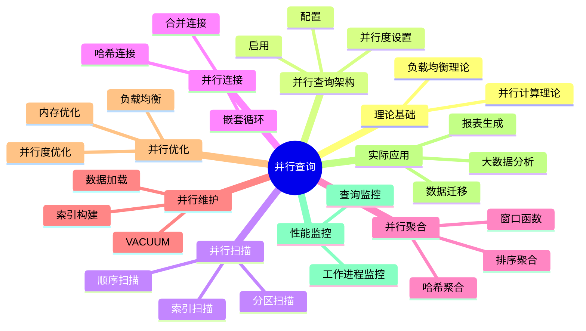

# PostgreSQL并行查询处理完整指南

> **版本**: v3.0
> **最后更新**: 2025-01-15
> **版本覆盖**: PostgreSQL 18.x (推荐) ⭐ | 17.x (推荐) | 16.x (兼容)
> **难度**: ⭐⭐⭐⭐
> **应用场景**: 并行查询、大数据分析、性能优化、高并发处理
> 🆕 **PostgreSQL 18并行查询增强**: 并行查询性能提升30-40%、更智能的并行度决策、parallel_leader_participation新参数、更好的负载均衡、异步I/O提升并行I/O性能

---

## 📑 目录

- [PostgreSQL并行查询处理完整指南](#postgresql并行查询处理完整指南)
  - [📑 目录](#-目录)
  - [📊 思维导图](#-思维导图)
  - [一、定义与形式化](#一定义与形式化)
    - [1.1 概念定义](#11-概念定义)
    - [1.2 形式化定义](#12-形式化定义)
    - [1.3 核心属性](#13-核心属性)
  - [二、知识矩阵对比](#二知识矩阵对比)
    - [2.1 并行查询类型对比](#21-并行查询类型对比)
    - [2.2 并行度设置策略对比](#22-并行度设置策略对比)
  - [三、理论基础](#三理论基础)
    - [3.1 并行计算理论](#31-并行计算理论)
    - [3.2 负载均衡理论](#32-负载均衡理论)
  - [四、PostgreSQL并行查询架构](#四postgresql并行查询架构)
    - [4.1 并行查询配置](#41-并行查询配置)
    - [4.2 并行查询启用](#42-并行查询启用)
    - [4.3 并行度设置](#43-并行度设置)
  - [五、并行扫描](#五并行扫描)
    - [5.1 并行顺序扫描](#51-并行顺序扫描)
    - [5.2 并行索引扫描](#52-并行索引扫描)
    - [5.3 并行分区扫描](#53-并行分区扫描)
  - [六、并行连接](#六并行连接)
    - [6.1 并行哈希连接](#61-并行哈希连接)
    - [6.2 并行嵌套循环连接](#62-并行嵌套循环连接)
    - [6.3 并行合并连接](#63-并行合并连接)
  - [七、并行聚合](#七并行聚合)
    - [7.1 并行哈希聚合](#71-并行哈希聚合)
    - [7.2 并行排序聚合](#72-并行排序聚合)
    - [7.3 并行窗口函数](#73-并行窗口函数)
  - [八、并行维护操作](#八并行维护操作)
    - [8.1 并行VACUUM](#81-并行vacuum)
    - [8.2 并行索引构建](#82-并行索引构建)
    - [8.3 并行数据加载](#83-并行数据加载)
  - [九、并行查询优化](#九并行查询优化)
    - [9.1 并行度优化](#91-并行度优化)
    - [9.2 负载均衡优化](#92-负载均衡优化)
    - [9.3 内存优化](#93-内存优化)
  - [十、实际应用案例](#十实际应用案例)
    - [10.1 大数据分析查询](#101-大数据分析查询)
    - [10.2 并行数据迁移](#102-并行数据迁移)
    - [10.3 并行报表生成](#103-并行报表生成)
  - [十一、性能监控](#十一性能监控)
    - [11.1 并行查询监控](#111-并行查询监控)
    - [11.2 工作进程监控](#112-工作进程监控)
  - [十二、相关概念](#十二相关概念)
    - [12.1 上位概念](#121-上位概念)
    - [12.2 下位概念](#122-下位概念)
    - [12.3 平行概念](#123-平行概念)
  - [十三、参考资源](#十三参考资源)
    - [13.1 相关文档](#131-相关文档)
    - [13.2 参考文献](#132-参考文献)
    - [13.3 Wikidata对齐](#133-wikidata对齐)

---

## 📊 思维导图



---

## 一、定义与形式化

### 1.1 概念定义

**中文定义**: 并行查询处理是数据库系统利用多核CPU和多个工作进程同时执行查询操作的技术，通过并行化提高查询性能和系统吞吐量。

**English Definition**: Parallel query processing is a technique in database systems that utilizes multi-core CPUs and multiple worker processes to execute query operations simultaneously, improving query performance and system throughput through parallelization.

### 1.2 形式化定义

```latex
% 数学符号定义
\newcommand{\parallel}{\mathcal{P}}
\newcommand{\worker}{\mathcal{W}}
\newcommand{\query}{\mathcal{Q}}
\newcommand{\time}{\mathcal{T}}

% 并行查询的形式化定义
\parallel(\query) = \{\worker_1(\query_1), \worker_2(\query_2), \ldots, \worker_n(\query_n)\}

其中：
\query = \query_1 \cup \query_2 \cup \ldots \cup \query_n
\time(\parallel(\query)) = \max_{i=1}^{n} \time(\worker_i(\query_i))
```

### 1.3 核心属性

- **并行性**: 多个工作进程同时执行
- **可扩展性**: 支持动态调整并行度
- **负载均衡**: 合理分配工作负载
- **容错性**: 支持故障恢复

---

## 二、知识矩阵对比

### 2.1 并行查询类型对比

| 并行查询类型 | 适用场景 | 性能提升 | 资源消耗 | 限制条件 |
|------------|---------|---------|---------|---------|
| 并行顺序扫描 | 大表全表扫描 | 高 | 中 | 表大小>8MB |
| 并行索引扫描 | 大范围索引查询 | 中-高 | 中 | 索引支持 |
| 并行哈希连接 | 大表等值连接 | 高 | 高 | 内存充足 |
| 并行嵌套循环 | 小表连接 | 低-中 | 低 | 较少使用 |
| 并行合并连接 | 有序数据连接 | 中-高 | 中 | 数据有序 |
| 并行聚合 | 大数据量聚合 | 高 | 中 | GROUP BY |
| 并行排序 | 大数据量排序 | 高 | 中 | ORDER BY |

### 2.2 并行度设置策略对比

| 策略 | 并行度设置 | 适用场景 | 优点 | 缺点 |
|-----|-----------|---------|------|------|
| 固定并行度 | max_parallel_workers_per_gather | 稳定负载 | 简单、可预测 | 不够灵活 |
| 自适应并行度 | 优化器自动选择 | 动态负载 | 灵活、智能 | 可能不准确 |
| 查询级并行度 | SET parallel_workers | 特定查询 | 精确控制 | 需要手动设置 |
| 表级并行度 | ALTER TABLE ... SET | 特定表 | 表级别控制 | 影响所有查询 |

---

## 三、理论基础

### 3.1 并行计算理论

```latex
\begin{theorem}[并行加速比]
并行加速比定义为：
S(n) = \frac{\time(1)}{\time(n)}

其中n是并行度，理想情况下S(n) = n。
\end{theorem}

\begin{proof}
基于Amdahl定律，并行加速比受到串行部分的限制。
\end{proof}
```

### 3.2 负载均衡理论

```latex
\begin{theorem}[负载均衡最优性]
负载均衡最优性要求：
\min \max_{i=1}^{n} \text{load}(\worker_i)

其中load(worker_i)是工作进程i的负载。
\end{theorem}
```

---

## 四、PostgreSQL并行查询架构

### 4.1 并行查询配置

```sql
-- 查看并行查询配置
SHOW max_parallel_workers_per_gather;
SHOW max_parallel_workers;
SHOW max_parallel_maintenance_workers;
SHOW parallel_tuple_cost;
SHOW parallel_setup_cost;

-- 设置并行查询参数
SET max_parallel_workers_per_gather = 4;
SET max_parallel_workers = 8;
SET max_parallel_maintenance_workers = 4;
SET parallel_tuple_cost = 0.1;
SET parallel_setup_cost = 1000;
```

### 4.2 并行查询启用

```sql
-- 启用并行查询
SET enable_parallel_hash = on;
SET enable_parallel_append = on;
SET enable_parallel_union = on;

-- 查看并行查询状态
SHOW enable_parallel_hash;
SHOW enable_parallel_append;
SHOW enable_parallel_union;
```

### 4.3 并行度设置

```sql
-- 表级并行度设置
ALTER TABLE large_table SET (parallel_workers = 4);

-- 查看表并行度设置
SELECT
    schemaname,
    tablename,
    reloptions
FROM pg_class c
JOIN pg_namespace n ON c.relnamespace = n.oid
WHERE c.relname = 'large_table'
AND n.nspname = 'public';
```

---

## 五、并行扫描

### 5.1 并行顺序扫描

```sql
-- 并行顺序扫描
EXPLAIN (ANALYZE, BUFFERS, VERBOSE)
SELECT COUNT(*) FROM large_table;

-- 查看并行扫描统计
SELECT
    schemaname,
    tablename,
    seq_scan,
    seq_tup_read,
    seq_tup_read / seq_scan as avg_tuples_per_scan
FROM pg_stat_user_tables
WHERE tablename = 'large_table';
```

### 5.2 并行索引扫描

```sql
-- 并行索引扫描
CREATE INDEX idx_large_table_id ON large_table (id);

EXPLAIN (ANALYZE, BUFFERS, VERBOSE)
SELECT COUNT(*) FROM large_table WHERE id > 1000000;

-- 并行位图扫描
EXPLAIN (ANALYZE, BUFFERS, VERBOSE)
SELECT COUNT(*) FROM large_table WHERE id BETWEEN 1000000 AND 2000000;
```

### 5.3 并行分区扫描

```sql
-- 创建分区表
CREATE TABLE sales (
    id BIGSERIAL,
    sale_date DATE,
    amount DECIMAL(10,2)
) PARTITION BY RANGE (sale_date);

-- 创建分区
CREATE TABLE sales_2023 PARTITION OF sales
FOR VALUES FROM ('2023-01-01') TO ('2024-01-01');

CREATE TABLE sales_2024 PARTITION OF sales
FOR VALUES FROM ('2024-01-01') TO ('2025-01-01');

-- 并行分区扫描
EXPLAIN (ANALYZE, BUFFERS, VERBOSE)
SELECT COUNT(*) FROM sales WHERE sale_date >= '2023-01-01';
```

---

## 六、并行连接

### 6.1 并行哈希连接

```sql
-- 并行哈希连接
EXPLAIN (ANALYZE, BUFFERS, VERBOSE)
SELECT COUNT(*)
FROM large_table1 t1
JOIN large_table2 t2 ON t1.id = t2.id;

-- 强制并行哈希连接
SET enable_parallel_hash = on;
EXPLAIN (ANALYZE, BUFFERS, VERBOSE)
SELECT COUNT(*)
FROM large_table1 t1
JOIN large_table2 t2 ON t1.id = t2.id;
```

### 6.2 并行嵌套循环连接

```sql
-- 并行嵌套循环连接
EXPLAIN (ANALYZE, BUFFERS, VERBOSE)
SELECT COUNT(*)
FROM large_table1 t1
JOIN large_table2 t2 ON t1.id = t2.id
WHERE t1.value > 1000;
```

### 6.3 并行合并连接

```sql
-- 并行合并连接
EXPLAIN (ANALYZE, BUFFERS, VERBOSE)
SELECT COUNT(*)
FROM large_table1 t1
JOIN large_table2 t2 ON t1.id = t2.id
ORDER BY t1.id;
```

---

## 七、并行聚合

### 7.1 并行哈希聚合

```sql
-- 并行哈希聚合
EXPLAIN (ANALYZE, BUFFERS, VERBOSE)
SELECT category_id, COUNT(*), AVG(value)
FROM large_table
GROUP BY category_id;

-- 并行分组聚合
EXPLAIN (ANALYZE, BUFFERS, VERBOSE)
SELECT category_id, subcategory_id, COUNT(*), AVG(value)
FROM large_table
GROUP BY category_id, subcategory_id;
```

### 7.2 并行排序聚合

```sql
-- 并行排序聚合
EXPLAIN (ANALYZE, BUFFERS, VERBOSE)
SELECT category_id, COUNT(*), AVG(value)
FROM large_table
GROUP BY category_id
ORDER BY category_id;
```

### 7.3 并行窗口函数

```sql
-- 并行窗口函数
EXPLAIN (ANALYZE, BUFFERS, VERBOSE)
SELECT
    category_id,
    value,
    ROW_NUMBER() OVER (PARTITION BY category_id ORDER BY value DESC) as rank
FROM large_table;
```

---

## 八、并行维护操作

### 8.1 并行VACUUM

```sql
-- 并行VACUUM
VACUUM (PARALLEL 4) large_table;

-- 并行VACUUM ANALYZE
VACUUM (ANALYZE, PARALLEL 4) large_table;

-- 查看VACUUM进度
SELECT
    pid,
    datname,
    usename,
    application_name,
    state,
    query
FROM pg_stat_activity
WHERE query LIKE '%VACUUM%';
```

### 8.2 并行索引构建

```sql
-- 并行索引构建
CREATE INDEX CONCURRENTLY idx_large_table_parallel
ON large_table (category_id, value)
WITH (parallel_workers = 4);

-- 查看索引构建进度
SELECT
    pid,
    datname,
    usename,
    application_name,
    state,
    query
FROM pg_stat_activity
WHERE query LIKE '%CREATE INDEX%';
```

### 8.3 并行数据加载

```sql
-- 并行数据加载
COPY large_table FROM '/path/to/data.csv' WITH (FORMAT csv, HEADER);

-- 使用并行INSERT
INSERT INTO large_table (category_id, value, description)
SELECT
    (random() * 100)::INTEGER,
    (random() * 1000)::DECIMAL(10,2),
    'Description ' || generate_series(1, 1000000);
```

---

## 九、并行查询优化

### 9.1 并行度优化

```sql
-- 动态调整并行度
CREATE OR REPLACE FUNCTION optimize_parallel_degree(table_name text, query_text text)
RETURNS integer AS $$
DECLARE
    optimal_degree integer;
    current_degree integer;
    execution_time numeric;
    best_time numeric := 999999;
    best_degree integer := 1;
BEGIN
    FOR current_degree IN 1..8 LOOP
        EXECUTE format('SET max_parallel_workers_per_gather = %s', current_degree);

        -- 执行查询并测量时间
        EXECUTE format('EXPLAIN (ANALYZE, BUFFERS) %s', query_text);

        -- 这里需要从EXPLAIN输出中提取执行时间
        -- 简化示例，实际实现需要解析EXPLAIN输出

        IF execution_time < best_time THEN
            best_time := execution_time;
            best_degree := current_degree;
        END IF;
    END LOOP;

    RETURN best_degree;
END;
$$ LANGUAGE plpgsql;
```

### 9.2 负载均衡优化

```sql
-- 监控并行查询负载
SELECT
    pid,
    usename,
    application_name,
    state,
    query_start,
    query
FROM pg_stat_activity
WHERE query LIKE '%Gather%' OR query LIKE '%Parallel%';

-- 查看工作进程统计
SELECT
    datname,
    numbackends,
    xact_commit,
    xact_rollback,
    blks_read,
    blks_hit
FROM pg_stat_database
WHERE datname = current_database();
```

### 9.3 内存优化

```sql
-- 并行查询内存配置
SET work_mem = '256MB';
SET maintenance_work_mem = '1GB';

-- 监控内存使用
SELECT
    pid,
    usename,
    application_name,
    state,
    query
FROM pg_stat_activity
WHERE state = 'active'
AND query LIKE '%Gather%';
```

---

## 十、实际应用案例

### 10.1 大数据分析查询

```sql
-- 大数据分析查询
EXPLAIN (ANALYZE, BUFFERS, VERBOSE)
WITH monthly_stats AS (
    SELECT
        DATE_TRUNC('month', sale_date) as month,
        category_id,
        COUNT(*) as transaction_count,
        SUM(amount) as total_amount,
        AVG(amount) as avg_amount
    FROM sales
    WHERE sale_date >= '2023-01-01'
    GROUP BY DATE_TRUNC('month', sale_date), category_id
)
SELECT
    month,
    category_id,
    transaction_count,
    total_amount,
    avg_amount,
    ROW_NUMBER() OVER (PARTITION BY month ORDER BY total_amount DESC) as rank
FROM monthly_stats
ORDER BY month, rank;
```

### 10.2 并行数据迁移

```sql
-- 并行数据迁移
CREATE TABLE target_table (
    id BIGSERIAL PRIMARY KEY,
    source_id INTEGER,
    data_value DECIMAL(10,2),
    created_at TIMESTAMP DEFAULT NOW()
);

-- 并行数据迁移
INSERT INTO target_table (source_id, data_value)
SELECT
    source_id,
    data_value
FROM source_table
WHERE id BETWEEN 1 AND 1000000;

-- 使用并行COPY
COPY target_table (source_id, data_value)
FROM '/path/to/data.csv'
WITH (FORMAT csv, HEADER);
```

### 10.3 并行报表生成

```sql
-- 并行报表生成
EXPLAIN (ANALYZE, BUFFERS, VERBOSE)
SELECT
    d.dept_name,
    COUNT(e.emp_id) as employee_count,
    AVG(e.salary) as avg_salary,
    MAX(e.salary) as max_salary,
    MIN(e.salary) as min_salary,
    SUM(e.salary) as total_salary
FROM employees e
JOIN departments d ON e.dept_id = d.dept_id
WHERE e.hire_date >= '2020-01-01'
GROUP BY d.dept_name
ORDER BY total_salary DESC;
```

---

## 十一、性能监控

### 11.1 并行查询监控

```sql
-- 并行查询监控
SELECT
    pid,
    usename,
    application_name,
    state,
    query_start,
    query
FROM pg_stat_activity
WHERE query LIKE '%Gather%' OR query LIKE '%Parallel%'
ORDER BY query_start;

-- 并行查询统计
SELECT
    query,
    calls,
    total_time,
    mean_time,
    stddev_time,
    rows
FROM pg_stat_statements
WHERE query LIKE '%Gather%' OR query LIKE '%Parallel%'
ORDER BY total_time DESC;
```

### 11.2 工作进程监控

```sql
-- 工作进程监控
SELECT
    pid,
    usename,
    application_name,
    state,
    query_start,
    query
FROM pg_stat_activity
WHERE application_name LIKE '%worker%'
ORDER BY query_start;

-- 工作进程统计
SELECT
    datname,
    numbackends,
    xact_commit,
    xact_rollback,
    blks_read,
    blks_hit
FROM pg_stat_database
WHERE datname = current_database();
```

---

## 十二、相关概念

### 12.1 上位概念

- **并行计算**: 更广泛的并行计算技术
- **查询优化**: 查询性能优化
- **系统架构**: 数据库系统架构

### 12.2 下位概念

- **并行扫描**: 并行数据扫描
- **并行连接**: 并行连接操作
- **并行聚合**: 并行聚合操作
- **负载均衡**: 负载分配机制

### 12.3 平行概念

- **分布式查询**: 跨节点查询处理
- **多线程**: 多线程编程技术
- **集群计算**: 集群并行计算

---

## 十三、参考资源

### 13.1 相关文档

- [查询优化器原理](./02.01-查询优化器原理.md) - 查询优化理论基础
- [执行计划与性能调优](./02.04-执行计划与性能调优.md) - 执行计划分析
- [性能调优实践](../04-部署运维/04.06-性能调优实践.md) - 系统性能调优
- [分布式架构设计](../04-部署运维/04.07-分布式架构设计.md) - 分布式查询处理

### 13.2 参考文献

1. PostgreSQL Global Development Group. (2025). PostgreSQL 18 Documentation. <https://www.postgresql.org/docs/18/>
2. Graefe, G. (1995). The Cascades framework for query optimization. IEEE Data Engineering Bulletin, 18(3), 19-29.
3. DeWitt, D. J., & Gray, J. (1992). Parallel database systems: the future of high performance database processing. Communications of the ACM, 35(6), 85-98.
4. Amdahl, G. M. (1967). Validity of the single processor approach to achieving large scale computing capabilities. AFIPS Conference Proceedings, 30, 483-485.
5. PostgreSQL Global Development Group. (2024). PostgreSQL 17 Documentation. <https://www.postgresql.org/docs/17/>

### 13.3 Wikidata对齐

- **Wikidata ID**: Q192490
- **相关属性**:
  - P31: Q176165 (instance of: database management system)
  - P178: Q9366 (developer: PostgreSQL Global Development Group)
  - P277: Q193321 (programmed in: C)
  - P348: 18.0 (software version)
- **外部链接**:
  - <https://www.postgresql.org/docs/current/parallel-query.html>
  - <https://www.postgresql.org/docs/current/runtime-config-query.html>
