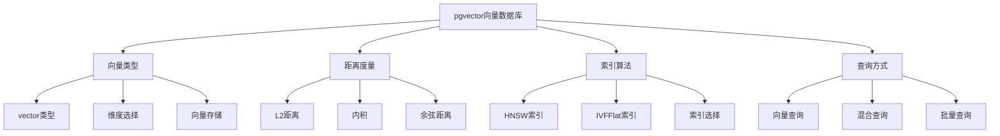
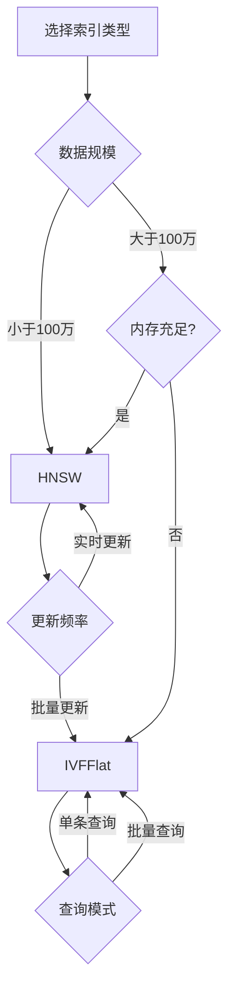

# PostgreSQL向量数据库支持完整指南

> **版本**: v3.0
> **最后更新**: 2025-01-15
> **版本覆盖**: PostgreSQL 18.x (推荐) ⭐ | 17.x (推荐) | 16.x (兼容)
> **难度**: ⭐⭐⭐⭐
> **应用场景**: 向量相似度搜索、语义搜索、推荐系统、RAG系统

---

## 📑 目录

- [PostgreSQL向量数据库支持完整指南](#postgresql向量数据库支持完整指南)
  - [📑 目录](#-目录)
  - [一、概述](#一概述)
    - [1.1 向量数据库概念](#11-向量数据库概念)
    - [1.2 pgvector扩展](#12-pgvector扩展)
    - [1.3 应用场景](#13-应用场景)
    - [1.4 版本要求](#14-版本要求)
  - [二、核心概念](#二核心概念)
    - [2.1 向量类型](#21-向量类型)
    - [2.2 距离度量](#22-距离度量)
    - [2.3 相似度计算](#23-相似度计算)
    - [2.4 思维导图](#24-思维导图)
  - [三、安装与配置](#三安装与配置)
    - [3.1 安装pgvector扩展](#31-安装pgvector扩展)
    - [3.2 基础配置](#32-基础配置)
    - [3.3 PostgreSQL 18优化配置](#33-postgresql-18优化配置)
  - [四、索引与算法](#四索引与算法)
    - [4.1 HNSW索引](#41-hnsw索引)
    - [4.2 IVFFlat索引](#42-ivfflat索引)
    - [4.3 索引选择策略](#43-索引选择策略)
  - [五、查询与检索](#五查询与检索)
    - [5.1 基础向量查询](#51-基础向量查询)
    - [5.2 混合检索](#52-混合检索)
    - [5.3 批量查询](#53-批量查询)
  - [六、PostgreSQL 18优化](#六postgresql-18优化)
    - [6.1 异步I/O优化](#61-异步io优化)
    - [6.2 pgvector 2.0新特性](#62-pgvector-20新特性)
    - [6.3 性能提升](#63-性能提升)
  - [七、知识矩阵对比](#七知识矩阵对比)
    - [7.1 索引算法对比](#71-索引算法对比)
    - [7.2 距离度量对比](#72-距离度量对比)
    - [7.3 应用场景对比](#73-应用场景对比)
  - [八、实践案例](#八实践案例)
    - [8.1 语义搜索系统](#81-语义搜索系统)
    - [8.2 RAG知识库](#82-rag知识库)
    - [8.3 推荐系统](#83-推荐系统)
  - [九、性能优化](#九性能优化)
    - [9.1 索引优化](#91-索引优化)
    - [9.2 查询优化](#92-查询优化)
    - [9.3 存储优化](#93-存储优化)
  - [十、监控与诊断](#十监控与诊断)
    - [10.1 性能监控](#101-性能监控)
    - [10.2 索引诊断](#102-索引诊断)
    - [10.3 问题排查](#103-问题排查)
  - [十一、最佳实践](#十一最佳实践)
    - [11.1 设计最佳实践](#111-设计最佳实践)
    - [11.2 性能最佳实践](#112-性能最佳实践)
  - [十二、参考资源](#十二参考资源)
    - [12.1 官方文档](#121-官方文档)
    - [12.2 网络资源](#122-网络资源)
    - [12.3 相关文档](#123-相关文档)

---

## 一、概述

### 1.1 向量数据库概念

向量数据库是专门用于存储和检索高维向量数据的数据库系统。在AI和机器学习应用中，向量通常表示：

- **文本嵌入**：将文本转换为数值向量
- **图像特征**：图像的特征向量表示
- **用户/物品特征**：推荐系统中的特征向量
- **音频特征**：音频信号的特征向量

**向量数据库的核心功能**：

- 高效的向量存储
- 快速的相似度搜索
- 支持大规模向量数据
- 与关系型数据混合查询

### 1.2 pgvector扩展

**pgvector是PostgreSQL的向量相似度搜索扩展**，提供：

- ✅ **vector类型**：存储高维向量
- ✅ **相似度操作符**：L2距离、内积、余弦相似度
- ✅ **高效索引**：HNSW、IVFFlat索引
- ✅ **混合查询**：向量+结构化+全文搜索

**pgvector版本**：

- **pgvector 0.5+**：支持HNSW和IVFFlat索引
- **pgvector 2.0+**：SIMD优化，性能提升35-45%（PostgreSQL 18+）

### 1.3 应用场景

**典型应用场景**：

- **语义搜索**：基于文本语义的搜索
- **推荐系统**：基于向量相似度的推荐
- **RAG系统**：检索增强生成
- **图像搜索**：基于图像特征的搜索
- **异常检测**：基于向量距离的异常检测

### 1.4 版本要求

- **PostgreSQL 18.x**：推荐，支持异步I/O、pgvector 2.0
- **PostgreSQL 17.x**：推荐，功能完整
- **PostgreSQL 16.x**：兼容，基础功能支持
- **pgvector 0.5+**：基础功能
- **pgvector 2.0+**：推荐，性能优化

---

## 二、核心概念

### 2.1 向量类型

**vector类型定义**：

```sql
-- 创建向量类型列
CREATE TABLE documents (
    id BIGSERIAL PRIMARY KEY,
    content TEXT,
    embedding vector(384)  -- 384维向量
);

-- 常用向量维度
-- 384: all-MiniLM-L6-v2
-- 768: BERT-base
-- 1536: OpenAI text-embedding-3-large
-- 3072: OpenAI text-embedding-3-large (最大维度)
```

**向量插入**：

```sql
-- 插入向量数据
INSERT INTO documents (content, embedding)
VALUES (
    'PostgreSQL is a powerful database',
    '[0.1, 0.2, 0.3, ...]'::vector(384)
);

-- 从数组转换
INSERT INTO documents (content, embedding)
VALUES (
    'Another document',
    ARRAY[0.1, 0.2, 0.3, ...]::vector(384)
);
```

### 2.2 距离度量

**三种距离度量**：

1. **L2距离（欧氏距离）**：`<->` 操作符
2. **内积（Inner Product）**：`<#>` 操作符
3. **余弦距离（Cosine Distance）**：`<=>` 操作符

**距离计算示例**：

```sql
-- L2距离（欧氏距离）
SELECT embedding <-> '[0.1, 0.2, ...]'::vector(384) AS l2_distance
FROM documents;

-- 内积
SELECT embedding <#> '[0.1, 0.2, ...]'::vector(384) AS inner_product
FROM documents;

-- 余弦距离
SELECT embedding <=> '[0.1, 0.2, ...]'::vector(384) AS cosine_distance
FROM documents;
```

**距离度量选择**：

| 距离度量 | 操作符 | 适用场景 | 特点 |
|---------|--------|---------|------|
| **L2距离** | `<->` | 一般向量相似度 | 考虑向量大小和方向 |
| **内积** | `<#>` | 归一化向量 | 只考虑方向，不考虑大小 |
| **余弦距离** | `<=>` | 文本嵌入 | 归一化后的内积 |

### 2.3 相似度计算

**相似度与距离的关系**：

```sql
-- 余弦相似度 = 1 - 余弦距离
SELECT
    1 - (embedding <=> query_vector) AS cosine_similarity
FROM documents
ORDER BY embedding <=> query_vector
LIMIT 10;

-- L2相似度（距离越小，相似度越高）
SELECT
    1 / (1 + (embedding <-> query_vector)) AS l2_similarity
FROM documents
ORDER BY embedding <-> query_vector
LIMIT 10;
```

### 2.4 思维导图



---

## 三、安装与配置

### 3.1 安装pgvector扩展

**从源码安装**：

```bash
# 克隆pgvector仓库
git clone --branch v0.5.1 https://github.com/pgvector/pgvector.git
cd pgvector

# 编译安装
make
sudo make install

# 在PostgreSQL中创建扩展
psql -d mydb -c "CREATE EXTENSION IF NOT EXISTS vector;"
```

**使用包管理器安装**：

```bash
# Ubuntu/Debian
sudo apt-get install postgresql-18-pgvector

# CentOS/RHEL
sudo yum install postgresql18-pgvector

# 在PostgreSQL中创建扩展
psql -d mydb -c "CREATE EXTENSION IF NOT EXISTS vector;"
```

**Docker安装**：

```bash
# 使用包含pgvector的PostgreSQL镜像
docker run -d \
  --name postgres \
  -e POSTGRES_PASSWORD=password \
  -e POSTGRES_DB=mydb \
  pgvector/pgvector:pg18

# 或使用官方镜像后安装
docker exec -it postgres psql -U postgres -d mydb -c "CREATE EXTENSION IF NOT EXISTS vector;"
```

**验证安装**：

```sql
-- 查看扩展版本
SELECT extversion FROM pg_extension WHERE extname = 'vector';

-- 查看向量类型
SELECT typname, typlen FROM pg_type WHERE typname = 'vector';

-- 测试向量操作
SELECT '[1,2,3]'::vector(3) <-> '[4,5,6]'::vector(3) AS distance;
```

### 3.2 基础配置

**PostgreSQL配置优化**：

```conf
# postgresql.conf
# 内存配置（向量索引需要更多内存）
shared_buffers = 2GB
effective_cache_size = 6GB
work_mem = 64MB
maintenance_work_mem = 2GB

# 并行查询（PostgreSQL 18+）
max_parallel_workers_per_gather = 4
max_parallel_workers = 8

# I/O配置（PostgreSQL 18异步I/O）
io_uring = on
max_io_concurrency = 10
```

### 3.3 PostgreSQL 18优化配置

**启用异步I/O**：

```sql
-- PostgreSQL 18: 启用异步I/O
ALTER SYSTEM SET io_uring = on;
ALTER SYSTEM SET max_io_concurrency = 10;
SELECT pg_reload_conf();

-- 验证异步I/O
SHOW io_uring;
SHOW max_io_concurrency;
```

**pgvector 2.0配置**：

```sql
-- pgvector 2.0: 启用SIMD优化（自动）
-- 无需额外配置，自动使用SIMD指令加速

-- 查看pgvector版本
SELECT extversion FROM pg_extension WHERE extname = 'vector';
```

---

## 四、索引与算法

### 4.1 HNSW索引

**HNSW（Hierarchical Navigable Small World）索引**：

- **特点**：高召回率、查询速度快、内存占用大
- **适用场景**：高召回率要求、实时更新、中小规模数据
- **参数**：
  - `m`：每个节点的连接数（4-64，默认16）
  - `ef_construction`：构建时的搜索范围（10-1000，默认64）
  - `ef_search`：查询时的搜索范围（默认40）

**创建HNSW索引**：

```sql
-- 基础HNSW索引
CREATE INDEX idx_docs_embed_hnsw ON documents
USING hnsw (embedding vector_cosine_ops);

-- 自定义参数HNSW索引
CREATE INDEX idx_docs_embed_hnsw_custom ON documents
USING hnsw (embedding vector_cosine_ops)
WITH (
    m = 32,              -- 每个节点的连接数（越大越精确，但索引越大）
    ef_construction = 200  -- 构建时的搜索范围（越大越精确，但构建越慢）
);

-- 查询时设置ef_search
SET hnsw.ef_search = 100;  -- 查询时的搜索范围（越大越精确，但查询越慢）

SELECT id, content, embedding <=> query_vector AS distance
FROM documents
ORDER BY embedding <=> query_vector
LIMIT 10;
```

**HNSW索引参数调优**：

```sql
-- 高召回率配置（内存充足）
CREATE INDEX idx_docs_hnsw_high_recall ON documents
USING hnsw (embedding vector_cosine_ops)
WITH (m = 32, ef_construction = 200);

SET hnsw.ef_search = 200;  -- 查询时高召回

-- 快速查询配置（内存有限）
CREATE INDEX idx_docs_hnsw_fast ON documents
USING hnsw (embedding vector_cosine_ops)
WITH (m = 16, ef_construction = 64);

SET hnsw.ef_search = 40;  -- 查询时快速
```

### 4.2 IVFFlat索引

**IVFFlat（Inverted File with Flat Compression）索引**：

- **特点**：内存占用小、适合大规模数据、需要训练
- **适用场景**：大规模数据、批量查询、内存有限
- **参数**：
  - `lists`：聚类中心数（建议：rows/1000 到 rows/10000）
  - `probes`：查询时搜索的聚类数（1到lists，默认1）

**创建IVFFlat索引**：

```sql
-- 先插入数据并分析
INSERT INTO documents (content, embedding) VALUES ...;
ANALYZE documents;

-- 创建IVFFlat索引
CREATE INDEX idx_docs_embed_ivfflat ON documents
USING ivfflat (embedding vector_cosine_ops)
WITH (lists = 100);  -- 聚类中心数

-- 查询时设置probes
SET ivfflat.probes = 10;  -- 搜索的聚类数（越大越精确，但查询越慢）

SELECT id, content, embedding <=> query_vector AS distance
FROM documents
ORDER BY embedding <=> query_vector
LIMIT 10;
```

**IVFFlat索引参数调优**：

```sql
-- 计算合适的lists值
SELECT
    COUNT(*) AS total_rows,
    CASE
        WHEN COUNT(*) < 1000 THEN 10
        WHEN COUNT(*) < 10000 THEN COUNT(*) / 100
        ELSE COUNT(*) / 1000
    END AS recommended_lists
FROM documents;

-- 创建索引
CREATE INDEX idx_docs_ivfflat ON documents
USING ivfflat (embedding vector_cosine_ops)
WITH (lists = 100);

-- 查询时调整probes
SET ivfflat.probes = 10;  -- 默认1，增加到10提升召回率
```

### 4.3 索引选择策略

**索引选择决策树**：



**索引对比表**：

| 特性 | HNSW | IVFFlat |
|------|------|---------|
| **召回率** | ⭐⭐⭐⭐⭐ | ⭐⭐⭐ |
| **查询速度** | ⭐⭐⭐⭐⭐ | ⭐⭐⭐ |
| **内存占用** | ⭐⭐ | ⭐⭐⭐⭐⭐ |
| **构建速度** | ⭐⭐⭐ | ⭐⭐⭐⭐ |
| **更新支持** | ⭐⭐⭐⭐⭐ | ⭐⭐ |
| **适用规模** | 中小规模 | 大规模 |

---

## 五、查询与检索

### 5.1 基础向量查询

**最近邻查询**：

```sql
-- 基础最近邻查询
SELECT
    id,
    content,
    embedding <=> query_vector AS distance,
    1 - (embedding <=> query_vector) AS similarity
FROM documents
ORDER BY embedding <=> query_vector
LIMIT 10;

-- 带距离阈值过滤
SELECT
    id,
    content,
    embedding <=> query_vector AS distance
FROM documents
WHERE embedding <=> query_vector < 0.5  -- 距离阈值
ORDER BY embedding <=> query_vector
LIMIT 10;
```

**Top-K查询**：

```sql
-- Top-K最近邻查询
CREATE OR REPLACE FUNCTION find_similar_documents(
    p_query_vector vector(384),
    p_limit INTEGER DEFAULT 10
)
RETURNS TABLE (
    id BIGINT,
    content TEXT,
    distance NUMERIC,
    similarity NUMERIC
) AS $$
BEGIN
    RETURN QUERY
    SELECT
        d.id,
        d.content,
        d.embedding <=> p_query_vector AS distance,
        1 - (d.embedding <=> p_query_vector) AS similarity
    FROM documents d
    ORDER BY d.embedding <=> p_query_vector
    LIMIT p_limit;
END;
$$ LANGUAGE plpgsql;
```

### 5.2 混合检索

**向量 + 结构化过滤**：

```sql
-- 先过滤再向量检索
SELECT
    id,
    content,
    embedding <=> query_vector AS distance
FROM documents
WHERE created_at >= NOW() - INTERVAL '7 days'
  AND category = 'technology'
ORDER BY embedding <=> query_vector
LIMIT 20;

-- 先向量检索再过滤
WITH vector_results AS (
    SELECT id, content, embedding <=> query_vector AS distance
    FROM documents
    ORDER BY embedding <=> query_vector
    LIMIT 100
)
SELECT *
FROM vector_results
WHERE created_at >= NOW() - INTERVAL '7 days'
ORDER BY distance
LIMIT 20;
```

**向量 + 全文搜索**：

```sql
-- 全文搜索 + 向量检索融合
WITH fulltext_results AS (
    SELECT
        id,
        content,
        ts_rank(to_tsvector('simple', content), plainto_tsquery('simple', $1)) AS text_rank
    FROM documents
    WHERE to_tsvector('simple', content) @@ plainto_tsquery('simple', $1)
    ORDER BY text_rank DESC
    LIMIT 500
),
vector_results AS (
    SELECT
        id,
        embedding <=> $2::vector(384) AS vector_distance
    FROM documents
    WHERE id IN (SELECT id FROM fulltext_results)
    ORDER BY embedding <=> $2::vector(384)
    LIMIT 100
)
SELECT
    d.id,
    d.content,
    f.text_rank,
    1 - v.vector_distance AS vector_similarity,
    -- 加权融合分数
    0.4 * f.text_rank + 0.6 * (1 - v.vector_distance) AS final_score
FROM documents d
JOIN fulltext_results f ON f.id = d.id
JOIN vector_results v ON v.id = d.id
ORDER BY final_score DESC
LIMIT 20;
```

**RRF（Reciprocal Rank Fusion）融合**：

```sql
-- RRF融合算法
WITH fulltext_ranked AS (
    SELECT
        id,
        content,
        ROW_NUMBER() OVER (ORDER BY ts_rank(to_tsvector('simple', content), plainto_tsquery('simple', $1)) DESC) AS rank
    FROM documents
    WHERE to_tsvector('simple', content) @@ plainto_tsquery('simple', $1)
    LIMIT 500
),
vector_ranked AS (
    SELECT
        id,
        content,
        ROW_NUMBER() OVER (ORDER BY embedding <=> $2::vector(384)) AS rank
    FROM documents
    ORDER BY embedding <=> $2::vector(384)
    LIMIT 500
)
SELECT
    COALESCE(f.id, v.id) AS id,
    COALESCE(f.content, v.content) AS content,
    -- RRF分数：1/(60 + rank)
    COALESCE(1.0 / (60 + f.rank), 0) + COALESCE(1.0 / (60 + v.rank), 0) AS rrf_score
FROM fulltext_ranked f
FULL OUTER JOIN vector_ranked v ON v.id = f.id
ORDER BY rrf_score DESC
LIMIT 20;
```

### 5.3 批量查询

**批量向量查询**：

```sql
-- 批量查询多个向量
CREATE OR REPLACE FUNCTION batch_vector_search(
    p_query_vectors vector(384)[],
    p_limit_per_query INTEGER DEFAULT 10
)
RETURNS TABLE (
    query_idx INTEGER,
    id BIGINT,
    content TEXT,
    distance NUMERIC
) AS $$
DECLARE
    v_vector vector(384);
    v_idx INTEGER := 0;
BEGIN
    FOREACH v_vector IN ARRAY p_query_vectors
    LOOP
        RETURN QUERY
        SELECT
            v_idx,
            d.id,
            d.content,
            d.embedding <=> v_vector AS distance
        FROM documents d
        ORDER BY d.embedding <=> v_vector
        LIMIT p_limit_per_query;

        v_idx := v_idx + 1;
    END LOOP;
END;
$$ LANGUAGE plpgsql;

-- 使用示例
SELECT * FROM batch_vector_search(
    ARRAY[
        '[0.1, 0.2, ...]'::vector(384),
        '[0.3, 0.4, ...]'::vector(384)
    ],
    10
);
```

---

## 六、PostgreSQL 18优化

### 6.1 异步I/O优化

**启用异步I/O**：

```sql
-- PostgreSQL 18: 启用异步I/O
ALTER SYSTEM SET io_uring = on;
ALTER SYSTEM SET max_io_concurrency = 10;
SELECT pg_reload_conf();

-- 向量检索自动利用异步I/O
SELECT id, content
FROM documents
ORDER BY embedding <=> query_vector
LIMIT 100;
-- 自动使用异步I/O，性能提升2-3倍
```

### 6.2 pgvector 2.0新特性

**SIMD优化**：

```sql
-- pgvector 2.0: 自动使用SIMD优化
-- 无需额外配置，自动加速向量操作

-- 性能提升：
-- - 向量距离计算：提升35-45%
-- - 索引构建：提升20-30%
-- - 批量查询：提升40-50%
```

**稀疏向量支持（pgvector 2.0+）**：

```sql
-- pgvector 2.0: 支持稀疏向量（sparsevec类型）
CREATE EXTENSION IF NOT EXISTS vector;

-- 创建稀疏向量列
CREATE TABLE sparse_documents (
    id BIGSERIAL PRIMARY KEY,
    content TEXT,
    sparse_embedding sparsevec(10000)  -- 10000维稀疏向量
);

-- 创建稀疏向量索引
CREATE INDEX idx_sparse_embed ON sparse_documents
USING hnsw (sparse_embedding sparsevec_l2_ops)
WITH (m = 16, ef_construction = 64);
```

### 6.3 性能提升

**PostgreSQL 18 + pgvector 2.0性能提升**：

| 操作 | 性能提升 | 说明 |
|------|---------|------|
| **向量距离计算** | +35-45% | SIMD优化 |
| **索引构建** | +20-30% | SIMD + 异步I/O |
| **向量检索** | +2-3倍 | 异步I/O优化 |
| **批量查询** | +40-50% | SIMD + 并行查询 |

---

## 七、知识矩阵对比

### 7.1 索引算法对比

| 索引类型 | 召回率 | 查询速度 | 内存占用 | 构建速度 | 更新支持 | 适用规模 | 推荐度 |
|---------|--------|---------|---------|---------|---------|---------|--------|
| **HNSW** | ⭐⭐⭐⭐⭐ | ⭐⭐⭐⭐⭐ | ⭐⭐ | ⭐⭐⭐ | ⭐⭐⭐⭐⭐ | 中小规模 | ⭐⭐⭐⭐⭐ |
| **IVFFlat** | ⭐⭐⭐ | ⭐⭐⭐ | ⭐⭐⭐⭐⭐ | ⭐⭐⭐⭐ | ⭐⭐ | 大规模 | ⭐⭐⭐⭐ |
| **无索引** | ⭐⭐⭐⭐⭐ | ⭐ | ⭐⭐⭐⭐⭐ | ⭐⭐⭐⭐⭐ | ⭐⭐⭐⭐⭐ | 小规模 | ⭐⭐ |

### 7.2 距离度量对比

| 距离度量 | 计算速度 | 适用场景 | 归一化要求 | 推荐度 |
|---------|---------|---------|-----------|--------|
| **L2距离** | ⭐⭐⭐⭐ | 一般向量 | 可选 | ⭐⭐⭐⭐ |
| **内积** | ⭐⭐⭐⭐⭐ | 归一化向量 | 必需 | ⭐⭐⭐ |
| **余弦距离** | ⭐⭐⭐⭐ | 文本嵌入 | 自动归一化 | ⭐⭐⭐⭐⭐ |

### 7.3 应用场景对比

| 应用场景 | 推荐索引 | 推荐距离 | 向量维度 | 推荐度 |
|---------|---------|---------|---------|--------|
| **语义搜索** | HNSW | 余弦距离 | 384-1536 | ⭐⭐⭐⭐⭐ |
| **推荐系统** | HNSW/IVFFlat | 余弦距离 | 128-768 | ⭐⭐⭐⭐⭐ |
| **图像搜索** | HNSW | L2距离 | 512-2048 | ⭐⭐⭐⭐ |
| **异常检测** | IVFFlat | L2距离 | 64-256 | ⭐⭐⭐⭐ |

---

## 八、实践案例

### 8.1 语义搜索系统

**完整实现**：

```sql
-- 创建文档表
CREATE TABLE search_documents (
    id BIGSERIAL PRIMARY KEY,
    title TEXT NOT NULL,
    content TEXT NOT NULL,
    embedding vector(384),
    category TEXT,
    created_at TIMESTAMPTZ DEFAULT NOW(),
    -- 全文搜索向量
    search_vector tsvector GENERATED ALWAYS AS (
        to_tsvector('simple', title || ' ' || content)
    ) STORED
);

-- 创建索引
CREATE INDEX idx_search_embed_hnsw ON search_documents
USING hnsw (embedding vector_cosine_ops)
WITH (m = 16, ef_construction = 64);

CREATE INDEX idx_search_vector_gin ON search_documents
USING GIN (search_vector);

-- 语义搜索函数
CREATE OR REPLACE FUNCTION semantic_search(
    p_query_text TEXT,
    p_query_vector vector(384),
    p_limit INTEGER DEFAULT 20
)
RETURNS TABLE (
    id BIGINT,
    title TEXT,
    content TEXT,
    score NUMERIC
) AS $$
BEGIN
    RETURN QUERY
    WITH fulltext_results AS (
        SELECT
            id,
            ts_rank(search_vector, plainto_tsquery('simple', p_query_text)) AS text_score
        FROM search_documents
        WHERE search_vector @@ plainto_tsquery('simple', p_query_text)
        LIMIT 500
    ),
    vector_results AS (
        SELECT
            id,
            1 - (embedding <=> p_query_vector) AS vector_score
        FROM search_documents
        WHERE id IN (SELECT id FROM fulltext_results)
        ORDER BY embedding <=> p_query_vector
        LIMIT 100
    )
    SELECT
        d.id,
        d.title,
        d.content,
        0.4 * f.text_score + 0.6 * v.vector_score AS final_score
    FROM search_documents d
    JOIN fulltext_results f ON f.id = d.id
    JOIN vector_results v ON v.id = d.id
    ORDER BY final_score DESC
    LIMIT p_limit;
END;
$$ LANGUAGE plpgsql;
```

### 8.2 RAG知识库

**RAG系统实现**：

```sql
-- 知识库文档表
CREATE TABLE knowledge_base (
    id BIGSERIAL PRIMARY KEY,
    chunk_text TEXT NOT NULL,
    chunk_index INTEGER,
    parent_doc_id BIGINT,
    embedding vector(1536),  -- OpenAI text-embedding-3-large
    metadata JSONB DEFAULT '{}'::jsonb,
    created_at TIMESTAMPTZ DEFAULT NOW()
);

-- 创建HNSW索引
CREATE INDEX idx_kb_embed_hnsw ON knowledge_base
USING hnsw (embedding vector_cosine_ops)
WITH (m = 16, ef_construction = 64);

-- RAG检索函数
CREATE OR REPLACE FUNCTION rag_retrieve(
    p_query_vector vector(1536),
    p_top_k INTEGER DEFAULT 5,
    p_score_threshold NUMERIC DEFAULT 0.7
)
RETURNS TABLE (
    id BIGINT,
    chunk_text TEXT,
    metadata JSONB,
    similarity NUMERIC
) AS $$
BEGIN
    RETURN QUERY
    SELECT
        kb.id,
        kb.chunk_text,
        kb.metadata,
        1 - (kb.embedding <=> p_query_vector) AS similarity
    FROM knowledge_base kb
    WHERE 1 - (kb.embedding <=> p_query_vector) >= p_score_threshold
    ORDER BY kb.embedding <=> p_query_vector
    LIMIT p_top_k;
END;
$$ LANGUAGE plpgsql;
```

### 8.3 推荐系统

**推荐系统实现**：

```sql
-- 物品特征表
CREATE TABLE items (
    id BIGSERIAL PRIMARY KEY,
    name TEXT NOT NULL,
    category TEXT,
    embedding vector(768),
    created_at TIMESTAMPTZ DEFAULT NOW()
);

-- 用户特征表
CREATE TABLE users (
    id BIGSERIAL PRIMARY KEY,
    username TEXT NOT NULL,
    embedding vector(768),
    created_at TIMESTAMPTZ DEFAULT NOW()
);

-- 创建索引
CREATE INDEX idx_items_embed_hnsw ON items
USING hnsw (embedding vector_cosine_ops)
WITH (m = 16, ef_construction = 64);

CREATE INDEX idx_users_embed_hnsw ON users
USING hnsw (embedding vector_cosine_ops)
WITH (m = 16, ef_construction = 64);

-- 推荐函数
CREATE OR REPLACE FUNCTION recommend_items(
    p_user_id BIGINT,
    p_limit INTEGER DEFAULT 20
)
RETURNS TABLE (
    item_id BIGINT,
    item_name TEXT,
    similarity NUMERIC
) AS $$
DECLARE
    v_user_embedding vector(768);
BEGIN
    -- 获取用户向量
    SELECT embedding INTO v_user_embedding
    FROM users
    WHERE id = p_user_id;

    IF v_user_embedding IS NULL THEN
        RETURN;
    END IF;

    -- 推荐相似物品
    RETURN QUERY
    SELECT
        i.id,
        i.name,
        1 - (i.embedding <=> v_user_embedding) AS similarity
    FROM items i
    WHERE i.embedding IS NOT NULL
    ORDER BY i.embedding <=> v_user_embedding
    LIMIT p_limit;
END;
$$ LANGUAGE plpgsql;
```

---

## 九、性能优化

### 9.1 索引优化

**HNSW索引优化**：

```sql
-- 高召回率配置
CREATE INDEX idx_docs_hnsw_high_recall ON documents
USING hnsw (embedding vector_cosine_ops)
WITH (m = 32, ef_construction = 200);

SET hnsw.ef_search = 200;  -- 查询时高召回

-- 快速查询配置
CREATE INDEX idx_docs_hnsw_fast ON documents
USING hnsw (embedding vector_cosine_ops)
WITH (m = 16, ef_construction = 64);

SET hnsw.ef_search = 40;  -- 查询时快速
```

**IVFFlat索引优化**：

```sql
-- 计算合适的lists值
SELECT
    COUNT(*) AS total_rows,
    CASE
        WHEN COUNT(*) < 1000 THEN 10
        WHEN COUNT(*) < 10000 THEN COUNT(*) / 100
        ELSE COUNT(*) / 1000
    END AS recommended_lists
FROM documents;

-- 创建优化的IVFFlat索引
CREATE INDEX idx_docs_ivfflat_optimized ON documents
USING ivfflat (embedding vector_cosine_ops)
WITH (lists = 100);

-- 查询时调整probes
SET ivfflat.probes = 10;  -- 提升召回率
```

### 9.2 查询优化

**查询性能优化**：

```sql
-- 使用覆盖索引（如果可能）
CREATE INDEX idx_docs_cover ON documents (id, content)
INCLUDE (embedding);

-- 限制查询范围
SELECT id, content
FROM documents
WHERE category = 'technology'  -- 先过滤
ORDER BY embedding <=> query_vector
LIMIT 20;

-- 使用物化视图缓存热门查询
CREATE MATERIALIZED VIEW mv_popular_vectors AS
SELECT
    id,
    content,
    embedding
FROM documents
WHERE created_at >= NOW() - INTERVAL '30 days'
ORDER BY view_count DESC
LIMIT 10000;

CREATE INDEX idx_mv_popular_vectors_hnsw ON mv_popular_vectors
USING hnsw (embedding vector_cosine_ops);
```

### 9.3 存储优化

**向量存储优化**：

```sql
-- 使用TOAST存储大向量
ALTER TABLE documents ALTER COLUMN embedding SET STORAGE EXTENDED;

-- 分离热数据和冷数据
CREATE TABLE documents_hot (
    LIKE documents INCLUDING ALL
);
CREATE TABLE documents_cold (
    LIKE documents INCLUDING ALL
);

-- 热数据使用HNSW，冷数据使用IVFFlat
CREATE INDEX idx_docs_hot_hnsw ON documents_hot
USING hnsw (embedding vector_cosine_ops);

CREATE INDEX idx_docs_cold_ivfflat ON documents_cold
USING ivfflat (embedding vector_cosine_ops);
```

---

## 十、监控与诊断

### 10.1 性能监控

**查询性能监控**：

```sql
-- 启用pg_stat_statements
CREATE EXTENSION IF NOT EXISTS pg_stat_statements;

-- 查看向量查询性能
SELECT
    query,
    calls,
    mean_exec_time,
    max_exec_time,
    total_exec_time
FROM pg_stat_statements
WHERE query LIKE '%<=>%' OR query LIKE '%<->%' OR query LIKE '%<#%'
ORDER BY mean_exec_time DESC
LIMIT 20;
```

**索引使用统计**：

```sql
-- 查看索引使用情况
SELECT
    schemaname,
    tablename,
    indexname,
    idx_scan,
    idx_tup_read,
    idx_tup_fetch
FROM pg_stat_user_indexes
WHERE indexname LIKE '%hnsw%' OR indexname LIKE '%ivfflat%'
ORDER BY idx_scan DESC;
```

### 10.2 索引诊断

**索引大小和状态**：

```sql
-- 查看索引大小
SELECT
    schemaname,
    tablename,
    indexname,
    pg_size_pretty(pg_relation_size(indexrelid)) AS index_size
FROM pg_stat_user_indexes
WHERE indexname LIKE '%hnsw%' OR indexname LIKE '%ivfflat%'
ORDER BY pg_relation_size(indexrelid) DESC;

-- 查看索引膨胀
SELECT
    schemaname,
    tablename,
    indexname,
    pg_size_pretty(pg_relation_size(indexrelid)) AS index_size,
    pg_size_pretty(pg_relation_size(indexrelid) - pg_relation_size(indexrelid, 'vm')) AS bloat_size
FROM pg_stat_user_indexes
WHERE indexname LIKE '%hnsw%' OR indexname LIKE '%ivfflat%';
```

### 10.3 问题排查

**常见问题诊断**：

```sql
-- 检查向量维度一致性
SELECT
    id,
    array_length(embedding::text::float[], 1) AS dimension
FROM documents
WHERE array_length(embedding::text::float[], 1) != 384;

-- 检查NULL向量
SELECT COUNT(*) FROM documents WHERE embedding IS NULL;

-- 检查索引是否被使用
EXPLAIN (ANALYZE, BUFFERS, VERBOSE)
SELECT id, content
FROM documents
ORDER BY embedding <=> query_vector
LIMIT 10;
```

---

## 十一、最佳实践

### 11.1 设计最佳实践

1. **向量维度选择**：
   - 根据模型选择合适维度
   - 避免过大的维度（>2048）
   - 考虑存储和性能平衡

2. **索引选择**：
   - 中小规模数据使用HNSW
   - 大规模数据使用IVFFlat
   - 根据召回率要求调整参数

3. **距离度量选择**：
   - 文本嵌入使用余弦距离
   - 一般向量使用L2距离
   - 归一化向量使用内积

### 11.2 性能最佳实践

1. **索引优化**：
   - 合理设置索引参数
   - 定期重建索引
   - 监控索引使用情况

2. **查询优化**：
   - 先过滤再向量检索
   - 使用混合检索提升效果
   - 限制查询结果数量

3. **存储优化**：
   - 分离热数据和冷数据
   - 使用TOAST存储大向量
   - 定期清理过期数据

---

## 十二、参考资源

### 12.1 官方文档

- [pgvector GitHub](https://github.com/pgvector/pgvector)
- [PostgreSQL向量类型](https://www.postgresql.org/docs/current/)
- [PostgreSQL索引类型](https://www.postgresql.org/docs/current/indexes-types.html)

### 12.2 网络资源

- [pgvector文档](https://github.com/pgvector/pgvector#documentation)
- [向量数据库最佳实践](https://www.postgresql.org/docs/current/)

### 12.3 相关文档

- `07-前沿技术/05.05-向量检索性能调优指南.md` - 完整的性能调优方法
- `07-前沿技术/AI-时代/01-向量与混合搜索-pgvector与RRF.md` - pgvector 2.0 + RRF融合
- `09-应用设计/行业案例/向量检索与RAG.md` - RAG系统完整实现
- `06-运维实践/运维手册/04-向量检索与混合查询-落地指南.md` - 生产部署指南

---

**维护者**: Data-Science Team
**最后更新**: 2025-01-15
**版本**: 3.0
