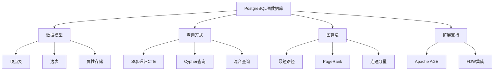

# PostgreSQL图数据库功能完整指南

> **版本**: v3.0
> **最后更新**: 2025-01-15
> **版本覆盖**: PostgreSQL 18.x (推荐) ⭐ | 17.x (推荐) | 16.x (兼容)
> **难度**: ⭐⭐⭐⭐⭐
> **应用场景**: 社交网络、知识图谱、推荐系统、路径分析、关系挖掘

---

## 📑 目录

- [PostgreSQL图数据库功能完整指南](#postgresql图数据库功能完整指南)
  - [📑 目录](#-目录)
  - [一、概述](#一概述)
    - [1.1 图数据库概念](#11-图数据库概念)
    - [1.2 PostgreSQL图数据库能力](#12-postgresql图数据库能力)
    - [1.3 应用场景](#13-应用场景)
    - [1.4 版本要求](#14-版本要求)
  - [二、核心概念](#二核心概念)
    - [2.1 属性图模型](#21-属性图模型)
    - [2.2 图数据存储](#22-图数据存储)
    - [2.3 图查询语言](#23-图查询语言)
    - [2.4 思维导图](#24-思维导图)
  - [三、数据模型设计](#三数据模型设计)
    - [3.1 顶点表设计](#31-顶点表设计)
    - [3.2 边表设计](#32-边表设计)
    - [3.3 索引设计](#33-索引设计)
    - [3.4 约束设计](#34-约束设计)
  - [四、SQL图查询](#四sql图查询)
    - [4.1 直接邻居查询](#41-直接邻居查询)
    - [4.2 递归查询](#42-递归查询)
    - [4.3 路径查询](#43-路径查询)
    - [4.4 最短路径算法](#44-最短路径算法)
  - [五、Apache AGE扩展](#五apache-age扩展)
    - [5.1 安装与配置](#51-安装与配置)
    - [5.2 Cypher查询](#52-cypher查询)
    - [5.3 图管理](#53-图管理)
    - [5.4 高级功能](#54-高级功能)
  - [六、图算法实现](#六图算法实现)
    - [6.1 最短路径算法](#61-最短路径算法)
    - [6.2 PageRank算法](#62-pagerank算法)
    - [6.3 连通分量算法](#63-连通分量算法)
    - [6.4 社区检测算法](#64-社区检测算法)
  - [七、混合查询](#七混合查询)
    - [7.1 图+向量混合](#71-图向量混合)
    - [7.2 图+全文混合](#72-图全文混合)
    - [7.3 图+JSON混合](#73-图json混合)
  - [八、PostgreSQL 18优化](#八postgresql-18优化)
    - [8.1 递归查询优化](#81-递归查询优化)
    - [8.2 并行查询优化](#82-并行查询优化)
    - [8.3 JSONB性能提升](#83-jsonb性能提升)
  - [九、知识矩阵对比](#九知识矩阵对比)
    - [9.1 图存储方案对比](#91-图存储方案对比)
    - [9.2 查询语言对比](#92-查询语言对比)
    - [9.3 图算法对比](#93-图算法对比)
  - [十、实践案例](#十实践案例)
    - [10.1 社交网络分析](#101-社交网络分析)
    - [10.2 知识图谱构建](#102-知识图谱构建)
    - [10.3 推荐系统](#103-推荐系统)
  - [十一、性能优化](#十一性能优化)
    - [11.1 查询优化](#111-查询优化)
    - [11.2 索引优化](#112-索引优化)
    - [11.3 存储优化](#113-存储优化)
  - [十二、监控与诊断](#十二监控与诊断)
    - [12.1 性能监控](#121-性能监控)
    - [12.2 图统计](#122-图统计)
    - [12.3 问题排查](#123-问题排查)
  - [十三、最佳实践](#十三最佳实践)
    - [13.1 设计最佳实践](#131-设计最佳实践)
    - [13.2 开发最佳实践](#132-开发最佳实践)
  - [十四、参考资源](#十四参考资源)
    - [14.1 官方文档](#141-官方文档)
    - [14.2 网络资源](#142-网络资源)
    - [14.3 相关文档](#143-相关文档)
  - [十五、参考文献](#十五参考文献)

---

## 一、概述

### 1.1 图数据库概念

图数据库是专门用于存储和查询图结构数据的数据库系统。图由顶点（Vertex/Node）和边（Edge/Relationship）组成，用于表示实体之间的关系。

**图数据库的核心概念**：

- **顶点（Vertex）**：图中的节点，表示实体
- **边（Edge）**：顶点之间的连接，表示关系
- **属性（Property）**：顶点和边的属性信息
- **标签（Label）**：顶点和边的类型分类

**图数据库的优势**：

- ✅ **关系查询高效**：直接查询关系，无需JOIN
- ✅ **复杂关系分析**：支持多跳查询和路径分析
- ✅ **灵活的数据模型**：支持动态添加属性和关系
- ✅ **图算法支持**：内置图算法（最短路径、PageRank等）

### 1.2 PostgreSQL图数据库能力

**PostgreSQL在图数据库方面的能力**：

- ✅ **递归CTE**：支持复杂的图遍历查询
- ✅ **JSONB支持**：灵活存储图属性
- ✅ **索引支持**：高效的图查询索引
- ✅ **Apache AGE扩展**：支持Cypher查询语言
- ✅ **混合查询**：图+向量+全文+结构化查询

### 1.3 应用场景

**典型应用场景**：

- **社交网络**：用户关系、好友推荐、影响力分析
- **知识图谱**：实体关系、知识推理、语义搜索
- **推荐系统**：基于图的推荐算法
- **路径分析**：最短路径、路径规划
- **欺诈检测**：关系网络分析
- **供应链管理**：供应商关系网络

### 1.4 版本要求

- **PostgreSQL 18.x**：推荐，递归查询优化、JSONB性能提升
- **PostgreSQL 17.x**：推荐，功能完整
- **PostgreSQL 16.x**：兼容，基础功能支持
- **Apache AGE**：可选，支持Cypher查询

---

## 二、核心概念

### 2.1 属性图模型

**属性图模型组成**：

- **顶点（Vertex）**：`V = (id, label, properties)`
- **边（Edge）**：`E = (id, src, dst, label, properties)`
- **图（Graph）**：`G = (V, E)`

**属性图示例**：

```text
顶点：
- User(id=1, name="Alice", age=30)
- User(id=2, name="Bob", age=25)
- Post(id=3, title="Hello", content="...")

边：
- FOLLOWS(src=1, dst=2, since="2024-01-01")
- LIKES(src=1, dst=3, timestamp="2024-01-15")
```

### 2.2 图数据存储

**PostgreSQL图数据存储方式**：

1. **关系型存储**：使用表和JOIN表示图
2. **JSONB存储**：使用JSONB存储图属性
3. **专用扩展**：使用Apache AGE等扩展

### 2.3 图查询语言

**图查询语言类型**：

- **SQL**：使用递归CTE进行图查询
- **Cypher**：图数据库专用查询语言（Apache AGE）
- **Gremlin**：图遍历语言（通过FDW）

### 2.4 思维导图



---

## 三、数据模型设计

### 3.1 顶点表设计

**基础顶点表**：

```sql
-- 顶点表
CREATE TABLE vertices (
    id BIGSERIAL PRIMARY KEY,
    label TEXT NOT NULL,
    props JSONB NOT NULL DEFAULT '{}'::jsonb,
    created_at TIMESTAMPTZ DEFAULT NOW(),
    updated_at TIMESTAMPTZ DEFAULT NOW()
);

-- 创建索引
CREATE INDEX idx_vertices_label ON vertices(label);
CREATE INDEX idx_vertices_props_gin ON vertices USING GIN (props);
CREATE INDEX idx_vertices_id_label ON vertices(id, label);

-- 常用属性索引（根据业务需求）
CREATE INDEX idx_vertices_name ON vertices((props->>'name'));
CREATE INDEX idx_vertices_type ON vertices((props->>'type'));
```

**扩展顶点表（支持向量）**：

```sql
-- 支持向量的顶点表
CREATE EXTENSION IF NOT EXISTS vector;

CREATE TABLE vertices_with_vector (
    id BIGSERIAL PRIMARY KEY,
    label TEXT NOT NULL,
    props JSONB NOT NULL DEFAULT '{}'::jsonb,
    embedding vector(384),  -- 向量嵌入
    created_at TIMESTAMPTZ DEFAULT NOW()
);

-- 创建向量索引
CREATE INDEX idx_vertices_vector_hnsw ON vertices_with_vector
USING hnsw (embedding vector_cosine_ops)
WITH (m = 16, ef_construction = 64);
```

**顶点表分区**：

```sql
-- 按标签分区顶点表
CREATE TABLE vertices_partitioned (
    id BIGSERIAL,
    label TEXT NOT NULL,
    props JSONB NOT NULL DEFAULT '{}'::jsonb,
    created_at TIMESTAMPTZ DEFAULT NOW(),
    PRIMARY KEY (id, label)
) PARTITION BY LIST (label);

-- 创建分区
CREATE TABLE vertices_user PARTITION OF vertices_partitioned
    FOR VALUES IN ('User');

CREATE TABLE vertices_post PARTITION OF vertices_partitioned
    FOR VALUES IN ('Post');

CREATE TABLE vertices_comment PARTITION OF vertices_partitioned
    FOR VALUES IN ('Comment');
```

### 3.2 边表设计

**基础边表**：

```sql
-- 边表
CREATE TABLE edges (
    id BIGSERIAL PRIMARY KEY,
    src BIGINT NOT NULL,
    dst BIGINT NOT NULL,
    label TEXT NOT NULL,
    props JSONB NOT NULL DEFAULT '{}'::jsonb,
    created_at TIMESTAMPTZ DEFAULT NOW(),
    -- 外键约束
    CONSTRAINT fk_edges_src FOREIGN KEY (src) REFERENCES vertices(id) ON DELETE CASCADE,
    CONSTRAINT fk_edges_dst FOREIGN KEY (dst) REFERENCES vertices(id) ON DELETE CASCADE,
    -- 避免重复边（可选）
    CONSTRAINT uk_edges_src_dst_label UNIQUE (src, dst, label)
);

-- 创建索引
CREATE INDEX idx_edges_src ON edges(src);
CREATE INDEX idx_edges_dst ON edges(dst);
CREATE INDEX idx_edges_label ON edges(label);
CREATE INDEX idx_edges_src_label ON edges(src, label);
CREATE INDEX idx_edges_dst_label ON edges(dst, label);
CREATE INDEX idx_edges_props_gin ON edges USING GIN (props);

-- 复合索引（优化常见查询）
CREATE INDEX idx_edges_src_dst ON edges(src, dst);
CREATE INDEX idx_edges_label_src ON edges(label, src);
```

**加权边表**：

```sql
-- 支持权重的边表
CREATE TABLE weighted_edges (
    id BIGSERIAL PRIMARY KEY,
    src BIGINT NOT NULL,
    dst BIGINT NOT NULL,
    label TEXT NOT NULL,
    weight NUMERIC(10,4) DEFAULT 1.0,
    props JSONB NOT NULL DEFAULT '{}'::jsonb,
    created_at TIMESTAMPTZ DEFAULT NOW(),
    CONSTRAINT fk_weighted_edges_src FOREIGN KEY (src) REFERENCES vertices(id) ON DELETE CASCADE,
    CONSTRAINT fk_weighted_edges_dst FOREIGN KEY (dst) REFERENCES vertices(id) ON DELETE CASCADE
);

-- 权重索引
CREATE INDEX idx_weighted_edges_weight ON weighted_edges(weight);
CREATE INDEX idx_weighted_edges_src_weight ON weighted_edges(src, weight DESC);
```

**边表分区**：

```sql
-- 按标签分区边表
CREATE TABLE edges_partitioned (
    id BIGSERIAL,
    src BIGINT NOT NULL,
    dst BIGINT NOT NULL,
    label TEXT NOT NULL,
    props JSONB NOT NULL DEFAULT '{}'::jsonb,
    PRIMARY KEY (id, label)
) PARTITION BY LIST (label);

-- 创建分区
CREATE TABLE edges_follows PARTITION OF edges_partitioned
    FOR VALUES IN ('FOLLOWS');

CREATE TABLE edges_likes PARTITION OF edges_partitioned
    FOR VALUES IN ('LIKES');

CREATE TABLE edges_comments PARTITION OF edges_partitioned
    FOR VALUES IN ('COMMENTS');
```

### 3.3 索引设计

**图查询索引策略**：

```sql
-- 1. 出边索引（从顶点出发的边）
CREATE INDEX idx_edges_src_label ON edges(src, label);

-- 2. 入边索引（指向顶点的边）
CREATE INDEX idx_edges_dst_label ON edges(dst, label);

-- 3. 双向索引（支持双向查询）
CREATE INDEX idx_edges_src_dst_label ON edges(src, dst, label);

-- 4. 属性索引（JSONB属性查询）
CREATE INDEX idx_edges_props_gin ON edges USING GIN (props);
CREATE INDEX idx_edges_weight ON edges((props->>'weight')::numeric);

-- 5. 覆盖索引（包含常用属性）
CREATE INDEX idx_edges_cover ON edges(src, dst, label)
INCLUDE (props);
```

**索引选择建议**：

| 查询模式 | 推荐索引 | 说明 |
|---------|---------|------|
| **出边查询** | `(src, label)` | 查询从顶点出发的边 |
| **入边查询** | `(dst, label)` | 查询指向顶点的边 |
| **双向查询** | `(src, dst, label)` | 查询特定顶点对之间的边 |
| **属性过滤** | `GIN(props)` | JSONB属性查询 |
| **权重排序** | `(src, weight DESC)` | 按权重排序的边查询 |

### 3.4 约束设计

**数据完整性约束**：

```sql
-- 唯一约束
ALTER TABLE vertices ADD CONSTRAINT uk_vertices_id_label UNIQUE (id, label);

-- 外键约束
ALTER TABLE edges ADD CONSTRAINT fk_edges_src
    FOREIGN KEY (src) REFERENCES vertices(id) ON DELETE CASCADE;
ALTER TABLE edges ADD CONSTRAINT fk_edges_dst
    FOREIGN KEY (dst) REFERENCES vertices(id) ON DELETE CASCADE;

-- 避免自环约束
ALTER TABLE edges ADD CONSTRAINT chk_edges_no_self_loop
    CHECK (src != dst);

-- 避免重复边约束
ALTER TABLE edges ADD CONSTRAINT uk_edges_src_dst_label
    UNIQUE (src, dst, label);

-- 边标签约束
ALTER TABLE edges ADD CONSTRAINT chk_edges_label
    CHECK (label IN ('FOLLOWS', 'LIKES', 'COMMENTS', 'SHARES'));
```

---

## 四、SQL图查询

### 4.1 直接邻居查询

**查询直接邻居**：

```sql
-- 查询顶点的所有出边邻居
CREATE OR REPLACE FUNCTION get_out_neighbors(
    p_vertex_id BIGINT,
    p_edge_label TEXT DEFAULT NULL
)
RETURNS TABLE (
    neighbor_id BIGINT,
    neighbor_label TEXT,
    neighbor_props JSONB,
    edge_props JSONB
) AS $$
BEGIN
    RETURN QUERY
    SELECT
        v.id,
        v.label,
        v.props,
        e.props
    FROM edges e
    JOIN vertices v ON v.id = e.dst
    WHERE e.src = p_vertex_id
      AND (p_edge_label IS NULL OR e.label = p_edge_label);
END;
$$ LANGUAGE plpgsql;

-- 查询顶点的所有入边邻居
CREATE OR REPLACE FUNCTION get_in_neighbors(
    p_vertex_id BIGINT,
    p_edge_label TEXT DEFAULT NULL
)
RETURNS TABLE (
    neighbor_id BIGINT,
    neighbor_label TEXT,
    neighbor_props JSONB,
    edge_props JSONB
) AS $$
BEGIN
    RETURN QUERY
    SELECT
        v.id,
        v.label,
        v.props,
        e.props
    FROM edges e
    JOIN vertices v ON v.id = e.src
    WHERE e.dst = p_vertex_id
      AND (p_edge_label IS NULL OR e.label = p_edge_label);
END;
$$ LANGUAGE plpgsql;

-- 查询双向邻居
CREATE OR REPLACE FUNCTION get_neighbors(
    p_vertex_id BIGINT,
    p_edge_label TEXT DEFAULT NULL
)
RETURNS TABLE (
    neighbor_id BIGINT,
    neighbor_label TEXT,
    neighbor_props JSONB,
    edge_props JSONB,
    direction TEXT
) AS $$
BEGIN
    RETURN QUERY
    -- 出边邻居
    SELECT
        v.id,
        v.label,
        v.props,
        e.props,
        'out'::TEXT
    FROM edges e
    JOIN vertices v ON v.id = e.dst
    WHERE e.src = p_vertex_id
      AND (p_edge_label IS NULL OR e.label = p_edge_label)
    UNION ALL
    -- 入边邻居
    SELECT
        v.id,
        v.label,
        v.props,
        e.props,
        'in'::TEXT
    FROM edges e
    JOIN vertices v ON v.id = e.src
    WHERE e.dst = p_vertex_id
      AND (p_edge_label IS NULL OR e.label = p_edge_label);
END;
$$ LANGUAGE plpgsql;
```

### 4.2 递归查询

**K步可达查询**：

```sql
-- K步可达查询（限制深度）
CREATE OR REPLACE FUNCTION k_hop_reachable(
    p_start_id BIGINT,
    p_max_depth INTEGER DEFAULT 3,
    p_edge_label TEXT DEFAULT NULL
)
RETURNS TABLE (
    vertex_id BIGINT,
    depth INTEGER,
    path BIGINT[]
) AS $$
BEGIN
    RETURN QUERY
    WITH RECURSIVE reach AS (
        -- 初始顶点
        SELECT
            p_start_id AS id,
            0 AS depth,
            ARRAY[p_start_id] AS path
        UNION ALL
        -- 递归扩展
        SELECT
            e.dst,
            r.depth + 1,
            r.path || e.dst
        FROM reach r
        JOIN edges e ON e.src = r.id
        WHERE r.depth < p_max_depth
          AND NOT e.dst = ANY(r.path)  -- 避免循环
          AND (p_edge_label IS NULL OR e.label = p_edge_label)
    )
    SELECT id, depth, path FROM reach;
END;
$$ LANGUAGE plpgsql;
```

**路径枚举**：

```sql
-- 枚举所有路径
CREATE OR REPLACE FUNCTION enumerate_paths(
    p_start_id BIGINT,
    p_end_id BIGINT,
    p_max_depth INTEGER DEFAULT 5
)
RETURNS TABLE (
    path BIGINT[],
    depth INTEGER,
    total_weight NUMERIC
) AS $$
BEGIN
    RETURN QUERY
    WITH RECURSIVE paths AS (
        -- 初始路径
        SELECT
            ARRAY[p_start_id] AS path,
            0 AS depth,
            0::NUMERIC AS total_weight
        UNION ALL
        -- 扩展路径
        SELECT
            p.path || e.dst,
            p.depth + 1,
            p.total_weight + COALESCE((e.props->>'weight')::NUMERIC, 1.0)
        FROM paths p
        JOIN edges e ON e.src = p.path[array_length(p.path, 1)]
        WHERE p.depth < p_max_depth
          AND NOT e.dst = ANY(p.path)  -- 避免循环
          AND e.dst != p_start_id
    )
    SELECT path, depth, total_weight
    FROM paths
    WHERE path[array_length(path, 1)] = p_end_id
    ORDER BY depth, total_weight;
END;
$$ LANGUAGE plpgsql;
```

### 4.3 路径查询

**简单路径查询**：

```sql
-- 查找两个顶点之间的简单路径
CREATE OR REPLACE FUNCTION find_simple_paths(
    p_start_id BIGINT,
    p_end_id BIGINT,
    p_max_depth INTEGER DEFAULT 5
)
RETURNS TABLE (
    path BIGINT[],
    depth INTEGER
) AS $$
BEGIN
    RETURN QUERY
    WITH RECURSIVE simple_paths AS (
        SELECT
            ARRAY[p_start_id] AS path,
            0 AS depth
        UNION ALL
        SELECT
            sp.path || e.dst,
            sp.depth + 1
        FROM simple_paths sp
        JOIN edges e ON e.src = sp.path[array_length(sp.path, 1)]
        WHERE sp.depth < p_max_depth
          AND NOT e.dst = ANY(sp.path)  -- 简单路径：不重复顶点
          AND e.dst != p_start_id
    )
    SELECT path, depth
    FROM simple_paths
    WHERE path[array_length(path, 1)] = p_end_id
    ORDER BY depth;
END;
$$ LANGUAGE plpgsql;
```

**带权路径查询**：

```sql
-- 查找带权重的最短路径
CREATE OR REPLACE FUNCTION find_weighted_shortest_path(
    p_start_id BIGINT,
    p_end_id BIGINT,
    p_max_depth INTEGER DEFAULT 10
)
RETURNS TABLE (
    path BIGINT[],
    total_weight NUMERIC,
    depth INTEGER
) AS $$
BEGIN
    RETURN QUERY
    WITH RECURSIVE weighted_paths AS (
        SELECT
            ARRAY[p_start_id] AS path,
            0::NUMERIC AS total_weight,
            0 AS depth
        UNION ALL
        SELECT
            wp.path || e.dst,
            wp.total_weight + COALESCE((e.props->>'weight')::NUMERIC, 1.0),
            wp.depth + 1
        FROM weighted_paths wp
        JOIN edges e ON e.src = wp.path[array_length(wp.path, 1)]
        WHERE wp.depth < p_max_depth
          AND NOT e.dst = ANY(wp.path)
          AND e.dst != p_start_id
    )
    SELECT path, total_weight, depth
    FROM weighted_paths
    WHERE path[array_length(path, 1)] = p_end_id
    ORDER BY total_weight, depth
    LIMIT 1;
END;
$$ LANGUAGE plpgsql;
```

### 4.4 最短路径算法

**无权最短路径（BFS）**：

```sql
-- BFS最短路径算法
CREATE OR REPLACE FUNCTION shortest_path_bfs(
    p_start_id BIGINT,
    p_end_id BIGINT
)
RETURNS TABLE (
    path BIGINT[],
    depth INTEGER
) AS $$
BEGIN
    RETURN QUERY
    WITH RECURSIVE bfs AS (
        SELECT
            p_start_id AS node,
            0 AS depth,
            ARRAY[p_start_id] AS path
        UNION ALL
        SELECT
            e.dst,
            b.depth + 1,
            b.path || e.dst
        FROM bfs b
        JOIN edges e ON e.src = b.node
        WHERE NOT e.dst = ANY(b.path)
          AND b.depth < 20  -- 防止无限递归
    )
    SELECT path, depth
    FROM bfs
    WHERE node = p_end_id
    ORDER BY depth
    LIMIT 1;
END;
$$ LANGUAGE plpgsql;
```

**Dijkstra最短路径（有权图）**：

```sql
-- Dijkstra最短路径算法（简化版）
CREATE OR REPLACE FUNCTION shortest_path_dijkstra(
    p_start_id BIGINT,
    p_end_id BIGINT
)
RETURNS TABLE (
    path BIGINT[],
    total_weight NUMERIC
) AS $$
DECLARE
    v_current_id BIGINT;
    v_min_weight NUMERIC;
    v_path BIGINT[];
BEGIN
    -- 创建临时表存储距离
    CREATE TEMP TABLE IF NOT EXISTS distances (
        vertex_id BIGINT PRIMARY KEY,
        distance NUMERIC,
        previous BIGINT,
        visited BOOLEAN DEFAULT FALSE
    ) ON COMMIT DROP;

    -- 初始化距离
    INSERT INTO distances (vertex_id, distance, previous)
    SELECT id, CASE WHEN id = p_start_id THEN 0 ELSE 'Infinity'::NUMERIC END, NULL
    FROM vertices;

    -- Dijkstra主循环（简化实现）
    -- 注意：完整实现需要更复杂的逻辑

    -- 返回路径
    RETURN QUERY
    WITH RECURSIVE path_reconstruction AS (
        SELECT p_end_id AS vertex_id, ARRAY[p_end_id] AS path
        UNION ALL
        SELECT d.previous, pr.path || d.previous
        FROM path_reconstruction pr
        JOIN distances d ON d.vertex_id = pr.vertex_id
        WHERE d.previous IS NOT NULL
    )
    SELECT path, (SELECT distance FROM distances WHERE vertex_id = p_end_id) AS total_weight
    FROM path_reconstruction
    WHERE vertex_id = p_start_id
    LIMIT 1;
END;
$$ LANGUAGE plpgsql;
```

---

## 五、Apache AGE扩展

### 5.1 安装与配置

**安装Apache AGE**：

```bash
# 从源码安装Apache AGE
git clone https://github.com/apache/age.git
cd age
git checkout release/PG16/1.5.0  # 选择对应PostgreSQL版本的release

# 编译安装
make install

# 在PostgreSQL中创建扩展
psql -d mydb -c "CREATE EXTENSION IF NOT EXISTS age;"
psql -d mydb -c "LOAD 'age';"
```

**验证安装**：

```sql
-- 查看AGE版本
SELECT * FROM age.version();

-- 查看AGE配置
SELECT * FROM age.config();
```

### 5.2 Cypher查询

**创建图**：

```sql
-- 创建图
SELECT * FROM create_graph('social_network');

-- 查看所有图
SELECT * FROM age_graphs();
```

**创建顶点和边**：

```sql
-- 创建顶点
SELECT * FROM cypher('social_network', $$
    CREATE (a:User {id: 1, name: 'Alice', age: 30}),
           (b:User {id: 2, name: 'Bob', age: 25}),
           (c:User {id: 3, name: 'Charlie', age: 35})
$$) AS (v agtype);

-- 创建边
SELECT * FROM cypher('social_network', $$
    MATCH (a:User {id: 1}), (b:User {id: 2})
    CREATE (a)-[r:FOLLOWS {since: '2024-01-01'}]->(b)
    RETURN r
$$) AS (r agtype);
```

**Cypher查询示例**：

```sql
-- 查询所有用户
SELECT * FROM cypher('social_network', $$
    MATCH (u:User)
    RETURN u
$$) AS (u agtype);

-- 查询用户的关注关系
SELECT * FROM cypher('social_network', $$
    MATCH (a:User {id: 1})-[r:FOLLOWS]->(b:User)
    RETURN a, r, b
$$) AS (a agtype, r agtype, b agtype);

-- 多跳查询
SELECT * FROM cypher('social_network', $$
    MATCH (a:User {id: 1})-[*1..3]->(x)
    RETURN x
    LIMIT 10
$$) AS (x agtype);

-- 路径查询
SELECT * FROM cypher('social_network', $$
    MATCH path = (a:User {id: 1})-[*1..5]->(b:User {id: 3})
    RETURN path
    LIMIT 5
$$) AS (path agtype);
```

### 5.3 图管理

**图操作**：

```sql
-- 删除图
SELECT * FROM drop_graph('social_network', true);

-- 重命名图
SELECT * FROM rename_graph('old_name', 'new_name');

-- 查看图统计
SELECT * FROM age_graph_stats('social_network');
```

**数据导入导出**：

```sql
-- 从SQL表导入到AGE图
SELECT * FROM cypher('social_network', $$
    LOAD CSV FROM 'file:///path/to/vertices.csv' AS row
    CREATE (v:User {id: toInteger(row[0]), name: row[1]})
$$) AS (v agtype);
```

### 5.4 高级功能

**聚合查询**：

```sql
-- 统计每个用户的关注数
SELECT * FROM cypher('social_network', $$
    MATCH (u:User)-[r:FOLLOWS]->()
    RETURN u.name, count(r) AS following_count
    ORDER BY following_count DESC
$$) AS (name agtype, count agtype);

-- 查找最受欢迎的用户
SELECT * FROM cypher('social_network', $$
    MATCH (u:User)<-[r:FOLLOWS]-()
    RETURN u.name, count(r) AS followers_count
    ORDER BY followers_count DESC
    LIMIT 10
$$) AS (name agtype, count agtype);
```

**复杂模式匹配**：

```sql
-- 查找三角形（三个用户互相关注）
SELECT * FROM cypher('social_network', $$
    MATCH (a:User)-[:FOLLOWS]->(b:User),
          (b:User)-[:FOLLOWS]->(c:User),
          (c:User)-[:FOLLOWS]->(a:User)
    RETURN a.name, b.name, c.name
$$) AS (a agtype, b agtype, c agtype);
```

---

## 六、图算法实现

### 6.1 最短路径算法

**无权最短路径**：

```sql
-- 使用递归CTE实现BFS最短路径
CREATE OR REPLACE FUNCTION shortest_path_unweighted(
    p_start_id BIGINT,
    p_end_id BIGINT
)
RETURNS TABLE (
    path BIGINT[],
    depth INTEGER
) AS $$
BEGIN
    RETURN QUERY
    WITH RECURSIVE bfs AS (
        SELECT
            p_start_id AS node,
            0 AS depth,
            ARRAY[p_start_id] AS path
        UNION ALL
        SELECT
            e.dst,
            b.depth + 1,
            b.path || e.dst
        FROM bfs b
        JOIN edges e ON e.src = b.node
        WHERE NOT e.dst = ANY(b.path)
          AND b.depth < 20
    )
    SELECT path, depth
    FROM bfs
    WHERE node = p_end_id
    ORDER BY depth
    LIMIT 1;
END;
$$ LANGUAGE plpgsql;
```

### 6.2 PageRank算法

**PageRank实现**：

```sql
-- PageRank算法实现
CREATE OR REPLACE FUNCTION calculate_pagerank(
    p_iterations INTEGER DEFAULT 20,
    p_damping_factor NUMERIC DEFAULT 0.85
)
RETURNS TABLE (
    vertex_id BIGINT,
    pagerank NUMERIC
) AS $$
DECLARE
    v_total_vertices BIGINT;
    v_iteration INTEGER := 0;
BEGIN
    -- 创建临时表存储PageRank值
    CREATE TEMP TABLE IF NOT EXISTS pagerank_values (
        vertex_id BIGINT PRIMARY KEY,
        rank NUMERIC,
        new_rank NUMERIC
    ) ON COMMIT DROP;

    -- 初始化PageRank值
    SELECT COUNT(*) INTO v_total_vertices FROM vertices;
    INSERT INTO pagerank_values (vertex_id, rank, new_rank)
    SELECT id, 1.0 / v_total_vertices, 0.0
    FROM vertices;

    -- PageRank迭代
    WHILE v_iteration < p_iterations LOOP
        -- 计算新的PageRank值
        UPDATE pagerank_values pv
        SET new_rank = (1 - p_damping_factor) / v_total_vertices +
            p_damping_factor * (
                SELECT COALESCE(SUM(pv2.rank / NULLIF((
                    SELECT COUNT(*) FROM edges WHERE src = pv2.vertex_id
                ), 0)), 0)
                FROM pagerank_values pv2
                JOIN edges e ON e.src = pv2.vertex_id
                WHERE e.dst = pv.vertex_id
            );

        -- 更新PageRank值
        UPDATE pagerank_values SET rank = new_rank;

        v_iteration := v_iteration + 1;
    END LOOP;

    -- 返回结果
    RETURN QUERY
    SELECT vertex_id, rank
    FROM pagerank_values
    ORDER BY rank DESC;
END;
$$ LANGUAGE plpgsql;
```

### 6.3 连通分量算法

**连通分量检测**：

```sql
-- 使用并查集算法检测连通分量
CREATE OR REPLACE FUNCTION find_connected_components()
RETURNS TABLE (
    component_id BIGINT,
    vertex_id BIGINT
) AS $$
DECLARE
    v_vertex RECORD;
    v_component_id BIGINT := 0;
BEGIN
    -- 创建临时表存储连通分量
    CREATE TEMP TABLE IF NOT EXISTS components (
        vertex_id BIGINT PRIMARY KEY,
        component_id BIGINT
    ) ON COMMIT DROP;

    -- 对每个未访问的顶点进行BFS
    FOR v_vertex IN SELECT id FROM vertices ORDER BY id
    LOOP
        IF NOT EXISTS (SELECT 1 FROM components WHERE vertex_id = v_vertex.id) THEN
            v_component_id := v_component_id + 1;

            -- BFS遍历连通分量
            INSERT INTO components (vertex_id, component_id)
            WITH RECURSIVE component_bfs AS (
                SELECT v_vertex.id AS node
                UNION ALL
                SELECT e.dst
                FROM component_bfs cb
                JOIN edges e ON e.src = cb.node
                WHERE NOT EXISTS (
                    SELECT 1 FROM components WHERE vertex_id = e.dst
                )
                UNION ALL
                SELECT e.src
                FROM component_bfs cb
                JOIN edges e ON e.dst = cb.node
                WHERE NOT EXISTS (
                    SELECT 1 FROM components WHERE vertex_id = e.src
                )
            )
            SELECT node, v_component_id
            FROM component_bfs;
        END IF;
    END LOOP;

    -- 返回结果
    RETURN QUERY
    SELECT component_id, vertex_id
    FROM components
    ORDER BY component_id, vertex_id;
END;
$$ LANGUAGE plpgsql;
```

### 6.4 社区检测算法

**Louvain社区检测（简化版）**：

```sql
-- 社区检测算法（简化实现）
CREATE OR REPLACE FUNCTION detect_communities()
RETURNS TABLE (
    vertex_id BIGINT,
    community_id BIGINT
) AS $$
DECLARE
    v_iteration INTEGER := 0;
    v_max_iterations INTEGER := 10;
    v_changed BOOLEAN := TRUE;
BEGIN
    -- 创建临时表存储社区分配
    CREATE TEMP TABLE IF NOT EXISTS communities (
        vertex_id BIGINT PRIMARY KEY,
        community_id BIGINT
    ) ON COMMIT DROP;

    -- 初始化：每个顶点一个社区
    INSERT INTO communities (vertex_id, community_id)
    SELECT id, id FROM vertices;

    -- Louvain算法迭代（简化版）
    WHILE v_changed AND v_iteration < v_max_iterations LOOP
        v_changed := FALSE;
        v_iteration := v_iteration + 1;

        -- 对每个顶点，尝试移动到邻居的社区
        -- 这里简化实现，实际需要计算模块度增益

        -- 更新社区分配
        -- ...（简化实现）
    END LOOP;

    -- 返回结果
    RETURN QUERY
    SELECT vertex_id, community_id
    FROM communities
    ORDER BY community_id, vertex_id;
END;
$$ LANGUAGE plpgsql;
```

---

## 七、混合查询

### 7.1 图+向量混合

**图内语义搜索**：

```sql
-- 图+向量混合查询
CREATE EXTENSION IF NOT EXISTS vector;

-- 带向量的顶点表
CREATE TABLE vertices_with_embedding (
    id BIGSERIAL PRIMARY KEY,
    label TEXT NOT NULL,
    props JSONB NOT NULL DEFAULT '{}'::jsonb,
    embedding vector(384),
    created_at TIMESTAMPTZ DEFAULT NOW()
);

-- 创建向量索引
CREATE INDEX idx_vertices_embed_hnsw ON vertices_with_embedding
USING hnsw (embedding vector_cosine_ops)
WITH (m = 16, ef_construction = 64);

-- 图+向量混合查询函数
CREATE OR REPLACE FUNCTION graph_vector_search(
    p_start_id BIGINT,
    p_query_vector vector(384),
    p_max_depth INTEGER DEFAULT 2,
    p_limit INTEGER DEFAULT 10
)
RETURNS TABLE (
    vertex_id BIGINT,
    label TEXT,
    props JSONB,
    similarity NUMERIC,
    depth INTEGER
) AS $$
BEGIN
    RETURN QUERY
    WITH graph_reachable AS (
        -- 图遍历：找到可达的顶点
        WITH RECURSIVE reach AS (
            SELECT p_start_id AS id, 0 AS depth
            UNION ALL
            SELECT e.dst, r.depth + 1
            FROM reach r
            JOIN edges e ON e.src = r.id
            WHERE r.depth < p_max_depth
        )
        SELECT id, depth FROM reach
    )
    SELECT
        v.id,
        v.label,
        v.props,
        1 - (v.embedding <=> p_query_vector) AS similarity,
        gr.depth
    FROM graph_reachable gr
    JOIN vertices_with_embedding v ON v.id = gr.id
    WHERE v.embedding IS NOT NULL
    ORDER BY v.embedding <=> p_query_vector
    LIMIT p_limit;
END;
$$ LANGUAGE plpgsql;
```

### 7.2 图+全文混合

**图+全文搜索混合**：

```sql
-- 带全文搜索的顶点表
CREATE TABLE vertices_with_text (
    id BIGSERIAL PRIMARY KEY,
    label TEXT NOT NULL,
    props JSONB NOT NULL DEFAULT '{}'::jsonb,
    content TEXT,
    search_vector tsvector GENERATED ALWAYS AS (
        to_tsvector('simple', COALESCE(content, '') || ' ' || COALESCE(props->>'name', ''))
    ) STORED,
    created_at TIMESTAMPTZ DEFAULT NOW()
);

-- 创建全文搜索索引
CREATE INDEX idx_vertices_search_gin ON vertices_with_text
USING GIN (search_vector);

-- 图+全文混合查询
CREATE OR REPLACE FUNCTION graph_fulltext_search(
    p_start_id BIGINT,
    p_query_text TEXT,
    p_max_depth INTEGER DEFAULT 2,
    p_limit INTEGER DEFAULT 10
)
RETURNS TABLE (
    vertex_id BIGINT,
    label TEXT,
    content TEXT,
    text_rank NUMERIC,
    depth INTEGER
) AS $$
BEGIN
    RETURN QUERY
    WITH graph_reachable AS (
        -- 图遍历
        WITH RECURSIVE reach AS (
            SELECT p_start_id AS id, 0 AS depth
            UNION ALL
            SELECT e.dst, r.depth + 1
            FROM reach r
            JOIN edges e ON e.src = r.id
            WHERE r.depth < p_max_depth
        )
        SELECT id, depth FROM reach
    ),
    fulltext_matched AS (
        -- 全文搜索
        SELECT
            v.id,
            ts_rank(v.search_vector, plainto_tsquery('simple', p_query_text)) AS rank
        FROM vertices_with_text v
        WHERE v.search_vector @@ plainto_tsquery('simple', p_query_text)
    )
    SELECT
        v.id,
        v.label,
        v.content,
        ft.rank AS text_rank,
        gr.depth
    FROM graph_reachable gr
    JOIN vertices_with_text v ON v.id = gr.id
    JOIN fulltext_matched ft ON ft.id = v.id
    ORDER BY ft.rank DESC, gr.depth
    LIMIT p_limit;
END;
$$ LANGUAGE plpgsql;
```

### 7.3 图+JSON混合

**图+JSONB属性查询**：

```sql
-- 图+JSONB属性混合查询
CREATE OR REPLACE FUNCTION graph_json_filter(
    p_start_id BIGINT,
    p_json_filter JSONB,
    p_max_depth INTEGER DEFAULT 2
)
RETURNS TABLE (
    vertex_id BIGINT,
    label TEXT,
    props JSONB,
    depth INTEGER
) AS $$
BEGIN
    RETURN QUERY
    WITH RECURSIVE graph_traverse AS (
        SELECT p_start_id AS id, 0 AS depth
        UNION ALL
        SELECT e.dst, gt.depth + 1
        FROM graph_traverse gt
        JOIN edges e ON e.src = gt.id
        WHERE gt.depth < p_max_depth
    )
    SELECT
        v.id,
        v.label,
        v.props,
        gt.depth
    FROM graph_traverse gt
    JOIN vertices v ON v.id = gt.id
    WHERE v.props @> p_json_filter  -- JSONB包含查询
    ORDER BY gt.depth;
END;
$$ LANGUAGE plpgsql;

-- 使用示例
SELECT * FROM graph_json_filter(
    1,
    '{"type": "User", "age": 30}'::jsonb,
    2
);
```

---

## 八、PostgreSQL 18优化

### 8.1 递归查询优化

**PostgreSQL 18递归查询改进**：

```sql
-- PostgreSQL 18: 优化的递归查询
-- 自动使用并行执行（如果可能）
SET max_parallel_workers_per_gather = 4;

WITH RECURSIVE optimized_reach AS (
    SELECT $1 AS id, 0 AS depth
    UNION ALL
    SELECT e.dst, or.depth + 1
    FROM optimized_reach or
    JOIN edges e ON e.src = or.id
    WHERE or.depth < 3
)
SELECT * FROM optimized_reach;
-- PostgreSQL 18自动优化递归查询性能
```

### 8.2 并行查询优化

**并行图查询**：

```sql
-- PostgreSQL 18: 并行图查询
SET enable_parallel = on;
SET max_parallel_workers_per_gather = 4;

-- 并行计算每个顶点的度
SELECT
    v.id,
    v.label,
    (SELECT COUNT(*) FROM edges WHERE src = v.id) AS out_degree,
    (SELECT COUNT(*) FROM edges WHERE dst = v.id) AS in_degree
FROM vertices v
ORDER BY (out_degree + in_degree) DESC;
-- PostgreSQL 18自动并行执行
```

### 8.3 JSONB性能提升

**JSONB图属性查询优化**：

```sql
-- PostgreSQL 18: JSONB性能提升
-- 创建JSONB表达式索引
CREATE INDEX idx_vertices_props_name ON vertices((props->>'name'));
CREATE INDEX idx_vertices_props_type ON vertices((props->>'type'));
CREATE INDEX idx_vertices_props_age ON vertices(((props->>'age')::integer));

-- 高效的JSONB查询
SELECT *
FROM vertices
WHERE props->>'type' = 'User'
  AND (props->>'age')::integer > 25
  AND props @> '{"active": true}'::jsonb;
-- PostgreSQL 18 JSONB查询性能提升
```

---

## 九、知识矩阵对比

### 9.1 图存储方案对比

| 方案 | 查询性能 | 存储效率 | 灵活性 | 复杂度 | 适用场景 | 推荐度 |
|------|---------|---------|--------|--------|---------|--------|
| **关系型表** | ⭐⭐⭐ | ⭐⭐⭐⭐ | ⭐⭐⭐ | ⭐⭐ | 中小规模 | ⭐⭐⭐⭐ |
| **JSONB存储** | ⭐⭐⭐⭐ | ⭐⭐⭐ | ⭐⭐⭐⭐⭐ | ⭐⭐⭐ | 灵活属性 | ⭐⭐⭐⭐⭐ |
| **Apache AGE** | ⭐⭐⭐⭐⭐ | ⭐⭐⭐ | ⭐⭐⭐⭐ | ⭐⭐⭐⭐ | 大规模图 | ⭐⭐⭐⭐⭐ |
| **FDW集成** | ⭐⭐⭐⭐ | ⭐⭐ | ⭐⭐⭐ | ⭐⭐⭐⭐⭐ | 专用图引擎 | ⭐⭐⭐ |

### 9.2 查询语言对比

| 查询语言 | 易用性 | 表达能力 | 性能 | 学习曲线 | 推荐度 |
|---------|--------|---------|------|---------|--------|
| **SQL递归CTE** | ⭐⭐⭐ | ⭐⭐⭐⭐ | ⭐⭐⭐⭐ | ⭐⭐⭐ | ⭐⭐⭐⭐ |
| **Cypher** | ⭐⭐⭐⭐⭐ | ⭐⭐⭐⭐⭐ | ⭐⭐⭐⭐ | ⭐⭐ | ⭐⭐⭐⭐⭐ |
| **Gremlin** | ⭐⭐⭐ | ⭐⭐⭐⭐⭐ | ⭐⭐⭐ | ⭐⭐⭐⭐ | ⭐⭐⭐ |

### 9.3 图算法对比

| 算法 | 复杂度 | 适用规模 | 精度 | 实现难度 | 推荐度 |
|------|--------|---------|------|---------|--------|
| **BFS最短路径** | O(V+E) | 中小规模 | ⭐⭐⭐⭐⭐ | ⭐⭐ | ⭐⭐⭐⭐⭐ |
| **Dijkstra** | O((V+E)logV) | 中小规模 | ⭐⭐⭐⭐⭐ | ⭐⭐⭐ | ⭐⭐⭐⭐ |
| **PageRank** | O(V+E) | 大规模 | ⭐⭐⭐⭐ | ⭐⭐⭐⭐ | ⭐⭐⭐⭐ |
| **连通分量** | O(V+E) | 大规模 | ⭐⭐⭐⭐⭐ | ⭐⭐⭐ | ⭐⭐⭐⭐⭐ |

---

## 十、实践案例

### 10.1 社交网络分析

**社交网络图模型**：

```sql
-- 用户表（顶点）
CREATE TABLE users (
    id BIGSERIAL PRIMARY KEY,
    username TEXT NOT NULL UNIQUE,
    email TEXT,
    profile JSONB DEFAULT '{}'::jsonb,
    created_at TIMESTAMPTZ DEFAULT NOW()
);

-- 关注关系表（边）
CREATE TABLE follows (
    id BIGSERIAL PRIMARY KEY,
    follower_id BIGINT NOT NULL REFERENCES users(id) ON DELETE CASCADE,
    followee_id BIGINT NOT NULL REFERENCES users(id) ON DELETE CASCADE,
    created_at TIMESTAMPTZ DEFAULT NOW(),
    CONSTRAINT uk_follows UNIQUE (follower_id, followee_id),
    CONSTRAINT chk_follows_no_self CHECK (follower_id != followee_id)
);

-- 创建索引
CREATE INDEX idx_follows_follower ON follows(follower_id);
CREATE INDEX idx_follows_followee ON follows(followee_id);

-- 查询用户的关注者
CREATE OR REPLACE FUNCTION get_followers(p_user_id BIGINT)
RETURNS TABLE (
    user_id BIGINT,
    username TEXT,
    followed_at TIMESTAMPTZ
) AS $$
BEGIN
    RETURN QUERY
    SELECT
        u.id,
        u.username,
        f.created_at
    FROM follows f
    JOIN users u ON u.id = f.follower_id
    WHERE f.followee_id = p_user_id
    ORDER BY f.created_at DESC;
END;
$$ LANGUAGE plpgsql;

-- 查询共同关注
CREATE OR REPLACE FUNCTION get_common_followers(
    p_user1_id BIGINT,
    p_user2_id BIGINT
)
RETURNS TABLE (
    user_id BIGINT,
    username TEXT
) AS $$
BEGIN
    RETURN QUERY
    SELECT u.id, u.username
    FROM follows f1
    JOIN follows f2 ON f2.follower_id = f1.follower_id
    JOIN users u ON u.id = f1.follower_id
    WHERE f1.followee_id = p_user1_id
      AND f2.followee_id = p_user2_id;
END;
$$ LANGUAGE plpgsql;
```

### 10.2 知识图谱构建

**知识图谱模型**：

```sql
-- 实体表（顶点）
CREATE TABLE entities (
    id BIGSERIAL PRIMARY KEY,
    label TEXT NOT NULL,
    type TEXT NOT NULL,  -- Person, Organization, Location, etc.
    name TEXT NOT NULL,
    properties JSONB DEFAULT '{}'::jsonb,
    embedding vector(384),  -- 实体向量
    created_at TIMESTAMPTZ DEFAULT NOW()
);

-- 关系表（边）
CREATE TABLE relations (
    id BIGSERIAL PRIMARY KEY,
    subject_id BIGINT NOT NULL REFERENCES entities(id) ON DELETE CASCADE,
    predicate TEXT NOT NULL,  -- WORKS_AT, LOCATED_IN, etc.
    object_id BIGINT NOT NULL REFERENCES entities(id) ON DELETE CASCADE,
    properties JSONB DEFAULT '{}'::jsonb,
    confidence NUMERIC(5,4),
    created_at TIMESTAMPTZ DEFAULT NOW()
);

-- 创建索引
CREATE INDEX idx_relations_subject ON relations(subject_id, predicate);
CREATE INDEX idx_relations_object ON relations(object_id, predicate);
CREATE INDEX idx_entities_type ON entities(type);
CREATE INDEX idx_entities_name ON entities(name);

-- 知识图谱查询：查找实体的所有关系
CREATE OR REPLACE FUNCTION get_entity_relations(p_entity_id BIGINT)
RETURNS TABLE (
    relation_type TEXT,
    related_entity_id BIGINT,
    related_entity_name TEXT,
    direction TEXT
) AS $$
BEGIN
    RETURN QUERY
    -- 出边关系
    SELECT
        r.predicate,
        r.object_id,
        e.name,
        'out'::TEXT
    FROM relations r
    JOIN entities e ON e.id = r.object_id
    WHERE r.subject_id = p_entity_id
    UNION ALL
    -- 入边关系
    SELECT
        r.predicate,
        r.subject_id,
        e.name,
        'in'::TEXT
    FROM relations r
    JOIN entities e ON e.id = r.subject_id
    WHERE r.object_id = p_entity_id;
END;
$$ LANGUAGE plpgsql;
```

### 10.3 推荐系统

**基于图的推荐**：

```sql
-- 用户-物品图模型
CREATE TABLE items (
    id BIGSERIAL PRIMARY KEY,
    name TEXT NOT NULL,
    category TEXT,
    properties JSONB DEFAULT '{}'::jsonb
);

-- 用户-物品交互（边）
CREATE TABLE interactions (
    id BIGSERIAL PRIMARY KEY,
    user_id BIGINT NOT NULL,
    item_id BIGINT NOT NULL REFERENCES items(id) ON DELETE CASCADE,
    interaction_type TEXT NOT NULL,  -- VIEW, LIKE, PURCHASE
    timestamp TIMESTAMPTZ DEFAULT NOW(),
    CONSTRAINT uk_interactions UNIQUE (user_id, item_id, interaction_type)
);

-- 基于图的推荐：查找相似用户的偏好物品
CREATE OR REPLACE FUNCTION recommend_by_similar_users(
    p_user_id BIGINT,
    p_limit INTEGER DEFAULT 10
)
RETURNS TABLE (
    item_id BIGINT,
    item_name TEXT,
    score NUMERIC
) AS $$
BEGIN
    RETURN QUERY
    WITH user_items AS (
        -- 当前用户的物品
        SELECT DISTINCT item_id
        FROM interactions
        WHERE user_id = p_user_id
    ),
    similar_users AS (
        -- 相似用户（有共同物品的用户）
        SELECT DISTINCT i2.user_id, COUNT(*) AS common_items
        FROM interactions i1
        JOIN interactions i2 ON i2.item_id = i1.item_id
        WHERE i1.user_id = p_user_id
          AND i2.user_id != p_user_id
          AND i2.item_id IN (SELECT item_id FROM user_items)
        GROUP BY i2.user_id
        HAVING COUNT(*) >= 2
        ORDER BY COUNT(*) DESC
        LIMIT 100
    ),
    recommended_items AS (
        -- 相似用户喜欢的物品
        SELECT
            i.item_id,
            SUM(su.common_items) AS score
        FROM similar_users su
        JOIN interactions i ON i.user_id = su.user_id
        WHERE i.item_id NOT IN (SELECT item_id FROM user_items)
        GROUP BY i.item_id
    )
    SELECT
        ri.item_id,
        it.name,
        ri.score
    FROM recommended_items ri
    JOIN items it ON it.id = ri.item_id
    ORDER BY ri.score DESC
    LIMIT p_limit;
END;
$$ LANGUAGE plpgsql;
```

---

## 十一、性能优化

### 11.1 查询优化

**递归查询优化**：

```sql
-- 限制递归深度
WITH RECURSIVE reach AS (
    SELECT $1 AS id, 0 AS depth
    UNION ALL
    SELECT e.dst, r.depth + 1
    FROM reach r
    JOIN edges e ON e.src = r.id
    WHERE r.depth < 3  -- 限制深度
      AND NOT e.dst = ANY(SELECT id FROM reach)  -- 避免循环
)
SELECT * FROM reach;

-- 使用物化CTE优化
WITH RECURSIVE reach AS (
    SELECT $1 AS id, 0 AS depth
    UNION ALL
    SELECT e.dst, r.depth + 1
    FROM reach r
    JOIN edges e ON e.src = r.id
    WHERE r.depth < 3
)
SELECT * FROM reach
WHERE id IN (
    SELECT id FROM vertices WHERE label = 'User'  -- 提前过滤
);
```

### 11.2 索引优化

**图查询索引优化**：

```sql
-- 覆盖索引（包含常用属性）
CREATE INDEX idx_edges_cover ON edges(src, dst, label)
INCLUDE (props);

-- 部分索引（只索引活跃边）
CREATE INDEX idx_edges_active ON edges(src, dst)
WHERE (props->>'active')::boolean = true;

-- 表达式索引（优化属性查询）
CREATE INDEX idx_edges_weight ON edges(((props->>'weight')::numeric))
WHERE (props->>'weight') IS NOT NULL;
```

### 11.3 存储优化

**图数据分区**：

```sql
-- 按标签分区边表
CREATE TABLE edges_partitioned (
    id BIGSERIAL,
    src BIGINT NOT NULL,
    dst BIGINT NOT NULL,
    label TEXT NOT NULL,
    props JSONB DEFAULT '{}'::jsonb,
    PRIMARY KEY (id, label)
) PARTITION BY LIST (label);

-- 创建分区
CREATE TABLE edges_follows PARTITION OF edges_partitioned
    FOR VALUES IN ('FOLLOWS');

CREATE TABLE edges_likes PARTITION OF edges_partitioned
    FOR VALUES IN ('LIKES');
```

**批量导入优化**：

```sql
-- 批量导入图数据
BEGIN;

-- 1. 禁用索引
ALTER TABLE edges DISABLE TRIGGER ALL;

-- 2. 批量插入
COPY edges (src, dst, label, props) FROM '/path/to/edges.csv' WITH CSV;

-- 3. 重新启用索引
ALTER TABLE edges ENABLE TRIGGER ALL;

-- 4. 更新统计信息
ANALYZE edges;

COMMIT;
```

---

## 十二、监控与诊断

### 12.1 性能监控

**图查询性能监控**：

```sql
-- 启用pg_stat_statements
CREATE EXTENSION IF NOT EXISTS pg_stat_statements;

-- 查看递归查询性能
SELECT
    query,
    calls,
    mean_exec_time,
    max_exec_time
FROM pg_stat_statements
WHERE query LIKE '%RECURSIVE%' OR query LIKE '%WITH RECURSIVE%'
ORDER BY mean_exec_time DESC
LIMIT 20;
```

**图统计信息**：

```sql
-- 图统计查询
CREATE OR REPLACE FUNCTION graph_statistics()
RETURNS TABLE (
    metric_name TEXT,
    metric_value BIGINT
) AS $$
BEGIN
    RETURN QUERY
    SELECT 'total_vertices'::TEXT, COUNT(*)::BIGINT FROM vertices
    UNION ALL
    SELECT 'total_edges'::TEXT, COUNT(*)::BIGINT FROM edges
    UNION ALL
    SELECT 'avg_out_degree'::TEXT,
        (SELECT AVG(degree) FROM (
            SELECT COUNT(*) AS degree FROM edges GROUP BY src
        ) deg)::BIGINT
    UNION ALL
    SELECT 'avg_in_degree'::TEXT,
        (SELECT AVG(degree) FROM (
            SELECT COUNT(*) AS degree FROM edges GROUP BY dst
        ) deg)::BIGINT;
END;
$$ LANGUAGE plpgsql;
```

### 12.2 图统计

**度分布统计**：

```sql
-- 计算度分布
SELECT
    degree_range,
    COUNT(*) AS vertex_count
FROM (
    SELECT
        v.id,
        CASE
            WHEN (out_degree + in_degree) = 0 THEN '0'
            WHEN (out_degree + in_degree) < 10 THEN '1-9'
            WHEN (out_degree + in_degree) < 100 THEN '10-99'
            ELSE '100+'
        END AS degree_range
    FROM vertices v
    LEFT JOIN (
        SELECT src AS id, COUNT(*) AS out_degree
        FROM edges GROUP BY src
    ) out_deg ON out_deg.id = v.id
    LEFT JOIN (
        SELECT dst AS id, COUNT(*) AS in_degree
        FROM edges GROUP BY dst
    ) in_deg ON in_deg.id = v.id
) degree_stats
GROUP BY degree_range
ORDER BY degree_range;
```

### 12.3 问题排查

**常见问题诊断**：

```sql
-- 检查孤立顶点
SELECT v.id, v.label
FROM vertices v
WHERE NOT EXISTS (
    SELECT 1 FROM edges WHERE src = v.id OR dst = v.id
);

-- 检查自环
SELECT * FROM edges WHERE src = dst;

-- 检查重复边
SELECT src, dst, label, COUNT(*) AS count
FROM edges
GROUP BY src, dst, label
HAVING COUNT(*) > 1;

-- 检查索引使用情况
SELECT
    schemaname,
    tablename,
    indexname,
    idx_scan,
    idx_tup_read
FROM pg_stat_user_indexes
WHERE tablename IN ('vertices', 'edges')
ORDER BY idx_scan DESC;
```

---

## 十三、最佳实践

### 13.1 设计最佳实践

1. **数据模型设计**：
   - 合理设计顶点和边的结构
   - 使用JSONB存储灵活属性
   - 建立适当的索引

2. **查询优化**：
   - 限制递归深度
   - 使用索引优化查询
   - 避免全图扫描

3. **性能优化**：
   - 分区大图
   - 批量导入优化
   - 定期维护索引

### 13.2 开发最佳实践

1. **查询编写**：
   - 使用参数化查询
   - 避免深度递归
   - 使用物化视图缓存

2. **错误处理**：
   - 处理循环检测
   - 限制查询深度
   - 超时控制

---

## 十四、参考资源

### 14.1 官方文档

- [PostgreSQL递归查询](https://www.postgresql.org/docs/current/queries-with.html)
- [PostgreSQL JSONB](https://www.postgresql.org/docs/current/datatype-json.html)
- [Apache AGE文档](https://age.apache.org/)

### 14.2 网络资源

- [Apache AGE GitHub](https://github.com/apache/age)
- [Cypher查询语言](https://neo4j.com/developer/cypher/)
- [图数据库最佳实践](https://www.postgresql.org/docs/current/)

### 14.3 相关文档

- [向量数据库支持](./03.05-向量数据库支持.md) - 向量数据库支持
- [查询优化器原理](../03-查询与优化/02.01-查询优化器原理.md) - 查询优化
- [执行计划与性能调优](../03-查询与优化/02.04-执行计划与性能调优.md) - 性能调优

---

## 十五、参考文献

1. PostgreSQL Global Development Group. (2025). PostgreSQL 18 Documentation. <https://www.postgresql.org/docs/18/>

2. Apache Software Foundation. (2025). Apache AGE Documentation. <https://age.apache.org/>

3. Neo4j, Inc. (2025). Cypher Query Language Reference. <https://neo4j.com/docs/cypher-manual/>

4. Robinson, I., Webber, J., & Eifrem, E. (2015). Graph Databases (2nd ed.). O'Reilly Media.

5. PostgreSQL Global Development Group. (2024). PostgreSQL 17 Documentation. <https://www.postgresql.org/docs/17/>

---

**最后更新**: 2025-01-15
**维护者**: Data Science Team
