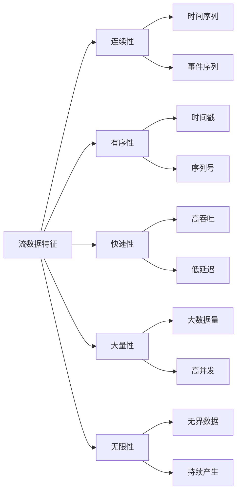
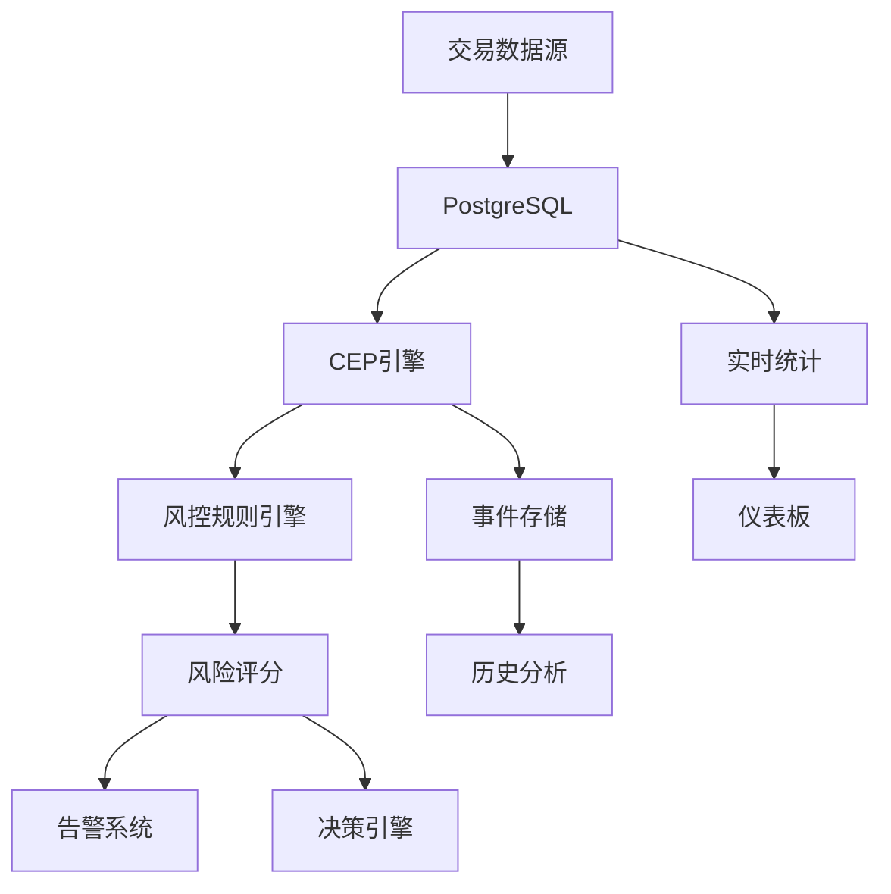
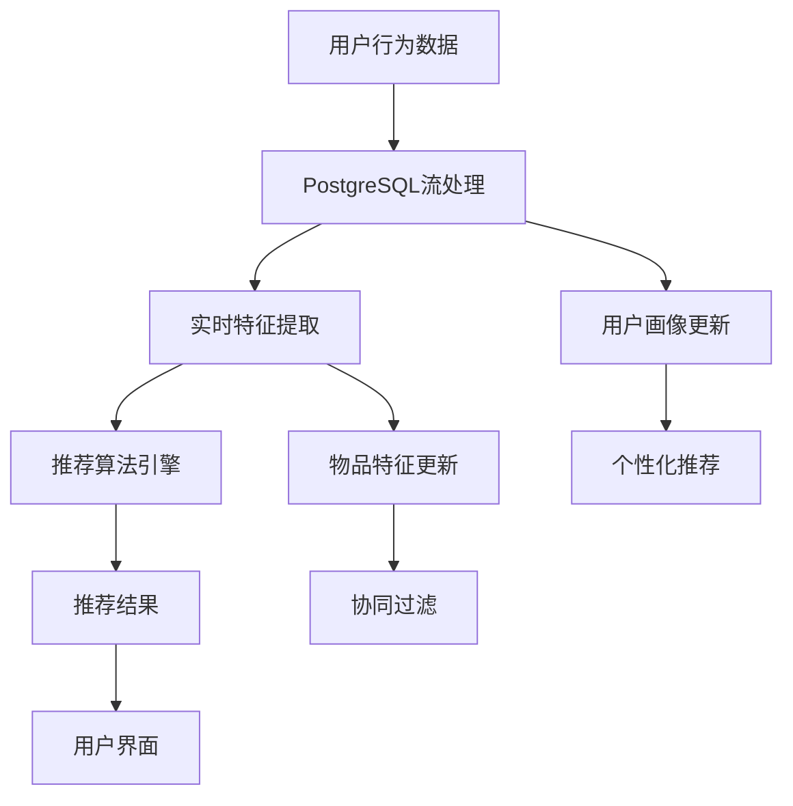

# 1.1.14 实时流处理与CEP

## 📋 概述

实时流处理与复杂事件处理(CEP)是现代数据架构的核心组件，PostgreSQL通过其强大的流处理能力为实时数据分析提供了完整的解决方案。本文档系统性地阐述PostgreSQL在实时流处理、复杂事件处理、流计算架构等方面的理论基础、实现方法和应用实践。

## 🏗️ 理论基础

### 1. 流处理基础概念

#### 1.1 流数据模型

流数据是一种连续、有序、快速、大量、潜在无限的数据序列，具有以下特征：



#### 1.2 流处理模型

**定义 1.1 (流处理模型)**
流处理模型是一个五元组 $\mathcal{M} = (S, E, P, O, T)$，其中：

- $S$ 是流数据源集合
- $E$ 是事件集合
- $P$ 是处理函数集合
- $O$ 是输出集合
- $T$ 是时间域

**定理 1.1 (流处理一致性)**
对于流处理模型 $\mathcal{M}$，如果满足以下条件：

1. 事件顺序性：$\forall e_1, e_2 \in E, t(e_1) < t(e_2) \Rightarrow e_1 \prec e_2$
2. 处理原子性：$\forall p \in P, p$ 是原子的
3. 输出确定性：$\forall o \in O, o$ 是确定的

则 $\mathcal{M}$ 具有一致性保证。

#### 1.3 时间窗口理论

**定义 1.2 (时间窗口)**
时间窗口是一个时间区间 $W = [t_{start}, t_{end}]$，其中：

- $t_{start}$ 是窗口开始时间
- $t_{end}$ 是窗口结束时间
- $|W| = t_{end} - t_{start}$ 是窗口大小

**滑动窗口算法**:

```rust
// Rust实现的滑动窗口
use std::collections::VecDeque;
use std::time::{Duration, Instant};

#[derive(Debug, Clone)]
pub struct SlidingWindow<T> {
    window_size: Duration,
    events: VecDeque<(T, Instant)>,
}

impl<T> SlidingWindow<T> {
    pub fn new(window_size: Duration) -> Self {
        Self {
            window_size,
            events: VecDeque::new(),
        }
    }

    pub fn add_event(&mut self, event: T) {
        let now = Instant::now();
        self.events.push_back((event, now));
        self.cleanup_old_events(now);
    }

    pub fn get_events(&self) -> Vec<&T> {
        self.events.iter().map(|(event, _)| event).collect()
    }

    fn cleanup_old_events(&mut self, now: Instant) {
        while let Some((_, timestamp)) = self.events.front() {
            if now.duration_since(*timestamp) > self.window_size {
                self.events.pop_front();
            } else {
                break;
            }
        }
    }
}

// 使用示例
fn main() {
    let mut window = SlidingWindow::new(Duration::from_secs(60));

    // 添加事件
    window.add_event("transaction_1");
    window.add_event("transaction_2");

    // 获取窗口内事件
    let events = window.get_events();
    println!("Events in window: {:?}", events);
}
```

### 2. 复杂事件处理(CEP)理论

#### 2.1 CEP基础概念

**定义 2.1 (复杂事件)**
复杂事件是由多个简单事件通过时间关系和逻辑关系组合而成的事件模式。

**定义 2.2 (事件模式)**
事件模式是一个三元组 $P = (E, R, C)$，其中：

- $E$ 是事件集合
- $R$ 是事件间关系集合
- $C$ 是约束条件集合

#### 2.2 事件关系类型

| 关系类型 | 数学表示 | 描述 | 示例 |
|---------|---------|------|------|
| 序列关系 | $e_1 \rightarrow e_2$ | 事件按顺序发生 | 登录 → 浏览 → 购买 |
| 并发关系 | $e_1 \parallel e_2$ | 事件同时发生 | 多设备同时登录 |
| 选择关系 | $e_1 \vee e_2$ | 事件选择发生 | 支付方式选择 |
| 重复关系 | $e_1^*$ | 事件重复发生 | 多次尝试登录 |

#### 2.3 CEP模式匹配算法

**算法 2.1 (NFA模式匹配)**:

```python
# Python实现的NFA模式匹配
from typing import Dict, List, Set, Tuple
from dataclasses import dataclass
from enum import Enum

class EventType(Enum):
    LOGIN = "login"
    BROWSE = "browse"
    PURCHASE = "purchase"
    LOGOUT = "logout"

@dataclass
class Event:
    event_type: EventType
    timestamp: float
    user_id: str
    data: Dict

class NFAState:
    def __init__(self, state_id: int):
        self.state_id = state_id
        self.transitions: Dict[EventType, Set[int]] = {}
        self.is_accepting = False

    def add_transition(self, event_type: EventType, next_state: int):
        if event_type not in self.transitions:
            self.transitions[event_type] = set()
        self.transitions[event_type].add(next_state)

class CEPEngine:
    def __init__(self):
        self.states: Dict[int, NFAState] = {}
        self.initial_states: Set[int] = set()
        self.current_states: Set[int] = set()

    def add_state(self, state_id: int, is_accepting: bool = False):
        self.states[state_id] = NFAState(state_id)
        self.states[state_id].is_accepting = is_accepting

    def add_transition(self, from_state: int, event_type: EventType, to_state: int):
        self.states[from_state].add_transition(event_type, to_state)

    def set_initial_state(self, state_id: int):
        self.initial_states.add(state_id)

    def process_event(self, event: Event) -> bool:
        new_states = set()

        # 处理当前状态的所有转换
        for current_state in self.current_states:
            if event.event_type in self.states[current_state].transitions:
                for next_state in self.states[current_state].transitions[event.event_type]:
                    new_states.add(next_state)

        # 处理初始状态的转换
        for initial_state in self.initial_states:
            if event.event_type in self.states[initial_state].transitions:
                for next_state in self.states[initial_state].transitions[event.event_type]:
                    new_states.add(next_state)

        self.current_states = new_states

        # 检查是否有接受状态
        return any(self.states[state].is_accepting for state in self.current_states)

# 使用示例：检测登录-浏览-购买模式
def create_login_browse_purchase_pattern():
    engine = CEPEngine()

    # 创建状态
    engine.add_state(0)  # 初始状态
    engine.add_state(1)  # 登录后
    engine.add_state(2)  # 浏览后
    engine.add_state(3, is_accepting=True)  # 购买后（接受状态）

    # 添加转换
    engine.add_transition(0, EventType.LOGIN, 1)
    engine.add_transition(1, EventType.BROWSE, 2)
    engine.add_transition(2, EventType.PURCHASE, 3)

    engine.set_initial_state(0)
    return engine

# 测试CEP引擎
def test_cep_engine():
    engine = create_login_browse_purchase_pattern()

    events = [
        Event(EventType.LOGIN, 1.0, "user1", {}),
        Event(EventType.BROWSE, 2.0, "user1", {}),
        Event(EventType.PURCHASE, 3.0, "user1", {}),
    ]

    for event in events:
        matched = engine.process_event(event)
        print(f"Event: {event.event_type.value}, Pattern matched: {matched}")
```

## 🔧 PostgreSQL流处理实现

### 1. 触发器基础架构

#### 1.1 触发器类型

PostgreSQL支持多种触发器类型，用于实现流处理：

```sql
-- 1. 行级触发器
CREATE TRIGGER row_trigger
    AFTER INSERT OR UPDATE OR DELETE ON transactions
    FOR EACH ROW
    EXECUTE FUNCTION process_transaction_event();

-- 2. 语句级触发器
CREATE TRIGGER statement_trigger
    AFTER INSERT ON transactions
    FOR EACH STATEMENT
    EXECUTE FUNCTION process_batch_events();

-- 3. 条件触发器
CREATE TRIGGER conditional_trigger
    AFTER INSERT ON transactions
    FOR EACH ROW
    WHEN (NEW.amount > 10000)
    EXECUTE FUNCTION process_high_value_transaction();
```

#### 1.2 高级触发器实现

```sql
-- 复杂事件处理触发器
CREATE OR REPLACE FUNCTION cep_transaction_monitor()
RETURNS TRIGGER AS $$
DECLARE
    user_risk_score FLOAT;
    recent_transactions INTEGER;
    total_amount DECIMAL;
    alert_message TEXT;
BEGIN
    -- 计算用户风险评分
    SELECT
        COUNT(*) as transaction_count,
        SUM(amount) as total_amount
    INTO recent_transactions, total_amount
    FROM transactions
    WHERE user_id = NEW.user_id
    AND created_at >= NOW() - INTERVAL '1 hour';

    -- 风险评分算法
    user_risk_score :=
        CASE
            WHEN recent_transactions > 10 THEN 0.8
            WHEN total_amount > 50000 THEN 0.7
            WHEN NEW.amount > 10000 THEN 0.6
            ELSE 0.2
        END;

    -- 生成告警
    IF user_risk_score > 0.5 THEN
        alert_message := format(
            'High risk transaction detected: User %s, Amount %s, Risk Score %.2f',
            NEW.user_id, NEW.amount, user_risk_score
        );

        INSERT INTO alerts (user_id, transaction_id, risk_score, message, created_at)
        VALUES (NEW.user_id, NEW.id, user_risk_score, alert_message, NOW());

        -- 发送通知
        PERFORM pg_notify('transaction_alerts', alert_message);
    END IF;

    RETURN NEW;
END;
$$ LANGUAGE plpgsql;

-- 创建触发器
CREATE TRIGGER transaction_cep_trigger
    AFTER INSERT ON transactions
    FOR EACH ROW
    EXECUTE FUNCTION cep_transaction_monitor();
```

### 2. 通知系统

#### 2.1 异步通知架构

```sql
-- 通知通道定义
CREATE OR REPLACE FUNCTION setup_notification_channels()
RETURNS VOID AS $$
BEGIN
    -- 创建通知通道
    PERFORM pg_notify('transaction_events', 'channel_ready');
    PERFORM pg_notify('user_events', 'channel_ready');
    PERFORM pg_notify('system_events', 'channel_ready');
END;
$$ LANGUAGE plpgsql;

-- 事件发布函数
CREATE OR REPLACE FUNCTION publish_transaction_event(
    event_type TEXT,
    event_data JSONB
)
RETURNS VOID AS $$
BEGIN
    PERFORM pg_notify(
        'transaction_events',
        json_build_object(
            'type', event_type,
            'data', event_data,
            'timestamp', NOW()
        )::TEXT
    );
END;
$$ LANGUAGE plpgsql;
```

#### 2.2 通知监听器

```python
# Python通知监听器
import psycopg2
import json
import threading
from typing import Callable, Dict, Any

class PostgreSQLNotificationListener:
    def __init__(self, connection_params: Dict[str, Any]):
        self.connection_params = connection_params
        self.connection = None
        self.running = False
        self.handlers: Dict[str, Callable] = {}

    def connect(self):
        self.connection = psycopg2.connect(**self.connection_params)
        self.connection.set_isolation_level(psycopg2.extensions.ISOLATION_LEVEL_AUTOCOMMIT)

    def add_handler(self, channel: str, handler: Callable):
        self.handlers[channel] = handler

    def listen(self, channel: str):
        cursor = self.connection.cursor()
        cursor.execute(f"LISTEN {channel}")

    def start_listening(self):
        self.running = True
        self.connect()

        # 监听所有注册的通道
        for channel in self.handlers.keys():
            self.listen(channel)

        while self.running:
            if self.connection.poll():
                notify = self.connection.notifies.pop()
                channel = notify.channel
                payload = notify.payload

                if channel in self.handlers:
                    try:
                        event_data = json.loads(payload)
                        self.handlers[channel](event_data)
                    except json.JSONDecodeError:
                        print(f"Invalid JSON payload: {payload}")

    def stop(self):
        self.running = False
        if self.connection:
            self.connection.close()

# 使用示例
def transaction_handler(event_data):
    print(f"Transaction event: {event_data}")

def user_handler(event_data):
    print(f"User event: {event_data}")

# 创建监听器
listener = PostgreSQLNotificationListener({
    'host': 'localhost',
    'database': 'streaming_db',
    'user': 'postgres',
    'password': 'password'
})

# 注册处理器
listener.add_handler('transaction_events', transaction_handler)
listener.add_handler('user_events', user_handler)

# 启动监听
thread = threading.Thread(target=listener.start_listening)
thread.start()
```

### 3. 窗口函数与流式SQL

#### 3.1 时间窗口聚合

```sql
-- 滑动窗口聚合查询
WITH time_windows AS (
    SELECT
        transaction_id,
        amount,
        user_id,
        created_at,
        -- 1分钟滑动窗口
        date_trunc('minute', created_at) as window_start,
        date_trunc('minute', created_at) + INTERVAL '1 minute' as window_end
    FROM transactions
    WHERE created_at >= NOW() - INTERVAL '1 hour'
),
window_aggregates AS (
    SELECT
        window_start,
        window_end,
        COUNT(*) as transaction_count,
        SUM(amount) as total_amount,
        AVG(amount) as avg_amount,
        COUNT(DISTINCT user_id) as unique_users
    FROM time_windows
    GROUP BY window_start, window_end
    ORDER BY window_start
)
SELECT
    window_start,
    window_end,
    transaction_count,
    total_amount,
    avg_amount,
    unique_users,
    -- 计算变化率
    LAG(total_amount) OVER (ORDER BY window_start) as prev_total,
    (total_amount - LAG(total_amount) OVER (ORDER BY window_start)) /
    NULLIF(LAG(total_amount) OVER (ORDER BY window_start), 0) * 100 as growth_rate
FROM window_aggregates;
```

#### 3.2 实时统计视图

```sql
-- 创建实时统计视图
CREATE OR REPLACE VIEW real_time_stats AS
WITH recent_transactions AS (
    SELECT
        *,
        ROW_NUMBER() OVER (PARTITION BY user_id ORDER BY created_at DESC) as rn
    FROM transactions
    WHERE created_at >= NOW() - INTERVAL '5 minutes'
),
user_stats AS (
    SELECT
        user_id,
        COUNT(*) as transaction_count,
        SUM(amount) as total_amount,
        AVG(amount) as avg_amount,
        MAX(amount) as max_amount,
        MIN(created_at) as first_transaction,
        MAX(created_at) as last_transaction
    FROM recent_transactions
    GROUP BY user_id
),
global_stats AS (
    SELECT
        COUNT(*) as total_transactions,
        SUM(amount) as total_volume,
        AVG(amount) as avg_transaction,
        COUNT(DISTINCT user_id) as active_users
    FROM recent_transactions
)
SELECT
    gs.*,
    us.user_id,
    us.transaction_count as user_transactions,
    us.total_amount as user_total,
    us.avg_amount as user_avg
FROM global_stats gs
CROSS JOIN user_stats us
ORDER BY us.total_amount DESC;
```

## 🏭 行业应用案例

### 1. 金融行业：实时风控系统

#### 1.1 系统架构



#### 1.2 风控规则实现

```sql
-- 风控规则表
CREATE TABLE risk_rules (
    rule_id SERIAL PRIMARY KEY,
    rule_name VARCHAR(100) NOT NULL,
    rule_type VARCHAR(50) NOT NULL, -- 'threshold', 'pattern', 'anomaly'
    rule_condition JSONB NOT NULL,
    risk_score FLOAT NOT NULL,
    is_active BOOLEAN DEFAULT TRUE,
    created_at TIMESTAMP DEFAULT NOW()
);

-- 插入风控规则
INSERT INTO risk_rules (rule_name, rule_type, rule_condition, risk_score) VALUES
('高频交易检测', 'threshold',
 '{"metric": "transaction_count", "operator": ">", "value": 10, "window": "1_hour"}', 0.8),
('大额交易检测', 'threshold',
 '{"metric": "amount", "operator": ">", "value": 10000}', 0.6),
('异常时间交易', 'pattern',
 '{"pattern": "night_transaction", "time_range": ["22:00", "06:00"]}', 0.4),
('异地登录检测', 'pattern',
 '{"pattern": "location_change", "time_window": "5_minutes"}', 0.7);

-- 风控评估函数
CREATE OR REPLACE FUNCTION evaluate_risk_rules(
    p_user_id INTEGER,
    p_amount DECIMAL,
    p_location TEXT,
    p_timestamp TIMESTAMP
)
RETURNS TABLE(rule_id INTEGER, risk_score FLOAT, triggered BOOLEAN) AS $$
DECLARE
    rule_record RECORD;
    condition_met BOOLEAN;
    recent_count INTEGER;
    recent_amount DECIMAL;
BEGIN
    FOR rule_record IN
        SELECT * FROM risk_rules WHERE is_active = TRUE
    LOOP
        condition_met := FALSE;

        CASE rule_record.rule_type
            WHEN 'threshold' THEN
                -- 阈值规则评估
                IF rule_record.rule_condition->>'metric' = 'transaction_count' THEN
                    SELECT COUNT(*) INTO recent_count
                    FROM transactions
                    WHERE user_id = p_user_id
                    AND created_at >= NOW() - INTERVAL '1 hour';

                    condition_met := recent_count > (rule_record.rule_condition->>'value')::INTEGER;
                ELSIF rule_record.rule_condition->>'metric' = 'amount' THEN
                    condition_met := p_amount > (rule_record.rule_condition->>'value')::DECIMAL;
                END IF;

            WHEN 'pattern' THEN
                -- 模式规则评估
                IF rule_record.rule_condition->>'pattern' = 'night_transaction' THEN
                    condition_met := EXTRACT(HOUR FROM p_timestamp) >= 22 OR EXTRACT(HOUR FROM p_timestamp) <= 6;
                ELSIF rule_record.rule_condition->>'pattern' = 'location_change' THEN
                    -- 检查5分钟内是否有位置变化
                    SELECT COUNT(*) INTO recent_count
                    FROM transactions
                    WHERE user_id = p_user_id
                    AND location != p_location
                    AND created_at >= p_timestamp - INTERVAL '5 minutes';

                    condition_met := recent_count > 0;
                END IF;
        END CASE;

        rule_id := rule_record.rule_id;
        risk_score := rule_record.risk_score;
        triggered := condition_met;

        RETURN NEXT;
    END LOOP;
END;
$$ LANGUAGE plpgsql;
```

#### 1.3 实时风控监控

```python
# Python实时风控监控系统
import psycopg2
import json
import time
from datetime import datetime
from typing import Dict, List, Any

class RealTimeRiskMonitor:
    def __init__(self, db_config: Dict[str, Any]):
        self.db_config = db_config
        self.connection = psycopg2.connect(**db_config)
        self.risk_thresholds = {
            'high_risk': 0.7,
            'medium_risk': 0.4,
            'low_risk': 0.2
        }

    def evaluate_transaction(self, transaction_data: Dict[str, Any]) -> Dict[str, Any]:
        """评估单笔交易风险"""
        cursor = self.connection.cursor()

        # 调用PostgreSQL风控函数
        cursor.execute("""
            SELECT rule_id, risk_score, triggered
            FROM evaluate_risk_rules(%s, %s, %s, %s)
        """, (
            transaction_data['user_id'],
            transaction_data['amount'],
            transaction_data['location'],
            transaction_data['timestamp']
        ))

        results = cursor.fetchall()

        # 计算综合风险评分
        total_risk_score = 0.0
        triggered_rules = []

        for rule_id, risk_score, triggered in results:
            if triggered:
                total_risk_score += risk_score
                triggered_rules.append(rule_id)

        # 确定风险等级
        risk_level = 'low'
        if total_risk_score >= self.risk_thresholds['high_risk']:
            risk_level = 'high'
        elif total_risk_score >= self.risk_thresholds['medium_risk']:
            risk_level = 'medium'

        return {
            'transaction_id': transaction_data['id'],
            'user_id': transaction_data['user_id'],
            'total_risk_score': total_risk_score,
            'risk_level': risk_level,
            'triggered_rules': triggered_rules,
            'evaluation_time': datetime.now().isoformat()
        }

    def monitor_transactions(self):
        """持续监控交易"""
        cursor = self.connection.cursor()

        # 监听新交易
        cursor.execute("LISTEN transaction_events")

        while True:
            if self.connection.poll():
                notify = self.connection.notifies.pop()
                event_data = json.loads(notify.payload)

                if event_data['type'] == 'transaction_created':
                    risk_assessment = self.evaluate_transaction(event_data['data'])

                    # 处理高风险交易
                    if risk_assessment['risk_level'] == 'high':
                        self.handle_high_risk_transaction(risk_assessment)

                    # 记录风险评估结果
                    self.log_risk_assessment(risk_assessment)

    def handle_high_risk_transaction(self, risk_assessment: Dict[str, Any]):
        """处理高风险交易"""
        print(f"🚨 High risk transaction detected: {risk_assessment}")

        # 发送告警
        self.send_alert(risk_assessment)

        # 可能的自动响应
        if risk_assessment['total_risk_score'] > 0.9:
            self.block_transaction(risk_assessment['transaction_id'])

    def send_alert(self, risk_assessment: Dict[str, Any]):
        """发送告警"""
        alert_message = {
            'type': 'risk_alert',
            'level': risk_assessment['risk_level'],
            'transaction_id': risk_assessment['transaction_id'],
            'user_id': risk_assessment['user_id'],
            'risk_score': risk_assessment['total_risk_score'],
            'timestamp': datetime.now().isoformat()
        }

        # 这里可以集成各种告警系统
        print(f"Alert: {alert_message}")

    def log_risk_assessment(self, risk_assessment: Dict[str, Any]):
        """记录风险评估结果"""
        cursor = self.connection.cursor()
        cursor.execute("""
            INSERT INTO risk_assessments
            (transaction_id, user_id, risk_score, risk_level, triggered_rules, created_at)
            VALUES (%s, %s, %s, %s, %s, %s)
        """, (
            risk_assessment['transaction_id'],
            risk_assessment['user_id'],
            risk_assessment['total_risk_score'],
            risk_assessment['risk_level'],
            json.dumps(risk_assessment['triggered_rules']),
            datetime.now()
        ))
        self.connection.commit()

# 使用示例
if __name__ == "__main__":
    db_config = {
        'host': 'localhost',
        'database': 'financial_db',
        'user': 'postgres',
        'password': 'password'
    }

    monitor = RealTimeRiskMonitor(db_config)

    # 启动监控
    try:
        monitor.monitor_transactions()
    except KeyboardInterrupt:
        print("Monitoring stopped")
```

### 2. 互联网行业：实时推荐系统

#### 2.1 推荐系统架构



#### 2.2 实时推荐算法

```python
# Python实时推荐系统
import numpy as np
import pandas as pd
from sklearn.metrics.pairwise import cosine_similarity
from typing import List, Dict, Any
import psycopg2
import json

class RealTimeRecommendationSystem:
    def __init__(self, db_config: Dict[str, Any]):
        self.db_config = db_config
        self.connection = psycopg2.connect(**db_config)
        self.user_profiles = {}
        self.item_profiles = {}
        self.similarity_matrix = None

    def update_user_profile(self, user_id: int, event_data: Dict[str, Any]):
        """更新用户画像"""
        event_type = event_data['type']
        item_id = event_data['item_id']
        timestamp = event_data['timestamp']

        if user_id not in self.user_profiles:
            self.user_profiles[user_id] = {
                'interactions': {},
                'preferences': {},
                'last_activity': timestamp
            }

        # 更新交互历史
        if item_id not in self.user_profiles[user_id]['interactions']:
            self.user_profiles[user_id]['interactions'][item_id] = []

        self.user_profiles[user_id]['interactions'][item_id].append({
            'type': event_type,
            'timestamp': timestamp
        })

        # 更新偏好权重
        weight_map = {
            'view': 1,
            'like': 3,
            'share': 5,
            'purchase': 10
        }

        weight = weight_map.get(event_type, 1)
        if item_id not in self.user_profiles[user_id]['preferences']:
            self.user_profiles[user_id]['preferences'][item_id] = 0

        self.user_profiles[user_id]['preferences'][item_id] += weight
        self.user_profiles[user_id]['last_activity'] = timestamp

    def calculate_item_similarity(self):
        """计算物品相似度矩阵"""
        # 获取所有用户-物品交互数据
        cursor = self.connection.cursor()
        cursor.execute("""
            SELECT user_id, item_id,
                   SUM(CASE WHEN event_type = 'purchase' THEN 10
                           WHEN event_type = 'like' THEN 3
                           WHEN event_type = 'view' THEN 1
                           ELSE 0 END) as weight
            FROM user_events
            WHERE created_at >= NOW() - INTERVAL '7 days'
            GROUP BY user_id, item_id
        """)

        interactions = cursor.fetchall()

        # 构建用户-物品矩阵
        df = pd.DataFrame(interactions, columns=['user_id', 'item_id', 'weight'])
        user_item_matrix = df.pivot_table(
            index='user_id',
            columns='item_id',
            values='weight',
            fill_value=0
        )

        # 计算物品相似度
        self.similarity_matrix = cosine_similarity(user_item_matrix.T)
        self.item_ids = user_item_matrix.columns.tolist()

    def get_recommendations(self, user_id: int, n_recommendations: int = 10) -> List[Dict[str, Any]]:
        """获取推荐结果"""
        if user_id not in self.user_profiles:
            return []

        user_preferences = self.user_profiles[user_id]['preferences']

        if not user_preferences:
            return []

        # 计算推荐分数
        recommendation_scores = {}

        for item_id in self.item_ids:
            if item_id in user_preferences:
                continue  # 跳过用户已经交互过的物品

            score = 0
            for interacted_item, weight in user_preferences.items():
                if interacted_item in self.item_ids:
                    item_idx = self.item_ids.index(interacted_item)
                    current_idx = self.item_ids.index(item_id)
                    similarity = self.similarity_matrix[item_idx][current_idx]
                    score += weight * similarity

            recommendation_scores[item_id] = score

        # 排序并返回推荐结果
        sorted_recommendations = sorted(
            recommendation_scores.items(),
            key=lambda x: x[1],
            reverse=True
        )

        return [
            {
                'item_id': item_id,
                'score': score,
                'reason': 'Based on your preferences'
            }
            for item_id, score in sorted_recommendations[:n_recommendations]
        ]

    def process_user_event(self, event_data: Dict[str, Any]):
        """处理用户事件"""
        user_id = event_data['user_id']

        # 更新用户画像
        self.update_user_profile(user_id, event_data)

        # 定期重新计算相似度矩阵
        if len(self.user_profiles) % 100 == 0:  # 每100个事件重新计算
            self.calculate_item_similarity()

        # 生成实时推荐
        recommendations = self.get_recommendations(user_id)

        # 存储推荐结果
        self.store_recommendations(user_id, recommendations)

        return recommendations

    def store_recommendations(self, user_id: int, recommendations: List[Dict[str, Any]]):
        """存储推荐结果"""
        cursor = self.connection.cursor()

        # 清除旧推荐
        cursor.execute("DELETE FROM user_recommendations WHERE user_id = %s", (user_id,))

        # 插入新推荐
        for i, rec in enumerate(recommendations):
            cursor.execute("""
                INSERT INTO user_recommendations
                (user_id, item_id, score, rank, created_at)
                VALUES (%s, %s, %s, %s, %s)
            """, (user_id, rec['item_id'], rec['score'], i+1, datetime.now()))

        self.connection.commit()

# 使用示例
def test_recommendation_system():
    db_config = {
        'host': 'localhost',
        'database': 'recommendation_db',
        'user': 'postgres',
        'password': 'password'
    }

    rec_system = RealTimeRecommendationSystem(db_config)

    # 模拟用户事件
    events = [
        {'user_id': 1, 'item_id': 101, 'type': 'view', 'timestamp': datetime.now()},
        {'user_id': 1, 'item_id': 102, 'type': 'like', 'timestamp': datetime.now()},
        {'user_id': 1, 'item_id': 103, 'type': 'purchase', 'timestamp': datetime.now()},
    ]

    for event in events:
        recommendations = rec_system.process_user_event(event)
        print(f"User {event['user_id']} recommendations: {recommendations}")
```

## 📊 性能优化与监控

### 1. 性能优化策略

#### 1.1 索引优化

```sql
-- 流处理相关索引
CREATE INDEX CONCURRENTLY idx_transactions_user_time
ON transactions(user_id, created_at);

CREATE INDEX CONCURRENTLY idx_transactions_amount_time
ON transactions(amount, created_at)
WHERE amount > 1000;

CREATE INDEX CONCURRENTLY idx_user_events_user_type_time
ON user_events(user_id, event_type, created_at);

-- 部分索引优化
CREATE INDEX CONCURRENTLY idx_recent_transactions
ON transactions(created_at)
WHERE created_at >= NOW() - INTERVAL '24 hours';

-- 复合索引优化
CREATE INDEX CONCURRENTLY idx_transactions_composite
ON transactions(user_id, amount, created_at, status);
```

#### 1.2 分区策略

```sql
-- 按时间分区
CREATE TABLE transactions_partitioned (
    id SERIAL,
    user_id INTEGER,
    amount DECIMAL,
    created_at TIMESTAMP,
    status VARCHAR(20)
) PARTITION BY RANGE (created_at);

-- 创建分区
CREATE TABLE transactions_2024_01 PARTITION OF transactions_partitioned
FOR VALUES FROM ('2024-01-01') TO ('2024-02-01');

CREATE TABLE transactions_2024_02 PARTITION OF transactions_partitioned
FOR VALUES FROM ('2024-02-01') TO ('2024-03-01');

-- 自动分区管理
CREATE OR REPLACE FUNCTION create_monthly_partition(table_name TEXT, month_date DATE)
RETURNS VOID AS $$
DECLARE
    partition_name TEXT;
    start_date DATE;
    end_date DATE;
BEGIN
    partition_name := table_name || '_' || to_char(month_date, 'YYYY_MM');
    start_date := date_trunc('month', month_date);
    end_date := start_date + INTERVAL '1 month';

    EXECUTE format(
        'CREATE TABLE IF NOT EXISTS %I PARTITION OF %I FOR VALUES FROM (%L) TO (%L)',
        partition_name, table_name, start_date, end_date
    );
END;
$$ LANGUAGE plpgsql;
```

### 2. 监控与诊断

#### 2.1 性能监控视图

```sql
-- 流处理性能监控视图
CREATE OR REPLACE VIEW streaming_performance AS
WITH current_stats AS (
    SELECT
        COUNT(*) as total_transactions,
        COUNT(*) FILTER (WHERE created_at >= NOW() - INTERVAL '1 minute') as transactions_last_minute,
        AVG(EXTRACT(EPOCH FROM (NOW() - created_at))) as avg_processing_delay,
        COUNT(DISTINCT user_id) as active_users
    FROM transactions
    WHERE created_at >= NOW() - INTERVAL '1 hour'
),
trigger_stats AS (
    SELECT
        trigger_name,
        COUNT(*) as execution_count,
        AVG(execution_time_ms) as avg_execution_time,
        MAX(execution_time_ms) as max_execution_time
    FROM trigger_execution_log
    WHERE executed_at >= NOW() - INTERVAL '1 hour'
    GROUP BY trigger_name
),
notification_stats AS (
    SELECT
        channel,
        COUNT(*) as notification_count,
        AVG(EXTRACT(EPOCH FROM (processed_at - sent_at))) as avg_processing_time
    FROM notification_log
    WHERE sent_at >= NOW() - INTERVAL '1 hour'
    GROUP BY channel
)
SELECT
    cs.*,
    ts.trigger_name,
    ts.execution_count,
    ts.avg_execution_time,
    ns.channel,
    ns.notification_count,
    ns.avg_processing_time
FROM current_stats cs
CROSS JOIN trigger_stats ts
CROSS JOIN notification_stats ns;
```

#### 2.2 实时监控仪表板

```python
# Python实时监控仪表板
import dash
from dash import dcc, html
from dash.dependencies import Input, Output
import plotly.graph_objs as go
import pandas as pd
import psycopg2
from datetime import datetime, timedelta

class StreamingDashboard:
    def __init__(self, db_config):
        self.db_config = db_config
        self.app = dash.Dash(__name__)
        self.setup_layout()
        self.setup_callbacks()

    def setup_layout(self):
        self.app.layout = html.Div([
            html.H1("实时流处理监控仪表板"),

            # 实时指标卡片
            html.Div([
                html.Div([
                    html.H3(id='total-transactions'),
                    html.P("总交易数")
                ], className='metric-card'),
                html.Div([
                    html.H3(id='tps'),
                    html.P("TPS")
                ], className='metric-card'),
                html.Div([
                    html.H3(id='avg-latency'),
                    html.P("平均延迟(ms)")
                ], className='metric-card'),
                html.Div([
                    html.H3(id='active-users'),
                    html.P("活跃用户")
                ], className='metric-card'),
            ], className='metrics-row'),

            # 图表区域
            html.Div([
                dcc.Graph(id='transaction-timeline'),
                dcc.Graph(id='latency-distribution'),
                dcc.Graph(id='user-activity'),
            ], className='charts-container'),

            # 自动刷新
            dcc.Interval(
                id='interval-component',
                interval=5*1000,  # 5秒刷新
                n_intervals=0
            )
        ])

    def setup_callbacks(self):
        @self.app.callback(
            [Output('total-transactions', 'children'),
             Output('tps', 'children'),
             Output('avg-latency', 'children'),
             Output('active-users', 'children')],
            [Input('interval-component', 'n_intervals')]
        )
        def update_metrics(n):
            return self.get_current_metrics()

        @self.app.callback(
            Output('transaction-timeline', 'figure'),
            [Input('interval-component', 'n_intervals')]
        )
        def update_timeline(n):
            return self.get_transaction_timeline()

    def get_current_metrics(self):
        """获取当前指标"""
        conn = psycopg2.connect(**self.db_config)
        cursor = conn.cursor()

        # 获取实时指标
        cursor.execute("""
            SELECT
                COUNT(*) as total_transactions,
                COUNT(*) FILTER (WHERE created_at >= NOW() - INTERVAL '1 minute') as tps,
                AVG(EXTRACT(EPOCH FROM (NOW() - created_at)) * 1000) as avg_latency,
                COUNT(DISTINCT user_id) FILTER (WHERE created_at >= NOW() - INTERVAL '5 minutes') as active_users
            FROM transactions
            WHERE created_at >= NOW() - INTERVAL '1 hour'
        """)

        result = cursor.fetchone()
        conn.close()

        return [
            f"{result[0]:,}",
            f"{result[1]}",
            f"{result[2]:.2f}",
            f"{result[3]}"
        ]

    def get_transaction_timeline(self):
        """获取交易时间线"""
        conn = psycopg2.connect(**self.db_config)

        # 获取最近1小时的交易数据
        df = pd.read_sql("""
            SELECT
                date_trunc('minute', created_at) as minute,
                COUNT(*) as transaction_count,
                SUM(amount) as total_amount
            FROM transactions
            WHERE created_at >= NOW() - INTERVAL '1 hour'
            GROUP BY minute
            ORDER BY minute
        """, conn)

        conn.close()

        return {
            'data': [
                go.Scatter(
                    x=df['minute'],
                    y=df['transaction_count'],
                    mode='lines+markers',
                    name='交易数量'
                ),
                go.Scatter(
                    x=df['minute'],
                    y=df['total_amount'],
                    mode='lines+markers',
                    name='交易金额',
                    yaxis='y2'
                )
            ],
            'layout': go.Layout(
                title='交易时间线',
                xaxis={'title': '时间'},
                yaxis={'title': '交易数量'},
                yaxis2={'title': '交易金额', 'overlaying': 'y', 'side': 'right'}
            )
        }

    def run(self, debug=True, port=8050):
        self.app.run_server(debug=debug, port=port)

# 使用示例
if __name__ == "__main__":
    db_config = {
        'host': 'localhost',
        'database': 'streaming_db',
        'user': 'postgres',
        'password': 'password'
    }

    dashboard = StreamingDashboard(db_config)
    dashboard.run()
```

## 🔗 相关链接

- [1.1.15-云原生与容器化部署](1.1.15-云原生与容器化部署.md) - PostgreSQL云原生部署
- [1.1.16-性能调优与监控](1.1.16-性能调优与监控.md) - 性能优化策略
- [1.1.17-安全与合规](1.1.17-安全与合规.md) - 安全合规实现
- [3.5.5-数据流处理与架构](../../../3-数据模型与算法/3.5-数据分析与ETL/3.5.5-数据流处理与架构.md) - 数据流处理架构
- [4.3.1-微服务架构基础理论](../../../4-软件架构与工程/4.3-微服务架构/4.3.1-微服务架构基础理论.md) - 微服务架构理论

[返回PostgreSQL导航](README.md)
