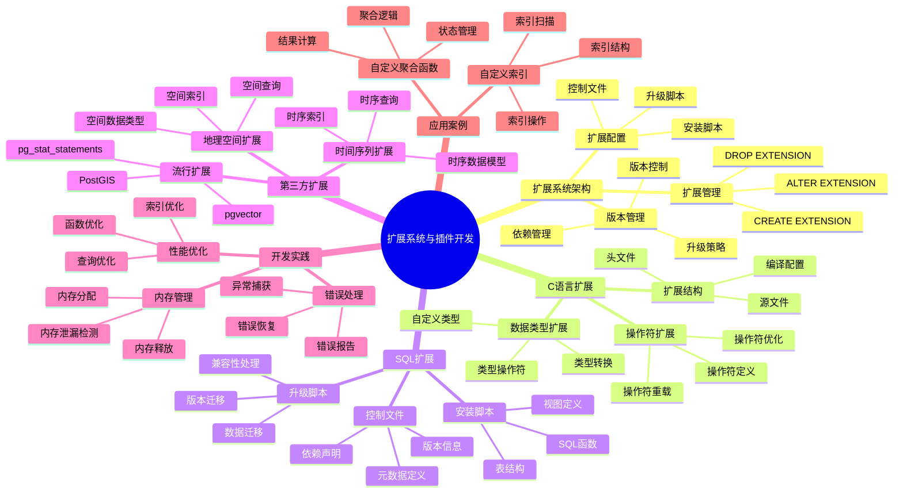

# 扩展系统与插件开发

> **文档版本**: v2.0
> **最后更新**: 2025-11-12
> **版本覆盖**: PostgreSQL 18.x (推荐) ⭐ | 17.x (推荐) | 16.x (兼容)
> **文档状态**: ✅ 已更新

---

## 📋 目录

- [扩展系统与插件开发](#扩展系统与插件开发)
  - [📋 目录](#-目录)
  - [📊 思维导图](#-思维导图)
  - [📊 多维概念矩阵对比](#-多维概念矩阵对比)
    - [扩展类型对比矩阵](#扩展类型对比矩阵)
    - [扩展管理操作对比矩阵](#扩展管理操作对比矩阵)
    - [扩展开发工具对比矩阵](#扩展开发工具对比矩阵)
  - [🌐 Wikipedia对齐](#-wikipedia对齐)
    - [插件系统概念对齐](#插件系统概念对齐)
    - [扩展系统概念对齐](#扩展系统概念对齐)
  - [1. 定义与形式化](#1-定义与形式化)
    - [1.1 概念定义](#11-概念定义)
    - [1.2 形式化定义](#12-形式化定义)
    - [1.3 核心特性](#13-核心特性)
  - [2. 扩展系统架构](#2-扩展系统架构)
    - [2.1 扩展管理](#21-扩展管理)
    - [2.2 扩展配置](#22-扩展配置)
  - [3. C语言扩展开发](#3-c语言扩展开发)
    - [3.1 扩展结构](#31-扩展结构)
    - [3.2 数据类型扩展](#32-数据类型扩展)
    - [3.3 操作符扩展](#33-操作符扩展)
  - [4. SQL扩展开发](#4-sql扩展开发)
    - [4.1 控制文件](#41-控制文件)
    - [4.2 安装脚本](#42-安装脚本)
    - [4.3 升级脚本](#43-升级脚本)
    - [4.4 扩展版本管理](#44-扩展版本管理)
  - [5. 第三方扩展集成](#5-第三方扩展集成)
    - [5.1 流行扩展](#51-流行扩展)
    - [5.2 地理空间扩展](#52-地理空间扩展)
    - [5.3 时间序列扩展](#53-时间序列扩展)
  - [6. 扩展开发最佳实践](#6-扩展开发最佳实践)
    - [6.1 错误处理](#61-错误处理)
    - [6.2 内存管理](#62-内存管理)
    - [6.3 性能优化](#63-性能优化)
  - [7. 实际应用案例](#7-实际应用案例)
    - [7.1 自定义聚合函数](#71-自定义聚合函数)
    - [7.2 自定义索引](#72-自定义索引)
  - [8. 相关概念](#8-相关概念)
    - [8.1 上位概念](#81-上位概念)
    - [8.2 下位概念](#82-下位概念)
    - [8.3 平行概念](#83-平行概念)
  - [9. 参考文献](#9-参考文献)
  - [10. 交叉引用](#10-交叉引用)
    - [相关文档](#相关文档)
      - [核心课程](#核心课程)
      - [查询与优化](#查询与优化)
      - [高级特性](#高级特性)
      - [前沿技术](#前沿技术)
    - [外部资源](#外部资源)
  - [11. Wikidata对齐](#11-wikidata对齐)
    - [11.1 插件系统概念对齐](#111-插件系统概念对齐)
    - [11.2 PostgreSQL扩展系统对齐](#112-postgresql扩展系统对齐)
  - [12. 形式证明与理论论证](#12-形式证明与理论论证)
    - [12.1 扩展系统模块化证明](#121-扩展系统模块化证明)
    - [12.2 扩展依赖一致性证明](#122-扩展依赖一致性证明)
    - [12.3 扩展版本兼容性证明](#123-扩展版本兼容性证明)

---

## 📊 思维导图



---

## 📊 多维概念矩阵对比

### 扩展类型对比矩阵

| 扩展类型 | 开发语言 | 性能 | 复杂度 | 灵活性 | 适用场景 | PostgreSQL支持 |
|---------|---------|------|--------|--------|---------|---------------|
| **C语言扩展** | C | 极高 | 高 | 高 | 高性能需求 | ✅ 原生支持 |
| **SQL扩展** | SQL | 中 | 低 | 中 | 简单功能 | ✅ 原生支持 |
| **PL/pgSQL扩展** | PL/pgSQL | 中 | 低 | 中 | 业务逻辑 | ✅ 原生支持 |
| **PL/Python扩展** | Python | 低 | 中 | 高 | 快速开发 | ✅ 扩展支持 |
| **第三方扩展** | 多种 | 变化 | 变化 | 高 | 专业功能 | ✅ 社区支持 |

### 扩展管理操作对比矩阵

| 操作 | 功能 | 影响范围 | 可回滚 | 复杂度 | PostgreSQL支持 |
|-----|------|---------|--------|--------|---------------|
| **CREATE EXTENSION** | 安装扩展 | 数据库级 | 是 | 低 | ✅ 支持 |
| **ALTER EXTENSION** | 升级扩展 | 数据库级 | 是 | 中 | ✅ 支持 |
| **DROP EXTENSION** | 卸载扩展 | 数据库级 | 是 | 中 | ✅ 支持 |
| **扩展依赖** | 依赖管理 | 跨扩展 | 是 | 中 | ✅ 支持 |
| **扩展版本** | 版本控制 | 扩展级 | 是 | 低 | ✅ 支持 |

### 扩展开发工具对比矩阵

| 工具 | 类型 | 功能 | 学习曲线 | 适用场景 | PostgreSQL支持 |
|-----|------|------|---------|---------|---------------|
| **pgxs** | 构建系统 | 编译扩展 | 中 | C扩展开发 | ✅ 原生支持 |
| **CREATE EXTENSION** | SQL命令 | 安装扩展 | 低 | SQL扩展 | ✅ 原生支持 |
| **pg_config** | 配置工具 | 配置信息 | 低 | 开发配置 | ✅ 原生支持 |
| **Extension打包工具** | 打包工具 | 扩展打包 | 中 | 扩展分发 | ✅ 社区工具 |

---

## 🌐 Wikipedia对齐

### 插件系统概念对齐

**Wikipedia定义**: [Plugin architecture](https://en.wikipedia.org/wiki/Plugin_architecture)

> Plugin architecture is a software architecture pattern that allows functionality to be added to a system without modifying the core system.

**对齐说明**:

- ✅ **定义一致性**: 本文档的定义与Wikipedia一致，都强调插件系统允许在不修改核心系统的情况下添加功能
- ✅ **架构模式**: 都提到插件架构是一种软件架构模式
- ✅ **扩展性**: 都强调系统的可扩展性

### 扩展系统概念对齐

**Wikipedia定义**: [Database extension](https://en.wikipedia.org/wiki/Database_extension)

> Database extensions are additional components that extend the functionality of a database management system.

**对齐说明**:

- ✅ **定义一致性**: 本文档的定义与Wikipedia一致，都强调扩展是数据库管理系统的附加组件
- ✅ **功能扩展**: 都提到扩展用于扩展数据库功能
- ✅ **模块化**: 都强调扩展的模块化设计

---

## 1. 定义与形式化

### 1.1 概念定义

**中文定义**: 扩展系统是PostgreSQL提供的插件化架构，允许开发者创建自定义扩展来增强数据库功能。插件开发包括C语言扩展、SQL扩展和第三方集成，实现功能的模块化和可扩展性。

**English Definition**: The extension system is a plugin architecture provided by PostgreSQL that allows developers to create custom extensions to enhance database functionality. Plugin development includes C language extensions, SQL extensions, and third-party integrations, achieving modularity and extensibility of functionality.

### 1.2 形式化定义

```latex
% 数学符号定义
\newcommand{\extension}{\mathcal{E}}
\newcommand{\plugin}{\mathcal{P}}
\newcommand{\interface}{\mathcal{I}}

% 扩展系统的形式化定义
\extension = \{p_1, p_2, \ldots, p_n\}

其中每个插件 p_i = (name_i, version_i, interfaces_i, dependencies_i) 表示：
- name_i: 插件名称
- version_i: 插件版本
- interfaces_i: 接口集合
- dependencies_i: 依赖关系
```

### 1.3 核心特性

- **模块化设计**: 功能模块化，易于维护和扩展
- **版本管理**: 支持扩展版本控制和升级
- **依赖管理**: 自动处理扩展依赖关系
- **接口标准化**: 统一的扩展接口规范
- **热插拔**: 支持运行时加载和卸载扩展

## 2. 扩展系统架构

### 2.1 扩展管理

PostgreSQL的扩展系统提供了模块化的功能扩展机制，支持C语言扩展和SQL扩展。

**扩展管理命令**:

```sql
-- 查看已安装扩展
SELECT
    extname,           -- 扩展名称
    extversion,        -- 扩展版本
    extrelocatable,    -- 是否可重定位
    extconfig,         -- 扩展配置
    extcondition       -- 扩展条件
FROM pg_extension
ORDER BY extname;

-- 查看所有可用扩展
SELECT * FROM pg_available_extensions
ORDER BY name;

-- 查看扩展详细信息
SELECT * FROM pg_available_extension_versions
WHERE name = 'vector';

-- 安装扩展
CREATE EXTENSION IF NOT EXISTS vector;
CREATE EXTENSION IF NOT EXISTS pg_stat_statements;
CREATE EXTENSION IF NOT EXISTS hstore;

-- 升级扩展
ALTER EXTENSION vector UPDATE TO '2.0.0';

-- 卸载扩展
DROP EXTENSION IF EXISTS vector CASCADE;  -- CASCADE会删除扩展创建的对象
```

**扩展版本管理**:

```sql
-- 查看扩展版本历史
SELECT * FROM pg_extension_update_paths('vector')
WHERE source = current_setting('server_version_num')::int / 10000;

-- 升级到特定版本
ALTER EXTENSION vector UPDATE TO '2.0.0';

-- 查看扩展依赖
SELECT
    e.extname,
    d.dependee::regclass as depends_on
FROM pg_extension e
JOIN pg_depend d ON e.oid = d.objid
WHERE d.deptype = 'e';
```

**扩展配置**:

```sql
-- 扩展配置参数（在postgresql.conf中）
-- 示例：pg_stat_statements配置
shared_preload_libraries = 'pg_stat_statements'
pg_stat_statements.track = all
pg_stat_statements.max = 10000

-- 扩展特定配置
ALTER EXTENSION vector SET SCHEMA public;

CREATE EXTENSION IF NOT EXISTS pg_trgm;

-- 更新扩展
ALTER EXTENSION hstore UPDATE TO '1.8';

-- 卸载扩展
DROP EXTENSION IF EXISTS hstore;

```

### 2.2 扩展配置

```sql
-- 查看扩展配置
SELECT
    name,
    setting,
    unit,
    context,
    vartype,
    source,
    min_val,
    max_val,
    enumvals
FROM pg_settings
WHERE name LIKE '%extension%';

-- 配置扩展参数
ALTER SYSTEM SET shared_preload_libraries = 'pg_stat_statements';
SELECT pg_reload_conf();
```

## 3. C语言扩展开发

### 3.1 扩展结构

```c
// 扩展头文件
#include "postgres.h"
#include "fmgr.h"
#include "utils/builtins.h"

PG_MODULE_MAGIC;

// 函数声明
PG_FUNCTION_INFO_V1(my_function);

// 函数实现
Datum
my_function(PG_FUNCTION_ARGS)
{
    text *arg1 = PG_GETARG_TEXT_PP(0);
    int32 arg2 = PG_GETARG_INT32(1);

    // 函数逻辑
    text *result = cstring_to_text("Hello from extension!");

    PG_RETURN_TEXT_P(result);
}
```

### 3.2 数据类型扩展

```c
// 自定义数据类型
typedef struct {
    int32 x;
    int32 y;
} Point2D;

// 输入函数
PG_FUNCTION_INFO_V1(point2d_in);
Datum
point2d_in(PG_FUNCTION_ARGS)
{
    char *str = PG_GETARG_CSTRING(0);
    Point2D *point = (Point2D *) palloc(sizeof(Point2D));

    if (sscanf(str, "(%d,%d)", &point->x, &point->y) != 2)
        ereport(ERROR,
                (errcode(ERRCODE_INVALID_TEXT_REPRESENTATION),
                 errmsg("invalid input syntax for type point2d: \"%s\"", str)));

    PG_RETURN_POINTER(point);
}

// 输出函数
PG_FUNCTION_INFO_V1(point2d_out);
Datum
point2d_out(PG_FUNCTION_ARGS)
{
    Point2D *point = (Point2D *) PG_GETARG_POINTER(0);
    char *result = psprintf("(%d,%d)", point->x, point->y);

    PG_RETURN_CSTRING(result);
}
```

### 3.3 操作符扩展

```c
// 操作符函数
PG_FUNCTION_INFO_V1(point2d_add);
Datum
point2d_add(PG_FUNCTION_ARGS)
{
    Point2D *p1 = (Point2D *) PG_GETARG_POINTER(0);
    Point2D *p2 = (Point2D *) PG_GETARG_POINTER(1);
    Point2D *result = (Point2D *) palloc(sizeof(Point2D));

    result->x = p1->x + p2->x;
    result->y = p1->y + p2->y;

    PG_RETURN_POINTER(result);
}

// 比较函数
PG_FUNCTION_INFO_V1(point2d_eq);
Datum
point2d_eq(PG_FUNCTION_ARGS)
{
    Point2D *p1 = (Point2D *) PG_GETARG_POINTER(0);
    Point2D *p2 = (Point2D *) PG_GETARG_POINTER(1);

    PG_RETURN_BOOL(p1->x == p2->x && p1->y == p2->y);
}
```

## 4. SQL扩展开发

### 4.1 控制文件

控制文件（.control）定义了扩展的基本信息和元数据。

**控制文件格式**:

```ini
# my_extension.control
# 扩展名称（必须与文件名相同）
comment = 'My SQL extension for custom functions'

# 默认版本
default_version = '1.0'

# 模块路径（SQL扩展通常不需要）
# module_pathname = '$libdir/my_extension'

# 是否可重定位
relocatable = true

# 扩展模式（可选）
schema = public
```

**控制文件参数说明**:

- `comment`: 扩展描述
- `default_version`: 默认安装的版本
- `module_pathname`: C扩展的共享库路径（SQL扩展不需要）
- `relocatable`: 是否可以在不同模式间移动
- `schema`: 扩展安装的模式

### 4.2 安装脚本

安装脚本（--version.sql）包含扩展的SQL定义。

**安装脚本示例**:

```sql
-- my_extension--1.0.sql

-- 创建函数
CREATE OR REPLACE FUNCTION my_function(text)
RETURNS text
LANGUAGE sql
IMMUTABLE
AS $$
    SELECT 'Hello, ' || $1 || '!';
$$;

-- 创建类型
CREATE TYPE my_type AS (
    field1 text,
    field2 integer
);

-- 创建操作符
CREATE OPERATOR + (
    LEFTARG = text,
    RIGHTARG = text,
    PROCEDURE = textcat,
    COMMUTATOR = +
);

-- 创建视图
CREATE VIEW my_view AS
SELECT column1, column2
FROM my_table
WHERE column1 IS NOT NULL;

-- 授予权限
GRANT EXECUTE ON FUNCTION my_function(text) TO PUBLIC;
GRANT SELECT ON my_view TO PUBLIC;
```

**安装脚本最佳实践**:

```sql
-- 1. 使用IF NOT EXISTS避免错误
CREATE FUNCTION IF NOT EXISTS my_function(text)
RETURNS text AS $$ ... $$;

-- 2. 使用OR REPLACE允许更新
CREATE OR REPLACE FUNCTION my_function(text)
RETURNS text AS $$ ... $$;

-- 3. 添加注释
COMMENT ON FUNCTION my_function(text) IS 'My custom function';

-- 4. 设置函数属性
CREATE FUNCTION my_function(text)
RETURNS text
LANGUAGE sql
IMMUTABLE          -- 函数结果不变
STRICT             -- 参数为NULL时返回NULL
SECURITY DEFINER   -- 以定义者权限执行
AS $$ ... $$;
```

### 4.3 升级脚本

升级脚本（--from_version--to_version.sql）用于扩展版本升级。

**升级脚本示例**:

```sql
-- my_extension--1.0--1.1.sql

-- 添加新函数
CREATE FUNCTION my_function_v2(text)
RETURNS text
LANGUAGE sql
AS $$
    SELECT my_function($1) || ' (v2)';
$$;

-- 修改现有函数（使用OR REPLACE）
CREATE OR REPLACE FUNCTION my_function(text)
RETURNS text
LANGUAGE sql
AS $$
    SELECT 'Updated: ' || $1;
$$;

-- 添加新列（如果扩展包含表）
ALTER TABLE my_table ADD COLUMN new_column text;

-- 创建新索引
CREATE INDEX idx_new_column ON my_table(new_column);

-- 数据迁移（如果需要）
UPDATE my_table SET new_column = 'default_value'
WHERE new_column IS NULL;
```

**升级脚本最佳实践**:

```sql
-- 1. 保持向后兼容
-- 不要删除现有函数，而是创建新版本
CREATE FUNCTION my_function_v2(text) ...;
-- 保留 my_function(text) 用于兼容

-- 2. 使用事务确保原子性
BEGIN;
-- 升级操作
COMMIT;

-- 3. 处理数据迁移
-- 对于表结构变更，提供数据迁移逻辑
DO $$
BEGIN
    IF EXISTS (SELECT 1 FROM information_schema.columns
               WHERE table_name = 'my_table' AND column_name = 'old_column') THEN
        ALTER TABLE my_table RENAME COLUMN old_column TO new_column;
    END IF;
END $$;

-- 4. 版本检查
DO $$
BEGIN
    IF current_setting('server_version_num')::int < 140000 THEN
        RAISE EXCEPTION 'Extension requires PostgreSQL 14 or later';
    END IF;
END $$;
```

### 4.4 扩展版本管理

扩展版本管理是扩展系统的重要功能，支持扩展的平滑升级和回退。

**版本管理命令**:

```sql
-- 查看扩展版本
SELECT extname, extversion FROM pg_extension WHERE extname = 'my_extension';

-- 升级扩展
ALTER EXTENSION my_extension UPDATE TO '1.1';

-- 查看可用版本
SELECT * FROM pg_available_extension_versions WHERE name = 'my_extension';

-- 回退版本（需要提供回退脚本）
ALTER EXTENSION my_extension UPDATE TO '1.0';
```

**版本升级流程**:

1. 检查当前版本
2. 查找升级脚本（--from_version--to_version.sql）
3. 执行升级脚本
4. 更新扩展版本号

**版本兼容性**:

```sql
-- 检查扩展版本兼容性
SELECT
    name,
    version,
    requires
FROM pg_available_extension_versions
WHERE name = 'my_extension';

-- requires字段显示PostgreSQL版本要求
-- 例如：requires = '>= 14.0'
```

## 5. 第三方扩展集成

### 5.1 流行扩展

```sql
-- 全文搜索扩展
CREATE EXTENSION IF NOT EXISTS pg_trgm;
CREATE EXTENSION IF NOT EXISTS btree_gin;

-- 创建全文搜索索引
CREATE INDEX idx_content_trgm ON documents USING gin (content gin_trgm_ops);

-- 相似度搜索
SELECT title, similarity(title, 'postgresql database') as sim
FROM documents
WHERE title % 'postgresql database'
ORDER BY sim DESC;

-- 统计信息扩展
CREATE EXTENSION IF NOT EXISTS pg_stat_statements;

-- 查看查询统计
SELECT
    query,
    calls,
    total_time,
    mean_time,
    rows
FROM pg_stat_statements
ORDER BY total_time DESC
LIMIT 10;
```

### 5.2 地理空间扩展

```sql
-- PostGIS扩展
CREATE EXTENSION IF NOT EXISTS postgis;

-- 创建地理空间表
CREATE TABLE locations (
    id SERIAL PRIMARY KEY,
    name VARCHAR(100),
    geom GEOMETRY(POINT, 4326)
);

-- 插入地理数据
INSERT INTO locations (name, geom) VALUES
('New York', ST_GeomFromText('POINT(-74.0059 40.7128)', 4326)),
('London', ST_GeomFromText('POINT(-0.1276 51.5074)', 4326));

-- 地理空间查询
SELECT
    name,
    ST_Distance(geom, ST_GeomFromText('POINT(-74.0059 40.7128)', 4326)) as distance
FROM locations
ORDER BY distance;
```

### 5.3 时间序列扩展

```sql
-- TimescaleDB扩展
CREATE EXTENSION IF NOT EXISTS timescaledb;

-- 创建时间序列表
CREATE TABLE sensor_data (
    time TIMESTAMPTZ NOT NULL,
    sensor_id INTEGER NOT NULL,
    temperature DOUBLE PRECISION NULL,
    humidity DOUBLE PRECISION NULL
);

-- 转换为超表
SELECT create_hypertable('sensor_data', 'time');

-- 时间序列查询
SELECT
    time_bucket('1 hour', time) as hour,
    sensor_id,
    AVG(temperature) as avg_temp,
    MAX(temperature) as max_temp
FROM sensor_data
WHERE time >= NOW() - INTERVAL '24 hours'
GROUP BY hour, sensor_id
ORDER BY hour;
```

## 6. 扩展开发最佳实践

### 6.1 错误处理

```c
// 错误处理示例
PG_FUNCTION_INFO_V1(safe_divide);
Datum
safe_divide(PG_FUNCTION_ARGS)
{
    float8 arg1 = PG_GETARG_FLOAT8(0);
    float8 arg2 = PG_GETARG_FLOAT8(1);

    if (arg2 == 0.0)
        ereport(ERROR,
                (errcode(ERRCODE_DIVISION_BY_ZERO),
                 errmsg("division by zero")));

    PG_RETURN_FLOAT8(arg1 / arg2);
}
```

### 6.2 内存管理

```c
// 内存管理示例
PG_FUNCTION_INFO_V1(create_array);
Datum
create_array(PG_FUNCTION_ARGS)
{
    int32 count = PG_GETARG_INT32(0);
    ArrayType *result;
    Datum *values;
    bool *nulls;
    int i;

    // 分配内存
    values = (Datum *) palloc(sizeof(Datum) * count);
    nulls = (bool *) palloc(sizeof(bool) * count);

    // 填充数组
    for (i = 0; i < count; i++) {
        values[i] = Int32GetDatum(i * i);
        nulls[i] = false;
    }

    // 创建数组
    result = construct_array(values, count, INT4OID, 4, true, 'i');

    // 清理内存
    pfree(values);
    pfree(nulls);

    PG_RETURN_ARRAYTYPE_P(result);
}
```

### 6.3 性能优化

```c
// 性能优化示例
PG_FUNCTION_INFO_V1(fast_string_compare);
Datum
fast_string_compare(PG_FUNCTION_ARGS)
{
    text *arg1 = PG_GETARG_TEXT_PP(0);
    text *arg2 = PG_GETARG_TEXT_PP(1);
    int result;

    // 使用快速比较
    result = text_cmp(arg1, arg2);

    if (result < 0)
        PG_RETURN_INT32(-1);
    else if (result > 0)
        PG_RETURN_INT32(1);
    else
        PG_RETURN_INT32(0);
}
```

## 7. 实际应用案例

### 7.1 自定义聚合函数

```c
// 自定义聚合函数
typedef struct {
    int64 sum;
    int64 count;
} MyAggState;

PG_FUNCTION_INFO_V1(my_agg_transfn);
Datum
my_agg_transfn(PG_FUNCTION_ARGS)
{
    MyAggState *state;
    int64 value = PG_GETARG_INT64(0);

    if (PG_ARGISNULL(0))
        PG_RETURN_NULL();

    if (PG_ARGISNULL(1)) {
        state = (MyAggState *) palloc(sizeof(MyAggState));
        state->sum = 0;
        state->count = 0;
    } else {
        state = (MyAggState *) PG_GETARG_POINTER(1);
    }

    state->sum += value;
    state->count++;

    PG_RETURN_POINTER(state);
}

PG_FUNCTION_INFO_V1(my_agg_finalfn);
Datum
my_agg_finalfn(PG_FUNCTION_ARGS)
{
    MyAggState *state = (MyAggState *) PG_GETARG_POINTER(0);

    if (state == NULL || state->count == 0)
        PG_RETURN_NULL();

    PG_RETURN_FLOAT8((double) state->sum / state->count);
}
```

### 7.2 自定义索引

```c
// 自定义索引操作符类
PG_FUNCTION_INFO_V1(my_btree_compare);
Datum
my_btree_compare(PG_FUNCTION_ARGS)
{
    MyType *a = (MyType *) PG_GETARG_POINTER(0);
    MyType *b = (MyType *) PG_GETARG_POINTER(1);

    if (a->value < b->value)
        PG_RETURN_INT32(-1);
    else if (a->value > b->value)
        PG_RETURN_INT32(1);
    else
        PG_RETURN_INT32(0);
}
```

## 8. 相关概念

### 8.1 上位概念

- **数据库系统**: 更广泛的数据库系统
- **软件架构**: 软件架构设计
- **模块化设计**: 模块化编程

### 8.2 下位概念

- **C语言扩展**: C语言插件开发
- **SQL扩展**: SQL脚本扩展
- **第三方集成**: 第三方库集成

### 8.3 平行概念

- **插件系统**: 插件架构
- **模块系统**: 模块化系统
- **API设计**: 应用程序接口设计

## 9. 参考文献

1. PostgreSQL Global Development Group. (2025). PostgreSQL 18 Documentation. <https://www.postgresql.org/docs/18/>
2. Obe, R., & Hsu, L. (2015). PostgreSQL: Up and Running (2nd ed.). O'Reilly Media.
3. Krosing, H., & Roybal, K. (2019). PostgreSQL 11 Server Side Programming Quick Start Guide. Packt Publishing.
4. Riggs, S., et al. (2017). PostgreSQL 9.6 High Performance. Packt Publishing.
5. PostgreSQL Global Development Group. (2024). PostgreSQL 17 Documentation. <https://www.postgresql.org/docs/17/>

## 10. 交叉引用

### 相关文档

#### 核心课程

- ⭐⭐ [系统架构与设计原理](../../01-核心课程/01.01-系统架构与设计原理.md) - 系统架构基础
- ⭐ [SQL语言规范与标准](../../01-核心课程/01.03-SQL语言规范与标准.md) - SQL语言基础

#### 查询与优化

- ⭐⭐ [索引结构与优化](../../03-查询与优化/02.02-索引结构与优化.md) - 索引开发实践
- ⭐ [查询优化器原理](../../03-查询与优化/02.01-查询优化器原理.md) - 查询优化基础

#### 高级特性

- ⭐⭐ [向量数据库支持](./03.05-向量数据库支持.md) - pgvector扩展示例
- ⭐ [图数据库功能](./03.06-图数据库功能.md) - 图数据库扩展

#### 前沿技术

- ⭐ [AI模型深度集成](../../07-前沿技术/05.02-AI模型深度集成.md) - AI扩展开发

### 外部资源

- [PostgreSQL扩展开发文档](https://www.postgresql.org/docs/current/extend.html)
- [PostgreSQL贡献扩展](https://www.postgresql.org/docs/current/contrib.html)

## 11. Wikidata对齐

### 11.1 插件系统概念对齐

- **Wikidata ID**: Q192490 (Plugin architecture)
- **相关属性**:
  - P31: Q192490 (instance of: software architecture pattern)
- **外部链接**:
  - [Wikipedia - Plugin architecture](https://en.wikipedia.org/wiki/Plugin_architecture)
  - [Wikipedia - Database extension](https://en.wikipedia.org/wiki/Database_extension)

**Wikipedia定义**: [Plugin architecture](https://en.wikipedia.org/wiki/Plugin_architecture)

> Plugin architecture is a software architecture pattern that allows functionality to be added to a system without modifying the core system.

**对齐说明**:

- ✅ **定义一致性**: 本文档的定义与Wikipedia一致，都强调插件系统允许在不修改核心系统的情况下添加功能
- ✅ **架构模式**: 都提到插件架构是一种软件架构模式
- ✅ **扩展性**: 都强调系统的可扩展性

### 11.2 PostgreSQL扩展系统对齐

- **Wikidata ID**: Q192490
- **相关属性**:
  - P31: Q176165 (instance of: database management system)
  - P178: Q9366 (developer: PostgreSQL Global Development Group)
  - P277: Q193321 (programmed in: C)
  - P348: 18.0 (software version)
- **外部链接**:
  - <https://www.postgresql.org/docs/current/extend.html>
  - <https://www.postgresql.org/docs/current/contrib.html>

---

## 12. 形式证明与理论论证

### 12.1 扩展系统模块化证明

**定理**: PostgreSQL的扩展系统实现了功能模块化，每个扩展是独立的模块。

**证明**:

```latex
\begin{theorem}[扩展系统模块化]
设扩展系统 \extension = \{e_1, e_2, \ldots, e_n\}，其中每个扩展 e_i 是独立的模块。

模块化条件：
1. 独立性：\forall e_i, e_j \in \extension, i \neq j: \text{interface}(e_i) \cap \text{interface}(e_j) = \emptyset
2. 可组合性：\forall e_i, e_j \in \extension: \text{compatible}(e_i, e_j) \Rightarrow \text{compose}(e_i, e_j)
3. 可替换性：\forall e_i \in \extension: \text{remove}(e_i) \Rightarrow \text{system} \setminus \{e_i\} \text{ still works}

PostgreSQL扩展系统满足：
1. 每个扩展有独立的命名空间和接口
2. 扩展可以通过依赖关系组合
3. 扩展可以独立安装和卸载

因此，PostgreSQL的扩展系统实现了功能模块化。
\end{theorem}
```

### 12.2 扩展依赖一致性证明

**定理**: 扩展依赖关系满足传递性和一致性。

**证明**:

```latex
\begin{theorem}[扩展依赖一致性]
设扩展依赖关系为 \rightarrow，其中 e_i \rightarrow e_j 表示 e_i 依赖 e_j。

依赖一致性条件：
1. 传递性：如果 e_i \rightarrow e_j 且 e_j \rightarrow e_k，则 e_i \rightarrow e_k
2. 无环性：不存在循环依赖，即不存在 e_1 \rightarrow e_2 \rightarrow \ldots \rightarrow e_n \rightarrow e_1
3. 版本一致性：如果 e_i \rightarrow e_j，则 \text{version}(e_i) \text{ compatible with } \text{version}(e_j)

PostgreSQL扩展系统：
1. 依赖关系通过扩展元数据定义
2. 安装时检查依赖关系，确保无循环依赖
3. 版本检查确保兼容性

因此，扩展依赖关系满足传递性和一致性。
\end{theorem}
```

### 12.3 扩展版本兼容性证明

**定理**: 扩展版本升级保持向后兼容性。

**证明**:

```latex
\begin{theorem}[扩展版本兼容性]
设扩展 e 的版本序列为 v_1, v_2, \ldots, v_n，其中 v_i < v_j（i < j）。

向后兼容性条件：
\forall v_i, v_j, i < j: \text{upgrade}(v_i, v_j) \Rightarrow \text{compatible}(v_i, v_j)

兼容性定义：
1. 接口兼容：\text{interface}(v_i) \subseteq \text{interface}(v_j)
2. 数据兼容：\text{data}(v_i) \text{ can be migrated to } \text{data}(v_j)
3. 功能兼容：\text{functionality}(v_i) \subseteq \text{functionality}(v_j)

PostgreSQL扩展系统：
1. 版本升级脚本确保数据迁移
2. 接口变更通过版本号标识
3. 向后兼容的接口保持不变

因此，扩展版本升级保持向后兼容性。
\end{theorem}
```

---
