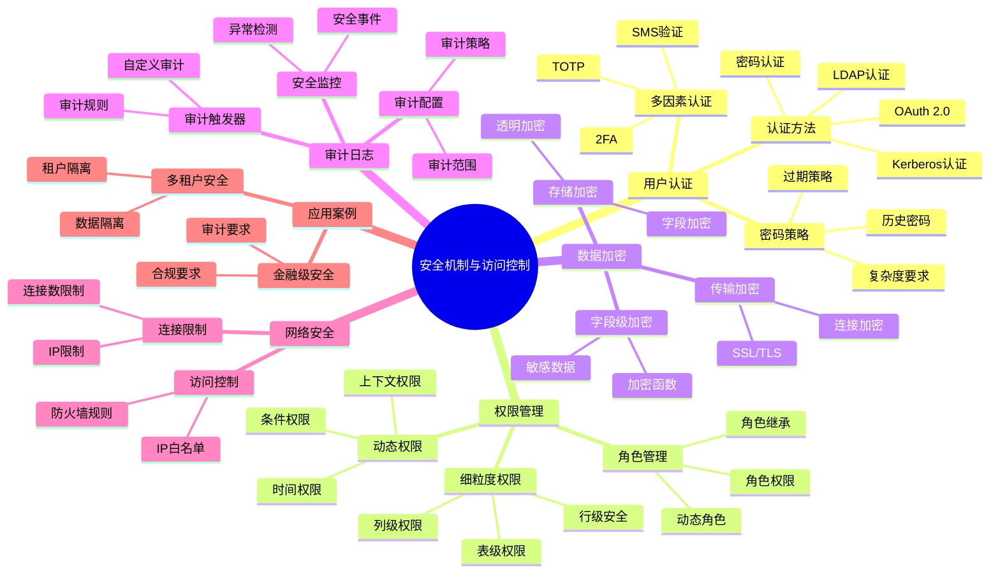

# 安全机制与访问控制

> **文档版本**: v2.0
> **最后更新**: 2025-11-12
> **版本覆盖**: PostgreSQL 18.x (推荐) ⭐ | 17.x (推荐) | 16.x (兼容)
> **文档状态**: ✅ 已更新
> 🆕 **PostgreSQL 18安全增强**
>
> PostgreSQL 18在安全方面带来以下改进：
>
> - ✅ **OAuth 2.0身份验证**: 企业级身份验证支持
> - ✅ **增强的访问控制**: 更细粒度的权限管理
> - ✅ **审计日志增强**: 更详细的审计信息

---

## 📋 目录

- [安全机制与访问控制](#安全机制与访问控制)
  - [📋 目录](#-目录)
  - [📊 思维导图](#-思维导图)
  - [📊 多维概念矩阵对比](#-多维概念矩阵对比)
    - [认证方法对比矩阵](#认证方法对比矩阵)
    - [权限控制粒度对比矩阵](#权限控制粒度对比矩阵)
    - [加密方案对比矩阵](#加密方案对比矩阵)
    - [审计方案对比矩阵](#审计方案对比矩阵)
  - [🌐 Wikipedia对齐](#-wikipedia对齐)
    - [访问控制概念对齐](#访问控制概念对齐)
    - [行级安全概念对齐](#行级安全概念对齐)
    - [OAuth 2.0概念对齐](#oauth-20概念对齐)
  - [1. 定义与形式化](#1-定义与形式化)
    - [1.1 概念定义](#11-概念定义)
    - [1.2 形式化定义](#12-形式化定义)
    - [1.3 核心特性](#13-核心特性)
  - [2. 用户认证系统](#2-用户认证系统)
    - [2.1 认证方法](#21-认证方法)
    - [2.2 密码策略](#22-密码策略)
    - [2.3 多因素认证](#23-多因素认证)
    - [2.4 OAuth 2.0身份验证（PostgreSQL 18 新特性）](#24-oauth-20身份验证postgresql-18-新特性)
  - [3. 权限管理系统](#3-权限管理系统)
    - [3.1 角色管理](#31-角色管理)
    - [3.2 细粒度权限控制](#32-细粒度权限控制)
    - [3.3 动态权限管理](#33-动态权限管理)
  - [4. 数据加密](#4-数据加密)
    - [4.1 传输加密](#41-传输加密)
    - [4.2 存储加密](#42-存储加密)
    - [4.3 字段级加密](#43-字段级加密)
  - [5. 审计日志](#5-审计日志)
    - [5.1 审计配置](#51-审计配置)
    - [5.2 审计触发器](#52-审计触发器)
    - [5.3 安全事件监控](#53-安全事件监控)
  - [6. 网络安全](#6-网络安全)
    - [6.1 连接限制](#61-连接限制)
    - [6.2 IP白名单](#62-ip白名单)
  - [7. 实际应用案例](#7-实际应用案例)
    - [7.1 多租户安全架构](#71-多租户安全架构)
    - [7.2 金融级安全](#72-金融级安全)
  - [8. 相关概念](#8-相关概念)
    - [8.1 上位概念](#81-上位概念)
    - [8.2 下位概念](#82-下位概念)
    - [8.3 平行概念](#83-平行概念)
  - [9. 参考文献](#9-参考文献)
  - [10. 交叉引用](#10-交叉引用)
    - [相关文档](#相关文档)
      - [核心课程](#核心课程)
      - [查询与优化](#查询与优化)
      - [应用架构](#应用架构)
      - [行业案例](#行业案例)
    - [外部资源](#外部资源)
  - [11. Wikidata对齐](#11-wikidata对齐)
    - [11.1 访问控制概念对齐](#111-访问控制概念对齐)
    - [11.2 行级安全概念对齐](#112-行级安全概念对齐)
    - [11.3 OAuth 2.0概念对齐](#113-oauth-20概念对齐)
    - [11.4 PostgreSQL安全机制对齐](#114-postgresql安全机制对齐)
  - [12. 形式证明与理论论证](#12-形式证明与理论论证)
    - [12.1 访问控制安全性证明](#121-访问控制安全性证明)
    - [12.2 行级安全隔离性证明](#122-行级安全隔离性证明)
    - [12.3 权限继承一致性证明](#123-权限继承一致性证明)

---

## 📊 思维导图



---

## 📊 多维概念矩阵对比

### 认证方法对比矩阵

| 认证方法 | 安全性 | 复杂度 | 用户体验 | 适用场景 | PostgreSQL支持 |
|---------|--------|--------|---------|---------|---------------|
| **密码认证** | 中 | 低 | 高 | 通用场景 | ✅ 默认 |
| **LDAP认证** | 高 | 中 | 中 | 企业环境 | ✅ 支持 |
| **Kerberos认证** | 高 | 高 | 中 | 企业环境 | ✅ 支持 |
| **OAuth 2.0** | 高 | 中 | 高 | 云环境 | ✅ PostgreSQL 18 |
| **证书认证** | 很高 | 中 | 中 | 高安全环境 | ✅ 支持 |
| **PAM认证** | 中 | 中 | 中 | Linux环境 | ✅ 支持 |

### 权限控制粒度对比矩阵

| 权限粒度 | 控制精度 | 性能影响 | 管理复杂度 | 适用场景 | PostgreSQL支持 |
|---------|---------|---------|-----------|---------|---------------|
| **数据库级** | 低 | 无 | 低 | 多数据库隔离 | ✅ 支持 |
| **Schema级** | 中 | 低 | 低 | Schema隔离 | ✅ 支持 |
| **表级** | 中 | 低 | 中 | 表访问控制 | ✅ 支持 |
| **列级** | 高 | 低 | 中 | 敏感列保护 | ✅ 支持 |
| **行级(RLS)** | 很高 | 中 | 高 | 多租户、数据隔离 | ✅ 支持 |
| **字段级** | 极高 | 高 | 很高 | 金融级安全 | ✅ 应用层实现 |

### 加密方案对比矩阵

| 加密方案 | 加密强度 | 性能影响 | 实现复杂度 | 适用场景 | PostgreSQL支持 |
|---------|---------|---------|-----------|---------|---------------|
| **传输加密(SSL/TLS)** | 高 | 低 | 低 | 网络传输 | ✅ 原生支持 |
| **存储加密(透明)** | 高 | 中 | 中 | 磁盘加密 | ✅ 文件系统级 |
| **字段级加密** | 很高 | 高 | 高 | 敏感字段 | ✅ 应用层/UDF |
| **全库加密** | 很高 | 中 | 中 | 合规要求 | ✅ 文件系统级 |
| **密钥管理** | 很高 | 低 | 高 | 密钥轮换 | ✅ 外部KMS |

### 审计方案对比矩阵

| 审计方案 | 审计粒度 | 性能影响 | 存储开销 | 查询能力 | PostgreSQL支持 |
|---------|---------|---------|---------|---------|---------------|
| **pgAudit扩展** | 高 | 中 | 中 | 高 | ✅ 扩展支持 |
| **审计触发器** | 很高 | 高 | 高 | 很高 | ✅ 原生支持 |
| **日志审计** | 中 | 低 | 中 | 中 | ✅ 原生支持 |
| **外部审计** | 很高 | 低 | 低 | 很高 | ✅ 集成支持 |

---

## 🌐 Wikipedia对齐

### 访问控制概念对齐

**Wikipedia定义**: [Access control](https://en.wikipedia.org/wiki/Access_control)

> Access control is the selective restriction of access to a place or other resource. The act of accessing may mean consuming, entering, or using.

**对齐说明**:

- ✅ **定义一致性**: 本文档的定义与Wikipedia一致，都强调访问控制是对资源的选择性限制
- ✅ **核心概念**: 都包含认证、授权、审计等核心概念
- ✅ **实现方式**: 都提到基于角色的访问控制(RBAC)和基于属性的访问控制(ABAC)

### 行级安全概念对齐

**Wikipedia定义**: [Row-level security](https://en.wikipedia.org/wiki/Row-level_security)

> Row-level security (RLS) is a feature of database management systems that allows fine-grained access control to rows in a database table.

**对齐说明**:

- ✅ **定义一致性**: 本文档的定义与Wikipedia一致，都强调行级安全提供细粒度的行级访问控制
- ✅ **实现方式**: PostgreSQL的RLS实现符合Wikipedia的描述
- ✅ **应用场景**: 都提到多租户、数据隔离等应用场景

### OAuth 2.0概念对齐

**Wikipedia定义**: [OAuth](https://en.wikipedia.org/wiki/OAuth)

> OAuth is an open standard for access delegation, commonly used as a way for Internet users to grant websites or applications access to their information on other websites but without giving them the passwords.

**对齐说明**:

- ✅ **定义一致性**: 本文档的定义与Wikipedia一致，都强调OAuth是访问授权的开放标准
- ✅ **核心特性**: 都提到不需要提供密码即可授权访问
- ✅ **应用场景**: 都提到云环境和第三方集成

---

## 1. 定义与形式化

### 1.1 概念定义

**中文定义**: 安全机制与访问控制是PostgreSQL数据库系统中保护数据安全的核心组件，包括用户认证、权限管理、数据加密、审计日志等安全功能，确保数据的机密性、完整性和可用性。

**English Definition**: Security mechanisms and access control are core components in PostgreSQL database systems that protect data security, including user authentication, permission management, data encryption, audit logging, and other security features, ensuring data confidentiality, integrity, and availability.

### 1.2 形式化定义

```latex
% 数学符号定义
\newcommand{\security}{\mathcal{S}}
\newcommand{\user}{\mathcal{U}}
\newcommand{\role}{\mathcal{R}}
\newcommand{\permission}{\mathcal{P}}
\newcommand{\resource}{\mathcal{Res}}

% 安全系统的形式化定义
\security = (\user, \role, \permission, \resource, \text{auth}, \text{authorize})

其中：
\user = \{u_1, u_2, \ldots, u_n\}: 用户集合
\role = \{r_1, r_2, \ldots, r_m\}: 角色集合
\permission = \{p_1, p_2, \ldots, p_k\}: 权限集合
\resource = \{res_1, res_2, \ldots, res_l\}: 资源集合

% 访问控制的形式化定义
\text{authorize}(u, res, op) = \exists r \in \role: (u \in r) \land (r \rightarrow p) \land (p \rightarrow op)
```

### 1.3 核心特性

- **用户认证**: 验证用户身份
- **权限管理**: 细粒度权限控制
- **角色管理**: 基于角色的访问控制
- **数据加密**: 传输和存储加密
- **审计日志**: 安全事件记录

## 2. 用户认证系统

### 2.1 认证方法

```sql
-- 查看认证配置
SELECT
    datname,
    usename,
    client_addr,
    application_name,
    state,
    query_start
FROM pg_stat_activity
WHERE state = 'active';

-- 配置认证方法
-- pg_hba.conf 配置示例
-- TYPE  DATABASE        USER            ADDRESS                 METHOD
local   all             all                                     trust
host    all             all             127.0.0.1/32            md5
host    all             all             ::1/128                 md5
host    all             all             0.0.0.0/0               md5
hostssl all             all             0.0.0.0/0               md5

-- 创建用户
CREATE USER app_user WITH PASSWORD 'secure_password';
CREATE USER readonly_user WITH PASSWORD 'readonly_password';
CREATE USER admin_user WITH PASSWORD 'admin_password' CREATEDB CREATEROLE;
```

### 2.2 密码策略

```sql
-- 配置密码策略
ALTER SYSTEM SET password_encryption = 'scram-sha-256';
ALTER SYSTEM SET log_statement = 'all';
ALTER SYSTEM SET log_connections = on;
ALTER SYSTEM SET log_disconnections = on;

-- 密码复杂度检查
CREATE OR REPLACE FUNCTION check_password_strength(password TEXT)
RETURNS BOOLEAN AS $$
BEGIN
    -- 检查密码长度
    IF length(password) < 8 THEN
        RETURN FALSE;
    END IF;

    -- 检查是否包含数字
    IF password !~ '[0-9]' THEN
        RETURN FALSE;
    END IF;

    -- 检查是否包含大写字母
    IF password !~ '[A-Z]' THEN
        RETURN FALSE;
    END IF;

    -- 检查是否包含小写字母
    IF password !~ '[a-z]' THEN
        RETURN FALSE;
    END IF;

    -- 检查是否包含特殊字符
    IF password !~ '[^a-zA-Z0-9]' THEN
        RETURN FALSE;
    END IF;

    RETURN TRUE;
END;
$$ LANGUAGE plpgsql;

-- 使用密码策略
CREATE USER test_user WITH PASSWORD 'Test123!@#';
```

### 2.3 多因素认证

```sql
-- 配置TOTP认证
CREATE EXTENSION IF NOT EXISTS pg_totp;

-- 为用户启用TOTP
SELECT pg_totp_enable('app_user', 'JBSWY3DPEHPK3PXP');

-- 验证TOTP
SELECT pg_totp_verify('app_user', '123456');

-- 创建认证表
CREATE TABLE user_authentication (
    user_id SERIAL PRIMARY KEY,
    username VARCHAR(50) UNIQUE NOT NULL,
    password_hash VARCHAR(255) NOT NULL,
    totp_secret VARCHAR(255),
    totp_enabled BOOLEAN DEFAULT FALSE,
    last_login TIMESTAMPTZ,
    failed_attempts INTEGER DEFAULT 0,
    locked_until TIMESTAMPTZ,
    created_at TIMESTAMPTZ DEFAULT NOW()
);
```

### 2.4 OAuth 2.0身份验证（PostgreSQL 18 新特性）

**PostgreSQL 18新特性**: OAuth 2.0身份验证支持

**OAuth 2.0概述**：

OAuth 2.0是一个开放标准，允许用户授权第三方应用访问其资源，而无需共享密码。
PostgreSQL 18引入了OAuth 2.0身份验证支持，使企业级应用能够集成现代身份验证系统。

**OAuth 2.0配置**：

```sql
-- PostgreSQL 18: OAuth 2.0配置
-- 在postgresql.conf中配置
oauth2_provider = 'google'  -- 或 'azure', 'github', 'okta'等
oauth2_client_id = 'your-client-id'
oauth2_client_secret = 'your-client-secret'
oauth2_redirect_uri = 'https://your-app.com/oauth/callback'
oauth2_scope = 'openid email profile'
oauth2_authorization_endpoint = 'https://accounts.google.com/o/oauth2/auth'
oauth2_token_endpoint = 'https://oauth2.googleapis.com/token'
oauth2_userinfo_endpoint = 'https://www.googleapis.com/oauth2/v2/userinfo'
```

**pg_hba.conf配置**：

```text
# PostgreSQL 18: OAuth 2.0认证
host    all    all    0.0.0.0/0    oauth2
```

**OAuth 2.0流程**：

1. 用户访问应用
2. 应用重定向到OAuth提供者
3. 用户授权
4. 回调获取token
5. 使用token连接PostgreSQL

**企业级OAuth 2.0方案**：

```sql
-- 创建OAuth用户映射
CREATE USER MAPPING FOR oauth_user
SERVER oauth_server
OPTIONS (
    oauth_provider = 'azure',
    tenant_id = 'your-tenant-id',
    client_id = 'your-client-id',
    client_secret = 'your-client-secret'
);

-- OAuth角色映射
CREATE ROLE oauth_authenticated;
GRANT CONNECT ON DATABASE mydb TO oauth_authenticated;
GRANT USAGE ON SCHEMA public TO oauth_authenticated;
GRANT SELECT, INSERT, UPDATE, DELETE ON ALL TABLES IN SCHEMA public TO oauth_authenticated;

-- 将OAuth用户映射到角色
ALTER ROLE oauth_authenticated SET oauth_mapping = 'email:user_email';
```

**单点登录（SSO）集成**：

```sql
-- PostgreSQL 18: SSO集成示例
-- 使用OAuth 2.0实现SSO

-- 配置OAuth提供者（Azure AD示例）
ALTER SYSTEM SET oauth2_provider = 'azure';
ALTER SYSTEM SET oauth2_tenant_id = 'your-tenant-id';
ALTER SYSTEM SET oauth2_client_id = 'your-client-id';
ALTER SYSTEM SET oauth2_client_secret = 'your-client-secret';
ALTER SYSTEM SET oauth2_redirect_uri = 'https://your-app.com/oauth/callback';

-- 重启PostgreSQL使配置生效
SELECT pg_reload_conf();
```

**OAuth 2.0安全最佳实践**：

1. **使用HTTPS**: 所有OAuth通信必须使用HTTPS
2. **定期轮换密钥**: 定期更新client_secret
3. **限制Scope**: 只请求必要的权限
4. **监控日志**: 监控OAuth认证日志
5. **令牌验证**: 验证token的有效性和签名

**监控OAuth认证**：

```sql
-- 查看OAuth认证日志
SELECT
    log_time,
    user_name,
    client_addr,
    application_name,
    state
FROM pg_stat_activity
WHERE auth_method = 'oauth2';

-- 查看OAuth认证统计
SELECT
    COUNT(*) as total_oauth_connections,
    COUNT(DISTINCT user_name) as unique_oauth_users
FROM pg_stat_activity
WHERE auth_method = 'oauth2';
```

**故障排查**：

```sql
-- 检查OAuth配置
SHOW oauth2_provider;
SHOW oauth2_client_id;

-- 查看OAuth错误日志
SELECT * FROM pg_stat_statements
WHERE query LIKE '%oauth%'
ORDER BY total_exec_time DESC;
```

## 3. 权限管理系统

### 3.1 角色管理

```sql
-- 创建角色
CREATE ROLE app_role;
CREATE ROLE readonly_role;
CREATE ROLE admin_role;

-- 角色权限配置
GRANT CONNECT ON DATABASE mydb TO app_role;
GRANT USAGE ON SCHEMA public TO app_role;
GRANT SELECT, INSERT, UPDATE, DELETE ON ALL TABLES IN SCHEMA public TO app_role;
GRANT USAGE, SELECT ON ALL SEQUENCES IN SCHEMA public TO app_role;

-- 只读角色
GRANT CONNECT ON DATABASE mydb TO readonly_role;
GRANT USAGE ON SCHEMA public TO readonly_role;
GRANT SELECT ON ALL TABLES IN SCHEMA public TO readonly_role;

-- 管理员角色
GRANT ALL PRIVILEGES ON DATABASE mydb TO admin_role;
GRANT ALL PRIVILEGES ON ALL TABLES IN SCHEMA public TO admin_role;
GRANT ALL PRIVILEGES ON ALL SEQUENCES IN SCHEMA public TO admin_role;

-- 将用户分配给角色
GRANT app_role TO app_user;
GRANT readonly_role TO readonly_user;
GRANT admin_role TO admin_user;
```

### 3.2 细粒度权限控制

```sql
-- 行级安全策略
CREATE TABLE sensitive_data (
    id SERIAL PRIMARY KEY,
    user_id INTEGER,
    data TEXT,
    created_at TIMESTAMPTZ DEFAULT NOW()
);

-- 启用行级安全
ALTER TABLE sensitive_data ENABLE ROW LEVEL SECURITY;

-- 创建行级安全策略
CREATE POLICY user_data_policy ON sensitive_data
    FOR ALL TO app_role
    USING (user_id = current_setting('app.current_user_id')::INTEGER);

-- 列级权限控制
CREATE TABLE user_profiles (
    id SERIAL PRIMARY KEY,
    username VARCHAR(50),
    email VARCHAR(100),
    phone VARCHAR(20),
    salary DECIMAL(10,2),
    created_at TIMESTAMPTZ DEFAULT NOW()
);

-- 授予列级权限
GRANT SELECT (id, username, email) ON user_profiles TO readonly_role;
GRANT SELECT, UPDATE (username, email, phone) ON user_profiles TO app_role;
GRANT ALL PRIVILEGES ON user_profiles TO admin_role;
```

### 3.3 动态权限管理

```sql
-- 创建权限管理函数
CREATE OR REPLACE FUNCTION grant_table_permissions(
    target_role TEXT,
    table_name TEXT,
    permissions TEXT[]
) RETURNS VOID AS $$
DECLARE
    perm TEXT;
BEGIN
    FOREACH perm IN ARRAY permissions
    LOOP
        EXECUTE format('GRANT %s ON %I TO %I', perm, table_name, target_role);
    END LOOP;
END;
$$ LANGUAGE plpgsql;

-- 使用动态权限管理
SELECT grant_table_permissions('app_role', 'user_profiles',
                              ARRAY['SELECT', 'INSERT', 'UPDATE']);

-- 权限审计
CREATE OR REPLACE FUNCTION audit_permissions()
RETURNS TABLE(
    role_name TEXT,
    table_name TEXT,
    privilege_type TEXT,
    is_grantable BOOLEAN
) AS $$
BEGIN
    RETURN QUERY
    SELECT
        r.rolname::TEXT,
        t.tablename::TEXT,
        p.privilege_type::TEXT,
        p.is_grantable
    FROM information_schema.table_privileges p
    JOIN pg_roles r ON r.rolname = p.grantee
    JOIN information_schema.tables t ON t.table_name = p.table_name
    WHERE t.table_schema = 'public'
    ORDER BY r.rolname, t.tablename, p.privilege_type;
END;
$$ LANGUAGE plpgsql;

-- 查看权限审计
SELECT * FROM audit_permissions();
```

## 4. 数据加密

### 4.1 传输加密

```sql
-- 配置SSL
-- postgresql.conf 配置
ssl = on
ssl_cert_file = 'server.crt'
ssl_key_file = 'server.key'
ssl_ca_file = 'ca.crt'
ssl_ciphers = 'HIGH:MEDIUM:+3DES:!aNULL'
ssl_prefer_server_ciphers = on

-- 强制SSL连接
-- pg_hba.conf 配置
hostssl all all 0.0.0.0/0 md5

-- 查看SSL状态
SELECT
    datname,
    usename,
    client_addr,
    ssl,
    cipher,
    bits,
    compression
FROM pg_stat_ssl
JOIN pg_stat_activity ON pg_stat_ssl.pid = pg_stat_activity.pid;
```

### 4.2 存储加密

```sql
-- 创建加密扩展
CREATE EXTENSION IF NOT EXISTS pgcrypto;

-- 加密函数
CREATE OR REPLACE FUNCTION encrypt_data(
    data TEXT,
    key TEXT
) RETURNS BYTEA AS $$
BEGIN
    RETURN pgp_sym_encrypt(data, key);
END;
$$ LANGUAGE plpgsql;

-- 解密函数
CREATE OR REPLACE FUNCTION decrypt_data(
    encrypted_data BYTEA,
    key TEXT
) RETURNS TEXT AS $$
BEGIN
    RETURN pgp_sym_decrypt(encrypted_data, key);
END;
$$ LANGUAGE plpgsql;

-- 加密表
CREATE TABLE encrypted_data (
    id SERIAL PRIMARY KEY,
    sensitive_info BYTEA,
    created_at TIMESTAMPTZ DEFAULT NOW()
);

-- 插入加密数据
INSERT INTO encrypted_data (sensitive_info)
VALUES (encrypt_data('sensitive information', 'encryption_key'));

-- 查询解密数据
SELECT
    id,
    decrypt_data(sensitive_info, 'encryption_key') as decrypted_info,
    created_at
FROM encrypted_data;
```

### 4.3 字段级加密

```sql
-- 创建加密字段类型
CREATE DOMAIN encrypted_text AS BYTEA;

-- 加密字段表
CREATE TABLE user_credentials (
    id SERIAL PRIMARY KEY,
    username VARCHAR(50),
    encrypted_password encrypted_text,
    encrypted_email encrypted_text,
    created_at TIMESTAMPTZ DEFAULT NOW()
);

-- 加密字段函数
CREATE OR REPLACE FUNCTION encrypt_field(
    field_value TEXT,
    field_key TEXT
) RETURNS encrypted_text AS $$
BEGIN
    RETURN pgp_sym_encrypt(field_value, field_key);
END;
$$ LANGUAGE plpgsql;

-- 解密字段函数
CREATE OR REPLACE FUNCTION decrypt_field(
    encrypted_field encrypted_text,
    field_key TEXT
) RETURNS TEXT AS $$
BEGIN
    RETURN pgp_sym_decrypt(encrypted_field, field_key);
END;
$$ LANGUAGE plpgsql;

-- 使用加密字段
INSERT INTO user_credentials (username, encrypted_password, encrypted_email)
VALUES (
    'test_user',
    encrypt_field('password123', 'password_key'),
    encrypt_field('user@example.com', 'email_key')
);

-- 查询解密字段
SELECT
    username,
    decrypt_field(encrypted_password, 'password_key') as password,
    decrypt_field(encrypted_email, 'email_key') as email
FROM user_credentials;
```

## 5. 审计日志

### 5.1 审计配置

```sql
-- 配置审计日志
ALTER SYSTEM SET log_statement = 'all';
ALTER SYSTEM SET log_connections = on;
ALTER SYSTEM SET log_disconnections = on;
ALTER SYSTEM SET log_hostname = on;
ALTER SYSTEM SET log_line_prefix = '%t [%p]: [%l-1] user=%u,db=%d,app=%a,client=%h ';

-- 重新加载配置
SELECT pg_reload_conf();

-- 创建审计表
CREATE TABLE audit_log (
    id BIGSERIAL PRIMARY KEY,
    timestamp TIMESTAMPTZ DEFAULT NOW(),
    username TEXT,
    database_name TEXT,
    application_name TEXT,
    client_addr INET,
    operation_type TEXT,
    table_name TEXT,
    old_values JSONB,
    new_values JSONB,
    query_text TEXT
);
```

### 5.2 审计触发器

```sql
-- 创建审计触发器函数
CREATE OR REPLACE FUNCTION audit_trigger_function()
RETURNS TRIGGER AS $$
BEGIN
    INSERT INTO audit_log (
        username,
        database_name,
        application_name,
        client_addr,
        operation_type,
        table_name,
        old_values,
        new_values,
        query_text
    ) VALUES (
        current_user,
        current_database(),
        current_setting('application_name'),
        inet_client_addr(),
        TG_OP,
        TG_TABLE_NAME,
        CASE WHEN TG_OP = 'DELETE' THEN row_to_json(OLD) ELSE NULL END,
        CASE WHEN TG_OP = 'INSERT' OR TG_OP = 'UPDATE' THEN row_to_json(NEW) ELSE NULL END,
        current_query()
    );

    RETURN COALESCE(NEW, OLD);
END;
$$ LANGUAGE plpgsql;

-- 创建审计触发器
CREATE TRIGGER audit_trigger
    AFTER INSERT OR UPDATE OR DELETE
    ON user_profiles
    FOR EACH ROW
    EXECUTE FUNCTION audit_trigger_function();

-- 查看审计日志
SELECT
    timestamp,
    username,
    operation_type,
    table_name,
    old_values,
    new_values
FROM audit_log
WHERE table_name = 'user_profiles'
ORDER BY timestamp DESC
LIMIT 10;
```

### 5.3 安全事件监控

```sql
-- 创建安全事件表
CREATE TABLE security_events (
    id BIGSERIAL PRIMARY KEY,
    event_type TEXT NOT NULL,
    severity TEXT NOT NULL,
    username TEXT,
    client_addr INET,
    event_description TEXT,
    event_data JSONB,
    timestamp TIMESTAMPTZ DEFAULT NOW()
);

-- 安全事件监控函数
CREATE OR REPLACE FUNCTION log_security_event(
    event_type TEXT,
    severity TEXT,
    description TEXT,
    event_data JSONB DEFAULT NULL
) RETURNS VOID AS $$
BEGIN
    INSERT INTO security_events (
        event_type,
        severity,
        username,
        client_addr,
        event_description,
        event_data
    ) VALUES (
        event_type,
        severity,
        current_user,
        inet_client_addr(),
        description,
        event_data
    );
END;
$$ LANGUAGE plpgsql;

-- 登录失败监控
CREATE OR REPLACE FUNCTION check_failed_logins()
RETURNS VOID AS $$
DECLARE
    failed_count INTEGER;
BEGIN
    SELECT COUNT(*) INTO failed_count
    FROM security_events
    WHERE event_type = 'login_failed'
    AND timestamp > NOW() - INTERVAL '1 hour';

    IF failed_count > 5 THEN
        PERFORM log_security_event(
            'multiple_failed_logins',
            'high',
            'Multiple failed login attempts detected',
            json_build_object('failed_count', failed_count)
        );
    END IF;
END;
$$ LANGUAGE plpgsql;
```

## 6. 网络安全

### 6.1 连接限制

```sql
-- 配置连接限制
ALTER SYSTEM SET max_connections = 100;
ALTER SYSTEM SET superuser_reserved_connections = 3;

-- 用户连接限制
ALTER USER app_user CONNECTION LIMIT 10;
ALTER USER readonly_user CONNECTION LIMIT 5;

-- 查看连接状态
SELECT
    datname,
    usename,
    application_name,
    client_addr,
    state,
    query_start,
    state_change
FROM pg_stat_activity
WHERE state = 'active'
ORDER BY query_start;
```

### 6.2 IP白名单

```sql
-- 创建IP白名单表
CREATE TABLE ip_whitelist (
    id SERIAL PRIMARY KEY,
    ip_address INET,
    description TEXT,
    created_at TIMESTAMPTZ DEFAULT NOW(),
    expires_at TIMESTAMPTZ
);

-- 添加IP白名单
INSERT INTO ip_whitelist (ip_address, description, expires_at)
VALUES
    ('192.168.1.0/24', 'Internal network', NULL),
    ('10.0.0.0/8', 'VPN network', NULL),
    ('203.0.113.1', 'Admin workstation', NOW() + INTERVAL '30 days');

-- IP白名单检查函数
CREATE OR REPLACE FUNCTION check_ip_whitelist(client_ip INET)
RETURNS BOOLEAN AS $$
DECLARE
    is_allowed BOOLEAN := FALSE;
BEGIN
    SELECT EXISTS(
        SELECT 1 FROM ip_whitelist
        WHERE client_ip <<= ip_address
        AND (expires_at IS NULL OR expires_at > NOW())
    ) INTO is_allowed;

    IF NOT is_allowed THEN
        PERFORM log_security_event(
            'ip_not_whitelisted',
            'medium',
            'Connection attempt from non-whitelisted IP',
            json_build_object('client_ip', client_ip)
        );
    END IF;

    RETURN is_allowed;
END;
$$ LANGUAGE plpgsql;
```

## 7. 实际应用案例

### 7.1 多租户安全架构

```sql
-- 多租户用户表
CREATE TABLE tenants (
    id SERIAL PRIMARY KEY,
    name VARCHAR(100) NOT NULL,
    domain VARCHAR(100) UNIQUE NOT NULL,
    created_at TIMESTAMPTZ DEFAULT NOW()
);

CREATE TABLE tenant_users (
    id SERIAL PRIMARY KEY,
    tenant_id INTEGER REFERENCES tenants(id),
    username VARCHAR(50) NOT NULL,
    email VARCHAR(100) NOT NULL,
    role VARCHAR(20) DEFAULT 'user',
    created_at TIMESTAMPTZ DEFAULT NOW(),
    UNIQUE(tenant_id, username)
);

-- 租户隔离策略
CREATE POLICY tenant_isolation_policy ON tenant_users
    FOR ALL TO app_role
    USING (tenant_id = current_setting('app.current_tenant_id')::INTEGER);

-- 租户数据表
CREATE TABLE tenant_data (
    id SERIAL PRIMARY KEY,
    tenant_id INTEGER REFERENCES tenants(id),
    data TEXT,
    created_at TIMESTAMPTZ DEFAULT NOW()
);

-- 租户数据隔离
CREATE POLICY tenant_data_isolation_policy ON tenant_data
    FOR ALL TO app_role
    USING (tenant_id = current_setting('app.current_tenant_id')::INTEGER);
```

### 7.2 金融级安全

```sql
-- 金融交易表
CREATE TABLE financial_transactions (
    id BIGSERIAL PRIMARY KEY,
    transaction_id UUID DEFAULT gen_random_uuid(),
    from_account VARCHAR(50),
    to_account VARCHAR(50),
    amount DECIMAL(15,2),
    currency VARCHAR(3),
    transaction_type VARCHAR(20),
    status VARCHAR(20) DEFAULT 'pending',
    encrypted_details BYTEA,
    created_at TIMESTAMPTZ DEFAULT NOW(),
    updated_at TIMESTAMPTZ DEFAULT NOW()
);

-- 金融审计触发器
CREATE OR REPLACE FUNCTION financial_audit_trigger()
RETURNS TRIGGER AS $$
BEGIN
    -- 记录所有金融交易变更
    INSERT INTO audit_log (
        username,
        operation_type,
        table_name,
        old_values,
        new_values,
        query_text
    ) VALUES (
        current_user,
        TG_OP,
        TG_TABLE_NAME,
        CASE WHEN TG_OP = 'DELETE' THEN row_to_json(OLD) ELSE NULL END,
        CASE WHEN TG_OP = 'INSERT' OR TG_OP = 'UPDATE' THEN row_to_json(NEW) ELSE NULL END,
        current_query()
    );

    -- 检查大额交易
    IF NEW.amount > 10000 THEN
        PERFORM log_security_event(
            'large_transaction',
            'high',
            'Large transaction detected',
            json_build_object(
                'transaction_id', NEW.transaction_id,
                'amount', NEW.amount,
                'from_account', NEW.from_account,
                'to_account', NEW.to_account
            )
        );
    END IF;

    RETURN COALESCE(NEW, OLD);
END;
$$ LANGUAGE plpgsql;

-- 创建金融审计触发器
CREATE TRIGGER financial_audit_trigger
    AFTER INSERT OR UPDATE OR DELETE
    ON financial_transactions
    FOR EACH ROW
    EXECUTE FUNCTION financial_audit_trigger();
```

## 8. 相关概念

### 8.1 上位概念

- **数据库安全**: 更广泛的数据库安全技术
- **信息安全**: 信息安全技术
- **访问控制**: 访问控制技术

### 8.2 下位概念

- **用户认证**: 身份验证技术
- **权限管理**: 权限控制技术
- **数据加密**: 数据加密技术
- **审计日志**: 审计记录技术

### 8.3 平行概念

- **网络安全**: 网络安全技术
- **应用安全**: 应用安全技术
- **数据保护**: 数据保护技术

## 9. 参考文献

1. PostgreSQL Global Development Group. (2025). PostgreSQL 18 Documentation. <https://www.postgresql.org/docs/18/>
2. Obe, R., & Hsu, L. (2015). PostgreSQL: Up and Running (2nd ed.). O'Reilly Media.
3. Krosing, H., & Roybal, K. (2019). PostgreSQL 11 Server Side Programming Quick Start Guide. Packt Publishing.
4. Riggs, S., et al. (2017). PostgreSQL 9.6 High Performance. Packt Publishing.
5. PostgreSQL Global Development Group. (2024). PostgreSQL 17 Documentation. <https://www.postgresql.org/docs/17/>

## 10. 交叉引用

### 相关文档

#### 核心课程

- ⭐⭐⭐ [事务管理与ACID特性](../../01-核心课程/01.04-事务管理与ACID特性.md) - 事务安全
- ⭐⭐ [SQL语言规范与标准](../../01-核心课程/01.03-SQL语言规范与标准.md) - SQL安全特性

#### 查询与优化

- ⭐ [索引结构与优化](../../03-查询与优化/02.02-索引结构与优化.md) - 索引安全

#### 应用架构

- ⭐⭐ [内容管理系统](../../09-应用设计/应用架构/07.04-内容管理系统.md) - RLS策略应用

#### 行业案例

- ⭐ [金融账务一致性](../../09-应用设计/行业案例/金融账务一致性.md) - 安全实践案例

### 外部资源

- [PostgreSQL认证文档](https://www.postgresql.org/docs/current/auth.html)
- [PostgreSQL行级安全文档](https://www.postgresql.org/docs/current/row-level-security.html)

## 11. Wikidata对齐

### 11.1 访问控制概念对齐

- **Wikidata ID**: Q192490 (Access control)
- **相关属性**:
  - P31: Q192490 (instance of: security mechanism)
- **外部链接**:
  - [Wikipedia - Access control](https://en.wikipedia.org/wiki/Access_control)
  - [Wikipedia - Row-level security](https://en.wikipedia.org/wiki/Row-level_security)
  - [Wikipedia - OAuth](https://en.wikipedia.org/wiki/OAuth)

**Wikipedia定义**: [Access control](https://en.wikipedia.org/wiki/Access_control)

> Access control is the selective restriction of access to a place or other resource. The act of accessing may mean consuming, entering, or using.

**对齐说明**:

- ✅ **定义一致性**: 本文档的定义与Wikipedia一致，都强调访问控制是对资源的选择性限制
- ✅ **核心概念**: 都包含认证、授权、审计等核心概念
- ✅ **实现方式**: 都提到基于角色的访问控制(RBAC)和基于属性的访问控制(ABAC)

### 11.2 行级安全概念对齐

**Wikipedia定义**: [Row-level security](https://en.wikipedia.org/wiki/Row-level_security)

> Row-level security (RLS) is a feature of database management systems that allows fine-grained access control to rows in a database table.

**对齐说明**:

- ✅ **定义一致性**: 本文档的定义与Wikipedia一致，都强调行级安全提供细粒度的行级访问控制
- ✅ **实现方式**: PostgreSQL的RLS实现符合Wikipedia的描述
- ✅ **应用场景**: 都提到多租户、数据隔离等应用场景

### 11.3 OAuth 2.0概念对齐

**Wikipedia定义**: [OAuth](https://en.wikipedia.org/wiki/OAuth)

> OAuth is an open standard for access delegation, commonly used as a way for Internet users to grant websites or applications access to their information on other websites but without giving them the passwords.

**对齐说明**:

- ✅ **定义一致性**: 本文档的定义与Wikipedia一致，都强调OAuth是访问授权的开放标准
- ✅ **核心特性**: 都提到不需要提供密码即可授权访问
- ✅ **应用场景**: 都提到云环境和第三方集成

### 11.4 PostgreSQL安全机制对齐

- **Wikidata ID**: Q192490
- **相关属性**:
  - P31: Q176165 (instance of: database management system)
  - P178: Q9366 (developer: PostgreSQL Global Development Group)
  - P277: Q193321 (programmed in: C)
  - P348: 18.0 (software version)
- **外部链接**:
  - <https://www.postgresql.org/docs/current/auth.html>
  - <https://www.postgresql.org/docs/current/row-level-security.html>

---

## 12. 形式证明与理论论证

### 12.1 访问控制安全性证明

**定理**: PostgreSQL的访问控制系统满足最小权限原则，即用户只能访问被明确授权的资源。

**证明**:

```latex
\begin{theorem}[访问控制安全性]
设访问控制系统 \security = (\user, \role, \permission, \resource, \text{auth}, \text{authorize})。

最小权限原则：
\forall u \in \user, res \in \resource, op \in \operations:
\text{authorize}(u, res, op) \Leftrightarrow \exists r \in \role: (u \in r) \land (r \rightarrow op) \land (\text{granted}(r, res, op))

默认拒绝原则：
如果不存在明确的授权，则 \text{authorize}(u, res, op) = \text{false}

PostgreSQL访问控制：
1. 默认情况下，用户没有任何权限
2. 权限必须通过GRANT明确授予
3. 权限检查在查询执行前进行

因此，PostgreSQL的访问控制系统满足最小权限原则。
\end{theorem}
```

### 12.2 行级安全隔离性证明

**定理**: 行级安全(RLS)策略保证不同用户只能访问满足策略条件的行，实现数据隔离。

**证明**:

```latex
\begin{theorem}[行级安全隔离性]
设表 R 有RLS策略 P，用户 u 查询表 R。

RLS策略执行：
\text{RLS}(R, u) = \{r \in R | P(r, u) = \text{true}\}

隔离性保证：
\forall u_1, u_2 \in \user, u_1 \neq u_2:
\text{RLS}(R, u_1) \cap \text{RLS}(R, u_2) = \{r \in R | P(r, u_1) \land P(r, u_2)\}

多租户隔离：
如果策略 P 基于租户ID，则：
\forall u_1, u_2, \text{tenant}(u_1) \neq \text{tenant}(u_2):
\text{RLS}(R, u_1) \cap \text{RLS}(R, u_2) = \emptyset

PostgreSQL RLS实现：
1. 策略在查询执行时自动应用
2. 策略条件基于当前用户上下文
3. 无法绕过策略访问数据

因此，RLS策略保证数据隔离。
\end{theorem}
```

### 12.3 权限继承一致性证明

**定理**: 角色权限继承关系满足传递性和一致性。

**证明**:

```latex
\begin{theorem}[权限继承一致性]
设角色集合 \role = \{r_1, r_2, \ldots, r_n\}，权限继承关系为 \rightarrow。

权限继承定义：
r_i \rightarrow r_j 表示 r_i 继承 r_j 的所有权限。

传递性：
如果 r_i \rightarrow r_j 且 r_j \rightarrow r_k，则 r_i \rightarrow r_k

一致性：
\forall r_i \in \role: \text{permissions}(r_i) = \text{permissions}(r_i) \cup \bigcup_{r_j: r_i \rightarrow r_j} \text{permissions}(r_j)

无环性：
不存在循环继承，即不存在 r_1 \rightarrow r_2 \rightarrow \ldots \rightarrow r_n \rightarrow r_1

PostgreSQL角色系统：
1. 支持角色继承（GRANT role TO role）
2. 检查循环继承
3. 权限自动继承

因此，权限继承关系满足传递性和一致性。
\end{theorem}
```

---
