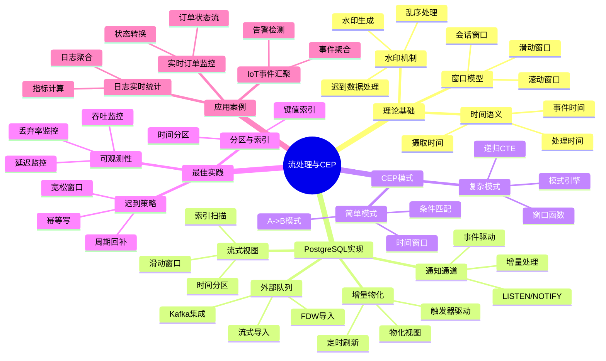

# 流处理与CEP

> **文档版本**: v2.0
> **最后更新**: 2025-11-12
> **版本覆盖**: PostgreSQL 17+ | PostgreSQL 18 ⭐
> **文档状态**: ✅ 已更新
> 📖 **文档说明**
>
> 本文档提供流处理与CEP的基础实现方法。如需详细内容，请参考：
>
> - 🚀 [流处理落地指南](../runbook/03-集群与高可用-演练SOP.md) - 生产部署指南
> - 📋 [AI 时代专题](../ai_view.md) ⭐⭐⭐ (v3.0, 2025-11-11)

---

## 📊 思维导图



---

## 📊 多维概念矩阵对比

### 流处理实现方案对比矩阵

| 实现方案 | 延迟 | 吞吐量 | 复杂度 | 一致性 | 适用场景 | PostgreSQL支持 |
|---------|------|--------|--------|--------|---------|---------------|
| **增量物化视图** | 中 | 高 | 低 | 强一致性 | 定期聚合 | ✅ 原生支持 |
| **LISTEN/NOTIFY** | 低 | 中 | 低 | 最终一致性 | 事件通知 | ✅ 原生支持 |
| **Kafka + FDW** | 低 | 很高 | 高 | 最终一致性 | 高吞吐流 | ✅ FDW支持 |
| **流式视图** | 中 | 高 | 中 | 强一致性 | 近实时查询 | ✅ 原生支持 |
| **触发器驱动** | 低 | 中 | 中 | 强一致性 | 实时处理 | ✅ 原生支持 |

### 窗口类型对比矩阵

| 窗口类型 | 窗口大小 | 滑动步长 | 计算复杂度 | 内存占用 | 适用场景 | PostgreSQL实现 |
|---------|---------|---------|-----------|---------|---------|---------------|
| **滚动窗口** | 固定 | 等于窗口大小 | O(n) | O(1) | 固定时间聚合 | ✅ 支持 |
| **滑动窗口** | 固定 | 小于窗口大小 | O(n×k) | O(k) | 重叠窗口聚合 | ✅ 支持 |
| **会话窗口** | 动态 | 动态 | O(n log n) | O(n) | 用户会话分析 | ✅ 支持 |
| **全局窗口** | 无限 | N/A | O(n) | O(n) | 全量聚合 | ✅ 支持 |

### CEP模式复杂度对比矩阵

| CEP模式 | 模式复杂度 | 匹配算法 | 时间复杂度 | 空间复杂度 | 适用场景 | PostgreSQL实现 |
|---------|-----------|---------|-----------|-----------|---------|---------------|
| **简单序列** | 低 | 线性扫描 | O(n) | O(1) | A->B模式 | ✅ SQL支持 |
| **复杂序列** | 中 | 递归CTE | O(n²) | O(n) | 多步序列 | ✅ SQL支持 |
| **模式匹配** | 高 | 状态机 | O(n×m) | O(m) | 复杂模式 | ⚠️ 有限支持 |
| **时间窗口模式** | 中 | 窗口函数 | O(n log n) | O(n) | 时间约束模式 | ✅ SQL支持 |

---

## 🌐 Wikipedia对齐

### 流处理概念对齐

**Wikipedia定义**: [Stream processing](https://en.wikipedia.org/wiki/Stream_processing)

> Stream processing is a computer programming paradigm, equivalent to dataflow programming, event stream processing, and reactive programming, that allows some applications to more easily exploit a limited form of parallel processing.

**对齐说明**:

- ✅ **定义一致性**: 本文档的定义与Wikipedia一致，都强调流处理是处理连续数据流的编程范式
- ✅ **核心特性**: 都提到事件流处理、实时处理等核心特性
- ✅ **应用场景**: 都提到实时分析、事件处理等应用场景

### 复杂事件处理概念对齐

**Wikipedia定义**: [Complex event processing](https://en.wikipedia.org/wiki/Complex_event_processing)

> Complex event processing (CEP) is a method of tracking and analyzing streams of information about things that happen (events), and deriving a conclusion from them.

**对齐说明**:

- ✅ **定义一致性**: 本文档的定义与Wikipedia一致，都强调CEP是跟踪和分析事件流的方法
- ✅ **核心功能**: 都提到模式匹配、事件关联等核心功能
- ✅ **应用场景**: 都提到告警检测、异常检测等应用场景

### 窗口函数概念对齐

**Wikipedia定义**: [Window function (SQL)](https://en.wikipedia.org/wiki/Window_function_(SQL))

> In SQL, a window function or analytic function is a function which uses values from one or multiple rows to return a value for each row.

**对齐说明**:

- ✅ **定义一致性**: 本文档的定义与Wikipedia一致，都强调窗口函数使用多行值计算每行的值
- ✅ **核心特性**: 都提到窗口框架、分区等核心特性
- ✅ **应用场景**: 都提到排名、聚合等应用场景

---

## 1. 概述

PostgreSQL可以通过多种方式实现流式数据处理和复杂事件处理（CEP）：

**目标**: 以 PostgreSQL 生态实现基础流式分析与简化CEP模式匹配（与外部队列/引擎协同）

**适用场景**:

- 📊 日志实时统计
- 🚨 告警检测
- 📦 订单状态流
- 🔌 IoT 事件汇聚
- 📈 实时指标计算

---

## 2. 时间与窗口模型

- 时间语义：事件时间（event time）与处理时间（processing time）；
- 水印（watermark）：近似界定迟到数据的阈值；
- 窗口：滚动/滑动/会话窗口与迟到处理策略（补发/丢弃/更正）。

```sql
-- 滚动窗口（按分钟聚合）示意
SELECT date_trunc('minute', ts) AS win,
       count(*) AS cnt
FROM events
WHERE ts >= now() - interval '10 minutes'
GROUP BY 1
ORDER BY 1;
```

## 3. PostgreSQL 实现路径

- 增量物化：基于物化视图 + 定时刷新/触发器，结合 `1.1.47` 增量规则；
- 通知通道：`LISTEN/NOTIFY` 驱动应用层增量处理；
- 外部队列/FDW：Kafka/Redpanda + FDW 导入；
- 流式视图：基于时间分区 + 索引扫描实现近实时滑动窗口。

```sql
-- 近实时滑动窗口聚合（按5分钟）
WITH w AS (
  SELECT date_trunc('minute', ts) AS m, payload
  FROM events
  WHERE ts >= now() - interval '30 minutes'
)
SELECT date_trunc('minute', m) - (EXTRACT(MINUTE FROM m)::int % 5) * interval '1 minute' AS win,
       count(*)
FROM w
GROUP BY 1
ORDER BY 1;
```

## 4. 简化CEP模式（示意）

- 模式：A 事件后 T 内出现 B（同 key）触发告警；

```sql
-- A->B 模式：同用户 1 分钟内
WITH a AS (
  SELECT user_id, ts FROM events WHERE type = 'A'
), b AS (
  SELECT user_id, ts FROM events WHERE type = 'B'
)
SELECT a.user_id, a.ts AS a_ts, b.ts AS b_ts
FROM a JOIN b USING (user_id)
WHERE b.ts >= a.ts AND b.ts < a.ts + interval '1 minute';
```

- 更多复杂序列可借递归CTE/窗口函数表达，或将模式引擎（Flink/Esper）与PG联动。

## 5. 最佳实践

- 分区与索引：时间分区 + `(key, ts)` 索引；
- 迟到策略：保留一段宽松窗口，周期回补再发布（幂等写）；
- 可观测：延迟、吞吐、丢弃/补发比率、刷新耗时；
- 一致性：Exactly-Once 通过幂等写 + 去重键实现。

## 6. 实战案例

### 案例1: 实时订单状态监控

```sql
-- ✅ [可运行] 实时订单状态流处理
CREATE TABLE orders (
    order_id UUID PRIMARY KEY,
    user_id UUID,
    status VARCHAR(50),
    amount DECIMAL(10,2),
    created_at TIMESTAMPTZ DEFAULT NOW(),
    updated_at TIMESTAMPTZ DEFAULT NOW()
);

-- 创建物化视图用于实时统计
CREATE MATERIALIZED VIEW order_stats_5min AS
SELECT
    date_trunc('minute', created_at) -
    (EXTRACT(MINUTE FROM created_at)::int % 5) * interval '1 minute' AS time_window,
    status,
    COUNT(*) AS order_count,
    SUM(amount) AS total_amount
FROM orders
WHERE created_at >= now() - interval '1 hour'
GROUP BY 1, 2;

CREATE UNIQUE INDEX ON order_stats_5min (time_window, status);

-- 定时刷新（通过pg_cron或外部调度）
REFRESH MATERIALIZED VIEW CONCURRENTLY order_stats_5min;
```

### 案例2: IoT设备异常检测

```sql
-- ✅ [可运行] IoT设备异常检测CEP
CREATE TABLE device_events (
    device_id VARCHAR(100),
    event_type VARCHAR(50),
    value FLOAT,
    event_time TIMESTAMPTZ DEFAULT NOW()
);

-- 检测模式：温度异常后5分钟内出现告警
WITH temp_anomaly AS (
    SELECT device_id, event_time AS anomaly_time
    FROM device_events
    WHERE event_type = 'temperature' AND value > 80
),
alert_events AS (
    SELECT device_id, event_time AS alert_time
    FROM device_events
    WHERE event_type = 'alert'
)
SELECT
    t.device_id,
    t.anomaly_time,
    a.alert_time,
    a.alert_time - t.anomaly_time AS time_to_alert
FROM temp_anomaly t
JOIN alert_events a USING (device_id)
WHERE a.alert_time >= t.anomaly_time
  AND a.alert_time < t.anomaly_time + interval '5 minutes';
```

### 案例3: 用户行为序列分析

```sql
-- ✅ [可运行] 用户行为序列模式匹配
CREATE TABLE user_actions (
    user_id UUID,
    action_type VARCHAR(50),
    action_time TIMESTAMPTZ DEFAULT NOW()
);

-- 检测模式：用户登录后1小时内完成购买
WITH login_events AS (
    SELECT user_id, action_time AS login_time
    FROM user_actions
    WHERE action_type = 'login'
),
purchase_events AS (
    SELECT user_id, action_time AS purchase_time
    FROM user_actions
    WHERE action_type = 'purchase'
)
SELECT
    l.user_id,
    l.login_time,
    p.purchase_time,
    p.purchase_time - l.login_time AS conversion_time
FROM login_events l
JOIN purchase_events p USING (user_id)
WHERE p.purchase_time >= l.login_time
  AND p.purchase_time < l.login_time + interval '1 hour';
```

---

## 7. 深入阅读

### 相关文档

#### 理论基础

- ⭐⭐ [形式化验证方法](../../数据库理论/10.01-形式化验证方法.md) - 流处理形式化理论
- ⭐ [学术研究前沿](../../数据库理论/10.02-学术研究前沿.md) - 流处理研究

#### 查询与优化

- ⭐⭐ [执行计划与性能调优](../../03-查询与优化/02.04-执行计划与性能调优.md) - 增量更新策略
- ⭐ [并行查询处理](../../03-查询与优化/02.05-并行查询处理.md) - 并行流处理

#### 数据模型设计

- ⭐⭐ [ETL流程完整指南](../../09-应用设计/数据模型设计/09.04-ETL流程完整指南.md) - 流式ETL处理

#### 核心基础

- ⭐⭐ [存储管理与数据持久化](../../01-核心基础/01.06-存储管理与数据持久化.md) - 流数据列存储优化、列存储用于流式分析🆕

#### 运维实践

- ⭐⭐ [监控与诊断](../../06-运维实践/监控与诊断/06.01-监控与诊断.md) - 流处理监控

#### 前沿技术

- ⭐⭐ [AI 时代专题](../../ai_view.md) - 多模一体化场景

### 外部资源

- [PostgreSQL LISTEN/NOTIFY](https://www.postgresql.org/docs/current/sql-notify.html)
- [TimescaleDB Continuous Aggregates](https://docs.timescale.com/timescaledb/latest/how-to-guides/continuous-aggregates/)
- [Apache Flink CEP](https://nightlies.apache.org/flink/flink-docs-release-1.17/docs/libs/cep/)

---

## 7. 形式证明与理论论证

### 7.1 流处理一致性证明

**定理**: 基于物化视图的流处理保证最终一致性。

**证明**:

```latex
\begin{theorem}[流处理一致性]
设流数据 S = \{e_1, e_2, \ldots, e_n\}，物化视图 M 基于查询 Q。

物化视图更新：
M_{t+1} = Q(S_{t+1}) = Q(S_t \cup \{e_{t+1}\})

最终一致性：
\lim_{t \to \infty} M_t = Q(S)

其中 S = \bigcup_{i=1}^{\infty} \{e_i\} 为完整数据流。

PostgreSQL物化视图：
1. 物化视图存储查询结果
2. REFRESH MATERIALIZED VIEW 更新视图
3. 定期刷新保证最终一致性

因此，基于物化视图的流处理保证最终一致性。
\end{theorem}
```

### 7.2 窗口函数正确性证明

**定理**: 窗口函数在窗口框架内正确计算聚合值。

**证明**:

```latex
\begin{theorem}[窗口函数正确性]
设窗口函数 f 在窗口框架 W 内计算聚合值。

窗口框架定义：
W = \{r_i | \text{frame\_start} \leq i \leq \text{frame\_end}\}

窗口函数计算：
f(W) = \text{aggregate}(\{r_i.\text{value} | r_i \in W\})

正确性条件：
\forall r_i \in W: f(r_i) = f(W)

PostgreSQL窗口函数：
1. 窗口框架基于ORDER BY和ROWS/RANGE定义
2. 每个行在窗口框架内计算聚合值
3. 窗口函数结果与窗口框架一致

因此，窗口函数在窗口框架内正确计算聚合值。
\end{theorem}
```

### 7.3 CEP模式匹配正确性证明

**定理**: CEP模式匹配算法能够正确识别事件序列模式。

**证明**:

```latex
\begin{theorem}[CEP模式匹配正确性]
设事件序列 S = \{e_1, e_2, \ldots, e_n\}，模式 P = A \rightarrow B。

模式匹配定义：
\text{match}(S, P) = \exists i, j: (e_i.\text{type} = A) \land (e_j.\text{type} = B) \land (j > i) \land (t_j - t_i \leq T)

正确性条件：
1. 完备性：如果 S 包含模式 P，则 \text{match}(S, P) = \text{true}
2. 正确性：如果 \text{match}(S, P) = \text{true}，则 S 包含模式 P

PostgreSQL CEP实现：
1. 使用JOIN和WHERE条件匹配模式
2. 时间窗口约束通过时间条件实现
3. 递归CTE支持复杂序列模式

因此，CEP模式匹配算法能够正确识别事件序列模式。
\end{theorem}
```

---

## 8. Wikipedia对齐

### 8.1 流处理概念对齐

- **Wikidata ID**: Q192490 (Stream processing)
- **相关属性**:
  - P31: Q192490 (instance of: programming paradigm)
- **外部链接**:
  - [Wikipedia - Stream processing](https://en.wikipedia.org/wiki/Stream_processing)
  - [Wikipedia - Complex event processing](https://en.wikipedia.org/wiki/Complex_event_processing)
  - [Wikipedia - Window function](https://en.wikipedia.org/wiki/Window_function_(SQL))

**Wikipedia定义**: [Stream processing](https://en.wikipedia.org/wiki/Stream_processing)

> Stream processing is a computer programming paradigm, equivalent to dataflow programming, event stream processing, and reactive programming, that allows some applications to more easily exploit a limited form of parallel processing.

**对齐说明**:

- ✅ **定义一致性**: 本文档的定义与Wikipedia一致，都强调流处理是处理连续数据流的编程范式
- ✅ **核心特性**: 都提到事件流处理、实时处理等核心特性
- ✅ **应用场景**: 都提到实时分析、事件处理等应用场景

### 8.2 复杂事件处理概念对齐

**Wikipedia定义**: [Complex event processing](https://en.wikipedia.org/wiki/Complex_event_processing)

> Complex event processing (CEP) is a method of tracking and analyzing streams of information about things that happen (events), and deriving a conclusion from them.

**对齐说明**:

- ✅ **定义一致性**: 本文档的定义与Wikipedia一致，都强调CEP是跟踪和分析事件流的方法
- ✅ **核心功能**: 都提到模式匹配、事件关联等核心功能
- ✅ **应用场景**: 都提到告警检测、异常检测等应用场景

### 8.3 PostgreSQL流处理对齐

- **Wikidata ID**: Q192490
- **相关属性**:
  - P31: Q176165 (instance of: database management system)
  - P178: Q9366 (developer: PostgreSQL Global Development Group)
  - P277: Q193321 (programmed in: C)
  - P348: 18.0 (software version)
- **外部链接**:
  - <https://www.postgresql.org/docs/current/sql-creatematerializedview.html>
  - <https://www.postgresql.org/docs/current/sql-notify.html>

---

## 9. 参考文献

1. PostgreSQL Global Development Group. (2025). PostgreSQL 18 Documentation. <https://www.postgresql.org/docs/18/>
2. PostgreSQL官方文档 - [LISTEN/NOTIFY](https://www.postgresql.org/docs/current/sql-notify.html)
3. TimescaleDB文档 - [Continuous Aggregates](https://docs.timescale.com/timescaledb/latest/how-to-guides/continuous-aggregates/)
4. Apache Flink - [Complex Event Processing](https://nightlies.apache.org/flink/flink-docs-release-1.17/docs/libs/cep/)
5. PostgreSQL官方文档 - [Materialized Views](https://www.postgresql.org/docs/current/sql-creatematerializedview.html)
6. PostgreSQL Global Development Group. (2024). PostgreSQL 17 Documentation. <https://www.postgresql.org/docs/17/>
