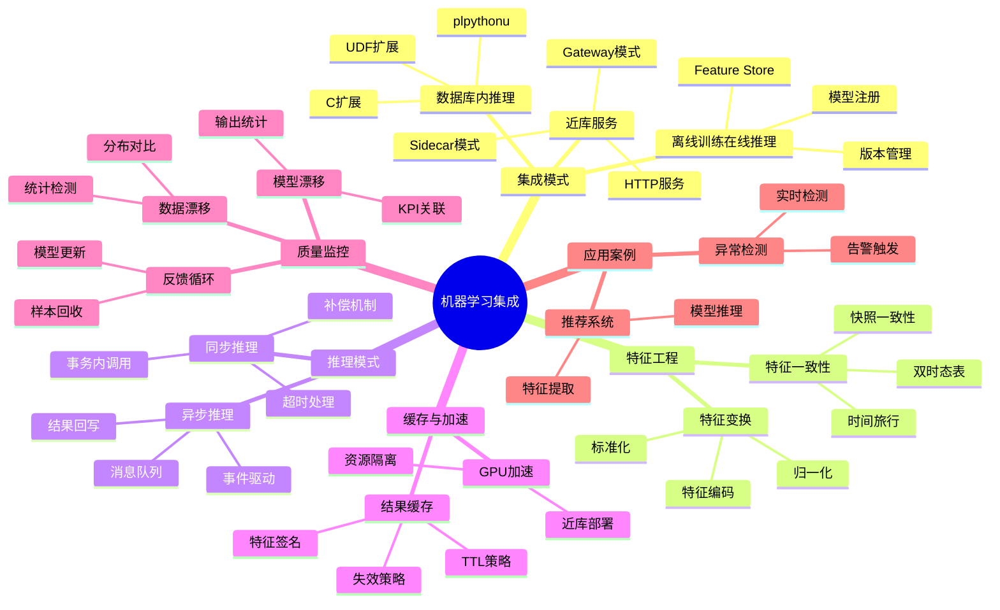

# 机器学习集成

> **文档版本**: v2.0
> **最后更新**: 2025-11-12
> **版本覆盖**: PostgreSQL 18.x (推荐) ⭐ | 17.x (推荐) | 16.x (兼容)
> **文档状态**: ✅ 已更新
> 📖 **文档说明**
>
> 本文档提供ML集成的**实践模式概述**。如需详细内容，请参考：
>
> - 🚀 [RAG架构实战指南](../../07-前沿技术/05.04-RAG架构实战指南.md) - 完整可运行方案 (PG 18+ ⭐)
> - 📚 [AI模型深度集成](../../07-前沿技术/05.02-AI模型深度集成.md) - 理论架构参考 (PG 18+ ⭐)
> - ☁️ [Azure AI扩展实战](../../07-前沿技术/05.03-Azure-AI扩展实战.md) - 云原生方案
> - 📋 [AI 时代专题](../ai_view.md) ⭐⭐⭐ (v3.0, 2025-11-11)

---

## 📋 目录

- [机器学习集成](#机器学习集成)
  - [📋 目录](#-目录)
  - [📊 思维导图](#-思维导图)
  - [📊 多维概念矩阵对比](#-多维概念矩阵对比)
    - [机器学习集成模式对比矩阵](#机器学习集成模式对比矩阵)
    - [特征存储方案对比矩阵](#特征存储方案对比矩阵)
    - [推理服务架构对比矩阵](#推理服务架构对比矩阵)
  - [🌐 Wikipedia对齐](#-wikipedia对齐)
    - [机器学习概念对齐](#机器学习概念对齐)
    - [Feature Store概念对齐](#feature-store概念对齐)
    - [在线学习概念对齐](#在线学习概念对齐)
  - [1. 概述](#1-概述)
  - [3. 参考架构](#3-参考架构)
    - [3.1 形态一：数据库内推理（UDF/扩展）](#31-形态一数据库内推理udf扩展)
    - [3.2 形态二：近库服务（Sidecar/Gateway）](#32-形态二近库服务sidecargateway)
    - [3.3 形态三：离线训练 + 在线特征/推理](#33-形态三离线训练--在线特征推理)
  - [4. 实践要点](#4-实践要点)
    - [4.1 特征工程与一致性](#41-特征工程与一致性)
    - [4.2 在线推理模式](#42-在线推理模式)
    - [4.3 缓存与加速](#43-缓存与加速)
    - [4.4 漂移与质量监控](#44-漂移与质量监控)
  - [5. 实战示例](#5-实战示例)
    - [5.1 plpythonu 推理UDF](#51-plpythonu-推理udf)
    - [5.2 HTTP 外部推理](#52-http-外部推理)
  - [6. 进阶学习](#6-进阶学习)
    - [完整实战方案](#完整实战方案)
    - [其他资源](#其他资源)
  - [9. 交叉引用](#9-交叉引用)
    - [相关文档](#相关文档)
      - [前沿技术](#前沿技术)
      - [高级特性](#高级特性)
      - [应用架构](#应用架构)
      - [核心基础](#核心基础)
      - [行业案例](#行业案例)
  - [8. 参考文献](#8-参考文献)

---

## 📊 思维导图



---

## 📊 多维概念矩阵对比

### 机器学习集成模式对比矩阵

| 集成模式 | 延迟 | 吞吐量 | 资源占用 | 复杂度 | 适用场景 | PostgreSQL支持 |
|---------|------|--------|---------|--------|---------|---------------|
| **数据库内推理(UDF)** | 极低 | 高 | 中 | 中 | 轻量模型 | ✅ 支持 |
| **近库服务(Sidecar)** | 低 | 高 | 高 | 高 | 中大型模型 | ✅ 集成支持 |
| **离线训练在线推理** | 中 | 很高 | 低 | 很高 | 大规模模型 | ✅ 支持 |
| **外部推理服务** | 中 | 中 | 低 | 中 | 通用场景 | ✅ HTTP/FDW支持 |

### 特征存储方案对比矩阵

| 存储方案 | 一致性 | 性能 | 可扩展性 | 时间旅行 | 适用场景 | PostgreSQL支持 |
|---------|--------|------|---------|---------|---------|---------------|
| **关系表** | 强一致性 | 高 | 中 | 有限 | 结构化特征 | ✅ 原生支持 |
| **JSONB列** | 强一致性 | 中 | 高 | 有限 | 半结构化特征 | ✅ 原生支持 |
| **双时态表** | 强一致性 | 中 | 中 | 完全支持 | 时间敏感特征 | ✅ 支持 |
| **外部Feature Store** | 最终一致性 | 高 | 很高 | 支持 | 大规模特征 | ✅ 集成支持 |

### 推理服务架构对比矩阵

| 架构模式 | 延迟 | 可扩展性 | 资源隔离 | 管理复杂度 | 适用场景 | PostgreSQL支持 |
|---------|------|---------|---------|-----------|---------|---------------|
| **UDF内嵌** | 极低 | 低 | 低 | 低 | 轻量模型 | ✅ 支持 |
| **Sidecar容器** | 低 | 高 | 高 | 中 | 中大型模型 | ✅ 容器支持 |
| **独立服务** | 中 | 很高 | 很高 | 高 | 大规模模型 | ✅ HTTP支持 |
| **Serverless函数** | 中 | 很高 | 高 | 中 | 按需推理 | ✅ 云服务集成 |

---

## 🌐 Wikipedia对齐

### 机器学习概念对齐

**Wikipedia定义**: [Machine learning](https://en.wikipedia.org/wiki/Machine_learning)

> Machine learning (ML) is a field of study in artificial intelligence concerned with the development and study of statistical algorithms that can learn from and make predictions or decisions based on data.

**对齐说明**:

- ✅ **定义一致性**: 本文档的定义与Wikipedia一致，都强调机器学习是基于数据学习和预测的算法
- ✅ **核心特性**: 都提到训练、推理、特征工程等核心特性
- ✅ **应用场景**: 都提到预测分析、决策支持等应用场景

### Feature Store概念对齐

**Wikipedia定义**: [Feature store](https://en.wikipedia.org/wiki/Feature_store)

> A feature store is a data system that manages the complete lifecycle of features for machine learning models, from feature engineering to serving features for training and inference.

**对齐说明**:

- ✅ **定义一致性**: 本文档的定义与Wikipedia一致，都强调Feature Store管理特征的完整生命周期
- ✅ **核心功能**: 都提到特征工程、特征服务、特征版本管理等核心功能
- ✅ **应用场景**: 都提到训练/推理一致性、特征复用等应用场景

### 在线学习概念对齐

**Wikipedia定义**: [Online machine learning](https://en.wikipedia.org/wiki/Online_machine_learning)

> Online machine learning is a method of machine learning in which data becomes available in a sequential order and is used to update the best predictor for future data at each step.

**对齐说明**:

- ✅ **定义一致性**: 本文档的定义与Wikipedia一致，都强调在线学习是顺序处理数据并更新模型的方法
- ✅ **核心特性**: 都提到增量学习、实时更新等核心特性
- ✅ **应用场景**: 都提到流式数据、实时推荐等应用场景

---

## 1. 概述

PostgreSQL的机器学习集成主要包括：

- **内嵌推理**: 数据库内轻量模型推理
- **特征存取**: Feature Store功能
- **训练/推理流水线**: 端到端ML工作流
- **在线/离线协同**: 训练与服务分离

## 3. 参考架构

- 模型注册/版本管理、UDF/UDAF、FDW、作业编排与资源隔离

### 3.1 形态一：数据库内推理（UDF/扩展）

- 适用：轻量模型、低延迟、特征在库内即可获取；
- 方式：
  - pl/pythonu 或 C 扩展包装推理；
  - 外部推理服务通过 FDW/HTTP 扩展访问（如 `postgres_fdw`/`http_fdw`）。

### 3.2 形态二：近库服务（Sidecar/Gateway）

- 适用：中大型模型、GPU 资源隔离；
- 数据流：PG 提供特征/过滤 → 服务做推理 → 回写结果/特征缓存。

### 3.3 形态三：离线训练 + 在线特征/推理

- 特征存取层（Feature Store）：维表、时间戳一致性、回放；
- 训练在外部平台（Spark/Ray），PG 作为样本源与标签仓。

## 4. 实践要点

- 安全与审计、可解释性、漂移监测、A/B测试、缓存与加速

### 4.1 特征工程与一致性

- 维度表快照与时间旅行：双时态/有效期列，确保训练/推理一致；
- UDF 实现标准化/归一化函数，保证跨批次一致的变换。

### 4.2 在线推理模式

- 同步模式：事务内调用 UDF/外部服务（注意超时与补偿）；
- 异步模式：事件驱动（NOTIFY/LISTEN、消息队列）+ 任务执行器回写结果。

### 4.3 缓存与加速

- 近似向量检索 + 结构化过滤；
- 结果缓存：按输入特征签名缓存，TTL 与失效策略；
- GPU/加速器：部署于近库节点，避免跨 AZ 浪费带宽。

### 4.4 漂移与质量监控

- 数据分布对比、模型输出统计、业务KPI 关联；
- 回收学习样本闭环：将推理样本/反馈写回训练集。

## 5. 实战示例

### 5.1 plpythonu 推理UDF

```sql
-- ✅ [可运行] 需要plpythonu扩展
CREATE EXTENSION IF NOT EXISTS plpythonu;

CREATE OR REPLACE FUNCTION infer_score(x double precision[])
RETURNS double precision
AS $$
  import math
  # 这里示意：可在函数内加载轻量模型或调用本地服务
  # 生产环境建议使用pickle加载预训练模型
  return sum(x)/max(len(x),1)
$$ LANGUAGE plpythonu IMMUTABLE;

-- 使用示例
SELECT id, infer_score(features) as score
FROM samples
ORDER BY score DESC
LIMIT 20;
```

### 5.2 HTTP 外部推理

```sql
-- 🔧 [需扩展] http扩展
CREATE EXTENSION IF NOT EXISTS http;

-- 调用外部推理服务
SELECT * FROM http_get('http://inference.svc/predict?x=1,2,3');
```

---

## 6. 进阶学习

### 完整实战方案

**强烈推荐**: ⭐⭐⭐ [RAG架构实战指南](../../07-前沿技术/05.04-RAG架构实战指南.md)

- ✅ 2878行完整代码
- ✅ LangChain + LlamaIndex集成
- ✅ Docker Compose一键部署
- ✅ 生产级监控方案

### 其他资源

- ⭐⭐ [向量检索性能调优](../../07-前沿技术/05.05-向量检索性能调优指南.md)
- ⭐⭐ [Azure AI扩展实战](../../07-前沿技术/05.03-Azure-AI扩展实战.md)
- ⭐⭐ [AI模型深度集成](../../07-前沿技术/05.02-AI模型深度集成.md) (理论参考)

## 9. 交叉引用

### 相关文档

#### 前沿技术

- ⭐⭐⭐ [AI模型深度集成](../../07-前沿技术/05.02-AI模型深度集成.md) - AI模型集成理论
- ⭐⭐ [RAG架构实战指南](../../07-前沿技术/05.04-RAG架构实战指南.md) - RAG架构实践
- ⭐⭐ [向量检索性能调优指南](../../07-前沿技术/05.05-向量检索性能调优指南.md) - 向量检索优化

#### 高级特性

- ⭐⭐ [向量数据库支持](./03.05-向量数据库支持.md) - 向量数据库基础

#### 应用架构

- ⭐⭐ [数据科学实践](../../09-应用设计/应用架构/07.06-数据科学实践.md) - 数据科学实践

#### 核心基础

- ⭐⭐ [存储管理与数据持久化](../../01-核心基础/01.06-存储管理与数据持久化.md) - 特征存储优化、列存储用于大规模特征分析🆕

#### 行业案例

- ⭐ [实时推荐](../../09-应用设计/行业案例/实时推荐.md) - 推荐系统案例

## 8. 参考文献

1. PostgreSQL Global Development Group. (2025). PostgreSQL 18 Documentation. <https://www.postgresql.org/docs/18/>
2. PostgreSQL Global Development Group. (2024). PostgreSQL 17 Documentation. <https://www.postgresql.org/docs/17/>
3. PostgreSQL官方文档 - [PL/Python](https://www.postgresql.org/docs/current/plpython.html)
4. PostgreSQL官方文档 - [外部数据包装器](https://www.postgresql.org/docs/current/fdwhandler.html)
