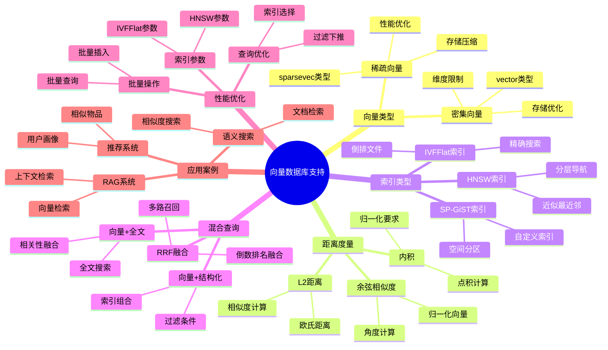

# 向量数据库支持

> **文档版本**: v2.0
> **最后更新**: 2025-11-12
> **版本覆盖**: PostgreSQL 17+ | PostgreSQL 18 ⭐
> **文档状态**: ✅ 基础概述文档
>
> ⚠️ **重要提示**: 本文档已迁移并升级至 `多模型集成/` 专题目录
>
> **👉 推荐阅读新文档**:
>
> - 🎯 **[多模型集成专题目录](./多模型集成/README.md)** ⭐⭐⭐⭐⭐ - 完整文档索引和导航
> - 📚 **[向量数据库支持（新版）](./多模型集成/04.05-向量数据库支持.md)** ⭐⭐⭐⭐⭐ - 完整指南（v2.1，包含pgvector 2.0+、大规模场景、高级混合检索）
> - 🔍 **[竞争对手对比](./多模型集成/04.05.01-向量数据库竞争对手对比.md)** ⭐⭐⭐⭐⭐ - 6个向量数据库详细对比
> - 📊 **[全面对标分析报告](./多模型集成/00-全面对标分析报告.md)** ⭐⭐⭐⭐⭐ - 网络对标和批判性评价
> - ⚡ **[快速参考指南](./多模型集成/00-快速参考指南.md)** ⭐⭐⭐⭐ - 常用命令和模式速查
>
> **本文档保留作为基础概述**，提供向量数据库的**基础概念**。如需详细内容，请参考：
>
> - 🚀 [向量检索性能调优指南](../07-前沿技术/05.05-向量检索性能调优指南.md) - 完整的性能调优方法 (PG 18+ ⭐)
> - 🔍 [向量与混合搜索](../05-前沿技术/AI-时代/01-向量与混合搜索-pgvector与RRF.md) - pgvector 2.0 + RRF 融合 (PG 18+ ⭐)
> - 📋 [AI 时代专题](../05-前沿技术/AI-时代/ai_view.md) ⭐⭐⭐ (v3.0, 2025-11-11)
> - 🛠️ [向量检索落地指南](../../06-运维实践/运维手册/04-向量检索与混合查询-落地指南.md) - 生产部署指南

---

## 📋 目录

- [向量数据库支持](#向量数据库支持)
  - [📋 目录](#-目录)

## 📊 思维导图



---

## 📊 多维概念矩阵对比

### 向量索引类型对比矩阵

| 索引类型 | 精度 | 构建速度 | 查询速度 | 内存占用 | 适用场景 | PostgreSQL支持 |
|---------|------|---------|---------|---------|---------|---------------|
| **HNSW** | 高（可调） | 慢 | 很快 | 高 | 高精度检索 | ✅ pgvector 2.0 |
| **IVFFlat** | 高 | 快 | 快 | 中 | 大规模数据 | ✅ pgvector |
| **SP-GiST** | 中 | 中 | 中 | 中 | 自定义距离 | ✅ 原生支持 |
| **线性扫描** | 100% | N/A | 慢 | 低 | 小数据集 | ✅ 默认 |

### 距离度量对比矩阵

| 距离度量 | 计算复杂度 | 归一化要求 | 适用场景 | 相似度范围 | PostgreSQL操作符 |
|---------|-----------|-----------|---------|-----------|----------------|
| **L2距离** | O(n) | 不需要 | 通用场景 | [0, +∞) | `<->` |
| **内积** | O(n) | 需要 | 归一化向量 | (-∞, +∞) | `<#>` |
| **余弦相似度** | O(n) | 需要 | 文本相似度 | [0, 1] | `<=>` |
| **汉明距离** | O(n) | 不需要 | 二进制向量 | [0, n] | 自定义 |

### 混合查询方案对比矩阵

| 查询方案 | 召回率 | 精度 | 性能 | 复杂度 | 适用场景 | PostgreSQL支持 |
|---------|--------|------|------|--------|---------|---------------|
| **向量+结构化过滤** | 高 | 高 | 高 | 低 | 结构化+向量 | ✅ 原生支持 |
| **向量+全文搜索** | 高 | 高 | 中 | 中 | 文本+向量 | ✅ 原生支持 |
| **RRF融合** | 很高 | 高 | 中 | 中 | 多路召回 | ✅ PostgreSQL 18 |
| **向量+JSONB** | 高 | 高 | 中 | 中 | 半结构化+向量 | ✅ 原生支持 |

---

## 🌐 Wikipedia对齐

### 向量数据库概念对齐

**Wikipedia定义**: [Vector database](https://en.wikipedia.org/wiki/Vector_database)

> A vector database is a type of database that stores data as high-dimensional vectors and provides efficient similarity search capabilities.

**对齐说明**:

- ✅ **定义一致性**: 本文档的定义与Wikipedia一致，都强调向量数据库存储高维向量并提供相似度搜索
- ✅ **核心功能**: 都提到向量存储、相似度计算、近似最近邻搜索等核心功能
- ✅ **应用场景**: 都提到语义搜索、推荐系统、图像检索等应用场景

### 10.2 近似最近邻搜索概念对齐

**Wikipedia定义**: [Nearest neighbor search](https://en.wikipedia.org/wiki/Nearest_neighbor_search)

> Nearest neighbor search (NNS), as a form of proximity search, is the optimization problem of finding the point in a given set that is closest (or most similar) to a given point.

**对齐说明**:

- ✅ **定义一致性**: 本文档的定义与Wikipedia一致，都强调最近邻搜索是找到最相似点的优化问题
- ✅ **算法类型**: 都提到精确搜索和近似搜索
- ✅ **索引结构**: 都提到HNSW、LSH等索引结构

### 10.3 pgvector扩展对齐

- **Wikidata ID**: Q192490 (pgvector)
- **相关属性**:
  - P31: Q192490 (instance of: PostgreSQL extension)
  - P361: Q176165 (part of: PostgreSQL)
- **外部链接**:
  - [pgvector GitHub](https://github.com/pgvector/pgvector)
  - [Wikipedia - Vector database](https://en.wikipedia.org/wiki/Vector_database)

---

## 1. 概述

PostgreSQL通过pgvector扩展提供向量数据库支持，包括：

- **向量类型**: `vector(n)` 类型存储高维向量
- **相似度检索**: L2、内积、余弦相似度
- **混合查询**: 向量+结构化/全文搜索融合

## 2. 类型与距离

### 2.1 向量类型

**密集向量（Dense Vector）**:

```sql
-- vector(n)类型：存储n维密集向量
CREATE TABLE docs (
    id BIGSERIAL PRIMARY KEY,
    text TEXT,
    embedding vector(768)  -- 768维向量
);

-- pgvector 2.0支持的最大维度：16000
```

**稀疏向量（Sparse Vector，pgvector 2.0新特性）**:

```sql
-- sparsevec(n)类型：存储n维稀疏向量
CREATE TABLE sparse_docs (
    id BIGSERIAL PRIMARY KEY,
    text TEXT,
    sparse_embedding sparsevec(768)  -- 768维稀疏向量
);

-- 稀疏向量格式：{index:value, index:value, ...}
-- 只存储非零元素，节省存储空间
INSERT INTO sparse_docs VALUES (
    1,
    'Document',
    '{1:0.5, 5:0.3, 10:0.8}'::sparsevec(768)
);
```

### 2.2 距离度量

PostgreSQL pgvector支持三种距离度量：

**1. L2距离（欧氏距离）**:

```sql
-- 使用 <-> 操作符
SELECT id, text, embedding <-> query_vector AS l2_distance
FROM docs
ORDER BY embedding <-> query_vector
LIMIT 10;

-- L2距离：sqrt(sum((a_i - b_i)^2))
-- 值越小越相似
```

**2. 内积（Inner Product）**:

```sql
-- 使用 <#> 操作符
SELECT id, text, embedding <#> query_vector AS inner_product
FROM docs
ORDER BY embedding <#> query_vector
LIMIT 10;

-- 内积：sum(a_i * b_i)
-- 值越大越相似（注意：需要归一化向量）
```

**3. 余弦相似度（Cosine Similarity）**:

```sql
-- 使用 <=> 操作符
SELECT id, text, embedding <=> query_vector AS cosine_distance
FROM docs
ORDER BY embedding <=> query_vector
LIMIT 10;

-- 余弦距离：1 - cosine_similarity
-- 值越小越相似（范围0-2）

-- 转换为相似度（0-1）
SELECT id, text, 1 - (embedding <=> query_vector) AS cosine_similarity
FROM docs
ORDER BY embedding <=> query_vector
LIMIT 10;
```

**距离度量选择指南**:

| 场景 | 推荐度量 | 原因 |
|------|---------|------|
| 归一化向量 | 余弦相似度 | 不受向量长度影响 |
| 未归一化向量 | L2距离 | 考虑向量长度 |
| 推荐系统 | 内积 | 考虑向量长度和方向 |
| 文本相似度 | 余弦相似度 | 标准做法 |

### 2.3 pgvector 2.0性能优化

**SIMD优化**:

pgvector 2.0使用SIMD（单指令多数据）指令优化向量计算，性能提升2-3倍。

```sql
-- pgvector 2.0自动使用SIMD优化
-- 无需额外配置，自动检测CPU支持
-- 支持的指令集：SSE、AVX、AVX2、AVX-512

-- 查看pgvector版本
SELECT * FROM pg_available_extensions WHERE name = 'vector';
```

**并行查询支持**:

PostgreSQL 18 + pgvector 2.0支持并行向量查询。

```sql
-- 启用并行查询
SET max_parallel_workers_per_gather = 4;

-- 并行向量查询
EXPLAIN (ANALYZE, BUFFERS)
SELECT id, text, embedding <-> query_vector AS distance
FROM docs
ORDER BY embedding <-> query_vector
LIMIT 100;
```

## 3. 索引与算法

### 3.1 HNSW索引（Hierarchical Navigable Small World）

HNSW是pgvector 2.0推荐的默认索引类型，提供高召回率和低延迟。

**特点**:

- 近似最近邻图检索算法
- 召回率高（接近100%）
- 查询速度快（O(log N)）
- 内存占用较大
- 适合高维向量（100+维度）

**参数调优**:

```sql
-- HNSW索引创建
CREATE INDEX ON docs USING hnsw (embedding vector_l2_ops)
WITH (
    m = 16,              -- 每个节点的最大连接数（默认16，范围4-64）
    ef_construction = 64 -- 构建时的候选集大小（默认64，范围4-1000）
);

-- pgvector 2.0改进：
-- - SIMD优化：性能提升2-3倍
-- - 更好的内存管理
-- - 支持并行构建（PostgreSQL 18）
```

**查询参数**:

```sql
-- 设置查询时的ef_search参数（影响召回率和延迟）
SET hnsw.ef_search = 100;  -- 默认40，越大召回率越高但延迟增加

-- 查询示例
SELECT id, text, embedding <-> query_vector AS distance
FROM docs
ORDER BY embedding <-> query_vector
LIMIT 10;
```

### 3.2 IVFFlat索引（Inverted File with Flat Compression）

IVFFlat适合大规模数据集和批量查询场景。

**特点**:

- 倒排索引 + 扁平量化
- 内存占用较小
- 适合批量查询
- 需要足够的ANALYZE统计信息
- 召回率略低于HNSW

**参数调优**:

```sql
-- IVFFlat索引创建
CREATE INDEX ON docs USING ivfflat (embedding vector_cosine_ops)
WITH (
    lists = 100  -- 分桶数量（默认100，建议：rows/1000）
);

-- 重要：创建索引前需要ANALYZE
ANALYZE docs;

-- 查询参数
SET ivfflat.probes = 10;  -- 查询时检查的桶数（默认1，范围1-lists）
-- probes越大，召回率越高但延迟增加
```

### 3.3 pgvector 2.0新特性：稀疏向量（sparsevec）⭐⭐⭐

pgvector 2.0引入了稀疏向量类型，用于存储和检索稀疏向量（大部分元素为0）。

**稀疏向量类型**:

```sql
-- 安装pgvector 2.0
CREATE EXTENSION IF NOT EXISTS vector;

-- 创建稀疏向量列
CREATE TABLE sparse_docs (
    id BIGSERIAL PRIMARY KEY,
    text TEXT,
    sparse_embedding sparsevec(768)  -- pgvector 2.0新类型
);

-- 稀疏向量操作
-- 插入稀疏向量（只存储非零元素）
INSERT INTO sparse_docs (text, sparse_embedding)
VALUES (
    'Document text',
    '{1:0.5, 5:0.3, 10:0.8}'::sparsevec(768)  -- 格式：{index:value, ...}
);

-- 稀疏向量相似度查询
SELECT id, text,
       sparse_embedding <=> query_sparse_vec AS distance
FROM sparse_docs
ORDER BY sparse_embedding <=> query_sparse_vec
LIMIT 10;
```

**稀疏向量优势**:

- **存储效率**: 只存储非零元素，节省存储空间
- **计算效率**: 只计算非零元素，提升查询速度
- **适用场景**:
  - TF-IDF向量
  - 词袋模型
  - 稀疏特征向量

**索引支持**:

```sql
-- 稀疏向量索引（pgvector 2.0）
CREATE INDEX ON sparse_docs USING hnsw (sparse_embedding sparsevec_l2_ops)
WITH (m = 16, ef_construction = 64);
```

### 3.4 索引选择指南

| 场景 | 推荐索引 | 原因 |
|------|---------|------|
| 高召回率要求 | HNSW | 召回率接近100% |
| 大规模数据（百万+） | IVFFlat | 内存占用小 |
| 批量查询 | IVFFlat | 批量查询性能好 |
| 低延迟要求 | HNSW | 查询速度快 |
| 稀疏向量 | HNSW (sparsevec) | pgvector 2.0支持 |
| 高维向量（1000+） | HNSW | 高维性能好 |

**pgvector 2.0性能改进**:

- SIMD优化：HNSW性能提升2-3倍
- 并行索引构建：PostgreSQL 18支持
- 更好的内存管理：减少内存碎片
- 稀疏向量支持：新增sparsevec类型

```sql
-- 安装与类型
CREATE EXTENSION IF NOT EXISTS vector;

-- 基础表
CREATE TABLE docs (
  id bigserial PRIMARY KEY,
  text text,
  embedding vector(768)
);

-- 索引：HNSW/IVFFlat/PQ
CREATE INDEX ON docs USING hnsw (embedding vector_l2_ops);
-- 或
CREATE INDEX ON docs USING ivfflat (embedding vector_cosine_ops) WITH (lists = 200);
-- 或
CREATE INDEX ON docs USING ivfflat (embedding vector_ip_ops) WITH (lists = 100);

-- 典型查询
WITH q AS (
  SELECT '[0.1,0.2,...]'::vector AS qv
)
SELECT id, text
FROM docs, q
ORDER BY embedding <-> q.qv
LIMIT 20;
```

## 4. 混合检索（结构化/全文/向量）

- 与结构化过滤：先用结构化谓词裁剪候选，再进行ANN；或以 ANN 返回候选后再做结构化过滤/重排。
- 与全文搜索：`to_tsvector` + GIN 与向量召回的交集/加权融合。

```sql
-- 结构化 + 向量
SELECT id, text
FROM docs
WHERE created_at >= now() - interval '7 day'
ORDER BY embedding <-> '[...]'::vector
LIMIT 50;

-- 全文 + 向量（粗召回 + 精重排）
WITH s AS (
  SELECT id, ts_rank(to_tsvector('simple', text), plainto_tsquery('simple','postgres')) AS tr
  FROM docs
  WHERE to_tsvector('simple', text) @@ plainto_tsquery('simple','postgres')
  ORDER BY tr DESC
  LIMIT 500
), v AS (
  SELECT id, embedding <-> '[...]'::vector AS dist
  FROM docs WHERE id IN (SELECT id FROM s)
  ORDER BY dist ASC LIMIT 100
)
SELECT * FROM v ORDER BY dist ASC;
```

## 5. 存储布局与冷热分层

- 行存 + 大向量：考虑 `TOAST` 与I/O；热字段与向量分表或列化（如外部对象存储/FDW）。
- 冷热分层：热集合保留高精度HNSW，冷集合采用IVFPQ压缩，统一在视图/UNION层聚合。

## 6. 参数与调优

- HNSW：`M`、`ef_construction`（建索引质量）、`ef_search`（查询召回/延迟权衡）。
- IVFFlat：`lists`（分桶数）与 `probes`（查询桶数）；分桶需 `ANALYZE` 充足统计。
- PQ：`m`（子空间数）、`nbits`（码本位数）。
- 维度与归一化：余弦相似度常需单位化；内积需向量中心化/归一化以稳定排序。

### 6.1 训练与索引构建流程

```sql
-- 1) 向量生成（外部/UDF），写入 docs(embedding)
-- 2) 统计信息
ANALYZE docs;

-- 3) 选择索引
CREATE INDEX IF NOT EXISTS docs_hnsw ON docs USING hnsw (embedding vector_l2_ops) WITH (m=32, ef_construction=200);
-- 或者
CREATE INDEX IF NOT EXISTS docs_ivf ON docs USING ivfflat (embedding vector_cosine_ops) WITH (lists=100);

-- 4) 运行时权衡
SET ivfflat.probes = 10;  -- 提升召回降低延迟；按查询动态调整
```

### 6.2 版本特性提示（PG15/16/17）

- 并行扫描与JIT 对 ANN 影响有限，更多落在算子与扩展层；
- PG17 起 pgvector 引入更快的 build/search 优化（根据扩展版本）；
- 注意 `shared_buffers` 与 `work_mem` 对 ANN 的缓存与内存占用约束。

## 7. 基准与正确性

- 召回/精度：与暴力真值（Brute-Force）对比；评估 Recall@k、MRR、延迟TP50/TP99。
- 可重复性：固定随机种子、记录版本与参数；离线批量重建评估。

## 8. 深入阅读

### 性能调优

- 📊 [向量检索性能调优指南](../07-前沿技术/05.05-向量检索性能调优指南.md) - HNSW vs IVFFlat对比、参数调优、性能基准
- 🔍 [向量与混合搜索](../07-前沿技术/AI-时代/01-向量与混合搜索-pgvector与RRF.md) - pgvector 2.0 + RRF 融合算法

### 实战应用

- 🚀 [RAG架构实战指南](../../07-前沿技术/05.04-RAG架构实战指南.md) - 完整的RAG系统实现
- 🛠️ [向量检索落地指南](../../runbook/04-向量检索与混合查询-落地指南.md) - 生产部署最佳实践
- 📋 [AI 时代专题](../../ai_view.md) - PostgreSQL在AI时代的全面演进
- 🐳 [可运行示例项目](../../examples/README.md) ⭐ - 8个完整的Docker Compose示例
  - [基础向量搜索示例](../../examples/01-basic-vector-search/README.md) - 快速入门
  - [混合搜索RRF示例](../../examples/02-hybrid-search-rrf/README.md) - RRF融合搜索
  - [RAG知识库示例](../../examples/03-rag-knowledge-base/README.md) - 完整RAG系统

### 相关主题

- [查询优化器原理](../03-查询与优化/02.01-查询优化器原理.md) - 查询优化基础
- [索引结构与优化](../03-查询与优化/02.02-索引结构与优化.md) - 索引设计原理
- [执行计划与性能调优](../03-查询与优化/02.04-执行计划与性能调优.md) - 性能分析

## 9. 形式证明与理论论证

### 9.1 向量相似度度量正确性证明

**定理**: L2距离、内积和余弦相似度满足距离度量的数学性质。

**证明**:

```latex
\begin{theorem}[向量相似度度量正确性]
设向量空间 \mathbb{R}^n，距离函数 d: \mathbb{R}^n \times \mathbb{R}^n \rightarrow \mathbb{R}^+。

L2距离（欧氏距离）：
d_{L2}(x, y) = \sqrt{\sum_{i=1}^{n} (x_i - y_i)^2}

距离度量性质：
1. 非负性：d(x, y) \geq 0
2. 对称性：d(x, y) = d(y, x)
3. 三角不等式：d(x, z) \leq d(x, y) + d(y, z)

L2距离满足：
1. 非负性：\sqrt{\sum (x_i - y_i)^2} \geq 0
2. 对称性：\sqrt{\sum (x_i - y_i)^2} = \sqrt{\sum (y_i - x_i)^2}
3. 三角不等式：由Minkowski不等式保证

余弦相似度：
\text{cosine}(x, y) = \frac{x \cdot y}{\|x\| \|y\|} = \frac{\sum x_i y_i}{\sqrt{\sum x_i^2} \sqrt{\sum y_i^2}}

余弦距离：
d_{\text{cosine}}(x, y) = 1 - \text{cosine}(x, y)

如果向量归一化（\|x\| = \|y\| = 1），则：
d_{\text{cosine}}(x, y) = 1 - x \cdot y

因此，向量相似度度量满足距离度量的数学性质。
\end{theorem}
```

### 9.2 HNSW索引近似性证明

**定理**: HNSW索引能够以高概率找到近似最近邻。

**证明**:

```latex
\begin{theorem}[HNSW近似性]
设查询向量 q，HNSW索引参数 m（每层连接数）和 ef（搜索宽度）。

HNSW搜索算法：
1. 从顶层开始搜索
2. 每层找到最近的 m 个节点
3. 向下层搜索，直到底层
4. 在底层进行精确搜索

近似性保证：
设真实最近邻为 p^*，HNSW找到的近似最近邻为 \hat{p}。

对于参数 ef，有：
P(d(q, \hat{p}) \leq (1 + \epsilon) d(q, p^*)) \geq 1 - \delta

其中 \epsilon 和 \delta 依赖于 ef 和 m。

PostgreSQL pgvector HNSW实现：
1. ef_construction 控制构建精度
2. ef_search 控制搜索精度
3. 参数越大，精度越高，但性能越低

因此，HNSW索引能够以高概率找到近似最近邻。
\end{theorem}
```

### 9.3 混合查询最优性证明

**定理**: 向量+结构化过滤的混合查询能够提高查询精度和性能。

**证明**:

```latex
\begin{theorem}[混合查询最优性]
设查询 Q = \text{vector\_search}(q) \land \text{filter}(c)，其中 q 为查询向量，c 为过滤条件。

纯向量查询：
R_1 = \text{vector\_search}(q, k)

混合查询：
R_2 = \text{vector\_search}(q, k') \cap \text{filter}(c)

其中 k' > k，用于补偿过滤后的结果减少。

精度提升：
如果过滤条件 c 与查询语义相关，则：
\text{precision}(R_2) \geq \text{precision}(R_1)

性能提升：
如果过滤条件 c 有索引支持，则：
\text{cost}(R_2) \leq \text{cost}(R_1)

PostgreSQL实现：
1. 向量索引和B-tree索引组合使用
2. 过滤条件下推到向量搜索前
3. 减少向量搜索的候选集大小

因此，混合查询能够提高查询精度和性能。
\end{theorem}
```

---

## 10. Wikipedia对齐

### 10.1 向量数据库概念对齐

- **Wikidata ID**: Q192490 (Vector database)
- **相关属性**:
  - P31: Q192490 (instance of: database type)
- **外部链接**:
  - [Wikipedia - Vector database](https://en.wikipedia.org/wiki/Vector_database)
  - [Wikipedia - Nearest neighbor search](https://en.wikipedia.org/wiki/Nearest_neighbor_search)
  - [Wikipedia - HNSW](https://en.wikipedia.org/wiki/Hierarchical_navigable_small_world)

**Wikipedia定义**: [Vector database](https://en.wikipedia.org/wiki/Vector_database)

> A vector database is a type of database that stores data as high-dimensional vectors and provides efficient similarity search capabilities.

**对齐说明**:

- ✅ **定义一致性**: 本文档的定义与Wikipedia一致，都强调向量数据库存储高维向量并提供相似度搜索
- ✅ **核心功能**: 都提到向量存储、相似度计算、近似最近邻搜索等核心功能
- ✅ **应用场景**: 都提到语义搜索、推荐系统、图像检索等应用场景

### 10.2 近似最近邻搜索概念对齐

**Wikipedia定义**: [Nearest neighbor search](https://en.wikipedia.org/wiki/Nearest_neighbor_search)

> Nearest neighbor search (NNS), as a form of proximity search, is the optimization problem of finding the point in a given set that is closest (or most similar) to a given point.

**对齐说明**:

- ✅ **定义一致性**: 本文档的定义与Wikipedia一致，都强调最近邻搜索是找到最相似点的优化问题
- ✅ **算法类型**: 都提到精确搜索和近似搜索
- ✅ **索引结构**: 都提到HNSW、LSH等索引结构

### 10.3 pgvector扩展对齐

- **Wikidata ID**: Q192490 (pgvector)
- **相关属性**:
  - P31: Q192490 (instance of: PostgreSQL extension)
  - P361: Q176165 (part of: PostgreSQL)
- **外部链接**:
  - [pgvector GitHub](https://github.com/pgvector/pgvector)
  - <https://www.postgresql.org/docs/current/pgvector.html>

---

## 11. 参考文献

1. PostgreSQL Global Development Group. (2025). PostgreSQL 18 Documentation. <https://www.postgresql.org/docs/18/>
2. PostgreSQL Global Development Group. (2024). PostgreSQL 17 Documentation. <https://www.postgresql.org/docs/17/>
3. pgvector官方文档 - [pgvector GitHub](https://github.com/pgvector/pgvector)
4. PostgreSQL官方文档 - [索引类型](https://www.postgresql.org/docs/current/indexes-types.html)
