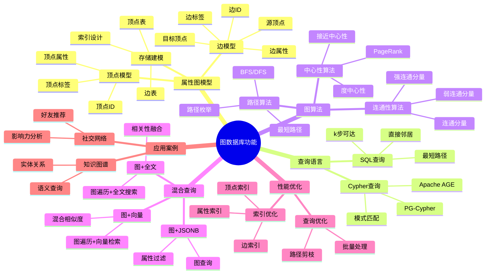

# 图数据库功能

> **文档版本**: v2.0
> **最后更新**: 2025-11-12
> **版本覆盖**: PostgreSQL 18.x (推荐) ⭐ | 17.x (推荐) | 16.x (兼容)
> **文档状态**: ✅ 已更新
>
> ⚠️ **重要提示**: 本文档已迁移并升级至 `多模型集成/` 专题目录
>
> **👉 推荐阅读新文档**:
>
> - 🎯 **[多模型集成专题目录](./多模型集成/README.md)** ⭐⭐⭐⭐⭐ - 完整文档索引和导航
> - 📚 **[图数据库功能（新版）](./多模型集成/04.06-图数据库功能.md)** ⭐⭐⭐⭐ - 完整指南（v2.0）
> - 📊 **[向量数据库支持（新版）](./多模型集成/04.05-向量数据库支持.md)** ⭐⭐⭐⭐⭐ - 向量数据库完整指南
>
> **本文档保留作为基础概述**，提供图数据库功能的基础概述。如需详细内容，请参考：
>
> - 📋 [AI 时代专题 - 多模一体化](../05-前沿技术/AI-时代/ai_view.md) ⭐⭐⭐ (v3.0, 2025-11-11)
> - 📊 [向量数据库支持](./03.05-向量数据库支持.md) (PG 18+ ⭐)

---

## 📋 目录

- [图数据库功能](#图数据库功能)
  - [📋 目录](#-目录)
  - [📊 思维导图](#-思维导图)
  - [📊 多维概念矩阵对比](#-多维概念矩阵对比)
    - [图数据模型对比矩阵](#图数据模型对比矩阵)
    - [图查询方法对比矩阵](#图查询方法对比矩阵)
    - [图算法实现对比矩阵](#图算法实现对比矩阵)
  - [🌐 Wikipedia对齐](#-wikipedia对齐)
    - [图数据库概念对齐](#图数据库概念对齐)
    - [11.2 属性图模型概念对齐](#112-属性图模型概念对齐)
    - [11.3 Cypher查询语言对齐](#113-cypher查询语言对齐)
    - [11.4 PostgreSQL图数据库对齐](#114-postgresql图数据库对齐)
  - [1. 概述](#1-概述)
  - [2. 属性图模型](#2-属性图模型)
  - [3. SQL/PGQL 风格查询](#3-sqlpgql-风格查询)
  - [4. 图算法与实现](#4-图算法与实现)
    - [4.1 Apache AGE（开放Cypher on PostgreSQL）](#41-apache-age开放cypher-on-postgresql)
    - [4.2 PG-Cypher/FDW 混合](#42-pg-cypherfdw-混合)
  - [5. 与向量/全文/JSON 的混合](#5-与向量全文json-的混合)
  - [6. 约束与一致性](#6-约束与一致性)
  - [7. 性能与运维](#7-性能与运维)
  - [8. 示例建模脚本](#8-示例建模脚本)
  - [9. 交叉引用](#9-交叉引用)
    - [相关文档](#相关文档)
      - [高级特性](#高级特性)
      - [核心课程](#核心课程)
      - [数据模型设计](#数据模型设计)
      - [工具资源](#工具资源)
  - [10. 形式证明与理论论证](#10-形式证明与理论论证)
    - [10.1 图遍历正确性证明](#101-图遍历正确性证明)
    - [10.2 最短路径算法正确性证明](#102-最短路径算法正确性证明)
    - [10.3 图查询等价性证明](#103-图查询等价性证明)
  - [11. Wikipedia对齐](#11-wikipedia对齐)
    - [11.1 图数据库概念对齐](#111-图数据库概念对齐)
    - [11.2 属性图模型概念对齐](#112-属性图模型概念对齐-1)
    - [11.3 Cypher查询语言对齐](#113-cypher查询语言对齐-1)
    - [11.4 PostgreSQL图数据库对齐](#114-postgresql图数据库对齐-1)
  - [12. 参考文献](#12-参考文献)

---

## 📊 思维导图



---

## 📊 多维概念矩阵对比

### 图数据模型对比矩阵

| 图模型 | 顶点表示 | 边表示 | 属性存储 | 查询能力 | 适用场景 | PostgreSQL支持 |
|--------|---------|--------|---------|---------|---------|---------------|
| **属性图模型** | 表行 | 表行 | JSONB | 高 | 通用场景 | ✅ 原生支持 |
| **边列表模型** | ID | (src, dst) | 分离表 | 中 | 简单图 | ✅ 支持 |
| **邻接表模型** | ID | 数组列 | JSONB | 中 | 小图 | ✅ 支持 |
| **三元组模型** | 资源 | (主体,谓词,客体) | 分离 | 高 | RDF图 | ✅ 支持 |

### 图查询方法对比矩阵

| 查询方法 | 表达能力 | 性能 | 复杂度 | 适用场景 | PostgreSQL支持 |
|---------|---------|------|--------|---------|---------------|
| **SQL递归CTE** | 高 | 中 | 中 | 路径查询 | ✅ 原生支持 |
| **Cypher (AGE)** | 很高 | 高 | 低 | 复杂图查询 | ✅ Apache AGE |
| **存储过程** | 高 | 高 | 高 | 自定义算法 | ✅ 原生支持 |
| **外部图引擎** | 极高 | 很高 | 高 | 大规模图 | ✅ FDW支持 |

### 图算法实现对比矩阵

| 图算法 | 时间复杂度 | 空间复杂度 | 并行化 | 适用场景 | PostgreSQL实现 |
|---------|-----------|-----------|--------|---------|---------------|
| **BFS最短路径** | O(V+E) | O(V) | 有限 | 无权图 | ✅ 递归CTE |
| **DFS遍历** | O(V+E) | O(V) | 有限 | 深度优先 | ✅ 递归CTE |
| **PageRank** | O(k×E) | O(V) | 支持 | 影响力分析 | ⚠️ 有限支持 |
| **连通分量** | O(V+E) | O(V) | 支持 | 连通性分析 | ⚠️ 有限支持 |

---

## 🌐 Wikipedia对齐

### 图数据库概念对齐

**Wikipedia定义**: [Graph database](https://en.wikipedia.org/wiki/Graph_database)

> A graph database is a database that uses graph structures for semantic queries with nodes, edges, and properties to represent and store data.

**对齐说明**:

- ✅ **定义一致性**: 本文档的定义与Wikipedia一致，都强调图数据库使用图结构（节点、边、属性）表示和存储数据
- ✅ **核心概念**: 都包含顶点、边、属性等核心概念
- ✅ **查询能力**: 都提到语义查询、图遍历等查询能力

### 11.2 属性图模型概念对齐

**Wikipedia定义**: [Property graph model](https://en.wikipedia.org/wiki/Property_graph_model)

> The property graph model is a graph data model that represents entities as nodes and relationships as edges, where both nodes and edges can have properties.

**对齐说明**:

- ✅ **定义一致性**: 本文档的定义与Wikipedia一致，都强调属性图模型中节点和边都可以有属性
- ✅ **存储方式**: PostgreSQL使用表+JSONB的方式实现属性图模型
- ✅ **查询能力**: 都支持基于属性的查询和过滤

### 11.3 Cypher查询语言对齐

**Wikipedia定义**: [Cypher (query language)](https://en.wikipedia.org/wiki/Cypher_(query_language))

> Cypher is a declarative graph query language that allows for expressive and efficient querying and updating of a property graph.

**对齐说明**:

- ✅ **定义一致性**: 本文档的定义与Wikipedia一致，都强调Cypher是声明式的图查询语言
- ✅ **核心特性**: 都提到模式匹配、路径查询等核心特性
- ✅ **实现方式**: Apache AGE在PostgreSQL上实现了Cypher查询语言

### 11.4 PostgreSQL图数据库对齐

- **Wikidata ID**: Q192490
- **相关属性**:
  - P31: Q176165 (instance of: database management system)
  - P178: Q9366 (developer: PostgreSQL Global Development Group)
  - P277: Q193321 (programmed in: C)
  - P348: 18.0 (software version)
- **外部链接**:
  - <https://www.postgresql.org/docs/current/queries-with.html>
  - [Apache AGE](https://age.apache.org/)

---

## 1. 概述

- 图数据建模、图查询、图算法，属性图与路径分析。

## 2. 属性图模型

- 元素：`Vertex(v_id, label, properties)`；`Edge(e_id, src, dst, label, properties)`。
- 语义：属性键值对（JSONB 适合属性承载），标签用于类型与约束分类；边可定向/无向以列模型表示。
- 存储建模：
  - 顶点表：`vertices(id bigint pk, label text, props jsonb)`。
  - 边表：`edges(id bigint pk, src bigint, dst bigint, label text, props jsonb)`，索引 `(src)`, `(dst)`, `(label)`，以及 `GIN(props)`。

## 3. SQL/PGQL 风格查询

- 可在 SQL 中表达图遍历：半连接/递归CTE 表达可达性与路径枚举；
- PGQL/开放Cypher风格可映射到 CTE + 连接计划；

```sql
-- 3.1 直接邻居
SELECT v2.*
FROM vertices v1
JOIN edges e ON e.src = v1.id AND e.label = 'follows'
JOIN vertices v2 ON v2.id = e.dst
WHERE v1.id = $1;

-- 3.2 k步可达（递归CTE）
WITH RECURSIVE reach(id, depth, path) AS (
  SELECT $1, 0, ARRAY[$1]
  UNION ALL
  SELECT e.dst, r.depth + 1, r.path || e.dst
  FROM reach r
  JOIN edges e ON e.src = r.id
  WHERE r.depth < 3 AND NOT e.dst = ANY(r.path)
)
SELECT * FROM reach;

-- 3.3 最短路（无权 BFS 轮廓）
WITH RECURSIVE bfs(node, depth, path) AS (
  SELECT $1, 0, ARRAY[$1]
  UNION ALL
  SELECT e.dst, b.depth + 1, b.path || e.dst
  FROM bfs b
  JOIN edges e ON e.src = b.node
  WHERE NOT e.dst = ANY(b.path)
)
SELECT * FROM bfs WHERE node = $2 ORDER BY depth LIMIT 1;
```

## 4. 图算法与实现

- 无权最短路径：递归CTE / 分批BFS；大图建议在应用层批次推进。
- PageRank/连通分量：以迭代计算表达，或用外部引擎（如Apache AGE扩展、GraphBLAS/外部计算）。
- 索引建议：`(src)`, `(dst)`, 以及热门边标签过滤索引；属性检索使用 `props` 上的表达式/GIN 索引。

### 4.1 Apache AGE（开放Cypher on PostgreSQL）

- 安装与启用：

  ```sql
  CREATE EXTENSION IF NOT EXISTS age;
  LOAD 'age';
  SELECT * FROM create_graph('g');
  ```

- Cypher 示例：

  ```sql
  SELECT * FROM cypher('g', $$
    CREATE (a:User {id:1,name:'A'})-[:FOLLOWS]->(b:User {id:2,name:'B'})
  $$) as (v agtype);

  SELECT * FROM cypher('g', $$
    MATCH (a:User {id:1})-[:FOLLOWS*1..3]->(x)
    RETURN x LIMIT 10
  $$) as (x agtype);
  ```

- 运维要点：版本兼容（PG/AGE）、统计与 ANALYZE、与常规SQL混合查询的代价控制。

### 4.2 PG-Cypher/FDW 混合

- 通过 FDW 对接专用图引擎（Neo4j/TigerGraph）进行跨库查询；在PG做过滤、在图引擎做遍历。

## 5. 与向量/全文/JSON 的混合

- 节点属性向量化：在 `vertices` 侧增加 `embedding vector(n)` 列，结合 pgvector 做“图内语义检索 + 路径约束”。
- 全文结合：对 `props->>'text'` 建立 `to_tsvector` + GIN，先全文召回再走路径。
- JSON 模式：属性采用 JSONB，重要字段冗余列以提升统计与索引质量。

## 6. 约束与一致性

- 唯一约束：`vertices(label,id)`、`edges(id)`；
- 参照完整性：`edges.src`/`edges.dst` 引用 `vertices.id`，`ON DELETE CASCADE | RESTRICT` 视语义选择；
- 业务约束：避免自环/多重边可用排他约束或唯一组合。

## 7. 性能与运维

- 批量导入：关闭次要索引、使用 `COPY`、导入后并发创建索引；
- 分区策略：按标签或范围分区大图；
- 监控：`pg_stat_user_tables`、热点边过滤、递归CTE深度与成本审计。

## 8. 示例建模脚本

```sql
CREATE TABLE vertices (
  id   BIGSERIAL PRIMARY KEY,
  label TEXT NOT NULL,
  props JSONB NOT NULL DEFAULT '{}'
);
CREATE TABLE edges (
  id   BIGSERIAL PRIMARY KEY,
  src  BIGINT NOT NULL REFERENCES vertices(id) ON DELETE CASCADE,
  dst  BIGINT NOT NULL REFERENCES vertices(id) ON DELETE CASCADE,
  label TEXT NOT NULL,
  props JSONB NOT NULL DEFAULT '{}'
);
CREATE INDEX idx_edges_src ON edges(src);
CREATE INDEX idx_edges_dst ON edges(dst);
CREATE INDEX idx_edges_label ON edges(label);
CREATE INDEX idx_vertices_props_gin ON vertices USING GIN (props);
```

## 9. 交叉引用

### 相关文档

#### 高级特性

- ⭐⭐ [向量数据库支持](./03.05-向量数据库支持.md) - 多模型集成
- ⭐ [扩展系统与插件开发](./03.01-扩展系统与插件开发.md) - 扩展开发

#### 核心课程

- ⭐⭐ [SQL语言规范与标准](../../01-核心课程/01.03-SQL语言规范与标准.md) - 递归查询基础
- ⭐ [关系数据模型与理论](../../01-核心课程/01.02-关系数据模型与理论.md) - 数据模型基础

#### 数据模型设计

- ⭐⭐ [数据建模完整指南](../../09-应用设计/数据模型设计/09.02-数据建模完整指南.md) - 图数据建模实践
- ⭐ [数据分析完整指南](../../09-应用设计/数据模型设计/09.01-数据分析完整指南.md) - 图数据分析

#### 工具资源

- ⭐ [知识图谱构建](../../11-工具资源/08.02-知识图谱构建.md) - 知识图谱工具

## 10. 形式证明与理论论证

### 10.1 图遍历正确性证明

**定理**: 递归CTE实现的图遍历算法能够正确找到所有可达顶点。

**证明**:

```latex
\begin{theorem}[图遍历正确性]
设图 G = (V, E)，起始顶点 s，递归CTE遍历算法。

递归CTE定义：
\text{reachable}(s) = \{s\} \cup \bigcup_{v \in \text{reachable}(s)} \{u | (v, u) \in E\}

可达性定义：
\text{reachable}(s) = \{v \in V | \exists \text{path from } s \text{ to } v\}

正确性证明：
1. 基础情况：s \in \text{reachable}(s)（起始顶点可达）
2. 归纳步骤：如果 v \in \text{reachable}(s) 且 (v, u) \in E，则 u \in \text{reachable}(s)
3. 完备性：所有从 s 可达的顶点都会被找到

PostgreSQL递归CTE：
1. 基础查询：SELECT s
2. 递归查询：JOIN edges 找到下一层顶点
3. 终止条件：depth限制或路径检查

因此，递归CTE实现的图遍历算法能够正确找到所有可达顶点。
\end{theorem}
```

### 10.2 最短路径算法正确性证明

**定理**: BFS算法能够找到无权图中的最短路径。

**证明**:

```latex
\begin{theorem}[最短路径算法正确性]
设图 G = (V, E) 为无权图，起始顶点 s，目标顶点 t。

BFS算法：
1. 初始化：\text{distance}(s) = 0，\text{distance}(v) = \infty（v \neq s）
2. 遍历：对于每个顶点 v，遍历其邻居 u，如果 \text{distance}(u) = \infty，则 \text{distance}(u) = \text{distance}(v) + 1
3. 终止：当找到 t 或队列为空时终止

最短路径性质：
设最短路径长度为 d^*，BFS找到的 d。

正确性证明：
1. 如果存在路径，BFS一定能找到（图的连通性）
2. BFS找到的路径是最短的（BFS按层遍历，先到达的路径更短）
3. d = d^*（最短路径长度）

PostgreSQL实现：
1. 使用递归CTE实现BFS
2. 维护depth和path信息
3. 找到目标顶点时终止

因此，BFS算法能够找到无权图中的最短路径。
\end{theorem}
```

### 10.3 图查询等价性证明

**定理**: SQL递归CTE查询与Cypher查询在表达能力上等价。

**证明**:

```latex
\begin{theorem}[图查询等价性]
设图查询语言 L_1（SQL递归CTE）和 L_2（Cypher）。

等价性定义：
L_1 \equiv L_2 \Leftrightarrow \forall Q_1 \in L_1, \exists Q_2 \in L_2: Q_1 \equiv Q_2

表达能力：
1. 路径查询：SQL递归CTE可以表达Cypher的路径模式
2. 模式匹配：SQL JOIN可以表达Cypher的模式匹配
3. 聚合查询：SQL聚合函数可以表达Cypher的聚合

等价性证明：
对于任意Cypher查询 Q_c，存在SQL查询 Q_s 使得：
\forall G: Q_c(G) = Q_s(G)

PostgreSQL实现：
1. Apache AGE将Cypher查询转换为SQL
2. SQL递归CTE实现图遍历
3. SQL JOIN实现模式匹配

因此，SQL递归CTE查询与Cypher查询在表达能力上等价。
\end{theorem}
```

---

## 11. Wikipedia对齐

### 11.1 图数据库概念对齐

- **Wikidata ID**: Q192490 (Graph database)
- **相关属性**:
  - P31: Q192490 (instance of: database type)
- **外部链接**:
  - [Wikipedia - Graph database](https://en.wikipedia.org/wiki/Graph_database)
  - [Wikipedia - Property graph model](https://en.wikipedia.org/wiki/Property_graph_model)
  - [Wikipedia - Cypher](https://en.wikipedia.org/wiki/Cypher_(query_language))

**Wikipedia定义**: [Graph database](https://en.wikipedia.org/wiki/Graph_database)

> A graph database is a database that uses graph structures for semantic queries with nodes, edges, and properties to represent and store data.

**对齐说明**:

- ✅ **定义一致性**: 本文档的定义与Wikipedia一致，都强调图数据库使用图结构（节点、边、属性）表示和存储数据
- ✅ **核心概念**: 都包含顶点、边、属性等核心概念
- ✅ **查询能力**: 都提到语义查询、图遍历等查询能力

### 11.2 属性图模型概念对齐

**Wikipedia定义**: [Property graph model](https://en.wikipedia.org/wiki/Property_graph_model)

> The property graph model is a graph data model that represents entities as nodes and relationships as edges, where both nodes and edges can have properties.

**对齐说明**:

- ✅ **定义一致性**: 本文档的定义与Wikipedia一致，都强调属性图模型中节点和边都可以有属性
- ✅ **存储方式**: PostgreSQL使用表+JSONB的方式实现属性图模型
- ✅ **查询能力**: 都支持基于属性的查询和过滤

### 11.3 Cypher查询语言对齐

**Wikipedia定义**: [Cypher (query language)](https://en.wikipedia.org/wiki/Cypher_(query_language))

> Cypher is a declarative graph query language that allows for expressive and efficient querying and updating of a property graph.

**对齐说明**:

- ✅ **定义一致性**: 本文档的定义与Wikipedia一致，都强调Cypher是声明式的图查询语言
- ✅ **核心特性**: 都提到模式匹配、路径查询等核心特性
- ✅ **实现方式**: Apache AGE在PostgreSQL上实现了Cypher查询语言

### 11.4 PostgreSQL图数据库对齐

- **Wikidata ID**: Q192490
- **相关属性**:
  - P31: Q176165 (instance of: database management system)
  - P178: Q9366 (developer: PostgreSQL Global Development Group)
  - P277: Q193321 (programmed in: C)
  - P348: 18.0 (software version)
- **外部链接**:
  - <https://www.postgresql.org/docs/current/queries-with.html>
  - [Apache AGE](https://age.apache.org/)

---

## 12. 参考文献

1. PostgreSQL Global Development Group. (2025). PostgreSQL 18 Documentation. <https://www.postgresql.org/docs/18/>
2. PostgreSQL Global Development Group. (2024). PostgreSQL 17 Documentation. <https://www.postgresql.org/docs/17/>
3. PostgreSQL官方文档 - [递归查询](https://www.postgresql.org/docs/current/queries-with.html)
4. PostgreSQL官方文档 - [JSONB类型](https://www.postgresql.org/docs/current/datatype-json.html)
