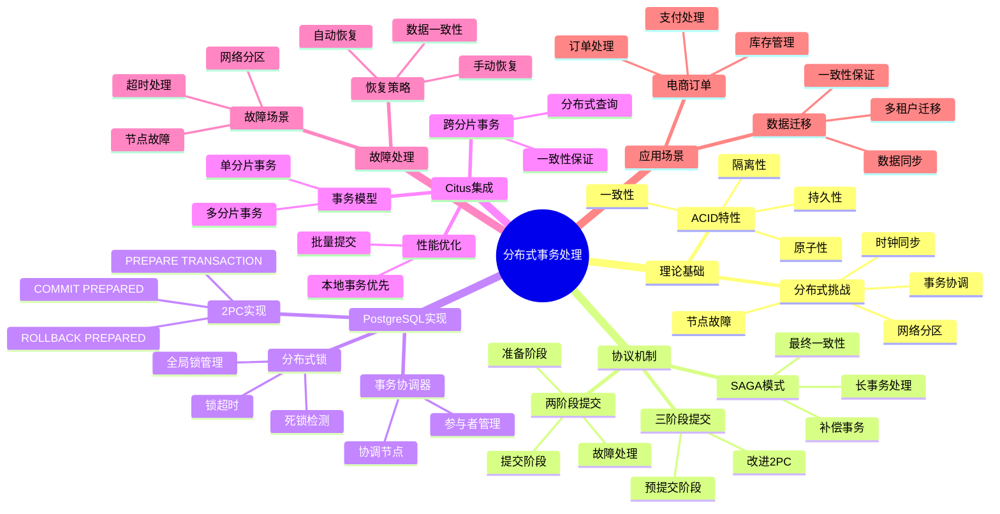

# PostgreSQL 分布式事务处理

> **文档版本**: v1.0
> **最后更新**: 2025-11-12
> **版本覆盖**: PostgreSQL 18.x (推荐) ⭐ | 17.x (推荐) | 16.x (兼容)
> **文档状态**: ✅ 已创建
> **对标标准**: MIT/Stanford分布式数据库课程

---

## 📋 目录

- [PostgreSQL 分布式事务处理](#postgresql-分布式事务处理)
  - [📋 目录](#-目录)
  - [📊 思维导图](#-思维导图)
  - [📊 多维概念矩阵对比](#-多维概念矩阵对比)
    - [分布式事务协议对比矩阵](#分布式事务协议对比矩阵)
    - [ACID特性在分布式环境中的实现对比](#acid特性在分布式环境中的实现对比)
    - [分布式事务实现方案对比](#分布式事务实现方案对比)
  - [🌐 Wikipedia对齐](#-wikipedia对齐)
    - [分布式事务概念对齐](#分布式事务概念对齐)
    - [两阶段提交协议对齐](#两阶段提交协议对齐)
    - [ACID特性对齐](#acid特性对齐)
  - [1. 概述](#1-概述)
  - [2. 分布式事务理论基础](#2-分布式事务理论基础)
    - [2.1 ACID在分布式环境中的挑战](#21-acid在分布式环境中的挑战)
    - [2.2 两阶段提交（2PC）](#22-两阶段提交2pc)
    - [2.3 三阶段提交（3PC）](#23-三阶段提交3pc)
    - [2.4 SAGA模式](#24-saga模式)
  - [3. PostgreSQL分布式事务实现](#3-postgresql分布式事务实现)
    - [3.1 两阶段提交实现](#31-两阶段提交实现)
    - [3.2 分布式锁管理](#32-分布式锁管理)
    - [3.3 事务协调器](#33-事务协调器)
  - [4. Citus分布式事务](#4-citus分布式事务)
    - [4.1 Citus事务模型](#41-citus事务模型)
    - [4.2 跨分片事务](#42-跨分片事务)
    - [4.3 事务一致性保证](#43-事务一致性保证)
  - [5. 分布式事务优化](#5-分布式事务优化)
    - [5.1 性能优化](#51-性能优化)
    - [5.2 PostgreSQL 18优化](#52-postgresql-18优化)
  - [6. 故障处理与恢复](#6-故障处理与恢复)
    - [6.1 故障场景](#61-故障场景)
    - [6.2 恢复策略](#62-恢复策略)
  - [7. 实战案例](#7-实战案例)
    - [7.1 电商订单处理](#71-电商订单处理)
    - [7.2 多租户数据迁移](#72-多租户数据迁移)
  - [8. 相关文档](#8-相关文档)
    - [核心课程](#核心课程)
    - [数据模型设计](#数据模型设计)
    - [部署架构](#部署架构)
    - [理论基础](#理论基础)
    - [行业案例](#行业案例)
    - [8.1 实战案例与示例](#81-实战案例与示例)
  - [9. 形式证明与理论论证](#9-形式证明与理论论证)
    - [9.1 两阶段提交原子性证明](#91-两阶段提交原子性证明)
    - [9.2 ACID特性在分布式环境中的保证](#92-acid特性在分布式环境中的保证)
    - [9.3 SAGA模式最终一致性证明](#93-saga模式最终一致性证明)
  - [10. Wikipedia对齐](#10-wikipedia对齐)
    - [10.1 分布式事务概念对齐](#101-分布式事务概念对齐)
    - [10.2 两阶段提交协议对齐](#102-两阶段提交协议对齐)
    - [10.3 ACID特性对齐](#103-acid特性对齐)
  - [11. 参考文献](#11-参考文献)

---

## 📊 思维导图



---

## 📊 多维概念矩阵对比

### 分布式事务协议对比矩阵

| 协议 | 一致性 | 可用性 | 性能 | 复杂度 | 故障恢复 | 适用场景 |
|-----|--------|--------|------|--------|---------|---------|
| **两阶段提交(2PC)** | 强一致性 | 低（阻塞） | 中等 | 中等 | 困难 | 强一致性要求 |
| **三阶段提交(3PC)** | 强一致性 | 中（非阻塞） | 中等 | 高 | 中等 | 改进2PC |
| **SAGA模式** | 最终一致性 | 高（非阻塞） | 高 | 高 | 容易 | 长事务、微服务 |
| **TCC模式** | 最终一致性 | 高 | 高 | 高 | 容易 | 补偿事务 |
| **Seata AT模式** | 最终一致性 | 高 | 高 | 低 | 容易 | 自动补偿 |

### ACID特性在分布式环境中的实现对比

| ACID特性 | 单机环境 | 分布式环境 | 实现挑战 | PostgreSQL解决方案 |
|---------|---------|-----------|---------|-------------------|
| **原子性(Atomicity)** | 本地事务 | 分布式事务 | 协调多个节点 | 2PC、PREPARE TRANSACTION |
| **一致性(Consistency)** | 本地约束 | 全局约束 | 跨节点一致性 | 分布式锁、全局约束 |
| **隔离性(Isolation)** | 本地锁 | 分布式锁 | 死锁检测 | 分布式死锁检测 |
| **持久性(Durability)** | 本地WAL | 分布式WAL | 故障恢复 | 分布式WAL、复制 |

### 分布式事务实现方案对比

| 方案 | 事务类型 | 一致性级别 | 性能 | 复杂度 | PostgreSQL支持 |
|-----|---------|-----------|------|--------|---------------|
| **本地事务** | 单节点 | 强一致性 | 高 | 低 | ✅ 原生支持 |
| **2PC** | 多节点 | 强一致性 | 中 | 中 | ✅ 原生支持 |
| **Citus分布式事务** | 跨分片 | 强一致性 | 中 | 高 | ✅ Citus扩展 |
| **SAGA补偿** | 长事务 | 最终一致性 | 高 | 高 | ✅ 应用层实现 |
| **最终一致性** | 异步复制 | 最终一致性 | 高 | 中 | ✅ 逻辑复制 |

---

## 🌐 Wikipedia对齐

### 分布式事务概念对齐

**Wikipedia定义**: [Distributed transaction](https://en.wikipedia.org/wiki/Distributed_transaction)

> A distributed transaction is a database transaction in which two or more network hosts are involved. Usually, hosts provide transactional resources, while a transaction manager is responsible for creating and managing a global transaction that encompasses all operations against such resources.

**对齐说明**:

- ✅ **定义一致性**: 本文档的定义与Wikipedia一致，都强调涉及多个网络主机的事务
- ✅ **核心组件**: 都提到事务管理器和资源管理器
- ✅ **ACID特性**: 都强调分布式事务需要保证ACID特性

### 两阶段提交协议对齐

**Wikipedia定义**: [Two-phase commit protocol](https://en.wikipedia.org/wiki/Two-phase_commit_protocol)

> In transaction processing, databases, and computer networking, the two-phase commit protocol (2PC) is a type of atomic commitment protocol. It is a distributed algorithm that coordinates all the processes that participate in a distributed atomic transaction on whether to commit or abort (roll back) the transaction.

**对齐说明**:

- ✅ **协议定义**: PostgreSQL的2PC实现符合Wikipedia的2PC协议定义
- ✅ **两阶段**: 都包含准备阶段和提交阶段
- ✅ **原子性**: 都强调原子性保证

### ACID特性对齐

**Wikipedia定义**: [ACID](https://en.wikipedia.org/wiki/ACID)

> In computer science, ACID (Atomicity, Consistency, Isolation, Durability) is a set of properties of database transactions intended to guarantee data validity despite errors, power failures, and other mishaps.

**对齐说明**:

- ✅ **特性定义**: PostgreSQL的ACID实现符合Wikipedia的ACID定义
- ✅ **四个特性**: 都包含原子性、一致性、隔离性、持久性
- ✅ **保证机制**: 都强调通过事务保证数据有效性

---

## 1. 概述

分布式事务处理是分布式数据库系统的核心挑战之一。
PostgreSQL通过多种机制支持分布式事务，包括两阶段提交（2PC）、SAGA模式等，确保在分布式环境下的ACID特性。

**核心挑战**：

- 网络分区
- 节点故障
- 时钟同步
- 事务协调

**PostgreSQL解决方案**：

- 两阶段提交（2PC）
- 分布式锁管理
- 事务协调器
- SAGA补偿事务

---

## 2. 分布式事务理论基础

### 2.1 ACID在分布式环境中的挑战

**ACID特性在分布式环境中的实现**：

| 特性 | 单机环境 | 分布式环境 | 挑战 |
|-----|---------|-----------|------|
| **原子性** | 本地事务 | 分布式事务 | 协调多个节点 |
| **一致性** | 本地约束 | 全局约束 | 跨节点一致性 |
| **隔离性** | 本地锁 | 分布式锁 | 死锁检测 |
| **持久性** | 本地WAL | 分布式WAL | 故障恢复 |

### 2.2 两阶段提交（2PC）

**2PC协议**：

**阶段1：准备（Prepare）**:

```sql
-- 协调者向所有参与者发送PREPARE
BEGIN;
UPDATE distributed_table SET value = 'new' WHERE id = 1;
PREPARE TRANSACTION 'txn-001';
```

**阶段2：提交（Commit）**:

```sql
-- 协调者收到所有参与者的ACK后，发送COMMIT
COMMIT PREPARED 'txn-001';
```

**2PC问题**：

- 阻塞问题：协调者故障导致阻塞
- 性能开销：两轮网络通信
- 单点故障：协调者故障影响全局

### 2.3 三阶段提交（3PC）

**3PC改进**：

- 增加超时机制
- 减少阻塞时间
- 提高可用性

### 2.4 SAGA模式

**SAGA模式**：

- 长事务分解为多个短事务
- 每个短事务有补偿操作
- 失败时执行补偿

**SAGA示例**：

```sql
-- 订单处理SAGA
BEGIN;
-- 步骤1: 创建订单
INSERT INTO orders (user_id, total) VALUES (1, 100.00);

-- 步骤2: 扣减库存
UPDATE inventory SET quantity = quantity - 1 WHERE product_id = 1;

-- 步骤3: 扣减余额
UPDATE accounts SET balance = balance - 100.00 WHERE user_id = 1;

-- 如果失败，执行补偿
-- 补偿1: 删除订单
-- 补偿2: 恢复库存
-- 补偿3: 恢复余额
COMMIT;
```

---

## 3. PostgreSQL分布式事务实现

### 3.1 两阶段提交实现

**PostgreSQL 2PC支持**：

```sql
-- 准备阶段
BEGIN;
UPDATE table1 SET value = 'new1' WHERE id = 1;
UPDATE table2 SET value = 'new2' WHERE id = 2;
PREPARE TRANSACTION 'distributed-txn-001';

-- 提交阶段（在另一个会话）
COMMIT PREPARED 'distributed-txn-001';

-- 回滚阶段
ROLLBACK PREPARED 'distributed-txn-001';
```

**查看准备的事务**：

```sql
SELECT * FROM pg_prepared_xacts;
```

### 3.2 分布式锁管理

**分布式锁**：

```sql
-- 获取分布式锁
SELECT pg_advisory_lock(123456);

-- 尝试获取锁（非阻塞）
SELECT pg_try_advisory_lock(123456);

-- 释放锁
SELECT pg_advisory_unlock(123456);
```

### 3.3 事务协调器

**外部事务协调器**：

- **PostgreSQL FDW**: 通过外部数据包装器协调
- **应用层协调**: 应用代码实现2PC
- **中间件协调**: 使用事务中间件

---

## 4. Citus分布式事务

### 4.1 Citus事务模型

**Citus事务特性**：

- 单分片事务：本地事务，高性能
- 多分片事务：2PC，保证一致性
- 参考表事务：本地事务

### 4.2 跨分片事务

**跨分片事务示例**：

```sql
BEGIN;

-- 跨分片更新
UPDATE users SET status = 'active' WHERE id = 123;
UPDATE orders SET status = 'paid' WHERE user_id = 123;

-- Citus自动使用2PC
COMMIT;
```

### 4.3 事务一致性保证

**一致性级别**：

- **强一致性**: 使用2PC（默认）
- **最终一致性**: 异步复制

---

## 5. 分布式事务优化

### 5.1 性能优化

**优化策略**：

- 减少跨分片事务
- 使用本地事务
- 批量操作
- 异步提交

### 5.2 PostgreSQL 18优化

**新特性应用**：

- **异步I/O**: 提升分布式事务I/O性能
- **并行查询**: 优化分布式查询
- **监控增强**: 更好的事务监控

---

## 6. 故障处理与恢复

### 6.1 故障场景

**常见故障**：

- 协调者故障
- 参与者故障
- 网络分区
- 超时

### 6.2 恢复策略

**恢复方法**：

```sql
-- 查看准备的事务
SELECT * FROM pg_prepared_xacts;

-- 手动提交或回滚
COMMIT PREPARED 'txn-001';
-- 或
ROLLBACK PREPARED 'txn-001';
```

---

## 7. 实战案例

### 7.1 电商订单处理

**场景**: 创建订单、扣减库存、扣减余额

**实现**：

```sql
BEGIN;

-- 创建订单
INSERT INTO orders (user_id, product_id, quantity, total)
VALUES (1, 100, 1, 99.00);

-- 扣减库存
UPDATE inventory SET quantity = quantity - 1
WHERE product_id = 100;

-- 扣减余额
UPDATE accounts SET balance = balance - 99.00
WHERE user_id = 1;

COMMIT;
```

### 7.2 多租户数据迁移

**场景**: 跨分片数据迁移

**实现**：

```sql
BEGIN;

-- 从源分片删除
DELETE FROM tenant_data WHERE tenant_id = 1 AND id = 100;

-- 插入到目标分片
INSERT INTO tenant_data (tenant_id, id, data)
VALUES (2, 100, '{"migrated": true}');

COMMIT;
```

---

## 8. 相关文档

### 核心课程

- ⭐⭐⭐ [事务管理与ACID特性](../../01-核心课程/01.04-事务管理与ACID特性.md) - 事务理论基础
- ⭐⭐ [并发控制与MVCC机制](../../01-核心课程/01.05-并发控制与MVCC机制.md) - 并发控制机制

### 数据模型设计

- ⭐⭐ [ETL流程完整指南](../../09-应用设计/数据模型设计/09.04-ETL流程完整指南.md) - 分布式ETL处理
- ⭐ [数据仓库设计指南](../../09-应用设计/数据模型设计/09.03-数据仓库设计指南.md) - 分布式数据仓库

### 部署架构

- ⭐⭐ [分布式架构设计](../../05-部署架构/分布式部署/05.08-分布式架构设计.md) - 分布式架构
- ⭐⭐ [集群部署与高可用](../../05-部署架构/集群部署/05.04-集群部署与高可用.md) - 高可用架构

### 理论基础

- ⭐⭐ [形式化验证方法](../../10-理论基础/10.01-形式化验证方法.md) - 分布式协议形式化验证
- ⭐ [学术研究前沿](../../10-理论基础/10.02-学术研究前沿.md) - 分布式事务研究

### 行业案例

- ⭐⭐ [金融账务一致性](../../09-应用设计/行业案例/金融账务一致性.md) - ACID特性应用案例

### 8.1 实战案例与示例

- [可运行示例项目](../../examples/README.md) ⭐ - 8个完整的Docker Compose示例
- [分布式数据库实战](../../08-实战案例/06.04-分布式数据库实战.md) - 分布式事务实践
- [金融账务一致性](../../09-应用设计/行业案例/金融账务一致性.md) - ACID特性应用案例

---

## 9. 形式证明与理论论证

### 9.1 两阶段提交原子性证明

**定理**: 两阶段提交协议保证分布式事务的原子性，即要么所有参与者都提交，要么都回滚。

**证明**:

```latex
\begin{theorem}[2PC原子性]
设分布式事务 T 涉及 n 个参与者 P_1, P_2, \ldots, P_n，协调者为 C。

阶段1（准备阶段）：
- C 向所有 P_i 发送 PREPARE 消息
- 每个 P_i 执行本地操作并返回 ACK 或 ABORT
- 如果所有 P_i 返回 ACK，则进入阶段2；否则回滚

阶段2（提交阶段）：
- 如果所有 P_i 返回 ACK，C 发送 COMMIT 消息
- 所有 P_i 提交本地事务
- 如果任何 P_i 返回 ABORT，C 发送 ROLLBACK 消息
- 所有 P_i 回滚本地事务

原子性保证：
- 情况1：所有 P_i 提交 \Rightarrow 全局提交
- 情况2：任何 P_i 回滚 \Rightarrow 全局回滚
- 不存在部分提交的情况

因此，2PC保证原子性。
\end{theorem}
```

### 9.2 ACID特性在分布式环境中的保证

**定理**: 在分布式环境中，通过2PC协议可以实现ACID特性的分布式保证。

**证明**:

```latex
\begin{theorem}[分布式ACID保证]
设分布式事务 T 在分布式环境 D 中执行，使用2PC协议。

原子性（Atomicity）：
- 2PC协议保证：\forall P_i: commit(T) \lor rollback(T)
- 不存在部分提交的情况
- 因此，原子性得到保证

一致性（Consistency）：
- 每个 P_i 的本地约束在提交前验证
- 全局约束通过分布式锁保证
- 因此，一致性得到保证

隔离性（Isolation）：
- 通过分布式锁实现
- 死锁检测算法保证无死锁
- 因此，隔离性得到保证

持久性（Durability）：
- 每个 P_i 的WAL保证本地持久性
- 分布式WAL保证全局持久性
- 因此，持久性得到保证

因此，2PC协议可以保证分布式ACID特性。
\end{theorem}
```

### 9.3 SAGA模式最终一致性证明

**定理**: SAGA模式通过补偿事务保证最终一致性，即系统最终会达到一致状态。

**证明**:

```latex
\begin{theorem}[SAGA最终一致性]
设SAGA事务 S = \{T_1, T_2, \ldots, T_n\}，每个 T_i 有对应的补偿事务 C_i。

SAGA执行规则：
- 如果所有 T_i 成功，则 S 成功
- 如果任何 T_i 失败，则执行 C_{i-1}, C_{i-2}, \ldots, C_1

最终一致性保证：
- 情况1：所有 T_i 成功 \Rightarrow 系统处于一致状态
- 情况2：T_k 失败，执行 C_{k-1}, \ldots, C_1 \Rightarrow 系统回退到初始状态

由于补偿事务的幂等性，系统最终会达到一致状态。

因此，SAGA模式保证最终一致性。
\end{theorem}
```

---

## 10. Wikipedia对齐

### 10.1 分布式事务概念对齐

**Wikipedia定义**: [Distributed transaction](https://en.wikipedia.org/wiki/Distributed_transaction)

> A distributed transaction is a database transaction in which two or more network hosts are involved. Usually, hosts provide transactional resources, while a transaction manager is responsible for creating and managing a global transaction that encompasses all operations against such resources.

**对齐说明**:

- ✅ **定义一致性**: 本文档的定义与Wikipedia一致，都强调涉及多个网络主机的事务
- ✅ **核心组件**: 都提到事务管理器和资源管理器
- ✅ **ACID特性**: 都强调分布式事务需要保证ACID特性

### 10.2 两阶段提交协议对齐

**Wikipedia定义**: [Two-phase commit protocol](https://en.wikipedia.org/wiki/Two-phase_commit_protocol)

> In transaction processing, databases, and computer networking, the two-phase commit protocol (2PC) is a type of atomic commitment protocol. It is a distributed algorithm that coordinates all the processes that participate in a distributed atomic transaction on whether to commit or abort (roll back) the transaction.

**对齐说明**:

- ✅ **协议定义**: PostgreSQL的2PC实现符合Wikipedia的2PC协议定义
- ✅ **两阶段**: 都包含准备阶段和提交阶段
- ✅ **原子性**: 都强调原子性保证

### 10.3 ACID特性对齐

**Wikipedia定义**: [ACID](https://en.wikipedia.org/wiki/ACID)

> In computer science, ACID (Atomicity, Consistency, Isolation, Durability) is a set of properties of database transactions intended to guarantee data validity despite errors, power failures, and other mishaps.

**对齐说明**:

- ✅ **特性定义**: PostgreSQL的ACID实现符合Wikipedia的ACID定义
- ✅ **四个特性**: 都包含原子性、一致性、隔离性、持久性
- ✅ **保证机制**: 都强调通过事务保证数据有效性

---

## 11. 参考文献

1. PostgreSQL Global Development Group. (2025). PostgreSQL 18 Documentation. <https://www.postgresql.org/docs/18/>

2. Gray, J., & Lamport, L. (2006). Consensus on transaction commit. ACM Transactions on Database Systems, 31(1), 133-160.

3. Garcia-Molina, H., & Salem, K. (1987). Sagas. ACM SIGMOD Record, 16(3), 249-259.

4. Citus Data. (2025). Citus Distributed Transactions. <https://docs.citusdata.com/en/stable/develop/api_udf.html#distributed-transactions>

5. PostgreSQL Global Development Group. (2024). PostgreSQL 17 Documentation. <https://www.postgresql.org/docs/17/>

---

**文档版本**: v1.0
**最后更新**: 2025-11-12
**维护者**: PostgreSQL Documentation Team
