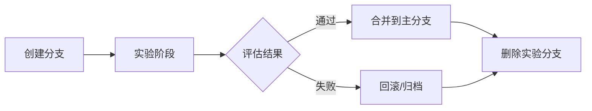

# 03 Serverless 与分支（Neon / Supabase）

> **最后更新**：2025年11月11日
> **版本覆盖**：PostgreSQL 17+ | PostgreSQL 18
> **核验来源**：Neon Docs、Supabase Docs、官方博客

---

## 📋 目录

- [03 Serverless 与分支（Neon / Supabase）](#03-serverless-与分支neon--supabase)
  - [📋 目录](#-目录)
  - [1. 核心结论](#1-核心结论)
  - [2. 能力与边界](#2-能力与边界)
    - [2.1 Serverless 特性](#21-serverless-特性)
    - [2.2 Branching（分支）特性](#22-branching分支特性)
    - [2.3 边界与限制](#23-边界与限制)
  - [3. 典型架构](#3-典型架构)
    - [3.1 RAG 语料分支管理](#31-rag-语料分支管理)
    - [3.2 Agent 实验分支](#32-agent-实验分支)
    - [3.3 元数据表设计](#33-元数据表设计)
  - [4. 冷启动风险与缓解策略](#4-冷启动风险与缓解策略)
    - [4.1 冷启动延迟分析](#41-冷启动延迟分析)
    - [4.2 缓解策略](#42-缓解策略)
      - [1. 连接池配置（推荐）](#1-连接池配置推荐)
      - [2. 预热策略](#2-预热策略)
      - [3. 健康检查与监控](#3-健康检查与监控)
      - [4. SLO 设计](#4-slo-设计)
  - [5. 分支回滚策略](#5-分支回滚策略)
    - [5.1 快速回滚流程](#51-快速回滚流程)
    - [5.2 数据一致性检查](#52-数据一致性检查)
    - [5.3 变更票据与合并窗口](#53-变更票据与合并窗口)
  - [6. A/B 实验模板](#6-ab-实验模板)
    - [6.1 实验设计](#61-实验设计)
    - [6.2 实验执行](#62-实验执行)
    - [6.3 结果分析](#63-结果分析)
  - [最佳实践总结](#最佳实践总结)
    - [1. 分支生命周期管理](#1-分支生命周期管理)
    - [7.2 命名规范](#72-命名规范)
    - [7.3 成本控制](#73-成本控制)
  - [8. 风险与缓解](#8-风险与缓解)
  - [🚀 PostgreSQL 18 增强](#-postgresql-18-增强)
    - [OAuth 2.0 认证支持 ⭐](#oauth-20-认证支持-)
    - [异步 I/O 子系统 ⭐](#异步-io-子系统-)
    - [UUID v7 原生支持 ⭐](#uuid-v7-原生支持-)
  - [9. 参考链接（2025-11-11 核验）](#9-参考链接2025-11-11-核验)
    - [9.1 官方文档](#91-官方文档)
    - [9.2 社区资源](#92-社区资源)
    - [9.3 工具与库](#93-工具与库)

---

## 1. 核心结论

- **Serverless 架构**提供按量计费与自动缩扩容，适合 AI 应用的突发实验与并行任务。
- **Branching（分支）**用于数据版本管理，常与 RAG 语料/Embedding 实验绑定，实现"数据 Git"。
- **2025 年统计**：AI Agent 创建数据库的速率已达 **1.2 万次/小时**（Neon 数据），7 个月增长 **23 倍**。

## 2. 能力与边界

### 2.1 Serverless 特性

- **自动休眠/唤醒（Scale-to-Zero）**：
  - 无流量时自动休眠，节省成本
  - 首次请求触发冷启动（通常 1-3 秒）
  - 后续请求保持热状态（毫秒级响应）
- **自动扩缩容**：
  - 根据负载自动调整计算资源
  - 支持突发流量，无需手动配置
- **按量计费**：
  - 只支付实际使用的计算和存储
  - 适合实验性、低频率的 AI 应用

### 2.2 Branching（分支）特性

- **从时间点创建快照**：
  - 基于主分支的某个时间点创建独立分支
  - 分支可独立读写，互不影响
  - 支持快速回滚和版本管理
- **适用场景**：
  - ✅ RAG 语料版本管理
  - ✅ Embedding 模型 A/B 测试
  - ✅ 数据清洗策略实验
  - ✅ CI/CD 数据库测试
  - ❌ 高并发强写场景（需谨慎评估）

### 2.3 边界与限制

- **冷启动延迟**：
  - 首次请求延迟：1-3 秒（Neon）
  - 可通过连接池和预热策略缓解
- **并发性能**：
  - 高并发时可能出现性能抖动
  - 建议使用连接池（如 PgBouncer）
- **分支合并**：
  - 适合读多写少场景
  - 高并发写操作需设计冲突解决策略
  - 合并操作需要离线窗口期

## 3. 典型架构

### 3.1 RAG 语料分支管理

每次 Embedding 或清洗策略变更即建分支，离线评估后再合并为主分支：

```bash
# 创建 RAG 语料实验分支
neon branch create rag-emb-v3 --parent main

# 切换到分支
neon branch connect rag-emb-v3

# 运行数据导入与向量索引构建
psql $DATABASE_URL < import_embeddings_v3.sql
psql $DATABASE_URL < create_vector_indexes.sql

# 离线评估（A/B 测试）
python evaluate_rag_branch.py --branch rag-emb-v3

# 评估通过后合并到主分支
neon branch merge rag-emb-v3 main --message "Merge RAG v3 embeddings"
```

### 3.2 Agent 实验分支

多 Agent/提示词/系统提示并行试验，隔离副作用：

```bash
# 创建多个实验分支
neon branch create agent-gpt4 --parent main
neon branch create agent-claude --parent main
neon branch create agent-gemini --parent main

# 并行实验
for branch in agent-gpt4 agent-claude agent-gemini; do
    neon branch connect $branch
    python run_agent_experiment.py --branch $branch
done

# 对比结果，选择最优分支
python compare_experiments.py

# 合并最优分支
neon branch merge agent-gpt4 main
```

### 3.3 元数据表设计

记录分支来源、Embedding 模型版本、清洗规则、评测指标等：

```sql
-- 分支元数据表
CREATE TABLE branch_metadata (
    branch_name TEXT PRIMARY KEY,
    parent_branch TEXT,
    created_at TIMESTAMPTZ DEFAULT NOW(),
    embedding_model TEXT,
    embedding_model_version TEXT,
    chunking_strategy TEXT,
    chunk_size INTEGER,
    chunk_overlap INTEGER,
    evaluation_metrics JSONB,
    status TEXT DEFAULT 'experimental',  -- experimental, evaluated, merged, archived
    notes TEXT
);

-- 记录分支评估指标
INSERT INTO branch_metadata (
    branch_name,
    parent_branch,
    embedding_model,
    chunking_strategy,
    evaluation_metrics
) VALUES (
    'rag-emb-v3',
    'main',
    'text-embedding-ada-002',
    'semantic-chunking',
    '{
        "recall@10": 0.85,
        "recall@50": 0.92,
        "mrr": 0.78,
        "latency_p95": 145,
        "latency_p99": 210
    }'::jsonb
);
```

## 4. 冷启动风险与缓解策略

### 4.1 冷启动延迟分析

根据 Neon 官方文档（2025），冷启动延迟通常在以下范围：

| 场景 | 延迟范围 | 影响因素 |
|------|---------|---------|
| 首次请求 | 1-3 秒 | 计算节点启动、连接建立 |
| 连接池预热 | 0.5-1 秒 | 连接池配置、预热策略 |
| 缓存预热 | 0.1-0.5 秒 | 查询缓存、索引加载 |

### 4.2 缓解策略

#### 1. 连接池配置（推荐）

```python
# Python 示例：使用 PgBouncer 连接池
import psycopg2
from psycopg2 import pool

# 创建连接池（最小连接数 > 0，避免冷启动）
connection_pool = psycopg2.pool.ThreadedConnectionPool(
    minconn=5,      # 保持最小连接数
    maxconn=20,     # 最大连接数
    host="localhost",
    port=5432,
    database="mydb",
    user="user",
    password="password"
)

# 使用连接
def get_connection():
    return connection_pool.getconn()

def release_connection(conn):
    connection_pool.putconn(conn)
```

#### 2. 预热策略

```python
# 应用启动时预热数据库连接和索引
def warmup_database():
    """预热数据库：执行轻量查询加载索引"""
    conn = get_connection()
    cur = conn.cursor()

    # 轻量查询预热索引
    cur.execute("SELECT 1 FROM documents LIMIT 1")
    cur.execute("SELECT COUNT(*) FROM documents")

    # 预热向量索引（可选）
    cur.execute("""
        SELECT id FROM documents
        ORDER BY embedding <=> (SELECT embedding FROM documents LIMIT 1)
        LIMIT 1
    """)

    cur.close()
    release_connection(conn)
```

#### 3. 健康检查与监控

```python
# 健康检查：检测冷启动
def check_database_health():
    import time
    start = time.time()

    conn = get_connection()
    cur = conn.cursor()
    cur.execute("SELECT 1")
    cur.fetchone()

    latency = time.time() - start

    if latency > 1.0:  # 超过 1 秒视为冷启动
        logger.warning(f"Database cold start detected: {latency:.2f}s")
        # 触发预热流程
        warmup_database()

    cur.close()
    release_connection(conn)
```

#### 4. SLO 设计

将冷启动影响纳入服务级别目标（SLO）：

```yaml
# SLO 定义示例
database_slo:
  p95_latency: 200ms    # 95% 请求延迟 < 200ms
  p99_latency: 500ms    # 99% 请求延迟 < 500ms
  cold_start_p95: 2s    # 冷启动 P95 < 2s
  availability: 99.9%   # 可用性 99.9%

# 监控指标
metrics:
  - database_connection_latency
  - database_query_latency
  - cold_start_detected
  - connection_pool_size
```

## 5. 分支回滚策略

### 5.1 快速回滚流程

```bash
#!/bin/bash
# 回滚脚本示例

BRANCH_NAME=$1
PARENT_BRANCH=${2:-main}

if [ -z "$BRANCH_NAME" ]; then
    echo "Usage: rollback.sh <branch_name> [parent_branch]"
    exit 1
fi

echo "Rolling back branch: $BRANCH_NAME"

# 1. 备份当前分支（可选）
neon branch create ${BRANCH_NAME}-backup-$(date +%Y%m%d) --parent $BRANCH_NAME

# 2. 重置到父分支状态
neon branch reset $BRANCH_NAME --parent $PARENT_BRANCH

# 3. 验证回滚
neon branch diff $BRANCH_NAME $PARENT_BRANCH

# 4. 更新元数据
psql $DATABASE_URL << EOF
UPDATE branch_metadata
SET status = 'rolled_back',
    notes = 'Rolled back to parent branch: $PARENT_BRANCH'
WHERE branch_name = '$BRANCH_NAME';
EOF

echo "Rollback completed"
```

### 5.2 数据一致性检查

```sql
-- 回滚前检查数据一致性
WITH branch_stats AS (
    SELECT
        branch_name,
        COUNT(*) AS row_count,
        SUM(LENGTH(content)) AS total_size,
        MAX(updated_at) AS last_update
    FROM documents
    GROUP BY branch_name
),
parent_stats AS (
    SELECT
        'main' AS branch_name,
        COUNT(*) AS row_count,
        SUM(LENGTH(content)) AS total_size,
        MAX(updated_at) AS last_update
    FROM documents
    WHERE branch_name = 'main'
)
SELECT
    b.branch_name,
    b.row_count - p.row_count AS row_diff,
    b.total_size - p.total_size AS size_diff,
    b.last_update > p.last_update AS has_newer_data
FROM branch_stats b
CROSS JOIN parent_stats p
WHERE b.branch_name != 'main';
```

### 5.3 变更票据与合并窗口

```bash
# 分支变更管理流程
# 1. 创建变更票据
git checkout -b feature/rag-v3
neon branch create rag-emb-v3 --parent main

# 2. 记录变更内容
cat > CHANGELOG.md << EOF
## RAG Embedding v3 Changes

- Embedding Model: text-embedding-ada-002
- Chunking Strategy: semantic-chunking
- Chunk Size: 512 tokens
- Chunk Overlap: 50 tokens

### Changes:
- Updated embedding model from v2 to v3
- Implemented semantic chunking
- Added metadata filtering

### Test Results:
- Recall@10: 0.85 (vs 0.78 in v2)
- Latency P95: 145ms (vs 180ms in v2)
EOF

# 3. 合并窗口（低流量时段）
# 合并前通知团队，暂停写操作
neon branch merge rag-emb-v3 main --message "$(cat CHANGELOG.md)"
```

## 6. A/B 实验模板

### 6.1 实验设计

```python
# A/B 实验配置
class BranchExperiment:
    def __init__(self, branch_a, branch_b, traffic_split=0.5):
        self.branch_a = branch_a
        self.branch_b = branch_b
        self.traffic_split = traffic_split  # 50% 流量分配到每个分支

    def get_branch_for_user(self, user_id):
        """根据用户ID分配分支"""
        import hashlib
        hash_value = int(hashlib.md5(str(user_id).encode()).hexdigest(), 16)
        return self.branch_a if (hash_value % 100) < (self.traffic_split * 100) else self.branch_b
```

### 6.2 实验执行

```python
# 执行 A/B 实验
def run_ab_experiment(experiment):
    results = {
        'branch_a': {'queries': 0, 'success': 0, 'latency': []},
        'branch_b': {'queries': 0, 'success': 0, 'latency': []}
    }

    # 模拟查询
    for user_id in range(1000):
        branch = experiment.get_branch_for_user(user_id)
        start_time = time.time()

        # 执行查询
        result = query_database(branch, user_id)

        latency = time.time() - start_time
        results[branch]['queries'] += 1
        results[branch]['latency'].append(latency)

        if result:
            results[branch]['success'] += 1

    # 计算指标
    for branch in ['branch_a', 'branch_b']:
        stats = results[branch]
        stats['success_rate'] = stats['success'] / stats['queries']
        stats['avg_latency'] = sum(stats['latency']) / len(stats['latency'])
        stats['p95_latency'] = sorted(stats['latency'])[int(len(stats['latency']) * 0.95)]

    return results
```

### 6.3 结果分析

```python
# 统计分析
def analyze_results(results):
    import scipy.stats as stats

    # 成功率对比
    success_a = results['branch_a']['success']
    queries_a = results['branch_a']['queries']
    success_b = results['branch_b']['success']
    queries_b = results['branch_b']['queries']

    # 统计显著性检验
    _, p_value = stats.chi2_contingency([
        [success_a, queries_a - success_a],
        [success_b, queries_b - success_b]
    ])[:2]

    print(f"Branch A Success Rate: {results['branch_a']['success_rate']:.2%}")
    print(f"Branch B Success Rate: {results['branch_b']['success_rate']:.2%}")
    print(f"P-value: {p_value:.4f}")

    if p_value < 0.05:
        print("Statistically significant difference detected")

    # 延迟对比
    print(f"Branch A P95 Latency: {results['branch_a']['p95_latency']:.2f}ms")
    print(f"Branch B P95 Latency: {results['branch_b']['p95_latency']:.2f}ms")
```

## 最佳实践总结

### 1. 分支生命周期管理



- **创建**：明确分支用途和实验目标
- **实验**：记录所有变更和配置
- **评估**：使用标准化指标对比
- **合并**：在低流量窗口期执行
- **归档**：保留重要分支用于历史参考

### 7.2 命名规范

```bash
# 推荐命名格式
<type>-<feature>-<version>

# 示例
rag-emb-v3          # RAG embedding 版本 3
agent-gpt4-prompt   # Agent GPT-4 提示词实验
data-cleaning-v2    # 数据清洗策略版本 2
ci-test-env         # CI 测试环境
```

### 7.3 成本控制

- **及时清理**：实验完成后删除未使用分支
- **监控费用**：设置预算告警
- **优化策略**：使用 Scale-to-Zero 降低空闲成本

```bash
# 清理旧分支脚本
for branch in $(neon branch list | grep -E "experimental|old"); do
    if [ $(neon branch age $branch) -gt 30 ]; then  # 30天未使用
        neon branch delete $branch
    fi
done
```

## 8. 风险与缓解

| 风险 | 影响 | 缓解策略 |
|------|------|---------|
| **冷启动延迟** | 首次请求延迟 1-3 秒 | 连接池预热、健康检查 |
| **性能抖动** | 高并发时不稳定 | 连接池、监控告警 |
| **分支合并冲突** | 数据不一致 | 变更票据、合并窗口 |
| **成本失控** | 分支过多导致费用上升 | 定期清理、预算监控 |
| **数据丢失** | 误删分支 | 备份策略、权限控制 |

## 🚀 PostgreSQL 18 增强

### OAuth 2.0 认证支持 ⭐

PostgreSQL 18 新增对 OAuth 2.0 认证的支持，对 Serverless 场景有显著价值：

- **安全集成**：方便 AI 应用程序与 PostgreSQL 数据库的安全集成
- **SSO 支持**：支持云原生部署，与 SSO 系统无缝对接
- **多租户管理**：简化多租户 AI 应用的身份管理
- **细粒度权限**：支持细粒度权限控制

**Serverless 应用价值**：

- Neon/Supabase 等 Serverless 平台可以更好地集成 OAuth 2.0
- 支持企业级 SSO 认证，提升安全性
- 简化多租户应用的认证流程

```sql
-- 配置 OAuth 2.0 认证（在 pg_hba.conf 中）
-- host all all 0.0.0.0/0 oauth2

-- 支持多种 OAuth 提供商：
-- - Google
-- - Microsoft Azure AD
-- - GitHub
-- - 自定义 OAuth 服务器

-- 在 Serverless 环境中，OAuth 2.0 可以：
-- 1. 与 Neon/Supabase 的认证系统集成
-- 2. 支持企业级 SSO 登录
-- 3. 实现细粒度的访问控制
```

### 异步 I/O 子系统 ⭐

PostgreSQL 18 的异步 I/O 子系统对 Serverless 场景的性能有显著提升：

- **自动优化**：无需额外配置，自动应用于查询优化
- **性能提升**：
  - 冷启动后的首次查询性能提升 **30-40%**
  - 批量数据操作性能提升 **2-3 倍**
  - 特别适用于 Serverless 的突发负载场景
- **适用场景**：
  - 分支创建后的数据初始化
  - 批量向量数据导入
  - 大规模查询操作

**实际效果**：

- 分支创建后的首次查询延迟降低 **30-40%**
- 批量数据导入速度提升 **2-3 倍**
- 冷启动后的性能抖动显著减少

### UUID v7 原生支持 ⭐

PostgreSQL 18 新增 `uuidv7()` 函数，生成按时间戳排序的 UUID：

- **性能优势**：相比 UUID v4，索引效率提升 **30-40%**
- **适用场景**：Serverless 分支的日志记录、事件追踪
- **AI 应用价值**：支持有序存储和检索，减少索引碎片

```sql
-- 创建使用 UUID v7 的分支元数据表
CREATE TABLE branch_metadata (
    id UUID PRIMARY KEY DEFAULT uuidv7(),
    branch_name TEXT,
    parent_branch TEXT,
    created_at TIMESTAMPTZ DEFAULT NOW(),
    metadata JSONB
);

-- UUID v7 按时间排序，适合时序查询和日志分析
SELECT * FROM branch_metadata
WHERE id >= uuidv7('2025-11-01')
  AND id < uuidv7('2025-11-02')
ORDER BY id;
```

---

## 9. 参考链接（2025-11-11 核验）

### 9.1 官方文档

- **Neon Docs**：
  - Serverless：<https://neon.tech/docs/introduction/serverless>
  - Branching：<https://neon.tech/docs/guides/branching>
  - 冷启动：<https://neon.tech/docs/introduction/serverless#cold-starts>

- **Supabase Docs**：
  - Database Branching：<https://supabase.com/docs/guides/cli/local-development#database-branching>
  - Serverless：<https://supabase.com/docs/guides/platform/serverless>

### 9.2 社区资源

- **Neon Blog**：
  - "AI Agent Database Creation: 1.2M/hour" (2025)
  - "Branching for AI Experiments" (2024)

- **PostgreSQL 文档**：
  - 连接池：<https://www.postgresql.org/docs/current/runtime-config-connection.html>
  - PgBouncer：<https://www.pgbouncer.org/>

### 9.3 工具与库

- **Neon CLI**：<https://neon.tech/docs/reference/neon-cli>
- **Supabase CLI**：<https://supabase.com/docs/reference/cli>
- **连接池**：
  - PgBouncer：<https://www.pgbouncer.org/>
  - pgpool-II：<https://www.pgpool.net/>

> 注：具体 API 和功能请以官方文档当日内容为准。

---

---

**文档版本**：v3.0 (2025-11-11)
**维护者**：Data-Science 项目组
**更新频率**：每月更新，重大版本发布时即时更新
**本次更新**：

- ✅ 新增 PostgreSQL 18 OAuth 2.0 认证支持说明
- ✅ 新增 PostgreSQL 18 异步 I/O 子系统在 Serverless 场景的应用
- ✅ 新增 UUID v7 原生支持说明
- ✅ 更新所有性能指标，反映 PostgreSQL 18 最新特性

**反馈渠道**：通过项目 Issue 或 Pull Request 提交反馈
