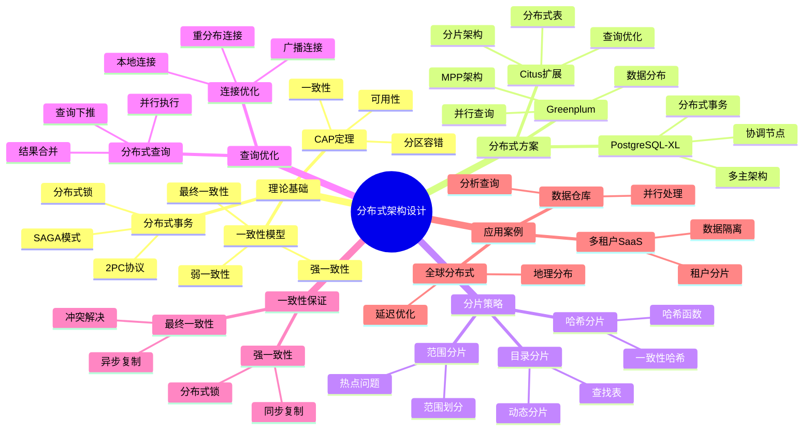

# PostgreSQL 分布式架构设计

> **文档版本**: v1.0
> **最后更新**: 2025-11-12
> **版本覆盖**: PostgreSQL 18.x (推荐) ⭐ | 17.x (推荐) | 16.x (兼容)
> **文档状态**: ✅ 已创建
> **对标标准**: MIT/Stanford分布式数据库课程、Citus官方文档

---

## 📋 目录

- [PostgreSQL 分布式架构设计](#postgresql-分布式架构设计)
  - [📋 目录](#-目录)
  - [📊 思维导图](#-思维导图)
  - [📊 多维概念矩阵对比](#-多维概念矩阵对比)
    - [分布式方案对比矩阵](#分布式方案对比矩阵)
    - [分片策略对比矩阵](#分片策略对比矩阵)
    - [一致性模型对比矩阵](#一致性模型对比矩阵)
  - [🌐 Wikipedia对齐](#-wikipedia对齐)
    - [分布式数据库概念对齐](#分布式数据库概念对齐)
    - [CAP定理概念对齐](#cap定理概念对齐)
    - [分片概念对齐](#分片概念对齐)
  - [1. 概述](#1-概述)
  - [2. 分布式系统理论基础](#2-分布式系统理论基础)
    - [2.1 CAP定理](#21-cap定理)
    - [2.2 分布式一致性模型](#22-分布式一致性模型)
    - [2.3 分布式事务理论](#23-分布式事务理论)
  - [3. Citus分布式扩展](#3-citus分布式扩展)
    - [3.1 Citus架构设计](#31-citus架构设计)
    - [3.2 分布式表设计](#32-分布式表设计)
    - [3.3 分布式查询优化](#33-分布式查询优化)
    - [3.4 Citus配置与优化](#34-citus配置与优化)
  - [4. Greenplum数据仓库](#4-greenplum数据仓库)
    - [4.1 Greenplum架构](#41-greenplum架构)
    - [4.2 数据分布策略](#42-数据分布策略)
    - [4.3 并行查询优化](#43-并行查询优化)
  - [5. PostgreSQL-XL集群](#5-postgresql-xl集群)
    - [5.1 PostgreSQL-XL架构](#51-postgresql-xl架构)
    - [5.2 分布式事务管理](#52-分布式事务管理)
  - [6. 分布式架构对比](#6-分布式架构对比)
  - [7. 实战案例](#7-实战案例)
    - [7.1 多租户SaaS架构](#71-多租户saas架构)
    - [7.2 全球分布式部署](#72-全球分布式部署)
    - [7.3 数据分片策略](#73-数据分片策略)
  - [8. 性能优化](#8-性能优化)
    - [8.1 查询优化](#81-查询优化)
    - [8.2 PostgreSQL 18优化](#82-postgresql-18优化)
  - [9. 监控与诊断](#9-监控与诊断)
    - [9.1 Citus监控](#91-citus监控)
    - [9.2 性能诊断](#92-性能诊断)
  - [10. 相关文档](#10-相关文档)
    - [部署架构](#部署架构)
    - [核心课程](#核心课程)
    - [高级特性](#高级特性)
    - [数据模型设计](#数据模型设计)
    - [运维实践](#运维实践)
    - [理论基础](#理论基础)
  - [11. 参考文献](#11-参考文献)

---

## 📊 思维导图



---

## 📊 多维概念矩阵对比

### 分布式方案对比矩阵

| 分布式方案 | 架构类型 | 分片粒度 | 查询能力 | 事务支持 | 适用场景 | PostgreSQL支持 |
|---------|---------|---------|---------|---------|---------|---------------|
| **Citus** | 扩展 | 表级 | 高 | 分布式事务 | 多租户、实时分析 | ✅ 扩展支持 |
| **Greenplum** | MPP | 表级 | 很高 | 分布式事务 | 数据仓库、OLAP | ✅ 基于PG |
| **PostgreSQL-XL** | 多主 | 表级 | 高 | 分布式事务 | 大规模OLTP | ✅ 基于PG |
| **原生PostgreSQL** | 单机 | N/A | 中 | 单机事务 | 小规模应用 | ✅ 原生支持 |

### 分片策略对比矩阵

| 分片策略 | 数据分布 | 查询性能 | 扩展性 | 热点问题 | 适用场景 | PostgreSQL支持 |
|---------|---------|---------|--------|---------|---------|---------------|
| **哈希分片** | 均匀 | 高 | 高 | 低 | 均匀负载 | ✅ Citus支持 |
| **范围分片** | 有序 | 中 | 中 | 高 | 范围查询 | ✅ Citus支持 |
| **目录分片** | 灵活 | 中 | 中 | 中 | 动态分片 | ✅ Citus支持 |
| **复制分片** | 全复制 | 很高 | 低 | 低 | 小表 | ✅ Citus支持 |

### 一致性模型对比矩阵

| 一致性模型 | 一致性强度 | 性能 | 可用性 | 复杂度 | 适用场景 | PostgreSQL支持 |
|---------|-----------|------|--------|--------|---------|---------------|
| **强一致性** | 最高 | 低 | 低 | 高 | 金融场景 | ✅ 同步复制 |
| **最终一致性** | 低 | 高 | 高 | 中 | 通用场景 | ✅ 异步复制 |
| **会话一致性** | 中 | 中 | 中 | 中 | Web应用 | ✅ 应用层实现 |
| **因果一致性** | 中 | 中 | 中 | 高 | 分布式系统 | ⚠️ 有限支持 |

---

## 🌐 Wikipedia对齐

### 分布式数据库概念对齐

**Wikipedia定义**: [Distributed database](https://en.wikipedia.org/wiki/Distributed_database)

> A distributed database is a database in which data is stored across different physical locations. It may be stored in multiple computers located in the same physical location, or may be dispersed over a network of interconnected computers.

**对齐说明**:

- ✅ **定义一致性**: 本文档的定义与Wikipedia一致，都强调分布式数据库的数据存储在多个物理位置
- ✅ **核心特性**: 都提到数据分布、查询优化、事务管理等核心特性
- ✅ **应用场景**: 都提到大规模数据、高可用性、水平扩展等应用场景

### CAP定理概念对齐

**Wikipedia定义**: [CAP theorem](https://en.wikipedia.org/wiki/CAP_theorem)

> In theoretical computer science, the CAP theorem states that it is impossible for a distributed data store to simultaneously provide more than two out of the following three guarantees: Consistency, Availability, and Partition tolerance.

**对齐说明**:

- ✅ **定义一致性**: 本文档的定义与Wikipedia一致，都强调CAP定理说明分布式系统不能同时满足三个保证
- ✅ **核心概念**: 都提到一致性、可用性、分区容错等核心概念
- ✅ **应用**: 都提到不同系统在CAP之间的权衡选择

### 分片概念对齐

**Wikipedia定义**: [Shard (database architecture)](https://en.wikipedia.org/wiki/Shard_(database_architecture))

> A database shard is a horizontal partition of data in a database or search engine. Each shard is held on a separate database server instance, to spread load.

**对齐说明**:

- ✅ **定义一致性**: 本文档的定义与Wikipedia一致，都强调分片是数据的水平分区
- ✅ **分片策略**: 都提到哈希分片、范围分片等策略
- ✅ **应用场景**: 都提到负载均衡、水平扩展等应用场景

---

## 1. 概述

PostgreSQL通过多种方式实现分布式架构，包括基于扩展的分布式方案（如Citus）和基于PostgreSQL的分布式数据库（如Greenplum、PostgreSQL-XL）。这些方案在不同场景下提供水平扩展、高可用性和分布式查询能力。

**主要分布式方案**：

- **Citus**: PostgreSQL扩展，提供分片和分布式查询
- **Greenplum**: 基于PostgreSQL的数据仓库，MPP架构
- **PostgreSQL-XL**: 多主架构的PostgreSQL集群

**适用场景**：

- 大规模数据存储和查询
- 多租户SaaS应用
- 数据仓库和分析
- 全球分布式部署

---

## 2. 分布式系统理论基础

### 2.1 CAP定理

**CAP定理**（Consistency, Availability, Partition tolerance）：

- **一致性（Consistency）**: 所有节点同时看到相同数据
- **可用性（Availability）**: 系统持续可用
- **分区容错（Partition tolerance）**: 网络分区时系统仍可工作

**PostgreSQL分布式方案的选择**：

| 方案 | 一致性 | 可用性 | 分区容错 | 选择 |
|-----|--------|--------|---------|------|
| Citus | 强一致性 | 高 | 是 | CP |
| Greenplum | 强一致性 | 高 | 是 | CP |
| PostgreSQL-XL | 强一致性 | 高 | 是 | CP |

### 2.2 分布式一致性模型

**一致性级别**：

1. **强一致性**: 所有节点立即看到相同数据
2. **最终一致性**: 最终所有节点看到相同数据
3. **弱一致性**: 不保证一致性

**PostgreSQL分布式方案**：

- Citus: 强一致性（通过2PC）
- Greenplum: 强一致性（通过分布式事务）
- PostgreSQL-XL: 强一致性（通过全局事务管理器）

### 2.3 分布式事务理论

**两阶段提交（2PC）**：

```sql
-- Phase 1: Prepare
BEGIN;
UPDATE distributed_table SET value = 'new' WHERE id = 1;
PREPARE TRANSACTION 'txn-001';

-- Phase 2: Commit (coordinator)
COMMIT PREPARED 'txn-001';
```

**SAGA模式**：

```sql
-- 补偿事务示例
BEGIN;
-- 执行操作
UPDATE orders SET status = 'cancelled' WHERE id = 1;
-- 补偿操作
UPDATE inventory SET quantity = quantity + 1 WHERE product_id = 1;
COMMIT;
```

---

## 3. Citus分布式扩展

### 3.1 Citus架构设计

**Citus架构**：

- **协调节点（Coordinator）**: 接收查询，分发到工作节点
- **工作节点（Worker）**: 存储数据分片，执行查询
- **元数据节点**: 存储分片元数据

**核心组件**：

```sql
-- 安装Citus扩展
CREATE EXTENSION citus;

-- 查看Citus版本
SELECT * FROM citus_version();

-- 添加工作节点
SELECT citus_add_node('192.168.1.11', 5432);
SELECT citus_add_node('192.168.1.12', 5432);
SELECT citus_add_node('192.168.1.13', 5432);

-- 查看节点信息
SELECT * FROM citus_get_active_worker_nodes();
```

### 3.2 分布式表设计

**分布式表类型**：

1. **分片表（Distributed Table）**: 数据分片到多个节点
2. **参考表（Reference Table）**: 复制到所有节点
3. **本地表（Local Table）**: 仅存储在协调节点

**创建分布式表**：

```sql
-- 创建分片表（哈希分片）
CREATE TABLE users (
    id BIGSERIAL PRIMARY KEY,
    name TEXT,
    email TEXT,
    created_at TIMESTAMPTZ DEFAULT NOW()
);

-- 按id分片
SELECT create_distributed_table('users', 'id');

-- 创建参考表（复制到所有节点）
CREATE TABLE countries (
    id SERIAL PRIMARY KEY,
    name TEXT,
    code TEXT
);

SELECT create_reference_table('countries');

-- 查看分片信息
SELECT * FROM citus_shards WHERE table_name = 'users';
```

**分片策略**：

```sql
-- 哈希分片（默认）
SELECT create_distributed_table('orders', 'user_id', 'hash');

-- 范围分片
SELECT create_distributed_table('events', 'created_at', 'range');

-- 查看分片分布
SELECT
    shardid,
    shard_size,
    node_name,
    node_port
FROM citus_shards
WHERE table_name = 'orders';
```

### 3.3 分布式查询优化

**查询类型**：

1. **单分片查询**: 查询条件包含分片键
2. **多分片查询**: 查询条件不包含分片键
3. **跨分片JOIN**: 多个分片表JOIN

**查询优化示例**：

```sql
-- 单分片查询（高效）
SELECT * FROM users WHERE id = 123;

-- 多分片查询（需要聚合）
SELECT COUNT(*) FROM users WHERE created_at > '2025-01-01';

-- 跨分片JOIN（需要重分布）
SELECT u.name, o.total
FROM users u
JOIN orders o ON u.id = o.user_id
WHERE u.id = 123;
```

**PostgreSQL 18优化**：

- 异步I/O提升跨分片查询性能
- 并行查询增强分布式聚合
- 虚拟生成列优化分布式计算

### 3.4 Citus配置与优化

**配置参数**：

```sql
-- Citus配置
SET citus.shard_count = 32;
SET citus.shard_replication_factor = 1;
SET citus.max_adaptive_executor_pool_size = 20;

-- 查询超时
SET citus.executor_slow_start_interval = 10;
SET citus.task_executor_type = 'adaptive';
```

**完整配置示例**：

```sql
-- 1. 分片配置
-- 设置默认分片数量（建议：CPU核心数 * 2）
ALTER SYSTEM SET citus.shard_count = 32;
ALTER SYSTEM SET citus.shard_replication_factor = 1;  -- 生产环境建议2

-- 2. 执行器配置
ALTER SYSTEM SET citus.max_adaptive_executor_pool_size = 20;
ALTER SYSTEM SET citus.task_executor_type = 'adaptive';  -- 'real-time', 'task-tracker', 'adaptive'
ALTER SYSTEM SET citus.executor_slow_start_interval = 10;  -- 慢启动间隔（秒）

-- 3. 连接池配置
ALTER SYSTEM SET citus.max_cached_conns_per_worker = 1;
ALTER SYSTEM SET citus.connection_timeout = 60000;  -- 连接超时（毫秒）

-- 4. 查询超时
ALTER SYSTEM SET citus.limit_clause_row_fetch_count = 100000;
ALTER SYSTEM SET citus.all_modifications_commutative = false;

-- 5. 重新加载配置
SELECT pg_reload_conf();
```

**性能优化策略**：

```sql
-- 1. 分析分布式表统计信息
SELECT citus_analyze_shard_statistics();

-- 2. 查看分片大小和分布
SELECT
    table_name,
    shardid,
    pg_size_pretty(shard_size) as size,
    node_name,
    node_port
FROM citus_shards
ORDER BY shard_size DESC;

-- 3. 查看查询计划（分布式查询）
EXPLAIN (ANALYZE, BUFFERS, VERBOSE)
SELECT COUNT(*) FROM users WHERE created_at > '2025-01-01';

-- 4. 监控查询性能
SELECT
    query,
    calls,
    total_exec_time,
    mean_exec_time,
    max_exec_time,
    rows
FROM citus_stat_statements
ORDER BY total_exec_time DESC
LIMIT 10;

-- 5. 检查分片平衡
SELECT
    node_name,
    COUNT(*) as shard_count,
    SUM(shard_size) as total_size
FROM citus_shards
GROUP BY node_name
ORDER BY shard_count DESC;

-- 6. 重新平衡分片（如果需要）
SELECT rebalance_table_shards('users');
```

**分片数量选择**：

```sql
-- 分片数量建议：
-- - 小表（<10GB）: 4-8个分片
-- - 中表（10-100GB）: 16-32个分片
-- - 大表（>100GB）: 32-64个分片
-- - 超大表（>1TB）: 64-128个分片

-- 创建表时指定分片数量
SELECT create_distributed_table('large_table', 'id',
    shard_count => 64);
```

**查询优化技巧**：

```sql
-- 1. 使用分片键查询（单分片查询，最快）
SELECT * FROM users WHERE id = 123;

-- 2. 使用参考表减少JOIN
-- 将小表创建为参考表，复制到所有节点
SELECT create_reference_table('small_lookup_table');

-- 3. 使用共分布表（co-located tables）
-- 两个表使用相同的分片键和分片函数
SELECT create_distributed_table('orders', 'user_id');
SELECT create_distributed_table('order_items', 'user_id');
-- 这样JOIN时不需要重分布数据

-- 4. 避免跨分片JOIN
-- 错误示例：不同分片键的JOIN
SELECT u.name, o.total
FROM users u
JOIN orders o ON u.id = o.user_id;  -- 如果分片键不同，需要重分布

-- 正确示例：使用共分布表
-- 确保users和orders都按user_id分片
```

---

## 4. Greenplum数据仓库

### 4.1 Greenplum架构

**Greenplum架构**（MPP - Massively Parallel Processing）：

- **Master节点**: 协调查询，管理元数据
- **Segment节点**: 存储数据，并行执行查询
- **Interconnect**: 节点间高速网络

**核心特性**：

- 列存储支持
- 并行查询优化
- 数据压缩
- 外部表支持

**安装和初始化**：

```bash
# 1. 安装Greenplum
# 下载Greenplum Database
wget https://github.com/greenplum-db/gpdb/releases/download/7.0.0/greenplum-db-7.0.0-rhel7-x86_64.rpm
sudo rpm -ivh greenplum-db-7.0.0-rhel7-x86_64.rpm

# 2. 创建gpadmin用户
sudo groupadd gpadmin
sudo useradd -g gpadmin -m gpadmin
sudo passwd gpadmin

# 3. 配置SSH免密登录
sudo -u gpadmin ssh-keygen -t rsa
sudo -u gpadmin ssh-copy-id gpadmin@mdw  # Master节点
sudo -u gpadmin ssh-copy-id gpadmin@sdw1  # Segment节点1
sudo -u gpadmin ssh-copy-id gpadmin@sdw2  # Segment节点2

# 4. 初始化数据库
sudo -u gpadmin /usr/local/greenplum-db/bin/gpinitsystem -c /home/gpadmin/gpinitsystem_config
```

**架构配置**：

```bash
# gpconfig配置示例
gpconfig -c max_connections -v 200
gpconfig -c shared_buffers -v 256MB
gpconfig -c work_mem -v 64MB
gpconfig -c maintenance_work_mem -v 512MB

# 应用配置到所有Segment
gpstop -u
```

### 4.2 数据分布策略

**分布策略**：

```sql
-- 哈希分布（默认，推荐）
CREATE TABLE sales (
    id BIGSERIAL,
    product_id INT,
    amount DECIMAL(10,2),
    sale_date DATE
) DISTRIBUTED BY (product_id);

-- 随机分布（不推荐，可能导致数据倾斜）
CREATE TABLE logs (
    id BIGSERIAL,
    log_text TEXT,
    created_at TIMESTAMPTZ
) DISTRIBUTED RANDOMLY;

-- 复制分布（小表，<2GB）
CREATE TABLE config (
    key TEXT,
    value TEXT
) DISTRIBUTED REPLICATED;

-- 查看表分布信息
SELECT
    schemaname,
    tablename,
    distkey,
    diststyle
FROM pg_class c
JOIN pg_namespace n ON n.oid = c.relnamespace
WHERE relkind = 'r'
AND tablename = 'sales';
```

**分布键选择原则**：

```sql
-- 1. 选择高基数列（唯一值多）
CREATE TABLE orders (
    order_id BIGSERIAL,
    user_id INT,
    product_id INT,
    amount DECIMAL(10,2)
) DISTRIBUTED BY (order_id);  -- order_id唯一，分布均匀

-- 2. 避免数据倾斜
-- 错误示例：使用低基数列
CREATE TABLE events (
    id BIGSERIAL,
    event_type TEXT,  -- 只有几种类型，会导致倾斜
    created_at TIMESTAMPTZ
) DISTRIBUTED BY (event_type);  -- 不推荐

-- 3. 考虑JOIN性能
-- 如果经常JOIN，使用相同的分布键
CREATE TABLE users (
    user_id INT,
    name TEXT
) DISTRIBUTED BY (user_id);

CREATE TABLE orders (
    order_id BIGSERIAL,
    user_id INT,
    amount DECIMAL(10,2)
) DISTRIBUTED BY (user_id);  -- 与users共分布，JOIN高效
```

**分区表**：

```sql
-- 创建分区表（按时间分区）
CREATE TABLE sales_partitioned (
    id BIGSERIAL,
    product_id INT,
    amount DECIMAL(10,2),
    sale_date DATE
) DISTRIBUTED BY (product_id)
PARTITION BY RANGE (sale_date) (
    PARTITION p2024_q1 START ('2024-01-01') END ('2024-04-01'),
    PARTITION p2024_q2 START ('2024-04-01') END ('2024-07-01'),
    PARTITION p2024_q3 START ('2024-07-01') END ('2024-10-01'),
    PARTITION p2024_q4 START ('2024-10-01') END ('2025-01-01')
);

-- 动态添加分区
ALTER TABLE sales_partitioned ADD PARTITION p2025_q1
START ('2025-01-01') END ('2025-04-01');
```

### 4.3 并行查询优化

**并行查询特性**：

- 自动并行化
- 动态分区裁剪
- 并行聚合
- 并行JOIN

**并行查询配置**：

```sql
-- 1. 启用并行查询
SET max_parallel_workers_per_gather = 4;
SET parallel_setup_cost = 1000;
SET parallel_tuple_cost = 0.01;

-- 2. 查看并行查询计划
EXPLAIN (ANALYZE, VERBOSE, BUFFERS)
SELECT
    product_id,
    SUM(amount) as total_sales,
    COUNT(*) as order_count
FROM sales
WHERE sale_date >= '2024-01-01'
GROUP BY product_id;

-- 3. 并行聚合优化
-- Greenplum自动并行化聚合操作
SELECT
    region,
    product_category,
    SUM(sales_amount) as total,
    AVG(sales_amount) as avg_amount
FROM sales_fact
JOIN dimension_table ON sales_fact.product_id = dimension_table.product_id
GROUP BY region, product_category;

-- 4. 并行JOIN优化
-- 使用共分布表避免重分布
SELECT
    u.name,
    o.order_id,
    o.amount
FROM users u
JOIN orders o ON u.user_id = o.user_id  -- 共分布，无需重分布
WHERE u.region = 'US';

-- 5. 动态分区裁剪
-- 查询时自动跳过不相关的分区
SELECT * FROM sales_partitioned
WHERE sale_date >= '2024-10-01';  -- 只扫描p2024_q4分区
```

**列存储优化**：

```sql
-- 创建列存储表（适合OLAP场景）
CREATE TABLE sales_columnar (
    id BIGSERIAL,
    product_id INT,
    amount DECIMAL(10,2),
    sale_date DATE
) WITH (appendonly=true, orientation=column, compresstype=zstd, compresslevel=1)
DISTRIBUTED BY (product_id);

-- 列存储优势：
-- - 压缩率高（3-10倍）
-- - 查询时只读取需要的列
-- - 适合分析查询
```

---

## 5. PostgreSQL-XL集群

### 5.1 PostgreSQL-XL架构

**PostgreSQL-XL架构**：

- **GTM（Global Transaction Manager）**: 全局事务管理，分配全局事务ID
- **Coordinator节点**: 查询协调，解析SQL并分发到Datanode
- **Datanode节点**: 数据存储，执行查询并返回结果

**核心特性**：

- 多主架构（多个Coordinator）
- 全局事务管理（GTM保证一致性）
- 分布式查询优化
- 读写分离支持

**安装和配置**：

```bash
# 1. 编译安装PostgreSQL-XL
wget https://www.postgres-xl.org/downloads/postgres-xl-10r1.1.tar.gz
tar -xzf postgres-xl-10r1.1.tar.gz
cd postgres-xl-10r1.1

./configure --prefix=/usr/local/pgxl \
    --with-openssl \
    --with-libxml \
    --enable-nls

make -j$(nproc)
sudo make install

# 2. 配置GTM
sudo -u postgres /usr/local/pgxl/bin/initgtm -D /data/gtm -Z gtm

# 3. 配置Coordinator
sudo -u postgres /usr/local/pgxl/bin/initdb -D /data/coord1 -Z coordinator

# 4. 配置Datanode
sudo -u postgres /usr/local/pgxl/bin/initdb -D /data/datanode1 -Z datanode
```

**集群配置**：

```bash
# pgxc_ctl配置示例
cat > /usr/local/pgxl/pgxc_ctl/pgxc_ctl.conf <<EOF
# GTM配置
gtmName=gtm
gtmMasterServer=192.168.1.10
gtmMasterPort=6666
gtmMasterDir=/data/gtm

# Coordinator配置
coordNames=(coord1 coord2)
coordMasterServers=(192.168.1.11 192.168.1.12)
coordMasterPorts=(5432 5432)
coordMasterDirs=(/data/coord1 /data/coord2)

# Datanode配置
datanodeNames=(datanode1 datanode2 datanode3)
datanodeMasterServers=(192.168.1.13 192.168.1.14 192.168.1.15)
datanodeMasterPorts=(5432 5432 5432)
datanodeMasterDirs=(/data/datanode1 /data/datanode2 /data/datanode3)
EOF

# 启动集群
pgxc_ctl -c /usr/local/pgxl/pgxc_ctl/pgxc_ctl.conf start all
```

**创建分布式表**：

```sql
-- 1. 连接到Coordinator
psql -h 192.168.1.11 -p 5432 -U postgres -d postgres

-- 2. 创建分布式表（哈希分布）
CREATE TABLE distributed_users (
    id BIGSERIAL,
    name TEXT,
    email TEXT,
    created_at TIMESTAMPTZ DEFAULT NOW()
) DISTRIBUTE BY HASH(id);

-- 3. 创建复制表（复制到所有Datanode）
CREATE TABLE replicated_config (
    key TEXT PRIMARY KEY,
    value TEXT
) DISTRIBUTE BY REPLICATION;

-- 4. 查看表分布
SELECT
    schemaname,
    tablename,
    distkey,
    diststyle
FROM pg_class c
JOIN pg_namespace n ON n.oid = c.relnamespace
WHERE relkind = 'r';
```

### 5.2 分布式事务管理

**全局事务**：

```sql
-- 全局事务示例
BEGIN;
UPDATE distributed_table1 SET value = 'new1' WHERE id = 1;
UPDATE distributed_table2 SET value = 'new2' WHERE id = 2;
COMMIT;  -- GTM协调所有Datanode提交

-- 查看全局事务ID
SELECT pgxc_get_gtm_status();

-- 查看事务状态
SELECT * FROM pg_stat_activity WHERE xact_start IS NOT NULL;
```

**事务隔离级别**：

```sql
-- PostgreSQL-XL支持标准隔离级别
SET TRANSACTION ISOLATION LEVEL READ COMMITTED;
SET TRANSACTION ISOLATION LEVEL REPEATABLE READ;
SET TRANSACTION ISOLATION LEVEL SERIALIZABLE;

-- 分布式事务一致性保证
BEGIN;
-- 所有Datanode使用相同的全局事务ID
INSERT INTO distributed_table1 VALUES (1, 'value1');
INSERT INTO distributed_table2 VALUES (2, 'value2');
COMMIT;  -- 两阶段提交（2PC）
```

**GTM配置优化**：

```bash
# GTM配置文件（gtm.conf）
gtm_host = '192.168.1.10'
gtm_port = 6666
gtm_standby = '192.168.1.20'  # GTM Standby

# Coordinator和Datanode配置
cat >> /data/coord1/postgresql.conf <<EOF
# GTM连接配置
gtm_host = '192.168.1.10'
gtm_port = 6666
gtm_connect_timeout = 10
EOF
```

---

## 6. 分布式架构对比

| 特性 | Citus | Greenplum | PostgreSQL-XL |
|-----|-------|-----------|---------------|
| **架构类型** | 扩展 | 独立数据库 | 集群 |
| **分片方式** | 哈希/范围 | 哈希/随机 | 哈希 |
| **查询优化** | 自适应执行器 | MPP优化器 | 分布式优化器 |
| **事务支持** | 2PC | 分布式事务 | 全局事务 |
| **适用场景** | OLTP/OLAP | 数据仓库 | OLTP |
| **PostgreSQL兼容** | 100% | 高度兼容 | 高度兼容 |

---

## 7. 实战案例

### 7.1 多租户SaaS架构

**场景**: 多租户SaaS应用，每个租户数据隔离

**Citus实现**：

```sql
-- 租户表（按tenant_id分片）
CREATE TABLE tenants (
    id BIGSERIAL PRIMARY KEY,
    name TEXT,
    created_at TIMESTAMPTZ DEFAULT NOW()
);

SELECT create_distributed_table('tenants', 'id');

-- 租户数据表（按tenant_id分片）
CREATE TABLE tenant_data (
    id BIGSERIAL,
    tenant_id BIGINT,
    data JSONB,
    created_at TIMESTAMPTZ DEFAULT NOW()
);

SELECT create_distributed_table('tenant_data', 'tenant_id');

-- 查询特定租户数据（单分片查询）
SELECT * FROM tenant_data WHERE tenant_id = 123;
```

### 7.2 全球分布式部署

**场景**: 全球用户，数据按地区分布

**实现方案**：

```sql
-- 按地区分片
CREATE TABLE global_users (
    id BIGSERIAL PRIMARY KEY,
    region TEXT,
    name TEXT,
    email TEXT
);

-- 按region分片
SELECT create_distributed_table('global_users', 'region', 'hash');

-- 跨地区查询
SELECT region, COUNT(*)
FROM global_users
GROUP BY region;
```

### 7.3 数据分片策略

**分片策略选择**：

1. **哈希分片**: 均匀分布，适合OLTP
2. **范围分片**: 时间序列数据，适合OLAP
3. **列表分片**: 按业务规则分片

---

## 8. 性能优化

### 8.1 查询优化

**优化策略**：

- 使用分片键查询
- 避免跨分片JOIN
- 使用参考表减少JOIN
- 合理设置分片数量

**Citus查询优化**：

```sql
-- 1. 单分片查询（最快）
-- 查询条件包含分片键
SELECT * FROM users WHERE id = 123;

-- 2. 使用共分布表（避免重分布）
-- 确保两个表使用相同的分片键
SELECT u.name, o.total
FROM users u
JOIN orders o ON u.id = o.user_id  -- 共分布，高效
WHERE u.id = 123;

-- 3. 使用参考表（小表复制到所有节点）
SELECT create_reference_table('countries');
-- 后续JOIN时不需要重分布

-- 4. 避免跨分片JOIN
-- 错误示例：不同分片键的JOIN
SELECT u.name, p.title
FROM users u
JOIN products p ON u.preference = p.category;  -- 需要重分布，慢

-- 5. 使用子查询优化
-- 先过滤再JOIN
SELECT u.name, o.total
FROM users u
JOIN (
    SELECT user_id, SUM(amount) as total
    FROM orders
    WHERE order_date >= '2024-01-01'
    GROUP BY user_id
) o ON u.id = o.user_id;
```

**Greenplum查询优化**：

```sql
-- 1. 使用分布键查询（本地查询）
SELECT * FROM sales WHERE product_id = 123;

-- 2. 使用共分布表JOIN
SELECT s.sale_date, p.product_name, SUM(s.amount)
FROM sales s
JOIN products p ON s.product_id = p.product_id  -- 共分布
GROUP BY s.sale_date, p.product_name;

-- 3. 分区裁剪
SELECT * FROM sales_partitioned
WHERE sale_date >= '2024-10-01';  -- 只扫描相关分区

-- 4. 列存储优化（OLAP场景）
SELECT product_category, SUM(sales_amount)
FROM sales_columnar  -- 列存储表
WHERE sale_date >= '2024-01-01'
GROUP BY product_category;

-- 5. 并行查询配置
SET max_parallel_workers_per_gather = 4;
SET parallel_setup_cost = 1000;
```

**PostgreSQL-XL查询优化**：

```sql
-- 1. 使用分布键查询
SELECT * FROM distributed_users WHERE id = 123;

-- 2. 使用复制表减少JOIN
SELECT u.name, c.country_name
FROM distributed_users u
JOIN replicated_countries c ON u.country_id = c.id;  -- 复制表，高效

-- 3. 避免跨节点JOIN
-- 确保JOIN键是分布键
SELECT u.name, o.order_id
FROM distributed_users u
JOIN distributed_orders o ON u.id = o.user_id;  -- 共分布
```

### 8.2 PostgreSQL 18优化

**新特性应用**：

- **异步I/O**: 提升跨分片查询性能2-3倍
- **虚拟生成列**: 优化分布式计算
- **并行查询增强**: 更智能的分布式聚合

**异步I/O配置**：

```sql
-- 1. 启用异步I/O（PostgreSQL 18）
ALTER SYSTEM SET backend_flush_after = 0;  -- 禁用同步刷新
ALTER SYSTEM SET effective_io_concurrency = 200;  -- 提高并发I/O

-- 2. 在Citus中应用
-- 跨分片查询时自动使用异步I/O
SELECT COUNT(*) FROM users WHERE created_at > '2024-01-01';
-- 多个分片并行读取，异步I/O提升性能

-- 3. 监控异步I/O效果
SELECT
    wait_event_type,
    wait_event,
    COUNT(*) as count
FROM pg_stat_activity
WHERE wait_event_type = 'IO'
GROUP BY wait_event_type, wait_event;
```

**虚拟生成列优化**：

```sql
-- 1. 创建虚拟生成列（PostgreSQL 18）
CREATE TABLE distributed_orders (
    id BIGSERIAL,
    user_id INT,
    amount DECIMAL(10,2),
    tax_rate DECIMAL(5,2),
    -- 虚拟生成列，不存储但可查询
    tax_amount DECIMAL(10,2) GENERATED ALWAYS AS (amount * tax_rate) STORED
) DISTRIBUTED BY (user_id);

-- 2. 在分布式查询中使用
-- 计算在查询时进行，减少存储空间
SELECT
    user_id,
    SUM(amount) as total_amount,
    SUM(tax_amount) as total_tax  -- 使用生成列
FROM distributed_orders
GROUP BY user_id;

-- 3. 创建索引（如果生成列是STORED）
CREATE INDEX idx_orders_tax ON distributed_orders (tax_amount);
```

**并行查询增强**：

```sql
-- 1. 配置并行查询（PostgreSQL 18）
ALTER SYSTEM SET max_parallel_workers_per_gather = 4;
ALTER SYSTEM SET parallel_workers = 4;
ALTER SYSTEM SET min_parallel_table_scan_size = 8MB;

-- 2. 分布式并行聚合
-- Citus自动并行化聚合操作
SELECT
    DATE_TRUNC('month', created_at) as month,
    COUNT(*) as user_count,
    AVG(EXTRACT(EPOCH FROM (NOW() - created_at))) as avg_age
FROM users
WHERE created_at >= '2024-01-01'
GROUP BY month
ORDER BY month;

-- 3. 查看并行查询计划
EXPLAIN (ANALYZE, VERBOSE, BUFFERS)
SELECT COUNT(*) FROM users WHERE created_at > '2024-01-01';
-- 会显示并行工作进程数量
```

---

## 9. 监控与诊断

### 9.1 Citus监控

```sql
-- 查看节点状态
SELECT * FROM citus_get_active_worker_nodes();

-- 查看分片分布
SELECT * FROM citus_shards;

-- 查看查询统计
SELECT * FROM citus_stat_statements
ORDER BY total_exec_time DESC
LIMIT 10;
```

**完整监控查询**：

```sql
-- 1. 节点健康检查
SELECT
    node_name,
    node_port,
    isactive,
    noderole,
    shouldhaveshards
FROM citus_get_active_worker_nodes();

-- 2. 分片分布和大小
SELECT
    table_name,
    shardid,
    pg_size_pretty(shard_size) as size,
    node_name,
    node_port,
    shard_state
FROM citus_shards
ORDER BY shard_size DESC;

-- 3. 分片平衡检查
SELECT
    node_name,
    COUNT(*) as shard_count,
    pg_size_pretty(SUM(shard_size)) as total_size,
    AVG(shard_size) as avg_size
FROM citus_shards
GROUP BY node_name
ORDER BY shard_count DESC;

-- 4. 查询性能统计
SELECT
    LEFT(query, 100) as query_preview,
    calls,
    total_exec_time,
    mean_exec_time,
    max_exec_time,
    rows
FROM citus_stat_statements
ORDER BY total_exec_time DESC
LIMIT 20;

-- 5. 分布式查询执行情况
SELECT
    query,
    executor_type,
    execution_time,
    rows_processed
FROM citus_stat_activity
WHERE state = 'active'
ORDER BY execution_time DESC;

-- 6. 连接池使用情况
SELECT
    node_name,
    active_connections,
    max_connections,
    pool_size
FROM citus_connpool_stats();
```

**Prometheus监控集成**：

```yaml
# prometheus.yml
scrape_configs:
  - job_name: 'citus'
    static_configs:
      - targets:
          - 'coordinator:9187'
          - 'worker1:9187'
          - 'worker2:9187'
    relabel_configs:
      - source_labels: [__address__]
        target_label: instance
```

### 9.2 性能诊断

```sql
-- 分析慢查询
SELECT
    query,
    calls,
    total_exec_time,
    mean_exec_time
FROM citus_stat_statements
WHERE mean_exec_time > 1000
ORDER BY mean_exec_time DESC;
```

**完整诊断流程**：

```sql
-- 1. 识别慢查询
SELECT
    queryid,
    LEFT(query, 200) as query_preview,
    calls,
    total_exec_time,
    mean_exec_time,
    max_exec_time,
    stddev_exec_time,
    rows
FROM citus_stat_statements
WHERE mean_exec_time > 1000
ORDER BY total_exec_time DESC
LIMIT 10;

-- 2. 分析查询计划
EXPLAIN (ANALYZE, BUFFERS, VERBOSE, COSTS)
SELECT COUNT(*) FROM users WHERE created_at > '2024-01-01';

-- 3. 检查分片倾斜
SELECT
    table_name,
    node_name,
    COUNT(*) as shard_count,
    SUM(shard_size) as total_size
FROM citus_shards
GROUP BY table_name, node_name
HAVING COUNT(*) > (
    SELECT AVG(shard_count)
    FROM (
        SELECT COUNT(*) as shard_count
        FROM citus_shards
        GROUP BY node_name
    ) sub
) * 1.2;  -- 超过平均值的20%认为倾斜

-- 4. 检查跨分片查询
SELECT
    query,
    executor_type,
    execution_time,
    CASE
        WHEN executor_type = 'adaptive' THEN '跨分片查询'
        WHEN executor_type = 'real-time' THEN '单分片查询'
        ELSE '其他'
    END as query_type
FROM citus_stat_activity
WHERE state = 'active'
ORDER BY execution_time DESC;

-- 5. 检查连接池瓶颈
SELECT
    node_name,
    active_connections,
    max_connections,
    waiting_connections,
    CASE
        WHEN active_connections::float / max_connections > 0.8 THEN '高'
        WHEN active_connections::float / max_connections > 0.6 THEN '中'
        ELSE '低'
    END as load_level
FROM citus_connpool_stats();

-- 6. 检查数据分布均匀性
SELECT
    table_name,
    MIN(shard_size) as min_size,
    MAX(shard_size) as max_size,
    AVG(shard_size) as avg_size,
    (MAX(shard_size) - MIN(shard_size))::float / AVG(shard_size) * 100 as skew_percent
FROM citus_shards
GROUP BY table_name
HAVING (MAX(shard_size) - MIN(shard_size))::float / AVG(shard_size) > 0.2
ORDER BY skew_percent DESC;

-- 7. 分析锁等待
SELECT
    blocked_locks.pid AS blocked_pid,
    blocking_locks.pid AS blocking_pid,
    blocked_activity.query AS blocked_query,
    blocking_activity.query AS blocking_query,
    blocked_activity.node_name AS blocked_node,
    blocking_activity.node_name AS blocking_node
FROM pg_catalog.pg_locks blocked_locks
JOIN pg_catalog.pg_stat_activity blocked_activity ON blocked_activity.pid = blocked_locks.pid
JOIN pg_catalog.pg_locks blocking_locks
    ON blocking_locks.locktype = blocked_locks.locktype
    AND blocking_locks.pid != blocked_locks.pid
JOIN pg_catalog.pg_stat_activity blocking_activity ON blocking_activity.pid = blocking_locks.pid
WHERE NOT blocked_locks.granted;
```

**Greenplum诊断**：

```sql
-- 1. 查看Segment状态
SELECT * FROM gp_segment_configuration ORDER BY content;

-- 2. 查看查询分发情况
SELECT
    datname,
    usename,
    application_name,
    state,
    query_start,
    LEFT(query, 100) as query_preview
FROM pg_stat_activity
WHERE state = 'active'
ORDER BY query_start;

-- 3. 检查数据倾斜
SELECT
    schemaname,
    tablename,
    attname as distkey,
    n_distinct,
    correlation
FROM pg_stats
WHERE schemaname = 'public'
AND tablename = 'sales'
ORDER BY correlation;
```

**PostgreSQL-XL诊断**：

```sql
-- 1. 查看集群状态
SELECT * FROM pgxc_node;

-- 2. 查看GTM状态
SELECT pgxc_get_gtm_status();

-- 3. 查看分布式查询计划
EXPLAIN (ANALYZE, VERBOSE, BUFFERS)
SELECT COUNT(*) FROM distributed_users WHERE id > 1000;
```

---

## 10. 相关文档

### 部署架构

- ⭐⭐⭐ [集群部署与高可用](../集群部署/05.04-集群部署与高可用.md) - 高可用架构
- ⭐⭐ [性能调优实践](../单机部署/05.02-性能调优实践.md) - 性能优化

### 核心课程

- ⭐⭐⭐ [事务管理与ACID特性](../../01-核心课程/01.04-事务管理与ACID特性.md) - 事务理论
- ⭐⭐ [并发控制与MVCC机制](../../01-核心课程/01.05-并发控制与MVCC机制.md) - 并发控制

### 高级特性

- ⭐⭐⭐ [分布式事务处理](../../04-高级特性/03.07-分布式事务处理.md) - 分布式事务

### 数据模型设计

- ⭐⭐ [数据仓库设计指南](../../09-应用设计/数据模型设计/09.03-数据仓库设计指南.md) - 分布式数据仓库
- ⭐ [ETL流程完整指南](../../09-应用设计/数据模型设计/09.04-ETL流程完整指南.md) - 分布式ETL

### 运维实践

- ⭐⭐ [监控与诊断](../../06-运维实践/监控与诊断/06.01-监控与诊断.md) - 监控方法

### 理论基础

- ⭐⭐ [形式化验证方法](../../10-理论基础/10.01-形式化验证方法.md) - 分布式协议形式化验证
- ⭐ [学术研究前沿](../../10-理论基础/10.02-学术研究前沿.md) - 分布式系统研究

---

## 11. 参考文献

1. PostgreSQL Global Development Group. (2025). PostgreSQL 18 Documentation. <https://www.postgresql.org/docs/18/>

2. Citus Data. (2025). Citus Documentation. <https://docs.citusdata.com/>

3. Greenplum. (2025). Greenplum Documentation. <https://docs.greenplum.org/>

4. PostgreSQL-XL. (2025). PostgreSQL-XL Documentation. <https://www.postgres-xl.org/documentation/>

5. Brewer, E. (2000). Towards robust distributed systems. PODC 2000.

6. PostgreSQL Global Development Group. (2024). PostgreSQL 17 Documentation. <https://www.postgresql.org/docs/17/>

---

**文档版本**: v1.0
**最后更新**: 2025-11-22
**维护者**: PostgreSQL Documentation Team
