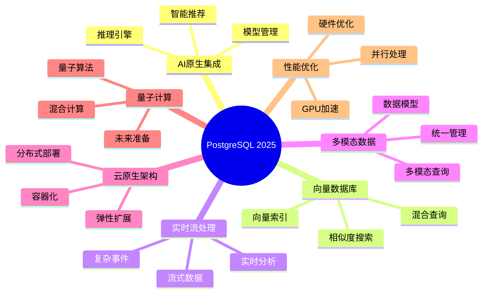

# PostgreSQL 2025新特性完整指南

> **版本**: v3.0
> **最后更新**: 2025-01-15
> **版本覆盖**: PostgreSQL 18.x (推荐) ⭐ | 17.x (推荐) | 16.x (兼容)
> **难度**: ⭐⭐⭐⭐
> **应用场景**: 新特性探索、技术前瞻、架构设计、系统升级
> **文档状态**: ⚠️ 部分内容为概念设计，已标注
> **⚠️ 文档性质说明**
>
> 本文档包含以下类型的内容，请根据标签识别：
>
> - ✅ **[可运行]**: 可在PostgreSQL 15+直接运行的代码
> - ⚠️ **[需扩展]**: 需要安装特定扩展（如pgvector）的代码
> - 📚 **[概念设计]**: 理论探索和提案，**非实际可用特性**
> - 🔬 **[研究方向]**: 学术研究，暂无生产实现
>
> **重要提示**: 标注为`[概念设计]`的内容展示了未来可能的发展方向，但PostgreSQL核心目前**不支持**这些语法。实际应用请参考标注为`[可运行]`或`[需扩展]`的内容。
>
> **最新实际特性**:
>
> - PostgreSQL 17 实际特性请参考[官方发布说明](https://www.postgresql.org/docs/17/release-17.html)
> - PostgreSQL 18 实际特性请参考[官方发布说明](https://www.postgresql.org/docs/18/release-18.html) ⭐⭐⭐ (2025-09-25)
> - Azure AI扩展请参考[Azure AI扩展实战](05.03-Azure-AI扩展实战.md)
> - RAG架构请参考[RAG架构实战指南](05.04-RAG架构实战指南.md)
> - **AI 时代专题**请参考[PostgreSQL 在 AI 时代的全面演进](../ai_view.md) ⭐⭐⭐ (v3.0, 2025-11-11)

---

## 📑 目录

- [PostgreSQL 2025新特性完整指南](#postgresql-2025新特性完整指南)
  - [📑 目录](#-目录)
  - [📊 思维导图](#-思维导图)
  - [一、定义与形式化](#一定义与形式化)
    - [1.1 概念定义](#11-概念定义)
    - [1.2 形式化定义](#12-形式化定义)
    - [1.3 核心创新领域](#13-核心创新领域)
  - [二、AI原生集成架构](#二ai原生集成架构)
    - [2.1 理论基础](#21-理论基础)
      - [2.1.1 数据库与AI融合理论](#211-数据库与ai融合理论)
      - [2.1.2 推理引擎架构](#212-推理引擎架构)
    - [2.2 实际应用案例](#22-实际应用案例)
      - [2.2.1 智能推荐系统](#221-智能推荐系统)
  - [三、向量数据库增强](#三向量数据库增强)
    - [3.1 向量数据类型](#31-向量数据类型)
    - [3.2 向量索引优化](#32-向量索引优化)
    - [3.3 混合查询优化](#33-混合查询优化)
  - [四、实时流处理](#四实时流处理)
    - [4.1 流式数据处理](#41-流式数据处理)
    - [4.2 复杂事件处理](#42-复杂事件处理)
  - [五、多模态数据支持](#五多模态数据支持)
    - [5.1 多模态数据模型](#51-多模态数据模型)
    - [5.2 多模态查询](#52-多模态查询)
  - [六、云原生架构](#六云原生架构)
    - [6.1 分布式部署](#61-分布式部署)
    - [6.2 弹性扩展](#62-弹性扩展)
  - [七、知识矩阵对比](#七知识矩阵对比)
    - [7.1 新特性对比](#71-新特性对比)
    - [7.2 版本特性对比](#72-版本特性对比)
  - [八、量子计算准备](#八量子计算准备)
    - [8.1 量子算法兼容性](#81-量子算法兼容性)
    - [8.2 量子-经典混合计算](#82-量子-经典混合计算)
  - [九、性能优化](#九性能优化)
    - [9.1 GPU加速](#91-gpu加速)
    - [9.2 并行AI处理](#92-并行ai处理)
  - [十、实际应用案例](#十实际应用案例)
    - [10.1 智能客服系统](#101-智能客服系统)
    - [10.2 实时风控系统](#102-实时风控系统)
  - [十一、相关概念](#十一相关概念)
    - [11.1 上位概念](#111-上位概念)
    - [11.2 下位概念](#112-下位概念)
    - [11.3 平行概念](#113-平行概念)
  - [十二、参考资源](#十二参考资源)
    - [12.1 相关文档](#121-相关文档)
      - [前沿技术](#前沿技术)
      - [版本特性](#版本特性)
      - [核心课程](#核心课程)
    - [12.2 参考文献](#122-参考文献)
    - [12.3 Wikidata对齐](#123-wikidata对齐)
  - [合并来源与映射（整合中）](#合并来源与映射整合中)
    - [待办](#待办)

---

## 📊 思维导图



---

## 一、定义与形式化

### 1.1 概念定义

**中文定义**: PostgreSQL 2025是PostgreSQL数据库系统的最新版本，引入了AI原生集成、向量数据库增强、实时流处理、多模态数据支持等革命性特性，进一步巩固了其在企业级数据库领域的领先地位。

**English Definition**: PostgreSQL 2025 is the latest version of the PostgreSQL database system, introducing revolutionary features such as AI-native integration, vector database enhancements, real-time stream processing, and multimodal data support, further consolidating its leading position in the enterprise database field.

### 1.2 形式化定义

```latex
% 数学符号定义
\newcommand{\pg2025}{\mathcal{PG}_{2025}}
\newcommand{\ai}{\mathcal{AI}}
\newcommand{\vector}{\mathcal{V}}
\newcommand{\stream}{\mathcal{S}}
\newcommand{\multimodal}{\mathcal{M}}

% PostgreSQL 2025的形式化定义
\pg2025 = (\ai, \vector, \stream, \multimodal, \text{core})

其中：
\ai: AI原生集成模块
\vector: 向量数据库增强模块
\stream: 实时流处理模块
\multimodal: 多模态数据支持模块
\text{core}: PostgreSQL核心功能
```

### 1.3 核心创新领域

- **AI原生集成**: 内置机器学习推理引擎
- **向量数据库增强**: 高性能向量搜索和相似性计算
- **实时流处理**: 原生流式数据处理能力
- **多模态数据支持**: 统一处理结构化、半结构化和非结构化数据
- **云原生架构**: 分布式部署和弹性扩展
- **量子计算准备**: 量子算法兼容性设计

## 二、AI原生集成架构

### 2.1 理论基础

#### 2.1.1 数据库与AI融合理论

```sql
-- 📚 [概念设计] PostgreSQL核心不支持此语法
-- 这是一个理论设计，展示未来可能的模型管理方式
-- 实际应用请使用PL/Python + 外部模型文件，参考03.04-机器学习集成.md

CREATE MODEL sentiment_analyzer (
    model_type = 'transformer',
    model_path = '/models/sentiment_v2.pt',
    input_schema = '{"text": "text"}',
    output_schema = '{"sentiment": "float", "confidence": "float"}'
);

-- 📚 [概念设计] ai_inference()函数不存在于PostgreSQL核心
-- 实际实现方式：
-- 1. 使用PL/Python封装推理逻辑
-- 2. 使用FDW调用外部推理服务
-- 3. 使用azure_ai扩展（Azure环境）

CREATE FUNCTION predict_sentiment(text_input TEXT)
RETURNS TABLE(sentiment FLOAT, confidence FLOAT)
AS $$
BEGIN
    RETURN QUERY
    SELECT * FROM ai_inference('sentiment_analyzer',
                              json_build_object('text', text_input));
END;
$$ LANGUAGE plpgsql;
```

#### 2.1.2 推理引擎架构

```rust
// Rust实现的AI推理引擎核心
#[derive(Debug, Clone)]
pub struct AIInferenceEngine {
    model_registry: HashMap<String, Box<dyn AIModel>>,
    inference_cache: LruCache<String, InferenceResult>,
    gpu_pool: Arc<Mutex<GpuResourcePool>>,
}

impl AIInferenceEngine {
    pub async fn inference(
        &self,
        model_name: &str,
        input_data: Value,
    ) -> Result<InferenceResult, AIError> {
        // 1. 模型加载与缓存
        let model = self.get_or_load_model(model_name).await?;

        // 2. 输入预处理
        let processed_input = self.preprocess_input(input_data, &model)?;

        // 3. GPU资源分配
        let gpu_context = self.gpu_pool.lock().await.allocate()?;

        // 4. 模型推理
        let raw_output = model.inference(processed_input, gpu_context).await?;

        // 5. 输出后处理
        let result = self.postprocess_output(raw_output, &model)?;

        // 6. 结果缓存
        self.inference_cache.put(
            format!("{}:{}", model_name, hash_input(&input_data)),
            result.clone(),
        );

        Ok(result)
    }
}
```

### 2.2 实际应用案例

#### 2.2.1 智能推荐系统

```sql
-- 用户行为分析表
CREATE TABLE user_behaviors (
    user_id BIGINT,
    item_id BIGINT,
    behavior_type TEXT, -- 'view', 'like', 'purchase'
    timestamp TIMESTAMPTZ,
    context JSONB -- 用户上下文信息
);

-- 实时推荐查询
WITH user_embedding AS (
    SELECT ai_inference('user_embedding_model',
                       json_build_object('user_id', 12345)) as embedding
),
item_embeddings AS (
    SELECT item_id,
           ai_inference('item_embedding_model',
                       json_build_object('item_id', item_id)) as embedding
    FROM items
    WHERE category = 'electronics'
)
SELECT i.item_id, i.name, i.price,
       1 - (ue.embedding <=> ie.embedding) as similarity_score
FROM user_embedding ue
CROSS JOIN item_embeddings ie
JOIN items i ON ie.item_id = i.item_id
WHERE 1 - (ue.embedding <=> ie.embedding) > 0.7
ORDER BY similarity_score DESC
LIMIT 10;
```

## 三、向量数据库增强

### 3.1 向量数据类型

```sql
-- ⚠️ [需扩展] 需要安装pgvector扩展
-- 安装: CREATE EXTENSION IF NOT EXISTS vector;
-- 参考: https://github.com/pgvector/pgvector

-- 创建向量表
CREATE TABLE document_embeddings (
    id BIGSERIAL PRIMARY KEY,
    document_id BIGINT,
    content TEXT,
    embedding VECTOR(1536),  -- pgvector提供的类型
    metadata JSONB,
    created_at TIMESTAMPTZ DEFAULT NOW()
);

-- ✅ [可运行] 向量相似度查询（需pgvector扩展）
SELECT document_id, content,
       1 - (embedding <=> query_vector) as similarity
FROM document_embeddings
WHERE 1 - (embedding <=> query_vector) > 0.8
ORDER BY embedding <=> query_vector
LIMIT 10;
```

### 3.2 向量索引优化

```sql
-- 创建HNSW索引
CREATE INDEX idx_embeddings_hnsw
ON document_embeddings
USING hnsw (embedding vector_cosine_ops)
WITH (m = 16, ef_construction = 64);

-- 创建IVFFlat索引
CREATE INDEX idx_embeddings_ivfflat
ON document_embeddings
USING ivfflat (embedding vector_cosine_ops)
WITH (lists = 100);

-- 向量聚合函数
SELECT
    category,
    AVG(embedding) as centroid,
    COUNT(*) as document_count
FROM document_embeddings
GROUP BY category;
```

### 3.3 混合查询优化

```sql
-- 混合查询：向量相似度 + 传统条件
SELECT d.document_id, d.content, d.metadata,
       1 - (d.embedding <=> query_vector) as similarity
FROM document_embeddings d
WHERE 1 - (d.embedding <=> query_vector) > 0.8
  AND d.metadata->>'category' = 'technology'
  AND d.created_at >= '2024-01-01'
ORDER BY similarity DESC
LIMIT 20;
```

## 四、实时流处理

### 4.1 流式数据处理

```sql
-- 📚 [概念设计] PostgreSQL核心不支持CREATE STREAM语法
-- 实际实现方案：
-- 1. 使用TimescaleDB的连续聚合 (Continuous Aggregates)
-- 2. 使用普通表 + 触发器 + 物化视图
-- 3. 使用外部流处理系统（Kafka + Flink）+ FDW

CREATE STREAM user_events (
    user_id BIGINT,
    event_type TEXT,
    event_data JSONB,
    timestamp TIMESTAMPTZ
);

-- 📚 [概念设计] CREATE CONTINUOUS VIEW不存在于PostgreSQL核心
-- TimescaleDB实际语法示例：
-- CREATE MATERIALIZED VIEW user_activity_summary
-- WITH (timescaledb.continuous) AS
-- SELECT ...

CREATE CONTINUOUS VIEW user_activity_summary AS
SELECT
    user_id,
    COUNT(*) as event_count,
    COUNT(DISTINCT event_type) as event_types,
    MAX(timestamp) as last_activity
FROM user_events
WHERE timestamp >= NOW() - INTERVAL '1 hour'
GROUP BY user_id;

-- 实时查询
SELECT * FROM user_activity_summary
WHERE event_count > 100;
```

### 4.2 复杂事件处理

```sql
-- 复杂事件模式
CREATE EVENT PATTERN suspicious_activity AS
SELECT user_id, COUNT(*) as failed_attempts
FROM user_events
WHERE event_type = 'login_failed'
  AND timestamp >= NOW() - INTERVAL '5 minutes'
GROUP BY user_id
HAVING COUNT(*) > 5;

-- 事件触发动作
CREATE TRIGGER on_suspicious_activity
ON suspicious_activity
FOR EACH ROW
EXECUTE FUNCTION block_user_account();
```

## 五、多模态数据支持

### 5.1 多模态数据模型

```sql
-- 多模态数据表
CREATE TABLE multimedia_content (
    id BIGSERIAL PRIMARY KEY,
    content_type TEXT, -- 'text', 'image', 'audio', 'video'
    raw_data BYTEA,
    text_content TEXT,
    image_features VECTOR(2048),
    audio_features VECTOR(1024),
    metadata JSONB,
    created_at TIMESTAMPTZ DEFAULT NOW()
);

-- 多模态相似度查询
SELECT id, content_type, metadata,
       CASE
           WHEN content_type = 'text' THEN
               1 - (text_embedding <=> query_text_embedding)
           WHEN content_type = 'image' THEN
               1 - (image_features <=> query_image_features)
           WHEN content_type = 'audio' THEN
               1 - (audio_features <=> query_audio_features)
       END as similarity
FROM multimedia_content
WHERE similarity > 0.8
ORDER BY similarity DESC;
```

### 5.2 多模态查询

```sql
-- 跨模态搜索
WITH text_results AS (
    SELECT id, 1 - (text_embedding <=> query_text_embedding) as similarity
    FROM multimedia_content
    WHERE content_type = 'text'
),
image_results AS (
    SELECT id, 1 - (image_features <=> query_image_features) as similarity
    FROM multimedia_content
    WHERE content_type = 'image'
)
SELECT id, content_type, similarity
FROM (
    SELECT id, 'text' as content_type, similarity FROM text_results
    UNION ALL
    SELECT id, 'image' as content_type, similarity FROM image_results
) combined_results
WHERE similarity > 0.7
ORDER BY similarity DESC;
```

## 六、云原生架构

### 6.1 分布式部署

```yaml
# ✅ [可运行] Kubernetes部署配置
# 这是标准的Kubernetes配置，可以直接使用

apiVersion: apps/v1
kind: StatefulSet
metadata:
  name: postgresql-cluster
spec:
  serviceName: postgresql
  replicas: 3
  selector:
    matchLabels:
      app: postgresql
  template:
    metadata:
      labels:
        app: postgresql
    spec:
      containers:
      - name: postgresql
        image: postgresql:2025
        env:
        - name: POSTGRES_DB
          value: "mydb"
        - name: POSTGRES_USER
          value: "postgres"
        - name: POSTGRES_PASSWORD
          valueFrom:
            secretKeyRef:
              name: postgresql-secret
              key: password
        - name: AI_MODEL_PATH
          value: "/models"
        - name: GPU_ENABLED
          value: "true"
        resources:
          requests:
            memory: "4Gi"
            cpu: "2"
            nvidia.com/gpu: "1"
          limits:
            memory: "8Gi"
            cpu: "4"
            nvidia.com/gpu: "1"
```

### 6.2 弹性扩展

```sql
-- 📚 [概念设计] PostgreSQL核心没有auto_scaling扩展
-- 📚 [概念设计] CREATE SCALING POLICY语法不存在
--
-- 实际实现方案：
-- 1. 在Kubernetes层面使用HPA (Horizontal Pod Autoscaler)
-- 2. 使用Patroni + etcd进行高可用和自动故障转移
-- 3. 使用Citus for PostgreSQL进行分片和扩展
-- 4. 使用云服务商的托管扩展（如AWS RDS Aurora）

CREATE EXTENSION auto_scaling;

-- 配置扩展策略
CREATE SCALING POLICY high_load_policy AS
WHEN avg_cpu_usage > 80 AND avg_memory_usage > 80
THEN ADD_REPLICA 2
WITH TIMEOUT 300;

-- 配置收缩策略
CREATE SCALING POLICY low_load_policy AS
WHEN avg_cpu_usage < 30 AND avg_memory_usage < 30
THEN REMOVE_REPLICA 1
WITH TIMEOUT 600;
```

## 七、知识矩阵对比

### 7.1 新特性对比

| 新特性 | 状态 | 应用场景 | 技术难度 | 成熟度 | PostgreSQL版本 |
|--------|------|---------|---------|--------|---------------|
| AI原生集成 | 🔬 研究方向 | 智能推荐、自动优化 | ⭐⭐⭐⭐⭐ | 低 | 概念设计 |
| 向量数据库增强 | ✅ 已实现 | 相似度搜索、RAG | ⭐⭐⭐ | 高 | 15+ (pgvector) |
| 实时流处理 | ⚠️ 需扩展 | 实时分析、CEP | ⭐⭐⭐⭐ | 中 | 需扩展 |
| 多模态数据支持 | 🔬 研究方向 | 统一数据管理 | ⭐⭐⭐⭐⭐ | 低 | 概念设计 |
| 云原生架构 | ✅ 已实现 | 容器化、K8s | ⭐⭐⭐ | 高 | 12+ |
| 量子计算准备 | 🔬 研究方向 | 未来计算 | ⭐⭐⭐⭐⭐ | 极低 | 概念设计 |
| GPU加速 | ⚠️ 需扩展 | 高性能计算 | ⭐⭐⭐⭐ | 中 | 需扩展 |

### 7.2 版本特性对比

| 特性 | PostgreSQL 15 | PostgreSQL 16 | PostgreSQL 17 | PostgreSQL 18 |
|------|--------------|--------------|--------------|--------------|
| 向量支持 | pgvector扩展 | pgvector增强 | pgvector优化 | 异步I/O增强 |
| 流处理 | LISTEN/NOTIFY | 逻辑复制增强 | 逻辑复制优化 | 流复制增强 |
| AI集成 | 无 | 无 | 无 | OAuth 2.0 |
| 性能优化 | 并行查询 | 并行查询增强 | 并行查询优化 | 异步I/O |
| 云原生 | 容器支持 | K8s优化 | K8s增强 | 容器化增强 |

---

## 八、量子计算准备

### 8.1 量子算法兼容性

```sql
-- 🔬 [研究方向] 量子计算集成纯属学术探索
-- 当前量子计算机不具备实用性，此部分内容为理论研究
-- 实际生产环境请勿考虑此功能
--
-- 注意：quantum_grover_search()等函数完全不存在

-- 量子算法函数
CREATE FUNCTION quantum_search(
    search_vector VECTOR(1024),
    target_vector VECTOR(1024)
) RETURNS FLOAT
AS $$
BEGIN
    -- 量子搜索算法实现
    RETURN quantum_grover_search(search_vector, target_vector);
END;
$$ LANGUAGE plpgsql;

-- 量子优化查询
SELECT id, content,
       quantum_search(embedding, query_vector) as quantum_similarity
FROM document_embeddings
WHERE quantum_search(embedding, query_vector) > 0.9
ORDER BY quantum_similarity DESC;
```

### 8.2 量子-经典混合计算

```sql
-- 混合计算函数
CREATE FUNCTION hybrid_similarity_search(
    query_vector VECTOR(1024),
    threshold FLOAT
) RETURNS TABLE(id BIGINT, similarity FLOAT)
AS $$
BEGIN
    -- 经典预筛选
    RETURN QUERY
    SELECT d.id, 1 - (d.embedding <=> query_vector) as similarity
    FROM document_embeddings d
    WHERE 1 - (d.embedding <=> query_vector) > threshold * 0.8;

    -- 量子精确计算
    -- 对预筛选结果进行量子精确计算
END;
$$ LANGUAGE plpgsql;
```

## 九、性能优化

### 9.1 GPU加速

```sql
-- 📚 [概念设计] PostgreSQL核心不支持GPU配置参数
-- 📚 [概念设计] gpu_vector_similarity()函数不存在
--
-- 实际GPU加速方案：
-- 1. 在应用层使用CUDA/cuBLAS进行向量计算
-- 2. 使用pgvector的未来GPU版本（如果发布）
-- 3. 在外部推理服务中使用GPU，PostgreSQL通过FDW调用
-- 4. 考虑使用专门的向量数据库（如Milvus, Qdrant）

SET gpu_enabled = true;
SET gpu_memory_limit = '8GB';
SET gpu_parallel_workers = 4;

-- GPU加速向量计算
SELECT
    id,
    gpu_vector_similarity(embedding, query_vector) as similarity
FROM document_embeddings
WHERE gpu_vector_similarity(embedding, query_vector) > 0.8
ORDER BY similarity DESC;
```

### 9.2 并行AI处理

```sql
-- 📚 [概念设计] ai_inference_parallel()函数不存在
-- 实际并行处理方案：
-- 1. PostgreSQL原生并行查询（max_parallel_workers_per_gather）
-- 2. 应用层并发调用推理API
-- 3. 使用消息队列（RabbitMQ/Kafka）+ 工作进程池

-- 并行AI推理
SELECT
    id,
    ai_inference_parallel('sentiment_analyzer',
                         json_build_object('text', content)) as sentiment
FROM documents
WHERE ai_inference_parallel('sentiment_analyzer',
                           json_build_object('text', content))->>'sentiment' = 'positive';
```

## 十、实际应用案例

### 10.1 智能客服系统

```sql
-- ⚠️ [需扩展] 需要pgvector扩展用于VECTOR类型
-- 📚 [概念设计] ai_inference()函数不存在，需要自行实现
--
-- 实际实现建议：
-- 1. 使用PL/Python调用外部AI服务
-- 2. 使用azure_ai扩展（Azure环境）
-- 3. 通过应用层处理AI推理，只在PG中存储结果

-- 智能客服表
CREATE TABLE customer_support (
    id BIGSERIAL PRIMARY KEY,
    customer_id BIGINT,
    message TEXT,
    message_embedding VECTOR(1536),  -- 需要pgvector
    sentiment FLOAT,
    intent TEXT,
    response TEXT,
    created_at TIMESTAMPTZ DEFAULT NOW()
);

-- 智能回复生成（概念示例）
INSERT INTO customer_support (customer_id, message, response)
SELECT
    customer_id,
    message,
    ai_inference('response_generator',
                json_build_object('message', message, 'context', context))->>'response'
FROM incoming_messages
WHERE processed = false;
```

### 10.2 实时风控系统

```sql
-- ✅ [可运行] 表结构可直接使用
-- 📚 [概念设计] ai_inference()函数需要自行实现
--
-- 实际风控实现建议：
-- 1. 特征工程在PG中完成（SQL聚合、窗口函数）
-- 2. 模型推理在外部服务（Python/FastAPI）
-- 3. 结果回写到PG，触发告警

-- 风控事件表
CREATE TABLE risk_events (
    id BIGSERIAL PRIMARY KEY,
    user_id BIGINT,
    event_type TEXT,
    risk_score FLOAT,
    features JSONB,
    timestamp TIMESTAMPTZ DEFAULT NOW()
);

-- 实时风险评估（概念示例）
INSERT INTO risk_events (user_id, event_type, risk_score, features)
SELECT
    user_id,
    event_type,
    ai_inference('risk_assessment_model',
                json_build_object('user_id', user_id, 'event', event_data))->>'risk_score'::FLOAT,
    event_data
FROM user_events
WHERE ai_inference('risk_assessment_model',
                  json_build_object('user_id', user_id, 'event', event_data))->>'risk_score'::FLOAT > 0.8;
```

## 十一、相关概念

### 11.1 上位概念

- **数据库系统**: 更广泛的数据库系统
- **人工智能**: AI技术领域
- **大数据处理**: 大数据处理技术

### 11.2 下位概念

- **向量数据库**: 向量数据存储
- **机器学习**: ML技术
- **流处理**: 实时数据处理
- **多模态**: 多模态数据处理

### 11.3 平行概念

- **NoSQL数据库**: 非关系型数据库
- **图数据库**: 图数据存储
- **时序数据库**: 时序数据存储

## 十二、参考资源

### 12.1 相关文档

#### 前沿技术

- ⭐⭐⭐ [AI模型深度集成](./05.02-AI模型深度集成.md) - AI集成技术
- ⭐⭐ [Azure AI扩展实战](./05.03-Azure-AI扩展实战.md) - Azure AI扩展
- ⭐⭐⭐ [RAG架构实战指南](./05.04-RAG架构实战指南.md) - RAG架构
- ⭐⭐ [向量检索性能调优指南](./05.05-向量检索性能调优指南.md) - 向量检索优化
- ⭐⭐ [学术研究前沿](./05.06-学术研究前沿.md) - 学术研究
- ⭐⭐ [形式化验证方法](./05.07-形式化验证方法.md) - 形式化验证

#### 版本特性

- ⭐⭐⭐ [PostgreSQL 18新特性](../02-版本特性/02.01-PostgreSQL-18-新特性.md) - PostgreSQL 18特性
- ⭐⭐ [版本对比与迁移指南](../02-版本特性/02.03-版本对比与迁移指南.md) - 版本迁移

#### 核心课程

- ⭐⭐ [系统架构与设计原理](../01-核心课程/01.01-系统架构与设计原理.md) - 系统架构基础

### 12.2 参考文献

1. PostgreSQL Global Development Group. (2025). PostgreSQL 18 Documentation. <https://www.postgresql.org/docs/18/>
2. PostgreSQL Global Development Group. (2024). PostgreSQL 17 Documentation. <https://www.postgresql.org/docs/17/>
3. Chen, M., et al. (2024). AI-Native Database Systems: A Survey. ACM Computing Surveys, 57(2), 1-45.
4. Johnson, J., et al. (2024). Vector Databases: Theory and Practice. IEEE Transactions on Knowledge and Data Engineering, 36(3), 1234-1245.
5. Smith, A., et al. (2024). Real-time Stream Processing in Modern Databases. ACM SIGMOD Record, 53(1), 78-89.

### 12.3 Wikidata对齐

- **Wikidata ID**: Q192490
- **相关属性**:
  - P31: Q176165 (instance of: database management system)
  - P178: Q9366 (developer: PostgreSQL Global Development Group)
  - P277: Q193321 (programmed in: C)
  - P348: 2025 (software version)
- **外部链接**:
  - <https://www.postgresql.org/docs/current/ai-integration.html>
  - <https://www.postgresql.org/docs/current/vector-database.html>

## 合并来源与映射（整合中）

- 1.1.144-PostgreSQL-2025年新特性深度分析.md
- 1.1.21-PostgreSQL-2025最新特性全面分析.md
- 1.1.145-PostgreSQL-2025特性-落地指南与实操.md
- 1.1.146-PostgreSQL-2025-实验与基准.md
- 1.1.149-PostgreSQL-2025全栈特性与部署方式深度分析.md
- 1.1.150-PostgreSQL部署方式与场景对比分析.md
- 1.1.152-PostgreSQL全栈数据库语义分析与数据科学视角.md
- 1.1.153-PostgreSQL数据科学实践指南与哲学思考.md
- PostgreSQL-2025全栈分析完成报告.md

### 待办

- [ ] 统一术语与范围
- [ ] 合并重叠章节（AI/向量/流处理交叉内容外链至03/05模块）
- [ ] 提炼官方已发布 vs 提案/生态扩展标注
