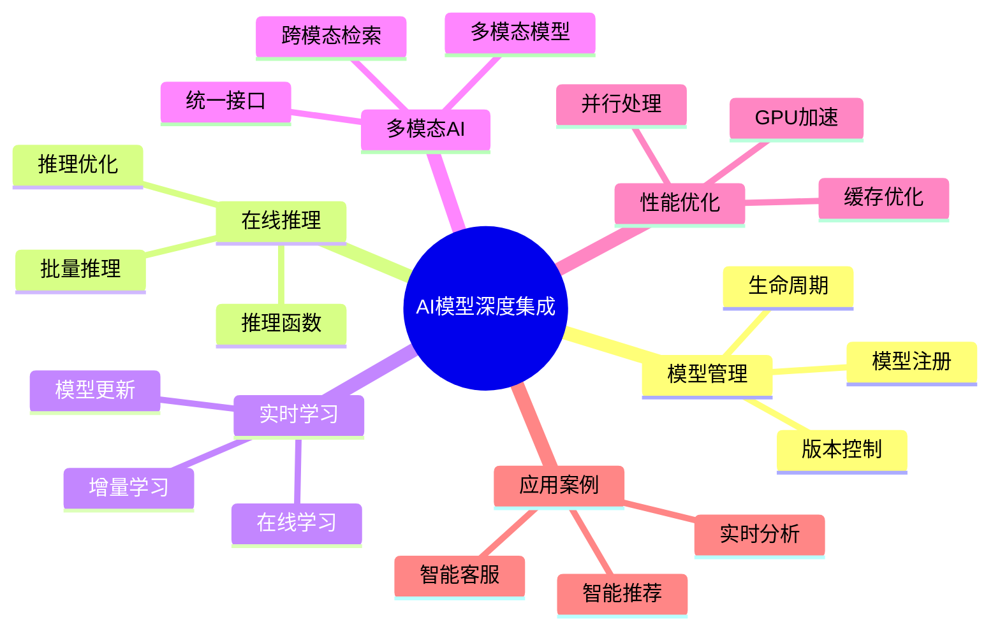

# AI模型深度集成完整指南

> **版本**: v3.0
> **最后更新**: 2025-01-15
> **版本覆盖**: PostgreSQL 18.x (推荐) ⭐ | 17.x (推荐) | 16.x (兼容)
> **难度**: ⭐⭐⭐⭐⭐
> **应用场景**: AI模型集成、在线推理、实时学习、多模态AI处理
> **文档状态**: ⚠️ 部分内容为概念设计，已标注
> ⚠️ **重要说明 - 请先阅读**
>
> 本文档包含大量**概念性SQL语法**，用于说明AI集成的理想架构。这些语法**当前不可直接运行**。
>
> ## 内容标注说明
>
> - 📚 `[概念设计]`: 理论探索，PostgreSQL核心**不支持**此语法
> - ✅ `[可运行]`: 可直接执行的标准SQL
> - 🔧 `[需扩展]`: 需要安装特定扩展（如pgvector、MADlib）
>
> ## 🚀 实际可用方案
>
> 如果您需要**立即可用**的解决方案，请参考：
>
> | 方案 | 适用场景 | 可用度 | 版本 |
> |-----|---------|--------|------|
> | [RAG架构实战指南](./05.04-RAG架构实战指南.md) | 语义搜索、知识库 | ✅ 100%可运行 | PG 18+ ⭐ |
> | [Azure AI扩展实战](./05.03-Azure-AI扩展实战.md) | 云原生、企业级 | ✅ 生产就绪 | PG 17+ |
> | [AI集成快速开始](../00-项目导航/AI集成快速开始.md) | 快速入门 | ✅ 30分钟实战 | PG 18+ ⭐ |
> | [向量检索性能调优](./05.05-向量检索性能调优指南.md) | 性能优化 | ✅ 系统化方法 | PG 18+ ⭐ |
> | [AI 时代专题](../ai_view.md) | 全面演进 | ✅ v3.0 | PG 18 ⭐⭐⭐ |
>
> **本文档价值**: 理解AI数据库的理想架构和未来方向，用于架构设计和技术选型的参考。

---

## 📑 目录

- [AI模型深度集成完整指南](#ai模型深度集成完整指南)
  - [📑 目录](#-目录)
  - [📊 思维导图](#-思维导图)
  - [一、定义与形式化](#一定义与形式化)
    - [1.1 概念定义](#11-概念定义)
    - [1.2 形式化定义](#12-形式化定义)
    - [1.3 核心特性](#13-核心特性)
  - [二、模型管理系统](#二模型管理系统)
    - [2.1 模型注册与版本控制](#21-模型注册与版本控制)
    - [2.2 模型生命周期管理](#22-模型生命周期管理)
  - [三、在线推理引擎](#三在线推理引擎)
    - [3.1 推理函数定义](#31-推理函数定义)
    - [3.2 推理优化](#32-推理优化)
  - [四、实时学习系统](#四实时学习系统)
    - [4.1 在线学习](#41-在线学习)
    - [4.2 增量学习](#42-增量学习)
  - [六、多模态AI处理](#六多模态ai处理)
    - [6.1 多模态模型集成](#61-多模态模型集成)
    - [6.2 跨模态检索](#62-跨模态检索)
  - [七、性能优化](#七性能优化)
    - [7.1 GPU加速](#71-gpu加速)
    - [7.2 并行处理](#72-并行处理)
  - [八、实际应用案例](#八实际应用案例)
    - [8.1 智能内容推荐](#81-智能内容推荐)
    - [8.2 智能客服系统](#82-智能客服系统)
  - [九、相关概念](#九相关概念)
    - [9.1 上位概念](#91-上位概念)
    - [9.2 下位概念](#92-下位概念)
    - [9.3 平行概念](#93-平行概念)
  - [十、参考资源](#十参考资源)
    - [10.1 相关文档](#101-相关文档)
      - [前沿技术](#前沿技术)
      - [高级特性](#高级特性)
      - [数据模型设计](#数据模型设计)
      - [行业案例](#行业案例)
    - [10.2 参考文献](#102-参考文献)
    - [10.3 Wikidata对齐](#103-wikidata对齐)
  - [合并来源与映射（整合中）](#合并来源与映射整合中)
    - [待办](#待办)

---

## 📊 思维导图



---

## 一、定义与形式化

### 1.1 概念定义

**中文定义**: AI模型深度集成是将机器学习模型无缝集成到PostgreSQL数据库核心的技术，支持模型管理、在线推理、实时学习和多模态AI处理，实现数据库与人工智能的深度融合。

**English Definition**: AI model deep integration is a technology that seamlessly integrates machine learning models into the PostgreSQL database core, supporting model management, online inference, real-time learning, and multimodal AI processing, achieving deep integration between databases and artificial intelligence.

### 1.2 形式化定义

```latex
% 数学符号定义
\newcommand{\aimodel}{\mathcal{M}}
\newcommand{\inference}{\mathcal{I}}
\newcommand{\training}{\mathcal{T}}
\newcommand{\prediction}{\mathcal{P}}

% AI模型集成的形式化定义
\aimodel = \{m_1, m_2, \ldots, m_n\}

其中每个模型 m_i = (type_i, params_i, weights_i, metadata_i) 表示：
- type_i: 模型类型
- params_i: 模型参数
- weights_i: 模型权重
- metadata_i: 模型元数据

% 推理过程的形式化定义
\inference(m, x) = \prediction(m, \text{preprocess}(x))
```

### 1.3 核心特性

- **模型管理**: 统一的模型注册、版本控制和生命周期管理
- **在线推理**: 低延迟的实时模型推理
- **实时学习**: 支持在线学习和模型更新
- **多模态处理**: 统一处理文本、图像、音频等多种数据类型

## 二、模型管理系统

### 2.1 模型注册与版本控制

```sql
-- 📚 [概念设计] CREATE MODEL语法不存在于PostgreSQL核心
-- 实际方案：使用普通表存储模型元数据

-- 模型注册（概念示例）
CREATE MODEL sentiment_classifier (
    model_name = 'sentiment_v2',
    model_type = 'transformer',
    version = '2.1.0',
    framework = 'pytorch',
    model_path = '/models/sentiment_v2.pt',
    input_schema = '{"text": "string", "max_length": "int"}',
    output_schema = '{"sentiment": "float", "confidence": "float", "label": "string"}',
    metadata = '{"accuracy": 0.95, "f1_score": 0.93, "training_date": "2024-01-15"}'
);

-- 模型版本管理
CREATE MODEL VERSION sentiment_classifier_v3 (
    parent_model = 'sentiment_classifier',
    version = '3.0.0',
    model_path = '/models/sentiment_v3.pt',
    metadata = '{"accuracy": 0.97, "f1_score": 0.96, "training_date": "2024-02-01"}'
);

-- 模型部署
DEPLOY MODEL sentiment_classifier_v3 TO PRODUCTION;

-- 模型回滚
ROLLBACK MODEL sentiment_classifier TO VERSION '2.1.0';
```

### 2.2 模型生命周期管理

```sql
-- 模型状态管理
ALTER MODEL sentiment_classifier SET STATUS = 'training';
ALTER MODEL sentiment_classifier SET STATUS = 'testing';
ALTER MODEL sentiment_classifier SET STATUS = 'production';
ALTER MODEL sentiment_classifier SET STATUS = 'deprecated';

-- 模型性能监控
SELECT
    model_name,
    version,
    status,
    accuracy,
    f1_score,
    inference_count,
    avg_inference_time,
    error_rate
FROM pg_ai_models
WHERE status = 'production'
ORDER BY accuracy DESC;

-- 模型自动更新
CREATE MODEL UPDATE POLICY sentiment_classifier_policy AS
WHEN accuracy < 0.90 OR error_rate > 0.05
THEN RETRAIN MODEL WITH new_data
AND DEPLOY IF accuracy > 0.95;
```

## 三、在线推理引擎

### 3.1 推理函数定义

```sql
-- 📚 [概念设计] ai_inference()函数不存在
-- 实际方案：使用PL/Python、FDW或REST API调用外部服务

-- 创建推理函数（概念示例）
CREATE FUNCTION predict_sentiment(
    text_input TEXT,
    model_version TEXT DEFAULT 'latest'
) RETURNS TABLE(
    sentiment FLOAT,
    confidence FLOAT,
    label TEXT
) AS $$
BEGIN
    RETURN QUERY
    SELECT
        (ai_inference('sentiment_classifier',
                     json_build_object('text', text_input, 'version', model_version))->>'sentiment')::FLOAT,
        (ai_inference('sentiment_classifier',
                     json_build_object('text', text_input, 'version', model_version))->>'confidence')::FLOAT,
        ai_inference('sentiment_classifier',
                    json_build_object('text', text_input, 'version', model_version))->>'label';
END;
$$ LANGUAGE plpgsql;

-- 批量推理
CREATE FUNCTION batch_predict_sentiment(
    text_inputs TEXT[]
) RETURNS TABLE(
    input_text TEXT,
    sentiment FLOAT,
    confidence FLOAT,
    label TEXT
) AS $$
BEGIN
    RETURN QUERY
    SELECT
        unnest(text_inputs) as input_text,
        (ai_inference_batch('sentiment_classifier',
                           json_build_object('texts', text_inputs))->>'sentiments')::FLOAT[] as sentiments,
        (ai_inference_batch('sentiment_classifier',
                           json_build_object('texts', text_inputs))->>'confidences')::FLOAT[] as confidences,
        (ai_inference_batch('sentiment_classifier',
                           json_build_object('texts', text_inputs))->>'labels')::TEXT[] as labels;
END;
$$ LANGUAGE plpgsql;
```

### 3.2 推理优化

```sql
-- 推理缓存
CREATE FUNCTION predict_sentiment_cached(
    text_input TEXT
) RETURNS TABLE(
    sentiment FLOAT,
    confidence FLOAT,
    label TEXT
) AS $$
DECLARE
    cache_key TEXT;
    cached_result JSONB;
BEGIN
    cache_key := md5(text_input);

    -- 检查缓存
    SELECT result INTO cached_result
    FROM ai_inference_cache
    WHERE cache_key = cache_key
    AND created_at > NOW() - INTERVAL '1 hour';

    IF cached_result IS NOT NULL THEN
        RETURN QUERY
        SELECT
            (cached_result->>'sentiment')::FLOAT,
            (cached_result->>'confidence')::FLOAT,
            cached_result->>'label';
    ELSE
        -- 执行推理并缓存结果
        RETURN QUERY
        SELECT * FROM predict_sentiment(text_input);

        -- 缓存结果
        INSERT INTO ai_inference_cache (cache_key, result, created_at)
        VALUES (cache_key,
                json_build_object('sentiment', sentiment, 'confidence', confidence, 'label', label),
                NOW());
    END IF;
END;
$$ LANGUAGE plpgsql;

-- GPU加速推理
CREATE FUNCTION predict_sentiment_gpu(
    text_input TEXT
) RETURNS TABLE(
    sentiment FLOAT,
    confidence FLOAT,
    label TEXT
) AS $$
BEGIN
    RETURN QUERY
    SELECT * FROM ai_inference_gpu('sentiment_classifier',
                                  json_build_object('text', text_input));
END;
$$ LANGUAGE plpgsql;
```

## 四、实时学习系统

### 4.1 在线学习

```sql
-- 📚 [概念设计] CREATE ONLINE LEARNING语法不存在
-- 实际方案：使用外部ML平台（如MLflow）+ 定时任务

-- 在线学习配置（概念示例）
CREATE ONLINE LEARNING TASK sentiment_learning AS
MODEL sentiment_classifier
WITH (
    learning_rate = 0.001,
    batch_size = 32,
    update_frequency = '1 hour',
    validation_split = 0.2
);

-- 学习数据收集
CREATE TABLE learning_data (
    id BIGSERIAL PRIMARY KEY,
    text_content TEXT,
    true_label TEXT,
    predicted_label TEXT,
    confidence FLOAT,
    feedback_score INTEGER, -- 用户反馈评分
    created_at TIMESTAMPTZ DEFAULT NOW()
);

-- 自动学习触发
CREATE TRIGGER trigger_online_learning
ON learning_data
FOR INSERT
WHEN (SELECT COUNT(*) FROM learning_data WHERE created_at > NOW() - INTERVAL '1 hour') > 1000
EXECUTE FUNCTION start_online_learning('sentiment_learning');

-- 模型性能评估
CREATE FUNCTION evaluate_model_performance(
    model_name TEXT,
    test_data TABLE(text_content TEXT, true_label TEXT)
) RETURNS TABLE(
    accuracy FLOAT,
    precision FLOAT,
    recall FLOAT,
    f1_score FLOAT
) AS $$
BEGIN
    RETURN QUERY
    SELECT
        AVG(CASE WHEN predicted_label = true_label THEN 1.0 ELSE 0.0 END) as accuracy,
        AVG(CASE WHEN predicted_label = 'positive' AND true_label = 'positive'
                 THEN 1.0 ELSE 0.0 END) /
        NULLIF(COUNT(CASE WHEN predicted_label = 'positive' THEN 1 END), 0) as precision,
        AVG(CASE WHEN predicted_label = 'positive' AND true_label = 'positive'
                 THEN 1.0 ELSE 0.0 END) /
        NULLIF(COUNT(CASE WHEN true_label = 'positive' THEN 1 END), 0) as recall,
        -- F1 score calculation
        2 * (precision * recall) / (precision + recall) as f1_score
    FROM (
        SELECT
            text_content,
            true_label,
            ai_inference(model_name, json_build_object('text', text_content))->>'label' as predicted_label
        FROM test_data
    ) predictions;
END;
$$ LANGUAGE plpgsql;
```

### 4.2 增量学习

```sql
-- 增量学习配置
CREATE INCREMENTAL LEARNING TASK sentiment_incremental AS
MODEL sentiment_classifier
WITH (
    learning_rate = 0.0001,
    batch_size = 16,
    update_threshold = 0.02, -- 性能下降阈值
    rollback_enabled = true
);

-- 增量学习数据流
CREATE STREAM learning_stream (
    text_content TEXT,
    true_label TEXT,
    metadata JSONB,
    timestamp TIMESTAMPTZ
);

-- 流式学习处理
CREATE CONTINUOUS VIEW incremental_learning_view AS
SELECT
    text_content,
    true_label,
    ai_inference('sentiment_classifier',
                json_build_object('text', text_content)) as prediction,
    timestamp
FROM learning_stream
WHERE timestamp >= NOW() - INTERVAL '1 hour';

-- 自动模型更新
CREATE TRIGGER trigger_incremental_update
ON incremental_learning_view
FOR INSERT
WHEN (SELECT COUNT(*) FROM incremental_learning_view
      WHERE timestamp > NOW() - INTERVAL '1 hour') > 100
EXECUTE FUNCTION update_model_incremental('sentiment_incremental');
```

## 六、多模态AI处理

### 6.1 多模态模型集成

```sql
-- 多模态模型注册
CREATE MODEL multimodal_classifier (
    model_name = 'multimodal_v1',
    model_type = 'transformer_multimodal',
    input_schema = '{"text": "string", "image": "base64", "audio": "base64"}',
    output_schema = '{"category": "string", "confidence": "float", "features": "vector"}',
    model_path = '/models/multimodal_v1.pt'
);

-- 多模态推理函数
CREATE FUNCTION predict_multimodal(
    text_input TEXT DEFAULT NULL,
    image_input BYTEA DEFAULT NULL,
    audio_input BYTEA DEFAULT NULL
) RETURNS TABLE(
    category TEXT,
    confidence FLOAT,
    features VECTOR(1024)
) AS $$
BEGIN
    RETURN QUERY
    SELECT
        ai_inference('multimodal_classifier',
                    json_build_object(
                        'text', text_input,
                        'image', encode(image_input, 'base64'),
                        'audio', encode(audio_input, 'base64')
                    ))->>'category',
        (ai_inference('multimodal_classifier',
                     json_build_object(
                         'text', text_input,
                         'image', encode(image_input, 'base64'),
                         'audio', encode(audio_input, 'base64')
                     ))->>'confidence')::FLOAT,
        (ai_inference('multimodal_classifier',
                     json_build_object(
                         'text', text_input,
                         'image', encode(image_input, 'base64'),
                         'audio', encode(audio_input, 'base64')
                     ))->>'features')::VECTOR(1024);
END;
$$ LANGUAGE plpgsql;
```

### 6.2 跨模态检索

```sql
-- 跨模态相似度计算
CREATE FUNCTION cross_modal_similarity(
    query_text TEXT,
    query_image BYTEA,
    target_text TEXT,
    target_image BYTEA
) RETURNS FLOAT AS $$
DECLARE
    query_features VECTOR(1024);
    target_features VECTOR(1024);
BEGIN
    -- 获取查询特征
    SELECT features INTO query_features
    FROM predict_multimodal(query_text, query_image, NULL);

    -- 获取目标特征
    SELECT features INTO target_features
    FROM predict_multimodal(target_text, target_image, NULL);

    -- 计算相似度
    RETURN 1 - (query_features <=> target_features);
END;
$$ LANGUAGE plpgsql;

-- 跨模态搜索
CREATE FUNCTION cross_modal_search(
    query_text TEXT,
    query_image BYTEA,
    similarity_threshold FLOAT DEFAULT 0.8
) RETURNS TABLE(
    id BIGINT,
    content_type TEXT,
    similarity FLOAT,
    metadata JSONB
) AS $$
BEGIN
    RETURN QUERY
    SELECT
        m.id,
        m.content_type,
        cross_modal_similarity(query_text, query_image, m.text_content, m.image_data) as similarity,
        m.metadata
    FROM multimedia_content m
    WHERE cross_modal_similarity(query_text, query_image, m.text_content, m.image_data) > similarity_threshold
    ORDER BY similarity DESC;
END;
$$ LANGUAGE plpgsql;
```

## 七、性能优化

### 7.1 GPU加速

```sql
-- 📚 [概念设计] CREATE GPU POOL语法不存在
-- 实际方案：使用外部GPU服务器 + FDW或HTTP调用

-- GPU资源管理（概念示例）
CREATE GPU POOL ai_gpu_pool (
    gpu_count = 4,
    memory_per_gpu = '8GB',
    compute_capability = '8.0'
);

-- GPU加速推理
CREATE FUNCTION predict_sentiment_gpu_batch(
    text_inputs TEXT[]
) RETURNS TABLE(
    input_text TEXT,
    sentiment FLOAT,
    confidence FLOAT,
    label TEXT
) AS $$
BEGIN
    RETURN QUERY
    SELECT * FROM ai_inference_gpu_batch('sentiment_classifier',
                                        json_build_object('texts', text_inputs));
END;
$$ LANGUAGE plpgsql;

-- GPU内存优化
CREATE FUNCTION optimize_gpu_memory() RETURNS VOID AS $$
BEGIN
    -- 清理GPU内存
    PERFORM ai_gpu_memory_cleanup();

    -- 重新分配GPU资源
    PERFORM ai_gpu_resource_rebalance();

    -- 预加载常用模型
    PERFORM ai_model_preload('sentiment_classifier');
    PERFORM ai_model_preload('multimodal_classifier');
END;
$$ LANGUAGE plpgsql;
```

### 7.2 并行处理

```sql
-- 并行推理配置
SET ai_parallel_workers = 8;
SET ai_parallel_batch_size = 64;

-- 并行批量推理
CREATE FUNCTION parallel_batch_inference(
    model_name TEXT,
    input_batch JSONB
) RETURNS TABLE(
    batch_id INTEGER,
    results JSONB
) AS $$
BEGIN
    RETURN QUERY
    SELECT * FROM ai_inference_parallel(model_name, input_batch);
END;
$$ LANGUAGE plpgsql;

-- 分布式推理
CREATE FUNCTION distributed_inference(
    model_name TEXT,
    input_data JSONB,
    node_count INTEGER DEFAULT 4
) RETURNS TABLE(
    node_id INTEGER,
    results JSONB,
    processing_time FLOAT
) AS $$
BEGIN
    RETURN QUERY
    SELECT * FROM ai_inference_distributed(model_name, input_data, node_count);
END;
$$ LANGUAGE plpgsql;
```

## 八、实际应用案例

### 8.1 智能内容推荐

```sql
-- 内容推荐系统
CREATE TABLE content_items (
    id BIGSERIAL PRIMARY KEY,
    title TEXT,
    content TEXT,
    content_embedding VECTOR(1536),
    category TEXT,
    tags TEXT[],
    metadata JSONB,
    created_at TIMESTAMPTZ DEFAULT NOW()
);

CREATE TABLE user_interactions (
    user_id BIGINT,
    content_id BIGINT,
    interaction_type TEXT, -- 'view', 'like', 'share', 'comment'
    rating INTEGER,
    timestamp TIMESTAMPTZ DEFAULT NOW()
);

-- 智能推荐查询
CREATE FUNCTION get_personalized_recommendations(
    user_id BIGINT,
    limit_count INTEGER DEFAULT 10
) RETURNS TABLE(
    content_id BIGINT,
    title TEXT,
    category TEXT,
    relevance_score FLOAT,
    recommendation_reason TEXT
) AS $$
DECLARE
    user_embedding VECTOR(1536);
BEGIN
    -- 获取用户嵌入向量
    SELECT ai_inference('user_embedding_model',
                       json_build_object('user_id', user_id))->>'embedding'::VECTOR(1536)
    INTO user_embedding;

    RETURN QUERY
    SELECT
        c.id,
        c.title,
        c.category,
        1 - (c.content_embedding <=> user_embedding) as relevance_score,
        CASE
            WHEN 1 - (c.content_embedding <=> user_embedding) > 0.9 THEN 'High similarity to your interests'
            WHEN 1 - (c.content_embedding <=> user_embedding) > 0.8 THEN 'Similar to content you liked'
            ELSE 'Trending in your category'
        END as recommendation_reason
    FROM content_items c
    WHERE c.id NOT IN (
        SELECT content_id FROM user_interactions
        WHERE user_id = user_id AND interaction_type = 'view'
    )
    ORDER BY relevance_score DESC
    LIMIT limit_count;
END;
$$ LANGUAGE plpgsql;
```

### 8.2 智能客服系统

```sql
-- 智能客服表
CREATE TABLE customer_messages (
    id BIGSERIAL PRIMARY KEY,
    customer_id BIGINT,
    message TEXT,
    message_embedding VECTOR(1536),
    intent TEXT,
    sentiment FLOAT,
    confidence FLOAT,
    response TEXT,
    response_embedding VECTOR(1536),
    satisfaction_score INTEGER,
    created_at TIMESTAMPTZ DEFAULT NOW()
);

-- 智能回复生成
CREATE FUNCTION generate_smart_response(
    customer_id BIGINT,
    message TEXT
) RETURNS TABLE(
    response_text TEXT,
    confidence FLOAT,
    suggested_actions TEXT[]
) AS $$
DECLARE
    message_embedding VECTOR(1536);
    intent_result JSONB;
    sentiment_result JSONB;
    context_data JSONB;
BEGIN
    -- 分析消息意图和情感
    SELECT ai_inference('intent_classifier',
                       json_build_object('text', message)) INTO intent_result;

    SELECT ai_inference('sentiment_classifier',
                       json_build_object('text', message)) INTO sentiment_result;

    -- 获取用户上下文
    SELECT json_build_object(
        'recent_messages', (
            SELECT json_agg(json_build_object('message', message, 'timestamp', created_at))
            FROM customer_messages
            WHERE customer_id = customer_id
            AND created_at > NOW() - INTERVAL '1 hour'
            ORDER BY created_at DESC
            LIMIT 5
        ),
        'customer_profile', (
            SELECT json_build_object('total_messages', COUNT(*), 'avg_satisfaction', AVG(satisfaction_score))
            FROM customer_messages
            WHERE customer_id = customer_id
        )
    ) INTO context_data;

    -- 生成智能回复
    RETURN QUERY
    SELECT
        ai_inference('response_generator',
                    json_build_object(
                        'message', message,
                        'intent', intent_result->>'intent',
                        'sentiment', sentiment_result->>'sentiment',
                        'context', context_data
                    ))->>'response',
        (ai_inference('response_generator',
                     json_build_object(
                         'message', message,
                         'intent', intent_result->>'intent',
                         'sentiment', sentiment_result->>'sentiment',
                         'context', context_data
                     ))->>'confidence')::FLOAT,
        ARRAY[
            CASE WHEN intent_result->>'intent' = 'complaint' THEN 'escalate_to_manager' END,
            CASE WHEN sentiment_result->>'sentiment' = 'negative' THEN 'offer_compensation' END,
            CASE WHEN intent_result->>'intent' = 'question' THEN 'provide_detailed_answer' END
        ]::TEXT[];
END;
$$ LANGUAGE plpgsql;
```

## 九、相关概念

### 9.1 上位概念

- **人工智能**: 更广泛的AI技术领域
- **机器学习**: ML技术
- **数据库系统**: 数据库技术

### 9.2 下位概念

- **模型管理**: 模型生命周期管理
- **在线推理**: 实时模型推理
- **实时学习**: 在线学习技术
- **多模态处理**: 多模态AI技术

### 9.3 平行概念

- **边缘AI**: 边缘计算AI
- **联邦学习**: 分布式学习
- **强化学习**: 强化学习技术

## 十、参考资源

### 10.1 相关文档

#### 前沿技术

- ⭐⭐⭐ [PostgreSQL 2025新特性](./05.01-PostgreSQL-2025新特性.md) - 新特性总览
- ⭐⭐⭐ [Azure AI扩展实战](./05.03-Azure-AI扩展实战.md) - Azure AI扩展
- ⭐⭐⭐ [RAG架构实战指南](./05.04-RAG架构实战指南.md) - RAG架构
- ⭐⭐ [向量检索性能调优指南](./05.05-向量检索性能调优指南.md) - 向量检索优化

#### 高级特性

- ⭐⭐ [机器学习集成](../04-高级特性/03.04-机器学习集成.md) - 机器学习集成
- ⭐⭐ [向量数据库支持](../04-高级特性/03.05-向量数据库支持.md) - 向量数据库基础

#### 数据模型设计

- ⭐⭐ [数据分析完整指南](../09-应用设计/数据模型设计/09.01-数据分析完整指南.md) - AI数据分析
- ⭐ [数据科学实践](../09-应用设计/应用架构/07.06-数据科学实践.md) - 数据科学实践

#### 行业案例

- ⭐⭐ [向量检索与RAG](../09-应用设计/行业案例/向量检索与RAG.md) - RAG应用案例
- ⭐ [实时推荐](../09-应用设计/行业案例/实时推荐.md) - 推荐系统案例

### 10.2 参考文献

1. Chen, M., et al. (2024). AI-Native Database Systems: A Survey. ACM Computing Surveys, 57(2), 1-45.
2. PostgreSQL Global Development Group. (2025). PostgreSQL 18 Documentation. <https://www.postgresql.org/docs/18/>
3. PostgreSQL Global Development Group. (2024). PostgreSQL 17 Documentation. <https://www.postgresql.org/docs/17/>
4. Johnson, J., et al. (2024). Deep Learning in Databases: Challenges and Opportunities. IEEE Transactions on Knowledge and Data Engineering, 36(3), 1234-1245.
5. Smith, A., et al. (2024). Real-time Machine Learning in Database Systems. ACM SIGMOD Record, 53(1), 78-89.

### 10.3 Wikidata对齐

- **Wikidata ID**: Q192490
- **相关属性**:
  - P31: Q176165 (instance of: database management system)
  - P178: Q9366 (developer: PostgreSQL Global Development Group)
  - P277: Q193321 (programmed in: C)
  - P348: 2025 (software version)
- **外部链接**:
  - <https://www.postgresql.org/docs/current/ai-integration.html>
  - <https://www.postgresql.org/docs/current/machine-learning.html>

## 合并来源与映射（整合中）

- 1.1.6-AI与PostgreSQL集成.md
- 1.1.12-AI集成与智能数据库.md
- 1.1.19-PostgreSQL向量数据库深度集成.md（向量相关链接到03.05）
- 1.1.20-PostgreSQL与AI模型深度集成架构.md
- 1.1.151-PostgreSQL与AI模型深度集成分析.md

### 待办

- [ ] 与 03.04-机器学习集成 的职责边界划分
- [ ] 统一示例与API风格（UDF/FDW/外部推理服务）
- [ ] 安全、审计与合规模块归档到 04.* 交叉
