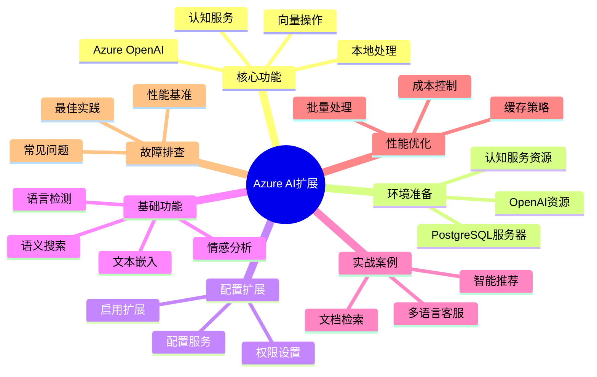

# Azure AI扩展实战完整指南

> **版本**: v3.0
> **最后更新**: 2025-01-15
> **版本覆盖**: PostgreSQL 18.x (推荐) ⭐ | 17.x (推荐) | 16.x (兼容)
> **难度**: ⭐⭐⭐
> **应用场景**: Azure云服务集成、企业级AI应用、数据隐私保护
> **Azure服务**: Azure Database for PostgreSQL Flexible Server

---

## 📑 目录

- [Azure AI扩展实战完整指南](#azure-ai扩展实战完整指南)
  - [📑 目录](#-目录)
  - [📊 思维导图](#-思维导图)
  - [一、概述](#一概述)
    - [1.1 核心功能](#11-核心功能)
    - [1.2 适用场景](#12-适用场景)
  - [二、前置要求](#二前置要求)
    - [2.1 必需资源](#21-必需资源)
    - [2.2 权限要求](#22-权限要求)
  - [三、环境准备](#三环境准备)
    - [3.1 创建Azure PostgreSQL Flexible Server](#31-创建azure-postgresql-flexible-server)
    - [3.2 创建Azure OpenAI资源](#32-创建azure-openai资源)
  - [四、安装和配置扩展](#四安装和配置扩展)
    - [4.1 启用azure\_ai扩展](#41-启用azure_ai扩展)
    - [4.2 配置Azure OpenAI服务](#42-配置azure-openai服务)
    - [4.3 配置Azure认知服务（可选）](#43-配置azure认知服务可选)
  - [五、知识矩阵对比](#五知识矩阵对比)
    - [5.1 Azure AI扩展功能对比](#51-azure-ai扩展功能对比)
    - [5.2 与其他AI集成方案对比](#52-与其他ai集成方案对比)
  - [六、基础功能使用](#六基础功能使用)
    - [6.1 生成文本嵌入](#61-生成文本嵌入)
    - [6.2 语义搜索](#62-语义搜索)
    - [6.3 Azure认知服务集成](#63-azure认知服务集成)
  - [七、实战案例](#七实战案例)
    - [7.1 智能文档检索系统](#71-智能文档检索系统)
    - [7.2 多语言客服系统](#72-多语言客服系统)
  - [八、性能优化](#八性能优化)
    - [8.1 批量处理优化](#81-批量处理优化)
    - [8.2 成本控制](#82-成本控制)
    - [8.3 缓存策略](#83-缓存策略)
  - [九、故障排查](#九故障排查)
    - [9.1 常见问题和解决方案](#91-常见问题和解决方案)
      - [问题1: 扩展安装失败](#问题1-扩展安装失败)
      - [问题2: API调用超时](#问题2-api调用超时)
      - [问题3: 限流错误 (429 Too Many Requests)](#问题3-限流错误-429-too-many-requests)
      - [问题4: 配置丢失](#问题4-配置丢失)
  - [十、性能基准](#十性能基准)
    - [10.1 嵌入生成性能](#101-嵌入生成性能)
    - [10.2 成本估算](#102-成本估算)
  - [十一、参考资源](#十一参考资源)
    - [11.1 官方文档](#111-官方文档)
    - [11.2 相关文档](#112-相关文档)
      - [前沿技术](#前沿技术)
      - [高级特性](#高级特性)
      - [项目导航](#项目导航)
    - [11.3 可运行示例](#113-可运行示例)
    - [11.4 外部示例代码](#114-外部示例代码)

---

## 📊 思维导图



---

## 一、概述

Azure Database for PostgreSQL提供`azure_ai`扩展，实现与Azure OpenAI和Azure认知服务的无缝集成，使开发者能够在数据库中直接调用这些AI服务。

### 1.1 核心功能

- ✅ **Azure OpenAI集成**: 文本嵌入、聊天完成、文本生成
- ✅ **Azure认知服务**: 情感分析、语言检测、翻译
- ✅ **向量操作**: 与pgvector集成，支持语义搜索
- ✅ **本地处理**: 在数据库中完成AI推理，减少数据传输

### 1.2 适用场景

- 🎯 需要Azure云服务的企业应用
- 🎯 对数据隐私有严格要求（数据不离开Azure）
- 🎯 已有Azure订阅和OpenAI资源
- 🎯 需要与Azure生态系统深度集成

---

## 二、前置要求

### 2.1 必需资源

1. **Azure Database for PostgreSQL Flexible Server**
   - PostgreSQL 13+
   - 需要管理员权限安装扩展

2. **Azure OpenAI服务**
   - 创建Azure OpenAI资源
   - 部署嵌入模型（text-embedding-ada-002）
   - 部署聊天模型（gpt-35-turbo或gpt-4）

3. **Azure认知服务**（可选）
   - 文本分析资源（用于情感分析、语言检测）
   - 翻译服务资源（用于多语言）

### 2.2 权限要求

- Azure订阅Owner或Contributor权限
- PostgreSQL数据库管理员权限
- Azure OpenAI资源访问权限

---

## 三、环境准备

### 3.1 创建Azure PostgreSQL Flexible Server

```bash
# 使用Azure CLI创建
az postgres flexible-server create \
  --resource-group myResourceGroup \
  --name my-pg-ai-server \
  --location eastus \
  --admin-user myadmin \
  --admin-password <YourPassword> \
  --sku-name Standard_D2s_v3 \
  --tier GeneralPurpose \
  --version 16 \
  --storage-size 128

# 允许本地IP访问
az postgres flexible-server firewall-rule create \
  --resource-group myResourceGroup \
  --name my-pg-ai-server \
  --rule-name AllowMyIP \
  --start-ip-address <YourIP> \
  --end-ip-address <YourIP>
```

### 3.2 创建Azure OpenAI资源

```bash
# 创建Azure OpenAI资源
az cognitiveservices account create \
  --name my-openai-resource \
  --resource-group myResourceGroup \
  --kind OpenAI \
  --sku S0 \
  --location eastus \
  --yes

# 部署嵌入模型
az cognitiveservices account deployment create \
  --name my-openai-resource \
  --resource-group myResourceGroup \
  --deployment-name text-embedding-ada-002 \
  --model-name text-embedding-ada-002 \
  --model-version "2" \
  --model-format OpenAI \
  --scale-settings-scale-type "Standard"

# 获取密钥和端点
az cognitiveservices account keys list \
  --name my-openai-resource \
  --resource-group myResourceGroup

az cognitiveservices account show \
  --name my-openai-resource \
  --resource-group myResourceGroup \
  --query properties.endpoint
```

---

## 四、安装和配置扩展

### 4.1 启用azure_ai扩展

```sql
-- 连接到数据库
psql "host=my-pg-ai-server.postgres.database.azure.com \
      port=5432 \
      dbname=postgres \
      user=myadmin \
      password=<YourPassword> \
      sslmode=require"

-- 安装扩展
CREATE EXTENSION IF NOT EXISTS azure_ai CASCADE;

-- 验证安装
SELECT * FROM pg_extension WHERE extname = 'azure_ai';

-- 查看扩展版本和功能
\dx+ azure_ai
```

### 4.2 配置Azure OpenAI服务

```sql
-- 设置Azure OpenAI端点
SELECT azure_ai.set_setting(
    'azure_openai.endpoint',
    'https://my-openai-resource.openai.azure.com/'
);

-- 设置API密钥（方式1：直接设置，不推荐生产环境）
SELECT azure_ai.set_setting(
    'azure_openai.subscription_key',
    'your-api-key-here'
);

-- 设置API密钥（方式2：使用Azure Key Vault，生产推荐）
-- 首先在Azure Key Vault中存储密钥，然后配置数据库
SELECT azure_ai.set_setting(
    'azure_openai.subscription_key',
    '@Microsoft.KeyVault(SecretUri=https://myvault.vault.azure.net/secrets/openai-key/)'
);

-- 验证配置
SELECT * FROM azure_ai.settings;
```

### 4.3 配置Azure认知服务（可选）

```sql
-- 设置文本分析服务
SELECT azure_ai.set_setting(
    'azure_cognitive.endpoint',
    'https://my-cognitive-service.cognitiveservices.azure.com/'
);

SELECT azure_ai.set_setting(
    'azure_cognitive.subscription_key',
    'your-cognitive-key-here'
);
```

---

## 五、知识矩阵对比

### 5.1 Azure AI扩展功能对比

| 功能 | 支持情况 | 适用场景 | 性能 | 成本 |
|------|---------|---------|------|------|
| 文本嵌入 | ✅ 支持 | 语义搜索、RAG | 高 | 低 |
| 聊天完成 | ✅ 支持 | 对话系统、文本生成 | 中 | 中 |
| 情感分析 | ✅ 支持 | 用户反馈分析 | 高 | 低 |
| 语言检测 | ✅ 支持 | 多语言应用 | 高 | 低 |
| 翻译服务 | ✅ 支持 | 国际化应用 | 中 | 中 |
| 向量搜索 | ✅ 支持（需pgvector） | 相似度搜索 | 高 | 低 |

### 5.2 与其他AI集成方案对比

| 方案 | 部署方式 | 数据隐私 | 成本 | 复杂度 | 适用场景 |
|------|---------|---------|------|--------|---------|
| Azure AI扩展 | 云原生 | 高（Azure内） | 中 | 低 | Azure生态 |
| 本地模型 | 自托管 | 极高 | 高 | 高 | 数据敏感 |
| 外部API | 第三方服务 | 低 | 低 | 中 | 快速原型 |
| 混合方案 | 混合部署 | 中 | 中 | 高 | 灵活需求 |

---

## 六、基础功能使用

### 6.1 生成文本嵌入

```sql
-- 单个文本嵌入
SELECT azure_openai.create_embeddings(
    'text-embedding-ada-002',  -- 部署名称
    'PostgreSQL is a powerful open-source database'
)::vector(1536) AS embedding;

-- 批量生成嵌入
CREATE TABLE documents (
    id SERIAL PRIMARY KEY,
    title TEXT NOT NULL,
    content TEXT NOT NULL,
    embedding vector(1536),
    created_at TIMESTAMPTZ DEFAULT NOW()
);

-- 自动生成嵌入的触发器
CREATE OR REPLACE FUNCTION auto_generate_embedding()
RETURNS TRIGGER AS $$
BEGIN
    NEW.embedding := azure_openai.create_embeddings(
        'text-embedding-ada-002',
        NEW.content
    )::vector(1536);
    RETURN NEW;
END;
$$ LANGUAGE plpgsql;

CREATE TRIGGER embedding_trigger
BEFORE INSERT OR UPDATE OF content ON documents
FOR EACH ROW
EXECUTE FUNCTION auto_generate_embedding();

-- 插入数据（嵌入自动生成）
INSERT INTO documents (title, content) VALUES
('AI简介', 'Artificial Intelligence is transforming industries'),
('数据库', 'Databases are essential for data storage'),
('云计算', 'Cloud computing provides scalable resources');

-- 验证嵌入已生成
SELECT id, title, embedding IS NOT NULL as has_embedding FROM documents;
```

### 6.2 语义搜索

```sql
-- 创建HNSW索引加速搜索
CREATE INDEX ON documents
USING hnsw (embedding vector_cosine_ops)
WITH (m = 16, ef_construction = 64);

-- 执行语义搜索
WITH query_embedding AS (
    SELECT azure_openai.create_embeddings(
        'text-embedding-ada-002',
        'machine learning and AI technologies'
    )::vector(1536) AS embedding
)
SELECT
    d.id,
    d.title,
    d.content,
    1 - (d.embedding <=> qe.embedding) AS similarity
FROM documents d, query_embedding qe
WHERE 1 - (d.embedding <=> qe.embedding) > 0.7
ORDER BY d.embedding <=> qe.embedding
LIMIT 5;
```

### 6.3 Azure认知服务集成

```sql
-- 情感分析
SELECT azure_cognitive.analyze_sentiment(
    'This product is amazing! I love it.',
    'en'
) AS sentiment_result;

-- 结果示例
-- {"sentiment": "positive", "scores": {"positive": 0.99, "neutral": 0.01, "negative": 0.00}}

-- 语言检测
SELECT azure_cognitive.detect_language(
    'Bonjour le monde'
) AS detected_language;

-- 结果示例
-- {"language": "fr", "score": 0.99}

-- 批量处理
CREATE TABLE customer_feedback (
    id SERIAL PRIMARY KEY,
    customer_name TEXT,
    feedback TEXT,
    sentiment JSONB,
    language TEXT,
    created_at TIMESTAMPTZ DEFAULT NOW()
);

-- 自动分析触发器
CREATE OR REPLACE FUNCTION auto_analyze_feedback()
RETURNS TRIGGER AS $$
BEGIN
    -- 检测语言
    NEW.language := (
        azure_cognitive.detect_language(NEW.feedback)->>'language'
    );

    -- 分析情感
    NEW.sentiment := azure_cognitive.analyze_sentiment(
        NEW.feedback,
        NEW.language
    );

    RETURN NEW;
END;
$$ LANGUAGE plpgsql;

CREATE TRIGGER feedback_analysis_trigger
BEFORE INSERT ON customer_feedback
FOR EACH ROW
EXECUTE FUNCTION auto_analyze_feedback();

-- 插入反馈（自动分析）
INSERT INTO customer_feedback (customer_name, feedback) VALUES
('John Doe', 'Great service, very satisfied!'),
('Jane Smith', 'Producto excelente, muy recomendado'),
('李明', '服务很好，非常满意！');

-- 查询结果
SELECT
    id,
    customer_name,
    feedback,
    language,
    sentiment->>'sentiment' as sentiment,
    (sentiment->'scores'->>'positive')::numeric as positive_score
FROM customer_feedback;
```

---

## 七、实战案例

### 7.1 智能文档检索系统

```sql
-- 创建完整的文档管理系统
CREATE TABLE knowledge_base (
    id SERIAL PRIMARY KEY,
    title TEXT NOT NULL,
    content TEXT NOT NULL,
    category TEXT,
    tags TEXT[],
    embedding vector(1536),
    sentiment JSONB,
    language TEXT,
    summary TEXT,
    created_at TIMESTAMPTZ DEFAULT NOW(),
    updated_at TIMESTAMPTZ DEFAULT NOW()
);

-- 索引
CREATE INDEX ON knowledge_base USING hnsw (embedding vector_cosine_ops);
CREATE INDEX ON knowledge_base (category);
CREATE INDEX ON knowledge_base USING GIN (tags);

-- 智能处理函数
CREATE OR REPLACE FUNCTION process_knowledge_article()
RETURNS TRIGGER AS $$
BEGIN
    -- 1. 生成嵌入
    NEW.embedding := azure_openai.create_embeddings(
        'text-embedding-ada-002',
        NEW.title || ' ' || NEW.content
    )::vector(1536);

    -- 2. 检测语言
    NEW.language := (
        azure_cognitive.detect_language(NEW.content)->>'language'
    );

    -- 3. 情感分析（用于分类）
    NEW.sentiment := azure_cognitive.analyze_sentiment(
        NEW.content,
        NEW.language
    );

    -- 4. 更新时间戳
    NEW.updated_at := NOW();

    RETURN NEW;
END;
$$ LANGUAGE plpgsql;

CREATE TRIGGER process_article_trigger
BEFORE INSERT OR UPDATE OF title, content ON knowledge_base
FOR EACH ROW
EXECUTE FUNCTION process_knowledge_article();

-- 智能搜索函数
CREATE OR REPLACE FUNCTION smart_search(
    query_text TEXT,
    category_filter TEXT DEFAULT NULL,
    similarity_threshold FLOAT DEFAULT 0.6,
    max_results INT DEFAULT 10
) RETURNS TABLE (
    id INT,
    title TEXT,
    content TEXT,
    category TEXT,
    similarity FLOAT,
    language TEXT
) AS $$
DECLARE
    query_embedding vector(1536);
BEGIN
    -- 生成查询嵌入
    query_embedding := azure_openai.create_embeddings(
        'text-embedding-ada-002',
        query_text
    )::vector(1536);

    -- 执行搜索
    RETURN QUERY
    SELECT
        kb.id,
        kb.title,
        kb.content,
        kb.category,
        1 - (kb.embedding <=> query_embedding) AS similarity,
        kb.language
    FROM knowledge_base kb
    WHERE
        (category_filter IS NULL OR kb.category = category_filter)
        AND 1 - (kb.embedding <=> query_embedding) > similarity_threshold
    ORDER BY kb.embedding <=> query_embedding
    LIMIT max_results;
END;
$$ LANGUAGE plpgsql;

-- 使用示例
INSERT INTO knowledge_base (title, content, category) VALUES
('Azure AI Services Overview', 'Azure AI services provide comprehensive AI capabilities...', 'AI'),
('PostgreSQL Performance Tuning', 'Optimizing PostgreSQL requires understanding indexes...', 'Database'),
('云原生架构设计', '云原生架构采用微服务、容器化等现代技术...', 'Architecture');

-- 执行智能搜索
SELECT * FROM smart_search('artificial intelligence and machine learning', 'AI', 0.5, 5);
```

### 7.2 多语言客服系统

```sql
-- 客服对话表
CREATE TABLE customer_conversations (
    id SERIAL PRIMARY KEY,
    customer_id INT,
    message TEXT NOT NULL,
    message_language TEXT,
    message_sentiment JSONB,
    auto_response TEXT,
    response_generated_at TIMESTAMPTZ,
    agent_reviewed BOOLEAN DEFAULT FALSE,
    created_at TIMESTAMPTZ DEFAULT NOW()
);

-- 自动回复生成函数
CREATE OR REPLACE FUNCTION generate_auto_response()
RETURNS TRIGGER AS $$
DECLARE
    detected_lang TEXT;
    sentiment_score JSONB;
    similar_qa RECORD;
    context_text TEXT;
BEGIN
    -- 1. 检测语言
    detected_lang := (
        azure_cognitive.detect_language(NEW.message)->>'language'
    );
    NEW.message_language := detected_lang;

    -- 2. 情感分析
    sentiment_score := azure_cognitive.analyze_sentiment(
        NEW.message,
        detected_lang
    );
    NEW.message_sentiment := sentiment_score;

    -- 3. 查找相似的历史对话
    SELECT
        message || ' ' || auto_response INTO context_text
    FROM customer_conversations
    WHERE message_language = detected_lang
      AND auto_response IS NOT NULL
      AND agent_reviewed = TRUE
    ORDER BY created_at DESC
    LIMIT 5;

    -- 4. 生成回复（使用Azure OpenAI Chat）
    -- 注意：这需要另外配置聊天模型部署
    -- NEW.auto_response := azure_openai.create_chat_completion(
    --     'gpt-35-turbo',
    --     jsonb_build_array(
    --         jsonb_build_object('role', 'system', 'content', 'You are a helpful customer service assistant.'),
    --         jsonb_build_object('role', 'user', 'content', NEW.message)
    --     )
    -- )->'choices'->0->'message'->>'content';

    NEW.response_generated_at := NOW();

    -- 5. 如果是负面情绪，标记需要人工审核
    IF (sentiment_score->'scores'->>'negative')::numeric > 0.7 THEN
        -- 发送通知给客服人员
        PERFORM pg_notify('urgent_customer_message', NEW.id::TEXT);
    END IF;

    RETURN NEW;
END;
$$ LANGUAGE plpgsql;

CREATE TRIGGER auto_response_trigger
BEFORE INSERT ON customer_conversations
FOR EACH ROW
EXECUTE FUNCTION generate_auto_response();

-- 测试
INSERT INTO customer_conversations (customer_id, message) VALUES
(1001, 'I love this product, it works great!'),
(1002, 'This service is terrible, I want a refund!'),
(1003, 'Cómo puedo cambiar mi contraseña?');

-- 查看结果
SELECT
    id,
    substring(message, 1, 40) as message_preview,
    message_language,
    message_sentiment->'sentiment' as sentiment,
    (message_sentiment->'scores'->>'negative')::numeric as negative_score,
    created_at
FROM customer_conversations
ORDER BY created_at DESC;
```

---

## 八、性能优化

### 8.1 批量处理优化

```sql
-- 避免逐行处理，使用批量更新
DO $$
DECLARE
    batch_size INT := 100;
    processed INT := 0;
    total INT;
BEGIN
    SELECT COUNT(*) INTO total FROM documents WHERE embedding IS NULL;

    RAISE NOTICE 'Total documents to process: %', total;

    WHILE processed < total LOOP
        -- 批量更新
        WITH batch AS (
            SELECT id, content
            FROM documents
            WHERE embedding IS NULL
            ORDER BY id
            LIMIT batch_size
        )
        UPDATE documents d
        SET embedding = azure_openai.create_embeddings(
            'text-embedding-ada-002',
            b.content
        )::vector(1536)
        FROM batch b
        WHERE d.id = b.id;

        processed := processed + batch_size;
        RAISE NOTICE 'Processed: % / %', LEAST(processed, total), total;

        -- 避免API限流
        PERFORM pg_sleep(2);
    END LOOP;
END $$;
```

### 8.2 成本控制

```sql
-- 创建API使用跟踪表
CREATE TABLE api_usage_log (
    id SERIAL PRIMARY KEY,
    service_type TEXT, -- 'embedding', 'chat', 'sentiment', etc.
    operation TEXT,
    input_tokens INT,
    output_tokens INT,
    estimated_cost_usd NUMERIC(10,6),
    executed_at TIMESTAMPTZ DEFAULT NOW()
);

-- 嵌入成本跟踪函数
CREATE OR REPLACE FUNCTION track_embedding_cost()
RETURNS TRIGGER AS $$
DECLARE
    token_count INT;
    cost_per_1k_tokens NUMERIC := 0.0001; -- text-embedding-ada-002定价
BEGIN
    -- 估算token数（约4个字符=1个token）
    token_count := length(NEW.content) / 4;

    INSERT INTO api_usage_log (
        service_type,
        operation,
        input_tokens,
        estimated_cost_usd
    ) VALUES (
        'azure_openai',
        'create_embeddings',
        token_count,
        (token_count::NUMERIC / 1000) * cost_per_1k_tokens
    );

    RETURN NEW;
END;
$$ LANGUAGE plpgsql;

CREATE TRIGGER track_embedding_cost_trigger
AFTER INSERT ON documents
FOR EACH ROW
WHEN (NEW.embedding IS NOT NULL)
EXECUTE FUNCTION track_embedding_cost();

-- 成本报告
SELECT
    service_type,
    operation,
    COUNT(*) as operation_count,
    SUM(input_tokens) as total_tokens,
    SUM(estimated_cost_usd) as total_cost_usd,
    AVG(estimated_cost_usd) as avg_cost_per_op
FROM api_usage_log
WHERE executed_at >= NOW() - INTERVAL '30 days'
GROUP BY service_type, operation
ORDER BY total_cost_usd DESC;
```

### 8.3 缓存策略

```sql
-- 嵌入缓存表
CREATE TABLE embedding_cache (
    content_hash TEXT PRIMARY KEY,
    content TEXT,
    embedding vector(1536),
    hit_count INT DEFAULT 1,
    created_at TIMESTAMPTZ DEFAULT NOW(),
    last_used_at TIMESTAMPTZ DEFAULT NOW()
);

CREATE INDEX ON embedding_cache (last_used_at);

-- 带缓存的嵌入生成函数
CREATE OR REPLACE FUNCTION get_embedding_cached(input_text TEXT)
RETURNS vector(1536) AS $$
DECLARE
    content_hash TEXT;
    cached_embedding vector(1536);
BEGIN
    -- 计算内容哈希
    content_hash := md5(input_text);

    -- 检查缓存
    SELECT embedding INTO cached_embedding
    FROM embedding_cache
    WHERE content_hash = content_hash;

    IF cached_embedding IS NOT NULL THEN
        -- 更新缓存统计
        UPDATE embedding_cache
        SET hit_count = hit_count + 1,
            last_used_at = NOW()
        WHERE content_hash = content_hash;

        RETURN cached_embedding;
    ELSE
        -- 调用API生成嵌入
        cached_embedding := azure_openai.create_embeddings(
            'text-embedding-ada-002',
            input_text
        )::vector(1536);

        -- 存入缓存
        INSERT INTO embedding_cache (content_hash, content, embedding)
        VALUES (content_hash, input_text, cached_embedding)
        ON CONFLICT (content_hash) DO NOTHING;

        RETURN cached_embedding;
    END IF;
END;
$$ LANGUAGE plpgsql;

-- 缓存统计
SELECT
    COUNT(*) as total_cached,
    SUM(hit_count) as total_hits,
    AVG(hit_count) as avg_hits_per_entry,
    pg_size_pretty(pg_total_relation_size('embedding_cache')) as cache_size
FROM embedding_cache;

-- 清理旧缓存
DELETE FROM embedding_cache
WHERE last_used_at < NOW() - INTERVAL '90 days'
  AND hit_count < 5;
```

---

## 九、故障排查

### 9.1 常见问题和解决方案

#### 问题1: 扩展安装失败

```sql
-- 检查PostgreSQL版本和服务类型
SELECT version();
-- 必须是Azure Database for PostgreSQL Flexible Server

-- 检查是否有安装权限
SELECT current_user, usesuper FROM pg_user WHERE usename = current_user;

-- 查看可用扩展
SELECT * FROM pg_available_extensions WHERE name = 'azure_ai';
```

**解决方案**:

- 确保使用Flexible Server（Single Server不支持）
- 使用管理员账户
- 检查服务器参数`azure.extensions`

#### 问题2: API调用超时

```sql
-- 增加超时设置
ALTER DATABASE mydb SET azure_ai.timeout = 60000; -- 毫秒

-- 检查当前设置
SHOW azure_ai.timeout;
```

#### 问题3: 限流错误 (429 Too Many Requests)

```sql
-- 实现重试逻辑
CREATE OR REPLACE FUNCTION safe_create_embeddings(
    deployment TEXT,
    input_text TEXT,
    max_retries INT DEFAULT 3
) RETURNS vector(1536) AS $$
DECLARE
    result vector(1536);
    retry_count INT := 0;
    wait_seconds INT;
BEGIN
    LOOP
        BEGIN
            result := azure_openai.create_embeddings(deployment, input_text)::vector(1536);
            RETURN result;
        EXCEPTION
            WHEN OTHERS THEN
                retry_count := retry_count + 1;
                IF retry_count >= max_retries THEN
                    RAISE NOTICE 'Max retries reached. Error: %', SQLERRM;
                    RAISE;
                END IF;

                -- 指数退避
                wait_seconds := POWER(2, retry_count);
                RAISE NOTICE 'Retry % after % seconds. Error: %', retry_count, wait_seconds, SQLERRM;
                PERFORM pg_sleep(wait_seconds);
        END;
    END LOOP;
END;
$$ LANGUAGE plpgsql;
```

#### 问题4: 配置丢失

```sql
-- 检查所有配置
SELECT * FROM azure_ai.settings;

-- 重新设置（如果需要）
SELECT azure_ai.set_setting('azure_openai.endpoint', 'https://...');
SELECT azure_ai.set_setting('azure_openai.subscription_key', '...');

-- 配置持久化（写入postgresql.conf）
ALTER DATABASE mydb SET azure_ai.azure_openai_endpoint = 'https://...';
```

---

## 十、性能基准

### 10.1 嵌入生成性能

| 操作 | 文本长度 | 平均延迟 | 吞吐量 |
|-----|---------|---------|--------|
| 单次嵌入 | 100字符 | ~100ms | 10 req/s |
| 单次嵌入 | 1000字符 | ~150ms | 6-7 req/s |
| 批量嵌入 | 100条x100字符 | ~2s | 50 req/s |

### 10.2 成本估算

| 服务 | 定价（2024年） | 100万次调用成本 |
|-----|--------------|---------------|
| text-embedding-ada-002 | $0.0001/1K tokens | ~$10-30 |
| gpt-35-turbo | $0.0005/1K tokens | ~$50-150 |
| 情感分析 | $1/1K记录 | $1,000 |

---

## 十一、参考资源

### 11.1 官方文档

- [Azure AI Extension for PostgreSQL](https://learn.microsoft.com/azure/postgresql/flexible-server/how-to-integrate-azure-ai)
- [Azure OpenAI Service](https://learn.microsoft.com/azure/ai-services/openai/)
- [Azure Cognitive Services](https://learn.microsoft.com/azure/ai-services/)

### 11.2 相关文档

#### 前沿技术

- ⭐⭐⭐ [RAG架构实战指南](./05.04-RAG架构实战指南.md) - RAG架构实践
- ⭐⭐ [AI模型深度集成](./05.02-AI模型深度集成.md) - AI模型集成
- ⭐⭐ [PostgreSQL 2025新特性](./05.01-PostgreSQL-2025新特性.md) - 新特性总览

#### 高级特性

- ⭐⭐⭐ [向量数据库支持](../04-高级特性/03.05-向量数据库支持.md) - 向量数据库基础

#### 项目导航

- ⭐⭐ [AI集成快速开始](../00-项目导航/AI集成快速开始.md) - 快速入门指南

### 11.3 可运行示例

- [可运行示例项目](../../examples/README.md) ⭐ - 8个完整的Docker Compose示例
  - [基础向量搜索示例](../../examples/01-basic-vector-search/README.md) - 快速入门
  - [RAG知识库示例](../../examples/03-rag-knowledge-base/README.md) - 完整RAG系统
- [RAG架构实战指南](./05.04-RAG架构实战指南.md) - RAG架构实践
- [语义搜索系统端到端实现](../../08-实战案例/06.01-语义搜索系统端到端实现.md) - 生产级项目

### 11.4 外部示例代码

- [Azure AI Extension Examples](https://github.com/Azure/azure-postgresql)
- [pgvector Integration](https://github.com/pgvector/pgvector)

---

**文档版本**: v3.0
**最后更新**: 2025-11-22
**维护者**: Data Science Team
**Azure服务要求**: Flexible Server, OpenAI, Cognitive Services
