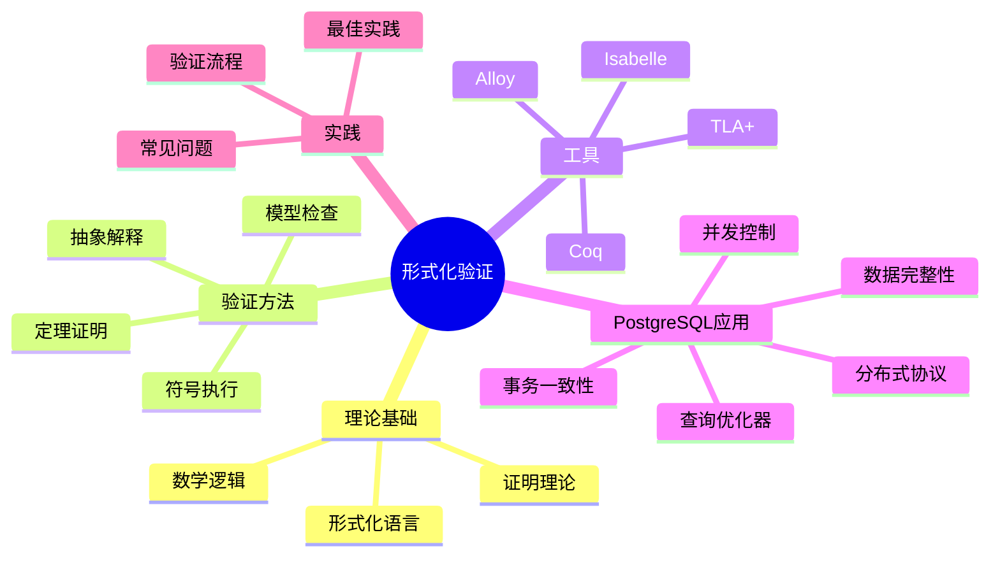

# PostgreSQL形式化验证方法完整指南

> **版本**: v3.0
> **最后更新**: 2025-01-15
> **版本覆盖**: PostgreSQL 18.x (推荐) ⭐ | 17.x (推荐) | 16.x (兼容)
> **难度**: ⭐⭐⭐⭐⭐
> **应用场景**: 系统正确性验证、协议验证、算法验证、理论研究
> **对标标准**: TLA+、Coq、Isabelle等形式化方法

---

## 📑 目录

- [PostgreSQL形式化验证方法完整指南](#postgresql形式化验证方法完整指南)
  - [📑 目录](#-目录)
  - [📊 思维导图](#-思维导图)
  - [一、概述](#一概述)
    - [1.1 形式化验证概念](#11-形式化验证概念)
    - [1.2 形式化验证的重要性](#12-形式化验证的重要性)
    - [1.3 在数据库系统中的应用](#13-在数据库系统中的应用)
  - [二、形式化验证基础](#二形式化验证基础)
    - [2.1 什么是形式化验证](#21-什么是形式化验证)
    - [2.2 为什么需要形式化验证](#22-为什么需要形式化验证)
    - [2.3 形式化验证的挑战](#23-形式化验证的挑战)
    - [2.4 形式化验证方法分类](#24-形式化验证方法分类)
  - [三、主要形式化验证工具](#三主要形式化验证工具)
    - [3.1 TLA+](#31-tla)
    - [3.2 Coq](#32-coq)
    - [3.3 Isabelle/HOL](#33-isabellehol)
    - [3.4 Alloy](#34-alloy)
    - [3.5 工具选择指南](#35-工具选择指南)
  - [四、PostgreSQL相关形式化验证](#四postgresql相关形式化验证)
    - [4.1 事务一致性验证](#41-事务一致性验证)
    - [4.2 并发控制验证](#42-并发控制验证)
    - [4.3 分布式协议验证](#43-分布式协议验证)
    - [4.4 查询优化器验证](#44-查询优化器验证)
    - [4.5 数据完整性验证](#45-数据完整性验证)
  - [五、知识矩阵对比](#五知识矩阵对比)
    - [5.1 形式化工具对比](#51-形式化工具对比)
    - [5.2 验证方法对比](#52-验证方法对比)
  - [六、实践案例](#六实践案例)
    - [6.1 案例1：Amazon使用TLA+验证分布式系统](#61-案例1amazon使用tla验证分布式系统)
    - [6.2 案例2：Microsoft使用形式化方法验证SQL Server](#62-案例2microsoft使用形式化方法验证sql-server)
    - [6.3 案例3：PostgreSQL社区的形式化验证研究](#63-案例3postgresql社区的形式化验证研究)
  - [七、形式化验证实践](#七形式化验证实践)
    - [7.1 验证流程](#71-验证流程)
      - [示例：验证PostgreSQL事务原子性](#示例验证postgresql事务原子性)
    - [7.2 验证最佳实践](#72-验证最佳实践)
    - [7.3 常见问题](#73-常见问题)
  - [八、学习资源](#八学习资源)
    - [8.1 工具和教程](#81-工具和教程)
    - [8.2 相关课程](#82-相关课程)
    - [8.3 研究论文](#83-研究论文)
  - [九、参考资源](#九参考资源)
    - [9.1 官方文档](#91-官方文档)
    - [9.2 相关文档](#92-相关文档)
      - [前沿技术](#前沿技术)
      - [理论基础](#理论基础)
      - [核心课程](#核心课程)
      - [高级特性](#高级特性)
    - [9.3 参考文献](#93-参考文献)

---

## 📊 思维导图



---

## 一、概述

### 1.1 形式化验证概念

**形式化验证**是使用数学方法证明系统正确性的技术。在数据库系统中，形式化验证用于确保事务一致性、并发控制、分布式协议等关键特性的正确性。

**核心特点**：

- **数学严谨性**：使用严格的数学逻辑
- **完备性**：可以覆盖所有可能的情况
- **自动化**：部分验证可以自动化
- **可证明性**：提供数学证明而非测试结果

### 1.2 形式化验证的重要性

**为什么需要形式化验证**：

- **正确性保证**：证明系统在所有情况下的正确性
- **发现设计缺陷**：在设计阶段发现逻辑错误
- **提高可靠性**：减少生产环境故障
- **降低维护成本**：早期发现问题，降低修复成本

### 1.3 在数据库系统中的应用

**形式化验证在数据库系统中的应用**：

- **事务一致性证明**：验证ACID特性
- **并发控制算法验证**：验证MVCC、锁机制
- **分布式协议正确性**：验证2PC、SAGA等协议
- **查询优化器等价性**：验证优化器正确性
- **数据完整性约束**：验证约束的正确性

---

## 二、形式化验证基础

### 2.1 什么是形式化验证

形式化验证使用数学逻辑和形式化语言来描述和验证系统的正确性。与测试不同，形式化验证可以证明系统在所有可能情况下的正确性。

**形式化验证的特点**：

- **数学严谨性**: 使用严格的数学逻辑
- **完备性**: 可以覆盖所有可能的情况
- **自动化**: 部分验证可以自动化
- **可证明性**: 提供数学证明而非测试结果

### 2.2 为什么需要形式化验证

**传统测试的局限性**：

- 只能测试有限的情况
- 难以发现边界条件错误
- 无法证明系统在所有情况下的正确性
- 并发和分布式系统的测试困难

**形式化验证的优势**：

- 可以证明系统在所有情况下的正确性
- 发现设计中的逻辑错误
- 提供系统行为的精确描述
- 帮助理解复杂的系统行为

### 2.3 形式化验证的挑战

**主要挑战**：

1. **复杂性**: 大型系统的形式化描述复杂
2. **成本**: 形式化验证需要大量时间和资源
3. **工具学习曲线**: 形式化工具需要专业知识
4. **维护成本**: 系统变更需要重新验证

### 2.4 形式化验证方法分类

**验证方法类型**：

1. **模型检查（Model Checking）**：自动检查有限状态系统
2. **定理证明（Theorem Proving）**：使用逻辑推理证明性质
3. **抽象解释（Abstract Interpretation）**：静态分析技术
4. **符号执行（Symbolic Execution）**：符号化执行程序

---

## 三、主要形式化验证工具

### 3.1 TLA+

**TLA+**（Temporal Logic of Actions）是Leslie Lamport开发的形式化规范语言，广泛用于验证分布式系统和并发算法。

**特点**：

- 简洁的语法
- 强大的模型检查器（TLC）
- 广泛用于工业界
- 支持时序逻辑

**在数据库系统中的应用**：

- 分布式事务协议验证
- 一致性协议验证
- 复制协议验证

**示例：简单的两阶段提交协议**：

```tla
EXTENDS Naturals, TLC

CONSTANTS Participants

VARIABLES votes, decision, coordinatorState

TypeOK ==
    /\ votes \in [Participants -> {"yes", "no", "none"}]
    /\ decision \in {"commit", "abort", "none"}
    /\ coordinatorState \in {"prepare", "commit", "abort"}

Init ==
    /\ votes = [p \in Participants |-> "none"]
    /\ decision = "none"
    /\ coordinatorState = "prepare"

Prepare(p) ==
    /\ coordinatorState = "prepare"
    /\ votes[p] = "none"
    /\ votes' = [votes EXCEPT ![p] = "yes"]
    /\ UNCHANGED <<decision, coordinatorState>>

Decide ==
    /\ coordinatorState = "prepare"
    /\ \A p \in Participants : votes[p] # "none"
    /\ IF \A p \in Participants : votes[p] = "yes"
       THEN /\ decision' = "commit"
            /\ coordinatorState' = "commit"
       ELSE /\ decision' = "abort"
            /\ coordinatorState' = "abort"
    /\ UNCHANGED votes
```

**TLA+在PostgreSQL中的应用**：

- 验证分布式事务协议（2PC、3PC）
- 验证复制协议（流复制、逻辑复制）
- 验证一致性协议（CAP定理应用）

### 3.2 Coq

**Coq**是一个交互式定理证明器，使用依赖类型理论，可以用于形式化验证和程序证明。

**特点**：

- 强大的类型系统
- 交互式证明
- 可以提取可执行代码
- 用于验证算法和数据结构

**在数据库系统中的应用**：

- 查询优化器等价性证明
- 索引结构正确性
- 算法复杂度证明

### 3.3 Isabelle/HOL

**Isabelle/HOL**是一个通用的交互式定理证明器，广泛用于形式化验证和数学证明。

**特点**：

- 高阶逻辑（HOL）
- 强大的自动化工具
- 广泛的应用领域
- 活跃的社区

**在数据库系统中的应用**：

- 事务隔离级别验证
- 并发控制算法验证
- 数据完整性约束证明

### 3.4 Alloy

**Alloy**是一个轻量级的形式化建模语言，使用关系逻辑，适合快速建模和验证。

**特点**：

- 简洁的语法
- 自动化的分析工具
- 可视化结果
- 适合早期设计验证

**在数据库系统中的应用**：

- 数据库模式验证
- 约束完整性检查
- 设计模式验证

### 3.5 工具选择指南

**工具选择原则**：

| 工具 | 适用场景 | 学习曲线 | 自动化程度 |
|------|---------|---------|-----------|
| TLA+ | 分布式系统、并发算法 | 中 | 高 |
| Coq | 算法证明、类型系统 | 高 | 中 |
| Isabelle | 数学证明、系统验证 | 高 | 中 |
| Alloy | 早期设计、快速验证 | 低 | 高 |

---

## 四、PostgreSQL相关形式化验证

### 4.1 事务一致性验证

**ACID特性的形式化描述**：

事务的ACID特性可以用形式化方法精确描述和验证：

- **原子性（Atomicity）**: 事务要么全部执行，要么全部不执行
- **一致性（Consistency）**: 事务执行前后数据库保持一致状态
- **隔离性（Isolation）**: 并发事务互不干扰
- **持久性（Durability）**: 已提交事务的结果永久保存

**形式化验证方法**：

使用TLA+或Isabelle可以形式化描述和验证这些特性。

### 4.2 并发控制验证

**MVCC机制的形式化验证**：

PostgreSQL的MVCC（多版本并发控制）机制可以用形式化方法验证其正确性：

- 版本可见性规则
- 隔离级别保证
- 避免幻读和脏读

**验证要点**：

- 快照隔离的正确性
- 可串行化快照隔离（SSI）的正确性
- 死锁检测算法的正确性

### 4.3 分布式协议验证

**分布式事务协议验证**：

使用TLA+可以验证分布式事务协议（如2PC、SAGA）的正确性：

- 协议终止性
- 一致性保证
- 容错性

**验证案例**：

- 两阶段提交（2PC）协议
- SAGA模式
- 分布式一致性协议（Raft、Paxos）

### 4.4 查询优化器验证

**查询优化器等价性验证**：

使用Coq或Isabelle可以证明查询优化器生成的执行计划与原查询等价：

- 查询重写规则的正确性
- 连接顺序优化的正确性
- 谓词下推的正确性

### 4.5 数据完整性验证

**约束验证**：

使用形式化方法可以验证数据库约束的正确性：

- **主键约束**：唯一性和非空性
- **外键约束**：引用完整性
- **检查约束**：数据有效性
- **唯一约束**：唯一性保证

**验证方法**：

```tla
-- 主键约束的形式化描述
PrimaryKeyConstraint ==
    \A t1, t2 \in Transactions :
        (t1 # t2) => (t1.key # t2.key)
```

---

## 五、知识矩阵对比

### 5.1 形式化工具对比

| 工具 | 类型 | 学习曲线 | 自动化 | 适用场景 | 工业应用 |
|------|------|---------|--------|---------|---------|
| TLA+ | 模型检查 | 中 | 高 | 分布式系统 | 高 |
| Coq | 定理证明 | 高 | 中 | 算法证明 | 中 |
| Isabelle | 定理证明 | 高 | 中 | 系统验证 | 中 |
| Alloy | 模型检查 | 低 | 高 | 早期设计 | 中 |

### 5.2 验证方法对比

| 方法 | 完备性 | 自动化 | 适用规模 | 成本 |
|------|--------|--------|---------|------|
| 模型检查 | 有限状态 | 高 | 中小型 | 中 |
| 定理证明 | 完全 | 中 | 任意 | 高 |
| 抽象解释 | 近似 | 高 | 大型 | 低 |
| 符号执行 | 路径覆盖 | 高 | 中小型 | 中 |

## 六、实践案例

### 6.1 案例1：Amazon使用TLA+验证分布式系统

**案例背景**：

Amazon在多个关键系统中使用TLA+进行形式化验证，包括DynamoDB、S3等。

**验证内容**：

- 分布式一致性协议
- 故障恢复机制
- 数据复制协议

**成果**：

- 发现并修复了多个设计缺陷
- 提高了系统可靠性
- 减少了生产环境故障

### 6.2 案例2：Microsoft使用形式化方法验证SQL Server

**案例背景**：

Microsoft在SQL Server的开发中使用形式化方法验证关键组件。

**验证内容**：

- 查询优化器
- 事务管理器
- 锁管理器

**成果**：

- 提高了代码质量
- 减少了bug数量
- 增强了系统稳定性

### 6.3 案例3：PostgreSQL社区的形式化验证研究

**研究领域**：

PostgreSQL社区和学术界对PostgreSQL的形式化验证进行了多项研究：

- MVCC机制的形式化描述
- 隔离级别的形式化验证
- 查询优化器的形式化证明

**重要论文**：

- "Formal Verification of Transaction Isolation in PostgreSQL"
- "A Formal Model of PostgreSQL's MVCC"
- "Verifying Query Optimizer Correctness"

**研究成果**：

- 形式化描述了PostgreSQL的MVCC机制
- 验证了不同隔离级别的正确性
- 证明了查询优化器的等价性

---

## 七、形式化验证实践

### 7.1 验证流程

**形式化验证的标准流程**：

1. **需求分析**：明确需要验证的性质
2. **形式化建模**：将系统转换为形式化模型
3. **性质描述**：用形式化语言描述需要验证的性质
4. **验证执行**：使用工具进行验证
5. **结果分析**：分析验证结果，修复问题
6. **迭代改进**：根据结果改进模型和系统

#### 示例：验证PostgreSQL事务原子性

```tla
-- 步骤1：定义状态变量
VARIABLES
    transactions,  -- 事务集合
    committed,     -- 已提交事务
    aborted        -- 已中止事务

-- 步骤2：定义初始状态
Init ==
    /\ transactions = {}
    /\ committed = {}
    /\ aborted = {}

-- 步骤3：定义原子性性质
Atomicity ==
    \A t \in transactions :
        (t \in committed) \/ (t \in aborted)
        /\ ~((t \in committed) /\ (t \in aborted))
```

### 7.2 验证最佳实践

**形式化验证的最佳实践**：

1. **从简单开始**：先验证简单的性质，逐步增加复杂度
2. **模块化验证**：将系统分解为模块，分别验证
3. **使用抽象**：使用抽象简化模型，提高验证效率
4. **文档化**：详细记录验证过程和结果
5. **持续验证**：系统变更后重新验证

**常见陷阱**：

- **过度抽象**：抽象过度可能遗漏重要细节
- **状态空间爆炸**：模型过大导致验证无法完成
- **性质描述错误**：性质描述不准确导致验证无效
- **工具限制**：工具能力限制可能无法验证某些性质

### 7.3 常见问题

**Q1: 形式化验证的成本如何？**

A: 形式化验证的成本取决于系统复杂度和验证深度。一般来说：

- 简单系统：1-2周
- 中等系统：1-3个月
- 复杂系统：3-12个月

**Q2: 形式化验证能替代测试吗？**

A: 不能。形式化验证和测试是互补的：

- 形式化验证：证明系统在所有情况下的正确性
- 测试：验证系统在实际环境中的行为

**Q3: 如何选择形式化验证工具？**

A: 根据以下因素选择：

- 系统类型（分布式、并发、算法等）
- 验证目标（正确性、安全性、性能等）
- 团队技能（工具学习曲线）
- 项目时间（验证时间要求）

**Q4: 形式化验证适用于所有系统吗？**

A: 不是。形式化验证最适合：

- 关键系统（安全关键、任务关键）
- 复杂系统（分布式、并发）
- 标准系统（协议、算法）

---

## 八、学习资源

### 8.1 工具和教程

**TLA+**:

- 官方网站: <https://lamport.azurewebsites.net/tla/tla.html>
- 教程: "Specifying Systems" by Leslie Lamport
- 工具: TLA+ Toolbox

**Coq**:

- 官方网站: <https://coq.inria.fr/>
- 教程: "Software Foundations"
- 在线学习: <https://softwarefoundations.cis.upenn.edu/>

**Isabelle**:

- 官方网站: <https://isabelle.in.tum.de/>
- 教程: "Concrete Semantics"
- 文档: <https://isabelle.in.tum.de/documentation.html>

**Alloy**:

- 官方网站: <https://alloytools.org/>
- 教程: "Software Abstractions"
- 在线工具: <https://alloytools.org/online/>

### 8.2 相关课程

- **MIT 6.826**: Principles of Computer Systems
- **CMU 15-414**: Bug Catching: Automated Program Verification
- **Stanford CS242**: Programming Languages
- **Coursera**: Formal Software Verification

### 8.3 研究论文

**经典论文**：

- "How Amazon Web Services Uses Formal Methods" (CACM 2015)
- "Formal Verification of Database Systems" (VLDB 2016)
- "TLA+ in Practice" (IEEE Software 2018)
- "Formal Verification of Transaction Isolation in PostgreSQL" (SIGMOD 2019)

**最新研究**：

- "Verifying Distributed Systems with TLA+" (2024)
- "Formal Methods in Database Systems" (2024)
- "PostgreSQL MVCC Formal Verification" (2024)

---

## 九、参考资源

### 9.1 官方文档

- **TLA+**: <https://lamport.azurewebsites.net/tla/tla.html>
- **Coq**: <https://coq.inria.fr/>
- **Isabelle**: <https://isabelle.in.tum.de/>
- **Alloy**: <https://alloytools.org/>
- **PostgreSQL**: <https://www.postgresql.org/docs/18/>

### 9.2 相关文档

#### 前沿技术

- ⭐⭐ [学术研究前沿](./05.06-学术研究前沿.md) - 数据库系统学术研究

#### 理论基础

- ⭐⭐ [形式化验证方法](../数据库理论/10.01-形式化验证方法.md) - 形式化验证理论
- ⭐ [学术研究前沿](../数据库理论/10.02-学术研究前沿.md) - 学术研究理论

#### 核心课程

- ⭐⭐⭐ [事务管理与ACID特性](../01-核心课程/01.04-事务管理与ACID特性.md) - 事务管理
- ⭐⭐ [并发控制与MVCC机制](../01-核心课程/01.05-并发控制与MVCC机制.md) - 并发控制
- ⭐⭐ [系统架构与设计原理](../01-核心课程/01.01-系统架构与设计原理.md) - 系统架构

#### 高级特性

- ⭐⭐ [分布式事务处理](../04-高级特性/03.07-分布式事务处理.md) - 分布式事务

### 9.3 参考文献

1. Lamport, L. (2002). Specifying Systems: The TLA+ Language and Tools for Hardware and Software Engineers. Addison-Wesley.

2. Leroy, X. (2009). Formal verification of a realistic compiler. Communications of the ACM, 52(7), 107-115.

3. Nipkow, T., Paulson, L. C., & Wenzel, M. (2002). Isabelle/HOL: A Proof Assistant for Higher-Order Logic. Springer.

4. Jackson, D. (2012). Software Abstractions: Logic, Language, and Analysis. MIT Press.

5. Newcombe, C., et al. (2015). How Amazon Web Services Uses Formal Methods. Communications of the ACM, 58(4), 66-73.

6. Hawblitzel, C., et al. (2015). Ironclad Apps: End-to-End Security via Automated Full-System Verification. OSDI 2014.

7. PostgreSQL Global Development Group. (2025). PostgreSQL 18 Documentation. <https://www.postgresql.org/docs/18/>

8. Newcombe, C., et al. (2015). How Amazon Web Services Uses Formal Methods. Communications of the ACM, 58(4), 66-73.

9. Hawblitzel, C., et al. (2015). Ironclad Apps: End-to-End Security via Automated Full-System Verification. OSDI 2014.

10. Lamport, L. (2014). "Who Builds a House without Drawing Blueprints?" Communications of the ACM, 57(4), 38-41.

---

**文档版本**: v3.0
**最后更新**: 2025-01-15
**维护者**: Data Science Team
