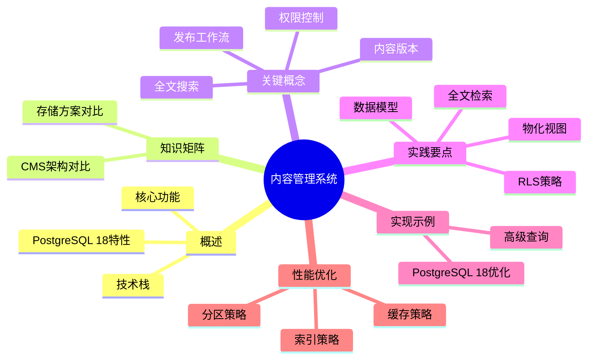

# PostgreSQL 内容管理系统实践

> **版本**: v3.0
> **最后更新**: 2025-01-15
> **版本覆盖**: PostgreSQL 18.x (推荐) ⭐ | 17.x (推荐) | 16.x (兼容)
> **文档状态**: ✅ 已更新
> **实践类型**: 内容管理系统（CMS）完整实现

## 📑 目录

- [PostgreSQL 内容管理系统实践](#postgresql-内容管理系统实践)
  - [📑 目录](#-目录)
  - [📊 思维导图](#-思维导图)
  - [一、概述](#一概述)
  - [二、知识矩阵对比](#二知识矩阵对比)
    - [2.1 CMS架构方案对比](#21-cms架构方案对比)
    - [2.2 内容存储方案对比](#22-内容存储方案对比)
  - [三、关键概念](#三关键概念)
  - [四、实践要点](#四实践要点)
  - [五、完整实现示例](#五完整实现示例)
    - [5.1 PostgreSQL 18 优化示例](#51-postgresql-18-优化示例)
    - [5.2 高级查询示例](#52-高级查询示例)
  - [六、性能优化](#六性能优化)
    - [6.1 索引策略](#61-索引策略)
    - [6.2 缓存策略](#62-缓存策略)
    - [6.3 分区策略](#63-分区策略)
  - [七、相关链接](#七相关链接)

---

## 📊 思维导图



---

## 一、概述

CMS 涉及作者/内容/版本/发布/检索/权限控制，PostgreSQL 可通过 JSONB、全文、RLS、分区与物化视图支撑高效实现。

**PostgreSQL 18 新特性支持**：

- ✅ **虚拟生成列**: 优化全文搜索索引和标签计算
- ✅ **异步I/O**: 提升大文件内容写入性能
- ✅ **改进的JSONB**: 更高效的内容元数据存储

---

## 二、知识矩阵对比

### 2.1 CMS架构方案对比

| 架构方案 | 优势 | 劣势 | 适用场景 | 复杂度 |
|---------|------|------|---------|--------|
| 单体架构 | 简单、易维护 | 扩展性差 | 小规模、内部使用 | ⭐ |
| 微服务架构 | 灵活、可扩展 | 运维复杂、数据一致性 | 大规模、多团队 | ⭐⭐⭐⭐ |
| 无头CMS | 前后端分离、灵活 | API设计复杂 | 多平台、多终端 | ⭐⭐⭐ |
| 传统CMS | 功能完整、易用 | 耦合度高、定制困难 | 内容为主、简单需求 | ⭐⭐ |

### 2.2 内容存储方案对比

| 存储方案 | 优势 | 劣势 | 适用场景 | PostgreSQL支持 |
|---------|------|------|---------|---------------|
| 关系型数据库 | ACID、事务、查询灵活 | 扩展性限制 | 结构化内容、复杂查询 | ✅ 原生支持 |
| NoSQL数据库 | 扩展性好、灵活 | 一致性弱、查询限制 | 非结构化、大规模 | ⚠️ 需要集成 |
| 文件系统 | 简单、直接 | 元数据管理难 | 静态内容、简单场景 | ⚠️ 需要集成 |
| 对象存储 | 扩展性好、成本低 | 查询能力弱 | 媒体文件、静态资源 | ⚠️ 需要集成 |
| 混合方案 | 综合优势 | 复杂度高 | 复杂场景、多类型内容 | ✅ 推荐方案 |

---

## 三、关键概念

- 内容版本：主表 + 版本表（审稿/回滚）
- 权限/RLS：作者自有、编辑审阅、公开发布
- 全文与标签：`tsvector`/`GIN` 与标签多对多
- 发布工作流：草稿 → 审核 → 发布 → 归档

## 四、实践要点

```sql
-- 模型
CREATE TABLE author (
  id bigserial PRIMARY KEY,
  name text NOT NULL
);
CREATE TABLE article (
  id bigserial PRIMARY KEY,
  author_id bigint NOT NULL REFERENCES author(id),
  title text NOT NULL,
  body  text NOT NULL,
  tags  text[] NOT NULL DEFAULT '{}',
  status text NOT NULL CHECK (status IN ('draft','review','published','archived')),
  published_at timestamptz
);
CREATE INDEX idx_article_tags_gin ON article USING gin (tags);
CREATE INDEX idx_article_fts ON article USING gin (to_tsvector('simple', title || ' ' || body));

-- 全文检索
SELECT id, title
FROM article
WHERE to_tsvector('simple', title || ' ' || body) @@ plainto_tsquery('simple', $1)
ORDER BY published_at DESC
LIMIT 20;

-- RLS（示例草案）
ALTER TABLE article ENABLE ROW LEVEL SECURITY;
CREATE POLICY own_or_published ON article
  USING (author_id = current_setting('app.user_id')::bigint OR status = 'published');

-- 发布物化
CREATE MATERIALIZED VIEW mv_article_recent AS
SELECT id, title, published_at
FROM article WHERE status = 'published'
ORDER BY published_at DESC
LIMIT 1000;
```

SOP：

- 写入路径：草稿保存→提交审核→变更状态→刷新物化视图；
- 缓存：热门列表与详情页结合应用缓存/ETag；
- 归档：按月份分区或迁移归档表。

## 五、完整实现示例

### 5.1 PostgreSQL 18 优化示例

```sql
-- 使用虚拟生成列优化全文搜索（PostgreSQL 18）
CREATE TABLE article_v2 (
  id bigserial PRIMARY KEY,
  author_id bigint NOT NULL REFERENCES author(id),
  title text NOT NULL,
  body text NOT NULL,
  tags text[] NOT NULL DEFAULT '{}',
  status text NOT NULL CHECK (status IN ('draft','review','published','archived')),
  published_at timestamptz,
  -- PostgreSQL 18: 虚拟生成列用于全文搜索
  search_vector tsvector GENERATED ALWAYS AS (
    to_tsvector('simple', title || ' ' || body)
  ) STORED
);

-- 自动索引虚拟生成列
CREATE INDEX idx_article_search_vector ON article_v2 USING gin (search_vector);
```

### 5.2 高级查询示例

```sql
-- 全文搜索（使用虚拟生成列）
SELECT id, title, published_at,
       ts_rank(search_vector, plainto_tsquery('simple', $1)) AS rank
FROM article_v2
WHERE search_vector @@ plainto_tsquery('simple', $1)
  AND status = 'published'
ORDER BY rank DESC, published_at DESC
LIMIT 20;

-- 标签聚合查询
SELECT tag, COUNT(*) as count
FROM article_v2, unnest(tags) as tag
WHERE status = 'published'
GROUP BY tag
ORDER BY count DESC
LIMIT 10;
```

## 六、性能优化

### 6.1 索引策略

- **全文搜索**: 使用GIN索引 + 虚拟生成列（PostgreSQL 18）
- **标签查询**: 使用GIN索引支持数组操作
- **时间范围**: 使用B-tree索引支持时间排序

### 6.2 缓存策略

- **热门列表**: 使用物化视图缓存
- **详情页**: 结合应用层缓存和ETag
- **标签云**: 定期刷新物化视图

### 6.3 分区策略

```sql
-- 按月份分区归档内容（PostgreSQL 18）
CREATE TABLE article_archive (
  LIKE article INCLUDING ALL
) PARTITION BY RANGE (published_at);

CREATE TABLE article_archive_2025_01 PARTITION OF article_archive
  FOR VALUES FROM ('2025-01-01') TO ('2025-02-01');
```

## 七、相关链接

- [安全机制与访问控制](../03-高级特性/03.02-安全机制与访问控制.md) - RLS策略详解
- [索引结构与优化](../02-查询处理/02.02-索引结构与优化.md) - GIN索引和全文搜索
- [PostgreSQL 18 新特性](../05-前沿技术/05.01-PostgreSQL-2025新特性.md) - 虚拟生成列和异步I/O
