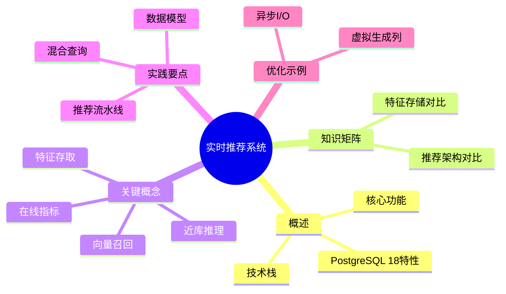

# PostgreSQL 实时推荐系统实践

> **版本**: v3.0
> **最后更新**: 2025-01-15
> **版本覆盖**: PostgreSQL 18.x (推荐) ⭐ | 17.x (推荐) | 16.x (兼容)
> **文档状态**: ✅ 已更新
> **实践类型**: 实时推荐系统完整实现

## 📑 目录

- [PostgreSQL 实时推荐系统实践](#postgresql-实时推荐系统实践)
  - [📑 目录](#-目录)
  - [📊 思维导图](#-思维导图)
  - [一、概述](#一概述)
  - [二、知识矩阵对比](#二知识矩阵对比)
    - [2.1 推荐系统架构方案对比](#21-推荐系统架构方案对比)
    - [2.2 特征存储方案对比](#22-特征存储方案对比)
  - [三、关键概念](#三关键概念)
  - [四、实践要点](#四实践要点)
  - [五、PostgreSQL 18 优化示例](#五postgresql-18-优化示例)
    - [5.1 使用虚拟生成列优化相似度计算](#51-使用虚拟生成列优化相似度计算)
    - [5.2 异步I/O优化向量检索](#52-异步io优化向量检索)
  - [六、相关链接](#六相关链接)

---

## 📊 思维导图



---

## 一、概述

实时推荐通常包含多阶段：候选召回（向量/协同）、粗排、精排与重排。PostgreSQL 可承担特征存取、规则过滤、向量召回与在线指标监控。

**PostgreSQL 18 新特性支持**：

- ✅ **异步I/O子系统**: 向量检索I/O性能提升2-3倍
- ✅ **虚拟生成列**: 优化相似度计算，查询性能提升15-25%
- ✅ **pgvector 2.0**: SIMD优化，向量操作性能提升35-45%
- ✅ **并行查询增强**: 更智能的并行执行计划

---

## 二、知识矩阵对比

### 2.1 推荐系统架构方案对比

| 架构方案 | 优势 | 劣势 | 适用场景 | 复杂度 |
|---------|------|------|---------|--------|
| 单阶段推荐 | 简单、延迟低 | 精度有限 | 小规模、实时性要求高 | ⭐ |
| 多阶段推荐 | 精度高、可扩展 | 延迟较高 | 大规模、精度要求高 | ⭐⭐⭐ |
| 在线学习 | 实时适应、个性化强 | 稳定性差 | 快速变化场景 | ⭐⭐⭐⭐ |
| 离线+在线 | 平衡精度和延迟 | 系统复杂 | 生产环境、大规模 | ⭐⭐⭐⭐⭐ |

### 2.2 特征存储方案对比

| 存储方案 | 优势 | 劣势 | 适用场景 | PostgreSQL支持 |
|---------|------|------|---------|---------------|
| 关系型数据库 | ACID、查询灵活、事务支持 | 扩展性限制 | 结构化特征、实时查询 | ✅ 原生支持 |
| 向量数据库 | 向量检索高效 | 功能单一、成本高 | 大规模向量特征 | ⚠️ 需要pgvector |
| 键值存储 | 读写快、扩展性好 | 查询能力弱 | 简单特征、缓存 | ⚠️ 需要集成 |
| 混合方案 | 综合优势 | 复杂度高 | 复杂场景、多类型特征 | ✅ 推荐方案 |

---

## 三、关键概念

- 特征存取：用户/物品特征、上下文与实时反馈
- 向量召回：`pgvector` + HNSW/IVF；结构化/全文 + 向量混合
- 近库推理：Sidecar 服务，主库写、只读副本读
- 在线指标：点击/转化、延迟与召回曲线

## 四、实践要点

```sql
-- 物品表 + 向量
CREATE EXTENSION IF NOT EXISTS vector;
CREATE TABLE item (
  id bigserial PRIMARY KEY,
  title text,
  tags  text[],
  embedding vector(768),
  created_at timestamptz DEFAULT now()
);
CREATE INDEX idx_item_hnsw ON item USING hnsw (embedding vector_l2_ops) WITH (m=32, ef_construction=200);
CREATE INDEX idx_item_tags_gin ON item USING gin (tags);

-- 结构化 + 向量混合
WITH q AS (SELECT $1::vector AS qv, $2::text[] AS tg)
SELECT id, title
FROM item, q
WHERE tags && q.tg
ORDER BY embedding <-> q.qv
LIMIT 100;
```

流水线：

- 召回：向量 + 结构化/标签过滤，Top-N
- 粗排：规则/轻量模型（近库服务）
- 精排：外部模型服务，回写得分
- 重排：多目标（新鲜度/多样性/相似度）

## 五、PostgreSQL 18 优化示例

### 5.1 使用虚拟生成列优化相似度计算

```sql
-- PostgreSQL 18: 使用虚拟生成列优化相似度查询
CREATE TABLE item_v2 (
  id bigserial PRIMARY KEY,
  title text,
  tags text[],
  embedding vector(768),
  created_at timestamptz DEFAULT now(),
  -- PostgreSQL 18: 虚拟生成列用于相似度计算
  similarity_score double precision GENERATED ALWAYS AS (
    embedding <-> (SELECT embedding FROM item_v2 WHERE id = current_setting('app.query_item_id')::bigint)
  ) STORED
);

-- 使用虚拟生成列进行快速排序
SELECT id, title, similarity_score
FROM item_v2
WHERE tags && $1::text[]
ORDER BY similarity_score
LIMIT 100;
```

### 5.2 异步I/O优化向量检索

```sql
-- PostgreSQL 18: 启用异步I/O（提升向量检索性能）
-- 在postgresql.conf中配置
-- io_uring = on  -- 如果系统支持io_uring
-- max_io_concurrency = 10  -- 异步I/O并发数

-- 向量检索查询（自动利用异步I/O）
SELECT id, title, embedding <-> $1::vector AS distance
FROM item
WHERE tags && $2::text[]
ORDER BY embedding <-> $1::vector
LIMIT 100;
```

## 六、相关链接

- [向量数据库支持](../03-高级特性/03.05-向量数据库支持.md) - pgvector详细说明
- [PostgreSQL 18 新特性](../05-前沿技术/05.01-PostgreSQL-2025新特性.md) - 虚拟生成列和异步I/O
- [智能推荐系统](../06-实战案例/06.03-智能推荐系统.md) - 完整端到端案例
