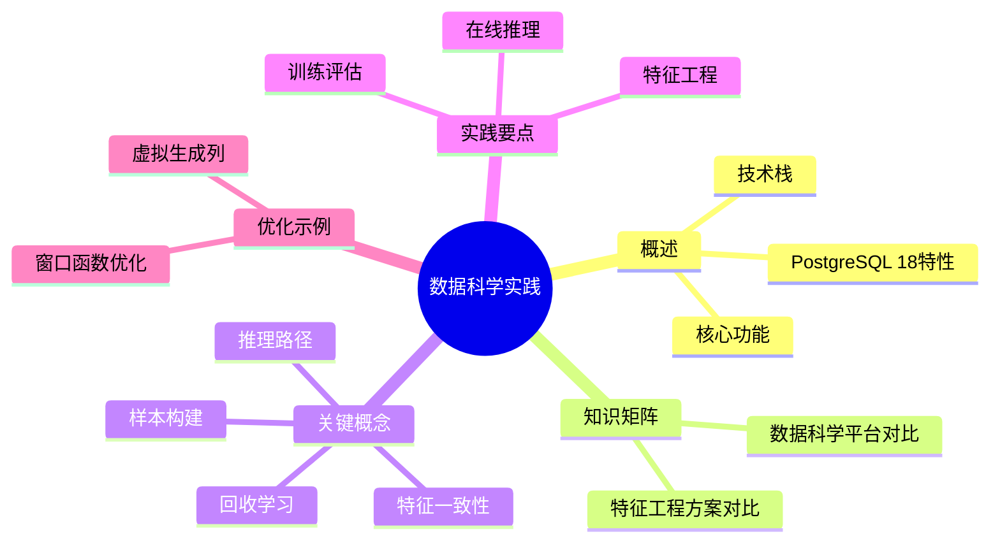

# PostgreSQL 数据科学实践

> **版本**: v3.0
> **最后更新**: 2025-01-15
> **版本覆盖**: PostgreSQL 18.x (推荐) ⭐ | 17.x (推荐) | 16.x (兼容)
> **文档状态**: ✅ 已更新
> **实践类型**: 数据科学流水线完整实现

## 📑 目录

- [PostgreSQL 数据科学实践](#postgresql-数据科学实践)
  - [📑 目录](#-目录)
  - [📊 思维导图](#-思维导图)
  - [一、概述](#一概述)
  - [二、知识矩阵对比](#二知识矩阵对比)
    - [2.1 数据科学平台方案对比](#21-数据科学平台方案对比)
    - [2.2 特征工程方案对比](#22-特征工程方案对比)
  - [三、关键概念](#三关键概念)
  - [四、实践要点](#四实践要点)
  - [五、PostgreSQL 18 优化示例](#五postgresql-18-优化示例)
    - [5.1 使用虚拟生成列优化特征计算](#51-使用虚拟生成列优化特征计算)
    - [5.2 优化窗口函数计算](#52-优化窗口函数计算)
  - [六、相关链接](#六相关链接)

---

## 📊 思维导图



---

## 一、概述

PG 既可作为特征与标签的存取层，也可承担少量在线推理与近库计算；与外部计算（Spark/Ray）协同完成训练与评估。

**PostgreSQL 18 新特性支持**：

- ✅ **虚拟生成列**: 优化特征计算，减少重复计算
- ✅ **异步I/O**: 提升大数据量特征提取性能
- ✅ **并行查询增强**: 更高效的窗口函数和聚合计算
- ✅ **改进的JSONB**: 更高效的特征存储和查询

---

## 二、知识矩阵对比

### 2.1 数据科学平台方案对比

| 平台方案 | 优势 | 劣势 | 适用场景 | PostgreSQL集成 |
|---------|------|------|---------|---------------|
| 数据库内ML | 低延迟、数据一致 | 功能有限、扩展性差 | 简单模型、实时推理 | ✅ 原生支持 |
| 近库计算 | 平衡性能和灵活性 | 架构复杂 | 中等复杂度、实时性要求 | ⚠️ 需要集成 |
| 离线训练+在线推理 | 功能强大、灵活 | 数据同步、延迟 | 复杂模型、大规模 | ⚠️ 需要集成 |
| 云平台ML | 功能完整、易用 | 成本高、供应商锁定 | 快速开发、无运维需求 | ⚠️ 需要集成 |
| 混合方案 | 综合优势 | 复杂度高 | 复杂场景、多阶段流程 | ✅ 推荐方案 |

### 2.2 特征工程方案对比

| 方案 | 优势 | 劣势 | 适用场景 | PostgreSQL支持 |
|-----|------|------|---------|---------------|
| SQL特征工程 | 简单、易维护、一致性好 | 功能有限 | 结构化特征、简单计算 | ✅ 原生支持 |
| Python特征工程 | 功能强大、灵活 | 性能限制、复杂度高 | 复杂特征、自定义逻辑 | ⚠️ 需要plpython |
| 外部ETL工具 | 功能完整、可扩展 | 数据同步、延迟 | 大规模、复杂流程 | ⚠️ 需要集成 |
| 实时特征计算 | 实时性好、一致性强 | 资源消耗 | 实时场景、在线学习 | ✅ 推荐方案 |

---

## 三、关键概念

- 特征一致性：训练/推理一致的变换与时态
- 样本构建：窗口聚合、标签对齐与时间旅行
- 推理路径：同步（UDF/HTTP）与异步（消息/回写）
- 回收学习：推理结果与反馈写回，闭环

## 四、实践要点

```sql
-- 示例：构建7日点击率特征
WITH e AS (
  SELECT user_id, date_trunc('day', ts) AS d, count(*) AS cnt
  FROM events WHERE action = 'click' AND ts >= now() - interval '30 day'
  GROUP BY 1,2
), roll AS (
  SELECT user_id, d,
         sum(cnt) OVER (PARTITION BY user_id ORDER BY d ROWS BETWEEN 6 PRECEDING AND CURRENT ROW) AS ctr7
  FROM e
)
SELECT * FROM roll;

-- 在线推理（plpythonu 简化）
CREATE EXTENSION IF NOT EXISTS plpythonu;
CREATE OR REPLACE FUNCTION score_ctr(x double precision)
RETURNS double precision AS $$
  return 1.0/(1.0+pow(2.71828, -0.1*(x-10)))
$$ LANGUAGE plpythonu IMMUTABLE;
```

SOP：

- 特征层：规范化函数库、时间对齐策略、数据质量校验
- 训练层：特征快照导出、版本管理、评估指标
- 推理层：近库服务/只读副本、熔断与超时
- 回收：写回推理结果/反馈，供下一轮训练

## 五、PostgreSQL 18 优化示例

### 5.1 使用虚拟生成列优化特征计算

```sql
-- PostgreSQL 18: 使用虚拟生成列自动计算特征
CREATE TABLE user_features (
  user_id bigint PRIMARY KEY,
  click_count integer,
  view_count integer,
  purchase_count integer,
  last_active_date date,
  -- PostgreSQL 18: 虚拟生成列自动计算CTR特征
  ctr_7d double precision GENERATED ALWAYS AS (
    CASE
      WHEN view_count > 0 THEN click_count::double precision / view_count
      ELSE 0
    END
  ) STORED,
  -- 计算活跃度特征
  activity_score double precision GENERATED ALWAYS AS (
    click_count * 0.5 + view_count * 0.3 + purchase_count * 2.0
  ) STORED
);

-- 使用虚拟生成列进行特征查询
SELECT user_id, ctr_7d, activity_score
FROM user_features
WHERE activity_score > 10
ORDER BY activity_score DESC;
```

### 5.2 优化窗口函数计算

```sql
-- PostgreSQL 18: 优化的窗口函数（利用并行查询）
WITH daily_stats AS (
  SELECT
    user_id,
    date_trunc('day', ts) AS day,
    COUNT(*) FILTER (WHERE action = 'click') AS clicks,
    COUNT(*) FILTER (WHERE action = 'view') AS views
  FROM events
  WHERE ts >= now() - interval '30 day'
  GROUP BY user_id, day
)
SELECT
  user_id,
  day,
  clicks,
  views,
  -- PostgreSQL 18: 并行窗口函数计算
  SUM(clicks) OVER (
    PARTITION BY user_id
    ORDER BY day
    ROWS BETWEEN 6 PRECEDING AND CURRENT ROW
  ) AS clicks_7d,
  AVG(views) OVER (
    PARTITION BY user_id
    ORDER BY day
    ROWS BETWEEN 6 PRECEDING AND CURRENT ROW
  ) AS avg_views_7d
FROM daily_stats;
```

## 六、相关链接

- [机器学习集成](../03-高级特性/03.04-机器学习集成.md) - ML集成详细说明
- [PostgreSQL 18 新特性](../05-前沿技术/05.01-PostgreSQL-2025新特性.md) - 虚拟生成列和异步I/O
- [监控与诊断](../04-部署运维/04.04-监控与诊断.md) - 性能监控和诊断
