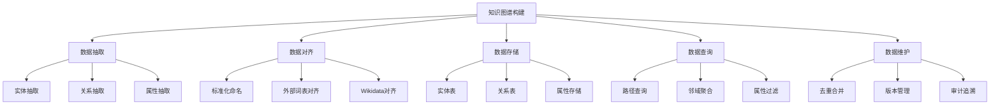

# 知识图谱构建：PostgreSQL知识库结构化组织

> **版本**: v1.0
> **最后更新**: 2025-01-15
> **难度**: ⭐⭐⭐⭐
> **应用场景**: 知识管理、语义搜索、智能推荐、知识发现

---

## 📑 目录

- [知识图谱构建：PostgreSQL知识库结构化组织](#知识图谱构建postgresql知识库结构化组织)
  - [📑 目录](#-目录)
  - [一、概述](#一概述)
    - [1.1 知识图谱目标](#11-知识图谱目标)
    - [1.2 应用场景](#12-应用场景)
    - [1.3 技术优势](#13-技术优势)
  - [二、核心概念](#二核心概念)
    - [2.1 知识图谱模型](#21-知识图谱模型)
    - [2.2 实体-关系模型](#22-实体-关系模型)
    - [2.3 属性图模型](#23-属性图模型)
    - [2.4 思维导图](#24-思维导图)
  - [三、技术架构](#三技术架构)
    - [3.1 整体架构设计](#31-整体架构设计)
    - [3.2 数据模型设计](#32-数据模型设计)
    - [3.3 存储设计](#33-存储设计)
  - [四、实现方案](#四实现方案)
    - [4.1 实体抽取](#41-实体抽取)
    - [4.2 关系抽取](#42-关系抽取)
    - [4.3 数据对齐](#43-数据对齐)
    - [4.4 存储实现](#44-存储实现)
    - [4.5 查询实现](#45-查询实现)
  - [五、知识矩阵对比](#五知识矩阵对比)
    - [5.1 存储方案对比](#51-存储方案对比)
    - [5.2 查询方案对比](#52-查询方案对比)
  - [六、实践案例](#六实践案例)
    - [6.1 PostgreSQL概念图谱](#61-postgresql概念图谱)
    - [6.2 技术依赖关系图谱](#62-技术依赖关系图谱)
    - [6.3 应用场景关联图谱](#63-应用场景关联图谱)
  - [七、性能优化](#七性能优化)
    - [7.1 索引优化](#71-索引优化)
    - [7.2 查询优化](#72-查询优化)
    - [7.3 存储优化](#73-存储优化)
  - [八、维护与管理](#八维护与管理)
    - [8.1 数据质量保证](#81-数据质量保证)
    - [8.2 版本管理](#82-版本管理)
    - [8.3 可视化展示](#83-可视化展示)
  - [九、最佳实践](#九最佳实践)
  - [十、参考资源](#十参考资源)
    - [10.1 官方文档](#101-官方文档)
    - [10.2 网络资源](#102-网络资源)
    - [10.3 相关文档](#103-相关文档)

---

## 一、概述

### 1.1 知识图谱目标

知识图谱构建旨在以PostgreSQL为后端实现轻量级知识图谱（实体/关系/属性）的存储、查询与对齐，实现知识的结构化组织和语义化表示。

**核心目标**：

- **结构化组织**：将非结构化知识转化为结构化图谱
- **语义化表示**：支持实体、关系、属性的语义表示
- **智能查询**：支持路径查询、邻域聚合、属性过滤
- **知识对齐**：与外部知识库（如Wikidata）对齐

### 1.2 应用场景

知识图谱在PostgreSQL知识库中的应用场景：

- **概念关系映射**：建立PostgreSQL核心概念之间的关系
- **技术依赖分析**：分析技术之间的依赖关系
- **应用场景关联**：关联应用场景与相关技术
- **智能推荐**：基于知识图谱进行智能推荐
- **知识发现**：通过图谱发现隐藏的知识关联

### 1.3 技术优势

使用PostgreSQL构建知识图谱的优势：

- **成熟稳定**：PostgreSQL是成熟的关系数据库
- **SQL支持**：使用标准SQL进行查询
- **JSONB支持**：灵活存储属性信息
- **扩展性强**：支持自定义函数和扩展
- **性能优秀**：通过索引和优化提升查询性能

---

## 二、核心概念

### 2.1 知识图谱模型

**知识图谱**（Knowledge Graph）是一种语义网络，用于表示实体、概念及其之间的关系。

**核心要素**：

- **实体**（Entity）：知识图谱中的节点，表示具体的事物或概念
- **关系**（Relation）：实体之间的连接，表示实体之间的关系
- **属性**（Property）：实体的特征或属性信息

**知识图谱特点**：

- **结构化**：知识以结构化的方式组织
- **语义化**：支持语义表示和推理
- **可扩展**：支持动态添加实体和关系
- **可查询**：支持复杂的图查询

### 2.2 实体-关系模型

**实体-关系模型**（Entity-Relationship Model）是知识图谱的基础模型。

**模型组成**：

- **实体表**：存储实体信息
- **关系表**：存储实体之间的关系
- **属性表**：存储实体的属性信息（可选，也可存储在实体表中）

**模型特点**：

- **清晰分离**：实体、关系、属性分离存储
- **易于理解**：符合直观的认知模型
- **灵活扩展**：支持动态添加实体和关系类型

### 2.3 属性图模型

**属性图模型**（Property Graph Model）是知识图谱的另一种表示方式。

**模型组成**：

- **顶点**（Vertex）：实体，包含标签和属性
- **边**（Edge）：关系，连接两个顶点，包含标签和属性

**模型特点**：

- **属性丰富**：顶点和边都可以包含丰富的属性
- **标签分类**：通过标签对顶点和边进行分类
- **灵活查询**：支持基于标签和属性的查询

### 2.4 思维导图



---

## 三、技术架构

### 3.1 整体架构设计

```text
┌─────────────┐
│ 数据源      │
│ - 文档      │
│ - 日志      │
│ - 结构化表  │
└──────┬──────┘
       │
       ▼
┌─────────────┐
│ 实体抽取    │  ← NLP/规则抽取
│ 关系抽取    │
│ 属性抽取    │
└──────┬──────┘
       │
       ▼
┌─────────────┐
│ 数据对齐    │  ← 标准化/Wikidata对齐
│ 标准化命名  │
└──────┬──────┘
       │
       ▼
┌─────────────┐
│ PostgreSQL  │  ← 知识图谱存储
│ - 实体表    │
│ - 关系表    │
│ - 索引      │
└──────┬──────┘
       │
       ▼
┌─────────────┐
│ 查询服务    │  ← 图查询API
│ - 路径查询  │
│ - 邻域查询  │
└─────────────┘
```

### 3.2 数据模型设计

**实体-关系模型**：

```sql
-- 实体表
CREATE TABLE kg_entity (
    id BIGSERIAL PRIMARY KEY,
    type TEXT NOT NULL,              -- 实体类型
    name TEXT NOT NULL,              -- 实体名称
    name_en TEXT,                    -- 英文名称
    description TEXT,                -- 描述
    attrs JSONB NOT NULL DEFAULT '{}', -- 属性（JSONB格式）
    wikidata_id TEXT,                -- Wikidata ID
    source TEXT,                     -- 数据来源
    created_at TIMESTAMPTZ DEFAULT NOW(),
    updated_at TIMESTAMPTZ DEFAULT NOW(),
    version INTEGER DEFAULT 0        -- 版本号
);

-- 关系表
CREATE TABLE kg_relation (
    id BIGSERIAL PRIMARY KEY,
    src BIGINT NOT NULL REFERENCES kg_entity(id) ON DELETE CASCADE,
    dst BIGINT NOT NULL REFERENCES kg_entity(id) ON DELETE CASCADE,
    type TEXT NOT NULL,              -- 关系类型
    description TEXT,                -- 关系描述
    attrs JSONB NOT NULL DEFAULT '{}', -- 关系属性
    weight NUMERIC(5,2) DEFAULT 1.0, -- 关系权重
    source TEXT,                     -- 数据来源
    created_at TIMESTAMPTZ DEFAULT NOW(),
    updated_at TIMESTAMPTZ DEFAULT NOW(),
    version INTEGER DEFAULT 0,
    CONSTRAINT check_no_self_loop CHECK (src != dst)
);

-- 实体类型字典表
CREATE TABLE kg_entity_type (
    type TEXT PRIMARY KEY,
    description TEXT,
    parent_type TEXT REFERENCES kg_entity_type(type),
    created_at TIMESTAMPTZ DEFAULT NOW()
);

-- 关系类型字典表
CREATE TABLE kg_relation_type (
    type TEXT PRIMARY KEY,
    description TEXT,
    is_directed BOOLEAN DEFAULT TRUE, -- 是否有向
    inverse_type TEXT,                -- 反向关系类型
    created_at TIMESTAMPTZ DEFAULT NOW()
);
```

**属性图模型**（可选，使用JSONB存储）：

```sql
-- 属性图顶点表
CREATE TABLE kg_vertex (
    id BIGSERIAL PRIMARY KEY,
    label TEXT NOT NULL,             -- 顶点标签（对应实体类型）
    properties JSONB NOT NULL DEFAULT '{}', -- 属性
    created_at TIMESTAMPTZ DEFAULT NOW()
);

-- 属性图边表
CREATE TABLE kg_edge (
    id BIGSERIAL PRIMARY KEY,
    src BIGINT NOT NULL REFERENCES kg_vertex(id) ON DELETE CASCADE,
    dst BIGINT NOT NULL REFERENCES kg_vertex(id) ON DELETE CASCADE,
    label TEXT NOT NULL,             -- 边标签（对应关系类型）
    properties JSONB NOT NULL DEFAULT '{}', -- 属性
    created_at TIMESTAMPTZ DEFAULT NOW(),
    CONSTRAINT check_no_self_loop CHECK (src != dst)
);
```

### 3.3 存储设计

**索引设计**：

```sql
-- 实体表索引
CREATE INDEX idx_kg_entity_type ON kg_entity(type);
CREATE INDEX idx_kg_entity_name ON kg_entity(name);
CREATE INDEX idx_kg_entity_name_en ON kg_entity(name_en);
CREATE INDEX idx_kg_entity_wikidata ON kg_entity(wikidata_id) WHERE wikidata_id IS NOT NULL;
CREATE INDEX idx_kg_entity_attrs ON kg_entity USING GIN (attrs);

-- 关系表索引
CREATE INDEX idx_kg_relation_src ON kg_relation(src);
CREATE INDEX idx_kg_relation_dst ON kg_relation(dst);
CREATE INDEX idx_kg_relation_type ON kg_relation(type);
CREATE INDEX idx_kg_relation_src_type ON kg_relation(src, type);
CREATE INDEX idx_kg_relation_dst_type ON kg_relation(dst, type);
CREATE INDEX idx_kg_relation_attrs ON kg_relation USING GIN (attrs);

-- 复合索引（优化路径查询）
CREATE INDEX idx_kg_relation_src_dst_type ON kg_relation(src, dst, type);
```

---

## 四、实现方案

### 4.1 实体抽取

**从文档抽取实体**：

```python
#!/usr/bin/env python3
"""
实体抽取工具
从Markdown文档中抽取PostgreSQL相关实体
"""

import re
from pathlib import Path
from typing import List, Dict
import psycopg2

class EntityExtractor:
    def __init__(self, db_conn):
        self.conn = db_conn
        self.cur = db_conn.cursor()

        # 实体类型模式
        self.entity_patterns = {
            'concept': [
                r'#+\s+([A-Z][a-zA-Z\s]+)',  # 标题作为概念
                r'\*\*([A-Z][a-zA-Z\s]+)\*\*',  # 加粗文本
            ],
            'function': [
                r'`([a-z_]+)\(\)`',  # 函数名
                r'CREATE\s+FUNCTION\s+([a-z_]+)',
            ],
            'table': [
                r'CREATE\s+TABLE\s+([a-z_]+)',
                r'FROM\s+([a-z_]+)',
            ],
            'index': [
                r'CREATE\s+INDEX\s+([a-z_]+)',
            ],
        }

    def extract_from_file(self, file_path: Path) -> List[Dict]:
        """从文件抽取实体"""
        entities = []

        try:
            content = file_path.read_text(encoding='utf-8')
        except Exception as e:
            print(f"无法读取文件 {file_path}: {e}")
            return entities

        # 提取标题作为概念实体
        heading_pattern = r'^#{1,6}\s+(.+)$'
        headings = re.findall(heading_pattern, content, re.MULTILINE)

        for heading in headings:
            # 清理标题
            heading = heading.strip()
            if len(heading) > 100:  # 跳过过长的标题
                continue

            entities.append({
                'type': 'concept',
                'name': heading,
                'source': str(file_path),
                'description': self._extract_description(content, heading)
            })

        # 提取代码中的实体
        code_pattern = r'```sql\n(.*?)```'
        code_blocks = re.findall(code_pattern, content, re.DOTALL)

        for code_block in code_blocks:
            # 提取函数
            functions = re.findall(r'CREATE\s+FUNCTION\s+([a-z_]+)', code_block, re.IGNORECASE)
            for func in functions:
                entities.append({
                    'type': 'function',
                    'name': func,
                    'source': str(file_path),
                    'description': f'函数定义在 {file_path.name}'
                })

            # 提取表
            tables = re.findall(r'CREATE\s+TABLE\s+([a-z_]+)', code_block, re.IGNORECASE)
            for table in tables:
                entities.append({
                    'type': 'table',
                    'name': table,
                    'source': str(file_path),
                    'description': f'表定义在 {file_path.name}'
                })

        return entities

    def _extract_description(self, content: str, heading: str) -> str:
        """提取实体描述"""
        # 查找标题后的第一段文本作为描述
        pattern = rf'^#+\s+{re.escape(heading)}\s*\n\n(.+?)(?:\n\n|$)'
        match = re.search(pattern, content, re.MULTILINE | re.DOTALL)
        if match:
            desc = match.group(1).strip()
            # 限制描述长度
            if len(desc) > 500:
                desc = desc[:500] + '...'
            return desc
        return ''

    def save_entities(self, entities: List[Dict]):
        """保存实体到数据库"""
        for entity in entities:
            # 检查实体是否已存在
            self.cur.execute("""
                SELECT id FROM kg_entity
                WHERE name = %s AND type = %s
            """, (entity['name'], entity['type']))

            existing = self.cur.fetchone()

            if existing:
                # 更新实体
                self.cur.execute("""
                    UPDATE kg_entity
                    SET description = %s,
                        source = %s,
                        updated_at = NOW(),
                        version = version + 1
                    WHERE id = %s
                """, (entity.get('description', ''),
                      entity.get('source', ''),
                      existing[0]))
            else:
                # 插入新实体
                self.cur.execute("""
                    INSERT INTO kg_entity (type, name, description, source, attrs)
                    VALUES (%s, %s, %s, %s, %s)
                """, (entity['type'],
                      entity['name'],
                      entity.get('description', ''),
                      entity.get('source', ''),
                      json.dumps(entity.get('attrs', {}))))

        self.conn.commit()

if __name__ == '__main__':
    import sys

    # 连接数据库
    conn = psycopg2.connect(
        dbname='knowledge_graph',
        user='postgres',
        password='password'
    )

    extractor = EntityExtractor(conn)

    # 从目录抽取实体
    root_dir = Path(sys.argv[1] if len(sys.argv) > 1 else '.')
    all_entities = []

    for md_file in root_dir.rglob('*.md'):
        entities = extractor.extract_from_file(md_file)
        all_entities.extend(entities)
        print(f"从 {md_file} 抽取了 {len(entities)} 个实体")

    # 保存实体
    extractor.save_entities(all_entities)
    print(f"共保存 {len(all_entities)} 个实体")

    conn.close()
```

### 4.2 关系抽取

**从文档抽取关系**：

```python
#!/usr/bin/env python3
"""
关系抽取工具
从文档中抽取实体之间的关系
"""

import re
from pathlib import Path
from typing import List, Dict
import psycopg2

class RelationExtractor:
    def __init__(self, db_conn):
        self.conn = db_conn
        self.cur = db_conn.cursor()

        # 关系模式
        self.relation_patterns = {
            'depends_on': [
                r'([A-Z][a-zA-Z\s]+)\s+依赖\s+([A-Z][a-zA-Z\s]+)',
                r'([A-Z][a-zA-Z\s]+)\s+基于\s+([A-Z][a-zA-Z\s]+)',
            ],
            'implements': [
                r'([A-Z][a-zA-Z\s]+)\s+实现\s+([A-Z][a-zA-Z\s]+)',
                r'([A-Z][a-zA-Z\s]+)\s+提供\s+([A-Z][a-zA-Z\s]+)',
            ],
            'uses': [
                r'([A-Z][a-zA-Z\s]+)\s+使用\s+([A-Z][a-zA-Z\s]+)',
                r'([A-Z][a-zA-Z\s]+)\s+调用\s+([A-Z][a-zA-Z\s]+)',
            ],
            'related_to': [
                r'([A-Z][a-zA-Z\s]+)\s+与\s+([A-Z][a-zA-Z\s]+)\s+相关',
            ],
        }

    def extract_from_file(self, file_path: Path) -> List[Dict]:
        """从文件抽取关系"""
        relations = []

        try:
            content = file_path.read_text(encoding='utf-8')
        except Exception as e:
            print(f"无法读取文件 {file_path}: {e}")
            return relations

        # 提取标题层级关系
        headings = self._extract_headings(content)
        for i in range(len(headings) - 1):
            relations.append({
                'src': headings[i]['name'],
                'dst': headings[i+1]['name'],
                'type': 'contains',
                'source': str(file_path)
            })

        # 提取文本中的关系
        for rel_type, patterns in self.relation_patterns.items():
            for pattern in patterns:
                matches = re.finditer(pattern, content, re.IGNORECASE)
                for match in matches:
                    src = match.group(1).strip()
                    dst = match.group(2).strip()

                    relations.append({
                        'src': src,
                        'dst': dst,
                        'type': rel_type,
                        'source': str(file_path)
                    })

        return relations

    def _extract_headings(self, content: str) -> List[Dict]:
        """提取标题"""
        headings = []
        pattern = r'^(#{1,6})\s+(.+)$'

        for match in re.finditer(pattern, content, re.MULTILINE):
            level = len(match.group(1))
            name = match.group(2).strip()
            headings.append({
                'name': name,
                'level': level
            })

        return headings

    def save_relations(self, relations: List[Dict]):
        """保存关系到数据库"""
        for relation in relations:
            # 查找源实体和目标实体
            self.cur.execute("""
                SELECT id FROM kg_entity WHERE name = %s
            """, (relation['src'],))
            src_entity = self.cur.fetchone()

            self.cur.execute("""
                SELECT id FROM kg_entity WHERE name = %s
            """, (relation['dst'],))
            dst_entity = self.cur.fetchone()

            if not src_entity or not dst_entity:
                print(f"跳过关系 {relation['src']} -> {relation['dst']}: 实体不存在")
                continue

            # 检查关系是否已存在
            self.cur.execute("""
                SELECT id FROM kg_relation
                WHERE src = %s AND dst = %s AND type = %s
            """, (src_entity[0], dst_entity[0], relation['type']))

            existing = self.cur.fetchone()

            if not existing:
                # 插入新关系
                self.cur.execute("""
                    INSERT INTO kg_relation (src, dst, type, source, attrs)
                    VALUES (%s, %s, %s, %s, %s)
                """, (src_entity[0],
                      dst_entity[0],
                      relation['type'],
                      relation.get('source', ''),
                      json.dumps(relation.get('attrs', {}))))

        self.conn.commit()
```

### 4.3 数据对齐

**Wikidata对齐**：

```python
#!/usr/bin/env python3
"""
Wikidata对齐工具
将实体与Wikidata对齐
"""

import requests
import psycopg2
from typing import Dict, Optional

class WikidataAligner:
    def __init__(self, db_conn):
        self.conn = db_conn
        self.cur = db_conn.cursor()
        self.wikidata_api = 'https://www.wikidata.org/w/api.php'

    def align_entity(self, entity_id: int, entity_name: str) -> Optional[str]:
        """对齐实体到Wikidata"""
        # 搜索Wikidata
        params = {
            'action': 'wbsearchentities',
            'search': entity_name,
            'language': 'en',
            'format': 'json'
        }

        response = requests.get(self.wikidata_api, params=params)
        data = response.json()

        if data.get('search'):
            # 取第一个结果
            result = data['search'][0]
            wikidata_id = result['id']

            # 更新实体
            self.cur.execute("""
                UPDATE kg_entity
                SET wikidata_id = %s,
                    name_en = %s,
                    attrs = jsonb_set(
                        attrs,
                        '{wikidata}',
                        %s::jsonb,
                        true
                    )
                WHERE id = %s
            """, (wikidata_id,
                  result.get('label', ''),
                  json.dumps(result),
                  entity_id))

            self.conn.commit()
            return wikidata_id

        return None

    def align_all_entities(self):
        """对齐所有实体"""
        self.cur.execute("""
            SELECT id, name FROM kg_entity
            WHERE wikidata_id IS NULL
        """)

        entities = self.cur.fetchall()

        for entity_id, entity_name in entities:
            print(f"对齐实体: {entity_name}")
            wikidata_id = self.align_entity(entity_id, entity_name)
            if wikidata_id:
                print(f"  对齐到: {wikidata_id}")
            else:
                print(f"  未找到匹配")
```

### 4.4 存储实现

**批量导入实体和关系**：

```python
#!/usr/bin/env python3
"""
批量导入工具
批量导入实体和关系到知识图谱
"""

import psycopg2
from psycopg2.extras import execute_batch
import json

class KnowledgeGraphImporter:
    def __init__(self, db_conn):
        self.conn = db_conn
        self.cur = db_conn.cursor()

    def import_entities(self, entities: List[Dict]):
        """批量导入实体"""
        execute_batch(
            self.cur,
            """
            INSERT INTO kg_entity (type, name, name_en, description, attrs, source)
            VALUES (%s, %s, %s, %s, %s, %s)
            ON CONFLICT (name, type) DO UPDATE
            SET description = EXCLUDED.description,
                attrs = EXCLUDED.attrs,
                updated_at = NOW(),
                version = kg_entity.version + 1
            """,
            [(
                e['type'],
                e['name'],
                e.get('name_en'),
                e.get('description', ''),
                json.dumps(e.get('attrs', {})),
                e.get('source', '')
            ) for e in entities],
            page_size=1000
        )
        self.conn.commit()

    def import_relations(self, relations: List[Dict]):
        """批量导入关系"""
        # 先获取实体ID映射
        entity_map = {}
        self.cur.execute("SELECT id, name, type FROM kg_entity")
        for row in self.cur.fetchall():
            key = (row[1], row[2])
            entity_map[key] = row[0]

        # 准备关系数据
        relation_data = []
        for rel in relations:
            src_key = (rel['src'], rel.get('src_type', 'concept'))
            dst_key = (rel['dst'], rel.get('dst_type', 'concept'))

            if src_key in entity_map and dst_key in entity_map:
                relation_data.append((
                    entity_map[src_key],
                    entity_map[dst_key],
                    rel['type'],
                    rel.get('description', ''),
                    json.dumps(rel.get('attrs', {})),
                    rel.get('weight', 1.0),
                    rel.get('source', '')
                ))

        # 批量插入
        execute_batch(
            self.cur,
            """
            INSERT INTO kg_relation (src, dst, type, description, attrs, weight, source)
            VALUES (%s, %s, %s, %s, %s, %s, %s)
            ON CONFLICT DO NOTHING
            """,
            relation_data,
            page_size=1000
        )
        self.conn.commit()
```

### 4.5 查询实现

**路径查询**：

```sql
-- 递归查询：查找两个实体之间的路径
WITH RECURSIVE entity_path AS (
    -- 基础查询：直接关系
    SELECT
        src,
        dst,
        type,
        ARRAY[src, dst] AS path,
        1 AS depth
    FROM kg_relation
    WHERE src = (SELECT id FROM kg_entity WHERE name = 'PostgreSQL')

    UNION ALL

    -- 递归查询：扩展路径
    SELECT
        ep.src,
        r.dst,
        r.type,
        ep.path || r.dst,
        ep.depth + 1
    FROM entity_path ep
    JOIN kg_relation r ON r.src = ep.dst
    WHERE ep.depth < 5  -- 限制深度
      AND NOT r.dst = ANY(ep.path)  -- 避免循环
)
SELECT DISTINCT
    e1.name AS source,
    e2.name AS target,
    ep.path,
    ep.depth
FROM entity_path ep
JOIN kg_entity e1 ON e1.id = ep.src
JOIN kg_entity e2 ON e2.id = ep.dst
WHERE e2.name = '索引'
ORDER BY ep.depth, ep.path;
```

**邻域查询**：

```sql
-- 查询实体的直接邻居
SELECT
    e1.name AS source,
    r.type AS relation_type,
    e2.name AS target,
    r.weight,
    r.description
FROM kg_entity e1
JOIN kg_relation r ON r.src = e1.id
JOIN kg_entity e2 ON e2.id = r.dst
WHERE e1.name = 'PostgreSQL'
ORDER BY r.weight DESC;

-- 查询实体的两跳邻居
SELECT DISTINCT
    e1.name AS source,
    e2.name AS intermediate,
    e3.name AS target,
    r1.type AS relation1,
    r2.type AS relation2
FROM kg_entity e1
JOIN kg_relation r1 ON r1.src = e1.id
JOIN kg_entity e2 ON e2.id = r1.dst
JOIN kg_relation r2 ON r2.src = e2.id
JOIN kg_entity e3 ON e3.id = r2.dst
WHERE e1.name = 'PostgreSQL'
ORDER BY r1.weight * r2.weight DESC;
```

**属性过滤查询**：

```sql
-- 基于属性过滤实体
SELECT
    name,
    type,
    description,
    attrs
FROM kg_entity
WHERE attrs @> '{"complexity": "high"}'::jsonb
  AND type = 'concept'
ORDER BY name;

-- 基于属性过滤关系
SELECT
    e1.name AS source,
    r.type,
    e2.name AS target,
    r.attrs
FROM kg_relation r
JOIN kg_entity e1 ON e1.id = r.src
JOIN kg_entity e2 ON e2.id = r.dst
WHERE r.attrs @> '{"confidence": 0.8}'::jsonb
ORDER BY (r.attrs->>'confidence')::numeric DESC;
```

---

## 五、知识矩阵对比

### 5.1 存储方案对比

| 维度 | 实体-关系模型 | 属性图模型 | 混合模型 | 推荐场景 |
|------|-------------|-----------|---------|---------|
| **存储清晰度** | ⭐⭐⭐⭐⭐ 清晰 | ⭐⭐⭐⭐ 良好 | ⭐⭐⭐⭐ 良好 | 实体-关系模型最清晰 |
| **查询灵活性** | ⭐⭐⭐⭐ 良好 | ⭐⭐⭐⭐⭐ 灵活 | ⭐⭐⭐⭐⭐ 灵活 | 属性图模型最灵活 |
| **扩展性** | ⭐⭐⭐⭐ 良好 | ⭐⭐⭐⭐⭐ 优秀 | ⭐⭐⭐⭐⭐ 优秀 | 属性图模型扩展最好 |
| **性能** | ⭐⭐⭐⭐⭐ 优秀 | ⭐⭐⭐⭐ 良好 | ⭐⭐⭐⭐ 良好 | 实体-关系模型性能最好 |
| **复杂度** | ⭐⭐⭐⭐ 中等 | ⭐⭐⭐ 简单 | ⭐⭐⭐ 简单 | 属性图模型最简单 |
| **适用场景** | 结构化知识 | 灵活属性 | 混合需求 | 根据需求选择 |

### 5.2 查询方案对比

| 维度 | SQL递归CTE | 图查询语言 | 存储过程 | 推荐场景 |
|------|-----------|-----------|---------|---------|
| **易用性** | ⭐⭐⭐ 中等 | ⭐⭐⭐⭐⭐ 简单 | ⭐⭐ 复杂 | 图查询语言最易用 |
| **性能** | ⭐⭐⭐⭐ 良好 | ⭐⭐⭐ 中等 | ⭐⭐⭐⭐⭐ 优秀 | 存储过程性能最好 |
| **灵活性** | ⭐⭐⭐⭐ 良好 | ⭐⭐⭐⭐⭐ 灵活 | ⭐⭐⭐ 中等 | 图查询语言最灵活 |
| **标准化** | ⭐⭐⭐⭐⭐ 标准 | ⭐⭐⭐ 中等 | ⭐⭐ 非标准 | SQL最标准 |
| **适用场景** | 简单路径查询 | 复杂图查询 | 高性能查询 | 根据场景选择 |

---

## 六、实践案例

### 6.1 PostgreSQL概念图谱

**构建PostgreSQL核心概念图谱**：

```sql
-- 插入核心概念实体
INSERT INTO kg_entity (type, name, name_en, description) VALUES
('concept', 'PostgreSQL', 'PostgreSQL', '开源关系数据库管理系统'),
('concept', 'ACID', 'ACID', '事务的四个基本特性'),
('concept', 'MVCC', 'MVCC', '多版本并发控制'),
('concept', 'WAL', 'Write-Ahead Logging', '预写式日志'),
('concept', '索引', 'Index', '数据库索引结构'),
('concept', '查询优化器', 'Query Optimizer', 'SQL查询优化器');

-- 插入概念关系
INSERT INTO kg_relation (src, dst, type, description)
SELECT
    e1.id, e2.id, 'implements', 'PostgreSQL实现ACID特性'
FROM kg_entity e1, kg_entity e2
WHERE e1.name = 'PostgreSQL' AND e2.name = 'ACID';

INSERT INTO kg_relation (src, dst, type, description)
SELECT
    e1.id, e2.id, 'uses', 'PostgreSQL使用MVCC实现并发控制'
FROM kg_entity e1, kg_entity e2
WHERE e1.name = 'PostgreSQL' AND e2.name = 'MVCC';
```

### 6.2 技术依赖关系图谱

**构建技术依赖关系**：

```sql
-- 查询技术依赖链
WITH RECURSIVE tech_dependencies AS (
    SELECT
        e1.name AS tech,
        e2.name AS depends_on,
        r.type,
        1 AS depth,
        ARRAY[e1.name] AS path
    FROM kg_relation r
    JOIN kg_entity e1 ON e1.id = r.src
    JOIN kg_entity e2 ON e2.id = r.dst
    WHERE r.type = 'depends_on'
      AND e1.type = 'technology'

    UNION ALL

    SELECT
        td.tech,
        e3.name,
        r2.type,
        td.depth + 1,
        td.path || e3.name
    FROM tech_dependencies td
    JOIN kg_entity e2 ON e2.name = td.depends_on
    JOIN kg_relation r2 ON r2.src = e2.id
    JOIN kg_entity e3 ON e3.id = r2.dst
    WHERE r2.type = 'depends_on'
      AND td.depth < 10
      AND NOT e3.name = ANY(td.path)
)
SELECT * FROM tech_dependencies
WHERE tech = 'PostgreSQL'
ORDER BY depth, depends_on;
```

### 6.3 应用场景关联图谱

**构建应用场景关联**：

```sql
-- 查询概念的应用场景
SELECT
    c.name AS concept,
    s.name AS scenario,
    m.relevance_score,
    m.usage_pattern
FROM kg_entity c
JOIN concept_scenario_mapping m ON m.concept_id = c.id
JOIN application_scenarios s ON s.scenario_id = m.scenario_id
WHERE c.name = '索引'
ORDER BY m.relevance_score DESC;
```

---

## 七、性能优化

### 7.1 索引优化

**索引策略**：

```sql
-- 1. 为常用查询创建复合索引
CREATE INDEX idx_kg_relation_src_type_weight
ON kg_relation(src, type, weight DESC);

-- 2. 为属性查询创建GIN索引
CREATE INDEX idx_kg_entity_attrs_gin
ON kg_entity USING GIN (attrs);

-- 3. 为全文搜索创建索引
CREATE INDEX idx_kg_entity_name_fts
ON kg_entity USING GIN (to_tsvector('english', name || ' ' || COALESCE(description, '')));

-- 4. 部分索引（只索引活跃实体）
CREATE INDEX idx_kg_entity_active
ON kg_entity(name, type)
WHERE updated_at > NOW() - INTERVAL '1 year';
```

### 7.2 查询优化

**查询优化技巧**：

```sql
-- 1. 限制递归深度
WITH RECURSIVE path AS (
    -- ...
) SELECT * FROM path WHERE depth <= 5;

-- 2. 使用物化视图预计算常用查询
CREATE MATERIALIZED VIEW entity_neighbors AS
SELECT
    e1.id AS entity_id,
    e1.name AS entity_name,
    COUNT(*) AS neighbor_count,
    array_agg(e2.name) AS neighbors
FROM kg_entity e1
JOIN kg_relation r ON r.src = e1.id
JOIN kg_entity e2 ON e2.id = r.dst
GROUP BY e1.id, e1.name;

-- 3. 使用LIMIT减少结果集
SELECT * FROM kg_entity
WHERE type = 'concept'
ORDER BY updated_at DESC
LIMIT 100;
```

### 7.3 存储优化

**分区策略**（大规模场景）：

```sql
-- 按实体类型分区
CREATE TABLE kg_entity (
    -- ...
) PARTITION BY LIST (type);

CREATE TABLE kg_entity_concept PARTITION OF kg_entity
    FOR VALUES IN ('concept');

CREATE TABLE kg_entity_function PARTITION OF kg_entity
    FOR VALUES IN ('function');
```

---

## 八、维护与管理

### 8.1 数据质量保证

**去重和合并**：

```sql
-- 查找重复实体
SELECT
    name,
    type,
    COUNT(*) AS count,
    array_agg(id) AS ids
FROM kg_entity
GROUP BY name, type
HAVING COUNT(*) > 1;

-- 合并重复实体
CREATE OR REPLACE FUNCTION merge_entities(
    keep_id BIGINT,
    merge_id BIGINT
)
RETURNS void AS $$
BEGIN
    -- 更新关系中的引用
    UPDATE kg_relation SET src = keep_id WHERE src = merge_id;
    UPDATE kg_relation SET dst = keep_id WHERE dst = merge_id;

    -- 删除重复实体
    DELETE FROM kg_entity WHERE id = merge_id;
END;
$$ LANGUAGE plpgsql;
```

### 8.2 版本管理

**版本化存储**：

```sql
-- 实体版本历史表
CREATE TABLE kg_entity_history (
    id BIGSERIAL PRIMARY KEY,
    entity_id BIGINT NOT NULL,
    version INTEGER NOT NULL,
    name TEXT,
    description TEXT,
    attrs JSONB,
    changed_at TIMESTAMPTZ DEFAULT NOW(),
    changed_by TEXT
);

-- 版本化触发器
CREATE OR REPLACE FUNCTION save_entity_version()
RETURNS TRIGGER AS $$
BEGIN
    INSERT INTO kg_entity_history (
        entity_id, version, name, description, attrs, changed_at
    ) VALUES (
        NEW.id, NEW.version, NEW.name, NEW.description, NEW.attrs, NOW()
    );
    RETURN NEW;
END;
$$ LANGUAGE plpgsql;

CREATE TRIGGER trigger_entity_version
AFTER UPDATE ON kg_entity
FOR EACH ROW
WHEN (OLD.version IS DISTINCT FROM NEW.version)
EXECUTE FUNCTION save_entity_version();
```

### 8.3 可视化展示

**导出为可视化格式**：

```python
#!/usr/bin/env python3
"""
知识图谱可视化导出
导出为Gephi、Graphistry等工具可用的格式
"""

import psycopg2
import json
import csv

class GraphExporter:
    def __init__(self, db_conn):
        self.conn = db_conn
        self.cur = db_conn.cursor()

    def export_to_gephi(self, output_file: str):
        """导出为Gephi格式（CSV）"""
        # 导出节点
        self.cur.execute("""
            SELECT id, name, type,
                   COALESCE(attrs->>'color', '#999999') AS color,
                   COALESCE((attrs->>'size')::numeric, 10) AS size
            FROM kg_entity
        """)

        with open(f'{output_file}_nodes.csv', 'w', newline='', encoding='utf-8') as f:
            writer = csv.writer(f)
            writer.writerow(['Id', 'Label', 'Type', 'Color', 'Size'])
            for row in self.cur.fetchall():
                writer.writerow(row)

        # 导出边
        self.cur.execute("""
            SELECT r.id, r.src, r.dst, r.type,
                   COALESCE(r.weight, 1.0) AS weight
            FROM kg_relation r
        """)

        with open(f'{output_file}_edges.csv', 'w', newline='', encoding='utf-8') as f:
            writer = csv.writer(f)
            writer.writerow(['Id', 'Source', 'Target', 'Type', 'Weight'])
            for row in self.cur.fetchall():
                writer.writerow(row)

    def export_to_json(self, output_file: str):
        """导出为JSON格式"""
        # 导出节点
        self.cur.execute("""
            SELECT json_agg(
                json_build_object(
                    'id', id,
                    'name', name,
                    'type', type,
                    'description', description,
                    'attrs', attrs
                )
            )
            FROM kg_entity
        """)
        nodes = self.cur.fetchone()[0]

        # 导出边
        self.cur.execute("""
            SELECT json_agg(
                json_build_object(
                    'id', id,
                    'src', src,
                    'dst', dst,
                    'type', type,
                    'weight', weight,
                    'attrs', attrs
                )
            )
            FROM kg_relation
        """)
        edges = self.cur.fetchone()[0]

        graph = {
            'nodes': nodes,
            'edges': edges
        }

        with open(output_file, 'w', encoding='utf-8') as f:
            json.dump(graph, f, indent=2, ensure_ascii=False)
```

---

## 九、最佳实践

1. **标准化设计**
   - 统一实体类型和关系类型字典
   - 建立命名规范
   - 定义属性schema

2. **数据质量**
   - 建立去重规则
   - 设置相似度阈值
   - 提供人工校验通道

3. **性能优化**
   - 合理设计索引
   - 使用物化视图预计算
   - 限制递归查询深度

4. **维护管理**
   - 定期去重和合并
   - 版本化管理
   - 审计追溯

5. **可视化展示**
   - 对接图谱可视化工具
   - 导出标准格式
   - 支持交互式查询

---

## 十、参考资源

### 10.1 官方文档

- [PostgreSQL JSONB文档](https://www.postgresql.org/docs/current/datatype-json.html)
- [PostgreSQL递归查询文档](https://www.postgresql.org/docs/current/queries-with.html)
- [Apache AGE文档](https://age.apache.org/)

### 10.2 网络资源

- [知识图谱构建指南](https://www.w3.org/TR/vocab-dcat/)
- [Wikidata API文档](https://www.wikidata.org/wiki/Wikidata:Data_access)
- [Gephi可视化工具](https://gephi.org/)

### 10.3 相关文档

- `03-高级特性/03.06-图数据库功能.md`
- `PostgreSQL知识图谱.md`
- `08.01-质量检查工具.md`

---

**维护者**: Data-Science Team
**最后更新**: 2025-01-15
**版本**: 1.0
