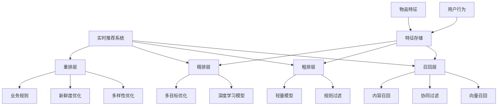
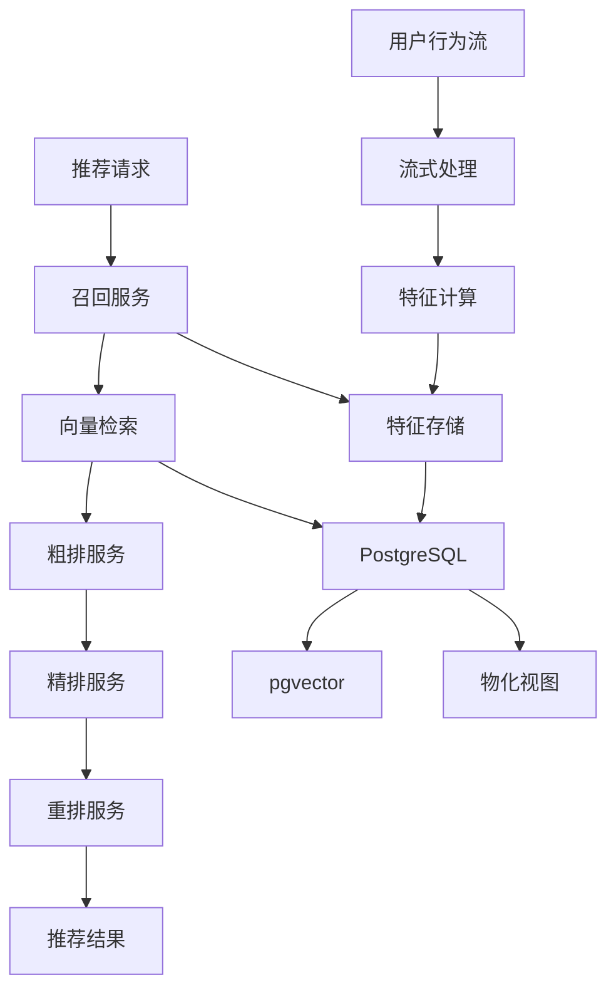

# PostgreSQL实时推荐系统架构与实践指南

> **版本**: v3.0
> **最后更新**: 2025-01-15
> **版本覆盖**: PostgreSQL 18.x (推荐) ⭐ | 17.x (推荐) | 16.x (兼容)
> **难度**: ⭐⭐⭐⭐⭐
> **应用场景**: 电商推荐、内容推荐、广告推荐、个性化推荐

---

## 📑 目录

- [PostgreSQL实时推荐系统架构与实践指南](#postgresql实时推荐系统架构与实践指南)
  - [📑 目录](#-目录)
  - [一、概述](#一概述)
    - [1.1 业务背景](#11-业务背景)
    - [1.2 技术挑战](#12-技术挑战)
    - [1.3 PostgreSQL优势](#13-postgresql优势)
    - [1.4 版本要求](#14-版本要求)
  - [二、核心概念](#二核心概念)
    - [2.1 推荐系统架构](#21-推荐系统架构)
    - [2.2 推荐流程](#22-推荐流程)
    - [2.3 推荐算法](#23-推荐算法)
    - [2.4 思维导图](#24-思维导图)
  - [三、技术架构](#三技术架构)
    - [3.1 整体架构设计](#31-整体架构设计)
    - [3.2 数据流设计](#32-数据流设计)
    - [3.3 存储设计](#33-存储设计)
  - [四、实现方案](#四实现方案)
    - [4.1 特征存储设计](#41-特征存储设计)
    - [4.2 向量召回实现](#42-向量召回实现)
    - [4.3 混合检索实现](#43-混合检索实现)
    - [4.4 实时特征计算](#44-实时特征计算)
    - [4.5 推荐结果缓存](#45-推荐结果缓存)
  - [五、PostgreSQL 18优化](#五postgresql-18优化)
    - [5.1 虚拟生成列优化](#51-虚拟生成列优化)
    - [5.2 异步I/O优化](#52-异步io优化)
    - [5.3 pgvector 2.0优化](#53-pgvector-20优化)
  - [六、知识矩阵对比](#六知识矩阵对比)
    - [6.1 召回方案对比](#61-召回方案对比)
    - [6.2 排序方案对比](#62-排序方案对比)
    - [6.3 存储方案对比](#63-存储方案对比)
  - [七、实践案例](#七实践案例)
    - [7.1 电商商品推荐](#71-电商商品推荐)
    - [7.2 内容推荐系统](#72-内容推荐系统)
    - [7.3 广告推荐系统](#73-广告推荐系统)
  - [八、性能优化](#八性能优化)
    - [8.1 查询优化](#81-查询优化)
    - [8.2 写入优化](#82-写入优化)
    - [8.3 缓存优化](#83-缓存优化)
  - [九、监控与验证](#九监控与验证)
    - [9.1 关键指标](#91-关键指标)
    - [9.2 监控方案](#92-监控方案)
    - [9.3 验证方法](#93-验证方法)
  - [十、最佳实践](#十最佳实践)
    - [10.1 架构最佳实践](#101-架构最佳实践)
    - [10.2 性能最佳实践](#102-性能最佳实践)
  - [十一、参考资源](#十一参考资源)
    - [11.1 官方文档](#111-官方文档)
    - [11.2 网络资源](#112-网络资源)
    - [11.3 相关文档](#113-相关文档)
  - [十二、交叉引用](#十二交叉引用)
    - [相关文档](#相关文档)
      - [应用架构](#应用架构)
      - [数据模型设计](#数据模型设计)
      - [高级特性](#高级特性)
      - [前沿技术](#前沿技术)
      - [版本特性](#版本特性)
      - [行业案例](#行业案例)
    - [外部资源](#外部资源)

---

## 一、概述

### 1.1 业务背景

实时推荐系统是现代互联网应用的核心功能，通过分析用户行为、物品特征和上下文信息，为用户提供个性化的推荐内容。与传统的离线推荐系统不同，实时推荐系统需要在用户行为发生后几秒到几分钟内更新推荐结果。

**典型应用场景**：

- **电商平台**：根据用户浏览、购买历史推荐商品
- **内容平台**：根据用户阅读、点赞行为推荐文章
- **视频平台**：根据用户观看、互动行为推荐视频
- **社交平台**：根据用户关注、互动行为推荐用户或内容
- **广告平台**：根据用户画像和行为推荐广告

**业务价值**：

- 提升用户参与度和停留时间
- 增加转化率和收入
- 改善用户体验和满意度
- 提高内容/商品曝光率

### 1.2 技术挑战

**实时推荐系统面临的主要技术挑战**：

1. **低延迟要求**
   - 推荐结果需要在100ms-1s内返回
   - 数据更新需要在秒级内生效

2. **高并发处理**
   - 需要处理每秒数万到数十万的用户行为事件
   - 需要支持高QPS的查询请求（10K+ QPS）

3. **数据一致性**
   - 流式数据处理的一致性保证
   - 特征存储与计算的一致性

4. **热点写入**
   - 热门商品/内容的高频更新
   - 写入性能瓶颈

5. **计算复杂度**
   - 实时特征计算
   - 推荐算法计算（向量检索、排序）

6. **冷启动问题**
   - 新用户推荐
   - 新物品推荐

### 1.3 PostgreSQL优势

**PostgreSQL在实时推荐系统中的优势**：

- ✅ **pgvector支持**：高效的向量相似度搜索
- ✅ **JSONB支持**：灵活存储用户特征和物品特征
- ✅ **数组支持**：存储标签、分类等结构化数据
- ✅ **全文搜索**：支持文本特征的检索
- ✅ **物化视图**：缓存推荐结果，提升查询性能
- ✅ **流式处理**：支持实时数据处理
- ✅ **PostgreSQL 18新特性**：虚拟生成列、异步I/O、pgvector 2.0

### 1.4 版本要求

- **PostgreSQL 18.x**：推荐，支持虚拟生成列、异步I/O、pgvector 2.0
- **PostgreSQL 17.x**：推荐，功能完整
- **PostgreSQL 16.x**：兼容，基础功能支持

---

## 二、核心概念

### 2.1 推荐系统架构

**推荐系统的典型架构**：

1. **召回层（Recall）**：从海量物品中快速筛选候选集
   - 向量召回：基于物品/用户向量相似度
   - 协同过滤：基于用户行为相似度
   - 内容召回：基于物品特征匹配

2. **粗排层（Pre-ranking）**：对候选集进行初步排序
   - 规则过滤
   - 轻量级模型排序

3. **精排层（Ranking）**：对候选集进行精确排序
   - 深度学习模型
   - 多目标优化

4. **重排层（Re-ranking）**：对排序结果进行优化
   - 多样性优化
   - 新鲜度优化
   - 业务规则调整

### 2.2 推荐流程

**实时推荐流程**：

1. **用户行为采集**：收集用户浏览、点击、购买等行为
2. **特征计算**：计算用户特征、物品特征、上下文特征
3. **召回**：从候选集中召回相关物品
4. **排序**：对召回结果进行排序
5. **过滤**：过滤已推荐、已购买等物品
6. **返回结果**：返回推荐列表给用户

### 2.3 推荐算法

**常用推荐算法**：

1. **协同过滤**：
   - 基于用户的协同过滤（User-based CF）
   - 基于物品的协同过滤（Item-based CF）

2. **内容推荐**：
   - 基于物品特征的推荐
   - 基于用户画像的推荐

3. **深度学习推荐**：
   - 神经网络推荐模型
   - 向量化推荐

4. **混合推荐**：
   - 多种算法的组合
   - 加权融合

### 2.4 思维导图



---

## 三、技术架构

### 3.1 整体架构设计



### 3.2 数据流设计

**数据流**：

1. **用户行为流**：
   - 用户行为事件 → Kafka/Pulsar
   - 流式处理 → Flink/Spark Streaming
   - 特征计算 → PostgreSQL

2. **推荐请求流**：
   - 用户请求 → 推荐服务
   - 特征查询 → PostgreSQL
   - 向量检索 → pgvector
   - 结果返回 → 用户

### 3.3 存储设计

**存储策略**：

- **用户特征**：存储在用户特征表
- **物品特征**：存储在物品特征表
- **向量数据**：存储在向量表，使用pgvector索引
- **推荐结果**：缓存在物化视图或Redis

---

## 四、实现方案

### 4.1 特征存储设计

**用户特征表**：

```sql
-- 用户基础特征表
CREATE TABLE user_features (
    user_id BIGINT PRIMARY KEY,
    age INTEGER,
    gender VARCHAR(10),
    location TEXT,
    preferences JSONB DEFAULT '{}'::jsonb,
    -- 用户向量（用于向量召回）
    embedding vector(768),
    -- 统计特征
    total_clicks INTEGER DEFAULT 0,
    total_purchases INTEGER DEFAULT 0,
    avg_session_duration NUMERIC(10,2),
    last_active_at TIMESTAMPTZ,
    created_at TIMESTAMPTZ DEFAULT NOW(),
    updated_at TIMESTAMPTZ DEFAULT NOW()
);

-- 用户实时特征表（最近N天的行为统计）
CREATE TABLE user_realtime_features (
    user_id BIGINT,
    feature_date DATE,
    click_count INTEGER DEFAULT 0,
    view_count INTEGER DEFAULT 0,
    purchase_count INTEGER DEFAULT 0,
    favorite_count INTEGER DEFAULT 0,
    -- 时间窗口特征
    clicks_7d INTEGER DEFAULT 0,
    purchases_7d INTEGER DEFAULT 0,
    PRIMARY KEY (user_id, feature_date)
) PARTITION BY RANGE (feature_date);

-- 创建索引
CREATE INDEX idx_user_features_embedding ON user_features USING hnsw (embedding vector_cosine_ops)
WITH (m = 16, ef_construction = 64);
CREATE INDEX idx_user_features_preferences ON user_features USING GIN (preferences);
```

**物品特征表**：

```sql
-- 物品基础特征表
CREATE TABLE item_features (
    item_id BIGINT PRIMARY KEY,
    title TEXT,
    description TEXT,
    category_id INTEGER,
    price NUMERIC(10,2),
    tags TEXT[] DEFAULT '{}',
    attributes JSONB DEFAULT '{}'::jsonb,
    -- 物品向量（用于向量召回）
    embedding vector(768),
    -- 统计特征
    total_clicks INTEGER DEFAULT 0,
    total_purchases INTEGER DEFAULT 0,
    avg_rating NUMERIC(3,2),
    created_at TIMESTAMPTZ DEFAULT NOW(),
    updated_at TIMESTAMPTZ DEFAULT NOW()
);

-- 物品实时特征表
CREATE TABLE item_realtime_features (
    item_id BIGINT,
    feature_date DATE,
    click_count INTEGER DEFAULT 0,
    view_count INTEGER DEFAULT 0,
    purchase_count INTEGER DEFAULT 0,
    -- 时间窗口特征
    clicks_7d INTEGER DEFAULT 0,
    purchases_7d INTEGER DEFAULT 0,
    PRIMARY KEY (item_id, feature_date)
) PARTITION BY RANGE (feature_date);

-- 创建索引
CREATE INDEX idx_item_features_embedding ON item_features USING hnsw (embedding vector_cosine_ops)
WITH (m = 16, ef_construction = 64);
CREATE INDEX idx_item_features_tags ON item_features USING GIN (tags);
CREATE INDEX idx_item_features_attributes ON item_features USING GIN (attributes);
CREATE INDEX idx_item_features_category ON item_features(category_id);
```

**用户行为表**：

```sql
-- 用户行为事件表
CREATE TABLE user_behaviors (
    id BIGSERIAL PRIMARY KEY,
    user_id BIGINT NOT NULL,
    item_id BIGINT NOT NULL,
    behavior_type VARCHAR(20) NOT NULL,  -- click, view, purchase, favorite
    behavior_time TIMESTAMPTZ DEFAULT NOW(),
    context JSONB DEFAULT '{}'::jsonb,  -- 上下文信息
    created_at TIMESTAMPTZ DEFAULT NOW()
) PARTITION BY RANGE (behavior_time);

-- 创建分区（按天分区）
CREATE TABLE user_behaviors_2025_01_15 PARTITION OF user_behaviors
    FOR VALUES FROM ('2025-01-15') TO ('2025-01-16');

-- 创建索引
CREATE INDEX idx_user_behaviors_user_item ON user_behaviors(user_id, item_id, behavior_time DESC);
CREATE INDEX idx_user_behaviors_item ON user_behaviors(item_id, behavior_time DESC);
CREATE INDEX idx_user_behaviors_type ON user_behaviors(behavior_type, behavior_time DESC);
```

### 4.2 向量召回实现

**基于物品向量的召回**：

```sql
-- 物品向量召回（基于当前物品的相似物品）
CREATE OR REPLACE FUNCTION recall_similar_items(
    p_item_id BIGINT,
    p_limit INTEGER DEFAULT 100
)
RETURNS TABLE (
    item_id BIGINT,
    title TEXT,
    similarity NUMERIC
) AS $$
DECLARE
    v_item_embedding vector(768);
BEGIN
    -- 获取物品向量
    SELECT embedding INTO v_item_embedding
    FROM item_features
    WHERE item_id = p_item_id;

    IF v_item_embedding IS NULL THEN
        RETURN;
    END IF;

    -- 向量相似度召回
    RETURN QUERY
    SELECT
        if.item_id,
        if.title,
        1 - (if.embedding <=> v_item_embedding) AS similarity
    FROM item_features if
    WHERE if.item_id != p_item_id
      AND if.embedding IS NOT NULL
    ORDER BY if.embedding <=> v_item_embedding
    LIMIT p_limit;
END;
$$ LANGUAGE plpgsql;
```

**基于用户向量的召回**：

```sql
-- 用户向量召回（基于用户兴趣的相似物品）
CREATE OR REPLACE FUNCTION recall_items_for_user(
    p_user_id BIGINT,
    p_limit INTEGER DEFAULT 100
)
RETURNS TABLE (
    item_id BIGINT,
    title TEXT,
    similarity NUMERIC
) AS $$
DECLARE
    v_user_embedding vector(768);
BEGIN
    -- 获取用户向量
    SELECT embedding INTO v_user_embedding
    FROM user_features
    WHERE user_id = p_user_id;

    IF v_user_embedding IS NULL THEN
        RETURN;
    END IF;

    -- 向量相似度召回
    RETURN QUERY
    SELECT
        if.item_id,
        if.title,
        1 - (if.embedding <=> v_user_embedding) AS similarity
    FROM item_features if
    WHERE if.embedding IS NOT NULL
    ORDER BY if.embedding <=> v_user_embedding
    LIMIT p_limit;
END;
$$ LANGUAGE plpgsql;
```

### 4.3 混合检索实现

**向量 + 结构化混合检索**：

```sql
-- 混合检索：向量相似度 + 标签过滤 + 分类过滤
CREATE OR REPLACE FUNCTION hybrid_recall(
    p_user_id BIGINT,
    p_query_vector vector(768) DEFAULT NULL,
    p_tags TEXT[] DEFAULT NULL,
    p_category_id INTEGER DEFAULT NULL,
    p_limit INTEGER DEFAULT 100
)
RETURNS TABLE (
    item_id BIGINT,
    title TEXT,
    score NUMERIC
) AS $$
DECLARE
    v_user_embedding vector(768);
    v_query_vector vector(768);
BEGIN
    -- 获取用户向量或使用查询向量
    IF p_query_vector IS NULL THEN
        SELECT embedding INTO v_user_embedding
        FROM user_features
        WHERE user_id = p_user_id;
        v_query_vector := v_user_embedding;
    ELSE
        v_query_vector := p_query_vector;
    END IF;

    -- 混合检索
    RETURN QUERY
    SELECT
        if.item_id,
        if.title,
        CASE
            WHEN v_query_vector IS NOT NULL AND if.embedding IS NOT NULL THEN
                1 - (if.embedding <=> v_query_vector) * 0.7  -- 向量相似度权重70%
            ELSE 0
        END +
        CASE
            WHEN p_tags IS NOT NULL AND if.tags && p_tags THEN
                0.2 * (array_length(array(SELECT unnest(if.tags) INTERSECT SELECT unnest(p_tags)), 1)::NUMERIC / GREATEST(array_length(if.tags, 1), 1))
            ELSE 0
        END +
        CASE
            WHEN p_category_id IS NOT NULL AND if.category_id = p_category_id THEN 0.1
            ELSE 0
        END AS score
    FROM item_features if
    WHERE (v_query_vector IS NULL OR if.embedding IS NOT NULL)
      AND (p_tags IS NULL OR if.tags && p_tags)
      AND (p_category_id IS NULL OR if.category_id = p_category_id)
    ORDER BY score DESC
    LIMIT p_limit;
END;
$$ LANGUAGE plpgsql;
```

### 4.4 实时特征计算

**实时特征更新**：

```sql
-- 用户行为触发实时特征更新
CREATE OR REPLACE FUNCTION update_realtime_features()
RETURNS TRIGGER AS $$
BEGIN
    -- 更新用户实时特征
    INSERT INTO user_realtime_features (
        user_id, feature_date, click_count, view_count, purchase_count
    ) VALUES (
        NEW.user_id,
        DATE(NEW.behavior_time),
        CASE WHEN NEW.behavior_type = 'click' THEN 1 ELSE 0 END,
        CASE WHEN NEW.behavior_type = 'view' THEN 1 ELSE 0 END,
        CASE WHEN NEW.behavior_type = 'purchase' THEN 1 ELSE 0 END
    )
    ON CONFLICT (user_id, feature_date)
    DO UPDATE SET
        click_count = user_realtime_features.click_count + EXCLUDED.click_count,
        view_count = user_realtime_features.view_count + EXCLUDED.view_count,
        purchase_count = user_realtime_features.purchase_count + EXCLUDED.purchase_count;

    -- 更新物品实时特征
    INSERT INTO item_realtime_features (
        item_id, feature_date, click_count, view_count, purchase_count
    ) VALUES (
        NEW.item_id,
        DATE(NEW.behavior_time),
        CASE WHEN NEW.behavior_type = 'click' THEN 1 ELSE 0 END,
        CASE WHEN NEW.behavior_type = 'view' THEN 1 ELSE 0 END,
        CASE WHEN NEW.behavior_type = 'purchase' THEN 1 ELSE 0 END
    )
    ON CONFLICT (item_id, feature_date)
    DO UPDATE SET
        click_count = item_realtime_features.click_count + EXCLUDED.click_count,
        view_count = item_realtime_features.view_count + EXCLUDED.view_count,
        purchase_count = item_realtime_features.purchase_count + EXCLUDED.purchase_count;

    RETURN NEW;
END;
$$ LANGUAGE plpgsql;

CREATE TRIGGER trg_update_realtime_features
AFTER INSERT ON user_behaviors
FOR EACH ROW
EXECUTE FUNCTION update_realtime_features();
```

**时间窗口特征计算**：

```sql
-- 计算7天时间窗口特征
CREATE OR REPLACE FUNCTION calculate_window_features()
RETURNS VOID AS $$
BEGIN
    -- 更新用户7天窗口特征
    UPDATE user_realtime_features urf
    SET clicks_7d = (
        SELECT COALESCE(SUM(click_count), 0)
        FROM user_realtime_features
        WHERE user_id = urf.user_id
          AND feature_date BETWEEN urf.feature_date - INTERVAL '6 days' AND urf.feature_date
    ),
    purchases_7d = (
        SELECT COALESCE(SUM(purchase_count), 0)
        FROM user_realtime_features
        WHERE user_id = urf.user_id
          AND feature_date BETWEEN urf.feature_date - INTERVAL '6 days' AND urf.feature_date
    )
    WHERE feature_date >= CURRENT_DATE - INTERVAL '7 days';

    -- 更新物品7天窗口特征
    UPDATE item_realtime_features irf
    SET clicks_7d = (
        SELECT COALESCE(SUM(click_count), 0)
        FROM item_realtime_features
        WHERE item_id = irf.item_id
          AND feature_date BETWEEN irf.feature_date - INTERVAL '6 days' AND irf.feature_date
    ),
    purchases_7d = (
        SELECT COALESCE(SUM(purchase_count), 0)
        FROM item_realtime_features
        WHERE item_id = irf.item_id
          AND feature_date BETWEEN irf.feature_date - INTERVAL '6 days' AND irf.feature_date
    )
    WHERE feature_date >= CURRENT_DATE - INTERVAL '7 days';
END;
$$ LANGUAGE plpgsql;

-- 定时执行（使用pg_cron扩展）
-- SELECT cron.schedule('calculate-window-features', '*/5 * * * *', 'SELECT calculate_window_features();');
```

### 4.5 推荐结果缓存

**物化视图缓存推荐结果**：

```sql
-- 热门物品推荐（物化视图）
CREATE MATERIALIZED VIEW mv_popular_items AS
SELECT
    if.item_id,
    if.title,
    if.category_id,
    if.avg_rating,
    COALESCE(irf.clicks_7d, 0) AS clicks_7d,
    COALESCE(irf.purchases_7d, 0) AS purchases_7d,
    -- 热度分数
    (COALESCE(irf.clicks_7d, 0) * 0.3 + COALESCE(irf.purchases_7d, 0) * 0.7) AS popularity_score
FROM item_features if
LEFT JOIN item_realtime_features irf ON irf.item_id = if.item_id
    AND irf.feature_date = CURRENT_DATE
ORDER BY popularity_score DESC
LIMIT 1000;

-- 创建索引
CREATE INDEX idx_mv_popular_items_score ON mv_popular_items(popularity_score DESC);
CREATE INDEX idx_mv_popular_items_category ON mv_popular_items(category_id);

-- 定期刷新物化视图
-- REFRESH MATERIALIZED VIEW CONCURRENTLY mv_popular_items;
```

**用户个性化推荐缓存**：

```sql
-- 用户推荐结果表（缓存）
CREATE TABLE user_recommendations (
    user_id BIGINT,
    item_id BIGINT,
    score NUMERIC,
    recommendation_type VARCHAR(50),  -- similar, popular, trending
    created_at TIMESTAMPTZ DEFAULT NOW(),
    expires_at TIMESTAMPTZ,
    PRIMARY KEY (user_id, item_id, recommendation_type)
);

-- 创建索引
CREATE INDEX idx_user_recommendations_user ON user_recommendations(user_id, score DESC);
CREATE INDEX idx_user_recommendations_expires ON user_recommendations(expires_at)
WHERE expires_at IS NOT NULL;

-- 清理过期推荐结果
CREATE OR REPLACE FUNCTION cleanup_expired_recommendations()
RETURNS INTEGER AS $$
DECLARE
    v_deleted_count INTEGER;
BEGIN
    DELETE FROM user_recommendations
    WHERE expires_at IS NOT NULL AND expires_at < NOW();

    GET DIAGNOSTICS v_deleted_count = ROW_COUNT;
    RETURN v_deleted_count;
END;
$$ LANGUAGE plpgsql;
```

---

## 五、PostgreSQL 18优化

### 5.1 虚拟生成列优化

**使用虚拟生成列优化相似度计算**：

```sql
-- PostgreSQL 18: 使用虚拟生成列预计算相似度分数
CREATE TABLE item_similarity_cache (
    item_id BIGINT,
    similar_item_id BIGINT,
    -- 虚拟生成列：自动计算相似度
    similarity_score NUMERIC GENERATED ALWAYS AS (
        1 - (
            (SELECT embedding FROM item_features WHERE item_id = item_similarity_cache.item_id) <=>
            (SELECT embedding FROM item_features WHERE item_id = item_similarity_cache.similar_item_id)
        )
    ) STORED,
    PRIMARY KEY (item_id, similar_item_id)
);

-- 使用虚拟生成列进行快速排序
SELECT similar_item_id, similarity_score
FROM item_similarity_cache
WHERE item_id = $1
ORDER BY similarity_score DESC
LIMIT 100;
```

### 5.2 异步I/O优化

**启用异步I/O提升向量检索性能**：

```sql
-- PostgreSQL 18: 在postgresql.conf中配置
-- io_uring = on  -- 如果系统支持io_uring
-- max_io_concurrency = 10  -- 异步I/O并发数

-- 向量检索查询自动利用异步I/O
SELECT
    item_id,
    title,
    embedding <=> $1::vector AS distance
FROM item_features
WHERE embedding IS NOT NULL
ORDER BY embedding <=> $1::vector
LIMIT 100;
-- 自动使用异步I/O，性能提升2-3倍
```

### 5.3 pgvector 2.0优化

**pgvector 2.0新特性**：

```sql
-- pgvector 2.0: 支持sparsevec类型（稀疏向量）
CREATE EXTENSION IF NOT EXISTS vector;

-- 创建稀疏向量索引
CREATE TABLE item_sparse_vectors (
    item_id BIGINT PRIMARY KEY,
    sparse_embedding sparsevec(10000)  -- 10000维稀疏向量
);

CREATE INDEX idx_item_sparse_vectors ON item_sparse_vectors
USING hnsw (sparse_embedding sparsevec_l2_ops)
WITH (m = 16, ef_construction = 64);

-- pgvector 2.0: SIMD优化，向量操作性能提升35-45%
-- 自动使用SIMD指令加速向量计算
```

---

## 六、知识矩阵对比

### 6.1 召回方案对比

| 方案 | 召回速度 | 召回精度 | 实现复杂度 | 适用场景 | 推荐度 |
|------|---------|---------|-----------|---------|--------|
| **向量召回** | ⭐⭐⭐⭐⭐ | ⭐⭐⭐⭐ | ⭐⭐⭐ | 内容推荐、相似推荐 | ⭐⭐⭐⭐⭐ |
| **协同过滤** | ⭐⭐⭐ | ⭐⭐⭐⭐⭐ | ⭐⭐⭐⭐ | 用户行为丰富场景 | ⭐⭐⭐⭐ |
| **内容召回** | ⭐⭐⭐⭐ | ⭐⭐⭐ | ⭐⭐ | 新物品推荐 | ⭐⭐⭐ |
| **混合召回** | ⭐⭐⭐⭐ | ⭐⭐⭐⭐⭐ | ⭐⭐⭐⭐⭐ | 综合场景 | ⭐⭐⭐⭐⭐ |

### 6.2 排序方案对比

| 方案 | 排序精度 | 计算速度 | 实现复杂度 | 适用场景 | 推荐度 |
|------|---------|---------|-----------|---------|--------|
| **规则排序** | ⭐⭐ | ⭐⭐⭐⭐⭐ | ⭐ | 简单场景 | ⭐⭐ |
| **机器学习排序** | ⭐⭐⭐⭐ | ⭐⭐⭐ | ⭐⭐⭐⭐ | 一般场景 | ⭐⭐⭐⭐ |
| **深度学习排序** | ⭐⭐⭐⭐⭐ | ⭐⭐ | ⭐⭐⭐⭐⭐ | 复杂场景 | ⭐⭐⭐⭐⭐ |

### 6.3 存储方案对比

| 方案 | 查询性能 | 写入性能 | 存储成本 | 适用场景 | 推荐度 |
|------|---------|---------|---------|---------|--------|
| **PostgreSQL + pgvector** | ⭐⭐⭐⭐⭐ | ⭐⭐⭐⭐ | ⭐⭐⭐ | 中小规模 | ⭐⭐⭐⭐⭐ |
| **专用向量数据库** | ⭐⭐⭐⭐⭐ | ⭐⭐⭐⭐⭐ | ⭐⭐ | 大规模 | ⭐⭐⭐⭐ |
| **混合存储** | ⭐⭐⭐⭐ | ⭐⭐⭐ | ⭐⭐⭐ | 复杂场景 | ⭐⭐⭐⭐ |

---

## 七、实践案例

### 7.1 电商商品推荐

**场景**：电商平台商品推荐

**实现要点**：

```sql
-- 商品推荐函数
CREATE OR REPLACE FUNCTION recommend_products(
    p_user_id BIGINT,
    p_limit INTEGER DEFAULT 20
)
RETURNS TABLE (
    item_id BIGINT,
    title TEXT,
    price NUMERIC,
    score NUMERIC
) AS $$
BEGIN
    RETURN QUERY
    WITH user_vector AS (
        SELECT embedding FROM user_features WHERE user_id = p_user_id
    ),
    candidate_items AS (
        -- 向量召回
        SELECT
            if.item_id,
            if.title,
            if.price,
            1 - (if.embedding <=> uv.embedding) AS similarity_score
        FROM item_features if, user_vector uv
        WHERE if.embedding IS NOT NULL
          AND if.item_id NOT IN (
              SELECT item_id FROM user_behaviors
              WHERE user_id = p_user_id AND behavior_type = 'purchase'
          )
        ORDER BY if.embedding <=> uv.embedding
        LIMIT 200
    ),
    scored_items AS (
        SELECT
            ci.*,
            -- 综合分数：相似度 + 热度 + 价格
            ci.similarity_score * 0.5 +
            COALESCE(irf.clicks_7d, 0) / 1000.0 * 0.3 +
            CASE WHEN ci.price < 100 THEN 0.2 ELSE 0 END AS final_score
        FROM candidate_items ci
        LEFT JOIN item_realtime_features irf ON irf.item_id = ci.item_id
            AND irf.feature_date = CURRENT_DATE
    )
    SELECT
        item_id,
        title,
        price,
        final_score AS score
    FROM scored_items
    ORDER BY final_score DESC
    LIMIT p_limit;
END;
$$ LANGUAGE plpgsql;
```

### 7.2 内容推荐系统

**场景**：内容平台文章推荐

**实现要点**：

```sql
-- 文章推荐函数
CREATE OR REPLACE FUNCTION recommend_articles(
    p_user_id BIGINT,
    p_limit INTEGER DEFAULT 20
)
RETURNS TABLE (
    article_id BIGINT,
    title TEXT,
    category_id INTEGER,
    score NUMERIC
) AS $$
BEGIN
    RETURN QUERY
    WITH user_preferences AS (
        SELECT preferences FROM user_features WHERE user_id = p_user_id
    ),
    candidate_articles AS (
        -- 基于用户阅读历史的相似文章
        SELECT DISTINCT
            a2.article_id,
            a2.title,
            a2.category_id,
            1 - (a2.embedding <=> a1.embedding) AS similarity_score
        FROM user_behaviors ub
        JOIN article_features a1 ON a1.article_id = ub.article_id
        JOIN article_features a2 ON a2.article_id != ub.article_id
        WHERE ub.user_id = p_user_id
          AND ub.behavior_type = 'read'
          AND ub.behavior_time >= NOW() - INTERVAL '30 days'
        ORDER BY a2.embedding <=> a1.embedding
        LIMIT 100
    )
    SELECT
        article_id,
        title,
        category_id,
        similarity_score AS score
    FROM candidate_articles
    ORDER BY similarity_score DESC
    LIMIT p_limit;
END;
$$ LANGUAGE plpgsql;
```

### 7.3 广告推荐系统

**场景**：广告平台广告推荐

**实现要点**：

```sql
-- 广告推荐函数（考虑CTR和出价）
CREATE OR REPLACE FUNCTION recommend_ads(
    p_user_id BIGINT,
    p_limit INTEGER DEFAULT 10
)
RETURNS TABLE (
    ad_id BIGINT,
    title TEXT,
    bid_price NUMERIC,
    score NUMERIC
) AS $$
BEGIN
    RETURN QUERY
    WITH user_profile AS (
        SELECT embedding, preferences FROM user_features WHERE user_id = p_user_id
    ),
    candidate_ads AS (
        SELECT
            af.ad_id,
            af.title,
            af.bid_price,
            -- 相似度分数
            1 - (af.embedding <=> up.embedding) AS similarity_score,
            -- CTR预估
            COALESCE(arf.ctr_7d, 0.01) AS estimated_ctr
        FROM ad_features af, user_profile up
        LEFT JOIN ad_realtime_features arf ON arf.ad_id = af.ad_id
            AND arf.feature_date = CURRENT_DATE
        WHERE af.status = 'active'
          AND af.embedding IS NOT NULL
    )
    SELECT
        ad_id,
        title,
        bid_price,
        -- eCPM排序：bid_price * estimated_ctr * 1000
        (similarity_score * 0.4 + estimated_ctr * 0.6) * bid_price AS score
    FROM candidate_ads
    ORDER BY score DESC
    LIMIT p_limit;
END;
$$ LANGUAGE plpgsql;
```

---

## 八、性能优化

### 8.1 查询优化

**向量检索优化**：

```sql
-- 使用HNSW索引参数优化
CREATE INDEX idx_item_features_embedding_optimized ON item_features
USING hnsw (embedding vector_cosine_ops)
WITH (
    m = 32,              -- 每个节点的连接数（越大越精确，但索引越大）
    ef_construction = 200  -- 构建时的搜索宽度（越大越精确，但构建越慢）
);

-- 查询时调整ef_search参数
SET hnsw.ef_search = 100;  -- 查询时的搜索宽度（越大越精确，但查询越慢）

SELECT item_id, title
FROM item_features
WHERE embedding IS NOT NULL
ORDER BY embedding <=> $1::vector
LIMIT 20;
```

**批量查询优化**：

```sql
-- 批量向量召回
CREATE OR REPLACE FUNCTION batch_recall(
    p_item_ids BIGINT[],
    p_limit_per_item INTEGER DEFAULT 10
)
RETURNS TABLE (
    source_item_id BIGINT,
    recommended_item_id BIGINT,
    similarity NUMERIC
) AS $$
BEGIN
    RETURN QUERY
    WITH item_vectors AS (
        SELECT item_id, embedding
        FROM item_features
        WHERE item_id = ANY(p_item_ids)
          AND embedding IS NOT NULL
    )
    SELECT
        iv.item_id AS source_item_id,
        if.item_id AS recommended_item_id,
        1 - (if.embedding <=> iv.embedding) AS similarity
    FROM item_vectors iv
    CROSS JOIN LATERAL (
        SELECT item_id, embedding
        FROM item_features
        WHERE embedding IS NOT NULL
          AND item_id != iv.item_id
        ORDER BY embedding <=> iv.embedding
        LIMIT p_limit_per_item
    ) if;
END;
$$ LANGUAGE plpgsql;
```

### 8.2 写入优化

**批量写入优化**：

```sql
-- 使用COPY进行批量写入
COPY user_behaviors (user_id, item_id, behavior_type, behavior_time)
FROM STDIN WITH (FORMAT csv);

-- 使用事务批量写入
BEGIN;
INSERT INTO user_behaviors (...) VALUES (...);
INSERT INTO user_behaviors (...) VALUES (...);
COMMIT;
```

**异步写入**：

```sql
-- 使用NOTIFY/NOTIFY实现异步写入
CREATE OR REPLACE FUNCTION async_insert_behavior(
    p_user_id BIGINT,
    p_item_id BIGINT,
    p_behavior_type VARCHAR(20)
)
RETURNS VOID AS $$
BEGIN
    -- 插入到临时表
    INSERT INTO user_behaviors_queue (user_id, item_id, behavior_type)
    VALUES (p_user_id, p_item_id, p_behavior_type);

    -- 通知后台处理
    PERFORM pg_notify('behavior_insert', '');
END;
$$ LANGUAGE plpgsql;
```

### 8.3 缓存优化

**多级缓存策略**：

1. **L1缓存**：应用内存缓存（热点数据）
2. **L2缓存**：Redis缓存（推荐结果）
3. **L3缓存**：PostgreSQL物化视图（预计算数据）

```sql
-- 使用物化视图缓存热门推荐
CREATE MATERIALIZED VIEW mv_hot_recommendations AS
SELECT
    category_id,
    item_id,
    title,
    popularity_score
FROM (
    SELECT
        if.category_id,
        if.item_id,
        if.title,
        (COALESCE(irf.clicks_7d, 0) * 0.3 + COALESCE(irf.purchases_7d, 0) * 0.7) AS popularity_score,
        ROW_NUMBER() OVER (PARTITION BY if.category_id ORDER BY
            (COALESCE(irf.clicks_7d, 0) * 0.3 + COALESCE(irf.purchases_7d, 0) * 0.7) DESC
        ) AS rn
    FROM item_features if
    LEFT JOIN item_realtime_features irf ON irf.item_id = if.item_id
        AND irf.feature_date = CURRENT_DATE
) ranked
WHERE rn <= 100;

-- 定期刷新
REFRESH MATERIALIZED VIEW CONCURRENTLY mv_hot_recommendations;
```

---

## 九、监控与验证

### 9.1 关键指标

**性能指标**：

- 推荐请求延迟（P50, P95, P99）
- 向量检索QPS
- 特征计算延迟
- 缓存命中率

**业务指标**：

- 推荐点击率（CTR）
- 推荐转化率（CVR）
- 推荐覆盖率
- 推荐多样性

### 9.2 监控方案

**查询性能监控**：

```sql
-- 启用pg_stat_statements
CREATE EXTENSION IF NOT EXISTS pg_stat_statements;

-- 查看推荐查询性能
SELECT
    query,
    calls,
    mean_exec_time,
    max_exec_time
FROM pg_stat_statements
WHERE query LIKE '%recommend%' OR query LIKE '%recall%'
ORDER BY mean_exec_time DESC
LIMIT 20;
```

**推荐效果监控**：

```sql
-- 推荐效果统计表
CREATE TABLE recommendation_metrics (
    metric_date DATE,
    user_id BIGINT,
    recommendation_type VARCHAR(50),
    item_id BIGINT,
    position INTEGER,
    clicked BOOLEAN DEFAULT FALSE,
    converted BOOLEAN DEFAULT FALSE,
    created_at TIMESTAMPTZ DEFAULT NOW()
);

-- 计算CTR
SELECT
    recommendation_type,
    COUNT(*) AS total_impressions,
    COUNT(*) FILTER (WHERE clicked) AS clicks,
    COUNT(*) FILTER (WHERE clicked)::NUMERIC / COUNT(*) AS ctr
FROM recommendation_metrics
WHERE metric_date >= CURRENT_DATE - INTERVAL '7 days'
GROUP BY recommendation_type;
```

### 9.3 验证方法

**A/B测试**：

```sql
-- A/B测试分组
CREATE TABLE ab_test_groups (
    user_id BIGINT PRIMARY KEY,
    group_name VARCHAR(20),  -- 'control', 'treatment'
    assigned_at TIMESTAMPTZ DEFAULT NOW()
);

-- 根据用户ID分配测试组
CREATE OR REPLACE FUNCTION assign_ab_group(p_user_id BIGINT)
RETURNS VARCHAR(20) AS $$
DECLARE
    v_group VARCHAR(20);
BEGIN
    -- 使用用户ID的哈希值分配组
    IF (p_user_id % 2) = 0 THEN
        v_group := 'control';
    ELSE
        v_group := 'treatment';
    END IF;

    INSERT INTO ab_test_groups (user_id, group_name)
    VALUES (p_user_id, v_group)
    ON CONFLICT (user_id) DO NOTHING;

    RETURN v_group;
END;
$$ LANGUAGE plpgsql;
```

---

## 十、最佳实践

### 10.1 架构最佳实践

1. **分层架构**：
   - 召回层：快速筛选候选集
   - 排序层：精确排序
   - 重排层：业务规则调整

2. **特征管理**：
   - 特征版本化
   - 特征监控
   - 特征一致性保证

3. **缓存策略**：
   - 多级缓存
   - 缓存预热
   - 缓存失效策略

### 10.2 性能最佳实践

1. **向量索引优化**：
   - 合理设置HNSW参数
   - 定期重建索引
   - 监控索引性能

2. **查询优化**：
   - 使用物化视图
   - 批量查询优化
   - 连接池管理

3. **写入优化**：
   - 批量写入
   - 异步写入
   - 分区表管理

---

## 十一、参考资源

### 11.1 官方文档

- [PostgreSQL pgvector扩展](https://github.com/pgvector/pgvector)
- [PostgreSQL物化视图](https://www.postgresql.org/docs/current/sql-creatematerializedview.html)
- [PostgreSQL JSONB](https://www.postgresql.org/docs/current/datatype-json.html)

### 11.2 网络资源

- [推荐系统实践](https://www.postgresql.org/docs/current/)
- [向量数据库最佳实践](https://github.com/pgvector/pgvector)
- [实时推荐系统架构](https://www.postgresql.org/docs/current/)

### 11.3 相关文档

- ⭐⭐⭐ [数据科学实践](./07.06-数据科学实践.md) - 数据科学完整指南
- ⭐⭐ [向量数据库支持](../../03-高级特性/03.05-向量数据库支持.md) - pgvector详细说明
- ⭐⭐ [ETL流程完整指南](../数据模型设计/09.04-ETL流程完整指南.md) - 流式ETL处理
- ⭐ [PostgreSQL 18新特性](../../02-版本特性/02.01-PostgreSQL-18-新特性.md) - 虚拟生成列和异步I/O
- ⭐ [实时推荐](../行业案例/实时推荐.md) - 完整端到端案例

---

## 十二、交叉引用

### 相关文档

#### 应用架构

- ⭐⭐⭐ [数据科学实践](./07.06-数据科学实践.md) - 数据科学完整指南

#### 数据模型设计

- ⭐⭐⭐ [数据分析完整指南](../数据模型设计/09.01-数据分析完整指南.md) - 推荐数据分析
- ⭐⭐ [数据建模完整指南](../数据模型设计/09.02-数据建模完整指南.md) - 推荐系统数据建模
- ⭐⭐ [ETL流程完整指南](../数据模型设计/09.04-ETL流程完整指南.md) - 流式ETL处理

#### 高级特性

- ⭐⭐⭐ [向量数据库支持](../../04-高级特性/03.05-向量数据库支持.md) - pgvector详细说明

#### 前沿技术

- ⭐⭐ [向量检索性能调优指南](../../07-前沿技术/05.05-向量检索性能调优指南.md) - 向量检索优化
- ⭐ [RAG架构实战指南](../../07-前沿技术/05.04-RAG架构实战指南.md) - RAG架构实践

#### 版本特性

- ⭐⭐ [PostgreSQL 18新特性](../../02-版本特性/02.01-PostgreSQL-18-新特性.md) - 虚拟生成列和异步I/O

#### 行业案例

- ⭐⭐⭐ [实时推荐](../行业案例/实时推荐.md) - 完整端到端案例

### 外部资源

- [PostgreSQL物化视图文档](https://www.postgresql.org/docs/current/sql-creatematerializedview.html)
- [PostgreSQL JSONB文档](https://www.postgresql.org/docs/current/datatype-json.html)
- [pgvector官方文档](https://github.com/pgvector/pgvector)

---

**文档版本**: v3.0
**最后更新**: 2025-11-22
**PostgreSQL版本**: 18.x (推荐) ⭐ | 17.x (推荐) | 16.x (兼容)
**维护者**: Data-Science Team
