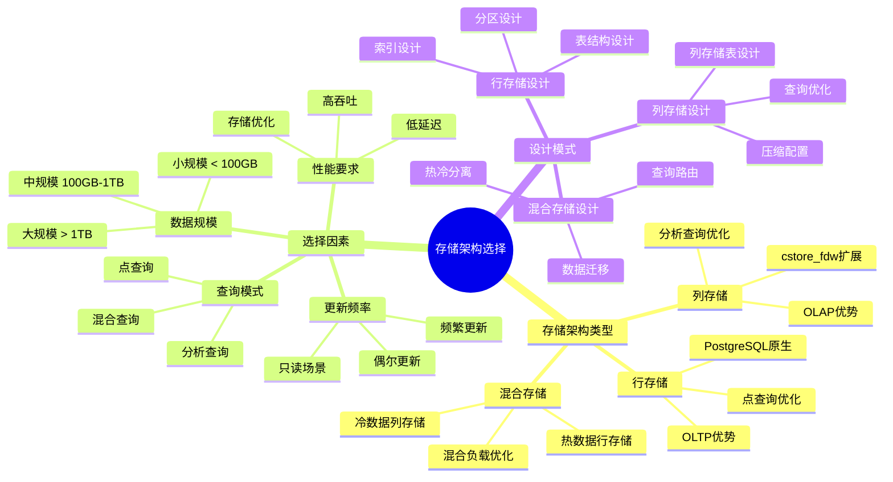
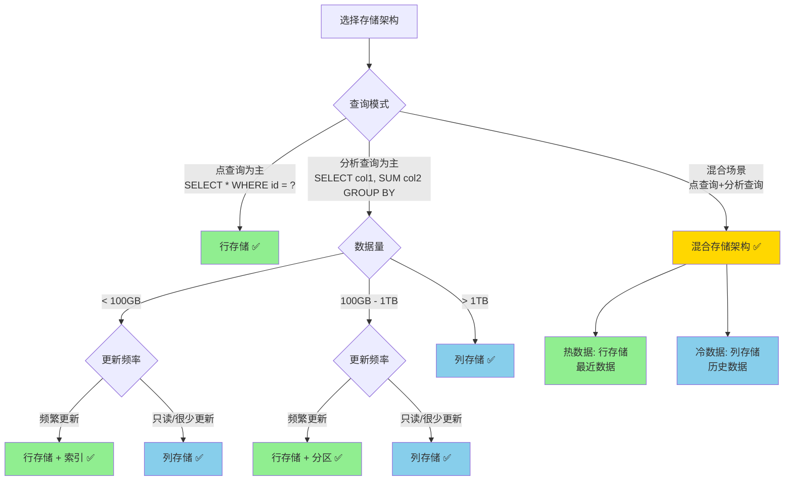
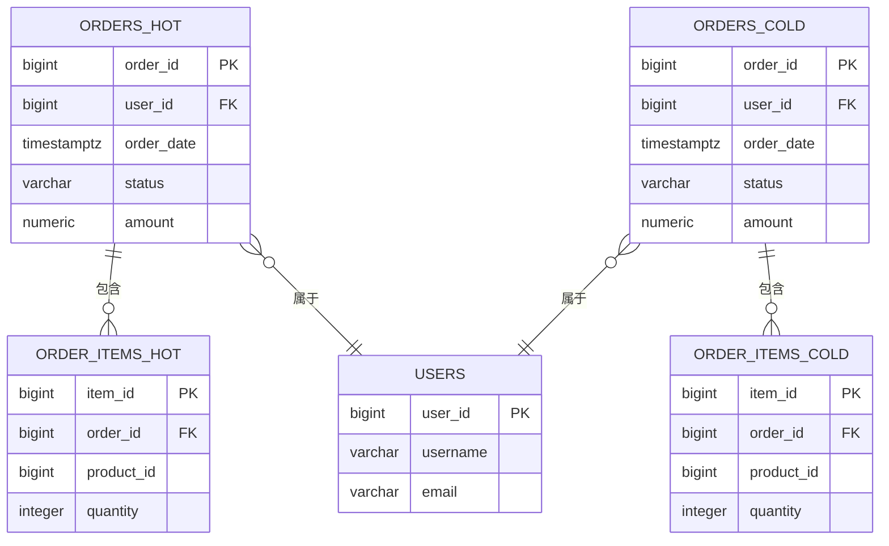
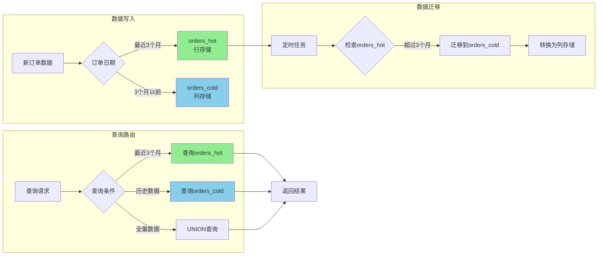
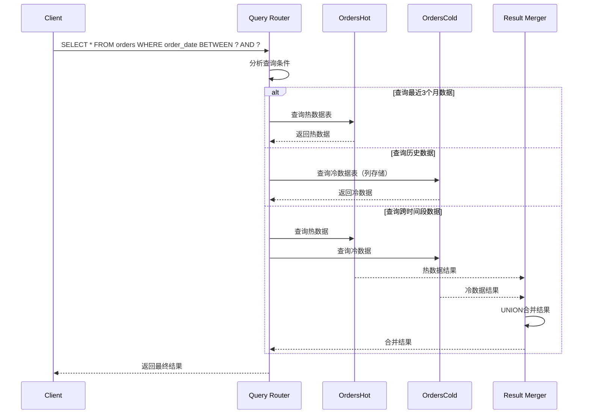

# PostgreSQL数据建模完整指南

> **版本**: v1.1
> **最后更新**: 2025-11-22
> **版本覆盖**: PostgreSQL 18.x (推荐) ⭐ | 17.x (推荐) | 16.x (兼容)
> **难度**: ⭐⭐⭐⭐
> **应用场景**: 数据库设计、数据建模、系统设计、数据架构

---

## 📋 目录

- [PostgreSQL数据建模完整指南](#postgresql数据建模完整指南)
  - [📋 目录](#-目录)
  - [一、概述](#一概述)
    - [1.1 数据建模概念](#11-数据建模概念)
    - [1.2 建模层次](#12-建模层次)
    - [1.3 PostgreSQL建模优势](#13-postgresql建模优势)
    - [1.4 版本要求](#14-版本要求)
  - [二、概念建模](#二概念建模)
    - [2.1 实体识别](#21-实体识别)
    - [2.2 关系识别](#22-关系识别)
    - [2.3 ER图设计](#23-er图设计)
  - [三、逻辑建模](#三逻辑建模)
    - [3.1 关系模型设计](#31-关系模型设计)
    - [3.2 范式化设计](#32-范式化设计)
    - [3.3 反范式化设计](#33-反范式化设计)
    - [3.4 维度建模](#34-维度建模)
  - [四、物理建模](#四物理建模)
    - [4.1 表结构设计](#41-表结构设计)
    - [4.2 数据类型选择](#42-数据类型选择)
    - [4.3 约束设计](#43-约束设计)
    - [4.4 索引设计](#44-索引设计)
    - [4.5 分区设计](#45-分区设计)
    - [4.6 存储架构选择 🆕](#46-存储架构选择-)
      - [📊 存储架构选择知识体系](#-存储架构选择知识体系)
      - [📊 行存储 vs 列存储 vs 混合存储对比矩阵](#-行存储-vs-列存储-vs-混合存储对比矩阵)
      - [📊 存储架构选择决策树](#-存储架构选择决策树)
      - [📊 存储架构设计ER图](#-存储架构设计er图)
      - [📊 混合存储架构数据流图](#-混合存储架构数据流图)
      - [📊 混合存储架构查询时序图](#-混合存储架构查询时序图)
  - [五、高级建模技术](#五高级建模技术)
    - [5.1 继承建模](#51-继承建模)
    - [5.2 JSONB建模](#52-jsonb建模)
    - [5.3 数组建模](#53-数组建模)
    - [5.4 物化视图建模](#54-物化视图建模)
  - [六、建模模式](#六建模模式)
    - [6.1 星型模型](#61-星型模型)
    - [6.2 雪花模型](#62-雪花模型)
    - [6.3 规范化模型](#63-规范化模型)
    - [6.4 混合模型](#64-混合模型)
  - [六、现代建模方法](#六现代建模方法)
    - [6.5 领域驱动设计（DDD）](#65-领域驱动设计ddd)
    - [6.6 统一元模型（U-Schema）](#66-统一元模型u-schema)
  - [七、实践案例](#七实践案例)
    - [7.1 电商系统建模](#71-电商系统建模)
    - [7.2 内容管理系统建模](#72-内容管理系统建模)
    - [7.3 多租户系统建模](#73-多租户系统建模)
  - [八、PostgreSQL 18新特性](#八postgresql-18新特性)
    - [8.1 虚拟生成列](#81-虚拟生成列)
    - [8.2 改进的分区](#82-改进的分区)
  - [九、最佳实践](#九最佳实践)
  - [十、参考资源](#十参考资源)
    - [10.1 官方文档](#101-官方文档)
    - [10.2 相关文档](#102-相关文档)
    - [10.3 外部资源](#103-外部资源)
  - [十一、交叉引用](#十一交叉引用)
    - [相关文档](#相关文档)
    - [外部资源](#外部资源)

---

## 一、概述

### 1.1 数据建模概念

**数据建模**是将现实世界的业务需求转化为数据库结构的过程，包括概念建模、逻辑建模和物理建模三个层次。

**数据建模的目标**：

- **准确性**：准确反映业务需求
- **完整性**：完整覆盖业务场景
- **性能**：支持高效查询和操作
- **可维护性**：易于理解和维护
- **可扩展性**：支持未来扩展

### 1.2 建模层次

**三层建模架构**：

1. **概念建模**：业务层面的抽象，关注实体和关系
2. **逻辑建模**：数据层面的设计，关注表结构和关系
3. **物理建模**：实现层面的优化，关注存储和性能

### 1.3 PostgreSQL建模优势

**PostgreSQL在数据建模中的优势**：

- ✅ **丰富的数据类型**：支持多种数据类型和自定义类型
- ✅ **强大的约束系统**：支持多种约束和规则
- ✅ **灵活的继承**：支持表继承和类型继承
- ✅ **JSONB支持**：灵活处理半结构化数据
- ✅ **数组支持**：支持数组和复合类型
- ✅ **分区支持**：支持多种分区策略
- ✅ **物化视图**：支持预计算和缓存

### 1.4 版本要求

- **PostgreSQL 18.x**（推荐）- 支持虚拟生成列、改进的分区
- **PostgreSQL 17.x**（推荐）- 功能完整
- **PostgreSQL 16.x**（兼容）- 基础功能支持

---

## 二、概念建模

### 2.1 实体识别

**实体识别**是识别业务中的核心实体。

**实体识别方法**：

```sql
-- 示例：电商系统实体识别
-- 核心实体：
-- 1. 用户（User）
-- 2. 商品（Product）
-- 3. 订单（Order）
-- 4. 订单项（OrderItem）
-- 5. 支付（Payment）
-- 6. 物流（Shipping）
-- 7. 评价（Review）
-- 8. 分类（Category）
```

### 2.2 关系识别

**关系识别**是识别实体之间的关系。

**关系类型**：

- **一对一（1:1）**：一个实体对应另一个实体
- **一对多（1:N）**：一个实体对应多个实体
- **多对多（N:M）**：多个实体对应多个实体

**关系识别示例**：

```sql
-- 关系识别：
-- 用户 - 订单：1对多
-- 订单 - 订单项：1对多
-- 商品 - 订单项：1对多
-- 用户 - 商品（收藏）：多对多
-- 商品 - 分类：多对多
```

### 2.3 ER图设计

**ER图（实体关系图）**用于可视化实体和关系。

**ER图元素**：

- **实体**：矩形表示
- **属性**：椭圆表示
- **关系**：菱形表示
- **基数**：1、N、M表示

---

## 三、逻辑建模

### 3.1 关系模型设计

**关系模型设计**将概念模型转化为关系表结构。

**基本设计原则**：

```sql
-- 用户表
CREATE TABLE users (
    user_id BIGSERIAL PRIMARY KEY,
    username VARCHAR(50) UNIQUE NOT NULL,
    email VARCHAR(100) UNIQUE NOT NULL,
    password_hash VARCHAR(255) NOT NULL,
    created_at TIMESTAMPTZ DEFAULT NOW(),
    updated_at TIMESTAMPTZ DEFAULT NOW()
);

-- 商品表
CREATE TABLE products (
    product_id BIGSERIAL PRIMARY KEY,
    name VARCHAR(200) NOT NULL,
    description TEXT,
    price NUMERIC(10,2) NOT NULL CHECK (price > 0),
    stock_quantity INTEGER DEFAULT 0 CHECK (stock_quantity >= 0),
    category_id BIGINT REFERENCES categories(category_id),
    created_at TIMESTAMPTZ DEFAULT NOW(),
    updated_at TIMESTAMPTZ DEFAULT NOW()
);

-- 订单表
CREATE TABLE orders (
    order_id BIGSERIAL PRIMARY KEY,
    user_id BIGINT NOT NULL REFERENCES users(user_id),
    order_status VARCHAR(20) NOT NULL DEFAULT 'pending',
    total_amount NUMERIC(10,2) NOT NULL CHECK (total_amount >= 0),
    created_at TIMESTAMPTZ DEFAULT NOW(),
    updated_at TIMESTAMPTZ DEFAULT NOW()
);

-- 订单项表
CREATE TABLE order_items (
    order_item_id BIGSERIAL PRIMARY KEY,
    order_id BIGINT NOT NULL REFERENCES orders(order_id) ON DELETE CASCADE,
    product_id BIGINT NOT NULL REFERENCES products(product_id),
    quantity INTEGER NOT NULL CHECK (quantity > 0),
    unit_price NUMERIC(10,2) NOT NULL CHECK (unit_price > 0),
    subtotal NUMERIC(10,2) GENERATED ALWAYS AS (quantity * unit_price) STORED,
    created_at TIMESTAMPTZ DEFAULT NOW()
);
```

### 3.2 范式化设计

**范式化设计**用于消除数据冗余和保证数据一致性。

**第一范式（1NF）**：每个属性都是原子值

```sql
-- 违反1NF的示例（多值属性）
-- ❌ 错误设计
CREATE TABLE users_bad (
    user_id BIGSERIAL PRIMARY KEY,
    phone_numbers TEXT  -- 存储多个电话号码，如"13800138000,13900139000"
);

-- ✅ 正确设计（1NF）
CREATE TABLE users (
    user_id BIGSERIAL PRIMARY KEY,
    username VARCHAR(50) NOT NULL
);

CREATE TABLE user_phones (
    phone_id BIGSERIAL PRIMARY KEY,
    user_id BIGINT NOT NULL REFERENCES users(user_id),
    phone_number VARCHAR(20) NOT NULL,
    is_primary BOOLEAN DEFAULT FALSE
);
```

**第二范式（2NF）**：消除部分函数依赖

```sql
-- 违反2NF的示例
-- ❌ 错误设计（订单项表包含商品名称，部分依赖订单项ID）
CREATE TABLE order_items_bad (
    order_item_id BIGSERIAL PRIMARY KEY,
    order_id BIGINT NOT NULL,
    product_id BIGINT NOT NULL,
    product_name VARCHAR(200),  -- 部分依赖product_id，不依赖order_item_id
    quantity INTEGER NOT NULL
);

-- ✅ 正确设计（2NF）
CREATE TABLE order_items (
    order_item_id BIGSERIAL PRIMARY KEY,
    order_id BIGINT NOT NULL REFERENCES orders(order_id),
    product_id BIGINT NOT NULL REFERENCES products(product_id),
    quantity INTEGER NOT NULL
    -- product_name存储在products表中
);
```

**第三范式（3NF）**：消除传递依赖

```sql
-- 违反3NF的示例
-- ❌ 错误设计（订单表包含用户地址，传递依赖）
CREATE TABLE orders_bad (
    order_id BIGSERIAL PRIMARY KEY,
    user_id BIGINT NOT NULL,
    user_address TEXT,  -- 传递依赖user_id
    order_date DATE NOT NULL
);

-- ✅ 正确设计（3NF）
CREATE TABLE orders (
    order_id BIGSERIAL PRIMARY KEY,
    user_id BIGINT NOT NULL REFERENCES users(user_id),
    shipping_address_id BIGINT REFERENCES addresses(address_id),
    order_date DATE NOT NULL
);
```

**BCNF（Boyce-Codd范式）**：消除所有函数依赖

```sql
-- BCNF示例：确保所有决定因素都是候选键
CREATE TABLE course_instructors (
    course_id BIGINT NOT NULL,
    instructor_id BIGINT NOT NULL,
    semester VARCHAR(20) NOT NULL,
    PRIMARY KEY (course_id, instructor_id, semester),
    -- 如果每个课程在每个学期只有一个讲师，则满足BCNF
    UNIQUE (course_id, semester)
);
```

### 3.3 反范式化设计

**反范式化设计**在特定场景下适度冗余以提升性能。

**反范式化场景**：

```sql
-- 场景1：频繁查询的聚合数据
-- 在订单表中冗余总金额，避免每次查询都计算
CREATE TABLE orders (
    order_id BIGSERIAL PRIMARY KEY,
    user_id BIGINT NOT NULL REFERENCES users(user_id),
    total_amount NUMERIC(10,2) NOT NULL,  -- 冗余字段，提升查询性能
    created_at TIMESTAMPTZ DEFAULT NOW()
);

-- 使用触发器维护一致性
CREATE OR REPLACE FUNCTION update_order_total()
RETURNS TRIGGER AS $$
BEGIN
    UPDATE orders
    SET total_amount = (
        SELECT COALESCE(SUM(quantity * unit_price), 0)
        FROM order_items
        WHERE order_id = NEW.order_id
    )
    WHERE order_id = NEW.order_id;
    RETURN NEW;
END;
$$ LANGUAGE plpgsql;

CREATE TRIGGER trigger_update_order_total
AFTER INSERT OR UPDATE OR DELETE ON order_items
FOR EACH ROW EXECUTE FUNCTION update_order_total();

-- 场景2：统计字段冗余
CREATE TABLE products (
    product_id BIGSERIAL PRIMARY KEY,
    name VARCHAR(200) NOT NULL,
    price NUMERIC(10,2) NOT NULL,
    -- 冗余统计字段
    total_sales INTEGER DEFAULT 0,
    total_revenue NUMERIC(10,2) DEFAULT 0,
    avg_rating NUMERIC(3,2) DEFAULT 0,
    review_count INTEGER DEFAULT 0
);
```

### 3.4 维度建模

**维度建模**用于数据仓库和分析系统。

**星型模型**：

```sql
-- 事实表（Fact Table）
CREATE TABLE sales_fact (
    sale_id BIGSERIAL PRIMARY KEY,
    date_id INTEGER NOT NULL REFERENCES date_dim(date_id),
    product_id INTEGER NOT NULL REFERENCES product_dim(product_id),
    customer_id INTEGER NOT NULL REFERENCES customer_dim(customer_id),
    store_id INTEGER NOT NULL REFERENCES store_dim(store_id),
    -- 度量（Measures）
    quantity INTEGER NOT NULL,
    amount NUMERIC(10,2) NOT NULL,
    cost NUMERIC(10,2) NOT NULL,
    profit NUMERIC(10,2) GENERATED ALWAYS AS (amount - cost) STORED
);

-- 维度表（Dimension Tables）
CREATE TABLE date_dim (
    date_id INTEGER PRIMARY KEY,
    date DATE NOT NULL UNIQUE,
    year INTEGER NOT NULL,
    quarter INTEGER NOT NULL,
    month INTEGER NOT NULL,
    week INTEGER NOT NULL,
    day_of_month INTEGER NOT NULL,
    day_of_week INTEGER NOT NULL,
    is_weekend BOOLEAN NOT NULL,
    is_holiday BOOLEAN NOT NULL
);

CREATE TABLE product_dim (
    product_id INTEGER PRIMARY KEY,
    product_code VARCHAR(50) UNIQUE NOT NULL,
    product_name VARCHAR(200) NOT NULL,
    category_id INTEGER NOT NULL,
    category_name VARCHAR(100) NOT NULL,
    brand VARCHAR(100),
    price NUMERIC(10,2) NOT NULL
);

CREATE TABLE customer_dim (
    customer_id INTEGER PRIMARY KEY,
    customer_code VARCHAR(50) UNIQUE NOT NULL,
    customer_name VARCHAR(100) NOT NULL,
    gender VARCHAR(10),
    age INTEGER,
    city VARCHAR(100),
    region VARCHAR(100)
);

CREATE TABLE store_dim (
    store_id INTEGER PRIMARY KEY,
    store_code VARCHAR(50) UNIQUE NOT NULL,
    store_name VARCHAR(200) NOT NULL,
    city VARCHAR(100),
    region VARCHAR(100),
    store_type VARCHAR(50)
);
```

**雪花模型**：

```sql
-- 雪花模型：维度表进一步规范化
CREATE TABLE product_dim (
    product_id INTEGER PRIMARY KEY,
    product_code VARCHAR(50) UNIQUE NOT NULL,
    product_name VARCHAR(200) NOT NULL,
    category_id INTEGER NOT NULL REFERENCES category_dim(category_id),
    brand_id INTEGER NOT NULL REFERENCES brand_dim(brand_id),
    price NUMERIC(10,2) NOT NULL
);

CREATE TABLE category_dim (
    category_id INTEGER PRIMARY KEY,
    category_name VARCHAR(100) NOT NULL,
    category_group_id INTEGER NOT NULL REFERENCES category_group_dim(category_group_id)
);

CREATE TABLE category_group_dim (
    category_group_id INTEGER PRIMARY KEY,
    category_group_name VARCHAR(100) NOT NULL
);

CREATE TABLE brand_dim (
    brand_id INTEGER PRIMARY KEY,
    brand_name VARCHAR(100) NOT NULL,
    manufacturer_id INTEGER NOT NULL REFERENCES manufacturer_dim(manufacturer_id)
);

CREATE TABLE manufacturer_dim (
    manufacturer_id INTEGER PRIMARY KEY,
    manufacturer_name VARCHAR(200) NOT NULL,
    country VARCHAR(100)
);
```

---

## 四、物理建模

### 4.1 表结构设计

**表结构设计原则**：

```sql
-- 完整的表结构设计示例
CREATE TABLE orders (
    -- 主键
    order_id BIGSERIAL PRIMARY KEY,

    -- 外键
    user_id BIGINT NOT NULL REFERENCES users(user_id) ON DELETE RESTRICT,

    -- 业务字段
    order_number VARCHAR(50) UNIQUE NOT NULL,
    order_status VARCHAR(20) NOT NULL DEFAULT 'pending'
        CHECK (order_status IN ('pending', 'paid', 'shipped', 'delivered', 'cancelled')),
    total_amount NUMERIC(10,2) NOT NULL CHECK (total_amount >= 0),

    -- 时间戳字段
    created_at TIMESTAMPTZ DEFAULT NOW() NOT NULL,
    updated_at TIMESTAMPTZ DEFAULT NOW() NOT NULL,
    deleted_at TIMESTAMPTZ,  -- 软删除

    -- 元数据字段
    metadata JSONB DEFAULT '{}'::jsonb,

    -- 索引
    CONSTRAINT idx_orders_user_id FOREIGN KEY (user_id) REFERENCES users(user_id),
    CONSTRAINT idx_orders_status CHECK (order_status IN ('pending', 'paid', 'shipped', 'delivered', 'cancelled'))
);

-- 创建索引
CREATE INDEX idx_orders_user_id ON orders(user_id);
CREATE INDEX idx_orders_status ON orders(order_status);
CREATE INDEX idx_orders_created_at ON orders(created_at DESC);
CREATE INDEX idx_orders_metadata ON orders USING GIN (metadata);
```

### 4.2 数据类型选择

**数据类型选择指南**：

```sql
-- 整数类型选择
CREATE TABLE example_types (
    -- 小整数：-32768 到 32767
    small_int_col SMALLINT,

    -- 整数：-2147483648 到 2147483647
    int_col INTEGER,

    -- 大整数：-9223372036854775808 到 9223372036854775807
    big_int_col BIGINT,

    -- 自增主键：使用BIGSERIAL
    id BIGSERIAL PRIMARY KEY,

    -- 数值类型：精确数值
    price NUMERIC(10,2),  -- 10位数字，2位小数
    amount DECIMAL(10,2),  -- 同NUMERIC

    -- 浮点数：近似数值
    ratio REAL,  -- 单精度
    percentage DOUBLE PRECISION,  -- 双精度

    -- 字符串类型
    short_text VARCHAR(50),  -- 变长字符串，最大50字符
    long_text TEXT,  -- 无长度限制
    fixed_text CHAR(10),  -- 定长字符串，10字符

    -- 日期时间类型
    date_col DATE,
    time_col TIME,
    timestamp_col TIMESTAMP,  -- 不带时区
    timestamptz_col TIMESTAMPTZ,  -- 带时区（推荐）
    interval_col INTERVAL,

    -- 布尔类型
    is_active BOOLEAN DEFAULT TRUE,

    -- JSON类型
    json_col JSON,  -- 文本JSON
    jsonb_col JSONB,  -- 二进制JSON（推荐，支持索引）

    -- 数组类型
    tags TEXT[],
    numbers INTEGER[],

    -- UUID类型
    uuid_col UUID DEFAULT gen_random_uuid(),

    -- 二进制类型
    binary_data BYTEA
);
```

### 4.3 约束设计

**约束设计**用于保证数据完整性。

```sql
-- 主键约束
CREATE TABLE users (
    user_id BIGSERIAL PRIMARY KEY,  -- 方式1：列级约束
    -- 或
    CONSTRAINT pk_users PRIMARY KEY (user_id)  -- 方式2：表级约束
);

-- 外键约束
CREATE TABLE orders (
    order_id BIGSERIAL PRIMARY KEY,
    user_id BIGINT NOT NULL REFERENCES users(user_id)  -- 方式1：列级约束
        ON DELETE RESTRICT  -- 删除限制
        ON UPDATE CASCADE,  -- 更新级联
    -- 或
    CONSTRAINT fk_orders_user FOREIGN KEY (user_id)  -- 方式2：表级约束
        REFERENCES users(user_id)
        ON DELETE RESTRICT
        ON UPDATE CASCADE
);

-- 唯一约束
CREATE TABLE products (
    product_id BIGSERIAL PRIMARY KEY,
    product_code VARCHAR(50) UNIQUE NOT NULL,  -- 方式1：列级约束
    -- 或
    CONSTRAINT uk_products_code UNIQUE (product_code),  -- 方式2：表级约束
    -- 复合唯一约束
    CONSTRAINT uk_products_name_category UNIQUE (product_name, category_id)
);

-- 检查约束
CREATE TABLE orders (
    order_id BIGSERIAL PRIMARY KEY,
    total_amount NUMERIC(10,2) NOT NULL CHECK (total_amount >= 0),  -- 方式1：列级约束
    order_status VARCHAR(20) NOT NULL,
    -- 方式2：表级约束
    CONSTRAINT chk_orders_status CHECK (
        order_status IN ('pending', 'paid', 'shipped', 'delivered', 'cancelled')
    ),
    CONSTRAINT chk_orders_amount CHECK (total_amount >= 0)
);

-- 非空约束
CREATE TABLE users (
    user_id BIGSERIAL PRIMARY KEY,
    username VARCHAR(50) NOT NULL,
    email VARCHAR(100) NOT NULL,
    phone VARCHAR(20)  -- 允许NULL
);

-- 默认值约束
CREATE TABLE orders (
    order_id BIGSERIAL PRIMARY KEY,
    order_status VARCHAR(20) NOT NULL DEFAULT 'pending',
    created_at TIMESTAMPTZ DEFAULT NOW() NOT NULL,
    updated_at TIMESTAMPTZ DEFAULT NOW() NOT NULL
);
```

### 4.4 索引设计

**索引设计**用于提升查询性能。

```sql
-- B-Tree索引（默认）
CREATE INDEX idx_users_email ON users(email);
CREATE INDEX idx_orders_user_id ON orders(user_id);
CREATE INDEX idx_orders_status ON orders(order_status);

-- 复合索引
CREATE INDEX idx_orders_user_status ON orders(user_id, order_status);
CREATE INDEX idx_orders_user_date ON orders(user_id, created_at DESC);

-- 唯一索引
CREATE UNIQUE INDEX idx_users_email_unique ON users(email);
CREATE UNIQUE INDEX idx_products_code_unique ON products(product_code);

-- 部分索引（条件索引）
CREATE INDEX idx_active_users ON users(email) WHERE is_active = TRUE;
CREATE INDEX idx_recent_orders ON orders(order_id) WHERE created_at >= '2024-01-01';

-- 表达式索引
CREATE INDEX idx_users_lower_email ON users(LOWER(email));
CREATE INDEX idx_orders_year ON orders(EXTRACT(YEAR FROM created_at));

-- 覆盖索引（INCLUDE）
CREATE INDEX idx_orders_user_covering ON orders(user_id) INCLUDE (order_status, total_amount);

-- GIN索引（JSONB、数组、全文搜索）
CREATE INDEX idx_products_tags ON products USING GIN (tags);
CREATE INDEX idx_products_metadata ON products USING GIN (metadata);
CREATE INDEX idx_products_content ON products USING GIN (to_tsvector('english', description));

-- GiST索引（空间数据、全文搜索）
CREATE INDEX idx_locations_geom ON locations USING GIST (geom);

-- BRIN索引（时间序列数据）
CREATE INDEX idx_metrics_ts ON metrics USING BRIN (ts);

-- Hash索引（等值查询）
CREATE INDEX idx_users_username_hash ON users USING HASH (username);
```

### 4.5 分区设计

**分区设计**用于管理大数据表。

```sql
-- 范围分区（Range Partitioning）
CREATE TABLE sales (
    sale_id BIGSERIAL,
    sale_date DATE NOT NULL,
    amount NUMERIC(10,2) NOT NULL,
    PRIMARY KEY (sale_id, sale_date)
) PARTITION BY RANGE (sale_date);

-- 创建分区
CREATE TABLE sales_2024_q1 PARTITION OF sales
    FOR VALUES FROM ('2024-01-01') TO ('2024-04-01');

CREATE TABLE sales_2024_q2 PARTITION OF sales
    FOR VALUES FROM ('2024-04-01') TO ('2024-07-01');

CREATE TABLE sales_2024_q3 PARTITION OF sales
    FOR VALUES FROM ('2024-07-01') TO ('2024-10-01');

CREATE TABLE sales_2024_q4 PARTITION OF sales
    FOR VALUES FROM ('2024-10-01') TO ('2025-01-01');

-- 列表分区（List Partitioning）
CREATE TABLE orders (
    order_id BIGSERIAL,
    region VARCHAR(50) NOT NULL,
    amount NUMERIC(10,2) NOT NULL,
    PRIMARY KEY (order_id, region)
) PARTITION BY LIST (region);

CREATE TABLE orders_north PARTITION OF orders
    FOR VALUES IN ('Beijing', 'Tianjin', 'Hebei');

CREATE TABLE orders_south PARTITION OF orders
    FOR VALUES IN ('Guangdong', 'Guangxi', 'Hainan');

CREATE TABLE orders_other PARTITION OF orders
    DEFAULT;

-- 哈希分区（Hash Partitioning）
CREATE TABLE users (
    user_id BIGSERIAL PRIMARY KEY,
    username VARCHAR(50) NOT NULL,
    email VARCHAR(100) NOT NULL
) PARTITION BY HASH (user_id);

CREATE TABLE users_p0 PARTITION OF users
    FOR VALUES WITH (MODULUS 4, REMAINDER 0);

CREATE TABLE users_p1 PARTITION OF users
    FOR VALUES WITH (MODULUS 4, REMAINDER 1);

CREATE TABLE users_p2 PARTITION OF users
    FOR VALUES WITH (MODULUS 4, REMAINDER 2);

CREATE TABLE users_p3 PARTITION OF users
    FOR VALUES WITH (MODULUS 4, REMAINDER 3);
```

### 4.6 存储架构选择 🆕

#### 📊 存储架构选择知识体系



**存储架构概述**：

在数据建模的物理层，需要选择合适的存储架构。PostgreSQL支持两种主要存储架构：

1. **行存储（Row Storage）**：PostgreSQL原生存储方式
2. **列存储（Column Storage）**：通过扩展实现，适合分析场景

#### 📊 行存储 vs 列存储 vs 混合存储对比矩阵

| 维度 | 行存储 | 列存储 | 混合存储 | 最佳选择 |
|------|--------|--------|---------|---------|
| **数据组织** | 按行存储，一行数据连续存储 | 按列存储，一列数据连续存储 | 热数据行存储+冷数据列存储 | - |
| **查询模式** | 适合点查询、事务处理 | 适合分析查询、聚合操作 | 适合混合查询 | - |
| **点查询** | ⭐⭐⭐⭐⭐ | ⭐⭐ | ⭐⭐⭐⭐ | 行存储 |
| **分析查询** | ⭐⭐ | ⭐⭐⭐⭐⭐ | ⭐⭐⭐⭐ | 列存储 |
| **I/O效率** | 查询多列时效率高 | 查询少列时效率高 | 根据查询类型选择 | - |
| **压缩率** | ⭐⭐ (10-30%) | ⭐⭐⭐⭐⭐ (70-90%) | ⭐⭐⭐⭐ (50-70%) | 列存储 |
| **更新性能** | ⭐⭐⭐⭐⭐ | ⭐⭐ | ⭐⭐⭐ | 行存储 |
| **插入性能** | ⭐⭐⭐⭐⭐ | ⭐⭐ | ⭐⭐⭐ | 行存储 |
| **存储成本** | ⭐⭐ | ⭐⭐⭐⭐⭐ | ⭐⭐⭐⭐ | 列存储 |
| **维护复杂度** | ⭐⭐⭐⭐⭐ (低) | ⭐⭐⭐ (中) | ⭐⭐ (高) | 行存储 |
| **适用场景** | OLTP、点查询、事务处理 | OLAP、分析查询、数据仓库 | 混合负载、历史数据归档 | - |
| **数据规模** | 任意规模 | > 100GB推荐 | 任意规模 | - |

#### 📊 存储架构选择决策树



**行存储设计**：

```sql
-- 行存储表（PostgreSQL默认）
CREATE TABLE orders (
    order_id BIGSERIAL PRIMARY KEY,
    user_id BIGINT NOT NULL,
    product_id BIGINT NOT NULL,
    quantity INTEGER NOT NULL,
    amount NUMERIC(10,2) NOT NULL,
    order_date TIMESTAMPTZ NOT NULL,
    status VARCHAR(20) NOT NULL
);

-- 行存储优势：
-- ✅ 点查询快：SELECT * FROM orders WHERE order_id = 12345
-- ✅ 更新快：UPDATE orders SET status = 'shipped' WHERE order_id = 12345
-- ✅ 插入快：INSERT INTO orders VALUES (...)
-- ✅ 适合OLTP场景
```

**列存储设计**：

```sql
-- 1. 安装列存储扩展
CREATE EXTENSION IF NOT EXISTS cstore_fdw;

-- 2. 创建列存储服务器
CREATE SERVER cstore_server
FOREIGN DATA WRAPPER cstore_fdw;

-- 3. 创建列存储表
CREATE FOREIGN TABLE analytics_columnar (
    event_id BIGINT,
    user_id BIGINT,
    event_type VARCHAR(50),
    event_time TIMESTAMPTZ,
    metric_value DOUBLE PRECISION,
    metadata JSONB
) SERVER cstore_server
OPTIONS (
    compression 'pglz',
    stripe_row_count '150000'
);

-- 列存储优势：
-- ✅ 分析查询快：SELECT event_type, SUM(metric_value) FROM analytics_columnar GROUP BY event_type
-- ✅ 压缩率高：存储空间节省70-90%
-- ✅ I/O减少：只读取需要的列
-- ✅ 适合OLAP场景
```

#### 📊 存储架构设计ER图



#### 📊 混合存储架构数据流图



**混合存储架构设计**：

```sql
-- 混合存储架构：热数据行存储 + 冷数据列存储

-- 1. 热数据表（行存储，最近3个月）
CREATE TABLE orders_hot (
    order_id BIGSERIAL PRIMARY KEY,
    user_id BIGINT NOT NULL,
    product_id BIGINT NOT NULL,
    quantity INTEGER NOT NULL,
    amount NUMERIC(10,2) NOT NULL,
    order_date TIMESTAMPTZ NOT NULL,
    status VARCHAR(20) NOT NULL
) PARTITION BY RANGE (order_date);

-- 2. 冷数据表（列存储，3个月以前）
CREATE FOREIGN TABLE orders_cold (
    order_id BIGINT,
    user_id BIGINT,
    product_id BIGINT,
    quantity INTEGER,
    amount NUMERIC(10,2),
    order_date TIMESTAMPTZ,
    status VARCHAR(20)
) SERVER cstore_server
OPTIONS (
    compression 'pglz',
    stripe_row_count '150000'
);

-- 3. 统一视图（透明访问）
CREATE VIEW orders_all AS
SELECT * FROM orders_hot
UNION ALL
SELECT * FROM orders_cold;

-- 4. 定期归档函数
CREATE OR REPLACE FUNCTION archive_old_orders()
RETURNS void AS $$
BEGIN
    -- 将3个月前的数据迁移到列存储
    INSERT INTO orders_cold
    SELECT order_id, user_id, product_id, quantity, amount, order_date, status
    FROM orders_hot
    WHERE order_date < CURRENT_DATE - INTERVAL '3 months';

    -- 删除已归档的数据
    DELETE FROM orders_hot
    WHERE order_date < CURRENT_DATE - INTERVAL '3 months';
END;
$$ LANGUAGE plpgsql;
```

#### 📊 混合存储架构查询时序图



**存储架构选择最佳实践**：

1. **OLTP系统**：使用行存储
   - 点查询为主
   - 频繁更新
   - 事务处理

2. **OLAP系统**：使用列存储
   - 分析查询为主
   - 只读或很少更新
   - 大量聚合操作

3. **混合系统**：使用混合存储
   - 热数据行存储（支持更新）
   - 冷数据列存储（只读分析）

4. **数据仓库**：使用列存储
   - 历史数据查询
   - 分析报表
   - 数据挖掘

---

## 五、高级建模技术

### 5.1 继承建模

**表继承**用于建模层次结构。

```sql
-- 父表
CREATE TABLE vehicles (
    vehicle_id BIGSERIAL PRIMARY KEY,
    brand VARCHAR(50) NOT NULL,
    model VARCHAR(50) NOT NULL,
    year INTEGER NOT NULL,
    created_at TIMESTAMPTZ DEFAULT NOW()
);

-- 子表继承
CREATE TABLE cars (
    num_doors INTEGER NOT NULL,
    fuel_type VARCHAR(20) NOT NULL
) INHERITS (vehicles);

CREATE TABLE trucks (
    load_capacity NUMERIC(10,2) NOT NULL,
    num_axles INTEGER NOT NULL
) INHERITS (vehicles);

-- 查询父表会包含所有子表数据
SELECT * FROM vehicles;  -- 包含cars和trucks的数据

-- 只查询父表数据（不包含子表）
SELECT * FROM ONLY vehicles;
```

### 5.2 JSONB建模

**JSONB建模**用于灵活的半结构化数据。

```sql
-- 使用JSONB存储灵活数据
CREATE TABLE products (
    product_id BIGSERIAL PRIMARY KEY,
    name VARCHAR(200) NOT NULL,
    price NUMERIC(10,2) NOT NULL,
    -- JSONB字段存储灵活属性
    attributes JSONB DEFAULT '{}'::jsonb,
    specifications JSONB DEFAULT '{}'::jsonb,
    metadata JSONB DEFAULT '{}'::jsonb
);

-- 创建GIN索引支持JSONB查询
CREATE INDEX idx_products_attributes ON products USING GIN (attributes);
CREATE INDEX idx_products_specifications ON products USING GIN (specifications);

-- JSONB查询示例
SELECT *
FROM products
WHERE attributes->>'color' = 'red'
  AND (attributes->>'size')::INTEGER > 10
  AND specifications @> '{"brand": "Apple"}'::jsonb;
```

### 5.3 数组建模

**数组建模**用于存储列表数据。

```sql
-- 使用数组存储标签、分类等
CREATE TABLE articles (
    article_id BIGSERIAL PRIMARY KEY,
    title VARCHAR(200) NOT NULL,
    content TEXT NOT NULL,
    tags TEXT[] DEFAULT '{}',
    categories INTEGER[] DEFAULT '{}',
    author_ids INTEGER[] DEFAULT '{}'
);

-- 数组查询
SELECT *
FROM articles
WHERE 'PostgreSQL' = ANY(tags)
  AND 1 = ANY(categories);

-- 数组操作
UPDATE articles
SET tags = array_append(tags, 'NewTag')
WHERE article_id = 1;

UPDATE articles
SET tags = array_remove(tags, 'OldTag')
WHERE article_id = 1;
```

### 5.4 物化视图建模

**物化视图**用于预计算和缓存。

```sql
-- 创建物化视图
CREATE MATERIALIZED VIEW mv_sales_summary AS
SELECT
    DATE_TRUNC('month', sale_date) AS month,
    category_id,
    COUNT(*) AS order_count,
    SUM(amount) AS total_amount,
    AVG(amount) AS avg_amount
FROM sales
GROUP BY DATE_TRUNC('month', sale_date), category_id;

-- 创建唯一索引支持CONCURRENTLY刷新
CREATE UNIQUE INDEX ON mv_sales_summary(month, category_id);

-- 刷新物化视图
REFRESH MATERIALIZED VIEW CONCURRENTLY mv_sales_summary;
```

---

## 六、建模模式

### 6.1 星型模型

**星型模型**是数据仓库的经典模型。

```sql
-- 星型模型：一个事实表 + 多个维度表
-- 事实表
CREATE TABLE sales_fact (
    sale_id BIGSERIAL PRIMARY KEY,
    date_id INTEGER NOT NULL REFERENCES date_dim(date_id),
    product_id INTEGER NOT NULL REFERENCES product_dim(product_id),
    customer_id INTEGER NOT NULL REFERENCES customer_dim(customer_id),
    store_id INTEGER NOT NULL REFERENCES store_dim(store_id),
    quantity INTEGER NOT NULL,
    amount NUMERIC(10,2) NOT NULL
);

-- 维度表（扁平化，不规范化）
CREATE TABLE product_dim (
    product_id INTEGER PRIMARY KEY,
    product_code VARCHAR(50) UNIQUE NOT NULL,
    product_name VARCHAR(200) NOT NULL,
    category_name VARCHAR(100) NOT NULL,  -- 直接存储，不引用category表
    brand_name VARCHAR(100) NOT NULL,  -- 直接存储，不引用brand表
    price NUMERIC(10,2) NOT NULL
);
```

### 6.2 雪花模型

**雪花模型**是规范化的维度模型。

```sql
-- 雪花模型：维度表进一步规范化
CREATE TABLE product_dim (
    product_id INTEGER PRIMARY KEY,
    product_code VARCHAR(50) UNIQUE NOT NULL,
    product_name VARCHAR(200) NOT NULL,
    category_id INTEGER NOT NULL REFERENCES category_dim(category_id),
    brand_id INTEGER NOT NULL REFERENCES brand_dim(brand_id)
);

CREATE TABLE category_dim (
    category_id INTEGER PRIMARY KEY,
    category_name VARCHAR(100) NOT NULL,
    category_group_id INTEGER NOT NULL REFERENCES category_group_dim(category_group_id)
);
```

### 6.3 规范化模型

**规范化模型**用于OLTP系统。

```sql
-- 规范化模型：消除冗余，保证一致性
CREATE TABLE users (
    user_id BIGSERIAL PRIMARY KEY,
    username VARCHAR(50) UNIQUE NOT NULL,
    email VARCHAR(100) UNIQUE NOT NULL
);

CREATE TABLE orders (
    order_id BIGSERIAL PRIMARY KEY,
    user_id BIGINT NOT NULL REFERENCES users(user_id),
    order_date DATE NOT NULL
);

CREATE TABLE order_items (
    order_item_id BIGSERIAL PRIMARY KEY,
    order_id BIGINT NOT NULL REFERENCES orders(order_id),
    product_id BIGINT NOT NULL REFERENCES products(product_id),
    quantity INTEGER NOT NULL
);
```

### 6.4 混合模型

**混合模型**结合多种建模方法。

```sql
-- 混合模型：OLTP使用规范化，OLAP使用维度建模
-- OLTP表（规范化）
CREATE TABLE orders_oltp (
    order_id BIGSERIAL PRIMARY KEY,
    user_id BIGINT NOT NULL REFERENCES users(user_id),
    order_date DATE NOT NULL
);

-- OLAP表（维度建模）
CREATE TABLE sales_fact (
    sale_id BIGSERIAL PRIMARY KEY,
    date_id INTEGER NOT NULL REFERENCES date_dim(date_id),
    product_id INTEGER NOT NULL REFERENCES product_dim(product_id),
    customer_id INTEGER NOT NULL REFERENCES customer_dim(customer_id),
    amount NUMERIC(10,2) NOT NULL
);

-- ETL将OLTP数据转换为OLAP数据
```

---

## 六、现代建模方法

### 6.5 领域驱动设计（DDD）

**领域驱动设计（Domain-Driven Design, DDD）**是一种软件设计方法，强调将软件的结构和语言与业务领域的习惯用法相一致。在PostgreSQL数据建模中，DDD方法有助于创建符合业务需求的模型。

**DDD核心概念**：

1. **领域（Domain）**：业务领域，包含业务逻辑和规则
2. **实体（Entity）**：具有唯一标识的对象
3. **值对象（Value Object）**：没有唯一标识的对象，通过属性值定义
4. **聚合（Aggregate）**：一组相关对象的集合，有明确的边界
5. **仓储（Repository）**：数据访问抽象层

**PostgreSQL中的DDD实现**：

```sql
-- 1. 实体建模：使用主键标识实体
CREATE TABLE users (
    user_id BIGSERIAL PRIMARY KEY,  -- 实体标识
    username VARCHAR(50) UNIQUE NOT NULL,
    email VARCHAR(100) UNIQUE NOT NULL,
    created_at TIMESTAMPTZ DEFAULT NOW() NOT NULL
);

-- 2. 值对象建模：使用复合类型或JSONB
CREATE TYPE address_type AS (
    street TEXT,
    city VARCHAR(100),
    province VARCHAR(100),
    postal_code VARCHAR(10)
);

CREATE TABLE orders (
    order_id BIGSERIAL PRIMARY KEY,
    user_id BIGINT NOT NULL REFERENCES users(user_id),
    shipping_address address_type NOT NULL,  -- 值对象
    billing_address address_type NOT NULL,   -- 值对象
    created_at TIMESTAMPTZ DEFAULT NOW() NOT NULL
);

-- 或使用JSONB存储值对象
CREATE TABLE orders_jsonb (
    order_id BIGSERIAL PRIMARY KEY,
    user_id BIGINT NOT NULL REFERENCES users(user_id),
    shipping_address JSONB NOT NULL,  -- 值对象
    billing_address JSONB NOT NULL,   -- 值对象
    created_at TIMESTAMPTZ DEFAULT NOW() NOT NULL
);

-- 3. 聚合建模：使用事务边界和约束保证一致性
CREATE TABLE order_aggregate (
    order_id BIGSERIAL PRIMARY KEY,
    user_id BIGINT NOT NULL REFERENCES users(user_id),
    order_status VARCHAR(20) NOT NULL DEFAULT 'pending',
    total_amount NUMERIC(10,2) NOT NULL CHECK (total_amount >= 0),
    created_at TIMESTAMPTZ DEFAULT NOW() NOT NULL,
    updated_at TIMESTAMPTZ DEFAULT NOW() NOT NULL
);

-- 订单项（聚合内的实体）
CREATE TABLE order_items (
    order_item_id BIGSERIAL PRIMARY KEY,
    order_id BIGINT NOT NULL REFERENCES order_aggregate(order_id) ON DELETE CASCADE,
    product_id BIGINT NOT NULL REFERENCES products(product_id),
    quantity INTEGER NOT NULL CHECK (quantity > 0),
    unit_price NUMERIC(10,2) NOT NULL CHECK (unit_price > 0),
    subtotal NUMERIC(10,2) GENERATED ALWAYS AS (quantity * unit_price) STORED
);

-- 4. 领域事件建模：使用触发器记录领域事件
CREATE TABLE domain_events (
    event_id BIGSERIAL PRIMARY KEY,
    aggregate_type VARCHAR(100) NOT NULL,
    aggregate_id BIGINT NOT NULL,
    event_type VARCHAR(100) NOT NULL,
    event_data JSONB NOT NULL,
    occurred_at TIMESTAMPTZ DEFAULT NOW() NOT NULL
);

CREATE INDEX idx_domain_events_aggregate ON domain_events(aggregate_type, aggregate_id);
CREATE INDEX idx_domain_events_type ON domain_events(event_type);
CREATE INDEX idx_domain_events_occurred_at ON domain_events(occurred_at DESC);

-- 领域事件触发器示例
CREATE OR REPLACE FUNCTION record_order_created_event()
RETURNS TRIGGER AS $$
BEGIN
    INSERT INTO domain_events (aggregate_type, aggregate_id, event_type, event_data)
    VALUES ('Order', NEW.order_id, 'OrderCreated', jsonb_build_object(
        'order_id', NEW.order_id,
        'user_id', NEW.user_id,
        'total_amount', NEW.total_amount,
        'created_at', NEW.created_at
    ));
    RETURN NEW;
END;
$$ LANGUAGE plpgsql;

CREATE TRIGGER order_created_event
AFTER INSERT ON order_aggregate
FOR EACH ROW
EXECUTE FUNCTION record_order_created_event();
```

**DDD最佳实践**：

1. **统一语言（Ubiquitous Language）**：使用业务术语命名表和字段
2. **聚合边界**：通过外键约束和级联操作定义聚合边界
3. **领域事件**：使用触发器或应用层记录领域事件
4. **仓储模式**：使用视图或函数封装复杂查询

### 6.6 统一元模型（U-Schema）

**统一元模型（U-Schema）**是一种能够表示多种数据模型（关系型、文档型、键值型、图型）的统一表示方法。在PostgreSQL中，可以使用JSONB和扩展来支持多模型数据。

**PostgreSQL多模型支持**：

```sql
-- 1. 关系模型（传统表）
CREATE TABLE users_relational (
    user_id BIGSERIAL PRIMARY KEY,
    username VARCHAR(50) NOT NULL,
    email VARCHAR(100) NOT NULL
);

-- 2. 文档模型（JSONB）
CREATE TABLE users_document (
    user_id BIGSERIAL PRIMARY KEY,
    user_data JSONB NOT NULL
);

-- 示例数据
INSERT INTO users_document (user_data) VALUES (
    '{
        "username": "john_doe",
        "email": "john@example.com",
        "profile": {
            "firstName": "John",
            "lastName": "Doe",
            "age": 30
        },
        "addresses": [
            {"type": "home", "street": "123 Main St", "city": "New York"},
            {"type": "work", "street": "456 Park Ave", "city": "New York"}
        ]
    }'::jsonb
);

-- 3. 键值模型（使用HSTORE或JSONB）
CREATE EXTENSION IF NOT EXISTS hstore;

CREATE TABLE users_keyvalue (
    user_id BIGSERIAL PRIMARY KEY,
    user_properties HSTORE
);

INSERT INTO users_keyvalue (user_properties) VALUES (
    'username => john_doe, email => john@example.com, age => 30'::hstore
);

-- 4. 图模型（使用递归CTE或pg_graph扩展）
-- 使用递归CTE实现图查询
CREATE TABLE graph_nodes (
    node_id BIGSERIAL PRIMARY KEY,
    node_type VARCHAR(50) NOT NULL,
    properties JSONB DEFAULT '{}'::jsonb
);

CREATE TABLE graph_edges (
    edge_id BIGSERIAL PRIMARY KEY,
    source_id BIGINT NOT NULL REFERENCES graph_nodes(node_id),
    target_id BIGINT NOT NULL REFERENCES graph_nodes(node_id),
    edge_type VARCHAR(50) NOT NULL,
    properties JSONB DEFAULT '{}'::jsonb,
    UNIQUE(source_id, target_id, edge_type)
);

-- 图查询：查找用户的朋友的朋友
WITH RECURSIVE friend_graph AS (
    -- 起始节点
    SELECT target_id AS friend_id, 1 AS depth
    FROM graph_edges
    WHERE source_id = 1 AND edge_type = 'FRIEND'

    UNION ALL

    -- 递归：朋友的朋友
    SELECT e.target_id, fg.depth + 1
    FROM friend_graph fg
    JOIN graph_edges e ON e.source_id = fg.friend_id AND e.edge_type = 'FRIEND'
    WHERE fg.depth < 2
)
SELECT DISTINCT friend_id, depth
FROM friend_graph
ORDER BY depth, friend_id;
```

**统一元模型优势**：

- **灵活性**：支持多种数据模型
- **一致性**：统一的查询接口
- **可扩展性**：易于添加新的数据模型支持

---

## 七、实践案例

### 7.1 电商系统建模

**电商系统完整建模示例**：

```sql
-- 用户表
CREATE TABLE users (
    user_id BIGSERIAL PRIMARY KEY,
    username VARCHAR(50) UNIQUE NOT NULL,
    email VARCHAR(100) UNIQUE NOT NULL,
    password_hash VARCHAR(255) NOT NULL,
    phone VARCHAR(20),
    created_at TIMESTAMPTZ DEFAULT NOW() NOT NULL,
    updated_at TIMESTAMPTZ DEFAULT NOW() NOT NULL
);

-- 地址表
CREATE TABLE addresses (
    address_id BIGSERIAL PRIMARY KEY,
    user_id BIGINT NOT NULL REFERENCES users(user_id) ON DELETE CASCADE,
    address_type VARCHAR(20) NOT NULL DEFAULT 'shipping',
    recipient_name VARCHAR(100) NOT NULL,
    phone VARCHAR(20) NOT NULL,
    province VARCHAR(50) NOT NULL,
    city VARCHAR(50) NOT NULL,
    district VARCHAR(50) NOT NULL,
    street TEXT NOT NULL,
    postal_code VARCHAR(10),
    is_default BOOLEAN DEFAULT FALSE,
    created_at TIMESTAMPTZ DEFAULT NOW() NOT NULL
);

-- 商品表
CREATE TABLE products (
    product_id BIGSERIAL PRIMARY KEY,
    product_code VARCHAR(50) UNIQUE NOT NULL,
    name VARCHAR(200) NOT NULL,
    description TEXT,
    price NUMERIC(10,2) NOT NULL CHECK (price > 0),
    original_price NUMERIC(10,2),
    stock_quantity INTEGER DEFAULT 0 CHECK (stock_quantity >= 0),
    category_id BIGINT REFERENCES categories(category_id),
    brand_id BIGINT REFERENCES brands(brand_id),
    status VARCHAR(20) DEFAULT 'active' CHECK (status IN ('active', 'inactive', 'deleted')),
    created_at TIMESTAMPTZ DEFAULT NOW() NOT NULL,
    updated_at TIMESTAMPTZ DEFAULT NOW() NOT NULL
);

-- 订单表
CREATE TABLE orders (
    order_id BIGSERIAL PRIMARY KEY,
    order_number VARCHAR(50) UNIQUE NOT NULL,
    user_id BIGINT NOT NULL REFERENCES users(user_id),
    shipping_address_id BIGINT NOT NULL REFERENCES addresses(address_id),
    order_status VARCHAR(20) NOT NULL DEFAULT 'pending'
        CHECK (order_status IN ('pending', 'paid', 'shipped', 'delivered', 'cancelled', 'refunded')),
    total_amount NUMERIC(10,2) NOT NULL CHECK (total_amount >= 0),
    shipping_fee NUMERIC(10,2) DEFAULT 0 CHECK (shipping_fee >= 0),
    discount_amount NUMERIC(10,2) DEFAULT 0 CHECK (discount_amount >= 0),
    payment_method VARCHAR(50),
    payment_status VARCHAR(20) DEFAULT 'unpaid',
    created_at TIMESTAMPTZ DEFAULT NOW() NOT NULL,
    updated_at TIMESTAMPTZ DEFAULT NOW() NOT NULL,
    paid_at TIMESTAMPTZ,
    shipped_at TIMESTAMPTZ,
    delivered_at TIMESTAMPTZ
);

-- 订单项表
CREATE TABLE order_items (
    order_item_id BIGSERIAL PRIMARY KEY,
    order_id BIGINT NOT NULL REFERENCES orders(order_id) ON DELETE CASCADE,
    product_id BIGINT NOT NULL REFERENCES products(product_id),
    product_name VARCHAR(200) NOT NULL,  -- 冗余字段，保存下单时的商品名称
    product_price NUMERIC(10,2) NOT NULL,  -- 冗余字段，保存下单时的价格
    quantity INTEGER NOT NULL CHECK (quantity > 0),
    subtotal NUMERIC(10,2) GENERATED ALWAYS AS (quantity * product_price) STORED,
    created_at TIMESTAMPTZ DEFAULT NOW() NOT NULL
);

-- 创建索引
CREATE INDEX idx_orders_user_id ON orders(user_id);
CREATE INDEX idx_orders_status ON orders(order_status);
CREATE INDEX idx_orders_created_at ON orders(created_at DESC);
CREATE INDEX idx_order_items_order_id ON order_items(order_id);
CREATE INDEX idx_order_items_product_id ON order_items(product_id);
```

### 7.2 内容管理系统建模

**内容管理系统建模示例**：

```sql
-- 文章表
CREATE TABLE articles (
    article_id BIGSERIAL PRIMARY KEY,
    title VARCHAR(200) NOT NULL,
    slug VARCHAR(200) UNIQUE NOT NULL,
    content TEXT NOT NULL,
    excerpt TEXT,
    author_id BIGINT NOT NULL REFERENCES users(user_id),
    category_id BIGINT REFERENCES categories(category_id),
    tags TEXT[] DEFAULT '{}',
    status VARCHAR(20) DEFAULT 'draft' CHECK (status IN ('draft', 'published', 'archived')),
    view_count INTEGER DEFAULT 0,
    like_count INTEGER DEFAULT 0,
    comment_count INTEGER DEFAULT 0,
    published_at TIMESTAMPTZ,
    created_at TIMESTAMPTZ DEFAULT NOW() NOT NULL,
    updated_at TIMESTAMPTZ DEFAULT NOW() NOT NULL
);

-- 评论表
CREATE TABLE comments (
    comment_id BIGSERIAL PRIMARY KEY,
    article_id BIGINT NOT NULL REFERENCES articles(article_id) ON DELETE CASCADE,
    user_id BIGINT REFERENCES users(user_id) ON DELETE SET NULL,
    parent_id BIGINT REFERENCES comments(comment_id) ON DELETE CASCADE,
    content TEXT NOT NULL,
    status VARCHAR(20) DEFAULT 'approved' CHECK (status IN ('pending', 'approved', 'rejected')),
    created_at TIMESTAMPTZ DEFAULT NOW() NOT NULL,
    updated_at TIMESTAMPTZ DEFAULT NOW() NOT NULL
);

-- 创建全文搜索索引
CREATE INDEX idx_articles_title_content ON articles USING GIN (
    to_tsvector('english', title || ' ' || COALESCE(content, ''))
);
CREATE INDEX idx_articles_tags ON articles USING GIN (tags);
```

### 7.3 多租户系统建模

**多租户系统建模示例**：

```sql
-- 租户表
CREATE TABLE tenants (
    tenant_id BIGSERIAL PRIMARY KEY,
    tenant_code VARCHAR(50) UNIQUE NOT NULL,
    name VARCHAR(200) NOT NULL,
    status VARCHAR(20) DEFAULT 'active',
    created_at TIMESTAMPTZ DEFAULT NOW() NOT NULL
);

-- 多租户用户表（每个租户独立的用户）
CREATE TABLE tenant_users (
    user_id BIGSERIAL PRIMARY KEY,
    tenant_id BIGINT NOT NULL REFERENCES tenants(tenant_id) ON DELETE CASCADE,
    username VARCHAR(50) NOT NULL,
    email VARCHAR(100) NOT NULL,
    UNIQUE (tenant_id, username),
    UNIQUE (tenant_id, email),
    created_at TIMESTAMPTZ DEFAULT NOW() NOT NULL
);

-- 多租户数据表（每个表都包含tenant_id）
CREATE TABLE tenant_orders (
    order_id BIGSERIAL,
    tenant_id BIGINT NOT NULL REFERENCES tenants(tenant_id) ON DELETE CASCADE,
    user_id BIGINT NOT NULL REFERENCES tenant_users(user_id) ON DELETE CASCADE,
    order_number VARCHAR(50) NOT NULL,
    total_amount NUMERIC(10,2) NOT NULL,
    PRIMARY KEY (order_id, tenant_id),
    UNIQUE (tenant_id, order_number),
    created_at TIMESTAMPTZ DEFAULT NOW() NOT NULL
);

-- 创建分区（按租户分区）
CREATE TABLE tenant_orders (
    order_id BIGSERIAL,
    tenant_id BIGINT NOT NULL REFERENCES tenants(tenant_id),
    user_id BIGINT NOT NULL,
    order_number VARCHAR(50) NOT NULL,
    total_amount NUMERIC(10,2) NOT NULL,
    PRIMARY KEY (order_id, tenant_id)
) PARTITION BY LIST (tenant_id);

-- 为每个租户创建分区
CREATE TABLE tenant_orders_1 PARTITION OF tenant_orders
    FOR VALUES IN (1);
CREATE TABLE tenant_orders_2 PARTITION OF tenant_orders
    FOR VALUES IN (2);
```

---

## 八、PostgreSQL 18新特性

### 8.1 虚拟生成列

**虚拟生成列**用于自动计算字段。

```sql
-- PostgreSQL 18: 虚拟生成列
CREATE TABLE products (
    product_id BIGSERIAL PRIMARY KEY,
    name VARCHAR(200) NOT NULL,
    price NUMERIC(10,2) NOT NULL,
    discount_rate NUMERIC(5,2) DEFAULT 0,
    -- 虚拟生成列：自动计算折扣后价格
    final_price NUMERIC(10,2) GENERATED ALWAYS AS (
        price * (1 - discount_rate / 100)
    ) STORED,
    -- 虚拟生成列：自动计算是否打折
    is_discounted BOOLEAN GENERATED ALWAYS AS (
        discount_rate > 0
    ) STORED
);

-- 可以索引虚拟生成列
CREATE INDEX idx_products_final_price ON products(final_price);
CREATE INDEX idx_products_discounted ON products(is_discounted) WHERE is_discounted = TRUE;
```

### 8.2 改进的分区

**PostgreSQL 18分区改进**：

```sql
-- 改进的分区管理
-- 自动分区创建（需要扩展支持）
-- 更好的分区裁剪
-- 改进的分区性能
```

---

## 九、最佳实践

1. **设计原则**：
   - 遵循范式化设计，适度反范式化
   - 合理使用数据类型
   - 设计合适的约束保证数据完整性

2. **性能优化**：
   - 为常用查询创建索引
   - 使用分区管理大数据表
   - 使用物化视图预计算

3. **可维护性**：
   - 清晰的命名规范
   - 完整的文档说明
   - 合理的表结构设计

4. **扩展性**：
   - 预留扩展字段
   - 使用JSONB存储灵活数据
   - 设计可扩展的架构

---

## 十、参考资源

### 10.1 官方文档

- [PostgreSQL数据类型](https://www.postgresql.org/docs/current/datatype.html)
- [PostgreSQL约束](https://www.postgresql.org/docs/current/ddl-constraints.html)
- [PostgreSQL分区](https://www.postgresql.org/docs/current/ddl-partitioning.html)

### 10.2 相关文档

- [关系数据模型与理论](../../01-核心课程/01.02-关系数据模型与理论.md) - 关系模型理论基础
- [数据分析完整指南](./09.01-数据分析完整指南.md) - 数据分析实践
- [数据仓库设计指南](./09.03-数据仓库设计指南.md) - 数据仓库建模

### 10.3 外部资源

- [数据库设计最佳实践](https://www.postgresql.org/docs/current/)
- [数据建模教程](https://www.postgresql.org/docs/current/)

---

## 十一、交叉引用

### 相关文档

- ⭐⭐⭐ [数据分析完整指南](./09.01-数据分析完整指南.md) - 数据分析实践、列存储优化 🆕
- ⭐⭐⭐ [数据仓库设计指南](./09.03-数据仓库设计指南.md) - 数据仓库建模、列存储优化 🆕
- ⭐⭐ [ETL流程完整指南](./09.04-ETL流程完整指南.md) - ETL流程中的数据建模
- ⭐⭐ [数据质量管理指南](./09.05-数据质量管理指南.md) - 数据质量保证
- ⭐⭐⭐ [存储管理与数据持久化](../../01-核心基础/01.06-存储管理与数据持久化.md) - 列存储架构分析、列压缩技术详解 🆕
- ⭐⭐ [扩展系统与插件开发](../../03-高级特性/03.01-扩展系统与插件开发.md) - 列存储扩展（cstore_fdw）🆕
- ⭐⭐ [索引结构与优化](../../02-查询处理/02.02-索引结构与优化.md) - 列存储索引优化 🆕
- ⭐⭐ [执行计划与性能调优](../../02-查询处理/02.04-执行计划与性能调优.md) - 列存储查询优化 🆕
- ⭐⭐ [关系数据模型与理论](../../01-核心课程/01.02-关系数据模型与理论.md) - 关系模型理论基础
- ⭐ [SQL语言规范与标准](../../01-核心课程/01.03-SQL语言规范与标准.md) - SQL语言基础

### 外部资源

- [PostgreSQL数据类型文档](https://www.postgresql.org/docs/current/datatype.html)
- [PostgreSQL约束文档](https://www.postgresql.org/docs/current/ddl-constraints.html)
- [PostgreSQL分区文档](https://www.postgresql.org/docs/current/ddl-partitioning.html)

---

**文档版本**: v1.1
**最后更新**: 2025-11-22
**PostgreSQL版本**: 18.x (推荐) ⭐ | 17.x (推荐) | 16.x (兼容)
**维护者**: Documentation Team
