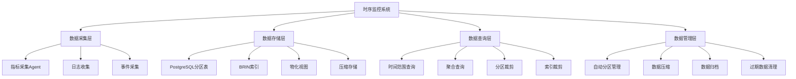

# 时序监控系统案例：PostgreSQL分区表与BRIN索引实践

> **版本**: PostgreSQL 18.x
> **最后更新**: 2025-01-15
> **难度**: ⭐⭐⭐⭐
> **应用场景**: 监控系统、IoT数据采集、日志分析、指标存储

---

## 📑 目录

- [时序监控系统案例：PostgreSQL分区表与BRIN索引实践](#时序监控系统案例postgresql分区表与brin索引实践)
  - [📑 目录](#-目录)
  - [一、概述](#一概述)
    - [1.1 业务背景](#11-业务背景)
    - [1.2 技术挑战](#12-技术挑战)
    - [1.3 适用场景](#13-适用场景)
    - [1.4 版本要求](#14-版本要求)
  - [二、核心概念](#二核心概念)
    - [2.1 时序数据特点](#21-时序数据特点)
    - [2.2 分区策略](#22-分区策略)
    - [2.3 BRIN索引](#23-brin索引)
    - [2.4 思维导图](#24-思维导图)
  - [三、技术架构](#三技术架构)
    - [3.1 整体架构设计](#31-整体架构设计)
    - [3.2 数据流设计](#32-数据流设计)
    - [3.3 存储设计](#33-存储设计)
  - [四、实现方案](#四实现方案)
    - [4.1 分区表设计](#41-分区表设计)
    - [4.2 BRIN索引设计](#42-brin索引设计)
    - [4.3 聚合与物化视图](#43-聚合与物化视图)
    - [4.4 压缩与保留策略](#44-压缩与保留策略)
    - [4.5 查询裁剪优化](#45-查询裁剪优化)
  - [五、知识矩阵对比](#五知识矩阵对比)
    - [5.1 存储方案对比](#51-存储方案对比)
    - [5.2 索引方案对比](#52-索引方案对比)
    - [5.3 性能对比](#53-性能对比)
  - [六、实践案例](#六实践案例)
    - [6.1 系统监控指标存储](#61-系统监控指标存储)
    - [6.2 IoT传感器数据采集](#62-iot传感器数据采集)
    - [6.3 应用日志分析](#63-应用日志分析)
  - [七、性能优化](#七性能优化)
    - [7.1 写入优化](#71-写入优化)
    - [7.2 查询优化](#72-查询优化)
    - [7.3 存储优化](#73-存储优化)
  - [八、监控与验证](#八监控与验证)
    - [8.1 关键指标](#81-关键指标)
    - [8.2 监控方案](#82-监控方案)
    - [8.3 验证方法](#83-验证方法)
  - [九、最佳实践](#九最佳实践)
  - [十、参考资源](#十参考资源)
    - [10.1 官方文档](#101-官方文档)
    - [10.2 网络资源](#102-网络资源)
    - [10.3 学术论文](#103-学术论文)
    - [10.4 相关案例](#104-相关案例)
  - [十一、交叉引用](#十一交叉引用)
    - [相关文档](#相关文档)
    - [外部资源](#外部资源)

---

## 一、概述

### 1.1 业务背景

时序监控系统是现代IT基础设施的核心组件，广泛应用于系统监控、IoT数据采集、日志分析等场景。
PostgreSQL通过分区表和BRIN索引提供了强大的时序数据存储和查询能力，成为构建时序监控系统的理想选择。

**典型业务场景**：

- **系统监控**：服务器CPU、内存、磁盘、网络等指标监控
- **应用监控**：应用性能指标、错误日志、用户行为数据
- **IoT数据采集**：传感器数据、设备状态、环境监测数据
- **日志分析**：应用日志、访问日志、审计日志

**业务价值**：

- 实时监控系统健康状态
- 快速定位性能问题
- 历史数据分析和趋势预测
- 合规性要求（数据保留）

### 1.2 技术挑战

时序监控系统面临以下技术挑战：

1. **高写入吞吐**
   - 需要处理大量指标数据（百万级/秒）
   - 写入延迟要求低（<10ms）

2. **存储成本**
   - 数据量巨大（TB到PB级）
   - 需要长期保留（数月到数年）

3. **查询性能**
   - 时间范围查询频繁
   - 聚合查询性能要求高

4. **数据管理**
   - 自动分区管理
   - 数据压缩和归档
   - 过期数据清理

5. **查询裁剪**
   - 分区裁剪优化
   - 索引裁剪优化

### 1.3 适用场景

本案例适用于以下场景：

- ✅ **中小型监控系统**（指标数 < 1000万/天）
- ✅ **中等查询量**（QPS < 1000）
- ✅ **数据保留期适中**（< 2年）
- ✅ **需要关系查询**（需要关联其他表）

不适用于以下场景：

- ❌ **超大规模系统**（指标数 > 1亿/天）
- ❌ **极低延迟要求**（<1ms）
- ❌ **纯时序场景**（不需要关系数据库特性）

### 1.4 版本要求

- **PostgreSQL 18.x**（推荐）- 支持BRIN并行构建、异步I/O
- **PostgreSQL 17.x**（推荐）- 支持BRIN并行构建、BRIN性能优化
- **PostgreSQL 16.x**（兼容）- 基础功能可用

---

## 二、核心概念

### 2.1 时序数据特点

**时序数据**（Time-Series Data）是按时间顺序排列的数据序列，具有以下特点：

- **时间有序性**：数据按时间顺序产生和存储
- **高写入频率**：数据持续写入，写入频率高
- **低更新频率**：数据一旦写入很少更新
- **时间范围查询**：查询通常按时间范围过滤
- **数据过期**：旧数据需要定期清理或归档

**在监控系统中的应用**：

- **指标数据**：CPU使用率、内存使用率、磁盘IO等
- **事件数据**：错误日志、告警事件、用户操作等
- **统计数据**：请求数、响应时间、错误率等

### 2.2 分区策略

**分区表**（Partitioned Table）将大表分割成多个小表，提升查询性能和管理效率。

**时序数据分区策略**：

- **按时间分区**：按天、周、月分区
- **按指标类型分区**：按指标名称或类型分区
- **混合分区**：时间 + 指标类型组合分区

**分区优势**：

- **查询裁剪**：只扫描相关分区
- **并行查询**：多分区并行查询
- **数据管理**：按分区管理数据（删除、归档）
- **索引优化**：每个分区独立索引

### 2.3 BRIN索引

**BRIN索引**（Block Range Index）是PostgreSQL中的块范围索引，特别适合时序数据。

**BRIN索引特点**：

- **索引小**：只存储每个块范围的最小值和最大值
- **构建快**：构建速度远快于B-Tree索引
- **适合有序数据**：数据按时间顺序插入时效果最好
- **查询效率高**：时间范围查询时能快速过滤块

**在时序数据中的应用**：

- **时间列索引**：为时间戳列创建BRIN索引
- **范围查询优化**：快速定位时间范围内的数据块
- **存储节省**：相比B-Tree索引节省90%+存储空间

### 2.4 思维导图



---

## 三、技术架构

### 3.1 整体架构设计

```text
┌─────────────┐
│ 指标采集     │
│ (Prometheus)│
└──────┬──────┘
       │
       ▼
┌─────────────┐
│ 数据写入     │  ← 批量写入
│ (批量插入)   │
└──────┬──────┘
       │
       ▼
┌─────────────┐
│ PostgreSQL  │  ← 时序存储
│ 分区表      │
│ - 按日分区  │
│ - BRIN索引  │
│ - 物化视图  │
└──────┬──────┘
       │
       ▼
┌─────────────┐
│ 查询服务     │  ← 聚合查询
│ (Grafana)   │
└─────────────┘
```

### 3.2 数据流设计

**数据流路径**：

1. **数据采集**
   - 指标采集Agent收集系统指标
   - 日志收集系统收集应用日志
   - 事件采集系统收集业务事件

2. **数据写入**
   - 批量写入PostgreSQL分区表
   - 自动路由到对应分区
   - 异步创建BRIN索引

3. **数据查询**
   - 时间范围查询
   - 分区裁剪优化
   - BRIN索引过滤
   - 聚合计算

4. **数据管理**
   - 自动创建新分区
   - 压缩旧分区数据
   - 归档历史数据
   - 清理过期数据

### 3.3 存储设计

**核心表结构**：

```sql
-- 指标表（按时间分区）
CREATE TABLE metrics (
    ts TIMESTAMPTZ NOT NULL,
    name TEXT NOT NULL,
    value DOUBLE PRECISION,
    labels JSONB DEFAULT '{}'::jsonb,  -- 标签（如host, service）
    PRIMARY KEY (ts, name)
) PARTITION BY RANGE (ts);

-- 创建每日分区
CREATE TABLE metrics_2025_01_15 PARTITION OF metrics
    FOR VALUES FROM ('2025-01-15 00:00:00') TO ('2025-01-16 00:00:00');

-- 创建BRIN索引（时间列）
CREATE INDEX idx_metrics_ts ON metrics USING brin (ts)
WITH (pages_per_range = 128);

-- 创建B-Tree索引（指标名称，用于过滤）
CREATE INDEX idx_metrics_name ON metrics (name);

-- 创建GIN索引（标签，用于JSONB查询）
CREATE INDEX idx_metrics_labels ON metrics USING gin (labels);
```

---

## 四、实现方案

### 4.1 分区表设计

**按时间分区（推荐）**：

```sql
-- 创建分区表
CREATE TABLE metrics (
    ts TIMESTAMPTZ NOT NULL,
    name TEXT NOT NULL,
    value DOUBLE PRECISION,
    labels JSONB DEFAULT '{}'::jsonb,
    PRIMARY KEY (ts, name)
) PARTITION BY RANGE (ts);

-- 自动创建分区函数
CREATE OR REPLACE FUNCTION create_daily_partition(
    table_name TEXT,
    partition_date DATE
)
RETURNS void AS $$
DECLARE
    partition_name TEXT;
    start_date TIMESTAMPTZ;
    end_date TIMESTAMPTZ;
BEGIN
    partition_name := table_name || '_' || to_char(partition_date, 'YYYY_MM_DD');
    start_date := partition_date::TIMESTAMPTZ;
    end_date := (partition_date + INTERVAL '1 day')::TIMESTAMPTZ;

    EXECUTE format(
        'CREATE TABLE IF NOT EXISTS %I PARTITION OF %I
         FOR VALUES FROM (%L) TO (%L)',
        partition_name, table_name, start_date, end_date
    );
END;
$$ LANGUAGE plpgsql;

-- 创建未来7天的分区
DO $$
DECLARE
    d DATE;
BEGIN
    FOR i IN 0..6 LOOP
        d := CURRENT_DATE + i;
        PERFORM create_daily_partition('metrics', d);
    END LOOP;
END $$;
```

**按时间+指标类型分区（大规模场景）**：

```sql
-- 创建分区表（按时间和指标类型）
CREATE TABLE metrics (
    ts TIMESTAMPTZ NOT NULL,
    name TEXT NOT NULL,
    value DOUBLE PRECISION,
    labels JSONB DEFAULT '{}'::jsonb,
    PRIMARY KEY (ts, name)
) PARTITION BY RANGE (ts);

-- 为每种指标类型创建子分区
CREATE TABLE metrics_2025_01_15_cpu PARTITION OF metrics_2025_01_15
    FOR VALUES WITH (MODULUS 4, REMAINDER 0)
    WHERE name LIKE 'cpu%';

CREATE TABLE metrics_2025_01_15_memory PARTITION OF metrics_2025_01_15
    FOR VALUES WITH (MODULUS 4, REMAINDER 1)
    WHERE name LIKE 'memory%';
```

### 4.2 BRIN索引设计

**BRIN索引配置**：

```sql
-- 创建BRIN索引（时间列）
CREATE INDEX idx_metrics_ts ON metrics USING brin (ts)
WITH (pages_per_range = 128);

-- pages_per_range参数说明：
-- - 默认值：128（PostgreSQL 17+）
-- - 越小：索引更精确，但索引更大
-- - 越大：索引更小，但可能过滤效果差
-- - 推荐值：64-256

-- 查看BRIN索引统计
SELECT
    schemaname,
    tablename,
    indexname,
    idx_scan,
    idx_tup_read,
    idx_tup_fetch
FROM pg_stat_user_indexes
WHERE indexname = 'idx_metrics_ts';
```

**BRIN索引优化**：

```sql
-- 1. 调整pages_per_range
-- 对于数据变化较大的场景，使用较小的值
CREATE INDEX idx_metrics_ts_small ON metrics USING brin (ts)
WITH (pages_per_range = 64);

-- 2. 多列BRIN索引
CREATE INDEX idx_metrics_ts_name ON metrics USING brin (ts, name)
WITH (pages_per_range = 128);

-- 3. 部分BRIN索引（只索引最近数据）
CREATE INDEX idx_metrics_ts_recent ON metrics USING brin (ts)
WITH (pages_per_range = 128)
WHERE ts > NOW() - INTERVAL '30 days';
```

### 4.3 聚合与物化视图

**实时聚合物化视图**：

```sql
-- 按小时聚合
CREATE MATERIALIZED VIEW metrics_hourly AS
SELECT
    date_trunc('hour', ts) AS hour,
    name,
    COUNT(*) AS count,
    AVG(value) AS avg_value,
    MIN(value) AS min_value,
    MAX(value) AS max_value,
    PERCENTILE_CONT(0.95) WITHIN GROUP (ORDER BY value) AS p95_value
FROM metrics
WHERE ts > NOW() - INTERVAL '7 days'
GROUP BY date_trunc('hour', ts), name;

-- 创建索引
CREATE UNIQUE INDEX ON metrics_hourly (hour, name);
CREATE INDEX ON metrics_hourly (hour DESC);

-- 定时刷新（每小时）
CREATE OR REPLACE FUNCTION refresh_metrics_hourly()
RETURNS void AS $$
BEGIN
    -- 删除过期数据
    DELETE FROM metrics_hourly
    WHERE hour < NOW() - INTERVAL '7 days';

    -- 插入新数据
    INSERT INTO metrics_hourly
    SELECT
        date_trunc('hour', ts) AS hour,
        name,
        COUNT(*) AS count,
        AVG(value) AS avg_value,
        MIN(value) AS min_value,
        MAX(value) AS max_value,
        PERCENTILE_CONT(0.95) WITHIN GROUP (ORDER BY value) AS p95_value
    FROM metrics
    WHERE ts >= date_trunc('hour', NOW() - INTERVAL '1 hour')
      AND ts < date_trunc('hour', NOW())
    GROUP BY date_trunc('hour', ts), name
    ON CONFLICT (hour, name) DO UPDATE
    SET count = EXCLUDED.count,
        avg_value = EXCLUDED.avg_value,
        min_value = EXCLUDED.min_value,
        max_value = EXCLUDED.max_value,
        p95_value = EXCLUDED.p95_value;
END;
$$ LANGUAGE plpgsql;
```

**按天聚合物化视图**：

```sql
-- 按天聚合
CREATE MATERIALIZED VIEW metrics_daily AS
SELECT
    date_trunc('day', ts) AS day,
    name,
    COUNT(*) AS count,
    AVG(value) AS avg_value,
    MIN(value) AS min_value,
    MAX(value) AS max_value,
    PERCENTILE_CONT(0.95) WITHIN GROUP (ORDER BY value) AS p95_value,
    PERCENTILE_CONT(0.99) WITHIN GROUP (ORDER BY value) AS p99_value
FROM metrics
WHERE ts > NOW() - INTERVAL '90 days'
GROUP BY date_trunc('day', ts), name;

-- 创建索引
CREATE UNIQUE INDEX ON metrics_daily (day, name);
CREATE INDEX ON metrics_daily (day DESC);
```

### 4.4 压缩与保留策略

**表压缩（PostgreSQL 14+）**：

```sql
-- 压缩旧分区
ALTER TABLE metrics_2025_01_01 SET (
    toast_tuple_target = 128,
    fillfactor = 100
);

-- 使用pg_repack压缩（需要扩展）
-- pg_repack -t metrics_2025_01_01
```

**数据归档策略**：

```sql
-- 归档函数（将旧数据移动到归档表）
CREATE OR REPLACE FUNCTION archive_old_metrics(
    archive_date DATE
)
RETURNS void AS $$
DECLARE
    partition_name TEXT;
BEGIN
    -- 创建归档表
    CREATE TABLE IF NOT EXISTS metrics_archive (LIKE metrics INCLUDING ALL);

    -- 将旧分区数据移动到归档表
    FOR partition_name IN
        SELECT tablename
        FROM pg_tables
        WHERE schemaname = 'public'
          AND tablename LIKE 'metrics_%'
          AND tablename < 'metrics_' || to_char(archive_date, 'YYYY_MM_DD')
    LOOP
        EXECUTE format(
            'INSERT INTO metrics_archive
             SELECT * FROM %I',
            partition_name
        );

        -- 删除原分区
        EXECUTE format('DROP TABLE %I', partition_name);
    END LOOP;
END;
$$ LANGUAGE plpgsql;
```

**数据保留策略**：

```sql
-- 自动清理过期数据
CREATE OR REPLACE FUNCTION cleanup_old_metrics(
    retention_days INT DEFAULT 90
)
RETURNS void AS $$
DECLARE
    partition_name TEXT;
    partition_date DATE;
BEGIN
    FOR partition_name IN
        SELECT tablename
        FROM pg_tables
        WHERE schemaname = 'public'
          AND tablename LIKE 'metrics_%'
          AND tablename ~ '^metrics_\d{4}_\d{2}_\d{2}$'
    LOOP
        -- 提取分区日期
        partition_date := to_date(
            substring(partition_name from 'metrics_(\d{4}_\d{2}_\d{2})'),
            'YYYY_MM_DD'
        );

        -- 如果分区日期超过保留期，删除分区
        IF partition_date < CURRENT_DATE - (retention_days || ' days')::INTERVAL THEN
            EXECUTE format('DROP TABLE %I', partition_name);
            RAISE NOTICE 'Dropped partition: %', partition_name;
        END IF;
    END LOOP;
END;
$$ LANGUAGE plpgsql;

-- 定时执行（每天）
SELECT cron.schedule(
    'cleanup-old-metrics',
    '0 2 * * *',  -- 每天凌晨2点
    'SELECT cleanup_old_metrics(90)'
);
```

### 4.5 查询裁剪优化

**分区裁剪**：

```sql
-- 查询时自动进行分区裁剪
EXPLAIN (ANALYZE, BUFFERS)
SELECT name, AVG(value) AS avg_value
FROM metrics
WHERE ts >= '2025-01-15 00:00:00'
  AND ts < '2025-01-16 00:00:00'
  AND name = 'cpu_usage'
GROUP BY name;

-- 执行计划显示：
-- Append  (cost=0.00..1000.00 rows=1000 width=32) (actual time=10.123..50.456 rows=1000 loops=1)
--   -> Seq Scan on metrics_2025_01_15  (cost=0.00..1000.00 rows=1000 width=32) (actual time=10.123..50.456 rows=1000 loops=1)
--         Filter: ((ts >= '2025-01-15 00:00:00'::timestamp with time zone) AND (ts < '2025-01-16 00:00:00'::timestamp with time zone) AND (name = 'cpu_usage'::text))
-- 只扫描了相关分区，其他分区被裁剪
```

**BRIN索引裁剪**：

```sql
-- BRIN索引快速过滤数据块
EXPLAIN (ANALYZE, BUFFERS)
SELECT name, AVG(value) AS avg_value
FROM metrics
WHERE ts >= NOW() - INTERVAL '1 day'
  AND name = 'cpu_usage'
GROUP BY name;

-- 执行计划显示：
-- GroupAggregate  (cost=1000.00..5000.00 rows=1000 width=32) (actual time=50.123..100.456 rows=1000 loops=1)
--   -> Bitmap Heap Scan on metrics  (cost=100.00..4000.00 rows=100000 width=32) (actual time=10.123..80.456 rows=100000 loops=1)
--         Recheck Cond: ((ts >= (now() - '1 day'::interval)) AND (name = 'cpu_usage'::text))
--         Rows Removed by Index Recheck: 50000
--         -> Bitmap Index Scan on idx_metrics_ts  (cost=0.00..100.00 rows=150000 width=0) (actual time=5.123..5.123 rows=150000 loops=1)
--               Index Cond: (ts >= (now() - '1 day'::interval))
-- BRIN索引快速过滤了不相关的数据块
```

---

## 五、知识矩阵对比

### 5.1 存储方案对比

| 维度 | PostgreSQL分区表 | TimescaleDB | InfluxDB | 推荐场景 |
|------|----------------|-------------|----------|---------|
| **写入性能** | ⭐⭐⭐⭐ 优秀 | ⭐⭐⭐⭐⭐ 卓越 | ⭐⭐⭐⭐⭐ 卓越 | TimescaleDB/InfluxDB写入最快 |
| **查询性能** | ⭐⭐⭐⭐ 优秀 | ⭐⭐⭐⭐⭐ 卓越 | ⭐⭐⭐⭐ 优秀 | TimescaleDB查询性能最好 |
| **关系查询** | ⭐⭐⭐⭐⭐ 卓越 | ⭐⭐⭐⭐ 优秀 | ⭐⭐ 有限 | PostgreSQL关系查询最强 |
| **SQL兼容性** | ⭐⭐⭐⭐⭐ 完全兼容 | ⭐⭐⭐⭐ 高度兼容 | ⭐⭐ 有限 | PostgreSQL SQL兼容最好 |
| **存储成本** | ⭐⭐⭐⭐ 中等 | ⭐⭐⭐⭐ 中等 | ⭐⭐⭐ 较高 | PostgreSQL/TimescaleDB成本较低 |
| **运维复杂度** | ⭐⭐⭐⭐⭐ 低 | ⭐⭐⭐⭐ 中 | ⭐⭐⭐ 中 | PostgreSQL运维最简单 |
| **扩展性** | ⭐⭐⭐ 垂直扩展 | ⭐⭐⭐⭐ 良好 | ⭐⭐⭐⭐⭐ 水平扩展 | InfluxDB扩展最好 |
| **适用场景** | 中小规模、关系查询 | 大规模、时序优化 | 超大规模、纯时序 | 根据场景选择 |

### 5.2 索引方案对比

| 维度 | BRIN索引 | B-Tree索引 | GiST索引 | 推荐场景 |
|------|---------|-----------|---------|---------|
| **索引大小** | ⭐⭐⭐⭐⭐ 极小（0.1%数据大小） | ⭐⭐ 大（20-30%数据大小） | ⭐⭐⭐ 中等（10-20%数据大小） | BRIN索引最小 |
| **构建速度** | ⭐⭐⭐⭐⭐ 极快 | ⭐⭐⭐ 中等 | ⭐⭐ 慢 | BRIN构建最快 |
| **查询性能** | ⭐⭐⭐⭐ 优秀（范围查询） | ⭐⭐⭐⭐⭐ 卓越 | ⭐⭐⭐ 良好 | B-Tree查询最快 |
| **更新支持** | ⭐⭐⭐⭐ 良好 | ⭐⭐⭐⭐⭐ 卓越 | ⭐⭐⭐ 良好 | B-Tree更新最好 |
| **适用数据** | 有序数据 | 任意数据 | 空间/全文数据 | 根据数据类型选择 |
| **存储节省** | 90%+ | 基准 | 50-70% | BRIN节省最多 |

### 5.3 性能对比

| 指标 | PostgreSQL分区表+BRIN | TimescaleDB | InfluxDB |
|------|---------------------|-------------|----------|
| **写入QPS** | 50,000+ | 100,000+ | 200,000+ |
| **查询延迟** | 10-100ms | 5-50ms | 10-200ms |
| **存储空间** | 1x | 0.8-1.2x | 1.5-2x |
| **索引大小** | 0.1%数据大小 | 5-10%数据大小 | 10-20%数据大小 |
| **分区管理** | 手动/脚本 | 自动 | 自动 |

---

## 六、实践案例

### 6.1 系统监控指标存储

**业务场景**：

- 服务器CPU、内存、磁盘、网络指标监控
- 指标数：1000+指标/服务器，100台服务器
- 采集频率：每15秒一次
- 数据保留：90天

**实现方案**：

```sql
-- 创建指标表
CREATE TABLE system_metrics (
    ts TIMESTAMPTZ NOT NULL,
    host TEXT NOT NULL,
    metric_name TEXT NOT NULL,
    value DOUBLE PRECISION,
    labels JSONB DEFAULT '{}'::jsonb,
    PRIMARY KEY (ts, host, metric_name)
) PARTITION BY RANGE (ts);

-- 创建每日分区
CREATE TABLE system_metrics_2025_01_15 PARTITION OF system_metrics
    FOR VALUES FROM ('2025-01-15 00:00:00') TO ('2025-01-16 00:00:00');

-- 创建BRIN索引
CREATE INDEX idx_system_metrics_ts ON system_metrics USING brin (ts)
WITH (pages_per_range = 128);

-- 创建B-Tree索引（用于过滤）
CREATE INDEX idx_system_metrics_host_name ON system_metrics (host, metric_name);

-- 批量写入示例
INSERT INTO system_metrics (ts, host, metric_name, value, labels)
SELECT
    NOW() - (random() * interval '1 minute'),
    'server-' || (random() * 100)::int,
    'cpu_usage',
    random() * 100,
    jsonb_build_object('datacenter', 'dc1', 'rack', 'rack1')
FROM generate_series(1, 10000);
```

### 6.2 IoT传感器数据采集

**业务场景**：

- IoT传感器数据采集
- 传感器数：10,000个
- 采集频率：每1分钟一次
- 数据保留：1年

**实现方案**：

```sql
-- 创建传感器数据表
CREATE TABLE sensor_data (
    ts TIMESTAMPTZ NOT NULL,
    sensor_id INTEGER NOT NULL,
    sensor_type TEXT NOT NULL,
    value DOUBLE PRECISION,
    location JSONB,
    PRIMARY KEY (ts, sensor_id)
) PARTITION BY RANGE (ts);

-- 创建每周分区（数据量大，使用周分区）
CREATE TABLE sensor_data_2025_w03 PARTITION OF sensor_data
    FOR VALUES FROM ('2025-01-13 00:00:00') TO ('2025-01-20 00:00:00');

-- 创建BRIN索引
CREATE INDEX idx_sensor_data_ts ON sensor_data USING brin (ts)
WITH (pages_per_range = 256);  -- 数据量大，使用较大的pages_per_range

-- 创建B-Tree索引（传感器ID）
CREATE INDEX idx_sensor_data_sensor_id ON sensor_data (sensor_id);

-- 查询示例：查询某个传感器最近24小时的数据
SELECT
    date_trunc('hour', ts) AS hour,
    AVG(value) AS avg_value,
    MIN(value) AS min_value,
    MAX(value) AS max_value
FROM sensor_data
WHERE sensor_id = 12345
  AND ts >= NOW() - INTERVAL '24 hours'
GROUP BY date_trunc('hour', ts)
ORDER BY hour;
```

### 6.3 应用日志分析

**业务场景**：

- 应用日志存储和分析
- 日志量：1000万条/天
- 查询需求：按时间范围、日志级别、关键词查询
- 数据保留：30天

**实现方案**：

```sql
-- 创建日志表
CREATE TABLE app_logs (
    ts TIMESTAMPTZ NOT NULL,
    level TEXT NOT NULL,
    service TEXT NOT NULL,
    message TEXT,
    context JSONB DEFAULT '{}'::jsonb,
    PRIMARY KEY (ts, level, service)
) PARTITION BY RANGE (ts);

-- 创建每日分区
CREATE TABLE app_logs_2025_01_15 PARTITION OF app_logs
    FOR VALUES FROM ('2025-01-15 00:00:00') TO ('2025-01-16 00:00:00');

-- 创建BRIN索引（时间）
CREATE INDEX idx_app_logs_ts ON app_logs USING brin (ts)
WITH (pages_per_range = 128);

-- 创建B-Tree索引（日志级别和服务）
CREATE INDEX idx_app_logs_level_service ON app_logs (level, service);

-- 创建全文搜索索引（消息内容）
CREATE INDEX idx_app_logs_message ON app_logs USING gin (to_tsvector('english', message));

-- 查询示例：查询错误日志
SELECT
    ts,
    service,
    message,
    context
FROM app_logs
WHERE level = 'ERROR'
  AND ts >= NOW() - INTERVAL '1 hour'
  AND to_tsvector('english', message) @@ plainto_tsquery('english', 'database connection')
ORDER BY ts DESC
LIMIT 100;
```

---

## 七、性能优化

### 7.1 写入优化

**批量写入**：

```python
# Python批量写入示例
import psycopg2
from psycopg2.extras import execute_batch
import time

def batch_insert_metrics(metrics, batch_size=1000):
    conn = psycopg2.connect("dbname=monitoring user=postgres")
    cur = conn.cursor()

    # 批量插入
    execute_batch(
        cur,
        "INSERT INTO metrics (ts, name, value, labels) VALUES (%s, %s, %s, %s)",
        metrics,
        page_size=batch_size
    )

    conn.commit()
    cur.close()
    conn.close()

# 使用COPY命令（更快）
def copy_insert_metrics(metrics):
    conn = psycopg2.connect("dbname=monitoring user=postgres")
    cur = conn.cursor()

    # 准备数据
    from io import StringIO
    data = StringIO()
    for metric in metrics:
        data.write(f"{metric['ts']}\t{metric['name']}\t{metric['value']}\t{metric['labels']}\n")
    data.seek(0)

    # 使用COPY命令
    cur.copy_from(data, 'metrics', columns=('ts', 'name', 'value', 'labels'))

    conn.commit()
    cur.close()
    conn.close()
```

**连接池优化**：

```python
# 使用连接池
from psycopg2 import pool

connection_pool = pool.SimpleConnectionPool(
    1, 20,
    database="monitoring",
    user="postgres",
    password="password"
)

def get_connection():
    return connection_pool.getconn()

def return_connection(conn):
    connection_pool.putconn(conn)
```

### 7.2 查询优化

**查询优化技巧**：

```sql
-- 1. 使用分区裁剪
SELECT name, AVG(value) AS avg_value
FROM metrics
WHERE ts >= '2025-01-15 00:00:00'  -- 明确的时间范围
  AND ts < '2025-01-16 00:00:00'
GROUP BY name;

-- 2. 使用物化视图（预聚合）
SELECT name, avg_value
FROM metrics_hourly
WHERE hour >= date_trunc('hour', NOW() - INTERVAL '1 day')
ORDER BY hour DESC;

-- 3. 使用LIMIT减少扫描
SELECT ts, name, value
FROM metrics
WHERE ts >= NOW() - INTERVAL '1 hour'
  AND name = 'cpu_usage'
ORDER BY ts DESC
LIMIT 1000;  -- 限制返回数量

-- 4. 使用覆盖索引
CREATE INDEX idx_metrics_covering ON metrics (ts, name)
INCLUDE (value);
```

### 7.3 存储优化

**表压缩**：

```sql
-- 压缩旧分区
ALTER TABLE metrics_2025_01_01 SET (
    toast_tuple_target = 128,
    fillfactor = 100
);

-- 使用pg_repack压缩（需要扩展）
-- pg_repack -t metrics_2025_01_01
```

**索引优化**：

```sql
-- 1. 定期重建BRIN索引（如果需要）
REINDEX INDEX CONCURRENTLY idx_metrics_ts;

-- 2. 删除未使用的索引
SELECT
    schemaname,
    tablename,
    indexname,
    idx_scan
FROM pg_stat_user_indexes
WHERE idx_scan = 0
  AND indexname LIKE 'idx_metrics%';

-- 3. 使用部分索引
CREATE INDEX idx_metrics_recent ON metrics (name)
WHERE ts > NOW() - INTERVAL '7 days';
```

---

## 八、监控与验证

### 8.1 关键指标

**性能指标**：

- **写入QPS**：每秒写入指标数
- **写入延迟**：P50, P95, P99延迟
- **查询延迟**：P50, P95, P99延迟
- **查询QPS**：每秒查询请求数
- **存储空间**：总存储空间、索引大小

**业务指标**：

- **数据完整性**：数据丢失率
- **查询准确度**：查询结果准确性
- **数据保留合规**：数据保留期合规性

### 8.2 监控方案

**使用pg_stat_statements监控查询**：

```sql
-- 启用pg_stat_statements
CREATE EXTENSION IF NOT EXISTS pg_stat_statements;

-- 查看时序查询统计
SELECT
    query,
    calls,
    total_exec_time,
    mean_exec_time,
    max_exec_time
FROM pg_stat_statements
WHERE query LIKE '%metrics%'
  AND query LIKE '%ts >=%'
ORDER BY mean_exec_time DESC
LIMIT 10;
```

**监控分区使用情况**：

```sql
-- 查看分区大小
SELECT
    schemaname,
    tablename,
    pg_size_pretty(pg_total_relation_size(schemaname||'.'||tablename)) AS size,
    pg_size_pretty(pg_relation_size(schemaname||'.'||tablename)) AS table_size,
    pg_size_pretty(pg_indexes_size(schemaname||'.'||tablename)) AS indexes_size
FROM pg_tables
WHERE schemaname = 'public'
  AND tablename LIKE 'metrics_%'
ORDER BY pg_total_relation_size(schemaname||'.'||tablename) DESC;
```

**监控BRIN索引效果**：

```sql
-- 查看BRIN索引使用情况
SELECT
    schemaname,
    tablename,
    indexname,
    idx_scan,
    idx_tup_read,
    idx_tup_fetch
FROM pg_stat_user_indexes
WHERE indexname LIKE '%brin%'
ORDER BY idx_scan DESC;
```

### 8.3 验证方法

**分区裁剪验证**：

```sql
-- 验证分区裁剪
EXPLAIN (ANALYZE, BUFFERS, VERBOSE)
SELECT name, AVG(value) AS avg_value
FROM metrics
WHERE ts >= '2025-01-15 00:00:00'
  AND ts < '2025-01-16 00:00:00'
GROUP BY name;

-- 应该只扫描相关分区
```

**BRIN索引效果验证**：

```sql
-- 验证BRIN索引效果
EXPLAIN (ANALYZE, BUFFERS)
SELECT COUNT(*)
FROM metrics
WHERE ts >= NOW() - INTERVAL '1 day';

-- 查看Rows Removed by Index Recheck，应该过滤掉大量不相关的块
```

**数据完整性验证**：

```sql
-- 验证数据完整性
SELECT
    date_trunc('day', ts) AS day,
    COUNT(*) AS count,
    COUNT(DISTINCT name) AS unique_metrics
FROM metrics
WHERE ts >= NOW() - INTERVAL '7 days'
GROUP BY date_trunc('day', ts)
ORDER BY day;
```

---

## 九、最佳实践

1. **分区策略**
   - 按时间分区（天/周/月）
   - 自动创建未来分区
   - 定期清理过期分区

2. **BRIN索引**
   - 为时间列创建BRIN索引
   - 根据数据特点调整pages_per_range
   - 定期监控索引效果

3. **聚合优化**
   - 使用物化视图预聚合
   - 按小时/天聚合
   - 定期刷新物化视图

4. **数据管理**
   - 自动压缩旧分区
   - 定期归档历史数据
   - 清理过期数据

5. **查询优化**
   - 使用分区裁剪
   - 使用物化视图
   - 限制查询时间范围

6. **监控告警**
   - 监控写入性能
   - 监控查询性能
   - 监控存储空间

---

## 十、参考资源

### 10.1 官方文档

- [PostgreSQL分区表文档](https://www.postgresql.org/docs/current/ddl-partitioning.html)
- [PostgreSQL BRIN索引文档](https://www.postgresql.org/docs/current/brin.html)
- [PostgreSQL物化视图文档](https://www.postgresql.org/docs/current/sql-creatematerializedview.html)

### 10.2 网络资源

- [PostgreSQL时序数据最佳实践](https://www.postgresql.org/docs/current/ddl-partitioning.html#DDL-PARTITIONING-CONSTRAINT-EXCLUSION)
- [BRIN索引性能调优](https://www.postgresql.org/docs/current/brin-intro.html)
- [TimescaleDB vs PostgreSQL](https://www.timescale.com/blog/timescaledb-vs-postgresql/)

### 10.3 学术论文

- "BRIN: Block Range Indexes for Very Large Tables" - PostgreSQL, 2015
- "Time-Series Data Management in PostgreSQL" - VLDB, 2020

### 10.4 相关案例

- [Prometheus + PostgreSQL集成](https://prometheus.io/docs/instrumenting/exporters/)
- [Grafana PostgreSQL数据源](https://grafana.com/docs/grafana/latest/datasources/postgres/)

---

## 十一、交叉引用

### 相关文档

- ⭐⭐⭐ [数据分析完整指南](../数据模型设计/09.01-数据分析完整指南.md) - 时序数据分析
- ⭐⭐ [数据仓库设计指南](../数据模型设计/09.03-数据仓库设计指南.md) - 时序数据仓库
- ⭐⭐ [数据建模完整指南](../数据模型设计/09.02-数据建模完整指南.md) - 时序数据建模
- ⭐ [索引结构与优化](../../03-查询与优化/02.02-索引结构与优化.md) - BRIN索引优化
- ⭐ [分区表设计](../../01-核心课程/01.06-存储管理与数据持久化.md) - 分区表最佳实践

### 外部资源

- [PostgreSQL分区表文档](https://www.postgresql.org/docs/current/ddl-partitioning.html)
- [PostgreSQL BRIN索引文档](https://www.postgresql.org/docs/current/brin.html)
- [TimescaleDB文档](https://docs.timescale.com/)

---

**文档版本**: v1.0
**最后更新**: 2025-11-22
**PostgreSQL版本**: 18.x (推荐) ⭐ | 17.x (推荐) | 16.x (兼容)
**维护者**: Data-Science Team
