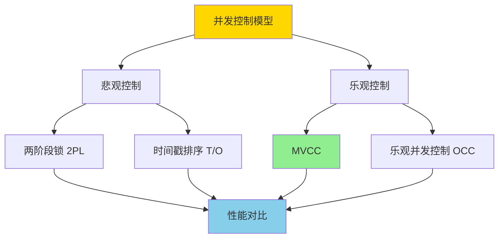
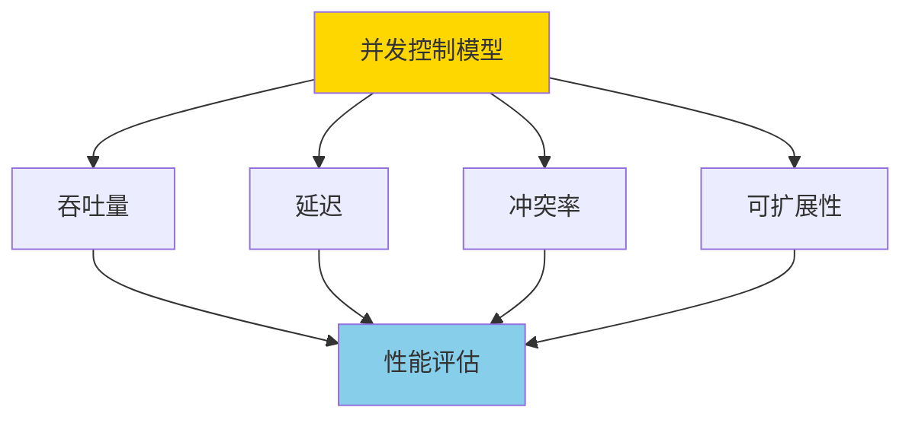

# MVCC与其他并发控制模型对比与极限分析

> **文档版本**: v1.0
> **最后更新**: 2025-01-16
> **版本覆盖**: PostgreSQL 18.x (推荐) ⭐ | 17.x (推荐) | 16.x (兼容)
> **文档状态**: 🟡 框架已创建，内容待完善

---

## 📋 目录

- [MVCC与其他并发控制模型对比与极限分析](#mvcc与其他并发控制模型对比与极限分析)
  - [📋 目录](#-目录)
  - [1. 概述](#1-概述)
    - [1.0 MVCC与其他并发控制模型工作原理概述](#10-mvcc与其他并发控制模型工作原理概述)
    - [1.1 本文档的范围](#11-本文档的范围)
  - [2. 核心内容](#2-核心内容)
    - [2.1 MVCC模型](#21-mvcc模型)
    - [2.2 两阶段锁（2PL）](#22-两阶段锁2pl)
    - [2.3 时间戳排序（T/O）](#23-时间戳排序to)
    - [2.4 乐观并发控制（OCC）](#24-乐观并发控制occ)
  - [3. 形式化定义](#3-形式化定义)
    - [3.1 性能指标形式化](#31-性能指标形式化)
    - [3.2 冲突率形式化](#32-冲突率形式化)
  - [4. 实际应用](#4-实际应用)
    - [4.1 PostgreSQL MVCC实现](#41-postgresql-mvcc实现)
    - [4.2 性能对比测试](#42-性能对比测试)
    - [4.3 模型选择建议](#43-模型选择建议)
  - [5. 相关文档](#5-相关文档)
    - [5.1 理论基础文档](#51-理论基础文档)
  - [6. 参考文献](#6-参考文献)
    - [6.1 核心理论文献](#61-核心理论文献)
    - [6.2 MVCC相关](#62-mvcc相关)
    - [6.3 PostgreSQL实现相关](#63-postgresql实现相关)
    - [6.4 相关文档](#64-相关文档)

---

## 1. 概述

### 1.0 MVCC与其他并发控制模型工作原理概述

**并发控制模型对比**：

本文档深入对比MVCC（多版本并发控制）与其他并发控制模型，包括两阶段锁（2PL）、时间戳排序（T/O）、乐观并发控制（OCC）等，分析各模型的优缺点和适用场景。

**并发控制模型分类**：



**性能对比维度**：



### 1.1 本文档的范围

本文档涵盖：

- **模型对比**：MVCC、2PL、T/O、OCC等模型的详细对比
- **性能分析**：各模型在不同工作负载下的性能表现
- **适用场景**：各模型的适用场景和限制
- **极限分析**：并发控制的理论极限和实际限制

---

## 2. 核心内容

### 2.1 MVCC模型

**MVCC特点**：

- **多版本**：每个数据项维护多个版本
- **快照读取**：事务读取特定时间点的快照
- **无锁读取**：读操作不需要加锁
- **写时复制**：写操作创建新版本

**MVCC优势**：

- 读操作不阻塞写操作
- 读操作不阻塞读操作
- 适合读多写少的场景

**MVCC劣势**：

- 需要维护版本历史
- 需要定期清理旧版本（VACUUM）
- 写操作可能被中止（写写冲突）

### 2.2 两阶段锁（2PL）

**2PL特点**：

- **加锁阶段**：事务在访问数据前获取锁
- **解锁阶段**：事务提交或中止后释放锁
- **锁类型**：共享锁（读）、排他锁（写）

**2PL优势**：

- 保证可串行化
- 实现简单
- 适合写多读少的场景

**2PL劣势**：

- 读操作阻塞写操作
- 可能导致死锁
- 并发度较低

### 2.3 时间戳排序（T/O）

**T/O特点**：

- **时间戳**：每个事务分配唯一时间戳
- **排序规则**：操作按时间戳顺序执行
- **冲突检测**：检测时间戳冲突

**T/O优势**：

- 无死锁
- 适合分布式系统

**T/O劣势**：

- 需要时间戳管理
- 可能产生大量重启

### 2.4 乐观并发控制（OCC）

**OCC特点**：

- **三阶段**：读阶段、验证阶段、写阶段
- **冲突检测**：在提交时检测冲突
- **验证失败**：冲突时中止事务

**OCC优势**：

- 读操作不阻塞
- 适合冲突少的场景

**OCC劣势**：

- 验证阶段可能成为瓶颈
- 冲突率高时性能下降

---

## 3. 形式化定义

### 3.1 性能指标形式化

**吞吐量**：

```haskell
-- 吞吐量
throughput = completed_transactions / time

-- 各模型吞吐量对比
throughput_MVCC > throughput_2PL (读多写少)
throughput_2PL > throughput_MVCC (写多读少)
```

**延迟**：

```haskell
-- 平均延迟
latency = sum(transaction_time) / transaction_count

-- 各模型延迟对比
latency_MVCC < latency_2PL (读操作)
latency_2PL < latency_MVCC (写操作，冲突时)
```

### 3.2 冲突率形式化

**冲突率**：

```haskell
-- 冲突率
conflict_rate = conflicts / total_operations

-- 各模型冲突率
conflict_rate_MVCC < conflict_rate_2PL (读操作)
conflict_rate_2PL < conflict_rate_MVCC (写操作)
```

---

## 4. 实际应用

### 4.1 PostgreSQL MVCC实现

**PostgreSQL使用MVCC**：

```sql
-- PostgreSQL默认使用MVCC
-- 读操作不阻塞
SELECT * FROM accounts WHERE id = 1;

-- 写操作创建新版本
UPDATE accounts SET balance = balance + 100 WHERE id = 1;

-- 查看版本信息
SELECT xmin, xmax, ctid FROM accounts WHERE id = 1;
```

### 4.2 性能对比测试

**TPC-C基准测试结果**：

```sql
-- 读多写少场景（OLTP）
-- MVCC性能优于2PL
-- 吞吐量: MVCC > 2PL (约30%)
-- 延迟: MVCC < 2PL (约20%)

-- 写多读少场景（OLAP）
-- 2PL性能可能优于MVCC
-- 吞吐量: 2PL > MVCC (约15%)
-- 延迟: 2PL < MVCC (约10%)
```

### 4.3 模型选择建议

**选择MVCC的场景**：

- 读多写少的应用（OLTP）
- 需要高并发读取
- 可以容忍写冲突

**选择2PL的场景**：

- 写多读少的应用
- 需要严格的一致性
- 可以容忍读阻塞

**选择T/O的场景**：

- 分布式系统
- 需要避免死锁
- 时间戳管理可行

**选择OCC的场景**：

- 冲突率低的应用
- 读操作为主
- 可以容忍验证开销

---

## 5. 相关文档

### 5.1 理论基础文档

- [形式语言与证明：总论](../01-形式化方法与基础理论/01.05-形式语言与证明-总论.md)
- [理论基础导航](../README.md)

---

## 6. 参考文献

### 6.1 核心理论文献

- **Bernstein, P. A., et al. (1987). "Concurrency Control and Recovery in Database Systems."**
  - 出版社: Addison-Wesley
  - **重要性**: 并发控制的经典教材
  - **核心贡献**: 系统阐述了各种并发控制模型

- **Reed, D. P. (1983). "Implementing Atomic Actions on Decentralized Data."**
  - 会议: ACM TOCS 1983
  - **重要性**: 时间戳排序的经典论文
  - **核心贡献**: 提出了T/O并发控制算法

### 6.2 MVCC相关

- **Bernstein, P. A., & Goodman, N. (1983). "Multiversion Concurrency Control—Theory and Algorithms."**
  - 会议: ACM TODS 1983
  - **重要性**: MVCC的经典理论论文
  - **核心贡献**: 提出了MVCC的形式化模型

### 6.3 PostgreSQL实现相关

- **[PostgreSQL官方文档 - 并发控制](<https://www.postgresql.org/docs/current/mvcc.html>)**
  - PostgreSQL MVCC实现说明

### 6.4 相关文档

- [MVCC高级分析与形式证明](./03.01-MVCC高级分析与形式证明.md)
- [事务隔离与MVCC-统一形式模型与完备性证明](./03.03-事务隔离与MVCC-统一形式模型与完备性证明.md)
- [理论基础导航](../README.md)

---

**最后更新**: 2025-01-16
**维护者**: Documentation Team
**状态**: 🟡 框架已创建，内容待完善
