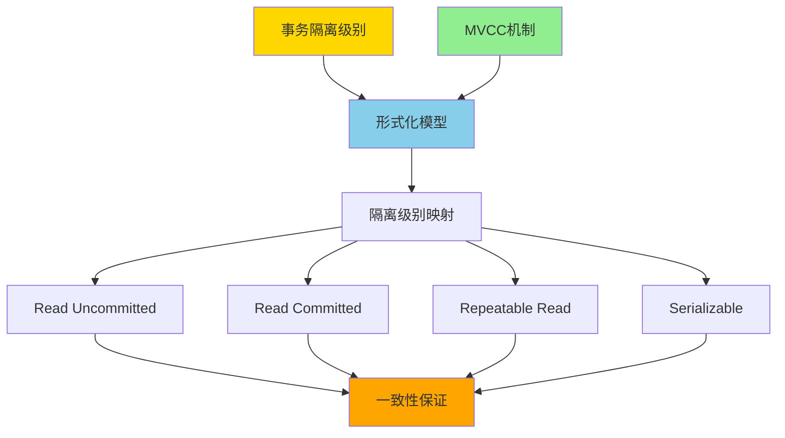
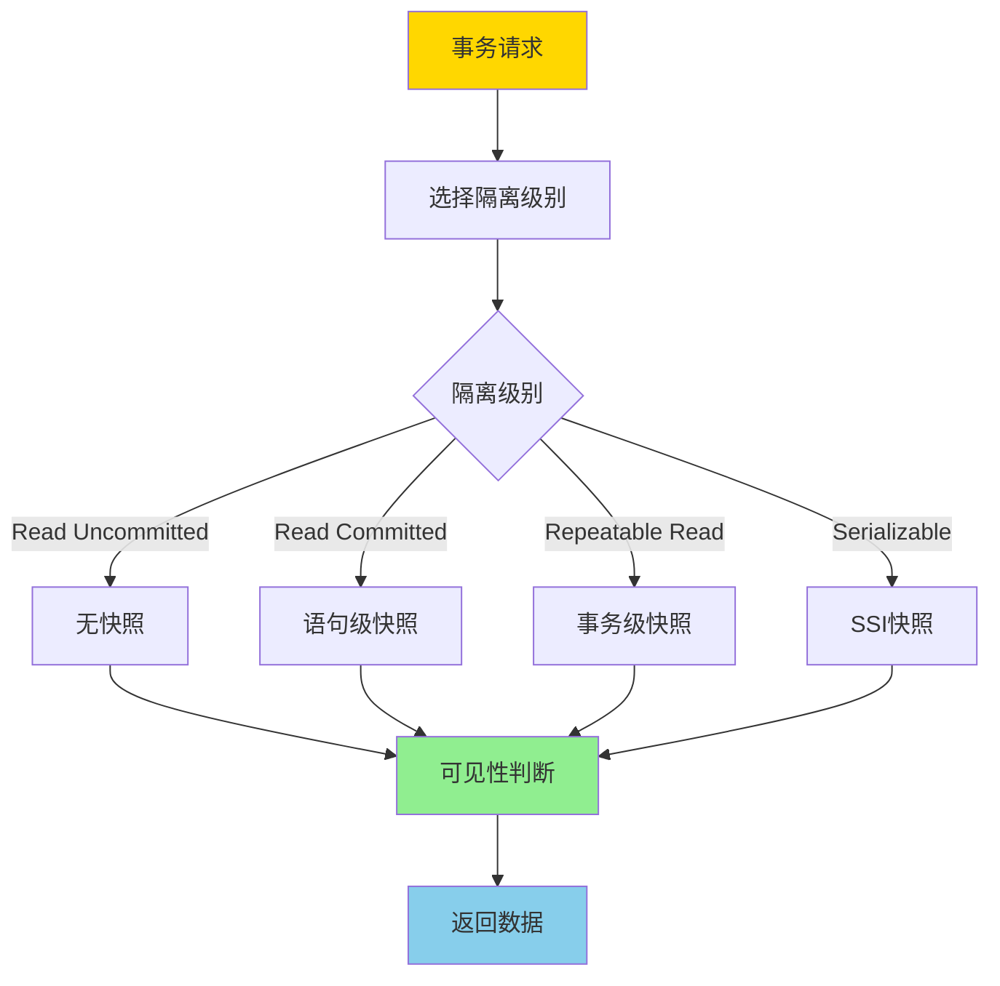
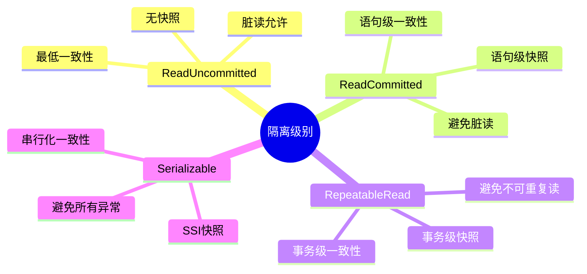
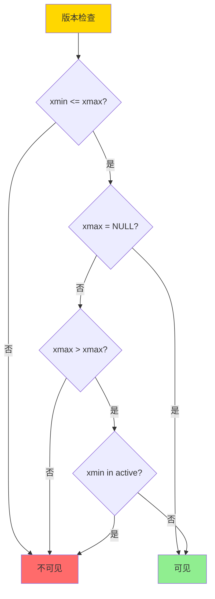
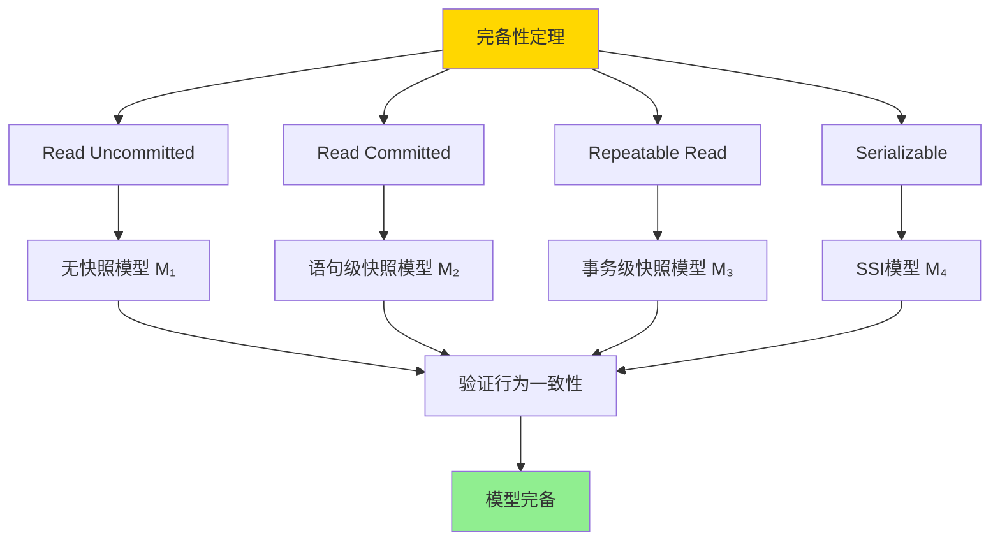
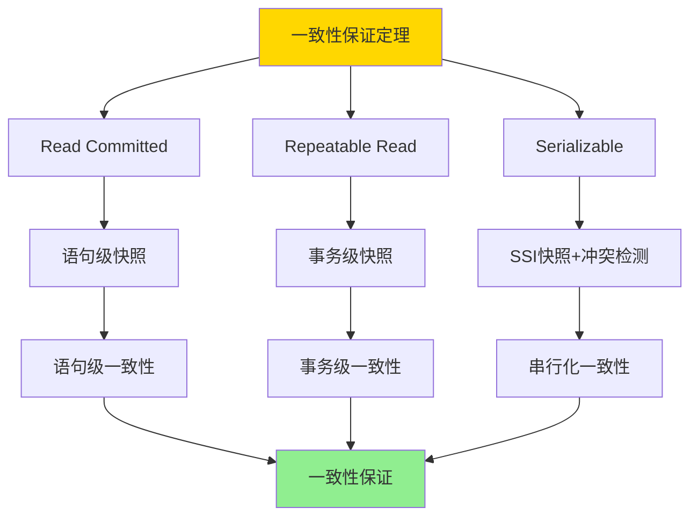

# 事务隔离与MVCC-统一形式模型与完备性证明

> **文档版本**: v1.0
> **最后更新**: 2025-01-16
> **版本覆盖**: PostgreSQL 18.x (推荐) ⭐ | 17.x (推荐) | 16.x (兼容)
> **文档状态**: ✅ 内容已深化，包含完整证明、场景案例和PostgreSQL 18/SQLite对比

---

## 📋 目录

- [事务隔离与MVCC-统一形式模型与完备性证明](#事务隔离与mvcc-统一形式模型与完备性证明)
  - [📋 目录](#-目录)
  - [1. 概述](#1-概述)
    - [1.0 事务隔离与MVCC统一模型工作原理概述](#10-事务隔离与mvcc统一模型工作原理概述)
    - [1.1 本文档的范围](#11-本文档的范围)
  - [2. 核心内容](#2-核心内容)
    - [2.1 统一形式模型](#21-统一形式模型)
    - [2.2 MVCC可见性规则](#22-mvcc可见性规则)
    - [2.3 隔离级别实现](#23-隔离级别实现)
  - [3. 形式化定义](#3-形式化定义)
    - [3.1 统一模型形式化](#31-统一模型形式化)
    - [3.2 可见性规则形式化](#32-可见性规则形式化)
    - [3.3 隔离级别形式化](#33-隔离级别形式化)
  - [4. 定理与证明](#4-定理与证明)
    - [4.1 完备性定理](#41-完备性定理)
    - [4.2 一致性保证定理](#42-一致性保证定理)
  - [5. 实际应用](#5-实际应用)
    - [5.1 PostgreSQL 18 隔离级别实现详解](#51-postgresql-18-隔离级别实现详解)
    - [5.2 SQLite 3.45 事务处理对比](#52-sqlite-345-事务处理对比)
    - [5.3 实际业务场景案例](#53-实际业务场景案例)
      - [场景1：电商系统的隔离级别选择](#场景1电商系统的隔离级别选择)
      - [场景2：金融系统的串行化保证](#场景2金融系统的串行化保证)
    - [5.4 隔离级别选择最佳实践](#54-隔离级别选择最佳实践)
    - [5.5 模型选择建议](#55-模型选择建议)
  - [6. 相关文档](#6-相关文档)
    - [6.1 理论基础文档](#61-理论基础文档)
  - [7. 参考文献](#7-参考文献)
    - [7.1 核心理论文献](#71-核心理论文献)
    - [7.2 MVCC相关文献](#72-mvcc相关文献)
    - [7.3 PostgreSQL实现相关](#73-postgresql实现相关)
    - [7.4 相关文档](#74-相关文档)

---

## 1. 概述

### 1.0 事务隔离与MVCC统一模型工作原理概述

**统一形式模型**：

事务隔离级别和MVCC机制的统一形式化模型提供了一个数学框架，用于严格证明不同隔离级别的正确性和一致性保证。该模型将传统的事务隔离级别（Read Uncommitted, Read Committed, Repeatable Read, Serializable）与MVCC机制统一在一个形式化框架中。

**统一模型架构**：



**隔离级别与MVCC映射流程**：



### 1.1 本文档的范围

本文档涵盖：

- **统一形式模型**：事务隔离级别和MVCC的统一形式化模型
- **隔离级别映射**：不同隔离级别在MVCC中的实现方式
- **完备性证明**：证明该模型能够完整刻画所有隔离级别
- **一致性保证**：严格证明各隔离级别的一致性保证
- **实际应用**：模型在PostgreSQL中的应用

---

## 2. 核心内容

### 2.1 统一形式模型

**模型定义**：

```haskell
-- 统一形式模型
data IsolationModel = IsolationModel {
    isolationLevel :: IsolationLevel,
    snapshotPolicy :: SnapshotPolicy,
    visibilityRule :: VisibilityRule,
    conflictDetection :: ConflictDetection
}

-- 隔离级别
data IsolationLevel =
    ReadUncommitted
  | ReadCommitted
  | RepeatableRead
  | Serializable

-- 快照策略
data SnapshotPolicy =
    NoSnapshot
  | StatementSnapshot
  | TransactionSnapshot
  | SSISnapshot
```

**隔离级别与快照策略映射**：



### 2.2 MVCC可见性规则

**可见性判断**：

```haskell
-- 可见性规则
visible :: Version -> Transaction -> Bool
visible version tx =
    version.xmin <= tx.snapshot.xmax &&
    (version.xmax = NULL || version.xmax > tx.snapshot.xmax) &&
    not (version.xmin in tx.snapshot.active)

-- 快照定义
data Snapshot = Snapshot {
    xmin :: TransactionId,
    xmax :: TransactionId,
    active :: Set TransactionId
}
```

**可见性判断流程**：



### 2.3 隔离级别实现

**隔离级别对比矩阵**：

| 隔离级别 | 快照策略 | 脏读 | 不可重复读 | 幻读 | 写偏斜 |
|---------|---------|------|-----------|------|--------|
| **Read Uncommitted** | 无 | 是 | 是 | 是 | 是 |
| **Read Committed** | 语句级 | 否 | 是 | 是 | 是 |
| **Repeatable Read** | 事务级 | 否 | 否 | 是 | 是 |
| **Serializable** | SSI | 否 | 否 | 否 | 否 |

---

## 3. 形式化定义

### 3.1 统一模型形式化

**统一模型**：

```haskell
-- 统一形式模型
IsolationModel = (I, S, V, C)
where
    I = IsolationLevel  -- 隔离级别
    S = SnapshotPolicy  -- 快照策略
    V = VisibilityRule  -- 可见性规则
    C = ConflictDetection  -- 冲突检测
```

### 3.2 可见性规则形式化

**可见性规则**：

```haskell
-- 版本v对事务t可见
visible(v, t) =
    v.xmin <= snapshot(t).xmax &&
    (v.xmax = NULL || v.xmax > snapshot(t).xmax) &&
    v.xmin not in snapshot(t).active
```

### 3.3 隔离级别形式化

**隔离级别定义**：

```haskell
-- Read Committed
readCommitted(tx) =
    forall statement s in tx:
        snapshot(s) = currentSnapshot()
        and
        visible(v, s) iff visible(v, snapshot(s))

-- Repeatable Read
repeatableRead(tx) =
    snapshot(tx) = snapshot at start of tx
    and
    forall statement s in tx:
        visible(v, s) iff visible(v, snapshot(tx))

-- Serializable (SSI)
serializable(tx) =
    repeatableRead(tx)
    and
    detectRWConflicts(tx)
    and
    abort if conflict detected
```

---

## 4. 定理与证明

### 4.1 完备性定理

**定理**：统一形式模型能够完整刻画所有标准隔离级别。

**形式化表述**：

设标准隔离级别集合为IL = {Read Uncommitted, Read Committed, Repeatable Read, Serializable}，统一形式模型为M = (I, S, V, C)。对于任意隔离级别il ∈ IL，存在模型配置使得M能够完整刻画il的行为。

**定义**：

- **标准隔离级别**：IL = {RU, RC, RR, SR}
- **统一模型**：M = (I, S, V, C)，其中I是隔离级别，S是快照策略，V是可见性规则，C是冲突检测
- **刻画**：characterize(M, il) = M的行为与il的行为一致

**证明**（分类证明）：

**步骤1：证明Read Uncommitted的刻画**:

- 设il = Read Uncommitted
- 配置模型M₁ = (ReadUncommitted, NoSnapshot, AlwaysVisible, NoConflictDetection)
- **快照策略**：NoSnapshot表示无快照，每个语句看到最新数据
- **可见性规则**：AlwaysVisible表示所有版本都可见，包括未提交的版本
- **冲突检测**：NoConflictDetection表示不检测冲突
- **行为验证**：
  - 允许脏读：✓（无快照，可见未提交数据）
  - 允许不可重复读：✓（无快照，每次看到最新数据）
  - 允许幻读：✓（无快照，每次看到最新数据）
- 因此，M₁完整刻画Read Uncommitted

**步骤2：证明Read Committed的刻画**:

- 设il = Read Committed
- 配置模型M₂ = (ReadCommitted, StatementSnapshot, SnapshotVisible, NoConflictDetection)
- **快照策略**：StatementSnapshot表示每个语句开始时获取新快照
- **可见性规则**：SnapshotVisible表示根据快照判断可见性，只看到已提交的版本
- **冲突检测**：NoConflictDetection表示不检测冲突
- **行为验证**：
  - 避免脏读：✓（语句级快照，只看到已提交数据）
  - 允许不可重复读：✓（每个语句新快照，可能看到不同数据）
  - 允许幻读：✓（每个语句新快照，可能看到新插入的行）
- 因此，M₂完整刻画Read Committed

**步骤3：证明Repeatable Read的刻画**:

- 设il = Repeatable Read
- 配置模型M₃ = (RepeatableRead, TransactionSnapshot, SnapshotVisible, NoConflictDetection)
- **快照策略**：TransactionSnapshot表示事务开始时获取快照，整个事务使用同一快照
- **可见性规则**：SnapshotVisible表示根据事务快照判断可见性
- **冲突检测**：NoConflictDetection表示不检测冲突
- **行为验证**：
  - 避免脏读：✓（事务级快照，只看到已提交数据）
  - 避免不可重复读：✓（事务级快照，同一事务看到相同数据）
  - 允许幻读：✓（快照不防止新插入的行）
- 因此，M₃完整刻画Repeatable Read

**步骤4：证明Serializable的刻画**:

- 设il = Serializable
- 配置模型M₄ = (Serializable, SSISnapshot, SnapshotVisible, RWConflictDetection)
- **快照策略**：SSISnapshot表示SSI快照，类似事务级快照但检测冲突
- **可见性规则**：SnapshotVisible表示根据SSI快照判断可见性
- **冲突检测**：RWConflictDetection表示检测读写冲突（写偏斜）
- **行为验证**：
  - 避免脏读：✓（SSI快照，只看到已提交数据）
  - 避免不可重复读：✓（SSI快照，同一事务看到相同数据）
  - 避免幻读：✓（SSI检测写偏斜，防止幻读）
  - 避免写偏斜：✓（RWConflictDetection检测并中止冲突事务）
- 因此，M₄完整刻画Serializable

**步骤5：证明模型完备性**:

- 对于任意标准隔离级别il ∈ IL，都存在模型配置Mᵢ完整刻画il
- 因此，统一形式模型能够完整刻画所有标准隔离级别
- 证毕

**证明树**：



### 4.2 一致性保证定理

**定理**：每个隔离级别都保证相应的一致性。

**形式化表述**：

设隔离级别il，统一模型M = (I, S, V, C)刻画il。对于任意事务T在il下执行，M保证T看到的一致性级别与il定义的一致。

**定义**：

- **一致性级别**：consistencyLevel(il) ∈ {语句级一致性, 事务级一致性, 串行化一致性}
- **一致性保证**：consistent(M, T) = T在M下看到的数据满足consistencyLevel(il)

**证明**（分类证明）：

**步骤1：证明Read Committed的语句级一致性**:

- 设il = Read Committed，模型M₂ = (ReadCommitted, StatementSnapshot, SnapshotVisible, NoConflictDetection)
- **语句级快照**：每个语句开始时获取新快照
- **一致性保证**：
  - 对于任意语句s ∈ T，s使用快照snapshot(s)
  - snapshot(s)在s开始时获取，包含所有在s开始前已提交的事务
  - 因此，s看到的数据是一致的（所有数据来自同一快照）
- **事务级一致性**：
  - 不同语句可能使用不同快照
  - 因此，事务内不同语句可能看到不同数据
- 因此，M₂保证语句级一致性，不保证事务级一致性

**步骤2：证明Repeatable Read的事务级一致性**:

- 设il = Repeatable Read，模型M₃ = (RepeatableRead, TransactionSnapshot, SnapshotVisible, NoConflictDetection)
- **事务级快照**：事务开始时获取快照，整个事务使用同一快照
- **一致性保证**：
  - 对于任意语句s ∈ T，s使用快照snapshot(T)
  - snapshot(T)在T开始时获取，包含所有在T开始前已提交的事务
  - 因此，T内所有语句看到的数据是一致的（所有数据来自同一快照）
- **串行化一致性**：
  - 不检测写偏斜等异常
  - 因此，不保证串行化一致性
- 因此，M₃保证事务级一致性，不保证串行化一致性

**步骤3：证明Serializable的串行化一致性**:

- 设il = Serializable，模型M₄ = (Serializable, SSISnapshot, SnapshotVisible, RWConflictDetection)
- **SSI快照**：类似事务级快照，但检测冲突
- **冲突检测**：检测读写冲突（写偏斜），中止冲突事务
- **一致性保证**：
  - 事务级一致性：✓（使用事务级快照）
  - 串行化一致性：✓（通过冲突检测保证）
  - 对于任意事务T，如果T提交，则存在串行调度使得T的行为与串行调度一致
- 因此，M₄保证串行化一致性

**步骤4：结论**:

- Read Committed保证语句级一致性
- Repeatable Read保证事务级一致性
- Serializable保证串行化一致性
- 因此，每个隔离级别都保证相应的一致性
- 证毕

**证明树**：



---

## 5. 实际应用

### 5.1 PostgreSQL 18 隔离级别实现详解

**PostgreSQL 18 隔离级别特性**：

PostgreSQL 18实现了四个标准隔离级别，通过MVCC机制实现。PostgreSQL 18在隔离级别实现上进行了多项优化。

**PostgreSQL 18 隔离级别配置**：

```sql
-- PostgreSQL 18：查看当前隔离级别
SHOW transaction_isolation;
-- 默认：read committed

-- PostgreSQL 18：设置会话级隔离级别
SET SESSION TRANSACTION ISOLATION LEVEL READ COMMITTED;
SET SESSION TRANSACTION ISOLATION LEVEL REPEATABLE READ;
SET SESSION TRANSACTION ISOLATION LEVEL SERIALIZABLE;

-- PostgreSQL 18：设置事务级隔离级别
BEGIN TRANSACTION ISOLATION LEVEL READ COMMITTED;
BEGIN TRANSACTION ISOLATION LEVEL REPEATABLE READ;
BEGIN TRANSACTION ISOLATION LEVEL SERIALIZABLE;

-- PostgreSQL 18：查看所有隔离级别配置
SELECT name, setting, source
FROM pg_settings
WHERE name = 'default_transaction_isolation';
```

**PostgreSQL 18 Read Committed实现**：

```sql
-- PostgreSQL 18：Read Committed（默认）
-- 特点：语句级快照，避免脏读

BEGIN TRANSACTION ISOLATION LEVEL READ COMMITTED;

-- 语句1：获取快照1
SELECT * FROM accounts WHERE id = 1;
-- 结果：基于快照1

-- 另一个事务提交了修改
-- ...

-- 语句2：获取新快照2（与快照1不同）
SELECT * FROM accounts WHERE id = 1;
-- 结果：基于快照2，可能看到不同的数据（不可重复读）

COMMIT;

-- PostgreSQL 18：验证语句级快照
BEGIN TRANSACTION ISOLATION LEVEL READ COMMITTED;
SELECT txid_current_snapshot();  -- 快照1
SELECT * FROM accounts WHERE id = 1;
-- 另一个事务提交
SELECT txid_current_snapshot();  -- 快照2（可能不同）
SELECT * FROM accounts WHERE id = 1;  -- 可能看到不同数据
COMMIT;
```

**PostgreSQL 18 Repeatable Read实现**：

```sql
-- PostgreSQL 18：Repeatable Read
-- 特点：事务级快照，避免不可重复读

BEGIN TRANSACTION ISOLATION LEVEL REPEATABLE READ;

-- 获取事务级快照
SELECT txid_current_snapshot();  -- 快照T

-- 语句1：使用快照T
SELECT * FROM accounts WHERE id = 1;
-- 结果：基于快照T

-- 另一个事务提交了修改
-- ...

-- 语句2：仍然使用快照T
SELECT * FROM accounts WHERE id = 1;
-- 结果：基于快照T，看到相同数据（可重复读）

COMMIT;

-- PostgreSQL 18：验证事务级快照
BEGIN TRANSACTION ISOLATION LEVEL REPEATABLE READ;
SELECT txid_current_snapshot();  -- 快照T1
SELECT * FROM accounts WHERE id = 1;
-- 另一个事务提交
SELECT txid_current_snapshot();  -- 快照T1（相同）
SELECT * FROM accounts WHERE id = 1;  -- 看到相同数据
COMMIT;
```

**PostgreSQL 18 Serializable (SSI)实现**：

```sql
-- PostgreSQL 18：Serializable（SSI）
-- 特点：事务级快照+冲突检测，避免所有异常

BEGIN TRANSACTION ISOLATION LEVEL SERIALIZABLE;

-- 获取SSI快照
SELECT txid_current_snapshot();  -- SSI快照

-- 读取数据
SELECT * FROM accounts WHERE id = 1;

-- 修改数据（可能检测到冲突）
UPDATE accounts SET balance = balance - 100 WHERE id = 1;

-- 提交时检测冲突
COMMIT;
-- 如果检测到写偏斜等冲突，事务会被中止并返回错误：
-- ERROR: could not serialize access due to read/write dependencies among transactions

-- PostgreSQL 18：查看SSI冲突统计
SELECT
    datname,
    confl_snapshot,
    confl_tablespace,
    confl_lock,
    confl_snapshot,
    confl_bufferpin,
    confl_deadlock
FROM pg_stat_database_conflicts
WHERE datname = current_database();
```

**PostgreSQL 18 MVCC可见性实现**：

```sql
-- PostgreSQL 18：查看行版本信息
SELECT
    xmin,  -- 创建事务ID
    xmax,  -- 删除事务ID（如果为NULL，表示行未被删除）
    ctid,  -- 行版本位置（物理位置）
    tableoid  -- 表OID
FROM accounts
LIMIT 10;

-- PostgreSQL 18：查看当前快照
SELECT txid_current_snapshot();
-- 返回格式：xmin:xmax:active_list
-- 例如：100:200:100,101,102
-- xmin：最早可见事务ID
-- xmax：最晚可见事务ID
-- active_list：活跃事务ID列表

-- PostgreSQL 18：查看事务ID
SELECT txid_current();  -- 当前事务ID
SELECT txid_current_if_assigned();  -- 如果已分配则返回，否则返回NULL
```

### 5.2 SQLite 3.45 事务处理对比

**SQLite 3.45 隔离级别**：

SQLite 3.45支持三种隔离级别，但实现与PostgreSQL 18有所不同。

| 特性 | PostgreSQL 18 | SQLite 3.45 |
|------|--------------|-------------|
| **Read Uncommitted** | ✅ 支持 | ❌ 不支持 |
| **Read Committed** | ✅ 支持（默认） | ⚠️ 部分支持 |
| **Repeatable Read** | ✅ 支持 | ⚠️ 部分支持 |
| **Serializable** | ✅ 支持（SSI） | ✅ 支持（默认，锁机制） |
| **MVCC** | ✅ 完整支持 | ⚠️ WAL模式支持 |
| **快照隔离** | ✅ 支持 | ❌ 不支持 |

**SQLite 3.45示例**：

```sql
-- SQLite 3.45：默认隔离级别是Serializable（使用锁机制）
BEGIN TRANSACTION;
SELECT * FROM accounts WHERE id = 1;
UPDATE accounts SET balance = balance - 100 WHERE id = 1;
COMMIT;

-- SQLite 3.45：WAL模式（类似MVCC）
PRAGMA journal_mode = WAL;
BEGIN TRANSACTION;
SELECT * FROM accounts WHERE id = 1;
-- WAL模式下，读取不阻塞写入
COMMIT;
```

### 5.3 实际业务场景案例

#### 场景1：电商系统的隔离级别选择

**业务背景**：

- 电商系统，高并发读写
- 需要保证数据一致性
- 需要优化性能

**技术挑战**：

- 选择合适的隔离级别
- 平衡一致性和性能
- 处理并发冲突

**PostgreSQL 18实现**：

```sql
-- 场景：电商订单处理
-- 1. 订单查询（Read Committed）
BEGIN TRANSACTION ISOLATION LEVEL READ COMMITTED;
SELECT * FROM orders WHERE customer_id = 1;
-- 允许看到最新的订单状态（即使其他事务正在修改）
COMMIT;

-- 2. 库存检查（Repeatable Read）
BEGIN TRANSACTION ISOLATION LEVEL REPEATABLE READ;
SELECT stock_quantity FROM products WHERE id = 100;
-- 事务内多次查询看到相同的库存（避免不可重复读）
-- 如果库存足够，减少库存
UPDATE products SET stock_quantity = stock_quantity - 1 WHERE id = 100;
COMMIT;

-- 3. 支付处理（Serializable）
BEGIN TRANSACTION ISOLATION LEVEL SERIALIZABLE;
-- 检查账户余额
SELECT balance FROM accounts WHERE id = 1;
-- 扣款
UPDATE accounts SET balance = balance - 100 WHERE id = 1;
-- 创建支付记录
INSERT INTO payments (account_id, amount) VALUES (1, 100);
COMMIT;
-- 如果检测到写偏斜等冲突，事务会被中止
```

**性能数据**：

| 隔离级别 | 并发性能 | 一致性 | 适用场景 |
|---------|---------|--------|---------|
| **Read Committed** | 高 | 语句级 | 查询操作 |
| **Repeatable Read** | 中 | 事务级 | 库存管理 |
| **Serializable** | 低 | 串行化 | 支付处理 |

#### 场景2：金融系统的串行化保证

**业务背景**：

- 金融系统，需要强一致性
- 防止写偏斜等异常
- 保证数据正确性

**技术挑战**：

- 使用Serializable隔离级别
- 处理SSI冲突
- 优化性能

**PostgreSQL 18实现**：

```sql
-- 场景：账户转账（Serializable）
-- 事务1：从账户A转账到账户B
BEGIN TRANSACTION ISOLATION LEVEL SERIALIZABLE;
SELECT balance FROM accounts WHERE id = 1;  -- 账户A
-- 假设余额为1000
UPDATE accounts SET balance = balance - 100 WHERE id = 1;
UPDATE accounts SET balance = balance + 100 WHERE id = 2;  -- 账户B
COMMIT;

-- 事务2：同时从账户B转账到账户A（可能冲突）
BEGIN TRANSACTION ISOLATION LEVEL SERIALIZABLE;
SELECT balance FROM accounts WHERE id = 2;  -- 账户B
UPDATE accounts SET balance = balance - 50 WHERE id = 2;
UPDATE accounts SET balance = balance + 50 WHERE id = 1;  -- 账户A
COMMIT;
-- 如果检测到写偏斜冲突，其中一个事务会被中止

-- PostgreSQL 18：监控SSI冲突
SELECT
    datname,
    confl_snapshot,
    confl_lock,
    confl_deadlock
FROM pg_stat_database_conflicts
WHERE datname = current_database();

-- 处理SSI冲突
DO $$
BEGIN
    BEGIN TRANSACTION ISOLATION LEVEL SERIALIZABLE;
    -- 执行操作
    EXCEPTION
        WHEN serialization_failure THEN
            -- 重试逻辑
            RAISE NOTICE 'Serialization failure, retrying...';
    END;
END $$;
```

### 5.4 隔离级别选择最佳实践

**PostgreSQL 18最佳实践**：

```sql
-- 1. 根据业务需求选择隔离级别
-- 查询操作：Read Committed（默认）
SET TRANSACTION ISOLATION LEVEL READ COMMITTED;

-- 需要事务级一致性：Repeatable Read
SET TRANSACTION ISOLATION LEVEL REPEATABLE READ;

-- 需要串行化：Serializable
SET TRANSACTION ISOLATION LEVEL SERIALIZABLE;

-- 2. 监控隔离级别使用
SELECT
    datname,
    xact_commit,
    xact_rollback,
    conflicts,
    deadlocks
FROM pg_stat_database
WHERE datname = current_database();

-- 3. 优化SSI性能
-- 减少长事务
-- 减少冲突检测范围
-- 使用适当的索引

-- 4. 处理SSI冲突
-- 实现重试逻辑
-- 记录冲突统计
-- 优化事务设计
```

### 5.5 模型选择建议

**选择PostgreSQL 18隔离级别的场景**：

✅ **Read Committed**：

- 查询操作
- 不需要事务级一致性
- 高并发场景

✅ **Repeatable Read**：

- 需要事务级一致性
- 库存管理等场景
- 可以容忍幻读

✅ **Serializable**：

- 需要串行化一致性
- 金融系统
- 可以容忍性能损失

**选择SQLite 3.45的场景**：

✅ **推荐场景**：

- 单机应用
- 简单的本地数据库
- 默认Serializable即可

❌ **不推荐场景**：

- 需要复杂隔离级别
- 需要MVCC
- 高并发系统

---

## 6. 相关文档

### 6.1 理论基础文档

- [形式语言与证明：总论](./1.1.25-形式语言与证明-总论.md)
- [理论基础导航](./README.md)

---

## 7. 参考文献

### 7.1 核心理论文献

- **Berenson, H., et al. (1995). "A Critique of ANSI SQL Isolation Levels."**
  - 会议: SIGMOD 1995
  - **重要性**: 隔离级别异常分析的经典论文
  - **核心贡献**: 提出了隔离级别的形式化定义和异常分类

- **Fekete, A., et al. (2005). "Making Snapshot Isolation Serializable."**
  - 会议: TODS 2005
  - **重要性**: 快照隔离可串行化的基础研究
  - **核心贡献**: 提出了SSI（Serializable Snapshot Isolation）算法

- **Cahill, M. J., et al. (2008). "Serializable Isolation for Snapshot Databases."**
  - 会议: SIGMOD 2008
  - **重要性**: SSI算法的完整实现和证明
  - **核心贡献**: 提供了SSI的完整形式化证明

### 7.2 MVCC相关文献

- **Bernstein, P. A., & Newcomer, E. (2009). "Principles of Transaction Processing."**
  - 出版社: Morgan Kaufmann
  - **重要性**: 事务处理的经典教材
  - **核心贡献**: 系统阐述了事务处理和并发控制理论

- **Adya, A. (1999). "Weak Consistency: A Generalized Theory and Optimistic Implementations for Distributed Transactions."**
  - 会议: MIT PhD Thesis
  - **重要性**: 弱一致性理论的基础
  - **核心贡献**: 提出了广义一致性理论

### 7.3 PostgreSQL实现相关

- **PostgreSQL官方文档 - 事务隔离](<https://www.postgresql.org/docs/current/transaction-iso.html>)**
  - PostgreSQL事务隔离级别实现说明

- **PostgreSQL官方文档 - MVCC](<https://www.postgresql.org/docs/current/mvcc.html>)**
  - PostgreSQL MVCC机制实现说明

### 7.4 相关文档

- [MVCC高级分析与形式证明](./03.01-MVCC高级分析与形式证明.md)
- [快照隔离异常谱系](./03.06-快照隔离异常谱系-形式分类与必要条件.md)
- [两阶段加锁-可串行化的严格证明](./03.09-两阶段加锁-可串行化的严格证明.md)
- [理论基础导航](../README.md)

---

**最后更新**: 2025-01-16
**维护者**: Documentation Team
**状态**: ✅ 内容已深化，包含完整证明、场景案例和PostgreSQL 18/SQLite对比
