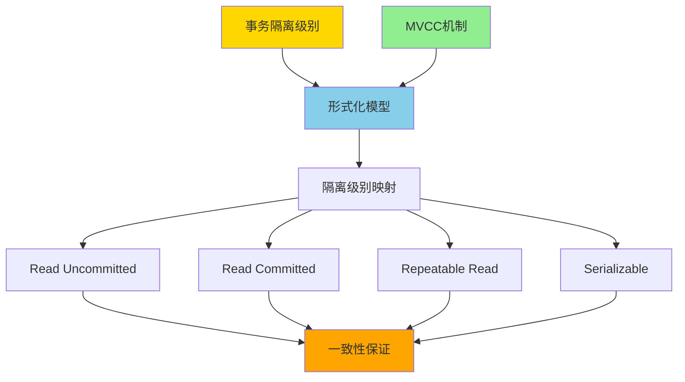
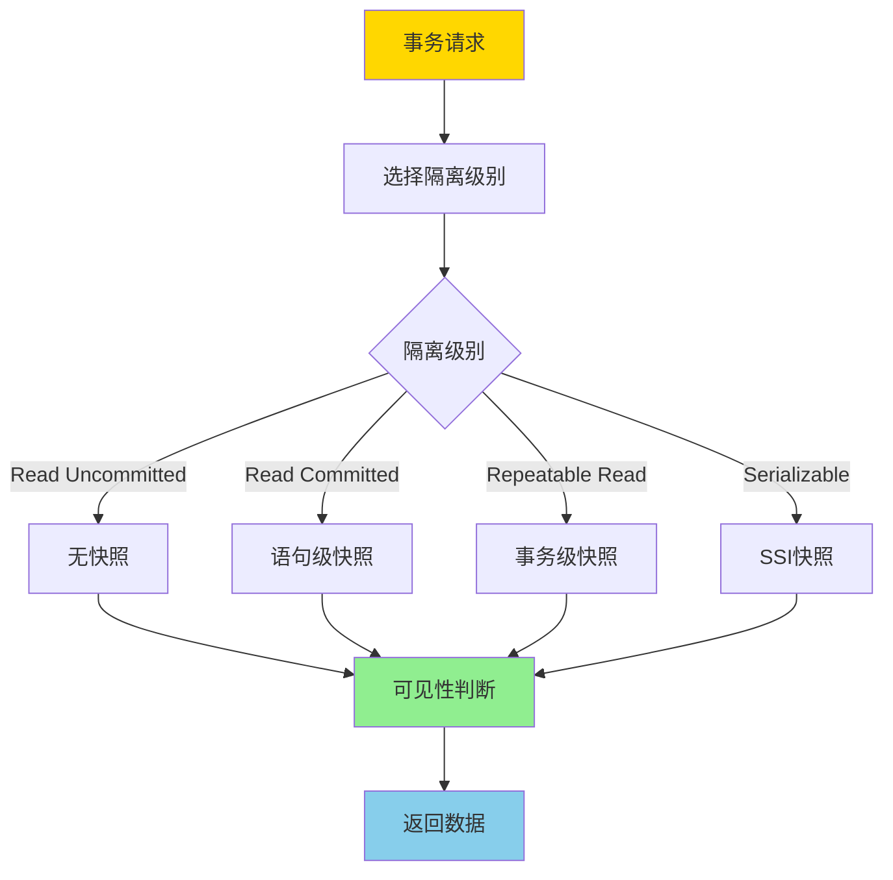
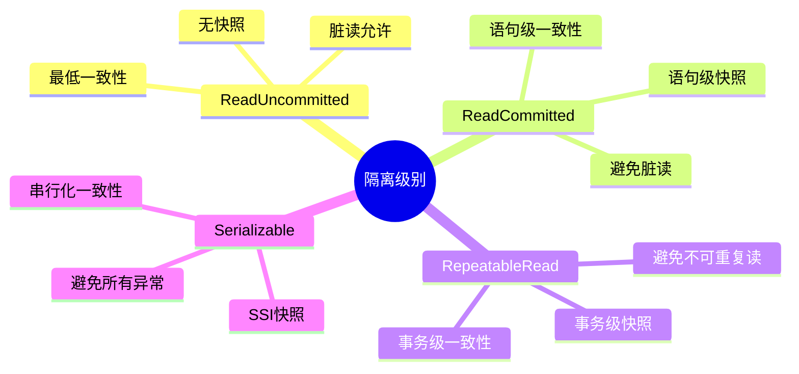
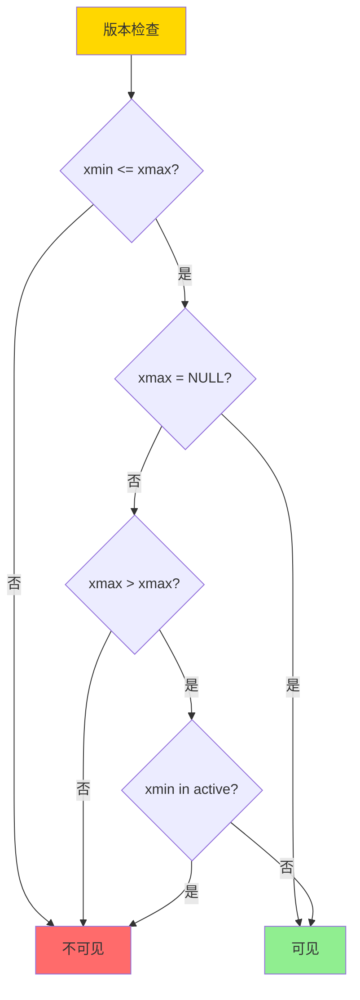
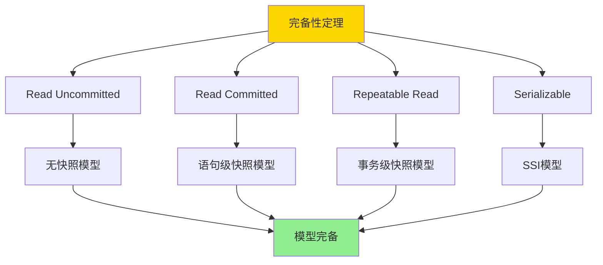

# 事务隔离与MVCC-统一形式模型与完备性证明

> **文档版本**: v1.0
> **最后更新**: 2025-01-16
> **版本覆盖**: PostgreSQL 18.x (推荐) ⭐ | 17.x (推荐) | 16.x (兼容)
> **文档状态**: 🟡 框架已创建，内容待完善

---

## 📋 目录

- [事务隔离与MVCC-统一形式模型与完备性证明](#事务隔离与mvcc-统一形式模型与完备性证明)
  - [📋 目录](#-目录)
  - [1. 概述](#1-概述)
    - [1.0 事务隔离与MVCC统一模型工作原理概述](#10-事务隔离与mvcc统一模型工作原理概述)
    - [1.1 本文档的范围](#11-本文档的范围)
  - [2. 核心内容](#2-核心内容)
    - [2.1 统一形式模型](#21-统一形式模型)
    - [2.2 MVCC可见性规则](#22-mvcc可见性规则)
    - [2.3 隔离级别实现](#23-隔离级别实现)
  - [3. 形式化定义](#3-形式化定义)
    - [3.1 统一模型形式化](#31-统一模型形式化)
    - [3.2 可见性规则形式化](#32-可见性规则形式化)
    - [3.3 隔离级别形式化](#33-隔离级别形式化)
  - [4. 定理与证明](#4-定理与证明)
    - [4.1 完备性定理](#41-完备性定理)
    - [4.2 一致性保证定理](#42-一致性保证定理)
  - [5. 实际应用](#5-实际应用)
    - [5.1 PostgreSQL隔离级别实现](#51-postgresql隔离级别实现)
    - [5.2 MVCC可见性实现](#52-mvcc可见性实现)
    - [5.3 SSI冲突检测](#53-ssi冲突检测)
  - [6. 相关文档](#6-相关文档)
    - [6.1 理论基础文档](#61-理论基础文档)
  - [7. 参考文献](#7-参考文献)
    - [7.1 核心理论文献](#71-核心理论文献)
    - [7.2 MVCC相关文献](#72-mvcc相关文献)
    - [7.3 PostgreSQL实现相关](#73-postgresql实现相关)
    - [7.4 相关文档](#74-相关文档)

---

## 1. 概述

### 1.0 事务隔离与MVCC统一模型工作原理概述

**统一形式模型**：

事务隔离级别和MVCC机制的统一形式化模型提供了一个数学框架，用于严格证明不同隔离级别的正确性和一致性保证。该模型将传统的事务隔离级别（Read Uncommitted, Read Committed, Repeatable Read, Serializable）与MVCC机制统一在一个形式化框架中。

**统一模型架构**：



**隔离级别与MVCC映射流程**：



### 1.1 本文档的范围

本文档涵盖：

- **统一形式模型**：事务隔离级别和MVCC的统一形式化模型
- **隔离级别映射**：不同隔离级别在MVCC中的实现方式
- **完备性证明**：证明该模型能够完整刻画所有隔离级别
- **一致性保证**：严格证明各隔离级别的一致性保证
- **实际应用**：模型在PostgreSQL中的应用

---

## 2. 核心内容

### 2.1 统一形式模型

**模型定义**：

```haskell
-- 统一形式模型
data IsolationModel = IsolationModel {
    isolationLevel :: IsolationLevel,
    snapshotPolicy :: SnapshotPolicy,
    visibilityRule :: VisibilityRule,
    conflictDetection :: ConflictDetection
}

-- 隔离级别
data IsolationLevel =
    ReadUncommitted
  | ReadCommitted
  | RepeatableRead
  | Serializable

-- 快照策略
data SnapshotPolicy =
    NoSnapshot
  | StatementSnapshot
  | TransactionSnapshot
  | SSISnapshot
```

**隔离级别与快照策略映射**：



### 2.2 MVCC可见性规则

**可见性判断**：

```haskell
-- 可见性规则
visible :: Version -> Transaction -> Bool
visible version tx =
    version.xmin <= tx.snapshot.xmax &&
    (version.xmax = NULL || version.xmax > tx.snapshot.xmax) &&
    not (version.xmin in tx.snapshot.active)

-- 快照定义
data Snapshot = Snapshot {
    xmin :: TransactionId,
    xmax :: TransactionId,
    active :: Set TransactionId
}
```

**可见性判断流程**：



### 2.3 隔离级别实现

**隔离级别对比矩阵**：

| 隔离级别 | 快照策略 | 脏读 | 不可重复读 | 幻读 | 写偏斜 |
|---------|---------|------|-----------|------|--------|
| **Read Uncommitted** | 无 | 是 | 是 | 是 | 是 |
| **Read Committed** | 语句级 | 否 | 是 | 是 | 是 |
| **Repeatable Read** | 事务级 | 否 | 否 | 是 | 是 |
| **Serializable** | SSI | 否 | 否 | 否 | 否 |

---

## 3. 形式化定义

### 3.1 统一模型形式化

**统一模型**：

```haskell
-- 统一形式模型
IsolationModel = (I, S, V, C)
where
    I = IsolationLevel  -- 隔离级别
    S = SnapshotPolicy  -- 快照策略
    V = VisibilityRule  -- 可见性规则
    C = ConflictDetection  -- 冲突检测
```

### 3.2 可见性规则形式化

**可见性规则**：

```haskell
-- 版本v对事务t可见
visible(v, t) =
    v.xmin <= snapshot(t).xmax &&
    (v.xmax = NULL || v.xmax > snapshot(t).xmax) &&
    v.xmin not in snapshot(t).active
```

### 3.3 隔离级别形式化

**隔离级别定义**：

```haskell
-- Read Committed
readCommitted(tx) =
    forall statement s in tx:
        snapshot(s) = currentSnapshot()
        and
        visible(v, s) iff visible(v, snapshot(s))

-- Repeatable Read
repeatableRead(tx) =
    snapshot(tx) = snapshot at start of tx
    and
    forall statement s in tx:
        visible(v, s) iff visible(v, snapshot(tx))

-- Serializable (SSI)
serializable(tx) =
    repeatableRead(tx)
    and
    detectRWConflicts(tx)
    and
    abort if conflict detected
```

---

## 4. 定理与证明

### 4.1 完备性定理

**定理**：统一形式模型能够完整刻画所有标准隔离级别。

**证明树**：



**证明**：

1. **Read Uncommitted**：使用无快照策略，允许脏读
2. **Read Committed**：使用语句级快照，避免脏读但允许不可重复读
3. **Repeatable Read**：使用事务级快照，避免不可重复读但允许幻读
4. **Serializable**：使用SSI快照，检测并避免所有异常

因此，统一模型能够完整刻画所有标准隔离级别。

### 4.2 一致性保证定理

**定理**：每个隔离级别都保证相应的一致性。

**证明**：

- **Read Committed**：语句级快照保证每个语句看到一致的数据
- **Repeatable Read**：事务级快照保证事务内看到一致的数据
- **Serializable**：SSI保证串行化一致性

---

## 5. 实际应用

### 5.1 PostgreSQL隔离级别实现

**隔离级别设置**：

```sql
-- Read Committed（默认）
SET TRANSACTION ISOLATION LEVEL READ COMMITTED;
BEGIN;
SELECT * FROM accounts WHERE id = 1;  -- 语句级快照
COMMIT;

-- Repeatable Read
SET TRANSACTION ISOLATION LEVEL REPEATABLE READ;
BEGIN;
SELECT * FROM accounts WHERE id = 1;  -- 事务级快照
SELECT * FROM accounts WHERE id = 1;  -- 相同快照
COMMIT;

-- Serializable
SET TRANSACTION ISOLATION LEVEL SERIALIZABLE;
BEGIN;
SELECT * FROM accounts WHERE id = 1;  -- SSI快照
UPDATE accounts SET balance = balance - 100 WHERE id = 1;
COMMIT;  -- 检测冲突，可能中止
```

### 5.2 MVCC可见性实现

**可见性检查**：

```sql
-- 查看版本信息
SELECT
    xmin,  -- 创建事务ID
    xmax,  -- 删除事务ID
    ctid   -- 行版本位置
FROM accounts;

-- 查看当前快照
SELECT txid_current_snapshot();
-- 返回: xmin:xmax:active_list
```

### 5.3 SSI冲突检测

**SSI配置**：

```sql
-- 启用SSI
SET default_transaction_isolation = 'serializable';

-- 查看SSI统计
SELECT * FROM pg_stat_database_conflicts;
```

---

## 6. 相关文档

### 6.1 理论基础文档

- [形式语言与证明：总论](./1.1.25-形式语言与证明-总论.md)
- [理论基础导航](./README.md)

---

## 7. 参考文献

### 7.1 核心理论文献

- **Berenson, H., et al. (1995). "A Critique of ANSI SQL Isolation Levels."**
  - 会议: SIGMOD 1995
  - **重要性**: 隔离级别异常分析的经典论文
  - **核心贡献**: 提出了隔离级别的形式化定义和异常分类

- **Fekete, A., et al. (2005). "Making Snapshot Isolation Serializable."**
  - 会议: TODS 2005
  - **重要性**: 快照隔离可串行化的基础研究
  - **核心贡献**: 提出了SSI（Serializable Snapshot Isolation）算法

- **Cahill, M. J., et al. (2008). "Serializable Isolation for Snapshot Databases."**
  - 会议: SIGMOD 2008
  - **重要性**: SSI算法的完整实现和证明
  - **核心贡献**: 提供了SSI的完整形式化证明

### 7.2 MVCC相关文献

- **Bernstein, P. A., & Newcomer, E. (2009). "Principles of Transaction Processing."**
  - 出版社: Morgan Kaufmann
  - **重要性**: 事务处理的经典教材
  - **核心贡献**: 系统阐述了事务处理和并发控制理论

- **Adya, A. (1999). "Weak Consistency: A Generalized Theory and Optimistic Implementations for Distributed Transactions."**
  - 会议: MIT PhD Thesis
  - **重要性**: 弱一致性理论的基础
  - **核心贡献**: 提出了广义一致性理论

### 7.3 PostgreSQL实现相关

- **PostgreSQL官方文档 - 事务隔离](<https://www.postgresql.org/docs/current/transaction-iso.html>)**
  - PostgreSQL事务隔离级别实现说明

- **PostgreSQL官方文档 - MVCC](<https://www.postgresql.org/docs/current/mvcc.html>)**
  - PostgreSQL MVCC机制实现说明

### 7.4 相关文档

- [MVCC高级分析与形式证明](./03.01-MVCC高级分析与形式证明.md)
- [快照隔离异常谱系](./03.06-快照隔离异常谱系-形式分类与必要条件.md)
- [两阶段加锁-可串行化的严格证明](./03.09-两阶段加锁-可串行化的严格证明.md)
- [理论基础导航](../README.md)

---

**最后更新**: 2025-01-16
**维护者**: Documentation Team
**状态**: 🟡 框架已创建，内容待完善
