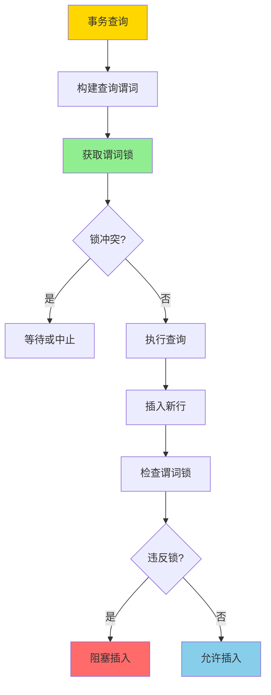
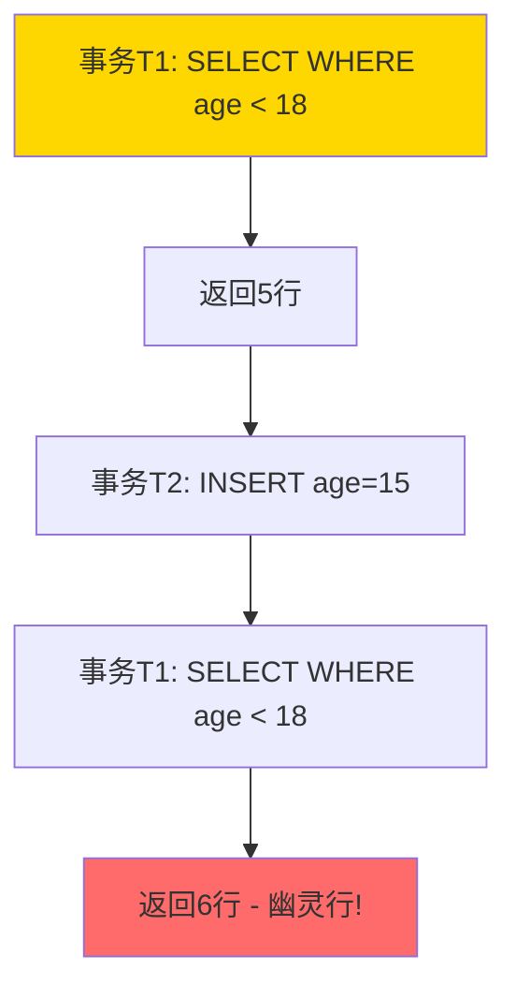

# 谓词锁与幽灵现象-形式化与消除条件

> **文档版本**: v1.0
> **最后更新**: 2025-01-16
> **版本覆盖**: PostgreSQL 18.x (推荐) ⭐ | 17.x (推荐) | 16.x (兼容)
> **文档状态**: 🟡 框架已创建，内容待完善

---

## 📋 目录

- [谓词锁与幽灵现象-形式化与消除条件](#谓词锁与幽灵现象-形式化与消除条件)
  - [📋 目录](#-目录)
  - [1. 概述](#1-概述)
    - [1.0 谓词锁与幽灵现象工作原理概述](#10-谓词锁与幽灵现象工作原理概述)
    - [1.1 本文档的范围](#11-本文档的范围)
  - [2. 核心内容](#2-核心内容)
    - [2.1 谓词锁定义](#21-谓词锁定义)
    - [2.2 幽灵现象形式化](#22-幽灵现象形式化)
    - [2.3 谓词锁检测](#23-谓词锁检测)
  - [3. 形式化定义](#3-形式化定义)
    - [3.1 谓词锁语义](#31-谓词锁语义)
    - [3.2 幽灵现象形式化](#32-幽灵现象形式化)
    - [3.3 消除条件](#33-消除条件)
  - [4. 定理与证明](#4-定理与证明)
    - [4.1 谓词锁消除幽灵现象定理](#41-谓词锁消除幽灵现象定理)
    - [4.2 谓词锁复杂度](#42-谓词锁复杂度)
  - [5. 实际应用](#5-实际应用)
    - [5.1 PostgreSQL中的谓词锁](#51-postgresql中的谓词锁)
    - [5.2 索引与谓词锁优化](#52-索引与谓词锁优化)
    - [5.3 应用场景](#53-应用场景)
  - [6. 相关文档](#6-相关文档)
    - [6.1 理论基础文档](#61-理论基础文档)
  - [7. 参考文献](#7-参考文献)
    - [7.1 核心理论文献](#71-核心理论文献)
    - [7.2 PostgreSQL实现相关](#72-postgresql实现相关)
    - [7.3 相关文档](#73-相关文档)

---

## 1. 概述

### 1.0 谓词锁与幽灵现象工作原理概述

**谓词锁**：

谓词锁是一种用于防止"幽灵现象"（Phantom Phenomenon）的锁机制。与传统的行锁不同，谓词锁锁定满足某个谓词的所有行，包括当前存在和未来可能插入的行。

**幽灵现象**：

幽灵现象是指在一个事务的两次读取之间，另一个事务插入了满足查询条件的新行，导致两次读取结果不一致。

**谓词锁机制**：



**幽灵现象示例**：



### 1.1 本文档的范围

本文档涵盖：

- **谓词锁机制**：谓词锁的形式化定义和实现
- **幽灵现象**：幽灵现象的形式化描述和检测
- **消除条件**：消除幽灵现象的必要条件
- **实际应用**：谓词锁在PostgreSQL中的应用

---

## 2. 核心内容

### 2.1 谓词锁定义

**谓词锁结构**：

```haskell
-- 谓词锁
data PredicateLock = PredicateLock {
    predicate :: Predicate,
    lockMode :: LockMode,
    transaction :: TransactionID
}

-- 谓词
data Predicate =
    Comparison Column Operator Value
  | Conjunction [Predicate]
  | Disjunction [Predicate]

-- 锁模式
data LockMode =
    SharedLock    -- 共享锁（读）
  | ExclusiveLock -- 排他锁（写）
```

### 2.2 幽灵现象形式化

**幽灵现象定义**：

```haskell
-- 幽灵现象
phantomPhenomenon :: Transaction -> Transaction -> Bool
phantomPhenomenon T1 T2 =
    exists query Q, row r such that:
      T1 executes Q at time t1, returns result R1
      T2 inserts r at time t2, where t1 < t2 < T1.commit
      r satisfies Q
      T1 executes Q at time t3, returns result R2
      |R2| > |R1|  -- 结果集大小增加
```

### 2.3 谓词锁检测

**锁冲突检测**：

```haskell
-- 谓词锁冲突
predicateLockConflict :: PredicateLock -> PredicateLock -> Bool
predicateLockConflict lock1 lock2 =
    -- 检查谓词是否重叠
    predicatesOverlap (predicate lock1) (predicate lock2) &&
    -- 检查锁模式是否冲突
    lockModesConflict (lockMode lock1) (lockMode lock2)
```

---

## 3. 形式化定义

### 3.1 谓词锁语义

**谓词锁语义**：

```haskell
-- 谓词锁语义
PredicateLock P(r) =
    if r satisfies P then Locked else Unlocked

-- 锁冲突
conflict(L1, L2) =
    exists r such that L1(r) = Locked ∧ L2(r) = Locked
```

### 3.2 幽灵现象形式化

**幽灵现象条件**：

```haskell
-- 幽灵现象
Phantom(T1, T2, Q, r) iff
    T1.read(Q, t1) = R1
    T2.insert(r, t2) where t1 < t2 < T1.commit
    r ∈ Q
    T1.read(Q, t3) = R2 where t2 < t3 < T1.commit
    |R2| > |R1|
```

### 3.3 消除条件

**消除幽灵现象的条件**：

```haskell
-- 消除条件
eliminatePhantom :: Schedule -> Bool
eliminatePhantom s =
    forall T1, T2, Q, r:
      if Phantom(T1, T2, Q, r) then
        exists PredicateLock L such that:
          L.predicate = Q
          L.transaction = T1
          T2.insert(r) conflicts with L
```

---

## 4. 定理与证明

### 4.1 谓词锁消除幽灵现象定理

**定理**：如果调度中所有查询都使用谓词锁，则不存在幽灵现象。

**证明**：

1. 假设存在幽灵现象：T1查询Q，T2插入满足Q的行r
2. T1在查询Q时获取谓词锁L(Q)
3. T2插入r时，r满足Q，因此与L(Q)冲突
4. T2必须等待T1提交或中止
5. 因此，T1的两次查询之间不会出现新行
6. 矛盾，因此不存在幽灵现象

### 4.2 谓词锁复杂度

**定理**：谓词锁的检测复杂度为O(n·m)，其中n是锁数量，m是谓词复杂度。

---

## 5. 实际应用

### 5.1 PostgreSQL中的谓词锁

**PostgreSQL实现**：

PostgreSQL在可串行化隔离级别下使用谓词锁来防止幽灵现象。

```sql
-- 可串行化隔离级别自动使用谓词锁
BEGIN ISOLATION LEVEL SERIALIZABLE;

-- 查询会获取谓词锁
SELECT * FROM employees WHERE age < 18;

-- 其他事务插入满足条件的行会被阻塞
-- 会话2
BEGIN ISOLATION LEVEL SERIALIZABLE;
INSERT INTO employees (name, age) VALUES ('Alice', 16);
-- 如果会话1未提交，此插入会被阻塞
COMMIT;
```

### 5.2 索引与谓词锁优化

**索引辅助谓词锁**：

```sql
-- 创建索引以优化谓词锁检测
CREATE INDEX idx_employees_age ON employees(age);

-- 查询使用索引，谓词锁检测更高效
SELECT * FROM employees WHERE age < 18;
-- PostgreSQL可以使用索引来快速检测谓词锁冲突
```

### 5.3 应用场景

**适用场景**：

- 需要防止幽灵现象的应用
- 范围查询和聚合查询
- 可串行化隔离级别

**注意事项**：

- 谓词锁可能影响并发性能
- 需要合理设计索引以优化锁检测
- 考虑使用较低的隔离级别以平衡一致性和性能

---

## 6. 相关文档

### 6.1 理论基础文档

- [形式语言与证明：总论](./1.1.25-形式语言与证明-总论.md)
- [理论基础导航](./README.md)

---

## 7. 参考文献

### 7.1 核心理论文献

- **Eswaran, K. P., et al. (1976). "The Notions of Consistency and Predicate Locks in a Database System."**
  - 会议: Communications of the ACM 1976
  - **重要性**: 谓词锁的经典论文
  - **核心贡献**: 提出了谓词锁的概念和形式化定义

- **Gray, J., et al. (1976). "Granularity of Locks and Degrees of Consistency in a Shared Data Base."**
  - 会议: IFIP Working Conference 1976
  - **重要性**: 锁粒度的经典研究
  - **核心贡献**: 讨论了不同粒度的锁，包括谓词锁

### 7.2 PostgreSQL实现相关

- **[PostgreSQL官方文档 - 事务隔离](<https://www.postgresql.org/docs/current/transaction-iso.html>)**
  - PostgreSQL事务隔离级别和谓词锁实现说明

### 7.3 相关文档

- [快照隔离异常谱系-形式分类与必要条件](./03.06-快照隔离异常谱系-形式分类与必要条件.md)
- [事务隔离与MVCC-统一形式模型与完备性证明](./03.03-事务隔离与MVCC-统一形式模型与完备性证明.md)
- [理论基础导航](../README.md)

---

**最后更新**: 2025-01-16
**维护者**: Documentation Team
**状态**: 🟡 框架已创建，内容待完善
