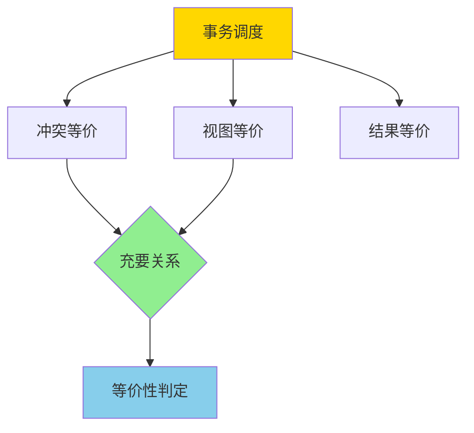
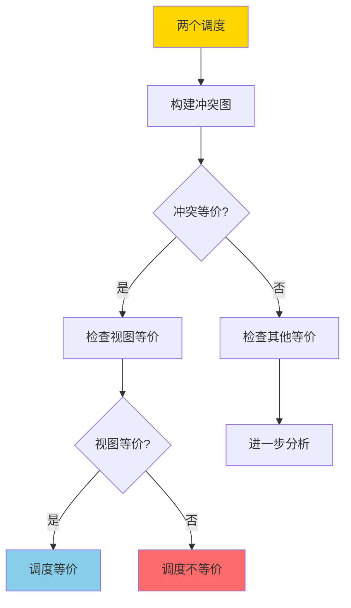

# 调度等价-冲突与视图等价的充要关系

> **文档版本**: v1.0
> **最后更新**: 2025-01-16
> **版本覆盖**: PostgreSQL 18.x (推荐) ⭐ | 17.x (推荐) | 16.x (兼容)
> **文档状态**: 🟡 框架已创建，内容待完善

---

## 📋 目录

- [调度等价-冲突与视图等价的充要关系](#调度等价-冲突与视图等价的充要关系)
  - [📋 目录](#-目录)
  - [1. 概述](#1-概述)
    - [1.0 调度等价工作原理概述](#10-调度等价工作原理概述)
    - [1.1 本文档的范围](#11-本文档的范围)
  - [2. 核心内容](#2-核心内容)
    - [2.1 冲突等价](#21-冲突等价)
    - [2.2 视图等价](#22-视图等价)
    - [2.3 充要关系](#23-充要关系)
  - [3. 形式化定义](#3-形式化定义)
    - [3.1 冲突等价形式化](#31-冲突等价形式化)
    - [3.2 视图等价形式化](#32-视图等价形式化)
    - [3.3 充要关系形式化](#33-充要关系形式化)
  - [4. 定理与证明](#4-定理与证明)
    - [4.1 冲突等价 ⟹ 视图等价](#41-冲突等价--视图等价)
    - [4.2 视图等价 ⟹ 冲突等价（只读/只写事务）](#42-视图等价--冲突等价只读只写事务)
    - [4.3 一般情况下的关系](#43-一般情况下的关系)
  - [5. 实际应用](#5-实际应用)
    - [5.1 查询优化中的应用](#51-查询优化中的应用)
    - [5.2 并发控制中的应用](#52-并发控制中的应用)
    - [5.3 PostgreSQL中的应用](#53-postgresql中的应用)
  - [6. 相关文档](#6-相关文档)
    - [6.1 理论基础文档](#61-理论基础文档)
  - [7. 参考文献](#7-参考文献)
    - [7.1 核心理论文献](#71-核心理论文献)
    - [7.2 相关文档](#72-相关文档)

---

## 1. 概述

### 1.0 调度等价工作原理概述

**调度等价性**：

事务调度的等价性是并发控制理论的核心概念。两个调度如果产生相同的结果，则它们是等价的。本文档严格证明冲突等价和视图等价的充要关系。

**调度等价分类**：



**等价性判定流程**：



### 1.1 本文档的范围

本文档涵盖：

- **冲突等价**：基于冲突操作交换的等价性定义
- **视图等价**：基于读写视图的等价性定义
- **充要关系**：严格证明冲突等价和视图等价的充要关系
- **实际应用**：等价性判定在查询优化中的应用

---

## 2. 核心内容

### 2.1 冲突等价

**冲突操作**：

两个操作冲突，当且仅当它们：

1. 操作不同的数据项，或
2. 至少有一个是写操作，且操作相同的数据项

```haskell
-- 冲突操作
conflict :: Operation -> Operation -> Bool
conflict op1 op2 =
    (dataItem op1 == dataItem op2) &&
    (isWrite op1 || isWrite op2)
```

**冲突等价**：

两个调度冲突等价，当且仅当它们可以通过交换非冲突操作而相互转换。

```haskell
-- 冲突等价
conflictEquivalent :: Schedule -> Schedule -> Bool
conflictEquivalent s1 s2 =
    -- 可以通过交换非冲突操作从s1得到s2
    canTransformBySwapping s1 s2
```

### 2.2 视图等价

**读写视图**：

事务的读写视图包括：

- 读视图：事务读取的所有值
- 写视图：事务写入的所有值

```haskell
-- 视图
data View = View {
    readView :: Map Transaction [Value],
    writeView :: Map Transaction [Value],
    finalState :: Map DataItem Value
}
```

**视图等价**：

两个调度视图等价，当且仅当它们产生相同的视图。

```haskell
-- 视图等价
viewEquivalent :: Schedule -> Schedule -> Bool
viewEquivalent s1 s2 =
    view s1 == view s2
```

### 2.3 充要关系

**定理**：对于只读和只写事务，冲突等价 ⟺ 视图等价。

---

## 3. 形式化定义

### 3.1 冲突等价形式化

**冲突关系**：

```haskell
-- 冲突关系
conflict(op1, op2) iff
    dataItem(op1) = dataItem(op2) ∧
    (isWrite(op1) ∨ isWrite(op2))
```

**冲突等价**：

```haskell
-- 冲突等价
S1 ≈_c S2 iff
    exists permutation π such that:
      S2 = π(S1) and
      forall adjacent operations op_i, op_j in S1:
        if not conflict(op_i, op_j) then
          π preserves relative order of op_i, op_j
```

### 3.2 视图等价形式化

**视图函数**：

```haskell
-- 视图函数
view(S) = {
    read_view(T) = {value | T reads value in S},
    write_view(T) = {value | T writes value in S},
    final_state(x) = last write to x in S
}
```

**视图等价**：

```haskell
-- 视图等价
S1 ≈_v S2 iff view(S1) = view(S2)
```

### 3.3 充要关系形式化

**充要关系定理**：

```haskell
-- 对于只读和只写事务
S1 ≈_c S2 ⟺ S1 ≈_v S2
```

---

## 4. 定理与证明

### 4.1 冲突等价 ⟹ 视图等价

**定理**：如果两个调度冲突等价，则它们视图等价。

**证明**：

1. 假设 S1 ≈_c S2
2. 冲突等价保证冲突操作的相对顺序不变
3. 读操作的值由最后写入该数据项的操作决定
4. 因此读视图相同
5. 写操作的顺序在冲突等价下保持不变
6. 因此写视图和最终状态相同
7. 因此 S1 ≈_v S2

### 4.2 视图等价 ⟹ 冲突等价（只读/只写事务）

**定理**：对于只读和只写事务，如果两个调度视图等价，则它们冲突等价。

**证明**：

1. 假设 S1 ≈_v S2，且所有事务都是只读或只写
2. 视图等价保证读视图和写视图相同
3. 对于只读事务，读视图唯一确定读取顺序
4. 对于只写事务，写视图唯一确定写入顺序
5. 因此冲突操作的顺序必须相同
6. 非冲突操作可以交换而不影响视图
7. 因此 S1 ≈_c S2

### 4.3 一般情况下的关系

**定理**：对于包含读写混合事务的调度，冲突等价 ⟹ 视图等价，但反之不成立。

**反例**：

- 存在视图等价但非冲突等价的调度
- 这是因为读写混合事务的灵活性

---

## 5. 实际应用

### 5.1 查询优化中的应用

**调度等价用于查询优化**：

```sql
-- 原始查询
SELECT * FROM orders o
JOIN customers c ON o.customer_id = c.id
WHERE o.total > 1000;

-- 等价调度（通过交换非冲突操作）
-- 可以先过滤orders，再连接customers
SELECT * FROM (
    SELECT * FROM orders WHERE total > 1000
) o
JOIN customers c ON o.customer_id = c.id;
```

### 5.2 并发控制中的应用

**冲突等价用于可串行化检测**：

```haskell
-- 可串行化检测
isSerializable :: Schedule -> Bool
isSerializable s =
    exists serial schedule s' such that:
      s ≈_c s'
```

### 5.3 PostgreSQL中的应用

**查询计划优化**：

PostgreSQL查询优化器使用等价性来重写查询：

```sql
-- 查询优化器会寻找等价的查询计划
EXPLAIN (ANALYZE, BUFFERS)
SELECT * FROM orders o
JOIN customers c ON o.customer_id = c.id
WHERE o.total > 1000;

-- 优化器可能选择不同的连接顺序
-- 只要结果等价（视图等价），都是有效的优化
```

---

## 6. 相关文档

### 6.1 理论基础文档

- [形式语言与证明：总论](./1.1.25-形式语言与证明-总论.md)
- [理论基础导航](./README.md)

---

## 7. 参考文献

### 7.1 核心理论文献

- **Papadimitriou, C. H. (1979). "The Serializability of Concurrent Database Updates."**
  - 会议: JACM 1979
  - **重要性**: 调度等价性的经典论文
  - **核心贡献**: 提出了冲突等价和视图等价的概念

- **Bernstein, P. A., & Newcomer, E. (2009). "Principles of Transaction Processing."**
  - 出版社: Morgan Kaufmann
  - **重要性**: 事务处理的经典教材
  - **核心贡献**: 系统阐述了调度等价性理论

### 7.2 相关文档

- [两阶段加锁-可串行化的严格证明](./03.09-两阶段加锁-可串行化的严格证明.md)
- [事务隔离与MVCC-统一形式模型与完备性证明](./03.03-事务隔离与MVCC-统一形式模型与完备性证明.md)
- [理论基础导航](../README.md)

---

**最后更新**: 2025-01-16
**维护者**: Documentation Team
**状态**: 🟡 框架已创建，内容待完善
