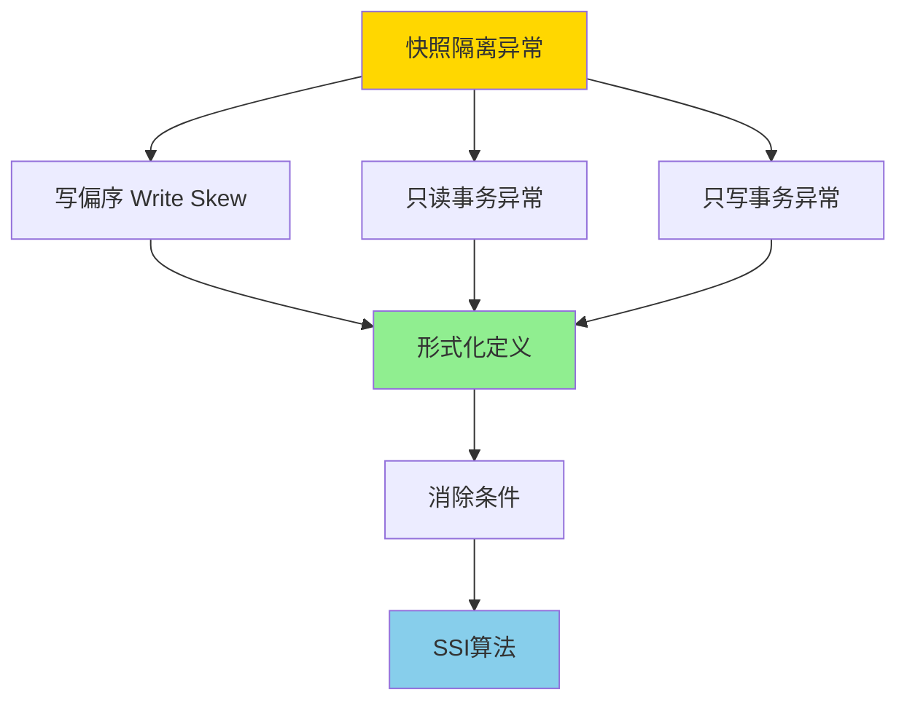
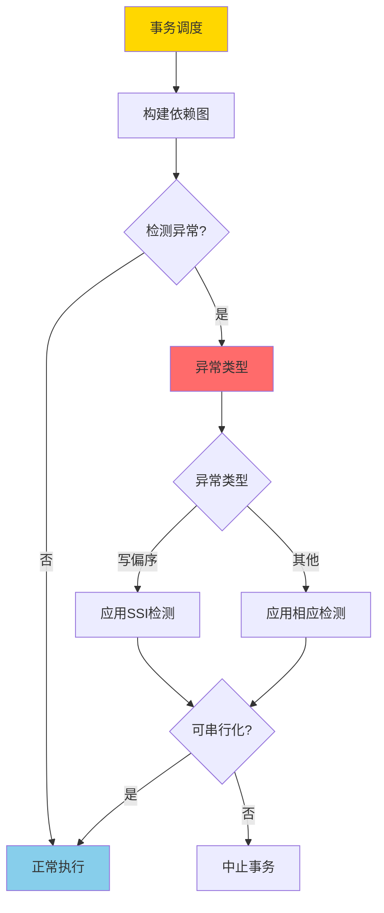

# 快照隔离异常谱系-形式分类与必要条件

> **文档版本**: v1.0
> **最后更新**: 2025-01-16
> **版本覆盖**: PostgreSQL 18.x (推荐) ⭐ | 17.x (推荐) | 16.x (兼容)
> **文档状态**: 🟡 框架已创建，内容待完善

---

## 📋 目录

- [快照隔离异常谱系-形式分类与必要条件](#快照隔离异常谱系-形式分类与必要条件)
  - [📋 目录](#-目录)
  - [1. 概述](#1-概述)
    - [1.0 快照隔离异常谱系工作原理概述](#10-快照隔离异常谱系工作原理概述)
    - [1.1 本文档的范围](#11-本文档的范围)
  - [2. 核心内容](#2-核心内容)
    - [2.1 写偏序（Write Skew）异常](#21-写偏序write-skew异常)
    - [2.2 异常分类](#22-异常分类)
    - [2.3 SSI检测机制](#23-ssi检测机制)
  - [3. 形式化定义](#3-形式化定义)
    - [3.1 写偏序形式化](#31-写偏序形式化)
    - [3.2 异常分类形式化](#32-异常分类形式化)
    - [3.3 SSI形式化](#33-ssi形式化)
  - [4. 定理与证明](#4-定理与证明)
    - [4.1 写偏序消除定理](#41-写偏序消除定理)
    - [4.2 SSI可串行化定理](#42-ssi可串行化定理)
  - [5. 实际应用](#5-实际应用)
    - [5.1 PostgreSQL SSI实现](#51-postgresql-ssi实现)
    - [5.2 SSI性能优化](#52-ssi性能优化)
    - [5.3 应用场景](#53-应用场景)
  - [6. 相关文档](#6-相关文档)
    - [6.1 理论基础文档](#61-理论基础文档)
  - [7. 参考文献](#7-参考文献)
    - [7.1 核心理论文献](#71-核心理论文献)
    - [7.2 相关文档](#72-相关文档)

---

## 1. 概述

### 1.0 快照隔离异常谱系工作原理概述

**快照隔离异常**：

快照隔离（Snapshot Isolation, SI）虽然提供了良好的性能，但存在一些异常情况，这些异常可能导致数据不一致。本文档对这些异常进行形式化分类，并给出消除这些异常的必要条件。

**异常分类体系**：



**异常检测流程**：



### 1.1 本文档的范围

本文档涵盖：

- **异常分类**：快照隔离异常的形式化分类
- **必要条件**：消除异常的必要条件
- **形式化定义**：异常的形式化定义和检测方法
- **实际应用**：异常检测在PostgreSQL SSI中的应用

---

## 2. 核心内容

### 2.1 写偏序（Write Skew）异常

**写偏序定义**：

写偏序是快照隔离中最常见的异常，发生在两个事务基于相同的快照读取数据，然后各自写入不同的数据项，导致最终状态不一致。

**写偏序示例**：

```haskell
-- 写偏序场景
-- 初始状态: x = 10, y = 10, 约束: x + y ≥ 20

-- 事务T1
T1: read(x) = 10
T1: write(x = 5)  -- 假设 x + y = 15 ≥ 20 仍然满足

-- 事务T2 (并发执行)
T2: read(y) = 10
T2: write(y = 5)  -- 假设 x + y = 15 ≥ 20 仍然满足

-- 最终状态: x = 5, y = 5, x + y = 10 < 20 (违反约束!)
```

### 2.2 异常分类

**异常类型**：

1. **写偏序（Write Skew）**：两个事务基于相同快照写入不同数据项
2. **只读事务异常**：只读事务可能看到不一致的快照
3. **只写事务异常**：只写事务可能产生不可串行化的调度

### 2.3 SSI检测机制

**SSI（Serializable Snapshot Isolation）**：

SSI通过检测读写依赖和写写依赖来消除写偏序异常。

```haskell
-- SSI依赖检测
data Dependency =
    RWConflict Transaction Transaction  -- 读写冲突
  | WWConflict Transaction Transaction   -- 写写冲突

-- SSI检测算法
detectSSI :: [Transaction] -> [Dependency] -> Bool
detectSSI transactions deps =
    -- 检测是否存在危险结构（dangerous structure）
    hasDangerousStructure (buildDependencyGraph deps)
```

---

## 3. 形式化定义

### 3.1 写偏序形式化

**写偏序定义**：

```haskell
-- 事务调度
type Schedule = [Operation]

-- 写偏序条件
writeSkew :: Schedule -> Bool
writeSkew s =
    exists T1, T2, x, y such that:
      T1 reads x, T1 writes x
      T2 reads y, T2 writes y
      T1 and T2 start with same snapshot
      x ≠ y
      final state violates constraint
```

### 3.2 异常分类形式化

**异常类型定义**：

```haskell
-- 异常类型
data IsolationAnomaly =
    WriteSkew Transaction Transaction
  | ReadOnlyAnomaly Transaction
  | WriteOnlyAnomaly Transaction

-- 异常检测
detectAnomaly :: Schedule -> [IsolationAnomaly]
detectAnomaly s =
    [WriteSkew t1 t2 | writeSkewDetected t1 t2 s] ++
    [ReadOnlyAnomaly t | readOnlyAnomalyDetected t s] ++
    [WriteOnlyAnomaly t | writeOnlyAnomalyDetected t s]
```

### 3.3 SSI形式化

**SSI条件**：

```haskell
-- SSI可串行化条件
ssiSerializable :: Schedule -> Bool
ssiSerializable s =
    -- 不存在危险结构
    not (hasDangerousStructure (dependencyGraph s))

-- 危险结构
dangerousStructure :: DependencyGraph -> Bool
dangerousStructure g =
    exists path: T1 -rw-> T2 -rw-> T3 such that:
      T1.start < T2.start < T3.start
      T1 commits before T2 starts
      T2 commits before T3 starts
```

---

## 4. 定理与证明

### 4.1 写偏序消除定理

**定理**：如果调度满足SSI条件，则不存在写偏序异常。

**证明思路**：

1. 假设存在写偏序异常
2. 构造依赖图，证明存在危险结构
3. 根据SSI条件，危险结构会导致事务中止
4. 矛盾，因此不存在写偏序异常

### 4.2 SSI可串行化定理

**定理**：SSI保证可串行化执行。

**证明**：

- SSI通过检测危险结构来防止不可串行化的调度
- 所有通过SSI检测的调度都是可串行化的

---

## 5. 实际应用

### 5.1 PostgreSQL SSI实现

**SSI配置**：

```sql
-- 启用SSI
SET default_transaction_isolation = 'serializable';

-- 检查SSI状态
SELECT name, setting
FROM pg_settings
WHERE name LIKE '%serializable%';
```

**SSI检测示例**：

```sql
-- 写偏序场景示例
-- 会话1
BEGIN ISOLATION LEVEL SERIALIZABLE;
SELECT balance FROM accounts WHERE id = 1;  -- 读取 x
-- ... 计算 ...
UPDATE accounts SET balance = balance - 100 WHERE id = 1;  -- 写入 x
COMMIT;

-- 会话2 (并发)
BEGIN ISOLATION LEVEL SERIALIZABLE;
SELECT balance FROM accounts WHERE id = 2;  -- 读取 y
-- ... 计算 ...
UPDATE accounts SET balance = balance - 100 WHERE id = 2;  -- 写入 y
COMMIT;

-- 如果检测到写偏序，其中一个事务会被中止
```

### 5.2 SSI性能优化

**SSI监控**：

```sql
-- 查看SSI冲突统计
SELECT
    datname,
    xact_serializable,
    conflicts_serializable,
    deadlocks
FROM pg_stat_database
WHERE datname = current_database();

-- 查看SSI中止的事务
SELECT
    pid,
    usename,
    application_name,
    state,
    query
FROM pg_stat_activity
WHERE state = 'idle in transaction (aborted)';
```

### 5.3 应用场景

**适用场景**：

- 需要严格一致性保证的应用
- 金融交易系统
- 库存管理系统

**注意事项**：

- SSI可能导致更多的事务中止
- 需要应用层处理重试逻辑
- 监控冲突率，必要时调整隔离级别

---

## 6. 相关文档

### 6.1 理论基础文档

- [形式语言与证明：总论](./1.1.25-形式语言与证明-总论.md)
- [理论基础导航](./README.md)

---

## 7. 参考文献

### 7.1 核心理论文献

- **Berenson, H., et al. (1995). "A Critique of ANSI SQL Isolation Levels."**
  - 会议: SIGMOD 1995
  - **重要性**: 隔离级别异常分析的经典论文
  - **核心贡献**: 提出了隔离级别异常的形式化分类

- **Fekete, A., et al. (2005). "Making Snapshot Isolation Serializable."**
  - 会议: TODS 2005
  - **重要性**: 快照隔离异常消除的基础研究
  - **核心贡献**: 提出了SSI算法消除写偏序异常

- **Cahill, M. J., et al. (2008). "Serializable Isolation for Snapshot Databases."**
  - 会议: SIGMOD 2008
  - **重要性**: SSI算法的完整实现
  - **核心贡献**: 提供了SSI的完整形式化证明

### 7.2 相关文档

- [事务隔离与MVCC-统一形式模型与完备性证明](./03.03-事务隔离与MVCC-统一形式模型与完备性证明.md)
- [MVCC高级分析与形式证明](./03.01-MVCC高级分析与形式证明.md)
- [调度等价-冲突与视图等价的充要关系](./03.05-调度等价-冲突与视图等价的充要关系.md)
- [理论基础导航](../README.md)

---

**最后更新**: 2025-01-16
**维护者**: Documentation Team
**状态**: 🟡 框架已创建，内容待完善
