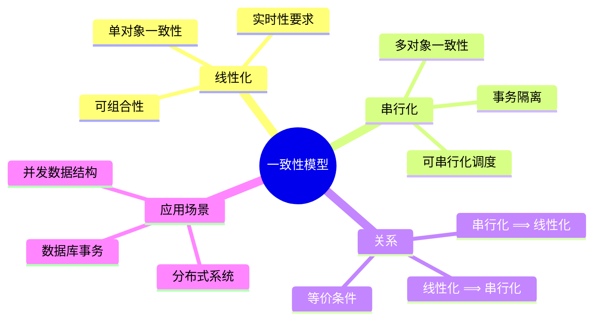
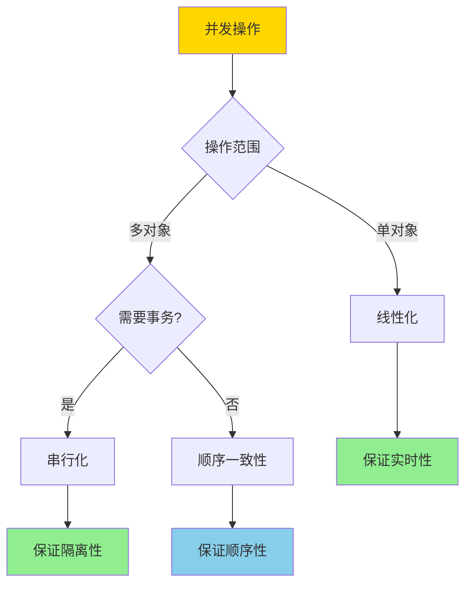
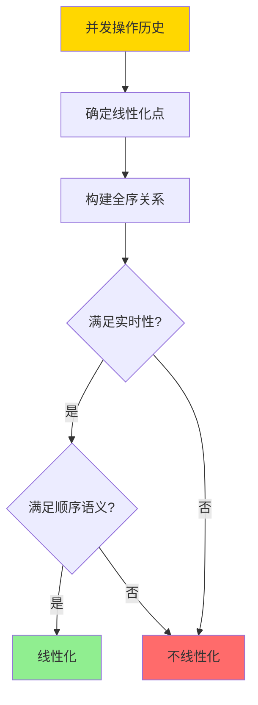
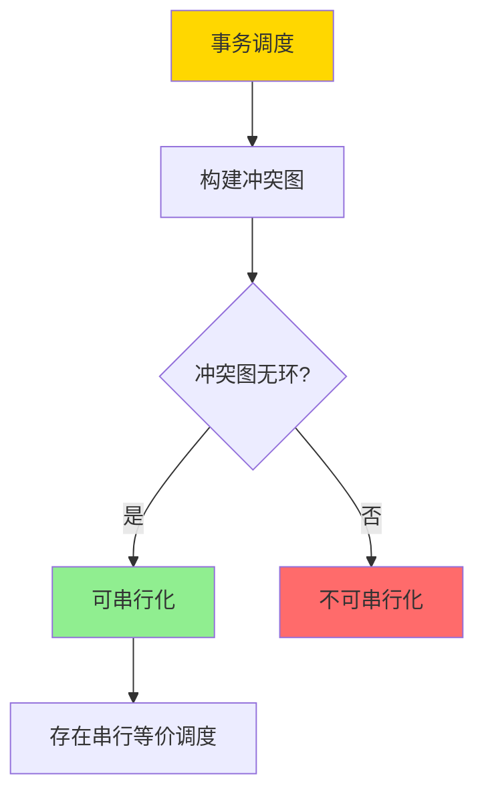
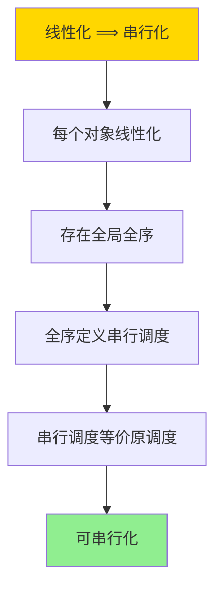

# 线性化与串行化-对象与事务一致性的形式关系

> **文档版本**: v1.0
> **最后更新**: 2025-01-16
> **版本覆盖**: PostgreSQL 18.x (推荐) ⭐ | 17.x (推荐) | 16.x (兼容)
> **文档状态**: 🟡 框架已创建，内容待完善

---

## 📋 目录

- [线性化与串行化-对象与事务一致性的形式关系](#线性化与串行化-对象与事务一致性的形式关系)
  - [📋 目录](#-目录)
  - [1. 概述](#1-概述)
    - [1.0 线性化与串行化工作原理概述](#10-线性化与串行化工作原理概述)
    - [1.1 本文档的范围](#11-本文档的范围)
  - [2. 核心内容](#2-核心内容)
    - [2.1 线性化](#21-线性化)
    - [2.2 串行化](#22-串行化)
    - [2.3 形式关系](#23-形式关系)
  - [3. 形式化定义](#3-形式化定义)
    - [3.1 线性化形式化](#31-线性化形式化)
    - [3.2 串行化形式化](#32-串行化形式化)
    - [3.3 关系形式化](#33-关系形式化)
  - [4. 定理与证明](#4-定理与证明)
    - [4.1 线性化蕴含串行化定理](#41-线性化蕴含串行化定理)
    - [4.2 串行化不蕴含线性化定理](#42-串行化不蕴含线性化定理)
  - [5. 实际应用](#5-实际应用)
    - [5.1 PostgreSQL事务隔离](#51-postgresql事务隔离)
    - [5.2 并发数据结构](#52-并发数据结构)
    - [5.3 分布式系统](#53-分布式系统)
  - [6. 相关文档](#6-相关文档)
    - [6.1 理论基础文档](#61-理论基础文档)
  - [7. 参考文献](#7-参考文献)
    - [7.1 核心理论文献](#71-核心理论文献)
    - [7.2 一致性模型相关](#72-一致性模型相关)
    - [7.3 PostgreSQL实现相关](#73-postgresql实现相关)
    - [7.4 相关文档](#74-相关文档)

---

## 1. 概述

### 1.0 线性化与串行化工作原理概述

**一致性模型**：

线性化（Linearizability）和串行化（Serializability）是两种重要的并发一致性模型。线性化适用于单个对象的操作，串行化适用于事务的多个操作。本文档形式化分析两者的关系。

**一致性模型体系思维导图**：



**一致性模型选择决策树**：



**一致性模型对比矩阵**：

| 模型 | 范围 | 实时性 | 可组合性 | 复杂度 | 适用场景 |
|------|------|--------|---------|--------|---------|
| **线性化** | 单对象 | 是 | 是 | 高 | 寄存器、队列 |
| **串行化** | 多对象 | 否 | 否 | 中 | 数据库事务 |
| **顺序一致性** | 多对象 | 否 | 是 | 中 | 共享内存 |
| **因果一致性** | 多对象 | 否 | 是 | 低 | 分布式系统 |

### 1.1 本文档的范围

本文档涵盖：

- **线性化**：单对象操作的一致性模型
- **串行化**：多对象事务的一致性模型
- **形式关系**：线性化与串行化的形式化关系
- **实际应用**：PostgreSQL事务隔离级别的实现

---

## 2. 核心内容

### 2.1 线性化

**线性化定义**：

```haskell
-- 操作历史
data Operation = Operation {
    opType :: OpType,  -- Read or Write
    object :: Object,
    value :: Value,
    startTime :: Time,
    endTime :: Time
}

-- 线性化点
linearizationPoint :: Operation -> Time
linearizationPoint op =
    case op.opType of
        Read -> op.endTime
        Write -> op.startTime

-- 线性化判定
linearizable :: [Operation] -> Bool
linearizable ops =
    exists totalOrder < such that:
      forall op1, op2:
        if op1.endTime < op2.startTime then op1 < op2
      and
      forall op: result(op) = result of sequential execution at linearizationPoint(op)
```

**线性化执行流程**：



### 2.2 串行化

**串行化定义**：

```haskell
-- 事务
data Transaction = Transaction {
    operations :: [Operation],
    commitTime :: Time
}

-- 串行化调度
serializable :: [Transaction] -> Bool
serializable txs =
    exists serialSchedule such that:
      forall tx: result(tx) = result of tx in serialSchedule
      and
      conflictOrder is preserved
```

**串行化判定流程**：



### 2.3 形式关系

**线性化与串行化的关系**：

```haskell
-- 定理：线性化 ⟹ 串行化
linearizableImpliesSerializable :: [Operation] -> Bool
linearizableImpliesSerializable ops =
    if linearizable(ops) then
        -- 线性化保证每个对象上的操作顺序一致
        -- 因此整个事务调度可串行化
        serializable(groupByTransaction(ops))
    else
        False
```

---

## 3. 形式化定义

### 3.1 线性化形式化

**线性化**：

```haskell
-- 线性化历史
H is linearizable iff
    exists sequential history S such that:
      S is equivalent to H
      and
      forall op1, op2: if op1 completes before op2 starts then op1 <_S op2
```

### 3.2 串行化形式化

**串行化**：

```haskell
-- 串行化调度
Schedule S is serializable iff
    exists serial schedule S' such that:
      S ≡_conflict S'
```

### 3.3 关系形式化

**线性化 ⟹ 串行化**：

```haskell
-- 如果所有对象的操作都线性化，则事务调度可串行化
if forall obj: linearizable(operations(obj)) then
    serializable(transactions)
```

---

## 4. 定理与证明

### 4.1 线性化蕴含串行化定理

**定理**：如果所有对象的操作都线性化，则事务调度可串行化。

**证明树**：



**证明**：

1. 如果所有对象的操作都线性化，则存在全局全序关系
2. 全序关系定义了串行调度
3. 串行调度与原调度冲突等价
4. 因此调度可串行化

### 4.2 串行化不蕴含线性化定理

**定理**：串行化不蕴含线性化。

**证明**：

1. 串行化只要求冲突等价，不要求实时性
2. 线性化要求实时性（操作完成的顺序）
3. 因此串行化调度可能不满足线性化

---

## 5. 实际应用

### 5.1 PostgreSQL事务隔离

**隔离级别与一致性**：

```sql
-- READ COMMITTED（不保证串行化）
SET TRANSACTION ISOLATION LEVEL READ COMMITTED;
BEGIN;
SELECT * FROM accounts WHERE id = 1;  -- 可能看到中间状态
COMMIT;

-- SERIALIZABLE（保证串行化）
SET TRANSACTION ISOLATION LEVEL SERIALIZABLE;
BEGIN;
SELECT * FROM accounts WHERE id = 1;  -- 保证串行化视图
COMMIT;
```

### 5.2 并发数据结构

**线性化实现**：

```haskell
-- 线性化寄存器
data LinearizableRegister a = LinearizableRegister {
    value :: IORef a,
    lock :: MVar ()
}

-- 线性化写操作
write :: LinearizableRegister a -> a -> IO ()
write reg newVal =
    withMVar reg.lock $ \_ -> do
        writeIORef reg.value newVal
        -- 线性化点在锁获取时
```

### 5.3 分布式系统

**线性化与共识**：

```haskell
-- 共识算法保证线性化
consensus :: [Node] -> Value -> IO Value
consensus nodes value =
    -- 使用Raft或Paxos保证线性化
    let leader = electLeader(nodes)
    in replicateValue(leader, value, nodes)
```

---

## 6. 相关文档

### 6.1 理论基础文档

- [事务隔离与MVCC-统一形式模型与完备性证明](./03.03-事务隔离与MVCC-统一形式模型与完备性证明.md)
- [调度等价-冲突与视图等价的充要关系](./03.05-调度等价-冲突与视图等价的充要关系.md)
- [理论基础导航](../README.md)

---

## 7. 参考文献

### 7.1 核心理论文献

- **Herlihy, M. P., & Wing, J. M. (1990). "Linearizability: A Correctness Condition for Concurrent Objects."**
  - 期刊: ACM Transactions on Programming Languages and Systems 1990
  - **重要性**: 线性化的经典定义
  - **核心贡献**: 提出了线性化的形式化定义
  - **批判性分析**: 线性化要求实时性，在某些场景下可能过于严格，导致性能问题

- **Papadimitriou, C. H. (1979). "The Serializability of Concurrent Database Updates."**
  - 期刊: Journal of the ACM 1979
  - **重要性**: 串行化的经典理论
  - **核心贡献**: 提供了串行化的判定方法
  - **批判性分析**: 串行化判定是NP完全的，实际系统中需要启发式方法

### 7.2 一致性模型相关

- **Lamport, L. (1979). "How to Make a Multiprocessor Computer That Correctly Executes Multiprocess Programs."**
  - 期刊: IEEE Transactions on Computers 1979
  - **重要性**: 顺序一致性的经典定义
  - **核心贡献**: 提出了顺序一致性模型
  - **批判性分析**: 顺序一致性比线性化弱，但实现更简单

### 7.3 PostgreSQL实现相关

- **[PostgreSQL官方文档 - 事务隔离](<https://www.postgresql.org/docs/current/transaction-iso.html>)**
  - PostgreSQL事务隔离级别实现说明

### 7.4 相关文档

- [事务隔离与MVCC-统一形式模型与完备性证明](./03.03-事务隔离与MVCC-统一形式模型与完备性证明.md)
- [调度等价-冲突与视图等价的充要关系](./03.05-调度等价-冲突与视图等价的充要关系.md)
- [理论基础导航](../README.md)

---

**最后更新**: 2025-01-16
**维护者**: Documentation Team
**状态**: 🟡 框架已创建，内容待完善
