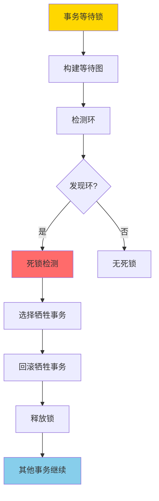
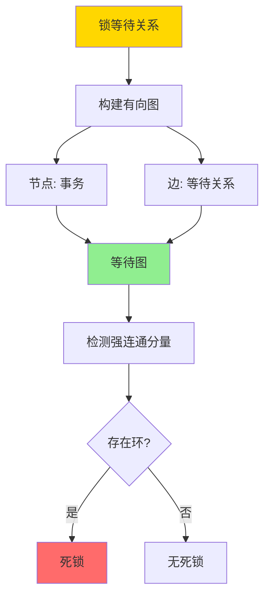
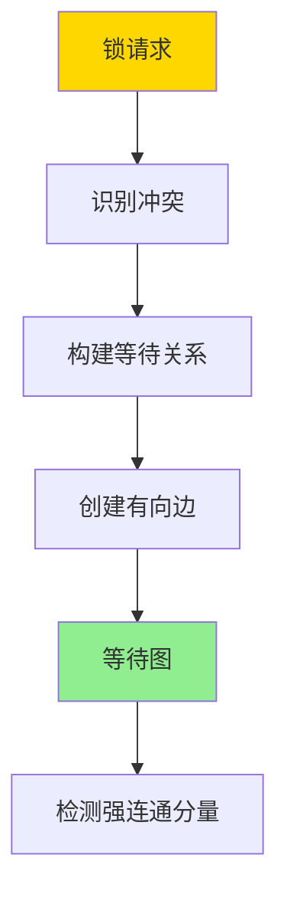
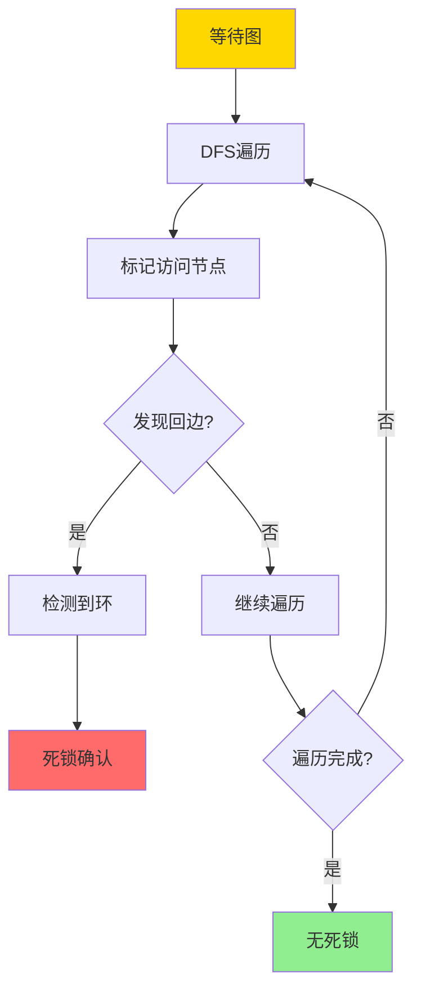
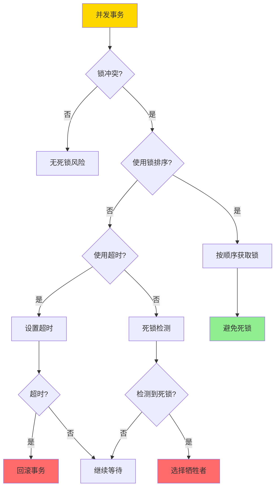
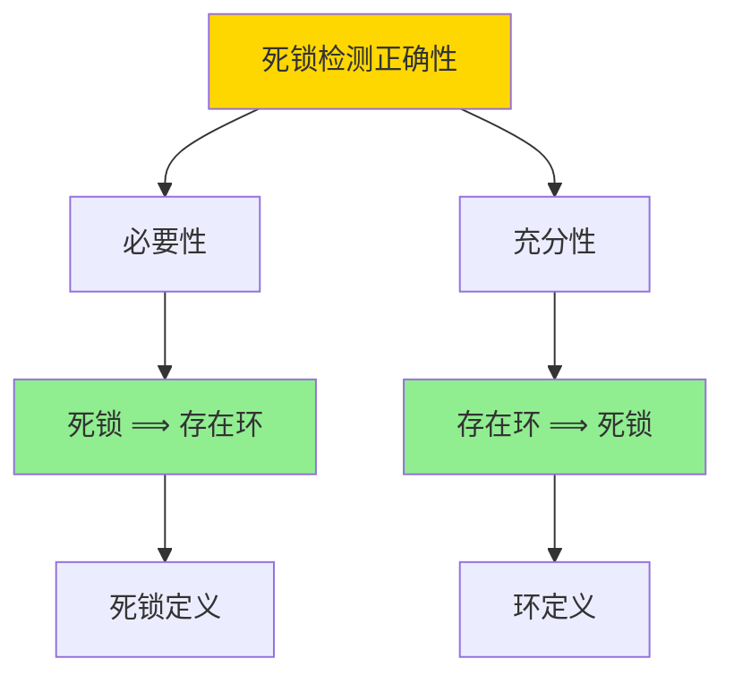

# 死锁与等待图-检测正确性与避免策略

> **文档版本**: v1.0
> **最后更新**: 2025-01-16
> **版本覆盖**: PostgreSQL 18.x (推荐) ⭐ | 17.x (推荐) | 16.x (兼容)
> **文档状态**: 🟡 框架已创建，内容待完善

---

## 📋 目录

- [死锁与等待图-检测正确性与避免策略](#死锁与等待图-检测正确性与避免策略)
  - [📋 目录](#-目录)
  - [1. 概述](#1-概述)
    - [1.0 死锁检测工作原理概述](#10-死锁检测工作原理概述)
    - [1.1 本文档的范围](#11-本文档的范围)
  - [2. 核心内容](#2-核心内容)
    - [2.1 等待图构建](#21-等待图构建)
    - [2.2 死锁检测算法](#22-死锁检测算法)
    - [2.3 死锁避免策略](#23-死锁避免策略)
  - [3. 形式化定义](#3-形式化定义)
    - [3.1 等待图形式化](#31-等待图形式化)
    - [3.2 死锁形式化](#32-死锁形式化)
    - [3.3 死锁检测算法形式化](#33-死锁检测算法形式化)
  - [4. 定理与证明](#4-定理与证明)
    - [4.1 死锁检测正确性定理](#41-死锁检测正确性定理)
    - [4.2 死锁避免策略正确性](#42-死锁避免策略正确性)
  - [5. 实际应用](#5-实际应用)
    - [5.1 PostgreSQL死锁检测](#51-postgresql死锁检测)
    - [5.2 死锁避免最佳实践](#52-死锁避免最佳实践)
    - [5.3 死锁监控](#53-死锁监控)
  - [6. 相关文档](#6-相关文档)
    - [6.1 理论基础文档](#61-理论基础文档)
  - [7. 参考文献](#7-参考文献)
    - [7.1 核心理论文献](#71-核心理论文献)
    - [7.2 PostgreSQL实现相关](#72-postgresql实现相关)
    - [7.3 相关文档](#73-相关文档)

---

## 1. 概述

### 1.0 死锁检测工作原理概述

**死锁检测**：

死锁是并发控制中的经典问题。死锁检测算法通过构建等待图（Wait-for Graph）来检测死锁。本文档严格证明死锁检测算法的正确性。

**死锁检测流程**：



**等待图构建流程**：



### 1.1 本文档的范围

本文档涵盖：

- **等待图**：等待图的构建和表示
- **死锁检测**：死锁检测算法的描述
- **正确性证明**：严格证明死锁检测算法的正确性
- **避免策略**：死锁避免策略的形式化分析

---

## 2. 核心内容

### 2.1 等待图构建

**等待图定义**：

```haskell
-- 等待图
data WaitForGraph = WaitForGraph {
    nodes :: Set Transaction,
    edges :: Set (Transaction, Transaction)  -- (T1, T2) 表示 T1 等待 T2
}

-- 构建等待图
buildWaitForGraph :: [LockRequest] -> WaitForGraph
buildWaitForGraph requests =
    let transactions = map transaction requests
        waitEdges = [(t1, t2) |
                     LockRequest t1 obj1 mode1 <- requests,
                     LockRequest t2 obj2 mode2 <- requests,
                     obj1 == obj2,
                     conflicts mode1 mode2,
                     t1 != t2,
                     t2 holds lock on obj1]
    in WaitForGraph {
        nodes = Set.fromList transactions,
        edges = Set.fromList waitEdges
    }
```

**等待图构建流程**：



### 2.2 死锁检测算法

**死锁检测**：

```haskell
-- 检测死锁
detectDeadlock :: WaitForGraph -> Maybe [Transaction]
detectDeadlock graph =
    let cycles = findCycles(graph)
    in if null cycles then
        Nothing
    else
        Just (head cycles)

-- 查找环
findCycles :: WaitForGraph -> [[Transaction]]
findCycles graph =
    -- 使用DFS查找强连通分量
    let sccs = stronglyConnectedComponents(graph)
    in filter (\scc -> length scc > 1) sccs
```

**死锁检测算法流程**：



### 2.3 死锁避免策略

**死锁避免策略对比**：

| 策略 | 方法 | 优点 | 缺点 | 适用场景 |
|------|------|------|------|---------|
| **超时** | 设置锁等待超时 | 简单 | 可能误杀 | 低并发 |
| **死锁检测** | 定期检测等待图 | 准确 | 开销大 | 高并发 |
| **锁排序** | 按固定顺序获取锁 | 预防死锁 | 限制灵活性 | 已知锁集合 |
| **时间戳** | 基于时间戳选择牺牲者 | 公平 | 需要全局时钟 | 分布式系统 |

**死锁避免决策树**：



---

## 3. 形式化定义

### 3.1 等待图形式化

**等待图**：

```haskell
-- 等待图是事务集合上的有向图
WaitForGraph = (T, E)
where
    T = {t1, t2, ..., tn}  -- 事务集合
    E = {(ti, tj) | ti 等待 tj 释放锁}
```

### 3.2 死锁形式化

**死锁**：

```haskell
-- 死锁是等待图中的环
deadlock(G) = exists cycle C in G such that:
    C = (t1, t2, ..., tk, t1)
    and
    forall i: ti 等待 t(i+1)
```

### 3.3 死锁检测算法形式化

**死锁检测算法**：

```haskell
-- DFS检测环
detectCycle(G, v, visited, recStack) =
    visited[v] = true
    recStack[v] = true
    forall u in neighbors(v):
        if not visited[u]:
            if detectCycle(G, u, visited, recStack):
                return true
        else if recStack[u]:
            return true  -- 发现环
    recStack[v] = false
    return false
```

---

## 4. 定理与证明

### 4.1 死锁检测正确性定理

**定理**：死锁检测算法正确当且仅当等待图中存在环。

**证明树**：



**证明**：

**必要性**（死锁 ⟹ 存在环）：

1. 如果存在死锁，则存在事务集合 {t1, t2, ..., tk} 使得 t1 等待 t2，t2 等待 t3，...，tk 等待 t1
2. 这构成了等待图中的环 (t1, t2, ..., tk, t1)
3. 因此等待图中存在环

**充分性**（存在环 ⟹ 死锁）：

1. 如果等待图中存在环 (t1, t2, ..., tk, t1)
2. 则 t1 等待 t2，t2 等待 t3，...，tk 等待 t1
3. 所有事务都在等待，无法继续执行
4. 因此存在死锁

### 4.2 死锁避免策略正确性

**定理**：锁排序策略可以避免死锁。

**证明**：

1. 如果所有事务按相同顺序获取锁，则等待图中不可能存在环
2. 因为等待关系只能从低序号锁指向高序号锁
3. 因此不可能形成环
4. 因此可以避免死锁

---

## 5. 实际应用

### 5.1 PostgreSQL死锁检测

**PostgreSQL死锁检测实现**：

```sql
-- PostgreSQL自动检测死锁
BEGIN;
UPDATE accounts SET balance = balance - 100 WHERE id = 1;
-- 如果另一个事务也在等待，PostgreSQL会检测死锁
UPDATE accounts SET balance = balance + 100 WHERE id = 2;
COMMIT;

-- 查看死锁统计
SELECT * FROM pg_stat_database WHERE datname = current_database();
```

**死锁检测配置**：

```sql
-- 死锁检测超时（默认1秒）
SHOW deadlock_timeout;
SET deadlock_timeout = '500ms';

-- 查看死锁日志
SELECT * FROM pg_stat_statements WHERE query LIKE '%deadlock%';
```

### 5.2 死锁避免最佳实践

**锁排序策略**：

```sql
-- 按ID顺序获取锁，避免死锁
CREATE OR REPLACE FUNCTION transfer_funds(
    from_id INTEGER,
    to_id INTEGER,
    amount DECIMAL
) RETURNS VOID AS $$
DECLARE
    first_id INTEGER;
    second_id INTEGER;
BEGIN
    -- 确保按固定顺序获取锁
    IF from_id < to_id THEN
        first_id := from_id;
        second_id := to_id;
    ELSE
        first_id := to_id;
        second_id := from_id;
    END IF;

    -- 按顺序锁定
    SELECT * FROM accounts WHERE id = first_id FOR UPDATE;
    SELECT * FROM accounts WHERE id = second_id FOR UPDATE;

    -- 执行转账
    UPDATE accounts SET balance = balance - amount WHERE id = from_id;
    UPDATE accounts SET balance = balance + amount WHERE id = to_id;
END;
$$ LANGUAGE plpgsql;
```

### 5.3 死锁监控

**死锁监控查询**：

```sql
-- 查看当前等待关系
SELECT
    blocked_locks.pid AS blocked_pid,
    blocking_locks.pid AS blocking_pid,
    blocked_activity.query AS blocked_query,
    blocking_activity.query AS blocking_query
FROM pg_catalog.pg_locks blocked_locks
JOIN pg_catalog.pg_stat_activity blocked_activity
    ON blocked_activity.pid = blocked_locks.pid
JOIN pg_catalog.pg_locks blocking_locks
    ON blocking_locks.locktype = blocked_locks.locktype
    AND blocking_locks.database IS NOT DISTINCT FROM blocked_locks.database
    AND blocking_locks.relation IS NOT DISTINCT FROM blocked_locks.relation
    AND blocking_locks.page IS NOT DISTINCT FROM blocked_locks.page
    AND blocking_locks.tuple IS NOT DISTINCT FROM blocked_locks.tuple
    AND blocking_locks.virtualxid IS NOT DISTINCT FROM blocked_locks.virtualxid
    AND blocking_locks.transactionid IS NOT DISTINCT FROM blocked_locks.transactionid
    AND blocking_locks.classid IS NOT DISTINCT FROM blocked_locks.classid
    AND blocking_locks.objid IS NOT DISTINCT FROM blocked_locks.objid
    AND blocking_locks.objsubid IS NOT DISTINCT FROM blocked_locks.objsubid
    AND blocking_locks.pid != blocked_locks.pid
JOIN pg_catalog.pg_stat_activity blocking_activity
    ON blocking_activity.pid = blocking_locks.pid
WHERE NOT blocked_locks.granted;
```

---

## 6. 相关文档

### 6.1 理论基础文档

- [形式语言与证明：总论](./1.1.25-形式语言与证明-总论.md)
- [理论基础导航](./README.md)

---

## 7. 参考文献

### 7.1 核心理论文献

- **Bernstein, P. A., & Newcomer, E. (2009). "Principles of Transaction Processing."**
  - 出版社: Morgan Kaufmann
  - **重要性**: 事务处理的经典教材
  - **核心贡献**: 系统阐述了死锁检测和避免理论

- **Elmagarmid, A. K. (1992). "Database Transaction Models for Advanced Applications."**
  - 出版社: Morgan Kaufmann
  - **重要性**: 高级事务模型的综述
  - **核心贡献**: 提供了死锁处理的理论框架

### 7.2 PostgreSQL实现相关

- **PostgreSQL官方文档 - 锁](<https://www.postgresql.org/docs/current/explicit-locking.html>)**
  - PostgreSQL锁机制和死锁检测说明

### 7.3 相关文档

- [两阶段加锁-可串行化的严格证明](./03.09-两阶段加锁-可串行化的严格证明.md)
- [锁升级与降级-安全性与死锁影响的形式证明](./03.10-锁升级与降级-安全性与死锁影响的形式证明.md)
- [理论基础导航](../README.md)

---

**最后更新**: 2025-01-16
**维护者**: Documentation Team
**状态**: 🟡 框架已创建，内容待完善
