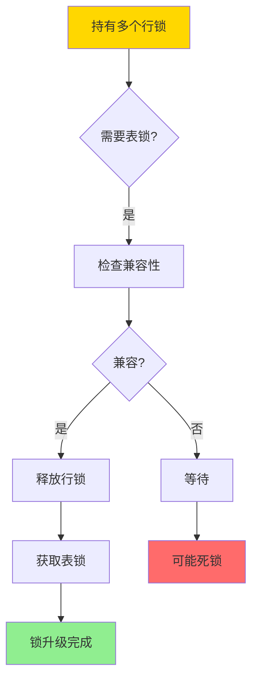
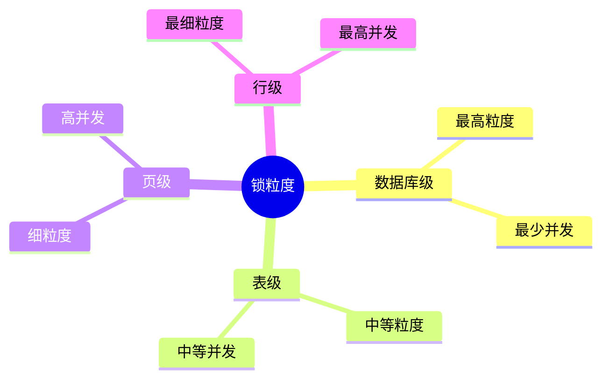
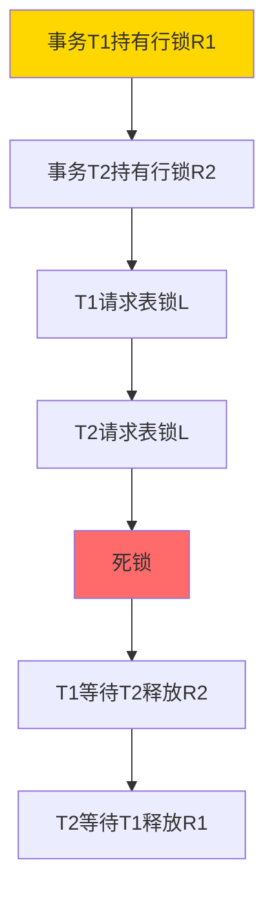
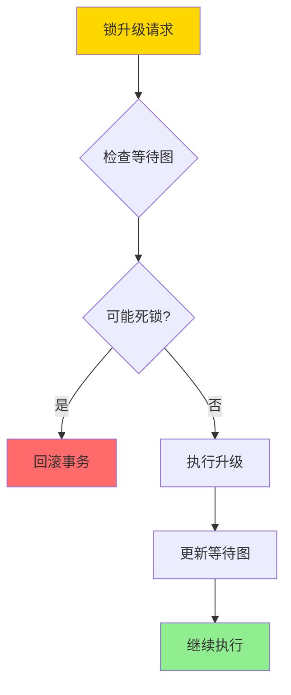
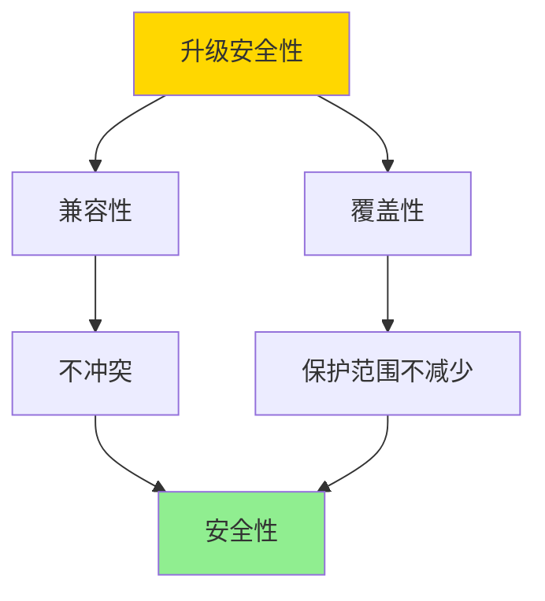

# 锁升级与降级-安全性与死锁影响的形式证明

> **文档版本**: v1.0
> **最后更新**: 2025-01-16
> **版本覆盖**: PostgreSQL 18.x (推荐) ⭐ | 17.x (推荐) | 16.x (兼容)
> **文档状态**: 🟡 框架已创建，内容待完善

---

## 📋 目录

- [锁升级与降级-安全性与死锁影响的形式证明](#锁升级与降级-安全性与死锁影响的形式证明)
  - [📋 目录](#-目录)
  - [1. 概述](#1-概述)
    - [1.0 锁升级与降级工作原理概述](#10-锁升级与降级工作原理概述)
    - [1.1 本文档的范围](#11-本文档的范围)
  - [2. 核心内容](#2-核心内容)
    - [2.1 锁升级](#21-锁升级)
    - [2.2 锁降级](#22-锁降级)
    - [2.3 死锁影响分析](#23-死锁影响分析)
  - [3. 形式化定义](#3-形式化定义)
    - [3.1 锁升级形式化](#31-锁升级形式化)
    - [3.2 锁降级形式化](#32-锁降级形式化)
    - [3.3 安全性形式化](#33-安全性形式化)
  - [4. 定理与证明](#4-定理与证明)
    - [4.1 锁升级安全性定理](#41-锁升级安全性定理)
    - [4.2 锁升级死锁影响定理](#42-锁升级死锁影响定理)
  - [5. 实际应用](#5-实际应用)
    - [5.1 PostgreSQL锁升级](#51-postgresql锁升级)
    - [5.2 死锁避免最佳实践](#52-死锁避免最佳实践)
    - [5.3 锁监控](#53-锁监控)
  - [6. 相关文档](#6-相关文档)
    - [6.1 理论基础文档](#61-理论基础文档)
  - [7. 参考文献](#7-参考文献)
    - [7.1 核心理论文献](#71-核心理论文献)
    - [7.2 死锁相关文献](#72-死锁相关文献)
    - [7.3 PostgreSQL实现相关](#73-postgresql实现相关)
    - [7.4 相关文档](#74-相关文档)

---

## 1. 概述

### 1.0 锁升级与降级工作原理概述

**锁升级与降级**：

锁升级是将多个细粒度锁合并为更粗粒度锁的过程，锁降级是相反的过程。本文档严格证明锁升级和降级的安全性和对死锁的影响。

**锁升级流程**：



**锁粒度层次**：



### 1.1 本文档的范围

本文档涵盖：

- **锁升级**：细粒度锁升级为粗粒度锁
- **锁降级**：粗粒度锁降级为细粒度锁
- **安全性证明**：严格证明升级降级的安全性
- **死锁影响**：分析升级降级对死锁的影响

---

## 2. 核心内容

### 2.1 锁升级

**锁升级定义**：

```haskell
-- 锁升级
lockUpgrade :: Transaction -> LockSet -> Lock -> Maybe LockSet
lockUpgrade tx locks newLock =
    if compatible(locks, newLock) then
        let releasedLocks = filter (isSubsumedBy newLock) locks
            newLocks = remove releasedLocks locks
        in Just (add newLock newLocks)
    else
        Nothing  -- 不兼容，无法升级

-- 锁包含关系
isSubsumedBy :: Lock -> Lock -> Bool
isSubsumedBy fineLock coarseLock =
    granularity(fineLock) < granularity(coarseLock) &&
    covers(coarseLock, fineLock)
```

**锁升级策略对比**：

| 策略 | 方法 | 优点 | 缺点 | 适用场景 |
|------|------|------|------|---------|
| **立即升级** | 达到阈值立即升级 | 减少锁数量 | 可能降低并发 | 大量行锁 |
| **延迟升级** | 等待所有操作完成 | 保持细粒度 | 锁数量多 | 少量行锁 |
| **自适应升级** | 根据冲突动态升级 | 平衡性能 | 实现复杂 | 动态负载 |

### 2.2 锁降级

**锁降级定义**：

```haskell
-- 锁降级
lockDowngrade :: Transaction -> Lock -> [Lock] -> LockSet
lockDowngrade tx coarseLock fineLocks =
    if holds(tx, coarseLock) then
        let releasedLock = remove coarseLock (locks tx)
            newLocks = addAll fineLocks releasedLock
        in newLocks
    else
        locks tx  -- 未持有锁，无法降级
```

### 2.3 死锁影响分析

**锁升级死锁场景**：



**死锁避免策略**：



---

## 3. 形式化定义

### 3.1 锁升级形式化

**锁升级**：

```haskell
-- 锁升级操作
upgrade(tx, L_fine, L_coarse) =
    if holds(tx, L_fine) and compatible(L_coarse, locks(tx)) then
        release(tx, L_fine)
        acquire(tx, L_coarse)
    else
        error "Cannot upgrade"
```

### 3.2 锁降级形式化

**锁降级**：

```haskell
-- 锁降级操作
downgrade(tx, L_coarse, L_fine) =
    if holds(tx, L_coarse) then
        release(tx, L_coarse)
        acquire(tx, L_fine)
    else
        error "Cannot downgrade"
```

### 3.3 安全性形式化

**安全性**：

```haskell
-- 升级安全性
safeUpgrade(tx, L_fine, L_coarse) =
    holds(tx, L_fine) &&
    compatible(L_coarse, locks(tx)) &&
    covers(L_coarse, L_fine)
```

---

## 4. 定理与证明

### 4.1 锁升级安全性定理

**定理**：如果锁升级满足兼容性和覆盖性，则升级是安全的。

**证明树**：



**证明**：

1. **兼容性**：新锁与现有锁兼容，不会产生冲突
2. **覆盖性**：粗粒度锁覆盖细粒度锁的保护范围
3. **原子性**：升级操作是原子的，不会出现中间状态
4. 因此升级是安全的

### 4.2 锁升级死锁影响定理

**定理**：锁升级可能引入新的死锁。

**证明**：

1. 考虑两个事务T1和T2
2. T1持有行锁R1，T2持有行锁R2
3. T1请求表锁L（升级），T2也请求表锁L（升级）
4. T1等待T2释放R2，T2等待T1释放R1
5. 形成死锁

因此锁升级可能引入新的死锁。

---

## 5. 实际应用

### 5.1 PostgreSQL锁升级

**PostgreSQL锁管理**：

```sql
-- PostgreSQL自动管理锁粒度
BEGIN;
-- 获取行锁
SELECT * FROM accounts WHERE id = 1 FOR UPDATE;
-- 如果访问大量行，可能自动升级为表锁
SELECT * FROM accounts WHERE balance > 1000 FOR UPDATE;

-- 查看锁信息
SELECT * FROM pg_locks WHERE pid = pg_backend_pid();
```

### 5.2 死锁避免最佳实践

**避免升级死锁**：

```sql
-- 使用锁超时
SET lock_timeout = '5s';

-- 按固定顺序获取锁
CREATE OR REPLACE FUNCTION safe_transfer(
    from_id INTEGER,
    to_id INTEGER,
    amount DECIMAL
) RETURNS VOID AS $$
DECLARE
    first_id INTEGER;
    second_id INTEGER;
BEGIN
    -- 确保按固定顺序锁定
    IF from_id < to_id THEN
        first_id := from_id;
        second_id := to_id;
    ELSE
        first_id := to_id;
        second_id := from_id;
    END IF;

    SELECT * FROM accounts WHERE id = first_id FOR UPDATE;
    SELECT * FROM accounts WHERE id = second_id FOR UPDATE;

    UPDATE accounts SET balance = balance - amount WHERE id = from_id;
    UPDATE accounts SET balance = balance + amount WHERE id = to_id;
END;
$$ LANGUAGE plpgsql;
```

### 5.3 锁监控

**锁监控查询**：

```sql
-- 查看锁等待关系
SELECT
    blocked_locks.pid AS blocked_pid,
    blocking_locks.pid AS blocking_pid,
    blocked_activity.query AS blocked_query
FROM pg_catalog.pg_locks blocked_locks
JOIN pg_catalog.pg_stat_activity blocked_activity
    ON blocked_activity.pid = blocked_locks.pid
JOIN pg_catalog.pg_locks blocking_locks
    ON blocking_locks.locktype = blocked_locks.locktype
    AND blocking_locks.pid != blocked_locks.pid
WHERE NOT blocked_locks.granted;
```

---

## 6. 相关文档

### 6.1 理论基础文档

- [死锁与等待图-检测正确性与避免策略](./03.08-死锁与等待图-检测正确性与避免策略.md)
- [两阶段加锁-可串行化的严格证明](./03.09-两阶段加锁-可串行化的严格证明.md)
- [理论基础导航](../README.md)

---

## 7. 参考文献

### 7.1 核心理论文献

- **Bernstein, P. A., & Newcomer, E. (2009). "Principles of Transaction Processing."**
  - 出版社: Morgan Kaufmann
  - **重要性**: 事务处理的经典教材
  - **核心贡献**: 系统阐述了锁机制和死锁理论
  - **批判性分析**: 锁升级的理论分析较为基础，实际系统中的复杂场景需要更深入的研究

- **Gray, J., & Reuter, A. (1993). "Transaction Processing: Concepts and Techniques."**
  - 出版社: Morgan Kaufmann
  - **重要性**: 事务处理的权威教材
  - **核心贡献**: 详细分析了锁机制和死锁处理
  - **批判性分析**: 锁升级的死锁影响分析不够深入，需要结合实际系统进行验证

### 7.2 死锁相关文献

- **Elmagarmid, A. K. (1992). "Database Transaction Models for Advanced Applications."**
  - 出版社: Morgan Kaufmann
  - **重要性**: 高级事务模型的综述
  - **核心贡献**: 提供了死锁处理的理论框架
  - **批判性分析**: 对锁升级引入的死锁场景分析有限

### 7.3 PostgreSQL实现相关

- **[PostgreSQL官方文档 - 显式锁定](<https://www.postgresql.org/docs/current/explicit-locking.html>)**
  - PostgreSQL锁机制实现说明

### 7.4 相关文档

- [死锁与等待图-检测正确性与避免策略](./03.08-死锁与等待图-检测正确性与避免策略.md)
- [两阶段加锁-可串行化的严格证明](./03.09-两阶段加锁-可串行化的严格证明.md)
- [理论基础导航](../README.md)

---

**最后更新**: 2025-01-16
**维护者**: Documentation Team
**状态**: 🟡 框架已创建，内容待完善
