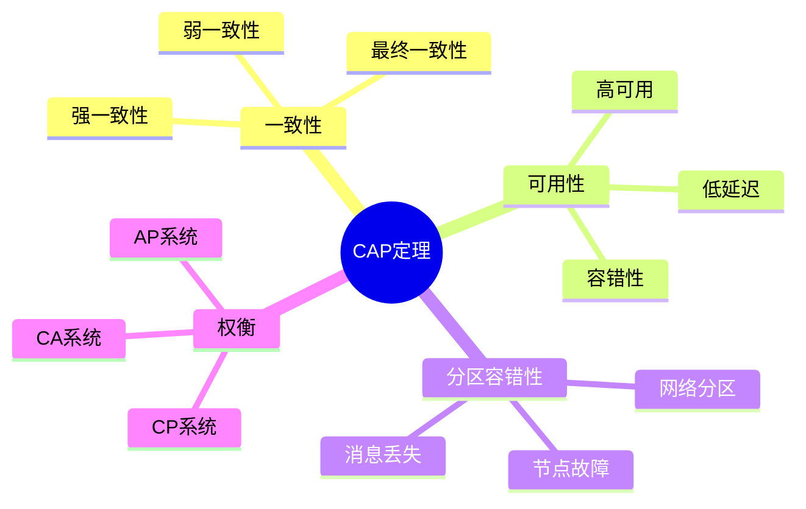
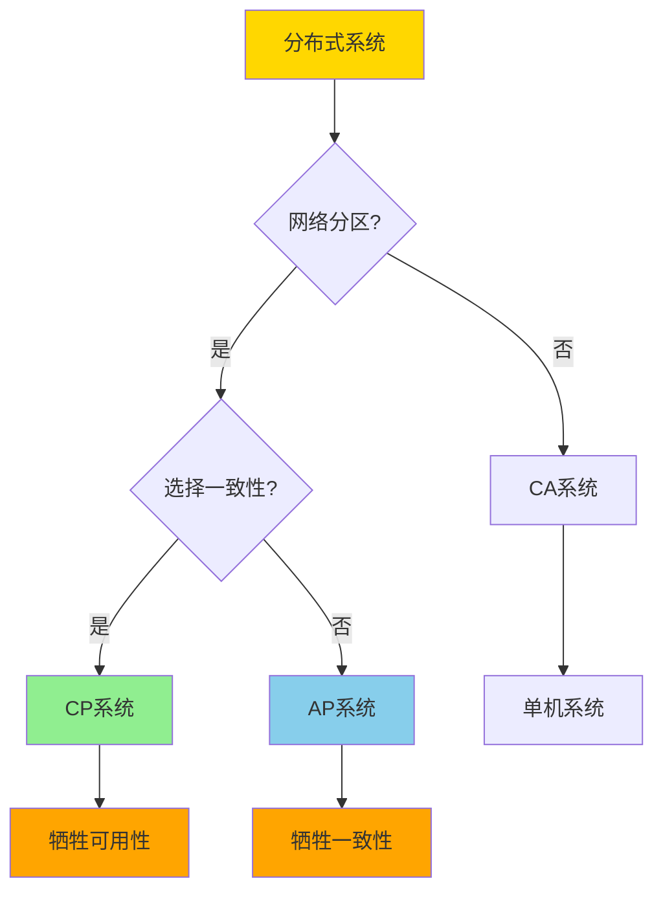
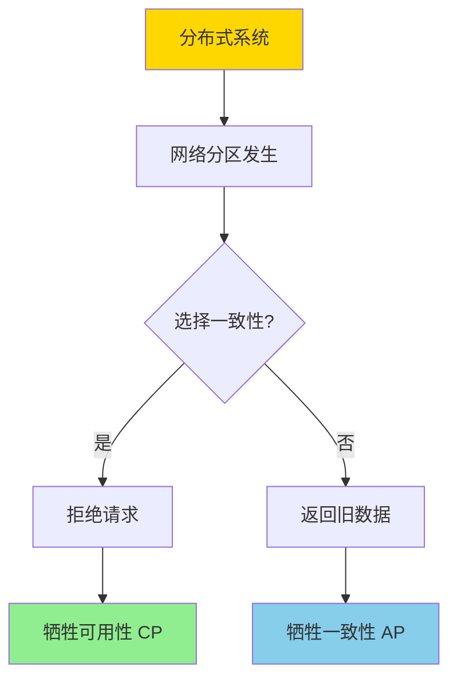
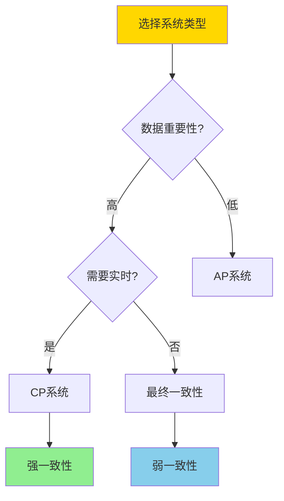
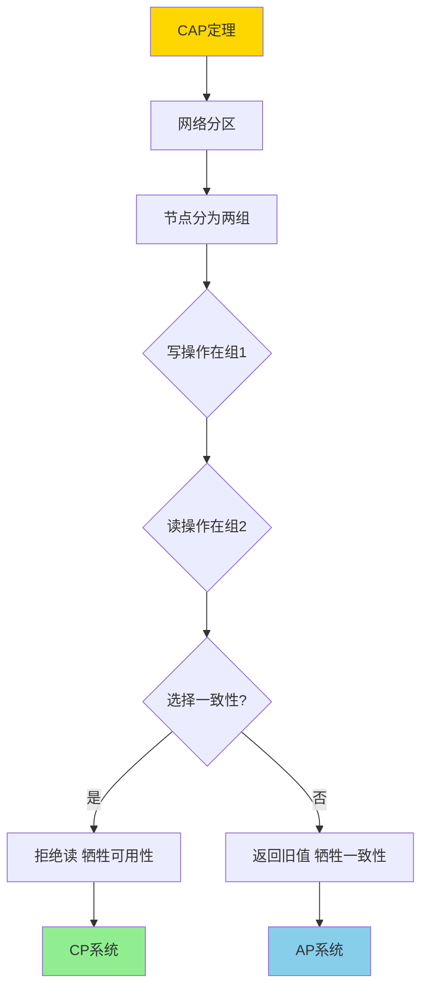
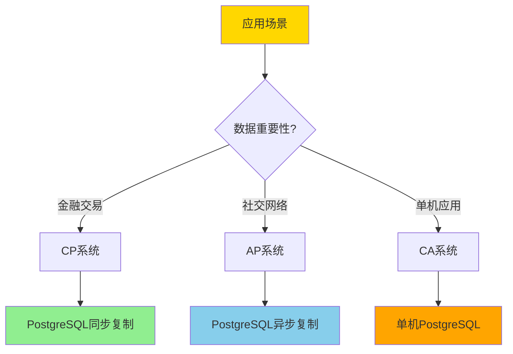

# 分布式一致性与CAP-形式化刻画与权衡

> **文档版本**: v1.0
> **最后更新**: 2025-01-16
> **版本覆盖**: PostgreSQL 18.x (推荐) ⭐ | 17.x (推荐) | 16.x (兼容)
> **文档状态**: 🟡 框架已创建，内容待完善

---

## 📋 目录

- [分布式一致性与CAP-形式化刻画与权衡](#分布式一致性与cap-形式化刻画与权衡)
  - [📋 目录](#-目录)
  - [1. 概述](#1-概述)
    - [1.0 CAP定理工作原理概述](#10-cap定理工作原理概述)
    - [1.1 本文档的范围](#11-本文档的范围)
  - [2. 核心内容](#2-核心内容)
    - [2.1 CAP三要素](#21-cap三要素)
    - [2.2 CAP定理](#22-cap定理)
    - [2.3 实际权衡策略](#23-实际权衡策略)
  - [3. 形式化定义](#3-形式化定义)
    - [3.1 一致性形式化](#31-一致性形式化)
    - [3.2 可用性形式化](#32-可用性形式化)
    - [3.3 分区容错性形式化](#33-分区容错性形式化)
    - [3.4 CAP定理形式化](#34-cap定理形式化)
  - [4. 定理与证明](#4-定理与证明)
    - [4.1 CAP定理证明](#41-cap定理证明)
    - [4.2 权衡策略证明](#42-权衡策略证明)
  - [5. 实际应用](#5-实际应用)
    - [5.1 PostgreSQL的CAP权衡](#51-postgresql的cap权衡)
    - [5.2 分布式PostgreSQL方案](#52-分布式postgresql方案)
    - [5.3 CAP权衡最佳实践](#53-cap权衡最佳实践)
  - [6. 相关文档](#6-相关文档)
    - [6.1 理论基础文档](#61-理论基础文档)
  - [7. 参考文献](#7-参考文献)
    - [7.1 核心理论文献](#71-核心理论文献)
    - [7.2 一致性模型相关](#72-一致性模型相关)
    - [7.3 实际系统分析](#73-实际系统分析)
    - [7.4 PostgreSQL实现相关](#74-postgresql实现相关)
    - [7.5 相关文档](#75-相关文档)

---

## 1. 概述

### 1.0 CAP定理工作原理概述

**CAP定理**：

CAP定理指出，在分布式系统中，一致性（Consistency）、可用性（Availability）和分区容错性（Partition Tolerance）三者不能同时满足，最多只能同时满足两个。

**CAP权衡思维导图**：



**CAP系统分类决策树**：



**CAP系统对比矩阵**：

| 系统类型 | 一致性 | 可用性 | 分区容错 | 典型系统 | 适用场景 |
|---------|--------|--------|---------|---------|---------|
| **CP** | ✓ | ✗ | ✓ | HBase, MongoDB | 金融系统 |
| **AP** | ✗ | ✓ | ✓ | Cassandra, DynamoDB | 社交网络 |
| **CA** | ✓ | ✓ | ✗ | 单机数据库 | 非分布式 |

### 1.1 本文档的范围

本文档涵盖：

- **CAP定理**：一致性、可用性、分区容错性的形式化定义
- **形式化刻画**：CAP定理的严格数学证明
- **权衡分析**：不同系统类型的权衡策略
- **实际应用**：PostgreSQL在分布式场景下的CAP权衡

---

## 2. 核心内容

### 2.1 CAP三要素

**一致性（Consistency）**：

```haskell
-- 一致性定义
consistent :: System -> Bool
consistent sys =
    forall read operation r:
        r returns the value of the most recent write
        or
        r returns an error
```

**可用性（Availability）**：

```haskell
-- 可用性定义
available :: System -> Bool
available sys =
    forall request:
        system responds (not necessarily with correct data)
        within bounded time
```

**分区容错性（Partition Tolerance）**：

```haskell
-- 分区容错性定义
partitionTolerant :: System -> Bool
partitionTolerant sys =
    system continues to operate
    despite network partitions
```

### 2.2 CAP定理

**CAP定理陈述**：

```haskell
-- CAP定理
CAP_Theorem =
    forall distributed system:
        cannot simultaneously guarantee:
            Consistency (C)
            Availability (A)
            Partition Tolerance (P)
        can guarantee at most two of three
```

**CAP证明思路**：



### 2.3 实际权衡策略

**一致性级别对比**：

| 一致性级别 | 定义 | 延迟 | 复杂度 | 适用场景 |
|-----------|------|------|--------|---------|
| **强一致性** | 所有节点立即一致 | 高 | 高 | 金融交易 |
| **弱一致性** | 允许暂时不一致 | 低 | 中 | Web应用 |
| **最终一致性** | 最终会一致 | 最低 | 低 | 社交网络 |

**权衡策略选择**：



---

## 3. 形式化定义

### 3.1 一致性形式化

**一致性**：

```haskell
-- 强一致性
strongConsistent(sys) =
    forall read r at time t:
        r returns value v such that:
            v = value of most recent write before t
            or
            r returns error

-- 弱一致性
weakConsistent(sys) =
    forall read r:
        r may return stale value
        but eventually returns fresh value
```

### 3.2 可用性形式化

**可用性**：

```haskell
-- 可用性
available(sys) =
    forall request req:
        exists response resp:
            resp is returned within time bound T
            and
            resp is not an error (for availability)
```

### 3.3 分区容错性形式化

**分区容错性**：

```haskell
-- 分区容错性
partitionTolerant(sys) =
    forall network partition P:
        sys continues to operate
        despite messages lost in P
```

### 3.4 CAP定理形式化

**CAP定理**：

```haskell
-- CAP定理形式化
CAP_Theorem =
    forall distributed system S:
        if partitionTolerant(S) then
            not (consistent(S) and available(S))
        else
            consistent(S) and available(S)  -- CA system
```

---

## 4. 定理与证明

### 4.1 CAP定理证明

**定理**：在存在网络分区的分布式系统中，不能同时保证强一致性和可用性。

**证明树**：



**证明**：

1. **假设**：存在网络分区，节点分为两组G1和G2
2. **写操作**：在G1中执行写操作W，更新数据为v
3. **读操作**：在G2中执行读操作R
4. **矛盾**：
   - 如果保证一致性：R必须返回v，但G2无法知道v（分区），必须拒绝R → 牺牲可用性
   - 如果保证可用性：R必须响应，但无法返回v → 返回旧值，牺牲一致性
5. **结论**：不能同时保证一致性和可用性

### 4.2 权衡策略证明

**定理**：不同系统类型的选择是合理的权衡。

**证明**：

- **CP系统**：适合数据重要性高的场景，牺牲可用性保证一致性
- **AP系统**：适合高可用性要求的场景，牺牲一致性保证可用性
- **CA系统**：适合单机或非分布式场景，不保证分区容错性

---

## 5. 实际应用

### 5.1 PostgreSQL的CAP权衡

**PostgreSQL在分布式场景**：

```sql
-- PostgreSQL主从复制（CP倾向）
-- 主节点：强一致性
BEGIN;
UPDATE accounts SET balance = balance - 100 WHERE id = 1;
COMMIT;  -- 强一致性保证

-- 从节点：可能延迟（最终一致性）
SELECT * FROM accounts WHERE id = 1;  -- 可能读到旧值
```

**PostgreSQL流复制配置**：

```sql
-- 主节点配置（postgresql.conf）
synchronous_standby_names = 'standby1,standby2'  -- 同步复制（CP）
-- 或
synchronous_standby_names = ''  -- 异步复制（AP倾向）

-- 查看复制状态
SELECT * FROM pg_stat_replication;
```

### 5.2 分布式PostgreSQL方案

**Citus（分布式PostgreSQL）**：

```sql
-- Citus提供分布式PostgreSQL
-- 配置一致性级别
SET citus.coordinator_aggregation_strategy = 'row-gather';  -- 强一致性
-- 或
SET citus.coordinator_aggregation_strategy = 'bypass';  -- 弱一致性

-- 分布式查询
SELECT * FROM distributed_table WHERE id = 1;
```

### 5.3 CAP权衡最佳实践

**选择建议**：



---

## 6. 相关文档

### 6.1 理论基础文档

- [两阶段提交-可恢复性与阻塞特性证明](./04.03-两阶段提交-可恢复性与阻塞特性证明.md)
- [CRDT与最终一致-会合半格与收敛性证明](./04.05-CRDT与最终一致-会合半格与收敛性证明.md)
- [理论基础导航](../README.md)

---

## 7. 参考文献

### 7.1 核心理论文献

- **Brewer, E. (2000). "Towards Robust Distributed Systems."**
  - 会议: PODC 2000
  - **重要性**: CAP定理的原始提出
  - **核心贡献**: 提出了CAP三要素的概念
  - **批判性分析**: 原始表述较为直观，缺乏严格的形式化证明，后续研究提供了更严格的证明

- **Gilbert, S., & Lynch, N. (2002). "Brewer's Conjecture and the Feasibility of Consistent, Available, Partition-Tolerant Web Services."**
  - 期刊: ACM SIGACT News 2002
  - **重要性**: CAP定理的严格证明
  - **核心贡献**: 提供了CAP定理的严格数学证明
  - **批判性分析**: 证明基于理想化模型，实际系统中的权衡更加复杂和微妙

### 7.2 一致性模型相关

- **Lamport, L. (1979). "How to Make a Multiprocessor Computer That Correctly Executes Multiprocess Programs."**
  - 期刊: IEEE Transactions on Computers 1979
  - **重要性**: 顺序一致性的经典定义
  - **核心贡献**: 为分布式一致性提供了理论基础
  - **批判性分析**: 顺序一致性比CAP中的一致性更强，实际系统很少实现

### 7.3 实际系统分析

- **Abadi, D. (2012). "Consistency Tradeoffs in Modern Distributed Database System Design."**
  - 会议: IEEE Computer 2012
  - **重要性**: 现代分布式数据库的一致性权衡分析
  - **核心贡献**: 分析了实际系统中的CAP权衡策略
  - **批判性分析**: 提供了实际系统的经验分析，但缺乏统一的理论框架

### 7.4 PostgreSQL实现相关

- **[PostgreSQL官方文档 - 高可用](<https://www.postgresql.org/docs/current/high-availability.html>)**
  - PostgreSQL高可用和复制配置说明

- **[Citus分布式PostgreSQL](<https://www.citusdata.com/>)**
  - Citus分布式PostgreSQL解决方案

### 7.5 相关文档

- [两阶段提交-可恢复性与阻塞特性证明](./04.03-两阶段提交-可恢复性与阻塞特性证明.md)
- [CRDT与最终一致-会合半格与收敛性证明](./04.05-CRDT与最终一致-会合半格与收敛性证明.md)
- [理论基础导航](../README.md)

---

**最后更新**: 2025-01-16
**维护者**: Documentation Team
**状态**: 🟡 框架已创建，内容待完善
