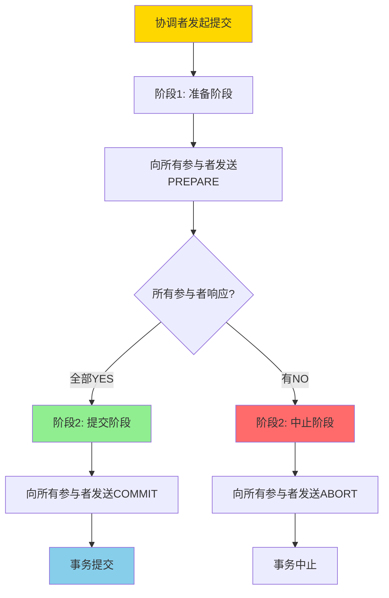
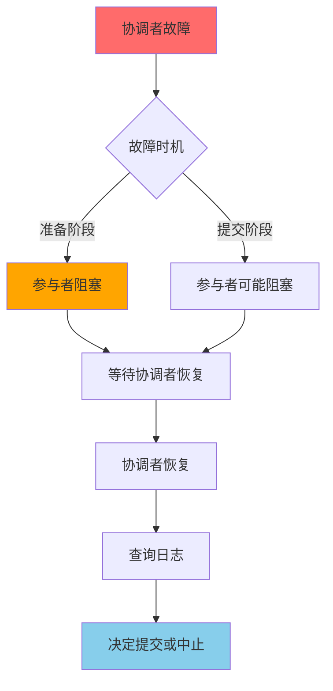
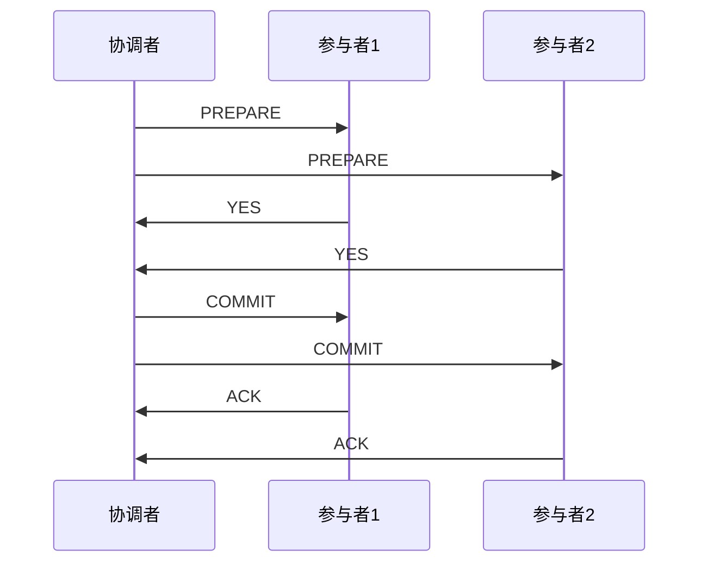
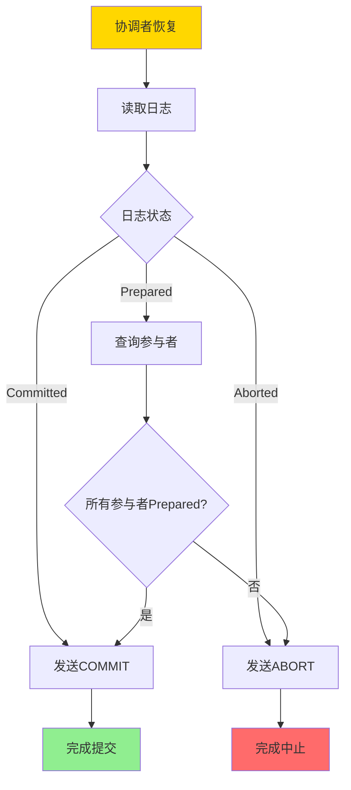
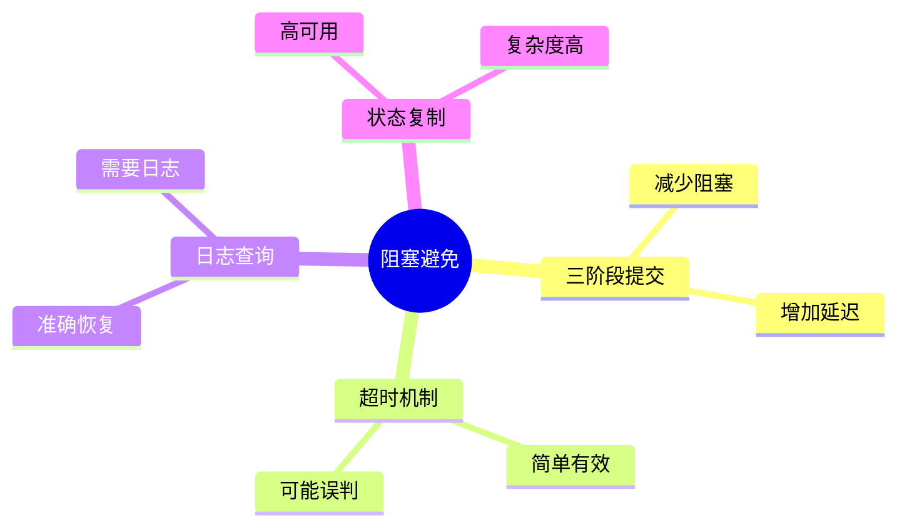
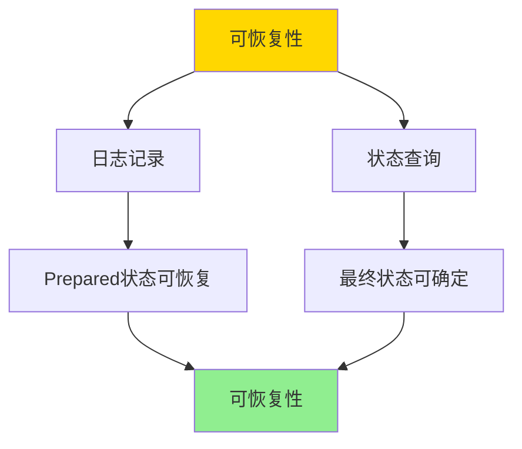

# 两阶段提交-可恢复性与阻塞特性证明

> **文档版本**: v1.0
> **最后更新**: 2025-01-16
> **版本覆盖**: PostgreSQL 18.x (推荐) ⭐ | 17.x (推荐) | 16.x (兼容)
> **文档状态**: 🟡 框架已创建，内容待完善

---

## 📋 目录

- [两阶段提交-可恢复性与阻塞特性证明](#两阶段提交-可恢复性与阻塞特性证明)
  - [📋 目录](#-目录)
  - [1. 概述](#1-概述)
    - [1.0 两阶段提交工作原理概述](#10-两阶段提交工作原理概述)
    - [1.1 本文档的范围](#11-本文档的范围)
  - [2. 核心内容](#2-核心内容)
    - [2.1 两阶段提交协议](#21-两阶段提交协议)
    - [2.2 可恢复性](#22-可恢复性)
    - [2.3 阻塞特性](#23-阻塞特性)
  - [3. 形式化定义](#3-形式化定义)
    - [3.1 2PC协议形式化](#31-2pc协议形式化)
    - [3.2 可恢复性形式化](#32-可恢复性形式化)
    - [3.3 阻塞特性形式化](#33-阻塞特性形式化)
  - [4. 定理与证明](#4-定理与证明)
    - [4.1 可恢复性定理](#41-可恢复性定理)
    - [4.2 阻塞特性定理](#42-阻塞特性定理)
  - [5. 实际应用](#5-实际应用)
    - [5.1 PostgreSQL两阶段提交](#51-postgresql两阶段提交)
    - [5.2 分布式事务恢复](#52-分布式事务恢复)
    - [5.3 阻塞避免最佳实践](#53-阻塞避免最佳实践)
  - [6. 相关文档](#6-相关文档)
    - [6.1 理论基础文档](#61-理论基础文档)
  - [7. 参考文献](#7-参考文献)
    - [7.1 核心理论文献](#71-核心理论文献)
    - [7.2 分布式事务相关](#72-分布式事务相关)
    - [7.3 相关文档](#73-相关文档)

---

## 1. 概述

### 1.0 两阶段提交工作原理概述

**两阶段提交协议（2PC）**：

两阶段提交是分布式事务处理中的经典协议，用于保证分布式系统中多个节点的事务一致性。本文档严格证明2PC的可恢复性和阻塞特性。

**2PC执行流程**：



**2PC阻塞特性**：



### 1.1 本文档的范围

本文档涵盖：

- **2PC协议**：两阶段提交协议的完整描述
- **可恢复性**：严格证明2PC的可恢复性
- **阻塞特性**：分析2PC的阻塞特性和影响
- **实际应用**：2PC在分布式系统中的应用

---

## 2. 核心内容

### 2.1 两阶段提交协议

**2PC协议定义**：

```haskell
-- 2PC协议
data TwoPhaseCommit = TwoPhaseCommit {
    coordinator :: Node,
    participants :: [Node],
    state :: CommitState
}

-- 提交状态
data CommitState =
    Initial
  | Prepared
  | Committed
  | Aborted

-- 阶段1：准备阶段
preparePhase :: TwoPhaseCommit -> IO Bool
preparePhase tpc = do
    responses <- mapM (sendPrepare tpc.coordinator) tpc.participants
    return (all (== Yes) responses)

-- 阶段2：提交阶段
commitPhase :: TwoPhaseCommit -> Bool -> IO ()
commitPhase tpc allPrepared =
    if allPrepared then
        mapM_ (sendCommit tpc.coordinator) tpc.participants
    else
        mapM_ (sendAbort tpc.coordinator) tpc.participants
```

**2PC执行流程**：



### 2.2 可恢复性

**可恢复性定义**：

```haskell
-- 可恢复性
recoverable :: TwoPhaseCommit -> Bool
recoverable tpc =
    forall participant in tpc.participants:
        if participant.state = Prepared then
            exists log entry indicating Prepared
            and
            can recover to Committed or Aborted
```

**恢复流程**：



### 2.3 阻塞特性

**阻塞场景分析**：

| 故障场景 | 阻塞情况 | 恢复方法 |
|---------|---------|---------|
| **协调者在准备阶段故障** | 参与者阻塞 | 选举新协调者或超时中止 |
| **协调者在提交阶段故障** | 参与者可能阻塞 | 查询其他参与者状态 |
| **参与者在准备阶段故障** | 协调者等待 | 超时中止 |
| **参与者在提交阶段故障** | 协调者等待 | 重试提交 |

**阻塞避免策略对比**：



---

## 3. 形式化定义

### 3.1 2PC协议形式化

**2PC协议**：

```haskell
-- 2PC协议形式化
2PC = (Phase1, Phase2)
where
    Phase1 = {PREPARE → participants → {YES, NO}}
    Phase2 = {COMMIT | ABORT → participants → ACK}
```

### 3.2 可恢复性形式化

**可恢复性**：

```haskell
-- 可恢复性
recoverable(2PC) =
    forall participant p:
        if p.state = Prepared then
            exists log entry: log(p) = Prepared
            and
            can determine final state from logs
```

### 3.3 阻塞特性形式化

**阻塞**：

```haskell
-- 阻塞定义
blocked(participant, state) =
    participant.state = Prepared
    and
    coordinator is down
    and
    cannot determine final state
```

---

## 4. 定理与证明

### 4.1 可恢复性定理

**定理**：2PC协议是可恢复的。

**证明树**：



**证明**：

1. **日志记录**：每个阶段的状态都记录在日志中
2. **状态查询**：恢复时可以通过日志确定状态
3. **最终状态**：可以确定事务的最终状态（提交或中止）
4. 因此2PC是可恢复的

### 4.2 阻塞特性定理

**定理**：2PC协议在协调者故障时会导致阻塞。

**证明**：

1. 如果协调者在准备阶段故障，参与者处于Prepared状态
2. 参与者无法确定最终状态（提交或中止）
3. 参与者必须等待协调者恢复或超时
4. 因此会导致阻塞

---

## 5. 实际应用

### 5.1 PostgreSQL两阶段提交

**PostgreSQL 2PC实现**：

```sql
-- 准备事务
PREPARE TRANSACTION 'tx1';

-- 在其他节点也准备
-- 在另一个连接中
PREPARE TRANSACTION 'tx1';

-- 提交准备的事务
COMMIT PREPARED 'tx1';
-- 或中止
ROLLBACK PREPARED 'tx1';
```

### 5.2 分布式事务恢复

**恢复查询**：

```sql
-- 查看准备的事务
SELECT * FROM pg_prepared_xacts;

-- 恢复准备的事务
COMMIT PREPARED 'tx1';
-- 或
ROLLBACK PREPARED 'tx1';
```

### 5.3 阻塞避免最佳实践

**超时配置**：

```sql
-- 设置准备事务超时
SET statement_timeout = '30s';

-- 使用外部协调者（如pgpool-II）
-- 自动处理2PC和恢复
```

---

## 6. 相关文档

### 6.1 理论基础文档

- [SAGA与补偿事务-可达性与幂等性条件](./04.04-SAGA与补偿事务-可达性与幂等性条件.md)
- [分布式一致性与CAP-形式化刻画与权衡](./04.02-分布式一致性与CAP-形式化刻画与权衡.md)
- [理论基础导航](../README.md)

---

## 7. 参考文献

### 7.1 核心理论文献

- **Gray, J. (1978). "Notes on Database Operating Systems."**
  - 会议: IBM Research Report
  - **重要性**: 两阶段提交协议的经典论文
  - **核心贡献**: 提出了2PC协议和阻塞特性分析

- **Bernstein, P. A., & Newcomer, E. (2009). "Principles of Transaction Processing."**
  - 出版社: Morgan Kaufmann
  - **重要性**: 事务处理的经典教材
  - **核心贡献**: 系统阐述了2PC协议和可恢复性理论

### 7.2 分布式事务相关

- **Lampson, B., & Sturgis, H. (1979). "Crash Recovery in a Distributed Data Storage System."**
  - 会议: Xerox PARC Technical Report
  - **重要性**: 分布式恢复的经典研究
  - **核心贡献**: 提供了分布式事务恢复的理论框架

### 7.3 相关文档

- [SAGA与补偿事务-可达性与幂等性条件](./04.04-SAGA与补偿事务-可达性与幂等性条件.md)
- [分布式一致性与CAP-形式化刻画与权衡](./04.02-分布式一致性与CAP-形式化刻画与权衡.md)
- [理论基础导航](../README.md)

---

**最后更新**: 2025-01-16
**维护者**: Documentation Team
**状态**: 🟡 框架已创建，内容待完善
