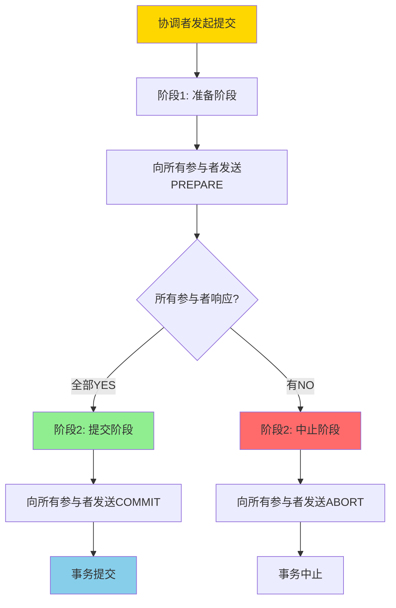
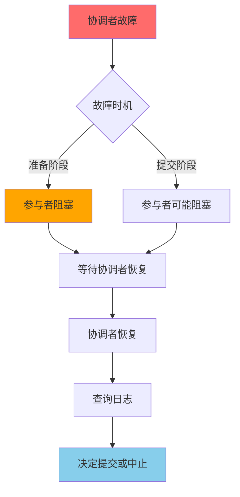

# 两阶段提交-可恢复性与阻塞特性证明

> **文档版本**: v1.0
> **最后更新**: 2025-01-16
> **版本覆盖**: PostgreSQL 18.x (推荐) ⭐ | 17.x (推荐) | 16.x (兼容)
> **文档状态**: 🟡 框架已创建，内容待完善

---

## 📋 目录

- [两阶段提交-可恢复性与阻塞特性证明](#两阶段提交-可恢复性与阻塞特性证明)
  - [📋 目录](#-目录)
  - [1. 概述](#1-概述)
    - [1.0 两阶段提交工作原理概述](#10-两阶段提交工作原理概述)
    - [1.1 本文档的范围](#11-本文档的范围)
  - [2. 核心内容](#2-核心内容)
  - [3. 形式化定义](#3-形式化定义)
  - [4. 定理与证明](#4-定理与证明)
  - [5. 实际应用](#5-实际应用)
  - [6. 相关文档](#6-相关文档)
    - [6.1 理论基础文档](#61-理论基础文档)
  - [7. 参考文献](#7-参考文献)
    - [7.1 核心理论文献](#71-核心理论文献)
    - [7.2 分布式事务相关](#72-分布式事务相关)
    - [7.3 相关文档](#73-相关文档)

---

## 1. 概述

### 1.0 两阶段提交工作原理概述

**两阶段提交协议（2PC）**：

两阶段提交是分布式事务处理中的经典协议，用于保证分布式系统中多个节点的事务一致性。本文档严格证明2PC的可恢复性和阻塞特性。

**2PC执行流程**：

**2PC阻塞特性**：

### 1.1 本文档的范围

本文档涵盖：

- **2PC协议**：两阶段提交协议的完整描述
- **可恢复性**：严格证明2PC的可恢复性
- **阻塞特性**：分析2PC的阻塞特性和影响
- **实际应用**：2PC在分布式系统中的应用

---

## 2. 核心内容

[待补充]

---

## 3. 形式化定义

[待补充]

---

## 4. 定理与证明

[待补充]

---

## 5. 实际应用

[待补充]

---

## 6. 相关文档

### 6.1 理论基础文档

- [形式语言与证明：总论](./1.1.25-形式语言与证明-总论.md)
- [理论基础导航](./README.md)

---

## 7. 参考文献

### 7.1 核心理论文献

- **Gray, J. (1978). "Notes on Database Operating Systems."**
  - 会议: IBM Research Report
  - **重要性**: 两阶段提交协议的经典论文
  - **核心贡献**: 提出了2PC协议和阻塞特性分析

- **Bernstein, P. A., & Newcomer, E. (2009). "Principles of Transaction Processing."**
  - 出版社: Morgan Kaufmann
  - **重要性**: 事务处理的经典教材
  - **核心贡献**: 系统阐述了2PC协议和可恢复性理论

### 7.2 分布式事务相关

- **Lampson, B., & Sturgis, H. (1979). "Crash Recovery in a Distributed Data Storage System."**
  - 会议: Xerox PARC Technical Report
  - **重要性**: 分布式恢复的经典研究
  - **核心贡献**: 提供了分布式事务恢复的理论框架

### 7.3 相关文档

- [SAGA与补偿事务-可达性与幂等性条件](./1.1.56-SAGA与补偿事务-可达性与幂等性条件.md)
- [理论基础导航](./README.md)

---

**最后更新**: 2025-01-16
**维护者**: Documentation Team
**状态**: 🟡 框架已创建，内容待完善
