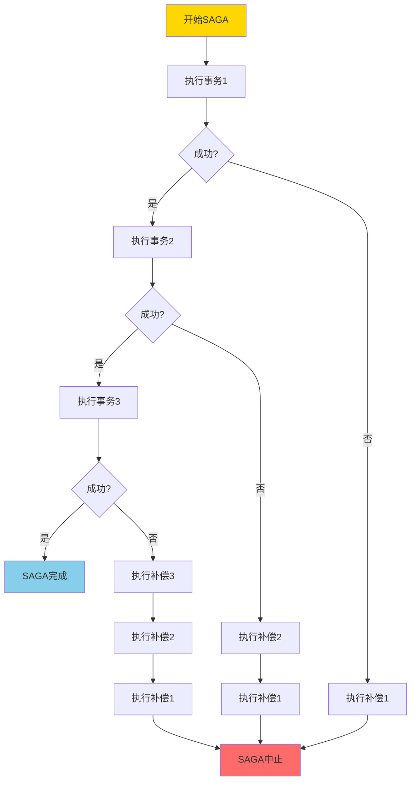
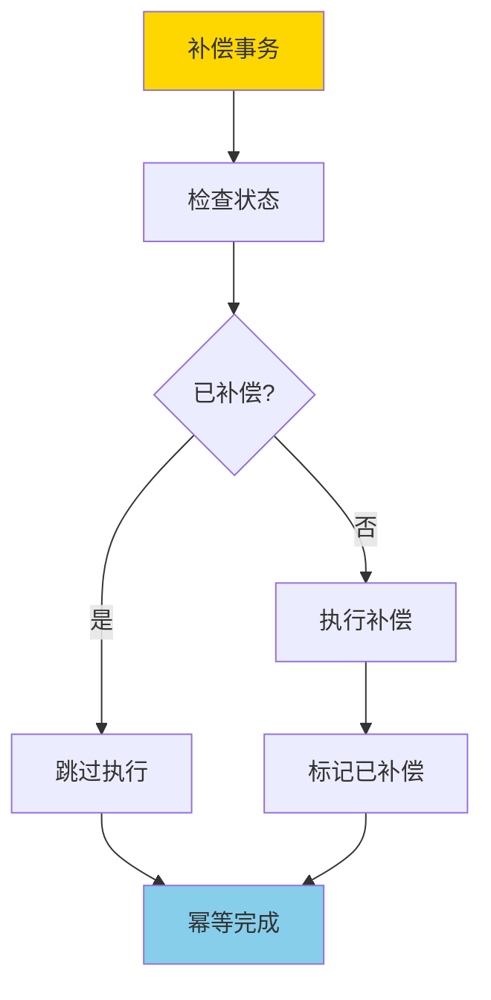
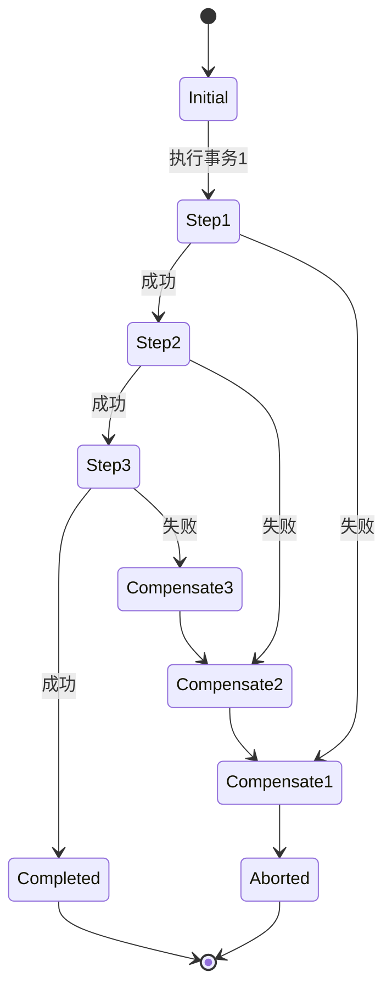
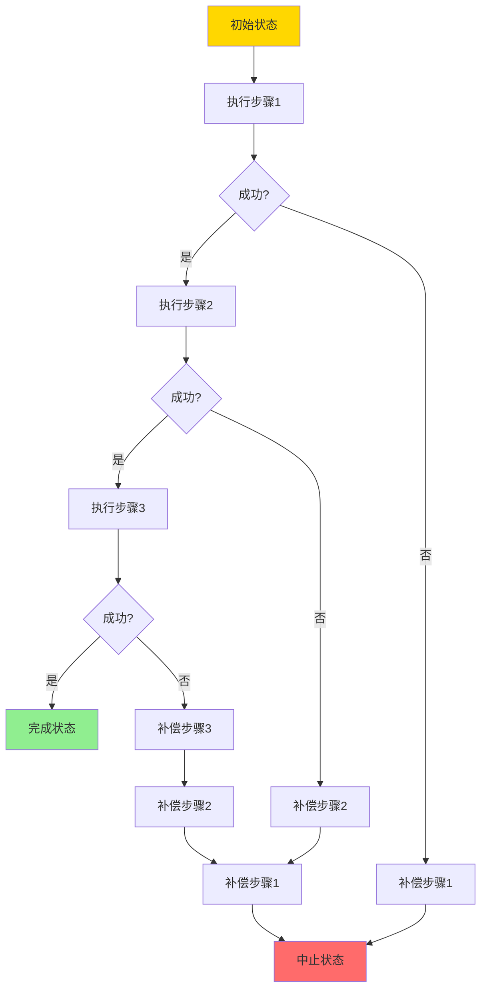
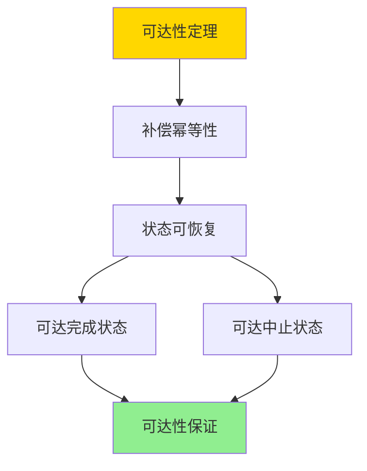

# SAGA与补偿事务-可达性与幂等性条件

> **文档版本**: v1.0
> **最后更新**: 2025-01-16
> **版本覆盖**: PostgreSQL 18.x (推荐) ⭐ | 17.x (推荐) | 16.x (兼容)
> **文档状态**: 🟡 框架已创建，内容待完善

---

## 📋 目录

- [SAGA与补偿事务-可达性与幂等性条件](#saga与补偿事务-可达性与幂等性条件)
  - [📋 目录](#-目录)
  - [1. 概述](#1-概述)
    - [1.0 SAGA与补偿事务工作原理概述](#10-saga与补偿事务工作原理概述)
    - [1.1 本文档的范围](#11-本文档的范围)
  - [2. 核心内容](#2-核心内容)
    - [2.1 SAGA模式](#21-saga模式)
    - [2.2 可达性](#22-可达性)
    - [2.3 幂等性](#23-幂等性)
  - [3. 形式化定义](#3-形式化定义)
    - [3.1 SAGA形式化](#31-saga形式化)
    - [3.2 可达性形式化](#32-可达性形式化)
    - [3.3 幂等性形式化](#33-幂等性形式化)
  - [4. 定理与证明](#4-定理与证明)
    - [4.1 可达性定理](#41-可达性定理)
    - [4.2 幂等性条件定理](#42-幂等性条件定理)
  - [5. 实际应用](#5-实际应用)
    - [5.1 微服务SAGA实现](#51-微服务saga实现)
    - [5.2 幂等性实现](#52-幂等性实现)
  - [6. 相关文档](#6-相关文档)
    - [6.1 理论基础文档](#61-理论基础文档)
  - [7. 参考文献](#7-参考文献)
    - [7.1 核心理论文献](#71-核心理论文献)
    - [7.2 微服务架构相关](#72-微服务架构相关)
    - [7.3 相关文档](#73-相关文档)

---

## 1. 概述

### 1.0 SAGA与补偿事务工作原理概述

**SAGA模式**：

SAGA是一种长事务处理模式，通过将长事务分解为多个本地事务，并使用补偿事务来处理失败情况。本文档严格证明SAGA的可达性和补偿事务的幂等性条件。

**SAGA执行流程**：



**补偿事务幂等性**：



### 1.1 本文档的范围

本文档涵盖：

- **SAGA模式**：SAGA模式的完整描述
- **可达性**：严格证明SAGA的可达性条件
- **幂等性**：补偿事务的幂等性条件和证明
- **实际应用**：SAGA在微服务架构中的应用

---

## 2. 核心内容

### 2.1 SAGA模式

**SAGA定义**：

```haskell
-- SAGA事务
data Saga = Saga {
    steps :: [SagaStep],
    compensations :: [Compensation]
}

-- SAGA步骤
data SagaStep = SagaStep {
    transaction :: Transaction,
    compensation :: Compensation
}

-- 补偿事务
data Compensation = Compensation {
    action :: Action,
    idempotent :: Bool
}
```

**SAGA执行状态机**：



### 2.2 可达性

**可达性定义**：

```haskell
-- 可达性
reachable :: Saga -> State -> Bool
reachable saga target =
    exists execution path from initial state to target state
```

**可达性分析**：



### 2.3 幂等性

**幂等性条件**：

```haskell
-- 幂等性
idempotent :: Compensation -> Bool
idempotent comp =
    forall state s:
        comp(comp(s)) = comp(s)
```

**幂等性保证策略**：

| 策略 | 方法 | 优点 | 缺点 |
|------|------|------|------|
| **状态检查** | 检查是否已执行 | 简单 | 需要状态存储 |
| **版本号** | 使用版本号标记 | 可靠 | 需要版本管理 |
| **幂等键** | 使用唯一键 | 高效 | 需要键生成 |

---

## 3. 形式化定义

### 3.1 SAGA形式化

**SAGA**：

```haskell
-- SAGA形式化
SAGA = (S, T, C, →)
where
    S = {s0, s1, ..., sn}  -- 状态集合
    T = {t1, t2, ..., tn}  -- 事务集合
    C = {c1, c2, ..., cn}  -- 补偿集合
    → = transition relation
```

### 3.2 可达性形式化

**可达性**：

```haskell
-- 可达性
reachable(saga, s) =
    exists path p: s0 →* s
    where →* is reflexive transitive closure
```

### 3.3 幂等性形式化

**幂等性**：

```haskell
-- 幂等性
idempotent(c) =
    forall s: c(c(s)) = c(s)
```

---

## 4. 定理与证明

### 4.1 可达性定理

**定理**：如果所有补偿事务都是幂等的，则SAGA可以从任何中间状态到达完成或中止状态。

**证明树**：



**证明**：

1. **补偿幂等性**：补偿事务可以安全地重复执行
2. **状态恢复**：可以从任何中间状态通过补偿回到之前状态
3. **路径存在**：存在从初始状态到目标状态的执行路径
4. 因此可达性得到保证

### 4.2 幂等性条件定理

**定理**：补偿事务幂等当且仅当执行结果不依赖于执行次数。

**证明**：

- **必要性**：如果幂等，则多次执行结果相同
- **充分性**：如果结果不依赖执行次数，则幂等

---

## 5. 实际应用

### 5.1 微服务SAGA实现

**PostgreSQL中的SAGA模式**：

```sql
-- 创建SAGA状态表
CREATE TABLE saga_state (
    saga_id UUID PRIMARY KEY,
    current_step INTEGER,
    status VARCHAR(20),
    created_at TIMESTAMP
);

-- 创建补偿日志
CREATE TABLE compensation_log (
    id SERIAL PRIMARY KEY,
    saga_id UUID REFERENCES saga_state(saga_id),
    step INTEGER,
    compensation_sql TEXT,
    executed BOOLEAN DEFAULT FALSE
);

-- SAGA执行函数
CREATE OR REPLACE FUNCTION execute_saga_step(
    p_saga_id UUID,
    p_step INTEGER,
    p_sql TEXT
) RETURNS BOOLEAN AS $$
DECLARE
    v_result BOOLEAN;
BEGIN
    -- 执行事务步骤
    EXECUTE p_sql;

    -- 记录状态
    UPDATE saga_state
    SET current_step = p_step, status = 'in_progress'
    WHERE saga_id = p_saga_id;

    RETURN TRUE;
EXCEPTION
    WHEN OTHERS THEN
        -- 执行补偿
        PERFORM execute_compensation(p_saga_id, p_step);
        RETURN FALSE;
END;
$$ LANGUAGE plpgsql;
```

### 5.2 幂等性实现

**幂等补偿函数**：

```sql
-- 幂等补偿函数
CREATE OR REPLACE FUNCTION idempotent_compensate(
    p_saga_id UUID,
    p_step INTEGER
) RETURNS VOID AS $$
DECLARE
    v_executed BOOLEAN;
BEGIN
    -- 检查是否已执行
    SELECT executed INTO v_executed
    FROM compensation_log
    WHERE saga_id = p_saga_id AND step = p_step;

    IF NOT v_executed THEN
        -- 执行补偿
        PERFORM execute_compensation_sql(p_saga_id, p_step);

        -- 标记已执行
        UPDATE compensation_log
        SET executed = TRUE
        WHERE saga_id = p_saga_id AND step = p_step;
    END IF;
END;
$$ LANGUAGE plpgsql;
```

---

## 6. 相关文档

### 6.1 理论基础文档

- [两阶段提交-可恢复性与阻塞特性证明](./04.03-两阶段提交-可恢复性与阻塞特性证明.md)
- [理论基础导航](../README.md)

---

## 7. 参考文献

### 7.1 核心理论文献

- **Garcia-Molina, H., & Salem, K. (1987). "Sagas."**
  - 会议: SIGMOD 1987
  - **重要性**: SAGA模式的经典论文
  - **核心贡献**: 提出了SAGA模式和补偿事务概念

- **Bernstein, P. A., & Newcomer, E. (2009). "Principles of Transaction Processing."**
  - 出版社: Morgan Kaufmann
  - **重要性**: 事务处理的经典教材
  - **核心贡献**: 系统阐述了SAGA模式和补偿事务理论

### 7.2 微服务架构相关

- **Richardson, C. (2018). "Microservices Patterns: With Examples in Java."**
  - 出版社: Manning Publications
  - **重要性**: 微服务模式的实践指南
  - **核心贡献**: 提供了SAGA在微服务中的应用模式

### 7.3 相关文档

- [两阶段提交-可恢复性与阻塞特性证明](./04.03-两阶段提交-可恢复性与阻塞特性证明.md)
- [理论基础导航](../README.md)

---

**最后更新**: 2025-01-16
**维护者**: Documentation Team
**状态**: 🟡 框架已创建，内容待完善
