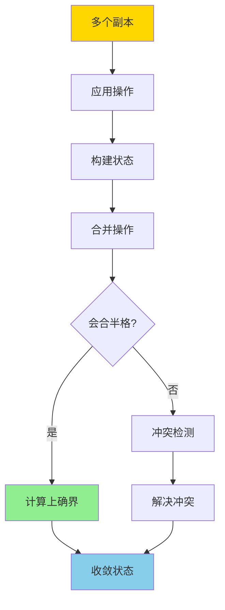
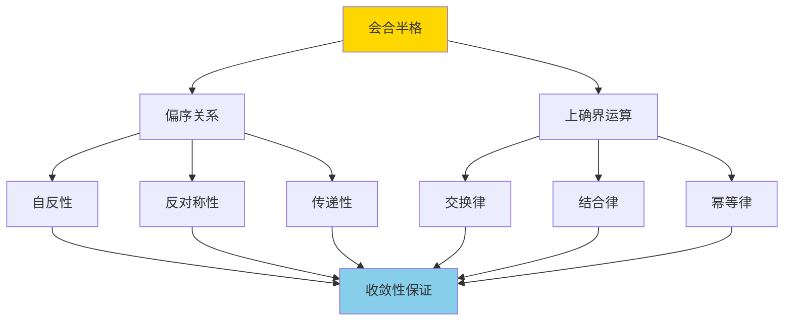
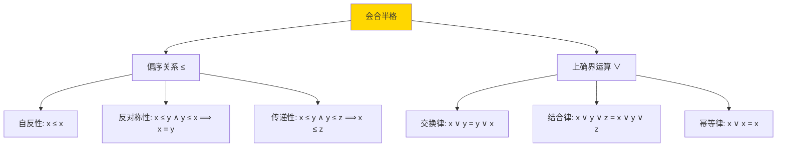
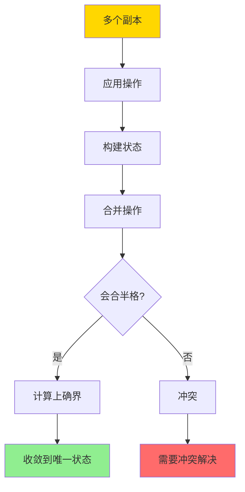
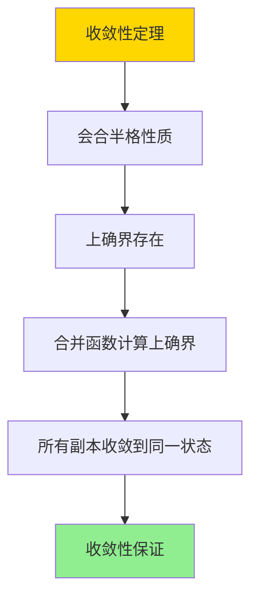

# CRDT与最终一致-会合半格与收敛性证明

> **文档版本**: v1.0
> **最后更新**: 2025-01-16
> **版本覆盖**: PostgreSQL 18.x (推荐) ⭐ | 17.x (推荐) | 16.x (兼容)
> **文档状态**: 🟡 框架已创建，内容待完善

---

## 📋 目录

- [CRDT与最终一致-会合半格与收敛性证明](#crdt与最终一致-会合半格与收敛性证明)
  - [📋 目录](#-目录)
  - [1. 概述](#1-概述)
    - [1.0 CRDT与最终一致工作原理概述](#10-crdt与最终一致工作原理概述)
    - [1.1 本文档的范围](#11-本文档的范围)
  - [2. 核心内容](#2-核心内容)
    - [2.1 CRDT分类](#21-crdt分类)
    - [2.2 会合半格](#22-会合半格)
    - [2.3 收敛性](#23-收敛性)
  - [3. 形式化定义](#3-形式化定义)
    - [3.1 CRDT形式化](#31-crdt形式化)
    - [3.2 会合半格形式化](#32-会合半格形式化)
    - [3.3 收敛性形式化](#33-收敛性形式化)
  - [4. 定理与证明](#4-定理与证明)
    - [4.1 收敛性定理](#41-收敛性定理)
    - [4.2 交换性定理](#42-交换性定理)
  - [5. 实际应用](#5-实际应用)
    - [5.1 PostgreSQL中的CRDT](#51-postgresql中的crdt)
    - [5.2 分布式计数器](#52-分布式计数器)
  - [6. 相关文档](#6-相关文档)
    - [6.1 理论基础文档](#61-理论基础文档)
  - [7. 参考文献](#7-参考文献)
    - [7.1 核心理论文献](#71-核心理论文献)
    - [7.2 分布式系统相关](#72-分布式系统相关)
    - [7.3 相关文档](#73-相关文档)

---

## 1. 概述

### 1.0 CRDT与最终一致工作原理概述

**CRDT（Conflict-free Replicated Data Type）**：

CRDT是一种数据结构，可以在分布式系统中无冲突地复制和合并，保证最终一致性。本文档基于会合半格（Join Semilattice）理论严格证明CRDT的收敛性。

**CRDT合并流程**：



**会合半格结构**：



### 1.1 本文档的范围

本文档涵盖：

- **CRDT定义**：CRDT的数学定义和分类
- **会合半格**：会合半格的数学理论和性质
- **收敛性证明**：严格证明CRDT的收敛性
- **实际应用**：CRDT在分布式系统中的应用

---

## 2. 核心内容

### 2.1 CRDT分类

**CRDT类型**：

```haskell
-- CRDT类型
data CRDTType =
    StateBased CRDT  -- 基于状态的CRDT
  | OperationBased CRDT  -- 基于操作的CRDT

-- 基于状态的CRDT
data StateBasedCRDT = StateBasedCRDT {
    state :: State,
    merge :: State -> State -> State  -- 合并函数
}

-- 基于操作的CRDT
data OperationBasedCRDT = OperationBasedCRDT {
    operations :: [Operation],
    apply :: Operation -> State -> State
}
```

**CRDT分类对比**：

| 类型 | 通信方式 | 合并复杂度 | 适用场景 |
|------|---------|-----------|---------|
| **State-based** | 传输完整状态 | 高 | 低频率更新 |
| **Operation-based** | 传输操作 | 低 | 高频率更新 |

### 2.2 会合半格

**会合半格定义**：

```haskell
-- 会合半格
data JoinSemilattice a = JoinSemilattice {
    elements :: Set a,
    partialOrder :: a -> a -> Bool,  -- ≤
    join :: a -> a -> a  -- ∨ (上确界)
}

-- 会合半格性质
joinSemilatticeProperties :: JoinSemilattice a -> Bool
joinSemilatticeProperties lat =
    -- 交换律
    forall x y: join x y = join y x &&
    -- 结合律
    forall x y z: join (join x y) z = join x (join y z) &&
    -- 幂等律
    forall x: join x x = x &&
    -- 吸收律
    forall x y: join x (join x y) = join x y
```

**会合半格结构**：



### 2.3 收敛性

**收敛性定义**：

```haskell
-- 收敛性
convergent :: CRDT -> Bool
convergent crdt =
    forall replicas r1, r2:
        after applying all operations:
            merge(r1.state, r2.state) = same final state
```

**收敛性保证**：



---

## 3. 形式化定义

### 3.1 CRDT形式化

**CRDT**：

```haskell
-- CRDT形式化
CRDT = (S, ≤, ∨, apply)
where
    S = state set
    ≤ = partial order
    ∨ = join operation (supremum)
    apply = operation application
```

### 3.2 会合半格形式化

**会合半格**：

```haskell
-- 会合半格
(S, ≤, ∨) is join semilattice iff
    (S, ≤) is poset
    and
    forall x, y in S: exists z = x ∨ y such that
        x ≤ z and y ≤ z (upper bound)
        and
        forall w: if x ≤ w and y ≤ w then z ≤ w (least upper bound)
```

### 3.3 收敛性形式化

**收敛性**：

```haskell
-- 收敛性
convergent(CRDT) =
    forall replicas r1, r2, operations O:
        let s1 = apply(O, r1.initialState)
        let s2 = apply(O, r2.initialState)
        in merge(s1, s2) = same final state
```

---

## 4. 定理与证明

### 4.1 收敛性定理

**定理**：如果CRDT的状态空间构成会合半格，则CRDT保证收敛性。

**证明树**：



**证明**：

1. **会合半格性质**：状态空间构成会合半格，上确界运算存在
2. **合并函数**：合并函数计算两个状态的上确界
3. **收敛性**：无论操作顺序如何，所有副本最终收敛到相同的最终状态（所有操作的上确界）
4. 因此CRDT保证收敛性

### 4.2 交换性定理

**定理**：会合半格的交换性保证操作顺序无关性。

**证明**：

- 会合半格的交换律：x ∨ y = y ∨ x
- 因此合并操作的顺序不影响最终结果
- 保证了最终一致性

---

## 5. 实际应用

### 5.1 PostgreSQL中的CRDT

**使用PostgreSQL实现CRDT**：

```sql
-- 创建CRDT状态表
CREATE TABLE crdt_state (
    id UUID PRIMARY KEY,
    key VARCHAR(100),
    value JSONB,  -- CRDT状态
    version BIGINT,
    updated_at TIMESTAMP
);

-- 合并函数（基于JSONB）
CREATE OR REPLACE FUNCTION merge_crdt(
    state1 JSONB,
    state2 JSONB
) RETURNS JSONB AS $$
BEGIN
    -- 计算上确界（取最大值）
    RETURN jsonb_build_object(
        'counter', GREATEST(
            (state1->>'counter')::INTEGER,
            (state2->>'counter')::INTEGER
        )
    );
END;
$$ LANGUAGE plpgsql;

-- 更新CRDT
CREATE OR REPLACE FUNCTION update_crdt(
    p_key VARCHAR,
    p_value JSONB
) RETURNS VOID AS $$
DECLARE
    v_current JSONB;
BEGIN
    -- 获取当前状态
    SELECT value INTO v_current
    FROM crdt_state
    WHERE key = p_key;

    -- 合并状态
    UPDATE crdt_state
    SET value = merge_crdt(v_current, p_value),
        version = version + 1,
        updated_at = NOW()
    WHERE key = p_key;
END;
$$ LANGUAGE plpgsql;
```

### 5.2 分布式计数器

**基于CRDT的计数器**：

```sql
-- 创建计数器CRDT
CREATE TABLE counter_crdt (
    id UUID PRIMARY KEY,
    counter_name VARCHAR(100),
    value INTEGER DEFAULT 0,
    replicas JSONB  -- 各副本的值
);

-- 增量操作
CREATE OR REPLACE FUNCTION increment_counter(
    p_name VARCHAR,
    p_replica_id UUID,
    p_increment INTEGER
) RETURNS INTEGER AS $$
DECLARE
    v_current JSONB;
    v_new_value INTEGER;
BEGIN
    -- 获取当前状态
    SELECT replicas INTO v_current
    FROM counter_crdt
    WHERE counter_name = p_name;

    -- 更新副本值
    v_current := jsonb_set(
        v_current,
        ARRAY[p_replica_id::TEXT],
        to_jsonb((COALESCE((v_current->>p_replica_id::TEXT)::INTEGER, 0) + p_increment)::INTEGER)
    );

    -- 计算总和（合并）
    SELECT SUM(value::INTEGER) INTO v_new_value
    FROM jsonb_each_text(v_current);

    -- 更新状态
    UPDATE counter_crdt
    SET replicas = v_current,
        value = v_new_value
    WHERE counter_name = p_name;

    RETURN v_new_value;
END;
$$ LANGUAGE plpgsql;
```

---

## 6. 相关文档

### 6.1 理论基础文档

- [分布式一致性与CAP-形式化刻画与权衡](./04.02-分布式一致性与CAP-形式化刻画与权衡.md)
- [理论基础导航](../README.md)

---

## 7. 参考文献

### 7.1 核心理论文献

- **Shapiro, M., et al. (2011). "Conflict-free Replicated Data Types."**
  - 会议: SSS 2011
  - **重要性**: CRDT的经典论文
  - **核心贡献**: 提出了CRDT概念和会合半格理论

- **Shapiro, M., et al. (2011). "A Comprehensive Study of Convergent and Commutative Replicated Data Types."**
  - 会议: INRIA Research Report
  - **重要性**: CRDT的详细研究
  - **核心贡献**: 系统阐述了CRDT的分类和性质

### 7.2 分布式系统相关

- **Bailis, P., et al. (2013). "Coordination Avoidance in Database Systems."**
  - 会议: VLDB 2013
  - **重要性**: 分布式协调避免的研究
  - **核心贡献**: 提供了CRDT在数据库系统中的应用

### 7.3 相关文档

- [理论基础导航](./README.md)

---

**最后更新**: 2025-01-16
**维护者**: Documentation Team
**状态**: 🟡 框架已创建，内容待完善
