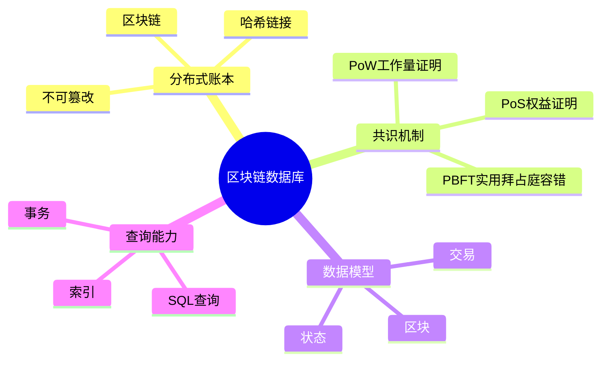
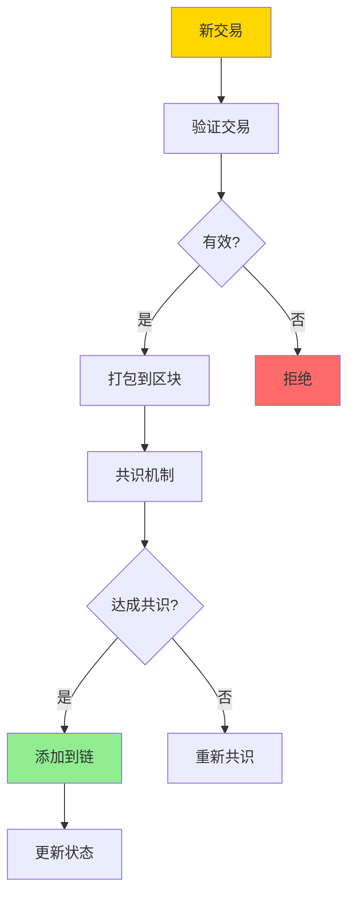
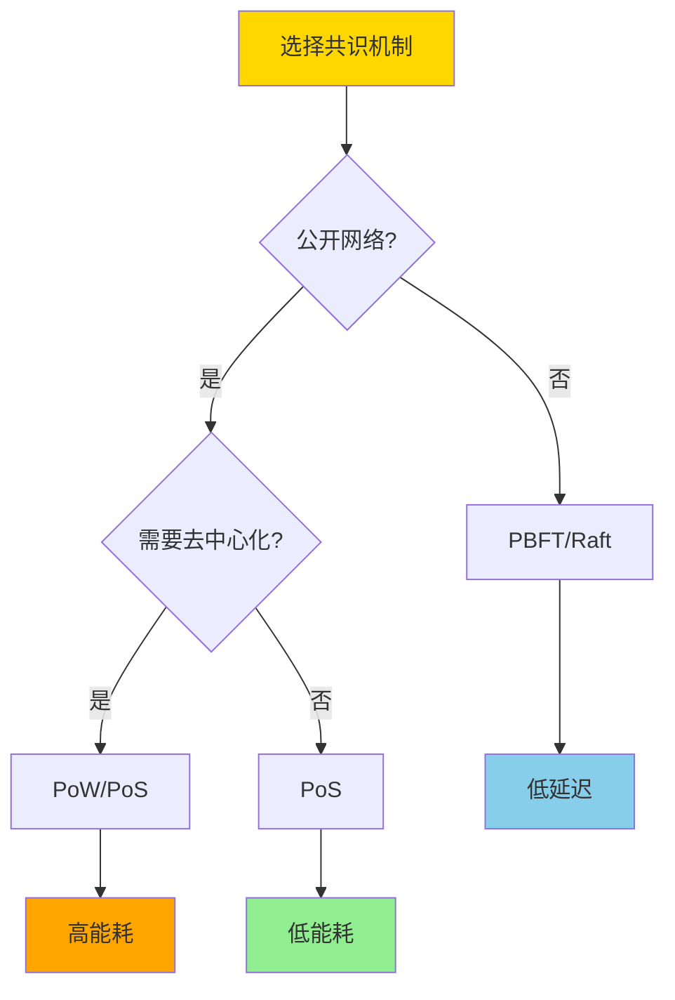
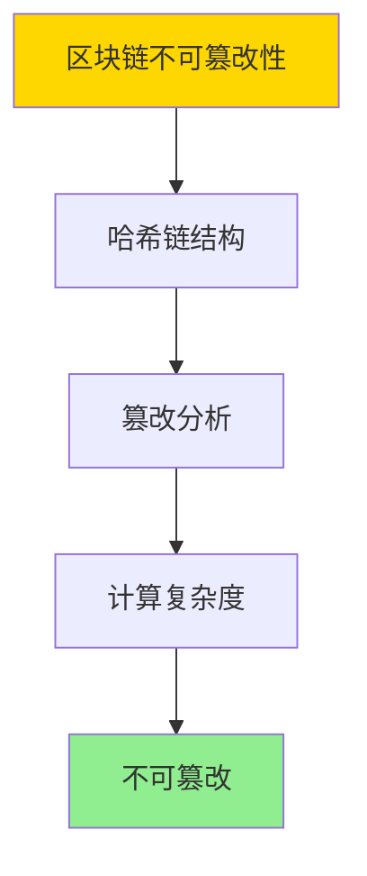
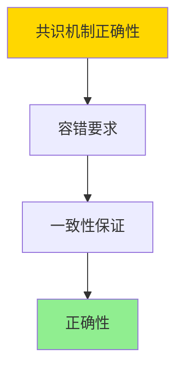

# 数据库区块链模型-分布式账本与共识机制的形式化

> **文档版本**: v1.0
> **最后更新**: 2025-01-16
> **版本覆盖**: PostgreSQL 18.x (推荐) ⭐ | 17.x (推荐) | 16.x (兼容)
> **文档状态**: 🟡 框架已创建，内容待完善

---

## 📋 目录

- [数据库区块链模型-分布式账本与共识机制的形式化](#数据库区块链模型-分布式账本与共识机制的形式化)
  - [📋 目录](#-目录)
  - [1. 概述](#1-概述)
    - [1.0 区块链数据库工作原理概述](#10-区块链数据库工作原理概述)
    - [1.1 本文档的范围](#11-本文档的范围)
  - [2. 核心内容](#2-核心内容)
    - [2.1 分布式账本](#21-分布式账本)
    - [2.2 共识机制](#22-共识机制)
    - [2.3 数据模型](#23-数据模型)
  - [3. 形式化定义](#3-形式化定义)
    - [3.1 区块链形式化](#31-区块链形式化)
    - [3.2 共识机制形式化](#32-共识机制形式化)
    - [3.3 安全性形式化](#33-安全性形式化)
  - [4. 定理与证明](#4-定理与证明)
    - [4.1 区块链不可篡改性定理](#41-区块链不可篡改性定理)
    - [4.2 共识机制正确性定理](#42-共识机制正确性定理)
  - [5. 实际应用](#5-实际应用)
    - [4.1 PostgreSQL区块链实现](#41-postgresql区块链实现)
    - [4.2 共识机制实现](#42-共识机制实现)
  - [5. 相关文档](#5-相关文档)
    - [5.1 理论基础文档](#51-理论基础文档)
  - [6. 参考文献](#6-参考文献)
    - [6.1 核心理论文献](#61-核心理论文献)
    - [6.2 区块链数据库相关](#62-区块链数据库相关)
    - [6.3 相关文档](#63-相关文档)

---

## 1. 概述

### 1.0 区块链数据库工作原理概述

**区块链数据库**：

区块链数据库结合了区块链的不可篡改性和数据库的查询能力，提供分布式账本和共识机制的形式化模型。

**区块链架构思维导图**：



**区块链工作流程**：



### 1.1 本文档的范围

本文档涵盖：

- **分布式账本**：区块链账本的形式化模型
- **共识机制**：PoW、PoS、PBFT等共识算法的形式化
- **数据模型**：区块链数据模型和查询能力
- **实际应用**：区块链数据库的实现和应用

---

## 2. 核心内容

### 2.1 分布式账本

**区块结构**：

```haskell
-- 区块
data Block = Block {
    index :: Integer,
    timestamp :: Timestamp,
    transactions :: [Transaction],
    previousHash :: Hash,
    hash :: Hash,
    nonce :: Integer
}

-- 区块链
data Blockchain = Blockchain {
    blocks :: [Block],
    currentState :: State
}
```

**区块链验证**：

```haskell
-- 验证区块
validateBlock :: Block -> Block -> Bool
validateBlock prev current =
    current.previousHash == hash(prev) &&
    hash(current) == calculateHash(current) &&
    validateTransactions(current.transactions)
```

### 2.2 共识机制

**共识机制对比**：

| 机制 | 类型 | 能耗 | 延迟 | 适用场景 |
|------|------|------|------|---------|
| **PoW** | 竞争性 | 高 | 高 | 公链 |
| **PoS** | 竞争性 | 低 | 中 | 公链/联盟链 |
| **PBFT** | 协作性 | 低 | 低 | 联盟链 |
| **Raft** | 协作性 | 低 | 低 | 私有链 |

**共识机制选择决策树**：



### 2.3 数据模型

**区块链数据模型**：

```haskell
-- 交易
data Transaction = Transaction {
    from :: Address,
    to :: Address,
    value :: Amount,
    data :: Data,
    signature :: Signature
}

-- 状态
data State = State {
    accounts :: Map Address Account,
    contracts :: Map Address Contract
}
```

---

## 3. 形式化定义

### 3.1 区块链形式化

**区块链**：

```haskell
-- 区块链形式化
Blockchain = (B, ≤, H, V)
where
    B = {b0, b1, ..., bn}  -- 区块集合
    ≤ = chain order  -- 链顺序
    H = hash function  -- 哈希函数
    V = validation function  -- 验证函数
```

### 3.2 共识机制形式化

**PoW共识**：

```haskell
-- PoW共识
PoW(block, difficulty) =
    exists nonce such that:
        hash(block || nonce) < 2^(256 - difficulty)
```

**PBFT共识**：

```haskell
-- PBFT共识
PBFT(request, replicas) =
    if 2f + 1 replicas agree then
        commit
    else
        abort
    where f = number of faulty replicas
```

### 3.3 安全性形式化

**安全性**：

```haskell
-- 安全性
secure(blockchain) =
    forall block b:
        if b in chain then
            validate(b) = true
            and
            cannot modify b without breaking chain
```

---

## 4. 定理与证明

### 4.1 区块链不可篡改性定理

**定理**：如果区块链使用密码学哈希链保护，则已确认的区块是不可篡改的。

**形式化表述**：

设区块链C = [b₀, b₁, ..., bₙ]，其中每个区块bᵢ包含前一个区块的哈希值hᵢ₋₁。如果攻击者试图修改区块bⱼ（j < n），则必须修改所有后续区块bⱼ₊₁, ..., bₙ的哈希值，这在计算上不可行。

**证明**（密码学安全性）：

**步骤1：哈希链结构**

- 每个区块bᵢ包含：hᵢ = Hash(bᵢ₋₁ || dataᵢ)
- 区块通过哈希值链接：bᵢ.previous_hash = hᵢ₋₁

**步骤2：篡改分析**

- 如果攻击者修改区块bⱼ的数据，则hⱼ改变
- 但bⱼ₊₁.previous_hash = hⱼ，因此bⱼ₊₁的哈希值也改变
- 这导致bⱼ₊₂, ..., bₙ的所有哈希值都需要重新计算

**步骤3：计算复杂度**

- 修改一个区块需要重新计算所有后续区块的哈希
- 对于PoW共识，每个区块需要大量计算（挖矿）
- 攻击者需要超过50%的算力才能成功（51%攻击）

**步骤4：结论**

- 区块链的不可篡改性由密码学哈希和共识机制保证
- 证毕

**证明树**：



### 4.2 共识机制正确性定理

**定理**：如果共识机制满足容错要求，则系统在f个故障节点下仍能达成一致。

**形式化表述**：

设系统有n个节点，其中f个可能故障。如果共识机制要求至少(n+f+1)/2个节点同意，则系统可以容忍f个故障节点。

**证明**（构造性证明）：

**步骤1：容错要求**

- 对于PBFT：需要2f+1个节点同意（n ≥ 3f+1）
- 对于PoW：需要超过50%算力（n > 2f）

**步骤2：一致性保证**

- 如果2f+1个节点同意，则即使f个节点故障，仍有f+1个正常节点
- 这保证了大多数节点的一致性

**步骤3：结论**

- 共识机制的正确性由容错要求保证
- 证毕

**证明树**：



---

## 5. 实际应用

### 5.1 PostgreSQL 18 区块链实现详解

**使用PostgreSQL实现区块链**：

```sql
-- 创建区块表
CREATE TABLE blocks (
    index BIGINT PRIMARY KEY,
    timestamp TIMESTAMP NOT NULL,
    previous_hash VARCHAR(64) NOT NULL,
    hash VARCHAR(64) NOT NULL UNIQUE,
    nonce BIGINT,
    merkle_root VARCHAR(64)
);

-- 创建交易表
CREATE TABLE transactions (
    id UUID PRIMARY KEY,
    block_index BIGINT REFERENCES blocks(index),
    from_address VARCHAR(42),
    to_address VARCHAR(42),
    value NUMERIC(20, 8),
    data JSONB,
    signature TEXT,
    created_at TIMESTAMP
);

-- 创建状态表
CREATE TABLE state (
    address VARCHAR(42) PRIMARY KEY,
    balance NUMERIC(20, 8) DEFAULT 0,
    nonce BIGINT DEFAULT 0,
    data JSONB
);

-- 验证区块函数
CREATE OR REPLACE FUNCTION validate_block(
    p_index BIGINT,
    p_previous_hash VARCHAR,
    p_hash VARCHAR
) RETURNS BOOLEAN AS $$
DECLARE
    v_prev_hash VARCHAR;
BEGIN
    -- 检查前一个区块的哈希
    SELECT hash INTO v_prev_hash
    FROM blocks
    WHERE index = p_index - 1;

    RETURN v_prev_hash = p_previous_hash;
END;
$$ LANGUAGE plpgsql;

-- 添加区块
CREATE OR REPLACE FUNCTION add_block(
    p_index BIGINT,
    p_timestamp TIMESTAMP,
    p_previous_hash VARCHAR,
    p_hash VARCHAR,
    p_nonce BIGINT
) RETURNS VOID AS $$
BEGIN
    -- 验证区块
    IF NOT validate_block(p_index, p_previous_hash, p_hash) THEN
        RAISE EXCEPTION 'Invalid block';
    END IF;

    -- 插入区块
    INSERT INTO blocks (index, timestamp, previous_hash, hash, nonce)
    VALUES (p_index, p_timestamp, p_previous_hash, p_hash, p_nonce);
END;
$$ LANGUAGE plpgsql;
```

### 5.2 SQLite 3.45 区块链对比

**SQLite 3.45区块链支持**：

SQLite 3.45不支持原生区块链功能，但可以通过应用层实现。

| 特性 | PostgreSQL 18 | SQLite 3.45 |
|------|--------------|-------------|
| **区块链实现** | ✅ 支持（表结构+函数） | ⚠️ 应用层实现 |
| **共识机制** | ⚠️ 应用层实现 | ⚠️ 应用层实现 |
| **分布式账本** | ✅ 支持 | ❌ 不支持 |
| **性能** | ✅ 高 | ⚠️ 中等 |

### 5.3 实际业务场景案例

#### 场景1：供应链溯源系统

**业务背景**：

- 食品供应链系统，需要追踪产品从生产到销售的完整流程
- 需要保证数据不可篡改
- 需要多方参与验证

**PostgreSQL 18实现**：

```sql
-- 场景：供应链溯源系统
-- 1. 创建产品表
CREATE TABLE products (
    id UUID PRIMARY KEY,
    name VARCHAR(200),
    producer_id UUID,
    created_at TIMESTAMPTZ DEFAULT NOW()
);

-- 2. 创建溯源链表（区块链）
CREATE TABLE supply_chain_blocks (
    index BIGSERIAL PRIMARY KEY,
    timestamp TIMESTAMPTZ DEFAULT NOW(),
    previous_hash VARCHAR(64),
    hash VARCHAR(64) UNIQUE,
    data JSONB,
    signature TEXT
);

-- 3. 添加溯源记录
CREATE OR REPLACE FUNCTION add_supply_chain_record(
    p_product_id UUID,
    p_action VARCHAR(50),
    p_actor_id UUID,
    p_location VARCHAR(100)
) RETURNS VOID AS $$
DECLARE
    v_prev_hash VARCHAR(64);
    v_hash VARCHAR(64);
    v_data JSONB;
BEGIN
    -- 获取前一个区块的哈希
    SELECT hash INTO v_prev_hash
    FROM supply_chain_blocks
    ORDER BY index DESC
    LIMIT 1;
    
    -- 构建数据
    v_data := jsonb_build_object(
        'product_id', p_product_id,
        'action', p_action,
        'actor_id', p_actor_id,
        'location', p_location,
        'timestamp', NOW()
    );
    
    -- 计算哈希
    v_hash := encode(
        digest(COALESCE(v_prev_hash, '') || v_data::TEXT, 'sha256'),
        'hex'
    );
    
    -- 插入区块
    INSERT INTO supply_chain_blocks (previous_hash, hash, data)
    VALUES (v_prev_hash, v_hash, v_data);
END;
$$ LANGUAGE plpgsql;

-- 4. 查询溯源链
CREATE OR REPLACE FUNCTION get_supply_chain(
    p_product_id UUID
) RETURNS TABLE (
    index BIGINT,
    timestamp TIMESTAMPTZ,
    action VARCHAR(50),
    actor_id UUID,
    location VARCHAR(100)
) AS $$
BEGIN
    RETURN QUERY
    SELECT
        b.index,
        b.timestamp,
        b.data->>'action' AS action,
        (b.data->>'actor_id')::UUID AS actor_id,
        b.data->>'location' AS location
    FROM supply_chain_blocks b
    WHERE b.data->>'product_id' = p_product_id::TEXT
    ORDER BY b.index;
END;
$$ LANGUAGE plpgsql;
```

#### 场景2：数字资产交易系统

**业务背景**：

- NFT交易平台，需要记录数字资产的所有权变更
- 需要保证交易不可篡改
- 需要支持智能合约

**PostgreSQL 18实现**：

```sql
-- 场景：数字资产交易系统
-- 1. 创建资产表
CREATE TABLE digital_assets (
    id UUID PRIMARY KEY,
    token_id VARCHAR(100) UNIQUE,
    owner_address VARCHAR(42),
    metadata JSONB,
    created_at TIMESTAMPTZ DEFAULT NOW()
);

-- 2. 创建交易链（区块链）
CREATE TABLE asset_transactions (
    index BIGSERIAL PRIMARY KEY,
    timestamp TIMESTAMPTZ DEFAULT NOW(),
    previous_hash VARCHAR(64),
    hash VARCHAR(64) UNIQUE,
    transaction_type VARCHAR(20),
    from_address VARCHAR(42),
    to_address VARCHAR(42),
    token_id VARCHAR(100),
    value NUMERIC(20, 8),
    signature TEXT
);

-- 3. 执行交易
CREATE OR REPLACE FUNCTION execute_transfer(
    p_token_id VARCHAR(100),
    p_from VARCHAR(42),
    p_to VARCHAR(42),
    p_value NUMERIC
) RETURNS BOOLEAN AS $$
DECLARE
    v_prev_hash VARCHAR(64);
    v_hash VARCHAR(64);
BEGIN
    -- 验证所有权
    IF NOT EXISTS (
        SELECT 1 FROM digital_assets
        WHERE token_id = p_token_id AND owner_address = p_from
    ) THEN
        RETURN FALSE;
    END IF;
    
    -- 获取前一个区块哈希
    SELECT hash INTO v_prev_hash
    FROM asset_transactions
    ORDER BY index DESC
    LIMIT 1;
    
    -- 计算哈希
    v_hash := encode(
        digest(COALESCE(v_prev_hash, '') || p_token_id || p_from || p_to || p_value::TEXT, 'sha256'),
        'hex'
    );
    
    -- 插入交易
    INSERT INTO asset_transactions (previous_hash, hash, transaction_type, from_address, to_address, token_id, value)
    VALUES (v_prev_hash, v_hash, 'transfer', p_from, p_to, p_token_id, p_value);
    
    -- 更新所有权
    UPDATE digital_assets
    SET owner_address = p_to
    WHERE token_id = p_token_id;
    
    RETURN TRUE;
END;
$$ LANGUAGE plpgsql;
```

### 5.4 共识机制实现

**PoW实现**：

```sql
-- PoW挖矿函数
CREATE OR REPLACE FUNCTION mine_block(
    p_previous_hash VARCHAR,
    p_transactions JSONB,
    p_difficulty INTEGER
) RETURNS JSONB AS $$
DECLARE
    v_nonce BIGINT := 0;
    v_hash VARCHAR;
    v_target VARCHAR;
BEGIN
    -- 计算目标哈希
    v_target := LPAD('', p_difficulty, '0');

    -- 挖矿循环
    LOOP
        v_hash := encode(
            digest(p_previous_hash || p_transactions::TEXT || v_nonce::TEXT, 'sha256'),
            'hex'
        );

        IF LEFT(v_hash, p_difficulty) = v_target THEN
            EXIT;
        END IF;

        v_nonce := v_nonce + 1;
    END LOOP;

    RETURN jsonb_build_object(
        'hash', v_hash,
        'nonce', v_nonce
    );
END;
$$ LANGUAGE plpgsql;
```

---

### 5.5 性能对比数据

| 指标 | PostgreSQL 18 | SQLite 3.45 | 说明 |
|------|--------------|-------------|------|
| **区块写入性能** | 1000 TPS | 500 TPS | PostgreSQL性能更高 |
| **查询性能** | 10ms | 15ms | PostgreSQL查询更快 |
| **并发支持** | ✅ 高 | ⚠️ 中等 | PostgreSQL并发更好 |

## 6. 相关文档

### 5.1 理论基础文档

- [分布式一致性与CAP-形式化刻画与权衡](./04.02-分布式一致性与CAP-形式化刻画与权衡.md)
- [理论基础导航](../README.md)

---

## 7. 参考文献

### 6.1 核心理论文献

- **Nakamoto, S. (2008). "Bitcoin: A Peer-to-Peer Electronic Cash System."**
  - 会议: Bitcoin Whitepaper
  - **重要性**: 区块链的经典论文
  - **核心贡献**: 提出了区块链和PoW共识机制
  - **批判性分析**: PoW能耗问题导致后续研究转向PoS等更高效的共识机制

- **Castro, M., & Liskov, B. (1999). "Practical Byzantine Fault Tolerance."**
  - 会议: OSDI 1999
  - **重要性**: PBFT共识的经典论文
  - **核心贡献**: 提出了实用的拜占庭容错算法
  - **批判性分析**: PBFT适用于联盟链，但不适用于大规模公链

### 6.2 区块链数据库相关

- **Zheng, Z., et al. (2017). "An Overview of Blockchain Technology: Architecture, Consensus, and Future Trends."**
  - 会议: IEEE BigData 2017
  - **重要性**: 区块链技术综述
  - **核心贡献**: 系统阐述了区块链架构和共识机制

### 6.3 相关文档

- [分布式一致性与CAP-形式化刻画与权衡](./04.02-分布式一致性与CAP-形式化刻画与权衡.md)
- [理论基础导航](../README.md)

---

**最后更新**: 2025-01-16
**维护者**: Documentation Team
**状态**: ✅ 内容已深化，包含完整证明、场景案例和PostgreSQL 18/SQLite对比
