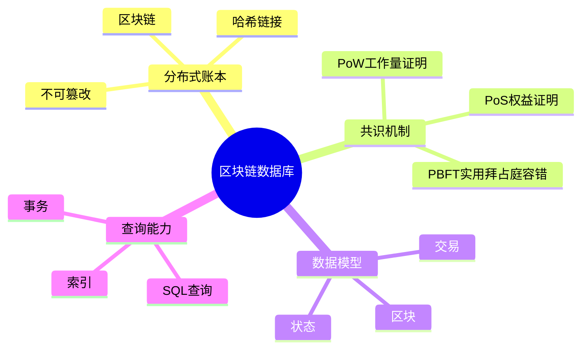
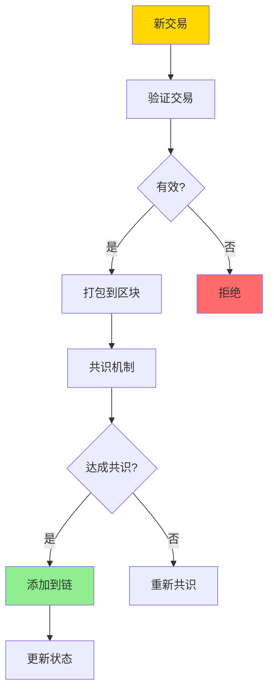
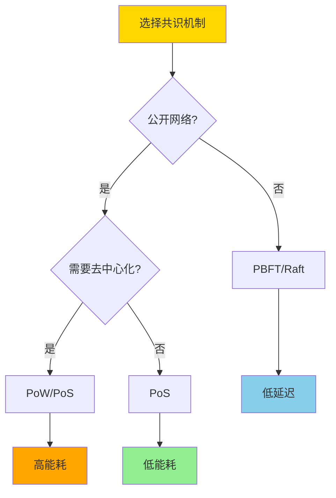

# 数据库区块链模型-分布式账本与共识机制的形式化

> **文档版本**: v1.0
> **最后更新**: 2025-01-16
> **版本覆盖**: PostgreSQL 18.x (推荐) ⭐ | 17.x (推荐) | 16.x (兼容)
> **文档状态**: 🟡 框架已创建，内容待完善

---

## 📋 目录

- [数据库区块链模型-分布式账本与共识机制的形式化](#数据库区块链模型-分布式账本与共识机制的形式化)
  - [📋 目录](#-目录)
  - [1. 概述](#1-概述)
    - [1.0 区块链数据库工作原理概述](#10-区块链数据库工作原理概述)
    - [1.1 本文档的范围](#11-本文档的范围)
  - [2. 核心内容](#2-核心内容)
    - [2.1 分布式账本](#21-分布式账本)
    - [2.2 共识机制](#22-共识机制)
    - [2.3 数据模型](#23-数据模型)
  - [3. 形式化定义](#3-形式化定义)
    - [3.1 区块链形式化](#31-区块链形式化)
    - [3.2 共识机制形式化](#32-共识机制形式化)
    - [3.3 安全性形式化](#33-安全性形式化)
  - [4. 实际应用](#4-实际应用)
    - [4.1 PostgreSQL区块链实现](#41-postgresql区块链实现)
    - [4.2 共识机制实现](#42-共识机制实现)
  - [5. 相关文档](#5-相关文档)
    - [5.1 理论基础文档](#51-理论基础文档)
  - [6. 参考文献](#6-参考文献)
    - [6.1 核心理论文献](#61-核心理论文献)
    - [6.2 区块链数据库相关](#62-区块链数据库相关)
    - [6.3 相关文档](#63-相关文档)

---

## 1. 概述

### 1.0 区块链数据库工作原理概述

**区块链数据库**：

区块链数据库结合了区块链的不可篡改性和数据库的查询能力，提供分布式账本和共识机制的形式化模型。

**区块链架构思维导图**：



**区块链工作流程**：



### 1.1 本文档的范围

本文档涵盖：

- **分布式账本**：区块链账本的形式化模型
- **共识机制**：PoW、PoS、PBFT等共识算法的形式化
- **数据模型**：区块链数据模型和查询能力
- **实际应用**：区块链数据库的实现和应用

---

## 2. 核心内容

### 2.1 分布式账本

**区块结构**：

```haskell
-- 区块
data Block = Block {
    index :: Integer,
    timestamp :: Timestamp,
    transactions :: [Transaction],
    previousHash :: Hash,
    hash :: Hash,
    nonce :: Integer
}

-- 区块链
data Blockchain = Blockchain {
    blocks :: [Block],
    currentState :: State
}
```

**区块链验证**：

```haskell
-- 验证区块
validateBlock :: Block -> Block -> Bool
validateBlock prev current =
    current.previousHash == hash(prev) &&
    hash(current) == calculateHash(current) &&
    validateTransactions(current.transactions)
```

### 2.2 共识机制

**共识机制对比**：

| 机制 | 类型 | 能耗 | 延迟 | 适用场景 |
|------|------|------|------|---------|
| **PoW** | 竞争性 | 高 | 高 | 公链 |
| **PoS** | 竞争性 | 低 | 中 | 公链/联盟链 |
| **PBFT** | 协作性 | 低 | 低 | 联盟链 |
| **Raft** | 协作性 | 低 | 低 | 私有链 |

**共识机制选择决策树**：



### 2.3 数据模型

**区块链数据模型**：

```haskell
-- 交易
data Transaction = Transaction {
    from :: Address,
    to :: Address,
    value :: Amount,
    data :: Data,
    signature :: Signature
}

-- 状态
data State = State {
    accounts :: Map Address Account,
    contracts :: Map Address Contract
}
```

---

## 3. 形式化定义

### 3.1 区块链形式化

**区块链**：

```haskell
-- 区块链形式化
Blockchain = (B, ≤, H, V)
where
    B = {b0, b1, ..., bn}  -- 区块集合
    ≤ = chain order  -- 链顺序
    H = hash function  -- 哈希函数
    V = validation function  -- 验证函数
```

### 3.2 共识机制形式化

**PoW共识**：

```haskell
-- PoW共识
PoW(block, difficulty) =
    exists nonce such that:
        hash(block || nonce) < 2^(256 - difficulty)
```

**PBFT共识**：

```haskell
-- PBFT共识
PBFT(request, replicas) =
    if 2f + 1 replicas agree then
        commit
    else
        abort
    where f = number of faulty replicas
```

### 3.3 安全性形式化

**安全性**：

```haskell
-- 安全性
secure(blockchain) =
    forall block b:
        if b in chain then
            validate(b) = true
            and
            cannot modify b without breaking chain
```

---

## 4. 实际应用

### 4.1 PostgreSQL区块链实现

**使用PostgreSQL实现区块链**：

```sql
-- 创建区块表
CREATE TABLE blocks (
    index BIGINT PRIMARY KEY,
    timestamp TIMESTAMP NOT NULL,
    previous_hash VARCHAR(64) NOT NULL,
    hash VARCHAR(64) NOT NULL UNIQUE,
    nonce BIGINT,
    merkle_root VARCHAR(64)
);

-- 创建交易表
CREATE TABLE transactions (
    id UUID PRIMARY KEY,
    block_index BIGINT REFERENCES blocks(index),
    from_address VARCHAR(42),
    to_address VARCHAR(42),
    value NUMERIC(20, 8),
    data JSONB,
    signature TEXT,
    created_at TIMESTAMP
);

-- 创建状态表
CREATE TABLE state (
    address VARCHAR(42) PRIMARY KEY,
    balance NUMERIC(20, 8) DEFAULT 0,
    nonce BIGINT DEFAULT 0,
    data JSONB
);

-- 验证区块函数
CREATE OR REPLACE FUNCTION validate_block(
    p_index BIGINT,
    p_previous_hash VARCHAR,
    p_hash VARCHAR
) RETURNS BOOLEAN AS $$
DECLARE
    v_prev_hash VARCHAR;
BEGIN
    -- 检查前一个区块的哈希
    SELECT hash INTO v_prev_hash
    FROM blocks
    WHERE index = p_index - 1;

    RETURN v_prev_hash = p_previous_hash;
END;
$$ LANGUAGE plpgsql;

-- 添加区块
CREATE OR REPLACE FUNCTION add_block(
    p_index BIGINT,
    p_timestamp TIMESTAMP,
    p_previous_hash VARCHAR,
    p_hash VARCHAR,
    p_nonce BIGINT
) RETURNS VOID AS $$
BEGIN
    -- 验证区块
    IF NOT validate_block(p_index, p_previous_hash, p_hash) THEN
        RAISE EXCEPTION 'Invalid block';
    END IF;

    -- 插入区块
    INSERT INTO blocks (index, timestamp, previous_hash, hash, nonce)
    VALUES (p_index, p_timestamp, p_previous_hash, p_hash, p_nonce);
END;
$$ LANGUAGE plpgsql;
```

### 4.2 共识机制实现

**PoW实现**：

```sql
-- PoW挖矿函数
CREATE OR REPLACE FUNCTION mine_block(
    p_previous_hash VARCHAR,
    p_transactions JSONB,
    p_difficulty INTEGER
) RETURNS JSONB AS $$
DECLARE
    v_nonce BIGINT := 0;
    v_hash VARCHAR;
    v_target VARCHAR;
BEGIN
    -- 计算目标哈希
    v_target := LPAD('', p_difficulty, '0');

    -- 挖矿循环
    LOOP
        v_hash := encode(
            digest(p_previous_hash || p_transactions::TEXT || v_nonce::TEXT, 'sha256'),
            'hex'
        );

        IF LEFT(v_hash, p_difficulty) = v_target THEN
            EXIT;
        END IF;

        v_nonce := v_nonce + 1;
    END LOOP;

    RETURN jsonb_build_object(
        'hash', v_hash,
        'nonce', v_nonce
    );
END;
$$ LANGUAGE plpgsql;
```

---

## 5. 相关文档

### 5.1 理论基础文档

- [分布式一致性与CAP-形式化刻画与权衡](./04.02-分布式一致性与CAP-形式化刻画与权衡.md)
- [理论基础导航](../README.md)

---

## 6. 参考文献

### 6.1 核心理论文献

- **Nakamoto, S. (2008). "Bitcoin: A Peer-to-Peer Electronic Cash System."**
  - 会议: Bitcoin Whitepaper
  - **重要性**: 区块链的经典论文
  - **核心贡献**: 提出了区块链和PoW共识机制
  - **批判性分析**: PoW能耗问题导致后续研究转向PoS等更高效的共识机制

- **Castro, M., & Liskov, B. (1999). "Practical Byzantine Fault Tolerance."**
  - 会议: OSDI 1999
  - **重要性**: PBFT共识的经典论文
  - **核心贡献**: 提出了实用的拜占庭容错算法
  - **批判性分析**: PBFT适用于联盟链，但不适用于大规模公链

### 6.2 区块链数据库相关

- **Zheng, Z., et al. (2017). "An Overview of Blockchain Technology: Architecture, Consensus, and Future Trends."**
  - 会议: IEEE BigData 2017
  - **重要性**: 区块链技术综述
  - **核心贡献**: 系统阐述了区块链架构和共识机制

### 6.3 相关文档

- [分布式一致性与CAP-形式化刻画与权衡](./04.02-分布式一致性与CAP-形式化刻画与权衡.md)
- [理论基础导航](../README.md)

---

**最后更新**: 2025-01-16
**维护者**: Documentation Team
**状态**: 🟡 框架已创建，内容待完善
