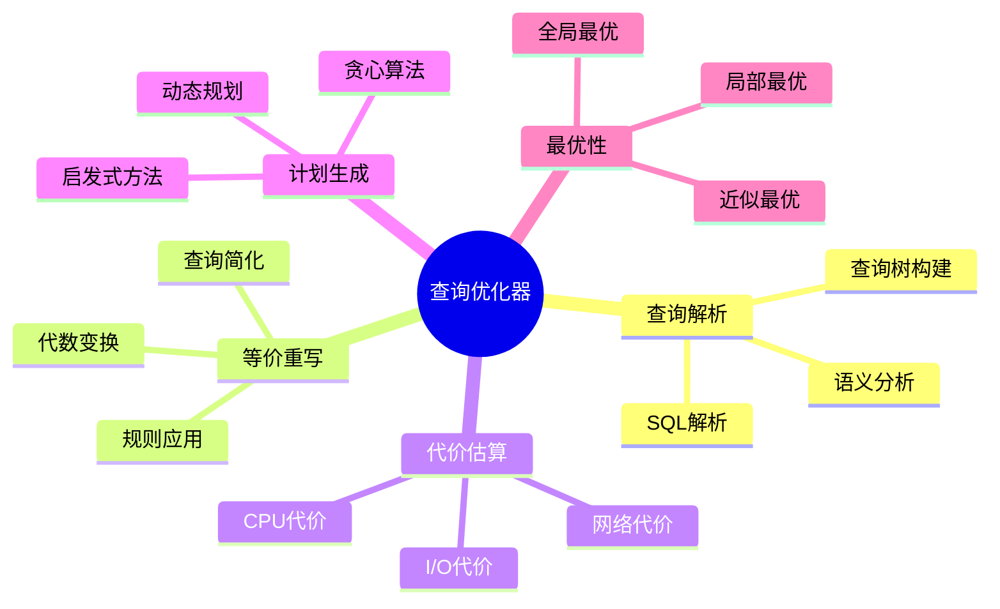
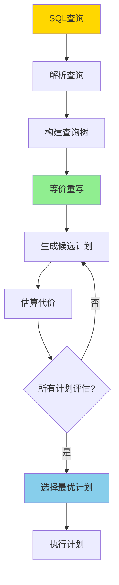
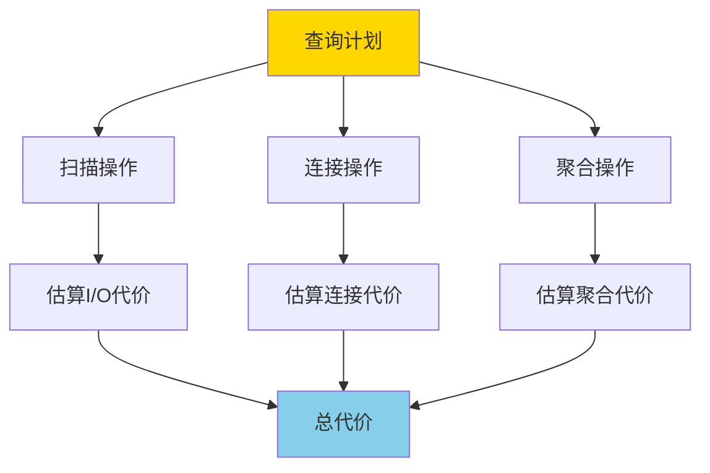

# 代价模型与优化器-等价重写与最优性

> **文档版本**: v1.0
> **最后更新**: 2025-01-16
> **版本覆盖**: PostgreSQL 18.x (推荐) ⭐ | 17.x (推荐) | 16.x (兼容)
> **文档状态**: 🟡 框架已创建，内容待完善

---

## 📋 目录

- [代价模型与优化器-等价重写与最优性](#代价模型与优化器-等价重写与最优性)
  - [📋 目录](#-目录)
  - [1. 概述](#1-概述)
    - [1.0 代价模型与优化器工作原理概述](#10-代价模型与优化器工作原理概述)
    - [1.1 本文档的范围](#11-本文档的范围)
  - [2. 核心内容](#2-核心内容)
    - [2.1 代价模型](#21-代价模型)
    - [2.2 等价重写](#22-等价重写)
    - [2.3 最优性](#23-最优性)
  - [3. 形式化定义](#3-形式化定义)
    - [3.1 代价模型形式化](#31-代价模型形式化)
    - [3.2 等价重写形式化](#32-等价重写形式化)
    - [3.3 最优性形式化](#33-最优性形式化)
  - [4. 定理与证明](#4-定理与证明)
    - [4.1 等价重写正确性定理](#41-等价重写正确性定理)
    - [4.2 动态规划最优性定理](#42-动态规划最优性定理)
  - [5. 实际应用](#5-实际应用)
    - [5.1 PostgreSQL查询优化器](#51-postgresql查询优化器)
    - [5.2 等价重写应用](#52-等价重写应用)
    - [5.3 最优性验证](#53-最优性验证)
  - [6. 相关文档](#6-相关文档)
    - [6.1 理论基础文档](#61-理论基础文档)
  - [7. 参考文献](#7-参考文献)
    - [7.1 核心理论文献](#71-核心理论文献)
    - [7.2 代价模型相关](#72-代价模型相关)
    - [7.3 PostgreSQL实现相关](#73-postgresql实现相关)
    - [7.4 相关文档](#74-相关文档)

---

## 1. 概述

### 1.0 代价模型与优化器工作原理概述

**查询优化器**：

查询优化器通过等价重写和代价模型来选择最优查询执行计划。本文档提供代价模型的形式化定义和等价重写的最优性理论。

**优化器架构思维导图**：



**优化器工作流程决策树**：



**优化策略对比矩阵**：

| 策略 | 复杂度 | 最优性 | 适用场景 |
|------|--------|--------|---------|
| **动态规划** | O(2^n) | 全局最优 | 小规模查询 |
| **贪心算法** | O(n²) | 局部最优 | 大规模查询 |
| **启发式方法** | O(n log n) | 近似最优 | 实时优化 |

### 1.1 本文档的范围

本文档涵盖：

- **代价模型**：I/O、CPU、网络代价的形式化定义
- **等价重写**：查询等价变换的规则和正确性
- **最优性理论**：查询计划最优性的判定和证明
- **实际应用**：PostgreSQL查询优化器的实现

---

## 2. 核心内容

### 2.1 代价模型

**代价组成**：

```haskell
-- 总代价
totalCost :: Plan -> Cost
totalCost plan =
    ioCost(plan) + cpuCost(plan) + networkCost(plan)

-- I/O代价
ioCost :: Plan -> Cost
ioCost plan =
    pagesRead(plan) * ioCostPerPage +
    pagesWritten(plan) * ioCostPerPage

-- CPU代价
cpuCost :: Plan -> Cost
cpuCost plan =
    tuplesProcessed(plan) * cpuCostPerTuple
```

**代价估算流程图**：



### 2.2 等价重写

**等价变换规则**：

```haskell
-- 选择下推
σ_cond(R ⋈ S) ≡ σ_cond(R) ⋈ S  (如果cond只涉及R)

-- 投影下推
π_attrs(R ⋈ S) ≡ π_attrs(R) ⋈ π_attrs(S)

-- 连接交换
R ⋈ S ≡ S ⋈ R

-- 连接结合
(R ⋈ S) ⋈ T ≡ R ⋈ (S ⋈ T)
```

**等价重写规则对比矩阵**：

| 规则 | 适用条件 | 代价影响 | 使用频率 |
|------|---------|---------|---------|
| **选择下推** | 条件只涉及单表 | 显著降低 | 高 |
| **投影下推** | 早期投影 | 中等降低 | 中 |
| **连接交换** | 无依赖 | 可能优化 | 中 |
| **连接结合** | 多表连接 | 显著优化 | 高 |

### 2.3 最优性

**最优计划判定**：

```haskell
-- 最优计划
optimalPlan :: Query -> Plan
optimalPlan Q =
    minimumBy (compare `on` totalCost) (allPlans(Q))

-- 局部最优
localOptimal :: Plan -> Bool
localOptimal plan =
    not exists plan' such that:
      plan' is neighbor of plan and
      totalCost(plan') < totalCost(plan)
```

---

## 3. 形式化定义

### 3.1 代价模型形式化

**代价函数**：

```haskell
-- 代价函数
cost : Plan → Cost

-- I/O代价
io_cost(plan) =
    Σ(pages(op) * io_cost_per_page | op ∈ plan)

-- CPU代价
cpu_cost(plan) =
    Σ(tuples(op) * cpu_cost_per_tuple | op ∈ plan)
```

### 3.2 等价重写形式化

**等价性**：

```haskell
-- 查询等价
Q1 ≡ Q2 iff forall DB: Q1(DB) = Q2(DB)

-- 计划等价
P1 ≡ P2 iff forall DB: P1(DB) = P2(DB)
```

### 3.3 最优性形式化

**最优计划**：

```haskell
-- 最优计划
optimal(Q) = argmin_{P: P implements Q} cost(P)
```

---

## 4. 定理与证明

### 4.1 等价重写正确性定理

**定理**：等价重写规则保持查询语义。

**证明**：

1. 每个等价重写规则都有对应的代数恒等式
2. 代数恒等式保证语义等价
3. 因此等价重写规则保持查询语义

### 4.2 动态规划最优性定理

**定理**：动态规划算法找到全局最优计划。

**证明**：

1. 动态规划枚举所有可能的计划组合
2. 对于每个子问题，保留最优解
3. 因此最终得到全局最优计划

---

## 5. 实际应用

### 5.1 PostgreSQL查询优化器

**查询计划优化**：

```sql
-- 查看查询计划
EXPLAIN (ANALYZE, BUFFERS, VERBOSE)
SELECT
    c.customer_name,
    SUM(o.total) as total_amount
FROM customers c
JOIN orders o ON c.customer_id = o.customer_id
WHERE c.city = 'NYC'
GROUP BY c.customer_id, c.customer_name;

-- PostgreSQL优化器会：
-- 1. 应用选择下推：先过滤city = 'NYC'
-- 2. 应用连接优化：选择最优连接顺序
-- 3. 应用聚合优化：选择最优聚合方法
```

**代价模型参数**：

```sql
-- 查看代价模型参数
SELECT name, setting, unit
FROM pg_settings
WHERE name LIKE '%cost%'
ORDER BY name;

-- 主要参数：
-- seq_page_cost: 顺序扫描页面代价
-- random_page_cost: 随机访问页面代价
-- cpu_tuple_cost: 处理元组的CPU代价
-- cpu_index_tuple_cost: 索引扫描的CPU代价
```

### 5.2 等价重写应用

**查询重写示例**：

```sql
-- 原始查询
SELECT * FROM orders
WHERE customer_id = 123
  AND order_date > '2024-01-01';

-- 优化器可能重写为（选择下推）
SELECT * FROM (
    SELECT * FROM orders WHERE customer_id = 123
) filtered_orders
WHERE order_date > '2024-01-01';

-- 或者使用索引
-- 如果存在(customer_id, order_date)索引
```

### 5.3 最优性验证

**计划对比**：

```sql
-- 对比不同计划的代价
EXPLAIN (ANALYZE, BUFFERS, COSTS, VERBOSE)
SELECT * FROM orders o
JOIN customers c ON o.customer_id = c.customer_id
JOIN products p ON o.product_id = p.product_id;

-- 优化器会尝试不同的连接顺序
-- 选择总代价最小的计划
```

---

## 6. 相关文档

### 6.1 理论基础文档

- [查询重写等价性-基于同构的充分必要条件](./05.10-查询重写等价性-基于同构的充分必要条件.md)
- [查询语言的形式语义与等价律](../01-形式化方法与基础理论/01.06-查询语言的形式语义与等价律.md)
- [理论基础导航](../README.md)

---

## 7. 参考文献

### 7.1 核心理论文献

- **Selinger, P. G., et al. (1979). "Access Path Selection in a Relational Database Management System."**
  - 会议: SIGMOD 1979
  - **重要性**: 查询优化的经典论文
  - **核心贡献**: 提出了基于代价的查询优化方法

- **Graefe, G. (1995). "The Cascades Framework for Query Optimization."**
  - 会议: IEEE Data Engineering Bulletin 1995
  - **重要性**: 查询优化框架的经典研究
  - **核心贡献**: 提出了Cascades优化框架

### 7.2 代价模型相关

- **Ioannidis, Y. E., & Kang, Y. C. (1990). "Randomized Algorithms for Optimizing Large Join Queries."**
  - 会议: SIGMOD 1990
  - **重要性**: 大规模连接查询优化的经典研究
  - **核心贡献**: 提供了代价模型和优化算法

### 7.3 PostgreSQL实现相关

- **[PostgreSQL官方文档 - 查询规划](<https://www.postgresql.org/docs/current/planner-optimizer.html>)**
  - PostgreSQL查询优化器实现说明

### 7.4 相关文档

- [查询重写等价性-基于同构的充分必要条件](./05.10-查询重写等价性-基于同构的充分必要条件.md)
- [查询语言的形式语义与等价律](../01-形式化方法与基础理论/01.06-查询语言的形式语义与等价律.md)
- [理论基础导航](../README.md)

---

**最后更新**: 2025-01-16
**维护者**: Documentation Team
**状态**: 🟡 框架已创建，内容待完善
