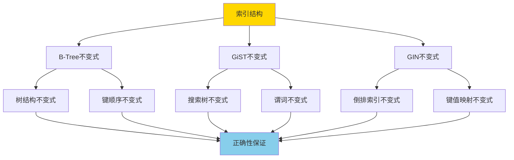
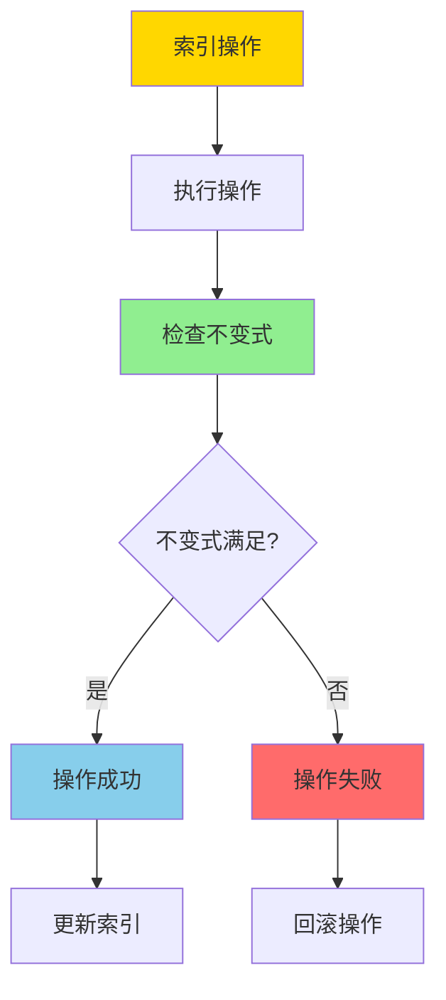
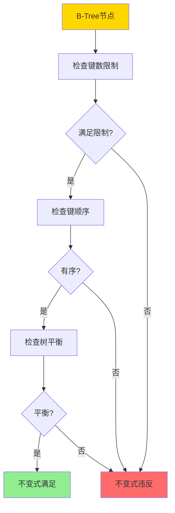
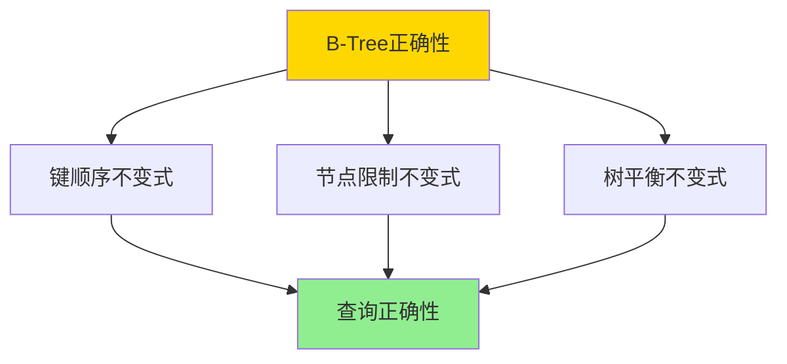

# 索引结构正确性-BTree_GiST_GiN不变式与证明

> **文档版本**: v1.0
> **最后更新**: 2025-01-16
> **版本覆盖**: PostgreSQL 18.x (推荐) ⭐ | 17.x (推荐) | 16.x (兼容)
> **文档状态**: 🟡 框架已创建，内容待完善

---

## 📋 目录

- [索引结构正确性-BTree\_GiST\_GiN不变式与证明](#索引结构正确性-btree_gist_gin不变式与证明)
  - [📋 目录](#-目录)
  - [1. 概述](#1-概述)
    - [1.0 索引结构正确性工作原理概述](#10-索引结构正确性工作原理概述)
    - [1.1 本文档的范围](#11-本文档的范围)
  - [2. 核心内容](#2-核心内容)
    - [2.1 B-Tree不变式](#21-b-tree不变式)
    - [2.2 GiST不变式](#22-gist不变式)
    - [2.3 GIN不变式](#23-gin不变式)
  - [3. 形式化定义](#3-形式化定义)
    - [3.1 B-Tree不变式形式化](#31-b-tree不变式形式化)
    - [3.2 GiST不变式形式化](#32-gist不变式形式化)
  - [4. 定理与证明](#4-定理与证明)
    - [4.1 B-Tree正确性定理](#41-b-tree正确性定理)
  - [5. 实际应用](#5-实际应用)
    - [5.1 PostgreSQL索引](#51-postgresql索引)
  - [6. 相关文档](#6-相关文档)
    - [6.1 理论基础文档](#61-理论基础文档)
  - [7. 参考文献](#7-参考文献)
    - [7.1 核心理论文献](#71-核心理论文献)
    - [7.2 PostgreSQL实现相关](#72-postgresql实现相关)
    - [7.3 相关文档](#73-相关文档)

---

## 1. 概述

### 1.0 索引结构正确性工作原理概述

**索引结构不变式**：

索引结构的不变式（Invariant）是索引在任何操作后都必须满足的性质。这些不变式保证了索引的正确性和查询结果的准确性。

**索引不变式体系**：



**不变式验证流程**：



### 1.1 本文档的范围

本文档涵盖：

- **B-Tree不变式**：B-Tree索引结构的不变式定义和证明
- **GiST不变式**：GiST索引结构的不变式定义和证明
- **GIN不变式**：GIN索引结构的不变式定义和证明
- **正确性证明**：严格证明这些不变式保证索引正确性

---

## 2. 核心内容

### 2.1 B-Tree不变式

**B-Tree不变式定义**：

```haskell
-- B-Tree不变式
data BTreeInvariant = BTreeInvariant {
    nodeKeyLimit :: (Int, Int),  -- (min, max)
    keyOrdering :: Bool,  -- 键有序
    treeBalance :: Bool  -- 树平衡
}

-- 节点键数限制
nodeKeyLimit :: BTreeNode -> Bool
nodeKeyLimit node =
    let (minKeys, maxKeys) = (⌈m/2⌉ - 1, m - 1)
    in minKeys <= length(node.keys) <= maxKeys
```

**B-Tree不变式验证**：



### 2.2 GiST不变式

**GiST不变式**：

```haskell
-- GiST不变式
data GiSTInvariant = GiSTInvariant {
    consistent :: Predicate -> Bool,  -- 一致性谓词
    union :: [Predicate] -> Predicate,  -- 并集操作
    compress :: Value -> Predicate,  -- 压缩操作
    decompress :: Predicate -> Value  -- 解压操作
}
```

### 2.3 GIN不变式

**GIN不变式**：

```haskell
-- GIN不变式
data GINInvariant = GINInvariant {
    keyValueMapping :: Map Key [Value],  -- 键值映射
    invertedIndex :: Bool  -- 倒排索引结构
}
```

**索引类型对比**：

| 索引类型 | 不变式 | 适用场景 | 查询类型 |
|---------|--------|---------|---------|
| **B-Tree** | 键顺序、节点限制 | 范围查询 | 等值、范围 |
| **GiST** | 一致性谓词 | 空间/全文 | 复杂谓词 |
| **GIN** | 键值映射 | 数组/JSON | 包含查询 |

---

## 3. 形式化定义

### 3.1 B-Tree不变式形式化

**B-Tree不变式**：

```haskell
-- B-Tree不变式形式化
BTreeInvariant(T) =
    forall node n in T:
        ⌈m/2⌉ - 1 <= |n.keys| <= m - 1
        and
        forall key k in n.keys:
            leftChild(k) < k < rightChild(k)
        and
        all leaves at same level
```

### 3.2 GiST不变式形式化

**GiST不变式**：

```haskell
-- GiST不变式形式化
GiSTInvariant(T) =
    forall node n, predicate p:
        if consistent(n.predicate, p) then
            exists child c: consistent(c.predicate, p)
```

---

## 4. 定理与证明

### 4.1 B-Tree正确性定理

**定理**：如果B-Tree满足所有不变式，则查询操作返回正确结果。

**证明树**：



**证明**：

1. **键顺序**：保证搜索路径正确
2. **节点限制**：保证树结构有效
3. **树平衡**：保证查询性能
4. 因此查询操作返回正确结果

---

## 5. 实际应用

### 5.1 PostgreSQL索引

**创建索引**：

```sql
-- B-Tree索引
CREATE INDEX idx_accounts_id ON accounts(id);

-- GiST索引（空间数据）
CREATE INDEX idx_locations_geom ON locations
USING GIST (geom);

-- GIN索引（数组/JSON）
CREATE INDEX idx_products_tags ON products
USING GIN (tags);
```

**索引维护**：

```sql
-- 重建索引
REINDEX INDEX idx_accounts_id;

-- 查看索引统计
SELECT * FROM pg_stat_user_indexes
WHERE indexrelname = 'idx_accounts_id';
```

---

## 6. 相关文档

### 6.1 理论基础文档

- [形式语言与证明：总论](./1.1.25-形式语言与证明-总论.md)
- [理论基础导航](./README.md)

---

## 7. 参考文献

### 7.1 核心理论文献

- **Bayer, R., & McCreight, E. (1972). "Organization and Maintenance of Large Ordered Indexes."**
  - 会议: Acta Informatica 1972
  - **重要性**: B-Tree数据结构的经典论文
  - **核心贡献**: 提出了B-Tree数据结构及其不变式

- **Hellerstein, J. M., et al. (1995). "Generalized Search Trees for Database Systems."**
  - 会议: VLDB 1995
  - **重要性**: GiST索引结构的基础研究
  - **核心贡献**: 提出了GiST的通用搜索树框架

- **Tsitsonis, A., et al. (2004). "GIN: Generalized Inverted Indexes."**
  - 会议: PostgreSQL内部文档
  - **重要性**: GIN索引结构的设计文档
  - **核心贡献**: 提出了GIN倒排索引结构

### 7.2 PostgreSQL实现相关

- **[PostgreSQL官方文档 - 索引](<https://www.postgresql.org/docs/current/indexes.html>)**
  - PostgreSQL索引类型和实现说明

- **[PostgreSQL官方文档 - B-Tree索引](<https://www.postgresql.org/docs/current/btree.html>)**
  - B-Tree索引实现说明

### 7.3 相关文档

- [BTree插入不变式-严格归纳证明](./05.03-BTree插入不变式-严格归纳证明.md)
- [理论基础导航](../README.md)

---

**最后更新**: 2025-01-16
**维护者**: Documentation Team
**状态**: 🟡 框架已创建，内容待完善
