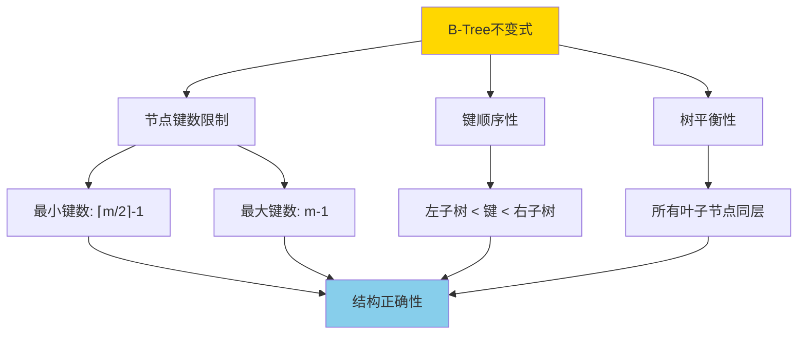
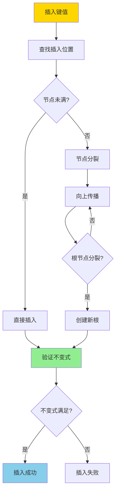
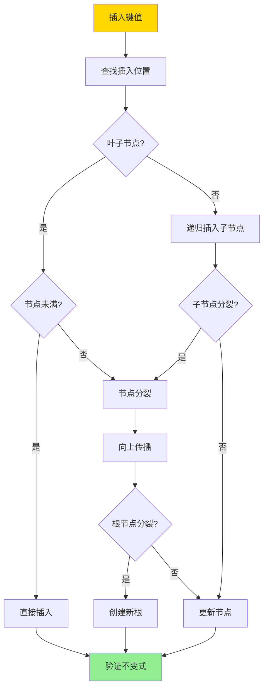
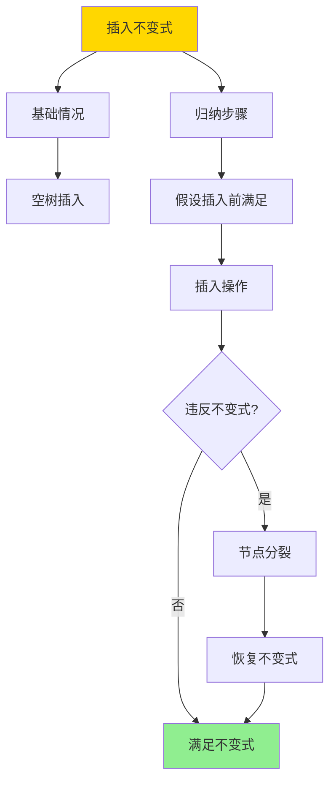

# BTree插入不变式-严格归纳证明

> **文档版本**: v1.0
> **最后更新**: 2025-01-16
> **版本覆盖**: PostgreSQL 18.x (推荐) ⭐ | 17.x (推荐) | 16.x (兼容)
> **文档状态**: 🟡 框架已创建，内容待完善

---

## 📋 目录

- [BTree插入不变式-严格归纳证明](#btree插入不变式-严格归纳证明)
  - [📋 目录](#-目录)
  - [1. 概述](#1-概述)
    - [1.0 B-Tree插入不变式工作原理概述](#10-b-tree插入不变式工作原理概述)
    - [1.1 本文档的范围](#11-本文档的范围)
  - [2. 核心内容](#2-核心内容)
    - [2.1 B-Tree插入算法](#21-b-tree插入算法)
    - [2.2 不变式维护](#22-不变式维护)
  - [3. 形式化定义](#3-形式化定义)
    - [3.1 插入操作形式化](#31-插入操作形式化)
    - [3.2 不变式形式化](#32-不变式形式化)
  - [4. 定理与证明](#4-定理与证明)
    - [4.1 插入不变式定理](#41-插入不变式定理)
  - [5. 实际应用](#5-实际应用)
    - [5.1 PostgreSQL B-Tree插入](#51-postgresql-b-tree插入)
  - [6. 相关文档](#6-相关文档)
    - [6.1 理论基础文档](#61-理论基础文档)
  - [7. 参考文献](#7-参考文献)
    - [7.1 核心理论文献](#71-核心理论文献)
    - [7.2 形式化证明相关](#72-形式化证明相关)
    - [7.3 PostgreSQL实现相关](#73-postgresql实现相关)
    - [7.4 相关文档](#74-相关文档)

---

## 1. 概述

### 1.0 B-Tree插入不变式工作原理概述

**B-Tree不变式**：

B-Tree的不变式是保证B-Tree正确性的关键性质。插入操作必须维护这些不变式，否则B-Tree的结构会被破坏，导致查询结果错误。

**B-Tree不变式**：



**插入操作流程**：



### 1.1 本文档的范围

本文档涵盖：

- **不变式定义**：B-Tree不变式的严格数学定义
- **插入算法**：B-Tree插入操作的算法描述
- **归纳证明**：使用数学归纳法严格证明插入操作维护不变式
- **正确性保证**：证明插入操作的正确性

---

## 2. 核心内容

### 2.1 B-Tree插入算法

**插入算法**：

```haskell
-- B-Tree插入
insert :: BTree -> Key -> Value -> BTree
insert tree key value =
    let (newTree, split) = insertNode(tree.root, key, value)
    in if split then
        createNewRoot(newTree)
    else
        newTree

-- 节点插入
insertNode :: Node -> Key -> Value -> (Node, Bool)
insertNode node key value =
    if isLeaf(node) then
        insertIntoLeaf(node, key, value)
    else
        let (child, split) = insertNode(findChild(node, key), key, value)
        in if split then
            splitNode(node, child)
        else
            (updateChild(node, child), False)
```

**插入流程**：



### 2.2 不变式维护

**不变式维护策略**：

| 不变式 | 维护方法 | 验证时机 |
|--------|---------|---------|
| **键数限制** | 节点分裂 | 插入后 |
| **键顺序** | 有序插入 | 插入时 |
| **树平衡** | 分裂传播 | 分裂后 |

---

## 3. 形式化定义

### 3.1 插入操作形式化

**插入操作**：

```haskell
-- 插入操作形式化
insert(T, k, v) =
    let T' = insertIntoTree(T, k, v)
    in
        if violatesInvariant(T') then
            fixInvariant(T')
        else
            T'
```

### 3.2 不变式形式化

**不变式**：

```haskell
-- 不变式形式化
Invariant(T) =
    forall node n in T:
        ⌈m/2⌉ - 1 <= |n.keys| <= m - 1
        and
        keys(n) are sorted
        and
        all leaves at same level
```

---

## 4. 定理与证明

### 4.1 插入不变式定理

**定理**：B-Tree插入操作维护所有不变式。

**归纳证明**：

**基础情况**：空树插入后满足不变式。

**归纳步骤**：

1. 假设插入前树满足不变式
2. 插入操作可能违反键数限制
3. 节点分裂恢复键数限制
4. 分裂可能向上传播，但最终恢复不变式
5. 因此插入后树仍满足不变式

**证明树**：



---

## 5. 实际应用

### 5.1 PostgreSQL B-Tree插入

**B-Tree维护**：

```sql
-- 插入数据（自动维护B-Tree）
INSERT INTO accounts (id, name, balance)
VALUES (1, 'Alice', 1000.00);

-- 查看索引使用
EXPLAIN SELECT * FROM accounts WHERE id = 1;
-- 显示使用B-Tree索引

-- 监控索引膨胀
SELECT
    schemaname,
    tablename,
    indexname,
    pg_size_pretty(pg_relation_size(indexrelid)) AS index_size
FROM pg_stat_user_indexes
WHERE indexname LIKE 'idx_%';
```

---

## 6. 相关文档

### 6.1 理论基础文档

- [形式语言与证明：总论](./1.1.25-形式语言与证明-总论.md)
- [理论基础导航](./README.md)

---

## 7. 参考文献

### 7.1 核心理论文献

- **Bayer, R., & McCreight, E. (1972). "Organization and Maintenance of Large Ordered Indexes."**
  - 会议: Acta Informatica 1972
  - **重要性**: B-Tree数据结构的经典论文
  - **核心贡献**: 提出了B-Tree数据结构和插入算法

- **Comer, D. (1979). "The Ubiquitous B-Tree."**
  - 会议: ACM Computing Surveys 1979
  - **重要性**: B-Tree的综述性论文
  - **核心贡献**: 系统阐述了B-Tree的性质和操作

### 7.2 形式化证明相关

- **Leis, V., et al. (2013). "The Adaptive Radix Tree: ARTful Indexing for Main-Memory Databases."**
  - 会议: ICDE 2013
  - **重要性**: 现代索引结构的形式化分析
  - **核心贡献**: 提供了索引结构形式化分析的方法

### 7.3 PostgreSQL实现相关

- **PostgreSQL官方文档 - B-Tree索引](<https://www.postgresql.org/docs/current/btree.html>)**
  - PostgreSQL B-Tree索引实现说明

### 7.4 相关文档

- [索引结构正确性-BTree_GiST_GiN不变式与证明](./05.02-索引结构正确性-BTree_GiST_GiN不变式与证明.md)
- [理论基础导航](../README.md)

---

**最后更新**: 2025-01-16
**维护者**: Documentation Team
**状态**: 🟡 框架已创建，内容待完善
