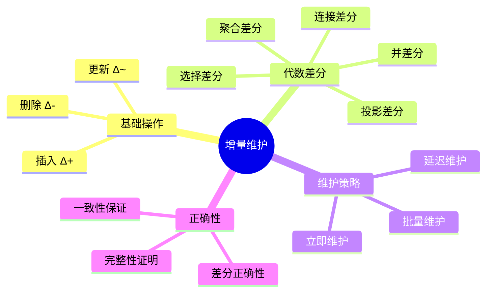
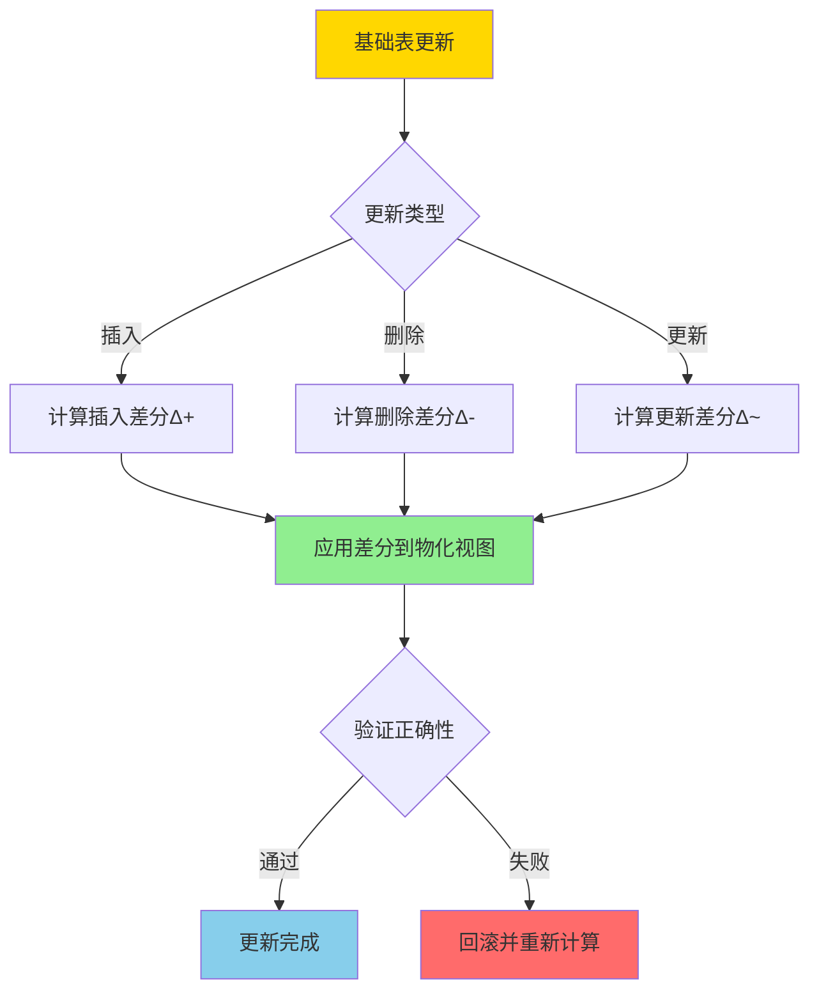
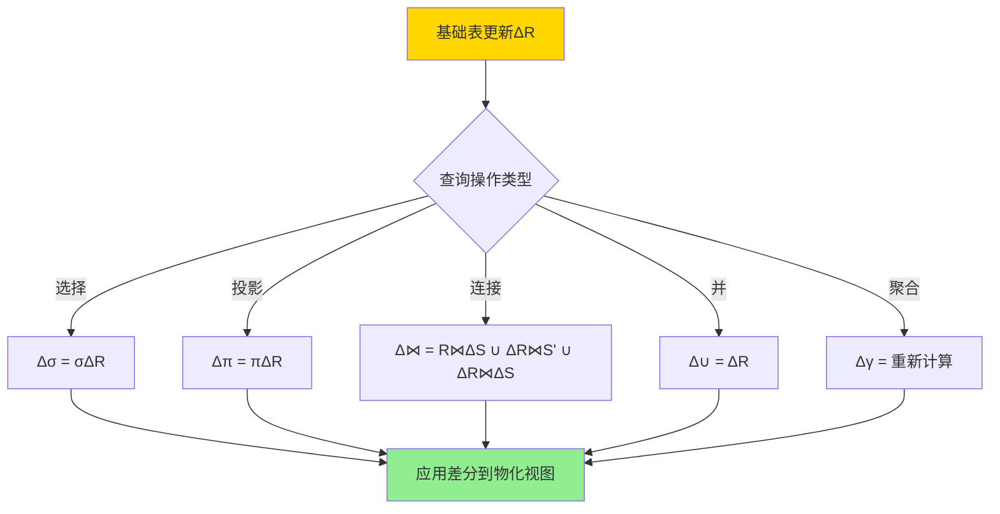
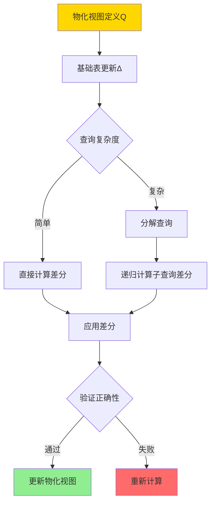

# 增量物化视图-代数差分与正确性

> **文档版本**: v1.0
> **最后更新**: 2025-01-16
> **版本覆盖**: PostgreSQL 18.x (推荐) ⭐ | 17.x (推荐) | 16.x (兼容)
> **文档状态**: 🟡 框架已创建，内容待完善

---

## 📋 目录

- [增量物化视图-代数差分与正确性](#增量物化视图-代数差分与正确性)
  - [📋 目录](#-目录)
  - [1. 概述](#1-概述)
    - [1.0 增量物化视图工作原理概述](#10-增量物化视图工作原理概述)
    - [1.1 本文档的范围](#11-本文档的范围)
  - [2. 核心内容](#2-核心内容)
    - [2.1 代数差分](#21-代数差分)
    - [2.2 增量维护算法](#22-增量维护算法)
    - [2.3 正确性保证](#23-正确性保证)
  - [3. 形式化定义](#3-形式化定义)
    - [3.1 代数差分形式化](#31-代数差分形式化)
    - [3.2 增量维护形式化](#32-增量维护形式化)
    - [3.3 正确性形式化](#33-正确性形式化)
  - [4. 定理与证明](#4-定理与证明)
    - [4.1 选择差分正确性定理](#41-选择差分正确性定理)
    - [4.2 连接差分正确性定理](#42-连接差分正确性定理)
  - [5. 实际应用](#5-实际应用)
    - [5.1 PostgreSQL增量刷新](#51-postgresql增量刷新)
    - [5.2 增量维护优化](#52-增量维护优化)
    - [5.3 正确性验证](#53-正确性验证)
  - [6. 相关文档](#6-相关文档)
    - [6.1 理论基础文档](#61-理论基础文档)
  - [7. 参考文献](#7-参考文献)
    - [7.1 核心理论文献](#71-核心理论文献)
    - [7.2 增量维护相关](#72-增量维护相关)
    - [7.3 PostgreSQL实现相关](#73-postgresql实现相关)
    - [7.4 相关文档](#74-相关文档)

---

## 1. 概述

### 1.0 增量物化视图工作原理概述

**增量维护**：

增量物化视图维护通过计算数据变化的差分（Delta）来更新物化视图，而不是重新计算整个视图。本文档提供代数差分方法的形式化定义和正确性证明。

**增量维护架构思维导图**：



**增量维护决策树**：



**维护策略对比矩阵**：

| 策略 | 延迟 | 一致性 | 性能 | 适用场景 |
|------|------|--------|------|---------|
| **立即维护** | 低 | 强 | 中 | 实时查询 |
| **延迟维护** | 高 | 弱 | 高 | 批量更新 |
| **批量维护** | 中 | 中 | 高 | 定期刷新 |

### 1.1 本文档的范围

本文档涵盖：

- **代数差分**：选择、投影、连接等操作的差分计算
- **差分正确性**：增量维护的正确性证明
- **维护算法**：增量维护的算法和复杂度
- **实际应用**：PostgreSQL物化视图的增量刷新

---

## 2. 核心内容

### 2.1 代数差分

**基本差分操作**：

```haskell
-- 插入差分
Δ+ :: Relation -> Relation -> Relation
Δ+(R, R') = R' - R  -- 新增的元组

-- 删除差分
Δ- :: Relation -> Relation -> Relation
Δ-(R, R') = R - R'  -- 删除的元组

-- 更新差分
Δ~ :: Relation -> Relation -> (Relation, Relation)
Δ~(R, R') = (Δ-(R, R'), Δ+(R, R'))  -- (删除, 插入)
```

**选择操作的差分**：

```haskell
-- 选择差分
Δ(σ_cond(R)) = σ_cond(Δ(R))

-- 证明
σ_cond(R') = σ_cond(R ∪ Δ+(R, R') - Δ-(R, R'))
          = σ_cond(R) ∪ σ_cond(Δ+(R, R')) - σ_cond(Δ-(R, R'))
```

**连接操作的差分**：

```haskell
-- 连接差分
Δ(R ⋈ S) = (R' ⋈ S') - (R ⋈ S)
         = (R ⋈ ΔS) ∪ (ΔR ⋈ S') ∪ (ΔR ⋈ ΔS)
```

**代数差分计算流程图**：



### 2.2 增量维护算法

**增量维护流程**：

```haskell
-- 增量维护算法
incrementalMaintain :: MaterializedView -> Delta -> MaterializedView
incrementalMaintain MV Δ =
    let ΔMV = computeDelta MV.definition Δ
    in MV ∪ ΔMV+ - ΔMV-
```

**维护算法决策树**：



### 2.3 正确性保证

**正确性条件**：

```haskell
-- 增量维护正确性
correctness :: MaterializedView -> Delta -> Bool
correctness MV Δ =
    let MV' = incrementalMaintain MV Δ
        MV'' = recompute MV.definition (applyDelta MV.base Δ)
    in MV' = MV''
```

---

## 3. 形式化定义

### 3.1 代数差分形式化

**差分定义**：

```haskell
-- 关系差分
Δ(R, R') = (Δ+(R, R'), Δ-(R, R'))

其中:
  Δ+(R, R') = R' - R  -- 插入的元组
  Δ-(R, R') = R - R'  -- 删除的元组
```

### 3.2 增量维护形式化

**增量维护语义**：

```haskell
-- 增量维护
MV' = MV ⊕ Δ

其中:
  MV' = Q(R')  -- 更新后的物化视图
  MV = Q(R)    -- 当前的物化视图
  Δ = (Δ+, Δ-) -- 基础表的差分
  ⊕ 是增量更新操作
```

### 3.3 正确性形式化

**正确性条件**：

```haskell
-- 增量维护正确性
correct(MV, Δ) iff
    Q(R') = (Q(R) ⊕ Δ) = Q(R ∪ Δ+ - Δ-)
```

---

## 4. 定理与证明

### 4.1 选择差分正确性定理

**定理**：选择操作的差分计算是正确的。

**证明树**：

```mermaid
graph TD
    A[选择差分正确性] --> B[引理: σ_cond(R ∪ Δ) = σ_cond(R) ∪ σ_cond(Δ)]
    B --> C[证明: σ_cond(R') = σ_cond(R ∪ Δ+ - Δ-)]
    C --> D[展开: σ_cond(R) ∪ σ_cond(Δ+) - σ_cond(Δ-)]
    D --> E[即: σ_cond(R) ⊕ σ_cond(Δ)]
    E --> F[定理得证]

    style A fill:#FFD700
    style F fill:#90EE90
```

**证明**：

1. 设R' = R ∪ Δ+ - Δ-
2. σ_cond(R') = σ_cond(R ∪ Δ+ - Δ-)
3. 由于选择操作是单调的：σ_cond(R ∪ Δ+ - Δ-) = σ_cond(R) ∪ σ_cond(Δ+) - σ_cond(Δ-)
4. 因此σ_cond(R') = σ_cond(R) ⊕ σ_cond(Δ)
5. 因此选择差分计算正确

### 4.2 连接差分正确性定理

**定理**：连接操作的差分计算是正确的。

**证明**：

1. 设R' = R ∪ ΔR+, S' = S ∪ ΔS+
2. R' ⋈ S' = (R ∪ ΔR+) ⋈ (S ∪ ΔS+)
3. 展开：R ⋈ S ∪ R ⋈ ΔS+ ∪ ΔR+ ⋈ S ∪ ΔR+ ⋈ ΔS+
4. 因此Δ(R ⋈ S) = R ⋈ ΔS+ ∪ ΔR+ ⋈ S' ∪ ΔR+ ⋈ ΔS+
5. 因此连接差分计算正确

---

## 5. 实际应用

### 5.1 PostgreSQL增量刷新

**物化视图增量刷新**：

```sql
-- 创建物化视图
CREATE MATERIALIZED VIEW mv_order_summary AS
SELECT
    customer_id,
    COUNT(*) as order_count,
    SUM(total) as total_amount
FROM orders
GROUP BY customer_id;

-- 增量刷新（PostgreSQL 13+）
REFRESH MATERIALIZED VIEW CONCURRENTLY mv_order_summary;

-- PostgreSQL会：
-- 1. 计算基础表的差分
-- 2. 应用差分到物化视图
-- 3. 验证正确性
```

**增量刷新流程**：

```sql
-- PostgreSQL增量刷新步骤
-- 1. 创建临时唯一索引
CREATE UNIQUE INDEX ON mv_order_summary (customer_id);

-- 2. 计算差分
-- INSERT差分
INSERT INTO mv_order_summary
SELECT customer_id, COUNT(*), SUM(total)
FROM new_orders
GROUP BY customer_id
ON CONFLICT (customer_id) DO UPDATE
SET order_count = mv_order_summary.order_count + EXCLUDED.order_count,
    total_amount = mv_order_summary.total_amount + EXCLUDED.total_amount;

-- DELETE差分
DELETE FROM mv_order_summary
WHERE customer_id IN (
    SELECT customer_id FROM deleted_orders
);
```

### 5.2 增量维护优化

**批量增量维护**：

```sql
-- 批量处理多个更新
BEGIN;

-- 收集所有差分
CREATE TEMP TABLE delta_orders AS
SELECT * FROM orders WHERE updated_at > last_refresh_time;

-- 应用差分
REFRESH MATERIALIZED VIEW CONCURRENTLY mv_order_summary;

COMMIT;
```

### 5.3 正确性验证

**验证增量维护正确性**：

```sql
-- 验证增量维护结果
WITH incremental_result AS (
    SELECT * FROM mv_order_summary
),
full_recompute AS (
    SELECT
        customer_id,
        COUNT(*) as order_count,
        SUM(total) as total_amount
    FROM orders
    GROUP BY customer_id
)
SELECT
    COUNT(*) as diff_count
FROM incremental_result i
FULL OUTER JOIN full_recompute f
    ON i.customer_id = f.customer_id
WHERE i.order_count != f.order_count
   OR i.total_amount != f.total_amount;

-- 如果diff_count = 0，则增量维护正确
```

---

## 6. 相关文档

### 6.1 理论基础文档

- [可自维护物化视图-可维护性判据与构造](./05.08-可自维护物化视图-可维护性判据与构造.md)
- [物化视图选择-查询重写等价与代价界](./05.07-物化视图选择-查询重写等价与代价界.md)
- [理论基础导航](../README.md)

---

## 7. 参考文献

### 7.1 核心理论文献

- **Griffin, T., & Libkin, L. (1995). "Incremental Maintenance of Views with Duplicates."**
  - 会议: SIGMOD 1995
  - **重要性**: 增量视图维护的经典论文
  - **核心贡献**: 提出了增量维护的代数差分方法

- **Gupta, A., & Mumick, I. S. (1995). "Maintenance of Materialized Views: Problems, Techniques, and Applications."**
  - 会议: IEEE Data Engineering Bulletin 1995
  - **重要性**: 物化视图维护的综述性论文
  - **核心贡献**: 系统阐述了增量维护技术

### 7.2 增量维护相关

- **Zhuge, Y., et al. (1995). "View Maintenance in a Warehousing Environment."**
  - 会议: SIGMOD 1995
  - **重要性**: 数据仓库中的视图维护
  - **核心贡献**: 提供了增量维护的优化方法

### 7.3 PostgreSQL实现相关

- **[PostgreSQL官方文档 - 物化视图](<https://www.postgresql.org/docs/current/sql-creatematerializedview.html>)**
  - PostgreSQL物化视图实现说明

### 7.4 相关文档

- [可自维护物化视图-可维护性判据与构造](./05.08-可自维护物化视图-可维护性判据与构造.md)
- [物化视图选择-查询重写等价与代价界](./05.07-物化视图选择-查询重写等价与代价界.md)
- [理论基础导航](../README.md)

---

**最后更新**: 2025-01-16
**维护者**: Documentation Team
**状态**: 🟡 框架已创建，内容待完善
