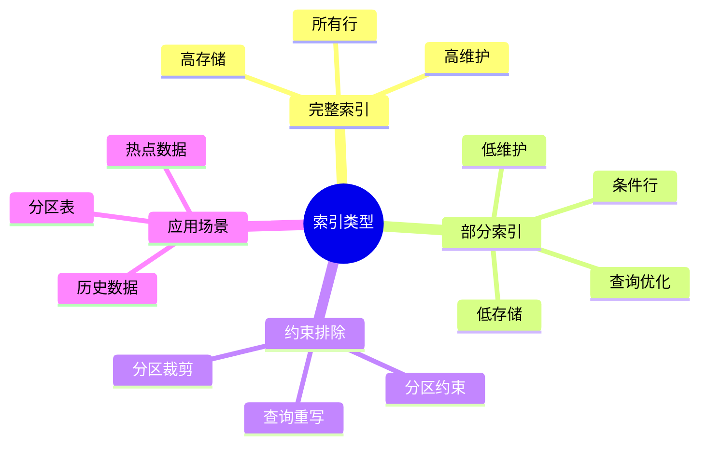
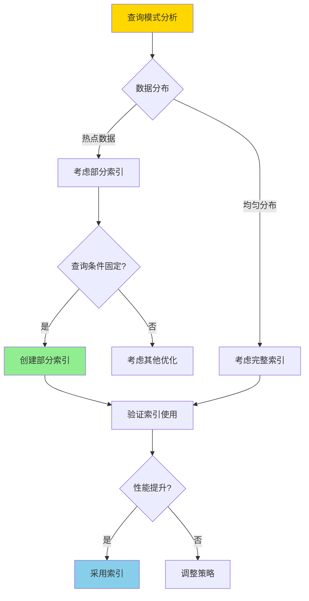
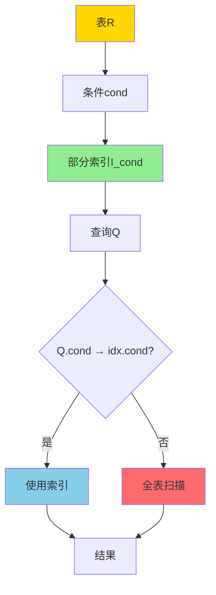
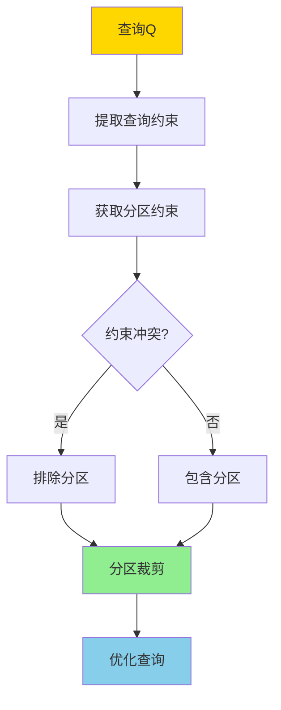

# 部分索引与约束排除-语义与正确性

> **文档版本**: v1.0
> **最后更新**: 2025-01-16
> **版本覆盖**: PostgreSQL 18.x (推荐) ⭐ | 17.x (推荐) | 16.x (兼容)
> **文档状态**: 🟡 框架已创建，内容待完善

---

## 📋 目录

- [部分索引与约束排除-语义与正确性](#部分索引与约束排除-语义与正确性)
  - [📋 目录](#-目录)
  - [1. 概述](#1-概述)
    - [1.0 部分索引与约束排除工作原理概述](#10-部分索引与约束排除工作原理概述)
    - [1.1 本文档的范围](#11-本文档的范围)
  - [2. 核心内容](#2-核心内容)
    - [2.1 部分索引语义](#21-部分索引语义)
    - [2.2 约束排除](#22-约束排除)
    - [2.3 正确性条件](#23-正确性条件)
  - [3. 形式化定义](#3-形式化定义)
    - [3.1 部分索引形式化](#31-部分索引形式化)
    - [3.2 约束排除形式化](#32-约束排除形式化)
    - [3.3 正确性形式化](#33-正确性形式化)
  - [4. 定理与证明](#4-定理与证明)
    - [4.1 部分索引正确性定理](#41-部分索引正确性定理)
    - [4.2 约束排除正确性定理](#42-约束排除正确性定理)
  - [5. 实际应用](#5-实际应用)
    - [5.1 PostgreSQL部分索引](#51-postgresql部分索引)
    - [5.2 约束排除](#52-约束排除)
    - [5.3 组合优化](#53-组合优化)
  - [6. 相关文档](#6-相关文档)
    - [6.1 理论基础文档](#61-理论基础文档)
  - [7. 参考文献](#7-参考文献)
    - [7.1 核心理论文献](#71-核心理论文献)
    - [7.2 约束排除相关](#72-约束排除相关)
    - [7.3 相关文档](#73-相关文档)

---

## 1. 概述

### 1.0 部分索引与约束排除工作原理概述

**部分索引**：

部分索引只对满足特定条件的行建立索引，可以显著减少索引大小和维护代价。约束排除（Constraint Exclusion）利用表约束来排除不相关的分区。

**索引类型对比思维导图**：



**部分索引选择决策树**：



**索引策略对比矩阵**：

| 策略 | 索引大小 | 维护代价 | 查询性能 | 适用场景 |
|------|---------|---------|---------|---------|
| **完整索引** | 大 | 高 | 高 | 所有查询 |
| **部分索引** | 小 | 低 | 中高 | 条件查询 |
| **无索引** | 无 | 无 | 低 | 很少查询 |

### 1.1 本文档的范围

本文档涵盖：

- **部分索引**：部分索引的语义和正确性
- **约束排除**：约束排除的查询重写和分区裁剪
- **正确性证明**：部分索引和约束排除的正确性证明
- **实际应用**：PostgreSQL部分索引和分区表优化

---

## 2. 核心内容

### 2.1 部分索引语义

**部分索引定义**：

```haskell
-- 部分索引
PartialIndex(R, cond) = {
    (t, index_entry) | t ∈ R, cond(t) = TRUE
}

-- 部分索引查询
queryWithPartialIndex :: Query -> PartialIndex -> Result
queryWithPartialIndex Q idx =
    if Q.condition implies idx.condition then
        useIndex(idx, Q)
    else
        fullScan(Q)
```

**部分索引语义图**：



### 2.2 约束排除

**约束排除定义**：

```haskell
-- 约束排除
constraintExclusion :: Query -> [Partition] -> [Partition]
constraintExclusion Q partitions =
    filter (canSatisfy Q.constraint) partitions

-- 分区约束满足
canSatisfy :: Constraint -> PartitionConstraint -> Bool
canSatisfy Q P =
    not (Q.constraint ∧ P.constraint is unsatisfiable)
```

**约束排除流程**：



### 2.3 正确性条件

**部分索引正确性**：

```haskell
-- 部分索引正确性
correctPartialIndex :: PartialIndex -> Query -> Bool
correctPartialIndex idx Q =
    if Q.condition implies idx.condition then
        result(Q, useIndex(idx)) = result(Q, fullScan)
    else
        True  -- 不使用索引，正确性由全表扫描保证
```

---

## 3. 形式化定义

### 3.1 部分索引形式化

**部分索引定义**：

```haskell
-- 部分索引
I_cond(R) = {(t, index_entry) | t ∈ R, cond(t)}

-- 部分索引查询
SELECT * FROM R WHERE Q_cond(DB) =
    if Q_cond → cond then
        {t | t ∈ I_cond(R), Q_cond(t)}
    else
        {t | t ∈ R, Q_cond(t)}
```

### 3.2 约束排除形式化

**约束排除语义**：

```haskell
-- 分区表
PartitionedTable = {P1, P2, ..., Pn}

-- 约束排除
exclude(Q, PartitionedTable) =
    {Pi | Pi ∈ PartitionedTable,
          Q.constraint ∧ Pi.constraint is satisfiable}
```

### 3.3 正确性形式化

**正确性条件**：

```haskell
-- 部分索引正确性
correct(I_cond, Q) iff
    Q with I_cond(DB) = Q without I_cond(DB)

-- 约束排除正确性
correct(exclude, Q) iff
    Q on excluded partitions(DB) = ∅
```

---

## 4. 定理与证明

### 4.1 部分索引正确性定理

**定理**：如果查询条件蕴含部分索引条件，则使用部分索引的结果与全表扫描等价。

**证明**：

1. 设部分索引I_cond，查询条件Q_cond
2. 如果Q_cond → cond，则满足Q_cond的行都满足cond
3. 因此满足Q_cond的行都在部分索引I_cond中
4. 因此使用I_cond查询的结果与全表扫描等价

### 4.2 约束排除正确性定理

**定理**：约束排除不会遗漏相关分区。

**证明**：

1. 约束排除只排除约束冲突的分区
2. 如果分区约束与查询约束冲突，则分区中无满足查询的行
3. 因此排除这些分区不会影响查询结果
4. 因此约束排除正确

---

## 5. 实际应用

### 5.1 PostgreSQL部分索引

**创建部分索引**：

```sql
-- 部分索引：只索引活跃订单
CREATE INDEX idx_active_orders
ON orders(order_date)
WHERE status = 'active';

-- 查询可以使用部分索引
SELECT * FROM orders
WHERE order_date > '2024-01-01'
  AND status = 'active';
-- 使用idx_active_orders

-- 查询不能使用部分索引
SELECT * FROM orders
WHERE order_date > '2024-01-01';
-- 不使用idx_active_orders，因为status条件不满足
```

**部分索引优势**：

```sql
-- 场景：大部分订单是历史订单，只有少量活跃订单
-- 完整索引：索引所有订单，存储大，维护慢
CREATE INDEX idx_all_orders ON orders(order_date);

-- 部分索引：只索引活跃订单，存储小，维护快
CREATE INDEX idx_active_orders
ON orders(order_date)
WHERE status = 'active' AND order_date > '2024-01-01';
```

### 5.2 约束排除

**分区表约束排除**：

```sql
-- 创建分区表
CREATE TABLE orders (
    id SERIAL,
    order_date DATE,
    amount DECIMAL
) PARTITION BY RANGE (order_date);

CREATE TABLE orders_2024_q1 PARTITION OF orders
FOR VALUES FROM ('2024-01-01') TO ('2024-04-01');

CREATE TABLE orders_2024_q2 PARTITION OF orders
FOR VALUES FROM ('2024-04-01') TO ('2024-07-01');

-- 查询时自动排除不相关分区
SELECT * FROM orders
WHERE order_date BETWEEN '2024-01-15' AND '2024-02-20';
-- 只扫描orders_2024_q1分区，排除orders_2024_q2

-- 查看执行计划验证约束排除
EXPLAIN (ANALYZE, BUFFERS)
SELECT * FROM orders
WHERE order_date BETWEEN '2024-01-15' AND '2024-02-20';
```

### 5.3 组合优化

**部分索引 + 约束排除**：

```sql
-- 在分区上创建部分索引
CREATE INDEX idx_recent_orders
ON orders_2024_q1(order_date)
WHERE order_date > '2024-01-15';

-- 查询优化：
-- 1. 约束排除：只扫描orders_2024_q1
-- 2. 部分索引：使用idx_recent_orders
SELECT * FROM orders
WHERE order_date BETWEEN '2024-01-20' AND '2024-02-20';
```

---

## 6. 相关文档

### 6.1 理论基础文档

- [索引选择与代价模型-多目标优化的Pareto最优性](./05.12-索引选择与代价模型-多目标优化的Pareto最优性.md)
- [表分区与分区裁剪-语义与等价](./05.06-表分区与分区裁剪-语义与等价.md)
- [理论基础导航](../README.md)

---

## 7. 参考文献

### 7.1 核心理论文献

- **O'Neil, P., & O'Neil, E. (2001). "Database: Principles, Programming, and Performance."**
  - 出版社: Morgan Kaufmann
  - **重要性**: 数据库索引的经典教材
  - **核心贡献**: 系统阐述了部分索引技术

- **PostgreSQL官方文档 - 部分索引](<https://www.postgresql.org/docs/current/indexes-partial.html>)**
  - PostgreSQL部分索引实现说明

### 7.2 约束排除相关

- **[PostgreSQL官方文档 - 分区](<https://www.postgresql.org/docs/current/ddl-partitioning.html>)**
  - PostgreSQL分区表和约束排除说明

### 7.3 相关文档

- [索引选择与代价模型-多目标优化的Pareto最优性](./05.12-索引选择与代价模型-多目标优化的Pareto最优性.md)
- [表分区与分区裁剪-语义与等价](./05.06-表分区与分区裁剪-语义与等价.md)
- [理论基础导航](../README.md)

---

**最后更新**: 2025-01-16
**维护者**: Documentation Team
**状态**: 🟡 框架已创建，内容待完善
