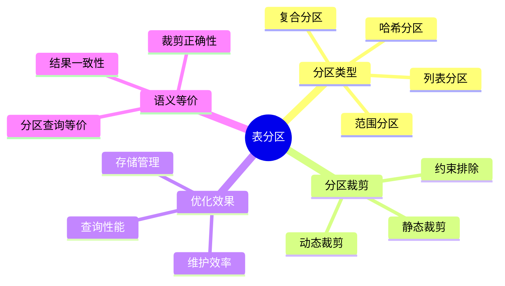
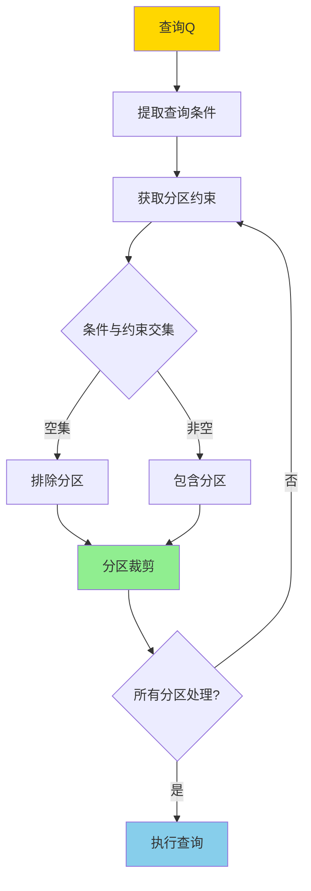
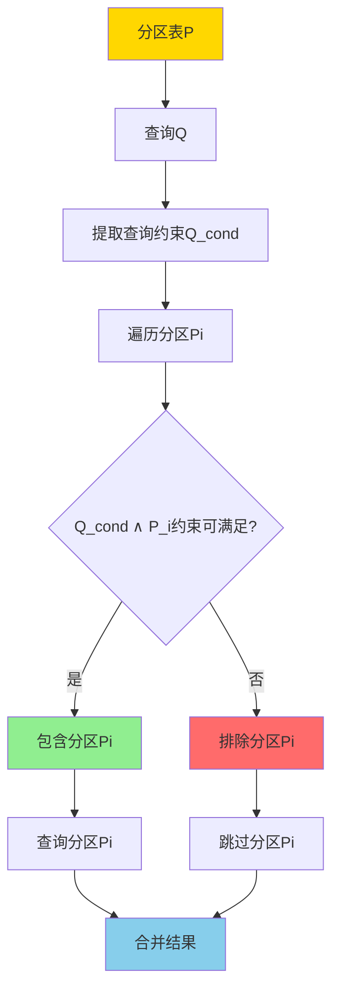
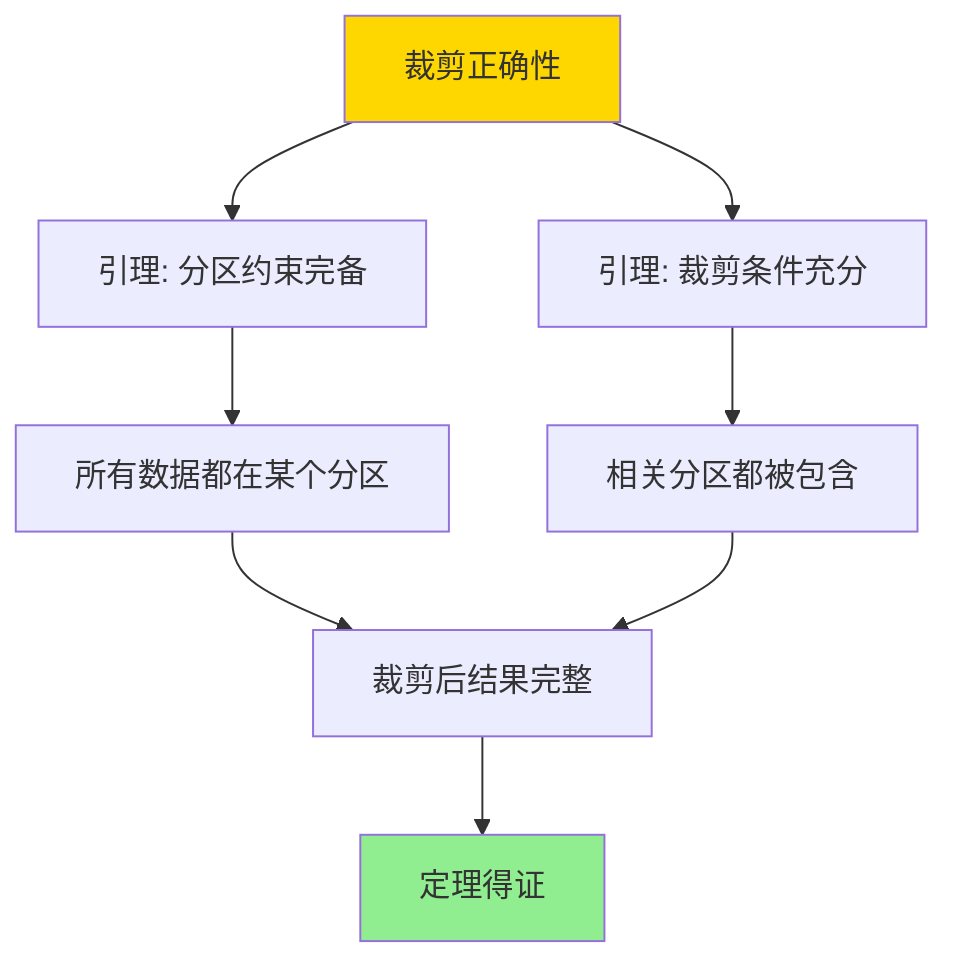

# 表分区与分区裁剪-语义与等价

> **文档版本**: v1.0
> **最后更新**: 2025-01-16
> **版本覆盖**: PostgreSQL 18.x (推荐) ⭐ | 17.x (推荐) | 16.x (兼容)
> **文档状态**: 🟡 框架已创建，内容待完善

---

## 📋 目录

- [表分区与分区裁剪-语义与等价](#表分区与分区裁剪-语义与等价)
  - [📋 目录](#-目录)
  - [1. 概述](#1-概述)
    - [1.0 表分区与分区裁剪工作原理概述](#10-表分区与分区裁剪工作原理概述)
    - [1.1 本文档的范围](#11-本文档的范围)
  - [2. 核心内容](#2-核心内容)
    - [2.1 分区语义](#21-分区语义)
    - [2.2 分区裁剪算法](#22-分区裁剪算法)
    - [2.3 语义等价](#23-语义等价)
  - [3. 形式化定义](#3-形式化定义)
    - [3.1 分区形式化](#31-分区形式化)
    - [3.2 分区裁剪形式化](#32-分区裁剪形式化)
    - [3.3 等价性形式化](#33-等价性形式化)
  - [4. 定理与证明](#4-定理与证明)
    - [4.1 分区裁剪正确性定理](#41-分区裁剪正确性定理)
    - [4.2 分区查询等价性定理](#42-分区查询等价性定理)
  - [5. 实际应用](#5-实际应用)
    - [5.1 PostgreSQL分区表](#51-postgresql分区表)
    - [5.2 列表分区](#52-列表分区)
    - [5.3 复合分区](#53-复合分区)
  - [6. 相关文档](#6-相关文档)
    - [6.1 理论基础文档](#61-理论基础文档)
  - [7. 参考文献](#7-参考文献)
    - [7.1 核心理论文献](#71-核心理论文献)
    - [7.2 PostgreSQL实现相关](#72-postgresql实现相关)
    - [7.3 相关文档](#73-相关文档)

---

## 1. 概述

### 1.0 表分区与分区裁剪工作原理概述

**表分区**：

表分区将大表分割成多个较小的分区，每个分区可以独立管理和查询。分区裁剪（Partition Pruning）通过查询条件排除不相关的分区，提升查询性能。

**分区策略思维导图**：



**分区裁剪决策树**：



**分区策略对比矩阵**：

| 分区策略 | 适用场景 | 裁剪效果 | 维护复杂度 |
|---------|---------|---------|-----------|
| **范围分区** | 时间序列、数值范围 | 高 | 中 |
| **列表分区** | 离散值、类别 | 高 | 低 |
| **哈希分区** | 均匀分布 | 低 | 低 |
| **复合分区** | 复杂场景 | 高 | 高 |

### 1.1 本文档的范围

本文档涵盖：

- **分区语义**：分区表查询的语义定义
- **分区裁剪**：分区裁剪的算法和正确性
- **语义等价**：分区查询与未分区查询的等价性
- **实际应用**：PostgreSQL分区表的优化

---

## 2. 核心内容

### 2.1 分区语义

**分区表定义**：

```haskell
-- 分区表
PartitionedTable = {
    P1: {t | t ∈ R, constraint1(t)},
    P2: {t | t ∈ R, constraint2(t)},
    ...
    Pn: {t | t ∈ R, constraintn(t)}
}

-- 分区约束互斥且完备
forall i ≠ j: constrainti ∧ constraintj = FALSE
constraint1 ∨ constraint2 ∨ ... ∨ constraintn = TRUE
```

**分区查询语义**：

```haskell
-- 分区查询
queryPartitioned :: Query -> PartitionedTable -> Result
queryPartitioned Q PT =
    union [query(Q, Pi) | Pi <- relevantPartitions(Q, PT)]

-- 相关分区
relevantPartitions :: Query -> PartitionedTable -> [Partition]
relevantPartitions Q PT =
    [Pi | Pi <- PT, Q.constraint ∧ Pi.constraint is satisfiable]
```

**分区裁剪流程**：



### 2.2 分区裁剪算法

**静态裁剪**：

```haskell
-- 静态分区裁剪（编译时）
staticPruning :: Query -> PartitionedTable -> [Partition]
staticPruning Q PT =
    filter (canSatisfy Q.constraint) PT
    where
        canSatisfy Q_cond P_cond =
            not (Q_cond ∧ P_cond is unsatisfiable)
```

**动态裁剪**：

```haskell
-- 动态分区裁剪（运行时）
dynamicPruning :: Query -> PartitionedTable -> [Partition]
dynamicPruning Q PT =
    filter (satisfiesAtRuntime Q) PT
    where
        satisfiesAtRuntime Q P =
            evaluate(Q.constraint ∧ P.constraint) ≠ FALSE
```

**裁剪策略对比矩阵**：

| 策略 | 时机 | 精度 | 开销 | 适用场景 |
|------|------|------|------|---------|
| **静态裁剪** | 编译时 | 高 | 低 | 常量条件 |
| **动态裁剪** | 运行时 | 中 | 中 | 参数化查询 |
| **混合裁剪** | 编译+运行 | 最高 | 高 | 复杂查询 |

### 2.3 语义等价

**等价性定义**：

```haskell
-- 分区查询等价
Q(PartitionedTable) ≡ Q(UnpartitionedTable) iff
    forall DB: Q on PartitionedTable(DB) = Q on UnpartitionedTable(DB)
```

---

## 3. 形式化定义

### 3.1 分区形式化

**分区表定义**：

```haskell
-- 分区表
R = P1 ∪ P2 ∪ ... ∪ Pn

-- 分区约束
forall i: Pi = {t | t ∈ R, constrainti(t)}
forall i ≠ j: constrainti ∧ constraintj = FALSE
```

### 3.2 分区裁剪形式化

**裁剪语义**：

```haskell
-- 分区裁剪
prune(Q, PartitionedTable) =
    {Pi | Pi ∈ PartitionedTable,
          Q.constraint ∧ Pi.constraint is satisfiable}

-- 裁剪后查询
Q on PartitionedTable(DB) =
    ∪{Q on Pi(DB) | Pi ∈ prune(Q, PartitionedTable)}
```

### 3.3 等价性形式化

**语义等价**：

```haskell
-- 分区查询等价
Q(R) ≡ Q(P1 ∪ P2 ∪ ... ∪ Pn) iff
    Q(R) = ∪{Q(Pi) | Pi ∈ relevantPartitions(Q)}
```

---

## 4. 定理与证明

### 4.1 分区裁剪正确性定理

**定理**：分区裁剪不会遗漏相关数据。

**证明树**：



**证明**：

1. 分区约束完备：R = P1 ∪ P2 ∪ ... ∪ Pn
2. 裁剪条件：只排除约束冲突的分区
3. 如果分区约束与查询约束冲突，则分区中无满足查询的数据
4. 因此排除这些分区不会遗漏数据
5. 因此分区裁剪正确

### 4.2 分区查询等价性定理

**定理**：分区查询与未分区查询等价。

**证明**：

1. 分区表R = P1 ∪ P2 ∪ ... ∪ Pn
2. Q(R) = Q(P1 ∪ P2 ∪ ... ∪ Pn)
3. 由于查询是集合操作，Q(P1 ∪ ... ∪ Pn) = Q(P1) ∪ ... ∪ Q(Pn)
4. 因此分区查询与未分区查询等价

---

## 5. 实际应用

### 5.1 PostgreSQL分区表

**创建分区表**：

```sql
-- 范围分区
CREATE TABLE orders (
    id SERIAL,
    order_date DATE,
    amount DECIMAL
) PARTITION BY RANGE (order_date);

CREATE TABLE orders_2024_q1 PARTITION OF orders
FOR VALUES FROM ('2024-01-01') TO ('2024-04-01');

CREATE TABLE orders_2024_q2 PARTITION OF orders
FOR VALUES FROM ('2024-04-01') TO ('2024-07-01');

-- 查询自动裁剪
SELECT * FROM orders
WHERE order_date BETWEEN '2024-01-15' AND '2024-02-20';
-- 只扫描orders_2024_q1分区
```

**分区裁剪验证**：

```sql
-- 查看执行计划验证分区裁剪
EXPLAIN (ANALYZE, BUFFERS)
SELECT * FROM orders
WHERE order_date BETWEEN '2024-01-15' AND '2024-02-20';

-- 输出显示：
-- Seq Scan on orders_2024_q1
-- (注意：只扫描q1分区，q2分区被排除)
```

### 5.2 列表分区

**列表分区示例**：

```sql
-- 列表分区
CREATE TABLE customers (
    id SERIAL,
    country VARCHAR(50),
    name VARCHAR(100)
) PARTITION BY LIST (country);

CREATE TABLE customers_us PARTITION OF customers
FOR VALUES IN ('USA', 'Canada');

CREATE TABLE customers_eu PARTITION OF customers
FOR VALUES IN ('UK', 'Germany', 'France');

-- 查询自动裁剪
SELECT * FROM customers
WHERE country = 'USA';
-- 只扫描customers_us分区
```

### 5.3 复合分区

**子分区示例**：

```sql
-- 主分区：按日期
-- 子分区：按地区
CREATE TABLE sales (
    id SERIAL,
    sale_date DATE,
    region VARCHAR(50),
    amount DECIMAL
) PARTITION BY RANGE (sale_date);

CREATE TABLE sales_2024 PARTITION OF sales
FOR VALUES FROM ('2024-01-01') TO ('2025-01-01')
PARTITION BY LIST (region);

CREATE TABLE sales_2024_us PARTITION OF sales_2024
FOR VALUES IN ('USA', 'Canada');

-- 查询可以裁剪两级分区
SELECT * FROM sales
WHERE sale_date BETWEEN '2024-06-01' AND '2024-06-30'
  AND region = 'USA';
-- 只扫描sales_2024_us分区
```

---

## 6. 相关文档

### 6.1 理论基础文档

- [部分索引与约束排除-语义与正确性](./05.05-部分索引与约束排除-语义与正确性.md)
- [数据库分区策略-负载均衡与查询优化的权衡](./05.14-数据库分区策略-负载均衡与查询优化的权衡.md)
- [理论基础导航](../README.md)

---

## 7. 参考文献

### 7.1 核心理论文献

- **Zhou, J., et al. (2007). "Efficient Query Processing for Multi-Dimensional Clustering in SQL Server."**
  - 会议: VLDB 2007
  - **重要性**: 分区查询优化的经典研究
  - **核心贡献**: 提供了分区裁剪的优化方法

- **Graefe, G. (2003). "Partitioned Tables and Indexes."**
  - 会议: SIGMOD 2003 Tutorial
  - **重要性**: 分区表的经典教程
  - **核心贡献**: 系统阐述了分区技术

### 7.2 PostgreSQL实现相关

- **[PostgreSQL官方文档 - 分区](<https://www.postgresql.org/docs/current/ddl-partitioning.html>)**
  - PostgreSQL分区表实现说明

- **[PostgreSQL官方文档 - 分区裁剪](<https://www.postgresql.org/docs/current/ddl-partitioning.html#DDL-PARTITION-PRUNING>)**
  - PostgreSQL分区裁剪说明

### 7.3 相关文档

- [部分索引与约束排除-语义与正确性](./05.05-部分索引与约束排除-语义与正确性.md)
- [数据库分区策略-负载均衡与查询优化的权衡](./05.14-数据库分区策略-负载均衡与查询优化的权衡.md)
- [理论基础导航](../README.md)

---

**最后更新**: 2025-01-16
**维护者**: Documentation Team
**状态**: 🟡 框架已创建，内容待完善
