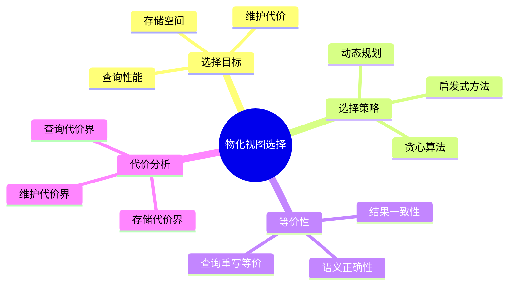
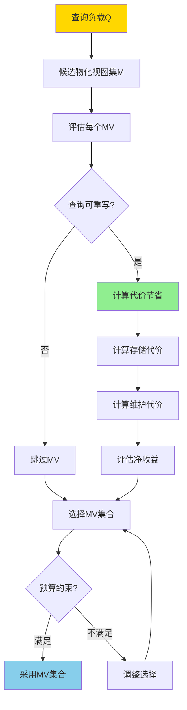
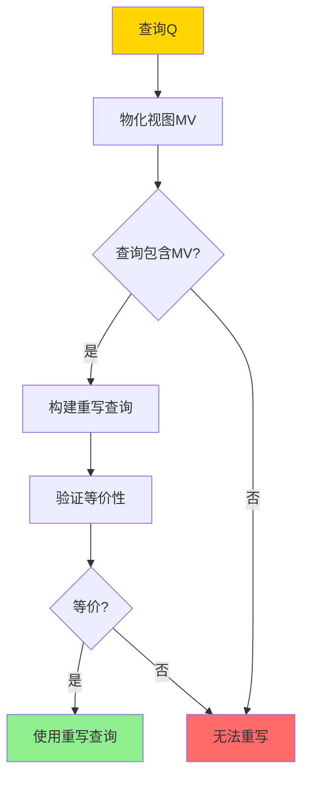

# 物化视图选择-查询重写等价与代价界

> **文档版本**: v1.0
> **最后更新**: 2025-01-16
> **版本覆盖**: PostgreSQL 18.x (推荐) ⭐ | 17.x (推荐) | 16.x (兼容)
> **文档状态**: 🟡 框架已创建，内容待完善

---

## 📋 目录

- [物化视图选择-查询重写等价与代价界](#物化视图选择-查询重写等价与代价界)
  - [📋 目录](#-目录)
  - [1. 概述](#1-概述)
    - [1.0 物化视图选择工作原理概述](#10-物化视图选择工作原理概述)
    - [1.1 本文档的范围](#11-本文档的范围)
  - [2. 核心内容](#2-核心内容)
    - [2.1 查询重写等价](#21-查询重写等价)
    - [2.2 代价界](#22-代价界)
    - [2.3 选择算法](#23-选择算法)
  - [3. 形式化定义](#3-形式化定义)
    - [3.1 查询重写形式化](#31-查询重写形式化)
    - [3.2 代价界形式化](#32-代价界形式化)
    - [3.3 选择问题形式化](#33-选择问题形式化)
  - [4. 定理与证明](#4-定理与证明)
    - [4.1 查询重写等价性定理](#41-查询重写等价性定理)
    - [4.2 代价界定理](#42-代价界定理)
  - [5. 实际应用](#5-实际应用)
    - [5.1 PostgreSQL物化视图选择](#51-postgresql物化视图选择)
    - [5.2 代价分析](#52-代价分析)
    - [5.3 物化视图选择优化](#53-物化视图选择优化)
  - [6. 相关文档](#6-相关文档)
    - [6.1 理论基础文档](#61-理论基础文档)
  - [7. 参考文献](#7-参考文献)
    - [7.1 核心理论文献](#71-核心理论文献)
    - [7.2 查询重写相关](#72-查询重写相关)
    - [7.3 PostgreSQL实现相关](#73-postgresql实现相关)
    - [7.4 相关文档](#74-相关文档)

---

## 1. 概述

### 1.0 物化视图选择工作原理概述

**物化视图选择**：

物化视图选择是在多个候选物化视图中选择最优集合，以最大化查询性能提升，同时最小化存储和维护代价。本文档提供查询重写等价性和代价界的理论。

**物化视图选择思维导图**：



**物化视图选择决策树**：



**物化视图选择策略对比矩阵**：

| 策略 | 复杂度 | 最优性 | 适用场景 |
|------|--------|--------|---------|
| **贪心算法** | O(n²) | 近似最优 | 大规模问题 |
| **动态规划** | O(2^n) | 最优 | 小规模问题 |
| **启发式方法** | O(n log n) | 近似最优 | 实时选择 |

### 1.1 本文档的范围

本文档涵盖：

- **查询重写等价**：物化视图查询重写的等价性判定
- **代价界**：查询代价、存储代价、维护代价的上界
- **选择算法**：物化视图选择的算法和优化
- **实际应用**：PostgreSQL物化视图的选择和优化

---

## 2. 核心内容

### 2.1 查询重写等价

**查询重写定义**：

```haskell
-- 查询重写
rewrite :: Query -> MaterializedView -> Maybe Query
rewrite Q MV =
    if canRewrite Q MV then
        Just (rewriteQuery Q MV)
    else
        Nothing

-- 重写等价性
rewriteEquivalent :: Query -> MaterializedView -> Bool
rewriteEquivalent Q MV =
    forall DB: Q(DB) = rewrite Q MV(DB)
```

**查询重写流程**：



### 2.2 代价界

**代价函数**：

```haskell
-- 查询代价
queryCost :: Query -> MaterializedView -> Cost
queryCost Q MV =
    if canUse MV then
        cost(rewrite Q MV)  -- 使用MV的代价
    else
        cost(Q)  -- 原始查询代价

-- 代价节省
costSaving :: Query -> MaterializedView -> Cost
costSaving Q MV =
    cost(Q) - queryCost(Q, MV)
```

**代价界分析**：

```haskell
-- 查询代价上界
queryCostBound :: Query -> MaterializedView -> Cost
queryCostBound Q MV =
    -- 使用MV的代价上界
    scanCost(MV) + filterCost(Q.condition) + projectCost(Q.attributes)

-- 存储代价上界
storageCostBound :: MaterializedView -> Cost
storageCostBound MV =
    size(MV) * storageUnitCost

-- 维护代价上界
maintenanceCostBound :: MaterializedView -> UpdateRate -> Cost
maintenanceCostBound MV rate =
    rate * incrementalMaintenanceCost(MV)
```

### 2.3 选择算法

**贪心选择算法**：

```haskell
-- 贪心物化视图选择
greedyMVSelection :: [Query] -> [MaterializedView] -> Budget -> [MaterializedView]
greedyMVSelection queries candidates budget =
    let sorted = sortBy benefitPerCost candidates
        selected = []
        remaining = budget
    in foldl select [] sorted
    where
        select acc mv =
            if cost(mv) ≤ remaining && benefit(mv) > 0 then
                acc ++ [mv]
            else
                acc
```

---

## 3. 形式化定义

### 3.1 查询重写形式化

**重写语义**：

```haskell
-- 查询重写
Q' = rewrite(Q, MV) iff
    Q' uses MV and
    forall DB: Q(DB) = Q'(DB)
```

### 3.2 代价界形式化

**代价上界**：

```haskell
-- 查询代价上界
cost(Q, MV) ≤ cost_bound(Q, MV)

其中:
  cost_bound(Q, MV) =
    scan_cost(MV) +
    filter_cost(Q.condition) +
    project_cost(Q.attributes)
```

### 3.3 选择问题形式化

**物化视图选择问题**：

```haskell
-- 最大化收益
maximize Σ benefit(Q, MV) for Q in queries, MV in selected
subject to:
    Σ cost(MV) ≤ budget
    forall Q: exists MV such that canRewrite(Q, MV)
```

---

## 4. 定理与证明

### 4.1 查询重写等价性定理

**定理**：如果查询Q可以使用物化视图MV重写，则重写后的查询与原始查询等价。

**证明**：

1. 查询重写保持查询语义
2. 物化视图MV是查询Q_MV的结果
3. 重写查询Q'使用MV，等价于使用Q_MV的结果
4. 如果Q包含Q_MV，则Q'与Q等价

### 4.2 代价界定理

**定理**：使用物化视图的查询代价上界是物化视图扫描代价加上过滤和投影代价。

**证明**：

1. 使用MV的查询需要扫描MV
2. 然后应用查询的过滤和投影
3. 因此总代价 ≤ scan_cost(MV) + filter_cost + project_cost

---

## 5. 实际应用

### 5.1 PostgreSQL物化视图选择

**创建物化视图**：

```sql
-- 分析查询模式
SELECT
    query,
    calls,
    total_exec_time
FROM pg_stat_statements
ORDER BY total_exec_time DESC
LIMIT 10;

-- 基于高频查询创建物化视图
CREATE MATERIALIZED VIEW mv_customer_orders AS
SELECT
    c.customer_id,
    c.customer_name,
    COUNT(o.order_id) as order_count,
    SUM(o.total) as total_amount
FROM customers c
JOIN orders o ON c.customer_id = o.customer_id
GROUP BY c.customer_id, c.customer_name;

-- 查询自动重写使用物化视图
SELECT
    customer_id,
    order_count,
    total_amount
FROM mv_customer_orders
WHERE customer_id = 123;
```

### 5.2 代价分析

**物化视图代价评估**：

```sql
-- 评估物化视图大小
SELECT
    pg_size_pretty(pg_total_relation_size('mv_customer_orders')) as size;

-- 评估查询性能提升
EXPLAIN (ANALYZE, BUFFERS)
-- 原始查询
SELECT
    c.customer_id,
    COUNT(o.order_id) as order_count,
    SUM(o.total) as total_amount
FROM customers c
JOIN orders o ON c.customer_id = o.customer_id
GROUP BY c.customer_id;

-- 使用物化视图
SELECT * FROM mv_customer_orders;

-- 对比执行时间和I/O
```

### 5.3 物化视图选择优化

**多物化视图选择**：

```sql
-- 场景：多个候选物化视图
CREATE MATERIALIZED VIEW mv_order_summary AS ...;
CREATE MATERIALIZED VIEW mv_product_sales AS ...;
CREATE MATERIALIZED VIEW mv_customer_stats AS ...;

-- 评估每个物化视图的收益
-- 考虑：
-- 1. 查询频率
-- 2. 查询性能提升
-- 3. 存储空间
-- 4. 维护代价

-- 选择最优集合（在预算约束下）
```

---

## 6. 相关文档

### 6.1 理论基础文档

- [增量物化视图-代数差分与正确性](./05.04-增量物化视图-代数差分与正确性.md)
- [可自维护物化视图-可维护性判据与构造](./05.08-可自维护物化视图-可维护性判据与构造.md)
- [理论基础导航](../README.md)

---

## 7. 参考文献

### 7.1 核心理论文献

- **Harinarayan, V., et al. (1996). "Implementing Data Cubes Efficiently."**
  - 会议: SIGMOD 1996
  - **重要性**: 物化视图选择的经典论文
  - **核心贡献**: 提出了物化视图选择的贪心算法

- **Chaudhuri, S., & Narasayya, V. (1997). "AutoAdmin 'What-if' Index Analysis Utility."**
  - 会议: SIGMOD 1997
  - **重要性**: 自动物化视图选择的经典研究
  - **核心贡献**: 提供了物化视图选择的代价模型

### 7.2 查询重写相关

- **Larson, P. A., & Yang, H. Z. (1985). "Computing Queries from Derived Relations."**
  - 会议: VLDB 1985
  - **重要性**: 查询重写的经典论文
  - **核心贡献**: 提出了物化视图查询重写的方法

### 7.3 PostgreSQL实现相关

- **[PostgreSQL官方文档 - 物化视图](<https://www.postgresql.org/docs/current/sql-creatematerializedview.html>)**
  - PostgreSQL物化视图实现说明

### 7.4 相关文档

- [增量物化视图-代数差分与正确性](./05.04-增量物化视图-代数差分与正确性.md)
- [可自维护物化视图-可维护性判据与构造](./05.08-可自维护物化视图-可维护性判据与构造.md)
- [理论基础导航](../README.md)

---

**最后更新**: 2025-01-16
**维护者**: Documentation Team
**状态**: 🟡 框架已创建，内容待完善
