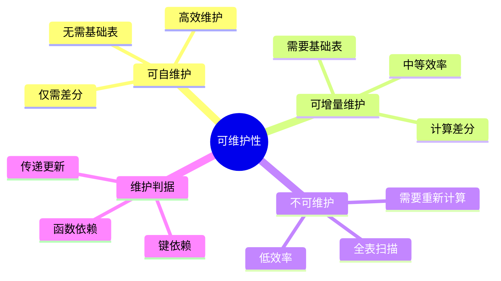
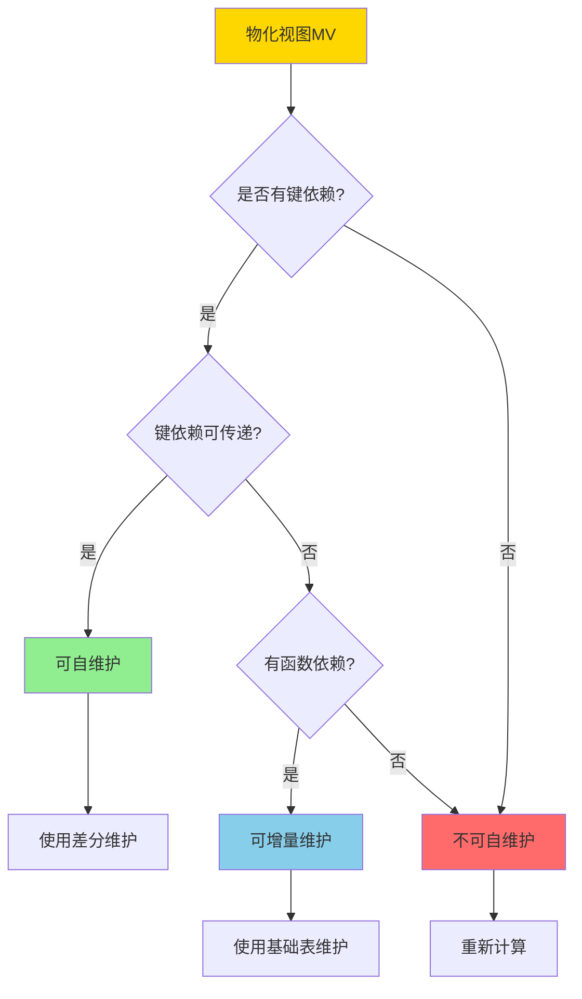
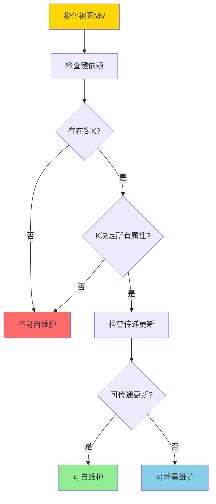
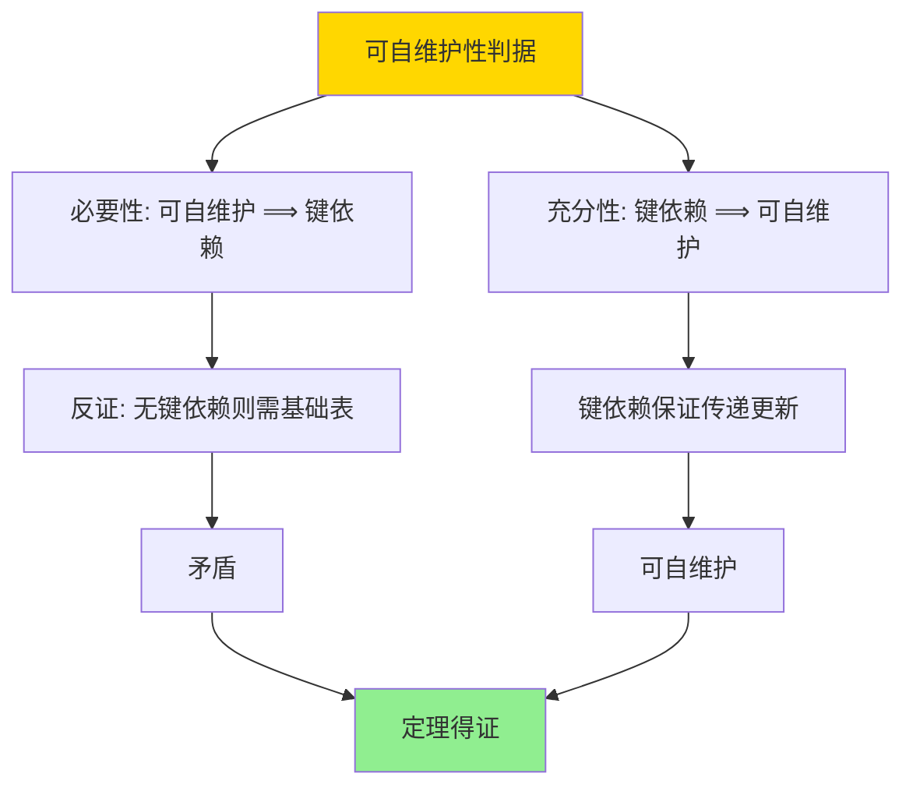

# 可自维护物化视图-可维护性判据与构造

> **文档版本**: v1.0
> **最后更新**: 2025-01-16
> **版本覆盖**: PostgreSQL 18.x (推荐) ⭐ | 17.x (推荐) | 16.x (兼容)
> **文档状态**: 🟡 框架已创建，内容待完善

---

## 📋 目录

- [可自维护物化视图-可维护性判据与构造](#可自维护物化视图-可维护性判据与构造)
  - [📋 目录](#-目录)
  - [1. 概述](#1-概述)
    - [1.0 可自维护物化视图工作原理概述](#10-可自维护物化视图工作原理概述)
    - [1.1 本文档的范围](#11-本文档的范围)
  - [2. 核心内容](#2-核心内容)
    - [2.1 可维护性判据](#21-可维护性判据)
    - [2.2 构造方法](#22-构造方法)
    - [2.3 传递更新](#23-传递更新)
  - [3. 形式化定义](#3-形式化定义)
    - [3.1 可维护性形式化](#31-可维护性形式化)
    - [3.2 键依赖形式化](#32-键依赖形式化)
    - [3.3 传递更新形式化](#33-传递更新形式化)
  - [4. 定理与证明](#4-定理与证明)
    - [4.1 可自维护性判据定理](#41-可自维护性判据定理)
    - [4.2 传递更新正确性定理](#42-传递更新正确性定理)
  - [5. 实际应用](#5-实际应用)
    - [5.1 PostgreSQL可自维护视图](#51-postgresql可自维护视图)
    - [5.2 可维护性检测](#52-可维护性检测)
    - [5.3 构造可自维护视图](#53-构造可自维护视图)
  - [6. 相关文档](#6-相关文档)
    - [6.1 理论基础文档](#61-理论基础文档)
  - [7. 参考文献](#7-参考文献)
    - [7.1 核心理论文献](#71-核心理论文献)
    - [7.2 可维护性相关](#72-可维护性相关)
    - [7.3 PostgreSQL实现相关](#73-postgresql实现相关)
    - [7.4 相关文档](#74-相关文档)

---

## 1. 概述

### 1.0 可自维护物化视图工作原理概述

**可自维护性**：

可自维护物化视图是指仅通过物化视图本身和基础表的更新差分就能维护的物化视图，不需要访问基础表的完整数据。

**可维护性分类思维导图**：



**可维护性判定决策树**：



**维护方式对比矩阵**：

| 维护方式 | 需要基础表 | 维护效率 | 复杂度 | 适用场景 |
|---------|-----------|---------|--------|---------|
| **可自维护** | 否 | 极高 | 低 | 键依赖视图 |
| **可增量维护** | 是 | 高 | 中 | 一般视图 |
| **不可维护** | 是 | 低 | 高 | 复杂视图 |

### 1.1 本文档的范围

本文档涵盖：

- **可维护性判据**：可自维护物化视图的判定条件
- **构造方法**：构造可自维护物化视图的方法
- **正确性证明**：可自维护性的正确性证明
- **实际应用**：PostgreSQL物化视图的可维护性

---

## 2. 核心内容

### 2.1 可维护性判据

**键依赖判据**：

```haskell
-- 键依赖
keyDependency :: MaterializedView -> Bool
keyDependency MV =
    exists key K such that:
      K is key of MV and
      K determines all attributes of MV

-- 可自维护性
selfMaintainable :: MaterializedView -> Bool
selfMaintainable MV =
    keyDependency(MV) &&
    forall update Δ: canMaintain(MV, Δ) without base table
```

**可维护性判定流程**：



### 2.2 构造方法

**可自维护视图构造**：

```haskell
-- 构造可自维护视图
constructSelfMaintainable :: Query -> MaterializedView
constructSelfMaintainable Q =
    let key = findKey(Q)
        attributes = key ++ computedAttributes(Q)
    in MaterializedView {
        definition = Q,
        key = key,
        attributes = attributes
    }
```

**构造策略对比矩阵**：

| 构造策略 | 方法 | 可维护性 | 存储开销 |
|---------|------|---------|---------|
| **键投影** | 投影键属性 | 高 | 低 |
| **键聚合** | 键+聚合函数 | 高 | 中 |
| **键连接** | 键+连接属性 | 中 | 高 |

### 2.3 传递更新

**传递更新规则**：

```haskell
-- 传递更新
transitiveUpdate :: MaterializedView -> Delta -> MaterializedView
transitiveUpdate MV Δ =
    if keyDependency(MV) then
        -- 通过键依赖传递更新
        updateByKey(MV, Δ)
    else
        error "Not self-maintainable"
```

---

## 3. 形式化定义

### 3.1 可维护性形式化

**可自维护性定义**：

```haskell
-- 可自维护性
selfMaintainable(MV) iff
    exists key K such that:
      K → all attributes of MV and
      forall update Δ: MV' = maintain(MV, Δ) can be computed
                       using only MV and Δ
```

### 3.2 键依赖形式化

**键依赖**：

```haskell
-- 键依赖
K → MV.attributes iff
    forall t1, t2 ∈ MV:
      if t1[K] = t2[K] then t1 = t2
```

### 3.3 传递更新形式化

**传递更新语义**：

```haskell
-- 传递更新
MV' = MV ⊕ Δ iff
    MV' = {t | t ∈ MV, t[K] ∉ Δ-.keys} ∪
          {t | t ∈ Δ+, t[K] ∈ MV.keys} ∪
          {t | t ∈ Δ+, t[K] ∉ MV.keys}
```

---

## 4. 定理与证明

### 4.1 可自维护性判据定理

**定理**：物化视图可自维护当且仅当存在键依赖。

**证明树**：



**证明**：

1. **必要性**：如果MV可自维护，则可以通过差分更新，这要求存在键来识别元组
2. **充分性**：如果存在键依赖K→attributes，则可以通过键匹配来更新MV，无需访问基础表

### 4.2 传递更新正确性定理

**定理**：基于键依赖的传递更新是正确的。

**证明**：

1. 键依赖保证每个键值唯一对应一个元组
2. 更新通过键匹配，保证更新的正确性
3. 因此传递更新正确

---

## 5. 实际应用

### 5.1 PostgreSQL可自维护视图

**创建可自维护物化视图**：

```sql
-- 可自维护视图：键+聚合
CREATE MATERIALIZED VIEW mv_customer_stats AS
SELECT
    customer_id,  -- 键
    COUNT(*) as order_count,
    SUM(total) as total_amount,
    AVG(total) as avg_amount
FROM orders
GROUP BY customer_id;  -- customer_id是键

-- 增量维护（可自维护）
-- 插入新订单
INSERT INTO orders (customer_id, total) VALUES (123, 100);
-- 维护MV：通过customer_id更新
UPDATE mv_customer_stats
SET
    order_count = order_count + 1,
    total_amount = total_amount + 100,
    avg_amount = (total_amount + 100) / (order_count + 1)
WHERE customer_id = 123;
```

### 5.2 可维护性检测

**检测可维护性**：

```sql
-- 检查物化视图是否有键
SELECT
    conname as constraint_name,
    contype as constraint_type
FROM pg_constraint
WHERE conrelid = 'mv_customer_stats'::regclass
  AND contype = 'p';  -- 主键约束

-- 如果有主键，视图可能可自维护
-- 验证：检查是否所有属性都依赖于键
```

### 5.3 构造可自维护视图

**设计可自维护视图**：

```sql
-- 策略1: 键投影（可自维护）
CREATE MATERIALIZED VIEW mv_active_customers AS
SELECT DISTINCT customer_id  -- 键
FROM orders
WHERE status = 'active';

-- 策略2: 键聚合（可自维护）
CREATE MATERIALIZED VIEW mv_customer_summary AS
SELECT
    customer_id,  -- 键
    COUNT(*) as order_count,
    SUM(total) as total_amount
FROM orders
GROUP BY customer_id;

-- 策略3: 键连接（可能可自维护）
CREATE MATERIALIZED VIEW mv_customer_orders AS
SELECT
    c.customer_id,  -- 键
    c.customer_name,
    o.order_id,
    o.total
FROM customers c
JOIN orders o ON c.customer_id = o.customer_id;
-- 注意：如果customer_id是customers的主键，则可能可自维护
```

---

## 6. 相关文档

### 6.1 理论基础文档

- [增量物化视图-代数差分与正确性](./05.04-增量物化视图-代数差分与正确性.md)
- [可自维护物化视图-键依赖与传递更新的严格证明](./05.09-可自维护物化视图-键依赖与传递更新的严格证明.md)
- [理论基础导航](../README.md)

---

## 7. 参考文献

### 7.1 核心理论文献

- **Gupta, A., et al. (1993). "Maintaining Views Incrementally."**
  - 会议: SIGMOD 1993
  - **重要性**: 增量视图维护的经典论文
  - **核心贡献**: 提出了可自维护性的概念和判据

- **Blakeley, J. A., et al. (1986). "On the Correctness of Incremental Updates to Materialized Views."**
  - 会议: SIGMOD 1986
  - **重要性**: 物化视图增量更新的正确性研究
  - **核心贡献**: 提供了可维护性的判定条件

### 7.2 可维护性相关

- **Gupta, A., & Mumick, I. S. (1995). "Maintenance of Materialized Views: Problems, Techniques, and Applications."**
  - 会议: IEEE Data Engineering Bulletin 1995
  - **重要性**: 物化视图维护的综述
  - **核心贡献**: 系统阐述了可维护性理论

### 7.3 PostgreSQL实现相关

- **[PostgreSQL官方文档 - 物化视图](<https://www.postgresql.org/docs/current/sql-creatematerializedview.html>)**
  - PostgreSQL物化视图实现说明

### 7.4 相关文档

- [增量物化视图-代数差分与正确性](./05.04-增量物化视图-代数差分与正确性.md)
- [可自维护物化视图-键依赖与传递更新的严格证明](./05.09-可自维护物化视图-键依赖与传递更新的严格证明.md)
- [理论基础导航](../README.md)

---

**最后更新**: 2025-01-16
**维护者**: Documentation Team
**状态**: 🟡 框架已创建，内容待完善
